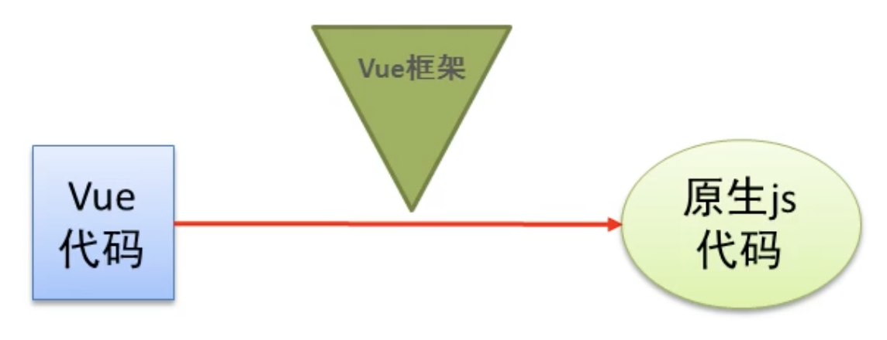
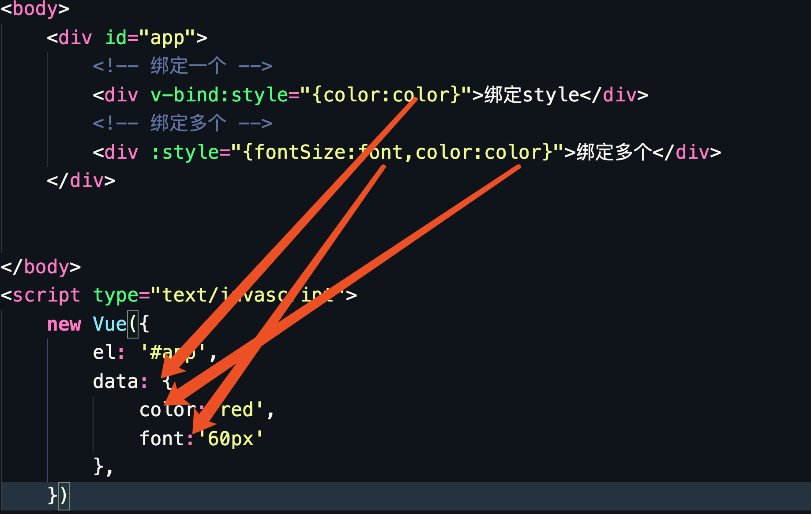
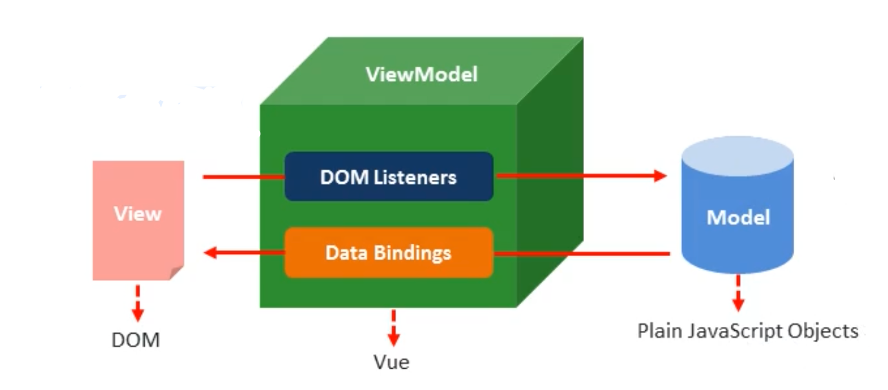

# Vuejs

## 一、Vue.js 是什么

> Vue (读音 /vjuː/，类似于 view) 是一套用于构建用户界面的渐进式框架。与其它大型框架不同的是，Vue 被设计为可以自底向上逐层应用。Vue 的核心库只关注视图层，不仅易于上手，还便于与第三方库或既有项目整合。另一方面，当与现代化的工具链以及各种支持类库结合使用时，Vue 也完全能够为复杂的单页应用提供驱动。

- 2014年诞生,2013年react,09年angularjs
- 作者 尤雨溪
- 核心概念: 组件化 双向数据流 (基于ES5中的defineProperty来实现的),IE9才支持
- angular核心： 模块化 双向数据绑定(脏检测:一个数组（$watch）)
  - 开发一个登陆的模块，登陆需要显示的头部、底部、中部
- vue组件:组合起来的一个部件（头部、底部、中部）
  - 细分代码
  - 头部: 页面、样式、动态效果
  - 代码: template style script
- 框架对比，建议学完vue再看
- https://cn.vuejs.org/v2/guide/comparison.html#React

### 1、数据流

- js内存属性发生改变，影响页面的变化
- 页面的改变影响js内存属性的改变

### 2、引入

```js
<script src="https://cdn.jsdelivr.net/npm/vue/dist/vue.js"></script>
```

### 3、NPM

在用 Vue 构建大型应用时推荐使用 NPM 安装。NPM 能很好地和诸如 [webpack](https://webpack.js.org/) 或 [Browserify](http://browserify.org/) 模块打包器配合使用。同时 Vue 也提供配套工具来开发[单文件组件](https://cn.vuejs.org/v2/guide/single-file-components.html)。

```
# 最新稳定版
$ npm install vue
```

## 二、第一个vue程序

```none
<html>
    <head>
        <meta charset="utf-8">
        <title></title>
        <!--引入-->
        <script src="lib/vue.js" type="text/javascript" charset="utf-8"></script>
    </head>
    <body>
        <div id="app">{{msg}}</div>
        <script type="text/javascript">
        <!--当我们导入包之后，在浏览器的内存中，就多了一个vue构造函数-->
            var vm = new Vue({
                el:'#app',//表示当前我们new的这个vue实例，要控制哪个区域
                data:{//存放的是el中用到的数据
                    msg:'hello vue.js'
                }
            })
        </script>
    </body>
</html>
```

vue就是帮我们减少DOM操作，让我们更关注于逻辑层，所以vue框架不提倡操作DOM元素

我们通过`{{}}`插值表达式获取数据

```none
<div id="app">{{msg}}</div>
这段代码算view层

new 出来vm对象就是调用层

data就相当于model层，数据层（后端的dao层）
```

vue运行原理（vue语法 ->vue.js -> 原生js）



## 三、指令

##### 常用指令

- v-text 是元素的innerText只能在双标签中使用
- v-html 是元素的innerHTML，不能包含
- v-if 元素是否移除或者插入
- v-show 元素是否显示或隐藏
- v-model 双向数据绑定，v-bind是单向数据绑定(内存js改变影响页面)
- v-for 循环
- v-bind 绑定属性

### 1、v-text指令

```none
<h1 v-text="msg"></h1>  
```

效果一样，如果因网络问题，用户刷新页面会看到{{}}，但是用v-text不会看到闪烁问题，因为标签内没有插值表达式

```none
<div id="app">-----{{msg}}+++++</div> 
只会替换自己的占位符，不会把整个元素内容清空
<h1 v-text="msg"></h1>
<h1 v-text="msg">---+++</h1>    
会把内容覆盖元素中原本的内容,不能显示---+++
//下面代码必须放到#app里
<div>{{msg2}}</div>
data:{
    msg:'学习vue',
    msg2:'<h1>我是一个h1标签</h1>'
}

```


### 2、v-html指令

```none
<div v-html="msg2"></div>
解析成h1
```

区别：


### 3、v-if和v-show指令

```vue
<!DOCTYPE html>
<html lang='en'>

<head>
    <title></title>
    <meta charset='UTF-8'>
    <meta name='viewport' content='width=device-width, initial-scale=1'>
    <script src="https://cdn.jsdelivr.net/npm/vue/dist/vue.js"></script>
</head>

<body>
    <div id="app">

            <div v-if='isShow' style='widtn:100px;height:100px;background-color:red;'>
             v-if
            </div>
            <div v-show='isShow'>v-show</div>
    </div>

    <script type="text/javascript">
        var vm = new Vue({
            el: '#app',
            data: {
                isShow:false,
            }
        })
    </script>
</body>

</html>


```

- if把元素给我删除了，show只是加了display:none的样式
- if有较高的切换性能消耗
- show有较高的初始渲染消耗
- v-if
- v-else
- V-else-if

### 4、v-bind指令

v-bind 是vue中，提供的用于绑定属性的指令,v-bind指令的简写：直接写**：**就行

- 绑定class

```html
<!DOCTYPE html>
<html lang='en'>

<head>
    <title></title>
    <meta charset='UTF-8'>
    <meta name='viewport' content='width=device-width, initial-scale=1'>
    <script src="https://cdn.jsdelivr.net/npm/vue/dist/vue.js"></script>
    <style>
        .txtColor{
            color: red;
        }
        .size{
            font-size: 60px;
        }
    </style>
</head>

<body>
    <div id="app">
        <!-- 绑定一个 -->
        <div v-bind:class="color">绑定class</div>
        <!-- 绑定多个，用数组 -->
        <div :class="[color,font]">绑定多个</div>
        
         <!-- 直接绑定 -->
        <div :class="size">绑定多个</div>
    </div>


</body>
<script type="text/javascript">
    new Vue({
        el: '#app',
        data: {
            color:'txtColor',
            font:'size'
        },
    })
</script>

</html>
```

- 绑定style

```html
<!DOCTYPE html>
<html lang='en'>

<head>
    <title></title>
    <meta charset='UTF-8'>
    <meta name='viewport' content='width=device-width, initial-scale=1'>
    <script src="https://cdn.jsdelivr.net/npm/vue/dist/vue.js"></script>
    <style>
        .txtColor{
            color: red;
        }
        .size{
            font-size: 60px;
        }
    </style>
</head>

<body>
    <div id="app">
        <!-- 绑定一个 -->
        <div v-bind:style="{color:color}">绑定style</div>
        <!-- 绑定多个 -->
        <div :style="{fontSize:font,color:color}">绑定多个</div>
        <!-- 数组语法可以将多个样式对象应用到同一个元素 -->
        <div :style='[obj1,obj2]'>数组语法</div>
    </div>


</body>
<script type="text/javascript">
    new Vue({
        el: '#app',
        data: {
            color:'red',
            font:'60px',
            obj1:{
                color:'red',
                fontSize:'50px'
            },
            obj2:{
                background:'pink',
                marginTop:'100px'
            }

        },
    })
</script>

</html>
```



###5、v-on指令

当点击按钮时，输出一句话

```html
<!DOCTYPE html>
<html lang='en'>

<head>
    <title></title>
    <meta charset='UTF-8'>
    <meta name='viewport' content='width=device-width, initial-scale=1'>
    <script src="https://cdn.jsdelivr.net/npm/vue/dist/vue.js"></script>
    <style>
        .txtColor {
            color: red;
        }

        .size {
            font-size: 60px;
        }
    </style>
</head>

<body>
    <div id="app">
        <button v-on:click='show'>点我！！！</button>
    </div>


</body>
<script type="text/javascript">
    new Vue({
        el: '#app',
        data: {
            msg: '哈哈'
        },
        methods: {
            // show: function () {
            //     alert('来了，老弟！！！')
            // }
            show() {
                alert(this.msg)
            }
        },
    })
</script>

</html>
```

同理，也有其他事件 

v-on的缩写：就是@符号

**需要注意**

在vue实例中想要调用data里的属性或者methods里方法，都需要用this关键字访问，代表当前vm实例对象

```none
this.数据属性名
this.方法名 
进行访问
```

#### 5.1、跑马灯案列

```html
<!DOCTYPE html>
<html lang='en'>

<head>
    <title></title>
    <meta charset='UTF-8'>
    <meta name='viewport' content='width=device-width, initial-scale=1'>
    <script src="https://cdn.jsdelivr.net/npm/vue/dist/vue.js"></script>
    <style>
        .txtColor {
            color: red;
        }

        .size {
            font-size: 60px;
        }
    </style>
</head>

<body>
    <div id="app">
        <button @click="run">浪一下~~~</button>
        <button @click="stop">猥琐发育，别浪！！！</button>
        {{msg}}
    </div>


</body>
<script type="text/javascript">
    new Vue({
        el: '#app',
        data: {
            msg: '面对疾风吧！！！',
            time:null
        },
        methods: {
            run() {
                // 每次点击按钮，速度会变快，定时器会叠加
                clearInterval(this.time)
                this.time = setInterval(()=>{
                    // 截取第一个字-》 面
                    let start = this.msg.substring(0,1)
                    // 从第二个字开始，截取到最后 -》 对疾风吧！！！
                    let end = this.msg.substring(1)
                    // 重新拼接
                    this.msg = end+start
                },200)
            },
            stop(){
                clearInterval(this.time)
            }
        },
    })
</script>

</html>
```

#### 5.2、事件修饰符

- .stop阻止冒泡

- ```vue
  <!DOCTYPE html>
  <html lang='en'>
  <head>
      <title></title>
      <meta charset='UTF-8'>
      <meta name='viewport' content='width=device-width, initial-scale=1'>
      <script src="https://cdn.jsdelivr.net/npm/vue/dist/vue.js"></script>
      <style>
          .inner {
              width: 200px;
              height: 200px;
              background-color: pink;
          }
      </style>
  </head>
  <body>
      <div id='app'>
          <div class="inner" @click="div">
              <button @click="btn">inner btn</button>
          </div>
      </div>
      <script>
          var vm = new Vue({
              el:'#app',
              data:{
              },
              methods: {
                  div(){
                      console.log('div的点击事件')
                  },
                  btn(){
                      console.log('btn的点击事件')
                  }
              },
          })
      </script>
  </body>
  </html>
  ```

  - 点击按钮会触发冒泡，先执行btn点击事件，在执行div点击事件

    ```html
     <button @click.stop="btn">inner btn</button>
    ```

    阻止事件

- .prevent阻止默认事件

  - a链接有跳转默认的行为

    ```html
    <!DOCTYPE html>
    <html lang='en'>
    
    <head>
        <title></title>
        <meta charset='UTF-8'>
        <meta name='viewport' content='width=device-width, initial-scale=1'>
        <script src="https://cdn.jsdelivr.net/npm/vue/dist/vue.js"></script>
        <style>
            .inner {
                width: 200px;
                height: 200px;
                background-color: pink;
            }
        </style>
    </head>
    
    <body>
        <div id='app'>
            <div class="inner" @click="div">
                <button @click="btn">inner btn</button>
            </div>
            <a href="http://www.baidu.com" @click="go">baidu</a>
        </div>
        <script>
            var vm = new Vue({
                el: '#app',
                data: {
                },
                methods: {
                    div() {
                        console.log('div的点击事件')
                    },
                    btn() {
                        console.log('btn的点击事件')
                    },
                    go() {
                        console.log('go')
                    }
                },
            })
        </script>
    </body>
    
    </html>
    ```

    控制台打印后，直接刷新跳转到百度了

    ```html
     <a href="http://www.baidu.com" @click.prevent="go">baidu</a>
    ```

    只想打印结果，不跳转，阻止默认事件（submit事件也可以）

- .capture添加事件侦听器时使用事件捕获模式

  - 与冒泡相反，捕获机制，先触发最外层的时间，在触发里面的

    ```html
    <div id='app'>
            <div class="inner" @click.capture="div">
                <button @click="btn">inner btn</button>
            </div>
        </div>
        <script>
            var vm = new Vue({
                el:'#app',
                data:{
                },
                methods: {
                    div(){
                        console.log('div的点击事件')
                    },
                    btn(){
                        console.log('btn的点击事件')
                    }
                },
            })
        </script>
    ```

    

- .self只当事件在该元素本身（比如不是子元素）触发时触发回调

  ```html
  <div id='app'>
          <div class="inner" @click.self="div">
              <button @click="btn">inner btn</button>
          </div>
      </div>
      <script>
          var vm = new Vue({
              el:'#app',
              data:{
              },
              methods: {
                  div(){
                      console.log('div的点击事件')
                  },
                  btn(){
                      console.log('btn的点击事件')
                  }
              },
          })
      </script>
  ```

  只有点我自己才出发事件

- .once事件只触发一次

  ```html
   <a href="http://www.baidu.com" @click.prevent.once="go">baidu</a>
  ```

  默认阻止了一次，再点击后就能跳转了

- self和stop的区别

  - self只阻止当前元素的冒泡行为，不能阻止所有元素事件的冒泡行为

#### 5.3、按键修饰符

在监听键盘事件时，我们经常需要检查常见的键值。Vue 允许为 `v-on` 在监听键盘事件时添加按键修饰符：

```
<input v-on:keyup.enter="submit">

<!-- 缩写语法 -->
<input @keyup.enter="submit">
```

全部的按键别名：

- `.enter`
- `.tab`
- `.delete` (捕获“删除”和“退格”键)
- `.esc`
- `.space`
- `.up`
- `.down`
- `.left`
- `.right`

提交表时，按回车

```html
<!DOCTYPE html>
<html lang='en'>

<head>
    <title></title>
    <meta charset='UTF-8'>
    <meta name='viewport' content='width=device-width, initial-scale=1'>
    <script src="https://cdn.jsdelivr.net/npm/vue/dist/vue.js"></script>
</head>
<body>
    <div id="app">
        <form action="#">
            <input type="text">
            <br>
            <input type="password" @keyup.enter="submit">
            <input type="submit"  value="提交">
        </form>
    </div>

    <script type="text/javascript">
        var vm = new Vue({
            el: '#app',
            data: {
            },
            methods: {
                submit(){
                  alert("提交")
                }
            },
        });
    </script>
</body>

</html>
```

### 6、v-model指令

双向数据绑定,v-model只能用在表单元素中

**input \ select \ checkbox \ textarea**

```html
<!DOCTYPE html>
<html lang='en'>

<head>
    <title></title>
    <meta charset='UTF-8'>
    <meta name='viewport' content='width=device-width, initial-scale=1'>
    <script src="https://cdn.jsdelivr.net/npm/vue/dist/vue.js"></script>
    <style>
        .inner {
            width: 200px;
            height: 200px;
            background-color: pink;
        }
    </style>
</head>

<body>
    <div id='app'>
        {{msg}}
       <input type="text" v-model="msg">
    </div>
    <script>
        var vm = new Vue({
            el: '#app',
            data: {
                msg:'哈哈'
            },
        })
    </script>
</body>

</html>
```

#### 案列：计算器

```html
<!DOCTYPE html>
<html lang='en'>

<head>
    <title></title>
    <meta charset='UTF-8'>
    <meta name='viewport' content='width=device-width, initial-scale=1'>
    <script src="https://cdn.jsdelivr.net/npm/vue/dist/vue.js"></script>
</head>

<body>
    <div id='app'>
        <input type="text" name="" v-model="n1">
        <select v-model="opt">
            <option value="+">+</option>
            <option value="-">-</option>
            <option value="*">*</option>
            <option value="/">/</option>
        </select>
        <input type="" name="" v-model="n2">
        <button @click="btn">=</button>
        <input type="" name="" v-model="result">
    </div>
    <script>
        var vm = new Vue({
            el: '#app',
            data: {
                n1: '',
                n2: '',
                result: '',
                opt: '-'
            },
            methods: {
                btn() {
                    switch (this.opt) {
                        case '+':
                            this.result = +this.n1 + +this.n2;
                            break;
                        case '-':
                            this.result = +this.n1 - +this.n2;
                            break;
                        case '*':
                            this.result = +this.n1 * +this.n2;
                            break;
                        case '/':
                            this.result = +this.n1 / +this.n2;
                            break;
                        default:
                            break;
                    }
                }
            },
        })
    </script>
</body>

</html>
```

### 7、v-for指令

#### 7.1、循环普通数组

```html
<!DOCTYPE html>
<html lang='en'>

<head>
    <title></title>
    <meta charset='UTF-8'>
    <meta name='viewport' content='width=device-width, initial-scale=1'>
    <script src="https://cdn.jsdelivr.net/npm/vue/dist/vue.js"></script>
</head>

<body>
    <div id='app'>
       <p v-for="(item,i) in arr">
           {{i}}
           {{item}}
           {{arr[0]}}
       </p>
    </div>
    <script>
        var vm = new Vue({
            el: '#app',
            data: {
                arr:[1,3,45,5,7,68]
            },
        })
    </script>
</body>

</html>
```

注意如果item和i的位置

#### 7.2、 循环对象数组

```html
<!DOCTYPE html>
<html lang='en'>

<head>
    <title></title>
    <meta charset='UTF-8'>
    <meta name='viewport' content='width=device-width, initial-scale=1'>
    <script src="https://cdn.jsdelivr.net/npm/vue/dist/vue.js"></script>
</head>

<body>
    <div id='app'>
       <p v-for="(item,i) in arr">
           {{i}}
           {{item}}
           {{item.name}}
       </p>
    </div>
    <script>
        var vm = new Vue({
            el: '#app',
            data: {
                arr:[
                    {id:1,name:'张三'},
                    {id:1,name:'李四'},
                    {id:1,name:'王五'},
                    {id:1,name:'赵四'},
                    {id:1,name:'tom'},
                ]
            },
        })
    </script>
</body>

</html>
```

#### 7.3、循环对象

```html
<!DOCTYPE html>
<html lang='en'>

<head>
    <title></title>
    <meta charset='UTF-8'>
    <meta name='viewport' content='width=device-width, initial-scale=1'>
    <script src="https://cdn.jsdelivr.net/npm/vue/dist/vue.js"></script>
</head>

<body>
    <div id='app'>
        <p v-for="(value,key,i) in obj">
            {{value}}
            {{key}}
            {{i}}
        </p>
    </div>
    <script>
        var vm = new Vue({
            el: '#app',
            data: {
                obj: {
                    name: 'tom',
                    age: 12,
                    tel: '18100000000'
                }
            },
        })
    </script>
</body>

</html>
```

##### 循环中属性key的使用,2.2.0以后key属性是必须的，每次for循环时用key标识唯一身份，如果不用key的效果

```html
<!DOCTYPE html>
<html lang='en'>

<head>
    <title></title>
    <meta charset='UTF-8'>
    <meta name='viewport' content='width=device-width, initial-scale=1'>
    <script src="https://cdn.jsdelivr.net/npm/vue/dist/vue.js"></script>
</head>

<body>
    <div id="app">

        id:
        <input type="text" v-model='id'>
        name:
        <input type="" name="" v-model='name'>
        添加：
        <input type="button" name="" @click='add' value="添加">
        <p v-for="(item) in arr">
            <input type="checkbox">
            {{item.id}}----{{item.name}}
        </p>
    </div>

    <script type="text/javascript">
        var vm = new Vue({
            el: '#app',
            data: {
                arr: [
                    { id: 1, name: '张三' },
                    { id: 2, name: '李四' },
                    { id: 3, name: '王五' },
                    { id: 4, name: '赵四' },
                    { id: 5, name: 'tom' },
                ],
                id:'',
                name:'',
            },
            methods: {
                add(){
                    this.arr.push(
                        {id:this.id,name:this.name}
                    )
                }
            },
        })
    </script>
</body>

</html>
```

此时没有问题，但是换成unshift,在选中的效果就不一样了

之后点击添加


```vue
Avoid using non-primitive value as key, use string/number value instead.
报错，用字符串和数字类型，而此时item是对象
<p v-for="item in arr" :key='item.id'>
```

#### 7.4、v-if和v-for结合使用

```html
<!DOCTYPE html>
<html lang='en'>

<head>
    <title></title>
    <meta charset='UTF-8'>
    <meta name='viewport' content='width=device-width, initial-scale=1'>
    <script src="https://cdn.jsdelivr.net/npm/vue/dist/vue.js"></script>
</head>

<body>
    <div id="app">

        id:
        <input type="text" v-model='id'>
        name:
        <input type="" name="" v-model='name'>
        添加：
        <input type="button" name="" @click='add' value="添加">
        <p v-if="value==10" v-for="(item) in arr">
            <input type="checkbox">
            {{item.id}}----{{item.name}}
        </p>
    </div>

    <script type="text/javascript">
        var vm = new Vue({
            el: '#app',
            data: {
                value:100,
                arr: [
                    { id: 1, name: '张三' },
                    { id: 2, name: '李四' },
                    { id: 3, name: '王五' },
                    { id: 4, name: '赵四' },
                    { id: 5, name: 'tom' },
                ],
                id:'',
                name:'',
            },
            methods: {
                add(){
                    this.arr.push(
                        {id:this.id,name:this.name}
                    )
                }
            },
        })
    </script>
</body>

</html>
```

## 案例：tab栏切换

```html
<!DOCTYPE html>
<html lang='en'>

<head>
    <title></title>
    <meta charset='UTF-8'>
    <meta name='viewport' content='width=device-width, initial-scale=1'>
    <script src="https://cdn.jsdelivr.net/npm/vue/dist/vue.js"></script>
    <style>
        .active {
            background-color: aqua;
        }

        li {
            list-style: none;
            float: left;
            width: 100px;
            margin: 20px;
            border: 1px black solid;
            text-align: center;
            line-height: 40px;
            height: 40px;
        }

        .show {
            display: none;
            clear: both;
        }

        .current {
            display: block;
        }
    </style>
</head>

<body>
    <div id="app">

        <ul>
            <!-- 动态绑定class   有 active   类名高亮  无 active   不高亮-->
            <li :class='currentIndex==index?"active":""' :key='item.id' v-for='(item,index) in list'
                @click="tab(index)">
                {{item.title}}
                <!--  通过v-on 添加点击事件   需要把当前li 的索引传过去 
				-->
            </li>
        </ul>
        <!-- 动态绑定class   有 current  类名显示  无 current  隐藏-->
        <div class="show" :class='currentIndex==index?"current":""' :key='item.id' v-for='(item, index) in list'>
            <!-- :  是 v-bind 的简写   绑定属性使用 v-bind -->
            
        </div>


    </div>

    <script type="text/javascript">
        var vm = new Vue({
            el: '#app',
            data: {
                currentIndex: 0, // 选项卡当前的索引  默认为 0  
                list: [{
                    id: 1,
                    title: 'huawei',
                    path: '../资料/1.jpg'
                }, {
                    id: 2,
                    title: 'iphone',
                    path: '../资料/2.jpg'
                }, {
                    id: 3,
                    title: 'xiaomi',
                    path: '../资料/3.jpg'
                }]
            },
            methods: {
                tab(index) {
                    // 通过传入过来的索引来让当前的  currentIndex  和点击的index 值 相等 
                    //  从而实现 控制类名    
                    this.currentIndex = index
                }
            },
        })
    </script>
</body>

</html>
```

# MVVM设计思想

- m model
- v  view
- vm  view-model

> mvvm是前端view层的分层思想，把mvc中的view在分成m v vm三层。vm是v和m之间的调度者，分割了v和m，代码中 html就是v，我们创建的vue实例就是vm，而data就是m



# 作业


```html

<!DOCTYPE html>
<html lang="ZC">

<head>
    <meta charset="UTF-8">
    <meta name="viewport" content="width=device-width, initial-scale=1.0">
    <title>Document</title>
    <script src="https://cdn.bootcdn.net/ajax/libs/vue/2.6.9/vue.min.js"></script>
    <style>
        * {
            margin: 0;
            padding: 0;
        }

        [v-clock] {
            display: none;
        }

        .title {
            background: #4a77d4;
            color: #ffffff;
            text-shadow: 0 0 10px;
            letter-spacing: 1px;
            border: 1px solid #3762bc;
            border-radius: 5px;
            width: 900px;
            height: 50px;
            line-height: 50px;
            font-size: 16px;
            margin: 5px;
        }

        .title-body {
            width: 900px;
            margin: 5px;
        }

        .title-body span,
        label {
            display: inline-block;
            font-size: 14px;
            font-weight: 700;
        }


        .title-body input {
            width: 178px;
            height: 30px;
            outline: none;
            font-size: 14px;
            border: 1px solid #56536A;
            border-radius: 5px;
        }

        .title-body button {
            width: 50px;
            height: 30px;
            background: #4a77d4;
            color: #ffffff;
            border: 1px solid #3762bc;
            border-radius: 5px;
            outline: none;
        }

        table {
            border-top: 1px solid #3762bc;
            width: 900px;
            border-collapse: collapse;
        }

        table th,
        td {
            padding: 10px;
            border-bottom: 1px solid #3762bc;
            height: 30px;
            line-height: 35px;
        }

        table td {
            text-align: center;
        }
    </style>
</head>

<body>
    <div id="app" v-clock>
        <div class="title">添加品牌</div>
        <div class="title-body">
            <label for="id">
                编号：
            </label>
            <input type="text" v-model='id' id="id">
            <label for="brand">
                品牌名称:
            </label>
            <input type="text" v-model='brand' id="brand">
            <button @click='handle'>添加</button>
            <span>搜索名称:</span>
            <input type="text" v-model='search' placeholder="请输入搜索内容">
        </div>
        <table>
            <thead>
                <tr>
                    <th>编号</th>
                    <th>品牌名称</th>
                    <th>添加时间</th>
                    <th>操作</th>
                </tr>
            </thead>
            <tbody>
                <tr v-for="(item,i) in searchList" :key="item.id">
                    <td>{{item.id}}</td>
                    <td>{{item.brand}}</td>
                    <td>{{item.time}}</td>
                    <td>
                        <a href="" @click.prevent='deleteList(item.id)'>删除</a>
                    </td>
                </tr>
            </tbody>
        </table>
    </div>
    <script>
        let vm = new Vue({
            el: "#app",
            data: {
                id: "",
                brand: "",
                search: "",
                list: [{
                    id: 1,
                    brand: '华为',
                    time: '2019-1-27 10:28:6'
                }, {
                    id: 2,
                    brand: 'iphone',
                    time: '2019-1-27 10:28:6'
                }, {
                    id: 3,
                    brand: '三星',
                    time: '2019-1-27 10:28:6'
                },]
            },
            methods: {
                // 添加
                handle() {
                    let list = {};
                    list.id = this.id;
                    list.brand = this.brand;
                    this.list.push(list)
                    // 清空列表
                    this.id = '';
                    this.brand = '';
                },
                // 删除
                deleteList(id) {
                    let i = this.list.findIndex((item) => {
                        return item.id == id;
                    })
                    this.list.splice(i, 1)
                }
            },
            computed: {
                // 搜索
                searchList() {
                    return this.list.filter((value) => {
                        return value.brand.match(this.search);
                    })
                }
            }
        })
    </script>
</body>

</html>
```


