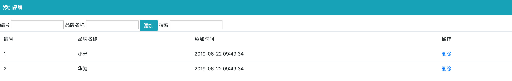

# 1、表单基本操作

- 获取单选框中的值

  - 通过v-model

  ```html
   	<!-- 
  		1、 两个单选框需要同时通过v-model 双向绑定 一个值 
          2、 每一个单选框必须要有value属性  且value 值不能一样 
  		3、 当某一个单选框选中的时候 v-model  会将当前的 value值 改变 data 中的 数据
  
  		gender 的值就是选中的值，我们只需要实时监控他的值就可以了
  	-->
     <input type="radio" id="male" value="1" v-model='gender'>
     <label for="male">男</label>
  
     <input type="radio" id="female" value="2" v-model='gender'>
     <label for="female">女</label>
  
  <script>
      new Vue({
           data: {
               // 默认会让当前的 value 值为 2 的单选框选中
                  gender: 2,  
              },
      })
  
  </script>
  ```

- 获取复选框中的值

  - 通过v-model
  - 和获取单选框中的值一样 
  - 复选框 `checkbox` 这种的组合时   data 中的 hobby 我们要定义成数组 否则无法实现多选

  ```html
  	<!-- 
  		1、 复选框需要同时通过v-model 双向绑定 一个值 
          2、 每一个复选框必须要有value属性  且value 值不能一样 
  		3、 当某一个单选框选中的时候 v-model  会将当前的 value值 改变 data 中的 数据
  
  		hobby 的值就是选中的值，我们只需要实时监控他的值就可以了
  	-->
  
  <div>
     <span>爱好：</span>
     <input type="checkbox" id="ball" value="1" v-model='hobby'>
     <label for="ball">篮球</label>
     <input type="checkbox" id="sing" value="2" v-model='hobby'>
     <label for="sing">唱歌</label>
     <input type="checkbox" id="code" value="3" v-model='hobby'>
     <label for="code">写代码</label>
   </div>
  <script>
      new Vue({
           data: {
                  // 默认会让当前的 value 值为 2 和 3 的复选框选中
                  hobby: ['2', '3'],
              },
      })
  </script>
  ```

- 获取下拉框和文本框中的值

  - 通过v-model

  ```html
     <div>
        <span>职业：</span>
         <!--
  			1、 需要给select  通过v-model 双向绑定 一个值 
              2、 每一个option  必须要有value属性  且value 值不能一样 
  		    3、 当某一个option选中的时候 v-model  会将当前的 value值 改变 data 中的 数据
  		     occupation 的值就是选中的值，我们只需要实时监控他的值就可以了
  		-->
         <!-- multiple  多选 -->
        <select v-model='occupation' multiple>
            <option value="0">请选择职业...</option>
            <option value="1">教师</option>
            <option value="2">软件工程师</option>
            <option value="3">律师</option>
        </select>
           <!-- textarea 是 一个双标签   不需要绑定value 属性的  -->
          <textarea v-model='desc'></textarea>
    </div>
  <script>
      new Vue({
           data: {
                  // 默认会让当前的 value 值为 2 和 3 的下拉框选中
                   occupation: ['2', '3'],
               	 desc: 'nihao'
              },
      })
  </script>
  ```

# 2、表单修饰符

- .number  转换为数值

  - 注意点：	
  - 当开始输入非数字的字符串时，因为Vue无法将字符串转换成数值
  - 所以属性值将实时更新成相同的字符串。即使后面输入数字，也将被视作字符串。

```html
<!DOCTYPE html>
<html lang='en'>

<head>
    <title></title>
    <meta charset='UTF-8'>
    <meta name='viewport' content='width=device-width, initial-scale=1'>
    <script src="https://cdn.jsdelivr.net/npm/vue/dist/vue.js"></script>
</head>

<body>
    <div id="app">
        <input type="text"  v-model.number="num">
        <button @click="show">点击</button>
    </div>

    <script type="text/javascript">
        var vm = new Vue({
            el: '#app',
            data: {
                num:''
            },
            methods: {
                show(){
                   console.log(this.num+10);
                }
            },
        })
    </script>
</body>

</html>
```

- .trim  自动过滤用户输入的首尾空白字符

  - 只能去掉首尾的 不能去除中间的空格

```html
<!--自动过滤用户输入的首尾空白字符   -->
<input v-model.trim="msg">
```

- .lazy   将input事件切换成change事件

  - .lazy 修饰符延迟了同步更新属性值的时机。即将原本绑定在 input 事件的同步逻辑转变为绑定在 change 事件上
  - input每次输入内容都触发
  - change在失去焦点 或者 按下回车键时才触发

```html
<!DOCTYPE html>
<html lang='en'>

<head>
    <title></title>
    <meta charset='UTF-8'>
    <meta name='viewport' content='width=device-width, initial-scale=1'>
    <script src="https://cdn.jsdelivr.net/npm/vue/dist/vue.js"></script>
</head>

<body>
    <div id="app">
        <input type="text"  v-model.lazy="str">
        {{str}}
    </div>

    <script type="text/javascript">
        var vm = new Vue({
            el: '#app',
            data: {
                str:''
            },
        })
    </script>
</body>

</html>
```

# 3、计算属性   computed

让字符串翻转

```html
<!DOCTYPE html>
<html lang='en'>

<head>
    <title></title>
    <meta charset='UTF-8'>
    <meta name='viewport' content='width=device-width, initial-scale=1'>
    <script src="https://cdn.jsdelivr.net/npm/vue/dist/vue.js"></script>
</head>

<body>
    <div id="app">
        {{msg.split('').reverse().join('')}}
    </div>

    <script type="text/javascript">
        var vm = new Vue({
            el: '#app',
            data: {
                msg:'hello'
            },
        })
    </script>
</body>

</html>
```

- 模板中放入太多的逻辑会让模板过重且难以维护  使用计算属性可以让模板更加的简洁
- 计算属性是基于data中的数据，data变化，结果也就变化
- computed比较适合对多个变量或者对象进行处理后返回一个结果值，也就是数多个变量中的某一个值发生了变化则我们监控的这个值也就会发生变化

```html
<!DOCTYPE html>
<html lang='en'>

<head>
    <title></title>
    <meta charset='UTF-8'>
    <meta name='viewport' content='width=device-width, initial-scale=1'>
    <script src="https://cdn.jsdelivr.net/npm/vue/dist/vue.js"></script>
</head>

<body>
    <div id="app">
        {{reverseMsg}}
    </div>

    <script type="text/javascript">
        var vm = new Vue({
            el: '#app',
            data: {
                msg:'hello'
            },
            computed: {
                // 我们自己定义的名字 
                reverseMsg(){
                    // 这里一定要有return 否则 调用 reverseMsg 的 时候无法拿到结果
                    return this.msg = this.msg.split('').reverse().join('')
                }
            },
        })
    </script>
</body>

</html>
```

### 计算属性和method的区别

- 计算属性是基于它们的依赖进行缓存的

```html
<!DOCTYPE html>
<html lang='en'>

<head>
    <title></title>
    <meta charset='UTF-8'>
    <meta name='viewport' content='width=device-width, initial-scale=1'>
    <script src="https://cdn.jsdelivr.net/npm/vue/dist/vue.js"></script>
</head>

<body>
    <div id="app">
        {{reverseMsg}}
        {{reverseMsg}}
    </div>

    <script type="text/javascript">
        var vm = new Vue({
            el: '#app',
            data: {
                msg:'hello'
            },
            computed: {
                // 我们自己定义的名字 
                reverseMsg(){
                    console.log('computed');
                    // 这里一定要有return 否则 调用 reverseMsg 的 时候无法拿到结果
                    return this.msg = this.msg.split('').reverse().join('')
                }
            },
        })
    </script>
</body>

</html>
```

computed只打印了一次

- 方法不存在缓存

```html
<!DOCTYPE html>
<html lang='en'>

<head>
    <title></title>
    <meta charset='UTF-8'>
    <meta name='viewport' content='width=device-width, initial-scale=1'>
    <script src="https://cdn.jsdelivr.net/npm/vue/dist/vue.js"></script>
</head>

<body>
    <div id="app">
        {{reverseMsg}}
        {{reverseMsg}}

        <!-- {{reverseMethod()}} -->
        {{reverseMethod()}}
        {{reverseMethod()}}
    </div>

    <script type="text/javascript">
        var vm = new Vue({
            el: '#app',
            data: {
                msg:'hello'
            },
            methods: {
                reverseMethod(){
                    console.log('methods');
                }
            },
            computed: {
                // 我们自己定义的名字 
                reverseMsg(){
                    console.log('computed');
                    // 这里一定要有return 否则 调用 reverseMsg 的 时候无法拿到结果
                    return this.msg = this.msg.split('').reverse().join('')
                }
            },
        })
    </script>
</body>

</html>
```

# 4、侦听器

- 使用watch来响应数据的变化
- 一般用于异步或者开销较大的操作
- watch 中的属性 一定是data 中 已经存在的数据 
- **当需要监听一个对象的改变时，普通的watch方法无法监听到对象内部属性的改变，只有data中的数据才能够监听到变化，此时就需要deep属性对对象进行深度监听**

```html
<!DOCTYPE html>
<html lang='en'>

<head>
    <title></title>
    <meta charset='UTF-8'>
    <meta name='viewport' content='width=device-width, initial-scale=1'>
    <script src="https://cdn.jsdelivr.net/npm/vue/dist/vue.js"></script>
    <style>
        .active {
            background-color: aqua;
        }

        li {
            list-style: none;
            float: left;
            width: 100px;
            margin: 20px;
            border: 1px black solid;
            text-align: center;
            line-height: 40px;
            height: 40px;
        }

        .show {
            display: none;
            clear: both;
        }

        .current {
            display: block;
        }
    </style>
</head>

<body>
    <div id="app">
        <div>
            <span>名：</span>
            <span>
                <input type="text" v-model='firstName'>
            </span>
        </div>
        <div>
            <span>姓：</span>
            <span>
                <input type="text" v-model='lastName'>
            </span>
        </div>
        <div>{{fullName}}</div>
    </div>

    <script type="text/javascript">
        /*
              侦听器
            */
        var vm = new Vue({
            el: '#app',
            data: {
                firstName: 'Tom',
                lastName: 'Li',
                fullName: 'Li Tom'
            },
            //watch  属性 定义 和 data 已经 methods 平级 
            watch: {
                //   注意：  这里firstName  对应着data 中的 firstName 
                //   当 firstName 值 改变的时候  会自动触发 watch
                firstName: function (val) {
                    this.fullName = val + ' ' + this.lastName;
                },
                //   注意：  这里 lastName 对应着data 中的 lastName 
                lastName: function (val) {
                    this.fullName = this.firstName + ' ' + val;
                }
            }
        });
    </script>
</body>

</html>
```

### 案例：验证用户名

```html
<!DOCTYPE html>
<html lang='en'>

<head>
    <title></title>
    <meta charset='UTF-8'>
    <meta name='viewport' content='width=device-width, initial-scale=1'>
    <script src="https://cdn.jsdelivr.net/npm/vue/dist/vue.js"></script>
</head>

<body>
    <div id="app">
        <input type="text" v-model.lazy="name">{{msg}}
    </div>

    <script type="text/javascript">
        var vm = new Vue({
            el: '#app',
            data: {
                name: '',
                msg: '',
                time:null
            },
            methods: {
                check(val) {
                   clearInterval(this.time)
                   this.time = setInterval(() => {
                        if (val == "admin") {
                            this.msg = "用户名已存在"
                        } else {
                            this.msg = "可以使用"
                        }
                    }, 2000)
                }
            },
            watch: {
                name(val) {
                    this.check(val);
                    this.msg = "正在验证.."
                }
            },
        })
    </script>
</body>

</html>
```

# 5、过滤器

格式化数据

比如：hello -> Hello

格式化时间等

#### 5.1、全局过滤器

```
{{name | option}}//data就是name，过滤器名称option

Vue.filter('过滤器的名称',function(data){
    return data;
})
```

```html	
<!DOCTYPE html>
<html lang='en'>

<head>
    <title></title>
    <meta charset='UTF-8'>
    <meta name='viewport' content='width=device-width, initial-scale=1'>
    <script src="https://cdn.jsdelivr.net/npm/vue/dist/vue.js"></script>
</head>

<body>
    <div id="app">
        <p>{{msg | msgFilter('111','通过') | test}}</p>
    </div>
    <script>
        // //定义全局的过滤器
        // Vue.filter('msgFilter', function(msg){
        //     //第一个参数可以写字符串之外，还可以定义正则/测试/g，/g全局匹配
        //    return msg.replace(/测试/g,'通过');
        // })
        Vue.filter('msgFilter',function(msg,arg,arg1){
            return msg.replace(/测试/g,arg+arg1);
        })
        Vue.filter('test', function(msg){
            return msg+'====='
        })
        var vm = new Vue({
            el:'#app',
            data:{
                msg:'过滤器测试abc测试d测试'
                // 如果输出上面这句话时，当碰见测试的时候换成111通过
            },
            methods: {
                
            },
        })
    </script>
</body>

</html>
```


#### 5.2、私有过滤器

```html
<!DOCTYPE html>
<html lang='en'>

<head>
    <title></title>
    <meta charset='UTF-8'>
    <meta name='viewport' content='width=device-width, initial-scale=1'>
    <script src="https://cdn.jsdelivr.net/npm/vue/dist/vue.js"></script>
</head>

<body>
    <div id="app">
        <p>{{msg | msgFilter('通过') | test}}</p>
        <p>{{new Date() | timeFilter(new Date(),'yyyy-mm-dd')}}</p>
    </div>
    <script>
        // //定义全局的过滤器
        // Vue.filter('msgFilter', function(msg){
        //     //第一个参数可以写字符串之外，还可以定义正则/测试/g，/g全局匹配
        //    return msg.replace(/测试/g,'通过');
        // })
        Vue.filter('msgFilter', function (msg, arg) {
            return msg.replace(/测试/g, arg);
        })
        Vue.filter('test', function (msg) {
            return msg + '====='
        })
        var vm = new Vue({
            el: '#app',
            data: {
                msg: '过滤器测试abc测试d测试'
                // 如果输出上面这句话时，当碰见测试的时候换成通过
            },
            //自定义私有指令
            filters: {
                timeFilter: function (data, pram) {
                    var dt = new Date(data);
                    var y = dt.getFullYear()
                    var m = dt.getMonth() + 1
                    var d = dt.getDate()

                    // return y+'-'+m+'-'+d;
                    // return `${y}-${m}-${d}`

                    if (pram.toString().toLowerCase() === 'yyyy-mm-dd') {
                        // return y+'-'+m+'-'+d;
                        return `${y}-${m}-${d}`
                    } else {
                        var hh = (dt.getHours()).toString().padStart(2, '0')//在前面添加

                        var mm = dt.getMinutes().toString().padStart(2, '0')
                        var ss = (dt.getSeconds()).toString().padStart(2, '0')

                        return `${y}-${m}-${d} ${hh}:${mm}:${ss}`
                    }
                }
            },
        })
    </script>
</body>

</html>
```

过滤器就近原则

padStart()在头部去填充字符串

padEnd()在尾部填充

```js
var m = (new Date().getMonth+1).toString().padStrat(2,0); 
总长度为2位
```


# 作业：制作下图界面，完成功能

完成增删改查功能，额外添加统计记录数、批量删除




