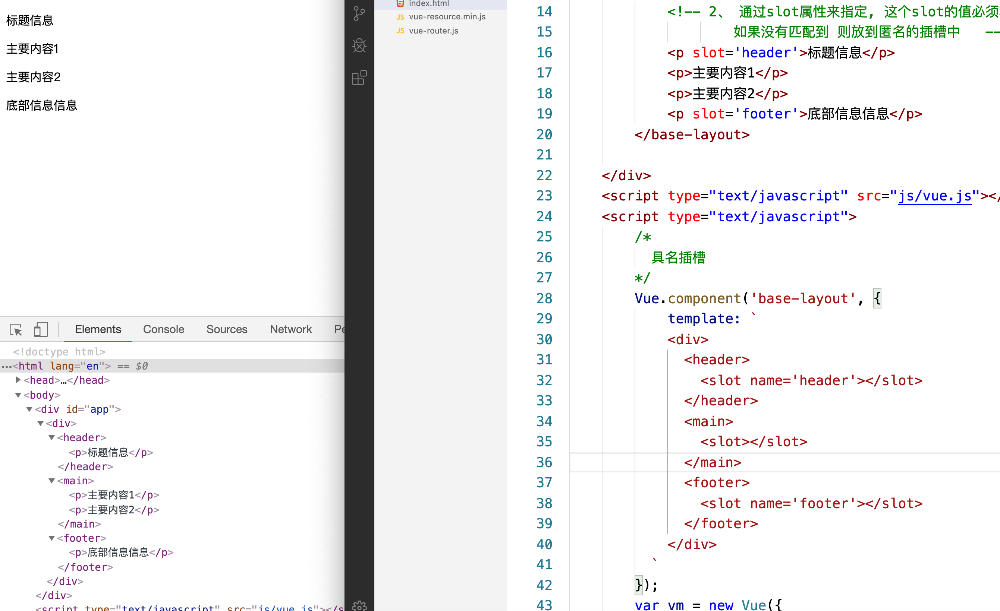
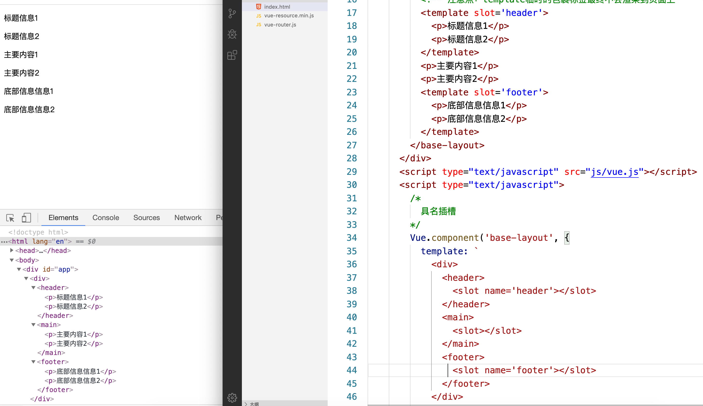
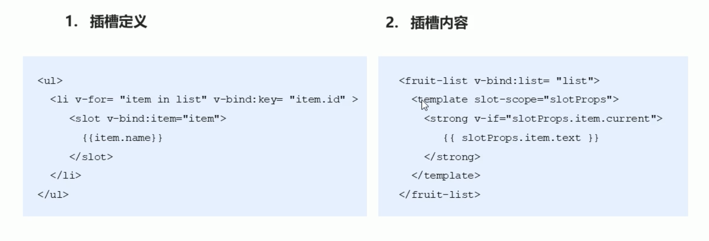
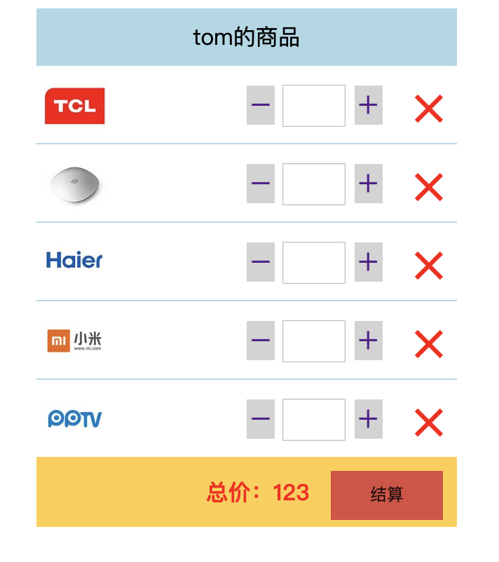

# 一、组件


谁用谁，谁就是爸爸—父组件

谁被用，谁就是儿子—子组件

### 1、创建全局组件的方式 	

```html
<!DOCTYPE html>
<html lang='en'>
<head>
    <title></title>
    <meta charset='UTF-8'>
    <meta name='viewport' content='width=device-width, initial-scale=1'>
    <script src="https://cdn.jsdelivr.net/npm/vue/dist/vue.js"></script>
</head>
<body>
    <div id='app'>
        <header-vue></header-vue>
    </div>
    <template id='top'>
        <div>
            <h1>我是头部</h1>
        </div>
    </template>

    <script>
        Vue.component('headerVue',{
            template:'#top'
        })

        var vm = new Vue({
            el:'#app',
            data:{
            },
            methods: {
            },
        })
    </script>
</body>
</html>
```


### 2、创建私有组件

```html
<!DOCTYPE html>
<html lang='en'>

<head>
    <title></title>
    <meta charset='UTF-8'>
    <meta name='viewport' content='width=device-width, initial-scale=1'>
    <script src="https://cdn.jsdelivr.net/npm/vue/dist/vue.js"></script>
</head>

<body>
    <div id='app'>
        <header-vue></header-vue>
        <login></login>
    </div>
    <hr>
    <div id='app1'>
        <header-vue></header-vue>
        <login></login>
    </div>
    <template id='top'>
        <div>
            <h1>我是头部</h1>
        </div>
    </template>
    <template id='login'>
        <div>
            <h1>我是login私有组件</h1>
        </div>
    </template>

    <script>
        Vue.component('headerVue', {
            template: '#top'
        })

        var vm = new Vue({
            el: '#app',
            data: {
            },
            methods: {
            },
        })
        var vm1 = new Vue({
            el: '#app1',
            data: {
            },
            methods: {
            },
            components: {
                login: {
                    template: '#login'
                }
            }
        })
    </script>
</body>

</html>
```

### 3、全局组件中data属性

- 组件中可以有自己的data数据
- 组件的data和实例的data有点不一样，实例中的data可以是一个对象，但是组件中data必须是一个方法
- 组件中的data除了必须是一个方法之外，这个方法内部必须返回一个对象
- 组件中data数据，使用方法和实例中data使用一样

```html
<!DOCTYPE html>
<html lang='en'>

<head>
    <title></title>
    <meta charset='UTF-8'>
    <meta name='viewport' content='width=device-width, initial-scale=1'>
    <script src="https://cdn.jsdelivr.net/npm/vue/dist/vue.js"></script>
</head>

<body>
    <div id='app'>
        <header-vue></header-vue>
        <login></login>
    </div>
    <hr>
    <div id='app1'>
        <header-vue></header-vue>
        <login></login>
    </div>
    <template id='top'>
        <div>
            <h1>我是头部--{{msg}}</h1>
        </div>
    </template>
    <template id='login'>
        <div>
            <h1>我是login私有组件</h1>
        </div>
    </template>

    <script>
        Vue.component('headerVue', {
            template: '#top',
            data() {
                return {
                    msg: '我是全局组件中的data'
                }
            }
        })

        var vm = new Vue({
            el: '#app',
            data: {
            },
            methods: {
            },
        })
        var vm1 = new Vue({
            el: '#app1',
            data: {
            },
            methods: {
            },
            components: {
                login: {
                    template: '#login'
                }
            }
        })
    </script>
</body>

</html>
```

# 二、组件切换

```html
<!DOCTYPE html>
<html lang='en'>
<head>
    <title></title>
    <meta charset='UTF-8'>
    <meta name='viewport' content='width=device-width, initial-scale=1'>
    <script src="https://cdn.jsdelivr.net/npm/vue/dist/vue.js"></script>
</head>
<body>
    <div id='app'>
        <a href="#"  @click.prevent="comp='login'">登录</a>
        <a href="#"  @click.prevent="comp='register'">注册</a>
        <component :is="comp"></component>
    </div>
    <template id='top'>
        <div>
            <h1>登录组件</h1>
        </div>
    </template>
    <template id='reg'>
            <div>
                <h1>注册组件</h1>
            </div>
        </template>

    <script>
        Vue.component('login',{
            template:'#top'
        })

        var vm = new Vue({
            el:'#app',
            data:{
                // flag: false
                comp:'register'
            },
            methods: {
            },
            components:{
                register:{
                    template:'#reg'
                }
            }
        })
    </script>
</body>
</html>
```

# 三、父子组件间传值

### 1、父组件向子组件传值

默认情况下，子组件访问不到父组件的属性和方法

```html
<!DOCTYPE html>
<html lang='en'>

<head>
    <title></title>
    <meta charset='UTF-8'>
    <meta name='viewport' content='width=device-width, initial-scale=1'>
    <script src="https://cdn.jsdelivr.net/npm/vue/dist/vue.js"></script>
</head>

<body>
    <div id='app'>
      <zi></zi>
    </div>
    <template id='zi'>
        <div>
            <h1>我是子组件--{{msg}}</h1>
        </div>
    </template>
    <script>
        var vm = new Vue({
            el: '#app',
            data: {
              msg:'我是父组件的信息'
            },
            methods: {
            },
            components: {
                zi: {
                    template: '#zi'
                }
            }
        })
    </script>
</body>

</html>
```

那么怎么访问呢？

- 我们可以在父组件引用子组件的时候，通过属性绑定的形式v-bind传递到子组件内部
- 自定义一个属性
- 在子组件中定义一个属性props，他是一个数组
- 组件中的所有props中的数据，都是通过父组件传递给子组件的
- 那么子组件的data（）{}是哪来的？
  - 子组件自己私有的
  - 比如子组件通过ajax请求回来的数据，都可以放到data中，与父组件没有关系
- data中的数据可读可写，props中的数据只能读，无法重新赋值

```html
<!DOCTYPE html>
<html lang='en'>

<head>
    <title></title>
    <meta charset='UTF-8'>
    <meta name='viewport' content='width=device-width, initial-scale=1'>
    <script src="https://cdn.jsdelivr.net/npm/vue/dist/vue.js"></script>
</head>

<body>
    <div id='app'>
        {{msg}}
        <zi :para="msg"></zi>
    </div>
    <template id='zi'>
        <div>
            <h1 @click="show">我是子组件--{{para}}---{{title}}</h1>
        </div>
    </template>
    <script>
        var vm = new Vue({
            el: '#app',
            data: {
                msg: '我是父组件的信息'
            },
            methods: {

            },
            components: {
                zi: {
                    data() {
                        return {
                            title: 'logo',
                            content: 123
                        }
                    },
                    template: '#zi',
                    props: ['para'],
                    methods: {
                        show(){
                            this.para = '被修改了'
                        }
                    },
                },
            }
        })
    </script>
</body>

</html>
```

- 如果传递方法，需要用v-on绑定机制
- 自定义一个属性名

```html
<!DOCTYPE html>
<html lang='en'>

<head>
    <title></title>
    <meta charset='UTF-8'>
    <meta name='viewport' content='width=device-width, initial-scale=1'>
    <script src="https://cdn.jsdelivr.net/npm/vue/dist/vue.js"></script>
</head>

<body>
    <div id='app'>
        {{msg}}
        <comp @fun="show"></comp>
    </div>
    <template id='box'>
        <div>
            <h1>我是子组件--</h1>
            <!-- 如果show后面加括号，相当于先调用一次，把结果赋给了fun。不加（）属于方法引用 -->
            <input type="button" value="点我触发父组件的show方法" @click="myclick">
        </div>
    </template>
    <script>
        var comp = {
            template: '#box',
            methods: {
                myclick() {
                    //$emit触发调用
                    this.$emit('fun')
                }
            },
        }
        var vm = new Vue({
            el: '#app',
            data: {
                msg: '我是父组件的信息'
            },
            methods: {
                show() {
                    console.log('我是父组件的show方法')
                }
            },
            components: {
                // comp:comp
                comp

                // comp: {
                //     template: '#box',
                //     methods: {
                //         myclick() {
                //             //$emit触发调用
                //             this.$emit('fun')
                //         }
                //     },
                // }
            }
        })
    </script>
</body>

</html>
```

### 2、子组件向父组件传值

$emit第一个参数调用方法，第二个参数之后，都可以传参数

```html
<!DOCTYPE html>
<html lang='en'>

<head>
    <title></title>
    <meta charset='UTF-8'>
    <meta name='viewport' content='width=device-width, initial-scale=1'>
    <script src="https://cdn.jsdelivr.net/npm/vue/dist/vue.js"></script>
</head>

<body>
    <div id='app'>
        {{msg}}--{{name}}
        <comp @fun="show"></comp>
    </div>
    <template id='box'>
        <div>
            <h1>我是子组件--</h1>
            <!-- 如果show后面加括号，相当于先调用一次，把结果赋给了fun。不加（）属于方法引用 -->
            <input type="button" value="点我触发父组件的show方法" @click="myclick">
        </div>
    </template>
    <script>
        var comp = {
            template: '#box',
            data() {
                return {
                    zimsg: {
                        name:'tom',
                        age:19
                    }
                }
            },
            methods: {
                myclick() {
                    //$emit触发调用
                    this.$emit('fun', 123, this.zimsg)
                }
            },
        }
        var vm = new Vue({
            el: '#app',
            data: {
                msg: '我是父组件的信息',
                name:''
                
            },
            methods: {
                show(data,d2) {
                    console.log('我是父组件的show方法' + data +d2.name+ this.msg)
                    this.name = d2.name;
                }
            },
            components: {
                // comp:comp
                comp
            }
        })
    </script>
</body>

</html>
```

# 四、ref获取DOM元素

控制台输入vm，会发现有个$ref的属性，我们可以通过他获取dom元素

- ref是reference引用的意思
- 标签上是ref，获取用this.$refs
- 组件也可以通过ref引用，但是有什么意义？
  - 可以通过父组件直接访问子组件的属性、方法等

```html
<!DOCTYPE html>
<html lang='en'>
<head>
    <title></title>
    <meta charset='UTF-8'>
    <meta name='viewport' content='width=device-width, initial-scale=1'>
    <script src="https://cdn.jsdelivr.net/npm/vue/dist/vue.js"></script>
</head>
<body>
    <div id='app'>
        <input type="button" name="" value="获取Dom元素的值" @click='show'>
        <h3 ref="myh3">我是h3的文本
        </h3>

        <hr>

        <comp ref="zi"></comp>
    </div>

    <template id="login">
        <div>
            登录组件
        </div>
    </template>
    <script>
        var comp = {
            template:'#login',
            data(){
                return{
                    msg:'son msg'
                }
            },
            methods: {
                show(){
                    console.log('子组件的show方法')
                }
            },
        }
        var vm = new Vue({
            el:'#app',
            data:{
            },
            methods: {
                show(){
                    console.log(this.$refs.myh3.innerText)
                    console.log(this.$refs.zi.msg)
                    this.$refs.zi.show()
                }
            },
            components:{
                comp
            }
        })
    </script>
</body>
</html>
```

# 五、组件插槽

- 组件的最大特性就是复用性，而用好插槽能大大提高组件的可复用能力

### 匿名插槽

```html
<!DOCTYPE html>
<html lang='en'>

<head>
    <title></title>
    <meta charset='UTF-8'>
    <meta name='viewport' content='width=device-width, initial-scale=1'>
    <script src="https://cdn.jsdelivr.net/npm/vue/dist/vue.js"></script>
</head>

<body>
    <div id="app">
        <!-- 这里的所有组件标签中的内容会替换掉slot里的内容  
            如果组件标签中的内容不写 则使用 slot 中的默认值  -->
        <alert-box>有bug发生</alert-box>
        <alert-box>有一个警告</alert-box>
        <alert-box></alert-box>
    </div>

    <script type="text/javascript">
        Vue.component('alert-box', {
            template: `
            <div>
            <slot>qqq </slot>
            <slot>如果是单标签，之后内容被全部替换
            </div>
          `
        });
        var vm = new Vue({
            el: '#app',
            data: {

            }
        });
    </script>
</body>

</html>
```

### 具名插槽

- 具有名字的插槽 
- 使用 <slot> 中的 "name" 属性绑定元素

```html
<!DOCTYPE html>
<html lang='en'>

<head>
    <title></title>
    <meta charset='UTF-8'>
    <meta name='viewport' content='width=device-width, initial-scale=1'>
    <script src="https://cdn.jsdelivr.net/npm/vue/dist/vue.js"></script>
</head>

<body>
    <div id="app">
        <base-layout>
            <!-- 2、 通过slot属性来指定, 这个slot的值必须和下面slot组件得name值对应上
                    如果没有匹配到 则放到匿名的插槽中   -->
            <p slot='header'>标题信息</p>
            <p>主要内容1</p>
            <p>主要内容2</p>
            <p slot='footer'>底部信息信息</p>
        </base-layout>

    </div>
    <script type="text/javascript" src="js/vue.js"></script>
    <script type="text/javascript">
        /*
          具名插槽
        */
        Vue.component('base-layout', {
            template: `
            <div>
              <header>
                <slot name='header'></slot>
              </header>
              <main>
                <slot></slot>
              </main>
              <footer>
                <slot name='footer'></slot>
              </footer>
            </div>
          `
        });
        var vm = new Vue({
            el: '#app',
            data: {

            }
        });
    </script>


</body>

</html>	
```





第二种方式

```HTML
<!DOCTYPE html>
<html lang='en'>

<head>
    <title></title>
    <meta charset='UTF-8'>
    <meta name='viewport' content='width=device-width, initial-scale=1'>
    <script src="https://cdn.jsdelivr.net/npm/vue/dist/vue.js"></script>
</head>

<body>
    <div id="app">


        <base-layout>
          <!-- 注意点：template临时的包裹标签最终不会渲染到页面上     -->  
          <template slot='header'>
            <p>标题信息1</p>
            <p>标题信息2</p>
          </template>
          <p>主要内容1</p>
          <p>主要内容2</p>
          <template slot='footer'>
            <p>底部信息信息1</p>
            <p>底部信息信息2</p>
          </template>
        </base-layout>
      </div>
      <script type="text/javascript" src="js/vue.js"></script>
      <script type="text/javascript">
        /*
          具名插槽
        */
        Vue.component('base-layout', {
          template: `
            <div>
              <header>
                <slot name='header'></slot>
              </header>
              <main>
                <slot></slot>
              </main>
              <footer>
                <slot name='footer'></slot>
              </footer>
            </div>
          `
        });
        var vm = new Vue({
          el: '#app',
          data: {
            
          }
        });
      </script>
    
    
    


</body>

</html>
```



### 作用域插槽


- 父组件对子组件加工处理



- 既可以复用子组件的slot，又可以使slot内容不一致

```html
<!DOCTYPE html>
<html lang='en'>

<head>
    <title></title>
    <meta charset='UTF-8'>
    <meta name='viewport' content='width=device-width, initial-scale=1'>
    <script src="https://cdn.jsdelivr.net/npm/vue/dist/vue.js"></script>
    <style>
        .current {
            color: red;
        }
    </style>
</head>

<body>
    <div id="app">
        <fruit-list :list='list'>
            <template slot-scope="scope">
                <span v-if="scope.info.id==3" class="current">{{scope.info.name}}</span>
                <span v-else>{{scope.info.name}}</span>
            </template>
        </fruit-list>
    </div>
    <script type="text/javascript">
        /*
          作用域插槽
        */
        Vue.component('fruit-list', {
            props: ['list'],
            template: `
            <div>
              <li :key='item.id' v-for='item in list'>
                <slot :info='item'>{{item.name}}</slot>
              </li>
            </div>
          `
        });
        var vm = new Vue({
            el: '#app',
            data: {
                list: [{
                    id: 1,
                    name: 'apple'
                }, {
                    id: 2,
                    name: 'orange'
                }, {
                    id: 3,
                    name: 'banana'
                }]
            }
        });
    </script>


</body>

</html>
```


# 购物车案例



#### 1.  实现组件化布局

- 把静态页面转换成组件化模式
- 把组件渲染到页面上

```html
<!DOCTYPE html>
<html lang="en">
<head>
  <meta charset="UTF-8">
  <title>Document</title>
  <script src="https://cdn.jsdelivr.net/npm/vue/dist/vue.js"></script>
  <style type="text/css">
    .container {
    }
    .container .cart {
      width: 300px;
      margin: auto;
    }
    .container .title {
      background-color: lightblue;
      height: 40px;
      line-height: 40px;
      text-align: center;
      /*color: #fff;*/  
    }
    .container .total {
      background-color: #FFCE46;
      height: 50px;
      line-height: 50px;
      text-align: right;
    }
    .container .total button {
      margin: 0 10px;
      background-color: #DC4C40;
      height: 35px;
      width: 80px;
      border: 0;
    }
    .container .total span {
      color: red;
      font-weight: bold;
    }
    .container .item {
      height: 55px;
      line-height: 55px;
      position: relative;
      border-top: 1px solid #ADD8E6;
    }
    .container .item img {
      width: 45px;
      height: 45px;
      margin: 5px;
    }
    .container .item .name {
      position: absolute;
      width: 90px;
      top: 0;left: 55px;
      font-size: 16px;
    }

    .container .item .change {
      width: 100px;
      position: absolute;
      top: 0;
      right: 50px;
    }
    .container .item .change a {
      font-size: 20px;
      width: 30px;
      text-decoration:none;
      background-color: lightgray;
      vertical-align: middle;
    }
    .container .item .change .num {
      width: 40px;
      height: 25px;
    }
    .container .item .del {
      position: absolute;
      top: 0;
      right: 0px;
      width: 40px;
      text-align: center;
      font-size: 40px;
      cursor: pointer;
      color: red;
    }
    .container .item .del:hover {
      background-color: orange;
    }
  </style>
</head>
<body>
  <div id="app">
    <div class="container">
      <my-cart></my-cart>
    </div>
  </div>
  <script type="text/javascript">
    
    var CartTitle = {
      template: `
        <div class="title">我的商品</div>
      `
    }
    var CartList = {
      template: `
        <div>
          <div class="item">
            
            <div class="name"></div>
            <div class="change">
              <a href="">－</a>
              <input type="text" class="num" />
              <a href="">＋</a>
            </div>
            <div class="del">×</div>
          </div>
          <div class="item">
            
            <div class="name"></div>
            <div class="change">
              <a href="">－</a>
              <input type="text" class="num" />
              <a href="">＋</a>
            </div>
            <div class="del">×</div>
          </div>
          <div class="item">
            
            <div class="name"></div>
            <div class="change">
              <a href="">－</a>
              <input type="text" class="num" />
              <a href="">＋</a>
            </div>
            <div class="del">×</div>
          </div>
        </div>
      `
    }
    var CartTotal = {
      template: `
        <div class="total">
          <span>总价：123</span>
          <button>结算</button>
        </div>
      `
    }
    Vue.component('my-cart',{
      template: `
        <div class='cart'>
          <cart-title></cart-title>
          <cart-list></cart-list>
          <cart-total></cart-total>
        </div>
      `,
      components: {
        'cart-title': CartTitle,
        'cart-list': CartList,
        'cart-total': CartTotal
      }
    });
    var vm = new Vue({
      el: '#app',
      data: {

      }
    });

  </script>
</body>
</html>
```

#### 2、实现 标题和结算功能组件

- 标题组件实现动态渲染
  - 从父组件把标题数据传递过来 即 父向子组件传值
  - 把传递过来的数据渲染到页面上  

```html
<!DOCTYPE html>
<html lang="en">

<head>
    <meta charset="UTF-8">
    <title>Document</title>
    <script src="https://cdn.jsdelivr.net/npm/vue/dist/vue.js"></script>
</head>

<body>
    <div id="app">
        <div class="container">
            <my-cart></my-cart>
        </div>
    </div>
    <script type="text/javascript">

        var CartTitle = {
            // 3 组件中接收参数
            props: ['username'],
            template: `
        <div class="title">{{username}}的商品</div>
      `
        }
        Vue.component('my-cart', {
            // 1  组件传参数
            data() {
                return {
                    n: 'tom'
                }
            },
            // 2 组件上绑定
            template: `
        <div class='cart'>
          <cart-title :username='n'></cart-title>
          <cart-list></cart-list>
          <cart-total></cart-total>
        </div>
      `,
            components: {
                'cart-title': CartTitle,
                'cart-list': CartList,
                'cart-total': CartTotal
            }
        });
        var vm = new Vue({
            el: '#app',
            data: {

            }
        });

    </script>
</body>

</html>
```

- 结算功能组件
  - 从父组件把商品列表list 数据传递过来 即 父向子组件传值
  - 把传递过来的数据计算最终价格渲染到页面上  

```html
<!DOCTYPE html>
<html lang="en">

<head>
    <meta charset="UTF-8">
    <title>Document</title>
    <script src="https://cdn.jsdelivr.net/npm/vue/dist/vue.js"></script>
  
</head>

<body>
    <div id="app">
        <div class="container">
            <my-cart></my-cart>
        </div>
    </div>
    <script type="text/javascript">
        // 3 组件中接收参数
        var CartTitle = {
            props: ['username'],
            template: `
        <div class="title">{{username}}的商品</div>
      `
        }
    
        // 6 接收list数据
        var CartTotal = {
            props: ['list'],
            template: `
        <div class="total">
          <span>总价：{{total}}</span>
          <button>结算</button>
        </div>
      `,
            computed: {
                total:function(){
                    //7 计算总价，遍历数组，把单价和数量相乘
                    var t = 0
                    this.list.forEach(element => {
                        t+=element.price*element.num
                    });
                    return t
                }
            }
        }
        Vue.component('my-cart', {
            // 1  组件传参数
            data() {
                return {
                    username: "tom",
                    // 4 计算总价的数据
                  
                }
            },
            // 2 组件上绑定
            // 5 把list传递
            template: `
        <div class='cart'>
          <cart-title :username='username'></cart-title>
          <cart-list ></cart-list>
          <cart-total :list='list'></cart-total>
        </div>
      `,
            components: {
                'cart-title': CartTitle,
                'cart-list': CartList,
                'cart-total': CartTotal
            }
        });
        var vm = new Vue({
            el: '#app',
            data: {

            }
        });

    </script>
</body>

</html>
```

#### 3.  实现列表组件删除功能

- 从父组件把商品列表list 数据传递过来 即 父向子组件传值
- 把传递过来的数据渲染到页面上    

```html
<!DOCTYPE html>
<html lang="en">

<head>
    <meta charset="UTF-8">
    <title>Document</title>
    <script src="https://cdn.jsdelivr.net/npm/vue/dist/vue.js"></script>
    <style type="text/css">
        .container {}

        .container .cart {
            width: 300px;
            margin: auto;
        }

        .container .title {
            background-color: lightblue;
            height: 40px;
            line-height: 40px;
            text-align: center;
            /*color: #fff;*/
        }

        .container .total {
            background-color: #FFCE46;
            height: 50px;
            line-height: 50px;
            text-align: right;
        }

        .container .total button {
            margin: 0 10px;
            background-color: #DC4C40;
            height: 35px;
            width: 80px;
            border: 0;
        }

        .container .total span {
            color: red;
            font-weight: bold;
        }

        .container .item {
            height: 55px;
            line-height: 55px;
            position: relative;
            border-top: 1px solid #ADD8E6;
        }

        .container .item img {
            width: 45px;
            height: 45px;
            margin: 5px;
        }

        .container .item .name {
            position: absolute;
            width: 90px;
            top: 0;
            left: 55px;
            font-size: 16px;
        }

        .container .item .change {
            width: 100px;
            position: absolute;
            top: 0;
            right: 50px;
        }

        .container .item .change a {
            font-size: 20px;
            width: 30px;
            text-decoration: none;
            background-color: lightgray;
            vertical-align: middle;
        }

        .container .item .change .num {
            width: 40px;
            height: 25px;
        }

        .container .item .del {
            position: absolute;
            top: 0;
            right: 0px;
            width: 40px;
            text-align: center;
            font-size: 40px;
            cursor: pointer;
            color: red;
        }

        .container .item .del:hover {
            background-color: orange;
        }
    </style>
</head>

<body>
    <div id="app">
        <div class="container">
            <my-cart></my-cart>
        </div>
    </div>
    <script type="text/javascript">

        var CartTitle = {
            props: ['username'],
            template: `
        <div class="title">{{username}}的商品</div>
      `
        }
        var CartList = {
            props: ['list'],
            template: `
        <div>
          <div class="item"  v-for='item in list' :key=item.id>
            
            <div class="name">{{item.name}}</div>
            <div class="change">
              <a href="">－</a>
              <input type="text" class="num" :value="item.num" />
              <a href="">＋</a>
            </div>
            <div class="del">×</div>
          </div>
        </div>
      `
        }
        var CartTotal = {
            props: ['list'],
            template: `
        <div class="total">
          <span>总价：{{total}}</span>
          <button>结算</button>
        </div>
      `,
            computed: {
                total: function () {
                    //7 计算总价，遍历数组，把单价和数量相乘
                    var t = 0
                    this.list.forEach(element => {
                        t += element.price * element.num
                    });
                    return t
                }
            }
        }
        Vue.component('my-cart', {
            data() {
                return {
                    n: 'tom',
                    // 4 计算总价的数据
                    list: [{
                        id: 1,
                        name: 'mate30Pro',
                        price: 4000,
                        num: 10,
                        img: '../资料/1.jpg'
                    }, {
                        id: 2,
                        name: 'iphone pro',
                        price: 7000,
                        num: 1,
                        img: '../资料/2.jpg'
                    }, {
                        id: 3,
                        name: 'xiaomi',
                        price: 3000,
                        num: 1,
                        img: '../资料/3.jpg'
                    }]
                }
            },
            template: `
        <div class='cart'>
          <cart-title :username='n'></cart-title>
          <cart-list :list="list"></cart-list>
          <cart-total :list="list"></cart-total>
        </div>
      `,
            components: {
                'cart-title': CartTitle,
                'cart-list': CartList,
                'cart-total': CartTotal
            }
        });
        var vm = new Vue({
            el: '#app',
            data: {

            }
        });

    </script>
</body>

</html>
```


- 点击删除按钮的时候删除对应的数据 
  - 给按钮添加点击事件把需要删除的id传递过来  
    - 子组件中不推荐操作父组件的数据有可能多个子组件使用父组件的数据  我们需要把数据传递给父组件让父组件操作数据 
    - 父组件删除对应的数据

```html
<!DOCTYPE html>
<html lang="en">

<head>
    <meta charset="UTF-8">
    <title>Document</title>
    <script src="https://cdn.jsdelivr.net/npm/vue/dist/vue.js"></script>
</head>

<body>
    <div id="app">
        <div class="container">
            <my-cart></my-cart>
        </div>
    </div>
    <script type="text/javascript">
        // 3 组件中接收参数
        var CartTitle = {
            props: ['username'],
            template: `
        <div class="title">{{username}}的商品</div>
      `
        }
        // 9 接收list  遍历
        var CartList = {
            props: ['list'],
            //10  删除事件
            template: `
        <div>
          <div class="item" v-for='item in list' :key=item.id>
            
            <div class="name">{{item.name}}</div>
            <div class="change">
              <a href="">－</a>
              <input type="text" class="num" />
              <a href="">＋</a>
            </div>
            <div class="del" @click='del(item.id)'>×</div>
          </div>
        </div>
      `,
            methods: {
                del(id){
                    // console.log(id);
                    // 把id传给父组件
                    this.$emit('cart-del',id)
                }
            },
        }
        // 6 接收list数据
        var CartTotal = {
            props: ['list'],
            template: `
        <div class="total">
          <span>总价：{{total}}</span>
          <button>结算</button>
        </div>
      `,
            computed: {
                total: function () {
                    //7 计算总价，遍历数组，把单价和数量相乘
                    var t = 0
                    this.list.forEach(element => {
                        t += element.price * element.num
                    });
                    return t
                }
            }
        }
        Vue.component('my-cart', {
            // 1  组件传参数
            data() {
                return {
                    username: "tom",
                    // 4 计算总价的数据
                    list: []
                }
            },
            // 2 组件上绑定
            // 5 把list传递
            // 8 把list传递到列表组件
            // 11  监听删除事件
            template: `
        <div class='cart'>
          <cart-title :username='username'></cart-title>
          <cart-list :list='list' @cart-del='delCart($event)'></cart-list>
          <cart-total :list='list'></cart-total>
        </div>
      `,
            components: {
                'cart-title': CartTitle,
                'cart-list': CartList,
                'cart-total': CartTotal
            },
            // 12定义delCart
            methods: {
                delCart(id){
                    // 根据id删除
                    // 先找到id对应的数据的索引
                    var index = this.list.findIndex(item=>{
                        return item.id == id
                    })
                    // 根据索引删除数据
                    this.list.splice(index,1)
                }
            },
        });
        var vm = new Vue({
            el: '#app',
            data: {

            }
        });

    </script>
</body>

</html>
```

#### 4.   实现组件更新数据功能  上

- 将输入框中的默认数据动态渲染出来
- 输入框失去焦点的时候 更改商品的数量 
- 子组件中不推荐操作数据 把这些数据传递给父组件 让父组件处理这些数据
- 父组件中接收子组件传递过来的数据并处理 

```html
 <div id="app">
    <div class="container">
      <my-cart></my-cart>
    </div>
  </div>
  <script type="text/javascript" src="js/vue.js"></script>
  <script type="text/javascript">
    
    var CartTitle = {
      props: ['uname'],
      template: `
        <div class="title">{{uname}}的商品</div>
      `
    }
    var CartList = {
      props: ['list'],
      template: `
        <div>
          <div :key='item.id' v-for='item in list' class="item">
            
            <div class="name">{{item.name}}</div>
            <div class="change">
              <a href="">－</a>
				# 1. 将输入框中的默认数据动态渲染出来
				# 2. 输入框失去焦点的时候 更改商品的数量  需要将当前商品的id 传递过来
              <input type="text" class="num" :value='item.num' @blur='changeNum(item.id, $event)'/>
              <a href="">＋</a>
            </div>
            <div class="del" @click='del(item.id)'>×</div>
          </div>
        </div>
      `,
      methods: {
        changeNum: function(id, event){
          # 3 子组件中不推荐操作数据  因为别的组件可能也引用了这些数据
          #  把这些数据传递给父组件 让父组件处理这些数据
          this.$emit('change-num', {
            id: id,
            num: event.target.value
          });
        },
        del: function(id){
          // 把id传递给父组件
          this.$emit('cart-del', id);
        }
      }
    }
    var CartTotal = {
      props: ['list'],
      template: `
        <div class="total">
          <span>总价：{{total}}</span>
          <button>结算</button>
        </div>
      `,
      computed: {
        total: function() {
          // 计算商品的总价
          var t = 0;
          this.list.forEach(item => {
            t += item.price * item.num;
          });
          return t;
        }
      }
    }
    Vue.component('my-cart',{
      data: function() {
        return {
          uname: '张三',
          list: [{
            id: 1,
            name: 'TCL彩电',
            price: 1000,
            num: 1,
            img: 'img/a.jpg'
          }]
      },
      template: `
        <div class='cart'>
          <cart-title :uname='uname'></cart-title>
			# 4  父组件中接收子组件传递过来的数据 
          <cart-list :list='list' @change-num='changeNum($event)' @cart-del='delCart($event)'></cart-list>
          <cart-total :list='list'></cart-total>
        </div>
      `,
      components: {
        'cart-title': CartTitle,
        'cart-list': CartList,
        'cart-total': CartTotal
      },
      methods: {
        changeNum: function(val) {
          //4.1 根据子组件传递过来的数据，跟新list中对应的数据
          this.list.some(item=>{
            if(item.id == val.id) {
              item.num = val.num;
              // 终止遍历
              return true;
            }
          });
        },
        delCart: function(id) {
          // 根据id删除list中对应的数据
          // 1、找到id所对应数据的索引
          var index = this.list.findIndex(item=>{
            return item.id == id;
          });
          // 2、根据索引删除对应数据
          this.list.splice(index, 1);
        }
      }
    });
    var vm = new Vue({
      el: '#app',
      data: {

      }
    });

  </script>
```

#### 5. 实现组件更新数据功能  下

- 子组件通过一个标识符来标记对用的用户点击  + - 或者输入框输入的内容
- 父组件拿到标识符更新对应的组件

```html
<!DOCTYPE html>
<html lang="en">
<head>
  <meta charset="UTF-8">
  <title>Document</title>
  <style type="text/css">
    .container {
    }
    .container .cart {
      width: 300px;
      margin: auto;
    }
    .container .title {
      background-color: lightblue;
      height: 40px;
      line-height: 40px;
      text-align: center;
      /*color: #fff;*/  
    }
    .container .total {
      background-color: #FFCE46;
      height: 50px;
      line-height: 50px;
      text-align: right;
    }
    .container .total button {
      margin: 0 10px;
      background-color: #DC4C40;
      height: 35px;
      width: 80px;
      border: 0;
    }
    .container .total span {
      color: red;
      font-weight: bold;
    }
    .container .item {
      height: 55px;
      line-height: 55px;
      position: relative;
      border-top: 1px solid #ADD8E6;
    }
    .container .item img {
      width: 45px;
      height: 45px;
      margin: 5px;
    }
    .container .item .name {
      position: absolute;
      width: 90px;
      top: 0;left: 55px;
      font-size: 16px;
    }

    .container .item .change {
      width: 100px;
      position: absolute;
      top: 0;
      right: 50px;
    }
    .container .item .change a {
      font-size: 20px;
      width: 30px;
      text-decoration:none;
      background-color: lightgray;
      vertical-align: middle;
    }
    .container .item .change .num {
      width: 40px;
      height: 25px;
    }
    .container .item .del {
      position: absolute;
      top: 0;
      right: 0px;
      width: 40px;
      text-align: center;
      font-size: 40px;
      cursor: pointer;
      color: red;
    }
    .container .item .del:hover {
      background-color: orange;
    }
  </style>
</head>
<body>
  <div id="app">
    <div class="container">
      <my-cart></my-cart>
    </div>
  </div>
  <script type="text/javascript" src="js/vue.js"></script>
  <script type="text/javascript">
    
    var CartTitle = {
      props: ['uname'],
      template: `
        <div class="title">{{uname}}的商品</div>
      `
    }
    var CartList = {
      props: ['list'],
      template: `
        <div>
          <div :key='item.id' v-for='item in list' class="item">
            
            <div class="name">{{item.name}}</div>
            <div class="change">
			  # 1.  + - 按钮绑定事件 
              <a href="" @click.prevent='sub(item.id)'>－</a>
              <input type="text" class="num" :value='item.num' @blur='changeNum(item.id, $event)'/>
              <a href="" @click.prevent='add(item.id)'>＋</a>
            </div>
            <div class="del" @click='del(item.id)'>×</div>
          </div>
        </div>
      `,
      methods: {
        changeNum: function(id, event){
          this.$emit('change-num', {
            id: id,
            type: 'change',
            num: event.target.value
          });
        },
        sub: function(id){
          # 2 数量的增加和减少通过父组件来计算   每次都是加1 和 减1 不需要传递数量   父组件需要一个类型来判断 是 加一 还是减1  以及是输入框输入的数据  我们通过type 标识符来标记 不同的操作   
          this.$emit('change-num', {
            id: id,
            type: 'sub'
          });
        },
        add: function(id){
         # 2 数量的增加和减少通过父组件来计算   每次都是加1 和 减1 不需要传递数量   父组件需要一个类型来判断 是 加一 还是减1  以及是输入框输入的数据  我们通过type 标识符来标记 不同的操作
          this.$emit('change-num', {
            id: id,
            type: 'add'
          });
        },
        del: function(id){
          // 把id传递给父组件
          this.$emit('cart-del', id);
        }
      }
    }
    var CartTotal = {
      props: ['list'],
      template: `
        <div class="total">
          <span>总价：{{total}}</span>
          <button>结算</button>
        </div>
      `,
      computed: {
        total: function() {
          // 计算商品的总价
          var t = 0;
          this.list.forEach(item => {
            t += item.price * item.num;
          });
          return t;
        }
      }
    }
    Vue.component('my-cart',{
      data: function() {
        return {
          uname: '张三',
        
        }
      },
      template: `
        <div class='cart'>
          <cart-title :uname='uname'></cart-title>	
		# 3 父组件通过事件监听   接收子组件的数据  
          <cart-list :list='list' @change-num='changeNum($event)' @cart-del='delCart($event)'></cart-list>
          <cart-total :list='list'></cart-total>
        </div>
      `,
      components: {
        'cart-title': CartTitle,
        'cart-list': CartList,
        'cart-total': CartTotal
      },
      methods: {
        changeNum: function(val) {
          #4 分为三种情况：输入框变更、加号变更、减号变更
          if(val.type=='change') {
            // 根据子组件传递过来的数据，跟新list中对应的数据
            this.list.some(item=>{
              if(item.id == val.id) {
                item.num = val.num;
                // 终止遍历
                return true;
              }
            });
          }else if(val.type=='sub'){
            // 减一操作
            this.list.some(item=>{
              if(item.id == val.id) {
                item.num -= 1;
                // 终止遍历
                return true;
              }
            });
          }else if(val.type=='add'){
            // 加一操作
            this.list.some(item=>{
              if(item.id == val.id) {
                item.num += 1;
                // 终止遍历
                return true;
              }
            });
          }
        }
      }
    });
    var vm = new Vue({
      el: '#app',
      data: {

      }
    });

  </script>
</body>
</html>
```


