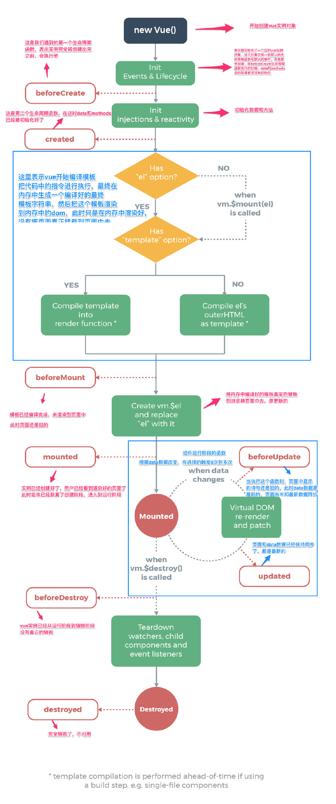
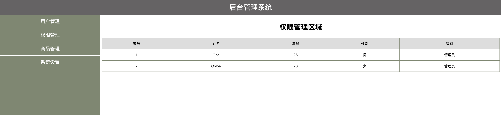

### 1.路由的概念

路由的本质就是一种对应关系，比如说我们在url地址中输入我们要访问的url地址之后，浏览器要去请求这个url地址对应的资源。
那么url地址和真实的资源之间就有一种对应的关系，就是路由。

路由分为前端路由和后端路由
1).后端路由是由服务器端进行实现，并完成资源的分发
2).前端路由是依靠hash值(锚链接)的变化进行实现 

后端路由性能相对前端路由来说较低，所以，我们接下来主要学习的是前端路由
前端路由的基本概念：根据不同的事件来显示不同的页面内容，即事件与事件处理函数之间的对应关系
前端路由主要做的事情就是监听事件并分发执行事件处理函数

### 2.Vue Router简介

它是一个Vue.js官方提供的路由管理器。是一个功能更加强大的前端路由器，推荐使用。
Vue Router和Vue.js非常契合，可以一起方便的实现SPA(single page web application,单页应用程序)应用程序的开发。
Vue Router依赖于Vue，所以需要先引入Vue，再引入Vue Router

Vue Router的特性：
支持H5历史模式或者hash模式
支持嵌套路由
支持路由参数
支持编程式路由
支持命名路由
支持路由导航守卫
支持路由过渡动画特效
支持路由懒加载
支持路由滚动行为

### 3.Vue Router的使用步骤

```js
A.导入js文件

<script src="lib/vue_2.5.22.js"></script>
<script src="lib/vue-router_3.0.2.js"></script>

B.添加路由链接:<router-link>是路由中提供的标签，默认会被渲染为a标签，to属性默认被渲染为href属性，
to属性的值会被渲染为#开头的hash地址
<router-link to="/user">User</router-link>
<router-link to="/login">Login</router-link>

C.添加路由填充位（路由占位符）
<router-view></router-view>

D.定义路由组件
var User = { template:"<div>This is User</div>" }
var Login = { template:"<div>This is Login</div>" }

E.配置路由规则并创建路由实例
var myRouter = new VueRouter({
    //routes是路由规则数组
    routes:[
        //每一个路由规则都是一个对象，对象中至少包含path和component两个属性
        //path表示  路由匹配的hash地址，component表示路由规则对应要展示的组件对象
        {path:"/user",component:User},
        {path:"/login",component:Login}
    ]
})

F.将路由挂载到Vue实例中
new Vue({
    el:"#app",
    //通过router属性挂载路由对象
    router:myRouter
})

小结：
Vue Router的使用步骤还是比较清晰的，按照步骤一步一步就能完成路由操作
A.导入js文件
B.添加路由链接
C.添加路由占位符(最后路由展示的组件就会在占位符的位置显示)
D.定义路由组件
E.配置路由规则并创建路由实例
F.将路由挂载到Vue实例中

补充：
路由重定向：可以通过路由重定向为页面设置默认展示的组件
在路由规则中添加一条路由规则即可，如下：
var myRouter = new VueRouter({
    //routes是路由规则数组
    routes: [
        //path设置为/表示页面最初始的地址 / ,redirect表示要被重定向的新地址，设置为一个路由即可
        { path:"/",redirect:"/user"},
        { path: "/user", component: User },
        { path: "/login", component: Login }
    ]
})
```

```html
<!DOCTYPE html>
<html lang="en">

<head>
    <meta charset="UTF-8">
    <title>Document</title>
</head>

<body>
    <script src="../资料/vue_2.5.22.js"></script>
    <script src="../资料/vue-router_3.0.2.js"></script>

    <div id="app">
        <h1>Hello App!</h1>
        <router-link to="/user">User</router-link>
        <router-link to="/login">Login</router-link>
        <!-- 路由出口 -->
        <!-- 路由匹配到的组件将渲染在这里 -->
        <router-view></router-view>
    </div>

    <script>
        // 1. 定义 (路由) 组件。
        const User = { template: '<div>This is User</div>' }
        const Login = { template: '<div>This is Login</div>' }

        // 2. 定义路由
        // const routes = [
        //     { path: '/user', component: User },
        //     { path: '/login', component: Login }
        // ]

        // 3. 创建 router 实例，然后传 `routes` 配置
        // 你还可以传别的配置参数, 不过先这么简单着吧。
        const router = new VueRouter({
            // routes // (缩写) 相当于 routes: routes
            routes: [
                //每一个路由规则都是一个对象，对象中至少包含path和component两个属性
                //path表示  路由匹配的hash地址，component表示路由规则对应要展示的组件对象
                { path: "/user", component: User },
                { path: "/login", component: Login }
            ]
        })
        const app = new Vue({
            el: "#app",
            router
        })
        // 4. 创建和挂载根实例。
        // 记得要通过 router 配置参数注入路由，
        // 从而让整个应用都有路由功能
       

        // const app = new Vue({
        //     router
        // }).$mount('#app')
    </script>
</body>

</html>
```


### 4.嵌套路由，动态路由的实现方式

#### A.嵌套路由的概念(★★★)

当我们进行路由的时候显示的组件中还有新的子级路由链接以及内容。

嵌套路由最关键的代码在于理解子级路由的概念：
比如我们有一个/login的路由
那么/login下面还可以添加子级路由，如:
/login/password
/login/register

```html
<!DOCTYPE html>
<html lang="en">

<head>
    <meta charset="UTF-8">
    <title>Document</title>
</head>

<body>
    <script src="../资料/vue_2.5.22.js"></script>
    <script src="../资料/vue-router_3.0.2.js"></script>

    <div id="app">
        <h1>Hello App!</h1>
        <router-link to="/user">User</router-link>
        <router-link to="/login">Login</router-link>
        <router-view></router-view>
    </div>

    <script>
        const User = { template: '<div>This is User</div>' }
        //Login组件中的模板代码里面包含了子级路由链接以及子级路由的占位符
        const Login = {
            template: `<div>
        <h1>This is Login</h1>
        <hr>
        <router-link to="/login/password">账号密码登录</router-link>
        <router-link to="/login/register">注册</router-link>
        <!-- 子路由组件将会在router-view中显示 -->
        <router-view></router-view>
        </div>` }


        //定义两个子级路由组件
        var password = { template: "<div>账号：<input><br>密码：<input></div>" };
        var register = { template: "<h1>注册</h1>" };
        const router = new VueRouter({
            routes: [
                { path: "/", redirect: "/user" },
                { path: "/user", component: User },
                {
                    path: "/login",
                    component: Login,
                     //通过children属性为/login添加子路由规则
                    children: [
                        { path: "/login/password", component: password },
                        { path: "/login/register", component: register }
                    ]
                }
            ]
        })
        const app = new Vue({
            router
        }).$mount('#app')
    </script>
</body>

</html>
```

#### B.动态路由匹配(★★★)

- $route.params.id

```html
<!DOCTYPE html>
<html lang="en">

<head>
    <meta charset="UTF-8">
    <title>Document</title>
</head>

<body>
    <script src="../资料/vue_2.5.22.js"></script>
    <script src="../资料/vue-router_3.0.2.js"></script>

    <div id="app">
        <h1>Hello App!</h1>
        <router-link to="/user">User</router-link>
        <router-link to="/login">Login</router-link>
        <router-link to="/pro/100">product</router-link>
        <router-view></router-view>
    </div>

    <script>
        const User = { template: '<div>This is User</div>' }
        //Login组件中的模板代码里面包含了子级路由链接以及子级路由的占位符
        const Login = {
            template: `<div>
        <h1>This is Login</h1>
        <hr>
        <router-link to="/login/password">账号密码登录</router-link>
        <router-link to="/login/register">注册</router-link>
        <!-- 子路由组件将会在router-view中显示 -->
        <router-view></router-view>
        </div>` }
        // 动态路由
        const Product = {
            template: '<h1>{{$route.params.id}}</h1>',
        }
        //定义两个子级路由组件
        var password = { template: "<div>账号：<input><br>密码：<input></div>" };
        var register = { template: "<h1>注册</h1>" };
        const router = new VueRouter({
            routes: [
                { path: "/", redirect: "/user" },
                { path: "/user", component: User },
                {
                    path: "/login",
                    component: Login,
                    //通过children属性为/login添加子路由规则
                    children: [
                        { path: "/login/password", component: password },
                        { path: "/login/register", component: register }
                    ]
                },
                { path: "/pro/:id", component: Product }
            ]
        })
        const app = new Vue({
            router
        }).$mount('#app')
    </script>
</body>

</html>
```

- 如果使用$route.params.id来获取路径传参的数据不够灵活。我们可以通过props来接收参数

```html
<!DOCTYPE html>
<html lang="en">

<head>
    <meta charset="UTF-8">
    <title>Document</title>
</head>

<body>
    <script src="../资料/vue_2.5.22.js"></script>
    <script src="../资料/vue-router_3.0.2.js"></script>

    <div id="app">
        <h1>Hello App!</h1>
        <router-link to="/user">User</router-link>
        <router-link to="/login">Login</router-link>
        <router-link to="/pro/100">product</router-link>
        <router-view></router-view>
    </div>

    <script>
        const User = { template: '<div>This is User</div>' }
        //Login组件中的模板代码里面包含了子级路由链接以及子级路由的占位符
        const Login = {
            template: `<div>
        <h1>This is Login</h1>
        <hr>
        <router-link to="/login/password">账号密码登录</router-link>
        <router-link to="/login/register">注册</router-link>
        <!-- 子路由组件将会在router-view中显示 -->
        <router-view></router-view>
        </div>` }
        // 动态路由
        const Product = {
            props:['id'],
            template: '<h1>{{id}}</h1>',
        }
        //定义两个子级路由组件
        var password = { template: "<div>账号：<input><br>密码：<input></div>" };
        var register = { template: "<h1>注册</h1>" };
        const router = new VueRouter({
            routes: [
                { path: "/", redirect: "/user" },
                { path: "/user", component: User },
                {
                    path: "/login",
                    component: Login,
                    //通过children属性为/login添加子路由规则
                    children: [
                        { path: "/login/password", component: password },
                        { path: "/login/register", component: register }
                    ]
                },
                 //如果props设置为true，route.params将会被设置为组件属性,不设置接收不到
                { path: "/pro/:id", component: Product,props:true }
            ]
        })
        const app = new Vue({
            router
        }).$mount('#app')
    </script>
</body>

</html>
```

- 我们可以将props设置为对象，那么就直接将对象的数据传递给组件进行使用

```html
<!DOCTYPE html>
<html lang="en">

<head>
    <meta charset="UTF-8">
    <title>Document</title>
</head>

<body>
    <script src="../资料/vue_2.5.22.js"></script>
    <script src="../资料/vue-router_3.0.2.js"></script>

    <div id="app">
        <h1>Hello App!</h1>
        <router-link to="/user">User</router-link>
        <router-link to="/login">Login</router-link>
        <router-link to="/pro/100">product</router-link>
        <router-view></router-view>
    </div>

    <script>
        const User = { template: '<div>This is User</div>' }
        //Login组件中的模板代码里面包含了子级路由链接以及子级路由的占位符
        const Login = {
            template: `<div>
        <h1>This is Login</h1>
        <hr>
        <router-link to="/login/password">账号密码登录</router-link>
        <router-link to="/login/register">注册</router-link>
        <!-- 子路由组件将会在router-view中显示 -->
        <router-view></router-view>
        </div>` }
        // 动态路由
        const Product = {
            props: ['id', 'price', 'username'],
            template: '<h1>{{id}}--{{price}}--{{username}}</h1>',
        }
        //定义两个子级路由组件
        var password = { template: "<div>账号：<input><br>密码：<input></div>" };
        var register = { template: "<h1>注册</h1>" };
        const router = new VueRouter({
            routes: [
                { path: "/", redirect: "/user" },
                { path: "/user", component: User },
                {
                    path: "/login",
                    component: Login,
                    //通过children属性为/login添加子路由规则
                    children: [
                        { path: "/login/password", component: password },
                        { path: "/login/register", component: register }
                    ]
                },
                //如果props设置为true，route.params将会被设置为组件属性,不设置接收不到
                //使用此方式时 id接收不到
                { path: "/pro/:id", component: Product, props: { price: 5001, username: 'tom' } }
            ]
        })
        const app = new Vue({
            router
        }).$mount('#app')
    </script>
</body>

</html>
```

获取id

- 使用$route.params.id的方式

```html
<!DOCTYPE html>
<html lang="en">

<head>
    <meta charset="UTF-8">
    <title>Document</title>
</head>

<body>
    <script src="../资料/vue_2.5.22.js"></script>
    <script src="../资料/vue-router_3.0.2.js"></script>

    <div id="app">
        <h1>Hello App!</h1>
        <router-link to="/user">User</router-link>
        <router-link to="/login">Login</router-link>
        <router-link to="/pro/100">product</router-link>
        <router-view></router-view>
    </div>

    <script>
        const User = { template: '<div>This is User</div>' }
        //Login组件中的模板代码里面包含了子级路由链接以及子级路由的占位符
        const Login = {
            template: `<div>
        <h1>This is Login</h1>
        <hr>
        <router-link to="/login/password">账号密码登录</router-link>
        <router-link to="/login/register">注册</router-link>
        <!-- 子路由组件将会在router-view中显示 -->
        <router-view></router-view>
        </div>` }
        // 动态路由
        const Product = {
            props: ['id', 'price', 'username'],
            template: '<h1>{{$route.params.id}}--{{price}}--{{username}}</h1>',
        }
        //定义两个子级路由组件
        var password = { template: "<div>账号：<input><br>密码：<input></div>" };
        var register = { template: "<h1>注册</h1>" };
        const router = new VueRouter({
            routes: [
                { path: "/", redirect: "/user" },
                { path: "/user", component: User },
                {
                    path: "/login",
                    component: Login,
                    //通过children属性为/login添加子路由规则
                    children: [
                        { path: "/login/password", component: password },
                        { path: "/login/register", component: register }
                    ]
                },
                //使用此方式时 id接收不到，需要将props设置为true，route.params将会被设置为组件属性,不设置接收不到
                { path: "/pro/:id", component: Product, props: { price: 5001, username: 'tom' } }
            ]
        })
        const app = new Vue({
            router
        }).$mount('#app')
    </script>
</body>

</html>
```

- 设置为函数形式。

```html
<!DOCTYPE html>
<html lang="en">

<head>
    <meta charset="UTF-8">
    <title>Document</title>
</head>

<body>
    <script src="../资料/vue_2.5.22.js"></script>
    <script src="../资料/vue-router_3.0.2.js"></script>

    <div id="app">
        <h1>Hello App!</h1>
        <router-link to="/user">User</router-link>
        <router-link to="/login">Login</router-link>
        <router-link to="/pro/100">product</router-link>
        <router-view></router-view>
    </div>

    <script>
        const User = { template: '<div>This is User</div>' }
        //Login组件中的模板代码里面包含了子级路由链接以及子级路由的占位符
        const Login = {
            template: `<div>
        <h1>This is Login</h1>
        <hr>
        <router-link to="/login/password">账号密码登录</router-link>
        <router-link to="/login/register">注册</router-link>
        <!-- 子路由组件将会在router-view中显示 -->
        <router-view></router-view>
        </div>` }
        // 动态路由
        const Product = {
            props: ['id', 'price', 'username'],
            template: '<h1>{{id}}--{{price}}--{{username}}</h1>',
        }
        //定义两个子级路由组件
        var password = { template: "<div>账号：<input><br>密码：<input></div>" };
        var register = { template: "<h1>注册</h1>" };
        const router = new VueRouter({
            routes: [
                { path: "/", redirect: "/user" },
                { path: "/user", component: User },
                {
                    path: "/login",
                    component: Login,
                    //通过children属性为/login添加子路由规则
                    children: [
                        { path: "/login/password", component: password },
                        { path: "/login/register", component: register }
                    ]
                },
                //如果props设置为true，route.params将会被设置为组件属性,不设置接收不到
                //使用此方式时 id接收不到
                {
                    path: "/pro/:id", component: Product,
                    props: (route) => {
                        return { username: "jack", price: 123, id: route.params.id }
                    }
                }
            ]
        })
        const app = new Vue({
            router
        }).$mount('#app')
    </script>
</body>

</html>
```

### 5.命名路由以及编程式导航

#### A.命名路由：给路由取别名

```js
var myRouter = new VueRouter({
    //routes是路由规则数组
    routes: [
        //通过name属性为路由添加一个别名
        { path: "/user/:id", component: User, name:"user"},
]
})
//添加了别名之后，可以使用别名进行跳转
<router-link to="/user">User</router-link>
//点此链接，跳转到指定的user
<router-link :to="{ name:'user' , params: {id:123} }">User</router-link>
```

```html
<!DOCTYPE html>
<html lang="en">

<head>
    <meta charset="UTF-8">
    <title>Document</title>
</head>

<body>
    <script src="../资料/vue_2.5.22.js"></script>
    <script src="../资料/vue-router_3.0.2.js"></script>

    <div id="app">
        <h1>Hello App!</h1>
        <router-link to="/user">User</router-link>
        <router-link to="/login">Login</router-link>
        <router-link to="/pro/100">product</router-link>
        <router-link :to="{name:'news',params:{id:12,title:'新闻'}}">News</router-link>
        <router-view></router-view>
    </div>

    <script>
        const User = { template: '<div>This is User</div>' }
        //Login组件中的模板代码里面包含了子级路由链接以及子级路由的占位符
        const Login = {
            template: `<div>
        <h1>This is Login</h1>
        <hr>
        <router-link to="/login/password">账号密码登录</router-link>
        <router-link to="/login/register">注册</router-link>
        <!-- 子路由组件将会在router-view中显示 -->
        <router-view></router-view>
        </div>` }
        // 动态路由
        const Product = {
            props: ['id', 'price', 'username'],
            template: '<h1>{{id}}--{{price}}--{{username}}</h1>',
        }
        const News = {
            props: ['id', 'title'],
            template: '<h1>{{id}}--{{title}}</h1>',
        }
        //定义两个子级路由组件
        var password = { template: "<div>账号：<input><br>密码：<input></div>" };
        var register = { template: "<h1>注册</h1>" };
        const router = new VueRouter({
            routes: [
                { path: "/", redirect: "/user" },
                { path: "/user", component: User },
                { path: "/news", component: News,name:"news",props:true },
                {
                    path: "/login",
                    component: Login,
                    //通过children属性为/login添加子路由规则
                    children: [
                        { path: "/login/password", component: password },
                        { path: "/login/register", component: register }
                    ]
                },
                //如果props设置为true，route.params将会被设置为组件属性,不设置接收不到
                //使用此方式时 id接收不到
                {
                    path: "/pro/:id", component: Product,
                    props: (route) => {
                        return { username: "jack", price: 123, id: route.params.id }
                    }
                }
            ]
        })
        const app = new Vue({
            router
        }).$mount('#app')
    </script>
</body>

</html>
```

#### B.编程式导航(★★★)

页面导航的两种方式：

A.声明式导航：通过点击链接的方式实现的导航

- 点击a标签
- 点击router-link

B.编程式导航：调用js的api方法实现导航

- location.href

```html
<!DOCTYPE html>
<html lang="en">

<head>
    <meta charset="UTF-8">
    <title>Document</title>
</head>

<body>
    <script src="../资料/vue_2.5.22.js"></script>
    <script src="../资料/vue-router_3.0.2.js"></script>

    <div id="app">
        <h1>Hello App!</h1>
        <router-link to="/user">User</router-link>
        <router-link to="/login">Login</router-link>
        <router-link to="/pro/100">product</router-link>
        <router-link :to="{name:'news',params:{id:12,title:'新闻'}}">News</router-link>
        <router-view></router-view>
    </div>

    <script>
        const User = { template: `<div>This is User
        
        <button @click="go">编程式导航</button>
        
        </div>` ,
        methods: {
            go(){
                this.$router.push('/login')
            }
        },}
        //Login组件中的模板代码里面包含了子级路由链接以及子级路由的占位符
        const Login = {
            template: `<div>
        <h1>This is Login</h1>
        <hr>
        <router-link to="/login/password">账号密码登录</router-link>
        <router-link to="/login/register">注册</router-link>
        <!-- 子路由组件将会在router-view中显示 -->
        <router-view></router-view>
        </div>` }
        // 动态路由
        const Product = {
            props: ['id', 'price', 'username'],
            template: '<h1>{{id}}--{{price}}--{{username}}</h1>',
        }
        const News = {
            props: ['id', 'title'],
            template: '<h1>{{id}}--{{title}}</h1>',
        }
        //定义两个子级路由组件
        var password = { template: "<div>账号：<input><br>密码：<input></div>" };
        var register = { template: "<h1>注册</h1>" };
        const router = new VueRouter({
            routes: [
                { path: "/", redirect: "/user" },
                { path: "/user", component: User },
                { path: "/news", component: News,name:"news",props:true },
                {
                    path: "/login",
                    component: Login,
                    //通过children属性为/login添加子路由规则
                    children: [
                        { path: "/login/password", component: password },
                        { path: "/login/register", component: register }
                    ]
                },
                //如果props设置为true，route.params将会被设置为组件属性,不设置接收不到
                //使用此方式时 id接收不到
                {
                    path: "/pro/:id", component: Product,
                    props: (route) => {
                        return { username: "jack", price: 123, id: route.params.id }
                    }
                }
            ]
        })
        const app = new Vue({
            router
        }).$mount('#app')
    </script>
</body>

</html>
```

##### Vue-Router中常见的导航方式：

```js
Vue-Router中常见的导航方式：
this.$router.push("hash地址");
this.$router.push("/login");
this.$router.push({ name:'user' , params: {id:123} });
this.$router.push({ path:"/login" });
this.$router.push({ path:"/login",query:{username:"jack"} });

this.$router.go( n );//n为数字，参考history.go
this.$router.go( -1 );//后退
```

### 6.路由传参

query方式

```html
<router-link to="/login?id=10&name=zs">登录</router-link>
```

```js
{path:'/login',component:login}
```

经过测试发现，如果在路由中使用？字符串传递参数，则不需要修改路由规则的path属性

- 获取参数的值

  $route

```js
var login = {
    template:'<h1>登录--{{$route.query.id}}-{{$route.query.name}}</h1>',
    created(){
        console.log(this.$route)
        console.log(this.$route.query.id)
        console.log(this.$route.query.name)
    }
}
```

```html
<!DOCTYPE html>
<html lang="en">

<head>
    <meta charset="UTF-8">
    <title>Document</title>
</head>

<body>
    <script src="../资料/vue_2.5.22.js"></script>
    <script src="../资料/vue-router_3.0.2.js"></script>

    <div id="app">
        <h1>Hello App!</h1>
        <router-link to="/user">User</router-link>
        <router-link to="/login">Login</router-link>
        <router-link to="/pro?name=tom">product</router-link>
        <router-view></router-view>
    </div>

    <script>
        const User = { template: '<div>This is User</div>' }
        //Login组件中的模板代码里面包含了子级路由链接以及子级路由的占位符
        const Login = {
            template: `<div>
        <h1>This is Login</h1>
        <hr>
        <router-link to="/login/password">账号密码登录</router-link>
        <router-link to="/login/register">注册</router-link>
        <!-- 子路由组件将会在router-view中显示 -->
        <router-view></router-view>
        </div>` }
        // 动态路由
        const Product = {
            template: '<h1>{{$route.query.name}}</h1>',
        }
        //定义两个子级路由组件
        var password = { template: "<div>账号：<input><br>密码：<input></div>" };
        var register = { template: "<h1>注册</h1>" };
        const router = new VueRouter({
            routes: [
                { path: "/", redirect: "/user" },
                { path: "/user", component: User },
                {
                    path: "/login",
                    component: Login,
                    //通过children属性为/login添加子路由规则
                    children: [
                        { path: "/login/password", component: password },
                        { path: "/login/register", component: register }
                    ]
                },
                { path: "/pro", component: Product }
            ]
        })
        const app = new Vue({
            router
        }).$mount('#app')
    </script>
</body>

</html>
```

params方式

```js
{path:'/login/:id/:name',component:login}
```

```html
<router-link to="/login/12/tom">登录</router-link>
```

这个冒号相当于占位符，如果直接写id就是匹配字符串id，加上：相当于匹配传参的id

- 获取参数,这时query里没有参数了，转到params里

  ```js
  var login = {
      template:'<h1>登录--{{$route.params.id}}-{{$route.params.name}}</h1>',
      created(){
          console.log(this.$route)
          console.log(this.$route.params.id)
          console.log(this.$route.params.name)
      }
  }
  ```

  


### 7.vue实例的生命周期

### 实例生命周期钩子 = 生命周期函数 = 生命周期事件

每个 Vue 实例在被创建时都要经过一系列的初始化过程——例如，需要设置数据监听、编译模板、将实例挂载到 DOM 并在数据变化时更新 DOM 等。同时在这个过程中也会运行一些叫做**生命周期钩子**的函数，这给了用户在不同阶段添加自己的代码的机会。

比如 [`created`](https://cn.vuejs.org/v2/api/#created) 钩子可以用来在一个实例被创建之后执行代码：

```
new Vue({
  data: {
    a: 1
  },
  created: function () {
    // `this` 指向 vm 实例
    console.log('a is: ' + this.a)
  }
})
// => "a is: 1"
```

也有一些其它的钩子，在实例生命周期的不同阶段被调用，如 [`mounted`](https://cn.vuejs.org/v2/api/#mounted)、[`updated`](https://cn.vuejs.org/v2/api/#updated)和 [`destroyed`](https://cn.vuejs.org/v2/api/#destroyed)。生命周期钩子的 `this` 上下文指向调用它的 Vue 实例。

> 不要在选项属性或回调上使用[箭头函数](https://developer.mozilla.org/zh-CN/docs/Web/JavaScript/Reference/Functions/Arrow_functions)，比如 `created: () => console.log(this.a)` 或 `vm.$watch('a', newValue => this.myMethod())`。因为箭头函数是和父级上下文绑定在一起的，`this` 不会是如你所预期的 Vue 实例，经常导致 `Uncaught TypeError: Cannot read property of undefined` 或 `Uncaught TypeError: this.myMethod is not a function` 之类的错误。

1. 创建期间的生命周期函数
2. 运行期间的生命周期函数
3. 销毁期间的生命周期函数




#### 常用的 钩子函数

| beforeCreate  | 在实例初始化之后，数据观测和事件配置之前被调用 此时data 和 methods 以及页面的DOM结构都没有初始化   什么都做不了 |
| ------------- | ------------------------------------------------------------ |
| created       | 在实例创建完成后被立即调用,此时data 和 methods已经可以使用  但是页面还没有渲染出来 |
| beforeMount   | 在挂载开始之前被调用   此时页面上还看不到真实数据 只是一个模板页面而已 |
| mounted       | el被新创建的vm.$el替换，并挂载到实例上去之后调用该钩子。  数据已经真实渲染到页面上  在这个钩子函数里面我们可以使用一些第三方的插件（页面有模板内容了） |
| beforeUpdate  | 数据更新时调用，发生在虚拟DOM打补丁之前。   页面上数据还是旧的 |
| updated       | 由于数据更改导致的虚拟DOM重新渲染和打补丁，在这之后会调用该钩子。 页面上数据已经替换成最新的 |
| beforeDestroy | 实例销毁之前调用                                             |
| destroyed     | 实例销毁后调用                                               |


# 作业：

mongodb的作业改造，使用路由，完成后台管理系统的路由功能



```css
      html,
      body,
      #app {
        margin: 0;
        padding: 0px;
        height: 100%;
      }
      .header {
        height: 50px;
        background-color: #656364;
        line-height: 50px;
        text-align: center;
        font-size: 24px;
        color: #fff;
      }
      .footer {
        height: 40px;
        line-height: 40px;
        background-color: #656364;
        position: absolute;
        bottom: 0;
        width: 100%;
        text-align: center;
        color: #fff;
      }
      .main {
        display: flex;
        position: absolute;
        top: 50px;
        bottom: 40px;
        width: 100%;
      }
      .content {
        flex: 1;
        text-align: center;
        height: 100%;
      }
      .left {
        flex: 0 0 20%;
        background-color: #7c8870;
      }
      .left a {
        color: white;
        text-decoration: none;
      }
      .right {
        margin: 5px;
      }
      .btns {
        width: 100%;
        height: 35px;
        line-height: 35px;
        background-color: #656364;
        text-align: left;
        padding-left: 10px;
        box-sizing: border-box;
      }
      button {
        height: 30px;
        background-color: #7c8870;
        border: 1px solid lightskyblue;
        font-size: 12px;
        padding: 0 20px;
      }
      .main-content {
        margin-top: 10px;
      }
      ul {
        margin: 0;
        padding: 0;
        list-style: none;
      }
      ul li {
        height: 45px;
        line-height: 45px;
        background-color: #7c8870;
        color: #fff;
        cursor: pointer;
        border-bottom: 1px solid #fff;
      }

      table {
        width: 100%;
        border-collapse: collapse;
      }

      td,
      th {
        border: 1px solid #7c8870;
        line-height: 35px;
        font-size: 12px;
      }

      th {
        background-color: #ddd;
      }
```

```html

<!DOCTYPE html>
<html lang="ZC">

<head>
    <meta charset="UTF-8">
    <meta name="viewport" content="width=device-width, initial-scale=1.0">
    <title>Router</title>
    <link rel="stylesheet" href="css/index.css">
    <script src="js/vue_2.6.12.js"></script>
    <script src="js/vue-router_3.4.9.js"></script>
</head>

<body>
    <div id="app">
        <router-view></router-view>

    </div>
    <script>

        let backstage = {
            template: `
            <div>
                <!-- 头部区域 -->
                <header class="header">后台管理系统</header>
                <!-- 中间主体区域 -->
                <div class="main">
                <!-- 左侧菜单栏 -->
                    <div class="content left">
                        <ul>
                        <li> <router-link to="/users">用户管理</router-link></li>
                        <li> <router-link to="/rights">权限管理</router-link></li>
                        <li> <router-link to="/goods">商品管理</router-link></li>
                        <li> <router-link to="/settings">系统设置</router-link></li>
                        </ul>
                    </div>
                        <!-- 右侧内容区域 -->
                        <div class="content right">
                            <router-view></router-view>
                        </div>
                </div>
                <!-- 尾部区域 -->
                <footer class="footer">版权信息</footer>
            </div>`
        }

        // 数据
        let userlist = [
            { id: 1, name: 'One', age: 26, sex: '男', admin: 'vip' },
            { id: 2, name: 'Chloe', age: 26, sex: '女', admin: 'vip' },
            { id: 3, name: 'Jerry', age: 19, sex: '男', admin: 'consumer' },
            { id: 4, name: 'Quella', age: 31, sex: '女', admin: 'consumer' },
            { id: 5, name: 'Jack', age: 36, sex: '男', admin: 'consumer' },
            { id: 6, name: 'Mark', age: 45, sex: '女', admin: 'consumer' },
            { id: 7, name: 'William', age: 14, sex: '男', admin: 'consumer' },
            { id: 8, name: 'Lilith', age: 18, sex: '女', admin: 'consumer' },
            { id: 9, name: 'Bill', age: 75, sex: '男', admin: 'consumer' },
            { id: 10, name: 'Dave', age: 53, sex: '男', admin: 'consumer' },
            { id: 11, name: 'Chris', age: 22, sex: '女', admin: 'consumer' }
        ]

        // 导航栏组件
        // 用户
        let Users = {
            data() {
                return {
                    userlist: userlist,
                }
            },
            template: `
            <div>
                <h2>用户管理区域</h2>    
                    <table>
                        <thead>
                            <tr>
                                <th>编号</th>
                                <th>姓名</th>
                                <th>年龄</th>
                                <th>性别</th>
                                <th>操作</th>
                            </tr>
                        </thead>
                        <tbody>
                            <tr v-for="(item,index) in userlist" :key="item.id">
                                <td>{{item.id}}</td>
                                <td>{{item.name}}</td>
                                <td>{{item.age}}</td>
                                <td>{{item.sex}}</td>
                                <td><a href="javascript:;" @click='show(item.id,item.name)'>详情</a></td>
                            </tr>
                        </tbody>
                </table>
            </div>`,
            methods: {
                show(id, name) {
                    this.$router.push('/userinfo/' + id + '/' + name)
                }
            },
        }
        let Userinfo = {
            // props: ['id'],
            template: `
            <div>
                <h3>用户详情页面</h3>  
                <h3>用户id为：{{$route.params.id}} 用户姓名为：{{$route.params.name}}</h3>  
                <button @click='goback'>返回</button>
            </div>`,
            methods: {
                goback() {
                    this.$router.go(-1)
                }
            },
        }

        // 权限管理区域
        let Rights = {
            template: `
            <div>
                <h2>权限管理区域</h2>  
                <table>
                        <thead>
                            <tr>
                                <th>编号</th>
                                <th>姓名</th>
                                <th>年龄</th>
                                <th>性别</th>
                                <th>级别</th>
                            </tr>
                        </thead>
                        <tbody>
                            <tr v-if='item.admin=="vip"' v-for="(item,index) in userlist" :key="item.id">
                                <td>{{item.id}}</td>
                                <td>{{item.name}}</td>
                                <td>{{item.age}}</td>
                                <td>{{item.sex}}</td>
                                <td>管理员</td>
                            </tr>
                        </tbody>
                </table>  
            </div>`
        }


        let Goods = {
            template: `
            <div>
                <h2>商品管理区域</h2>    
            </div>`
        }

        let Settings = {
            data() {
                return {
                    userlist: userlist,
                }
            },
            template: `
            <div>
                <h2>系统设置区域</h2> 
                <table>
                        <thead>
                            <tr>
                                <th>编号</th>
                                <th>姓名</th>
                                <th>年龄</th>
                                <th>性别</th>
                                <th>操作</th>
                            </tr>
                        </thead>
                        <tbody>
                            <tr v-for="(item,index) in userlist" :key="item.id" :userlist='userlist'>
                                <td>{{item.id}}</td>
                                <td>{{item.name}}</td>
                                <td>{{item.age}}</td>
                                <td>{{item.sex}}</td>
                                <td><a href="javascript:;" @click='del(item)'>删除</a></td>
                            </tr>
                        </tbody>
                </table>      
            </div>`,
            methods: {
                del(item) {
                    if (item.admin == 'vip') {
                        alert('对方是管理员，无法删除')
                    } else {
                        let i = this.userlist.findIndex((paramete) => {
                            return paramete.id == item.id;
                        })
                        this.userlist.splice(i, 1)
                    }
                }

            },
        }

        const router = new VueRouter({
            routes: [
                {
                    path: '/', component: backstage,
                    children: [
                        { path: '/users', component: Users },
                        { path: '/userinfo/:id/:name', component: Userinfo },
                        { path: '/rights', component: Rights },
                        { path: '/goods', component: Goods },
                        { path: '/settings', component: Settings }
                    ]
                }
            ]
        })

        new Vue({
            el: '#app',
            data: {

            },
            router
        })
    </script>
</body>

</html>
```


