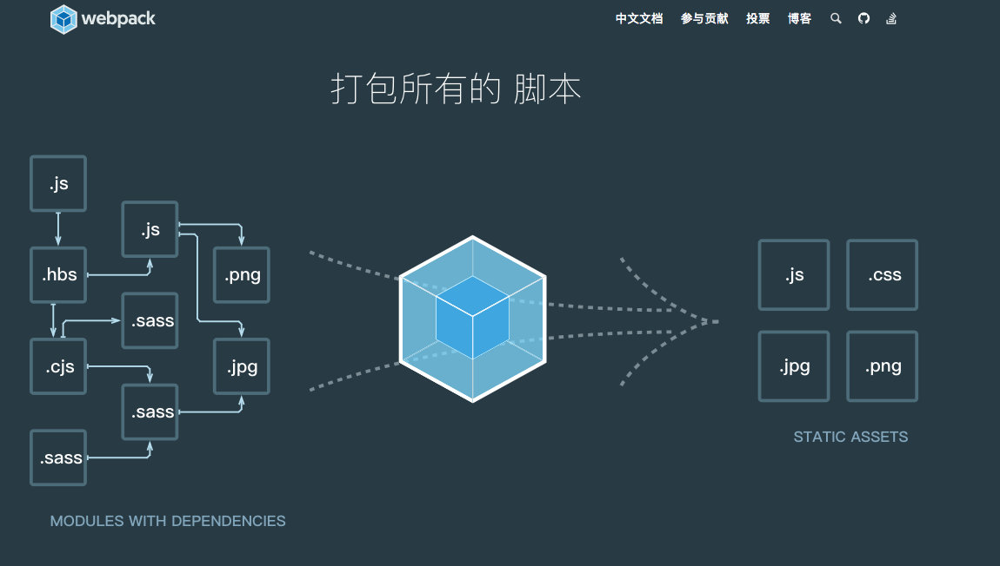
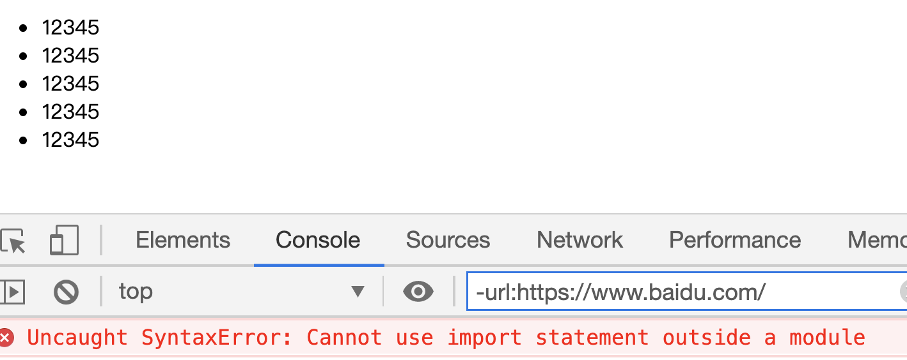
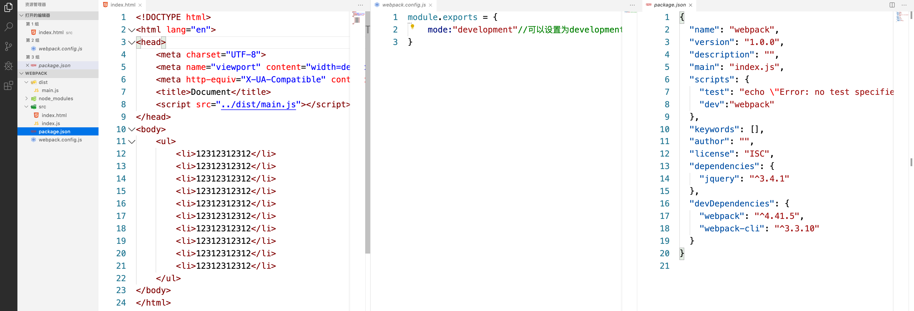
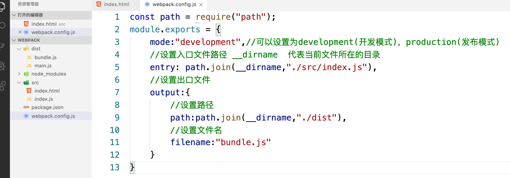
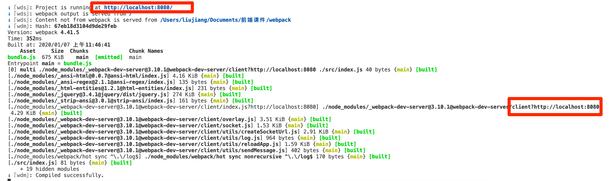
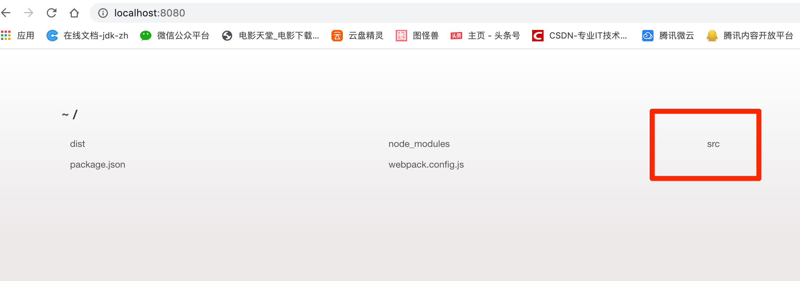
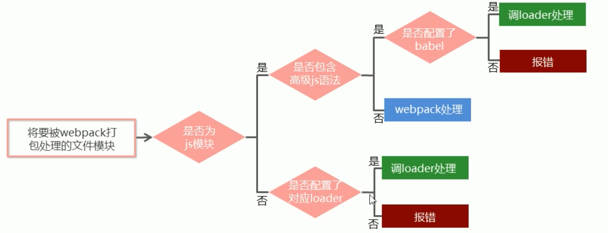
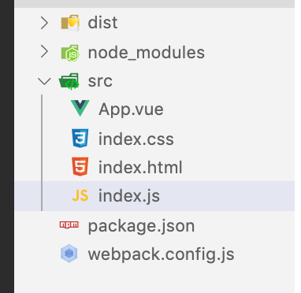
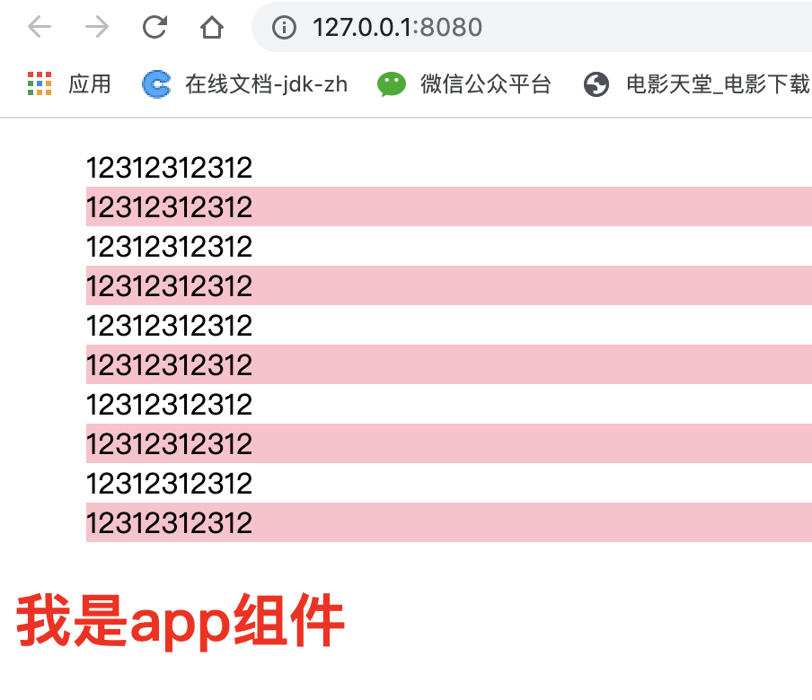
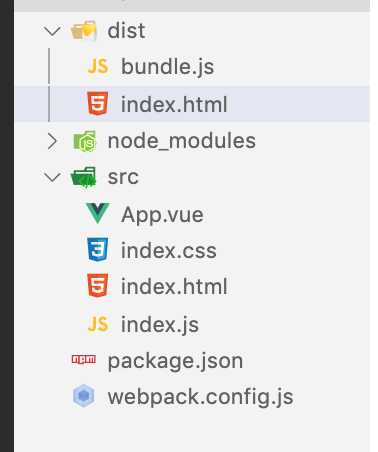

# webpack

webpack是一个流行的前端项目构建工具，可以解决目前web开发的困境。基于nodejs开发出来.
webpack提供了模块化支持，代码压缩混淆，解决js兼容问题，性能优化等特性，提高了开发效率和项目的可维护性



在网页中常见的静态资源文件

- js
- css
- images
- font

网页中引入的静态资源多了，有什么问题？

- 网页加载速度慢，因为我们要发起很多请求
- 要处理错综复杂的依赖关系

如何解决上述两个问题

- 合并、压缩、混淆等

## 1.webpack的基本使用

### A.创建项目目录并初始化

```
创建项目，并打开项目所在目录的终端，输入命令：
    npm init -y  生成package.json文件
```

### B.创建src文件夹（必须有src）

```
在项目src目录中创建index.html页面，并初始化页面结构：在页面中摆放一个ul，ul里面放置几个li
在项目src目录创建index.js文件
```

index.html

```html
<!DOCTYPE html>
<html lang="en">
<head>
    <meta charset="UTF-8">
    <meta name="viewport" content="width=device-width, initial-scale=1.0">
    <title>Document</title>
    <script src="./index.js"></script>
</head>
<body>
    <ul>
        <li>123</li>
        <li>123</li>
        <li>123</li>
        <li>123</li>
    </ul>
</body>
</html>
```

### C.安装jQuery

```
打开项目目录终端，输入命令:
cnpm i jquery -S
```

### D.导入jQuery

打开index.js文件，编写代码导入jQuery并实现功能：

```js
import $ from "jquery";
$(function(){
    $("li:odd").css("background","cyan");
})
```

注意：此时项目运行会有错误，因为import $ from "jquery";这句代码属于ES6的新语法代码，在浏览器中可能会

存在兼容性问题

所以我们需要webpack来帮助我们解决这个问题。



### E.安装webpack

#### 1).打开项目目录终端，输入命令:

cnpm install webpack webpack-cli -D 

```sh
npm uninstall webpack -g   (全局卸载)
npm cache clean --force 清除缓存
全局安装 cnpm install -g webpack@1.13.2
局部安装 cnpm install --save-dev webpack@3.12.0
npm install module_name -S    即    npm install module_name --save    写入dependencies
npm install module_name -D    即    npm install module_name --save-dev 写入devDependencies
```

#### 2).然后在项目根目录中，创建一个 webpack.config.js 的配置文件用来配置webpack

在 webpack.config.js 文件中编写代码进行webpack配置，如下：

```js
module.exports = {
    mode:"development"//可以设置为development(开发模式)，production(发布模式)
}
```

> 补充：mode设置的是项目的编译模式。
> 如果设置为development则表示项目处于开发阶段，不会进行压缩和混淆，打包速度会快一些
> 如果设置为production则表示项目处于上线发布阶段，会进行压缩和混淆，打包速度会慢一些(项目上线时使用)

#### 3).修改项目中的package.json文件添加运行脚本dev，如下：

```js
"scripts":{
    "dev":"webpack"
}
```

> 注意：scripts节点下的脚本，可以通过 npm run 运行，如：
> 运行终端命令：npm run dev

#### 4).运行dev命令进行项目打包，并在页面中引入项目打包生成的js文件

打开项目目录终端，输入命令:
npm run dev
等待webpack打包完毕之后，找到默认的dist路径中生成的main.js文件，将其引入到html页面中。
浏览页面查看效果。

```html
 <script src="../dist/main.js"></script>
```



## 2.设置webpack的打包入口/出口

```js
在webpack 4.x中，默认会将src/index.js 作为默认的打包入口js文件
                 默认会将dist/main.js 作为默认的打包输出js文件
                 
                 
如果不想使用默认的入口/出口js文件，我们可以通过改变 webpack.config.js 来设置入口/出口的js文件，如下：


const path = require("path");
module.exports = {
    mode:"development",//可以设置为development(开发模式)，production(发布模式)
    //设置入口文件路径 __dirname  代表当前文件所在的目录
    entry: path.join(__dirname,"./src/js/index.js"),
    //设置出口文件
    output:{
        //设置路径
        path:path.join(__dirname,"./dist"),
        //设置文件名
        filename:"bundle.js"
    }
}


在src下新建js文件夹，把index.js移动到该文件下
npm run dev
```



## 3.设置webpack的自动打包

- 现在我把隔行变色 改成红色
- 刷新浏览器是没有效果的

- 默认情况下，我们更改入口js文件的代码，需要重新运行命令打包webpack，才能生成出口的js文件
  那么每次都要重新执行命令打包，这是一个非常繁琐的事情，那么，自动打包可以解决这样繁琐的操作。

- 实现自动打包功能的步骤如下：

  - A.安装自动打包功能的包:webpack-dev-server

       ```js
       cnpm install webpack-dev-server -D
       ```

  - B.修改package.json中的dev指令如下：

    ```js
    "scripts":{
        "dev":"webpack-dev-server"
    }
    ```

  - ​    C.将引入的js文件路径更改为：

    ```js
    <script src="/bundle.js"></script>
    ```

    注意：webpack-dev-server自动打包的输出文件，默认放到了服务器的根目录中.(隐藏看不见的)

    - 测试http://localhost:8080/bundle.js是可以访问的 ，这个bundle的名称是我们设置出口文件的文件名

  - ​    D.运行npm run dev，进行打包,执行后比没有退出，因为在等待项目中代码的而改变，自动打包

    

  - ​    E.打开网址查看效果：http://localhost:8080

    

    ```sh
    Error: Cannot find module 'webpack-cli/bin/config-yargs'
    
    因为webpack-cli的新版本对webpack-dev-server版本的不兼容
    
    webpack-cli -v —— "^4.4.0"
    webpack-dev-server -v —— "^3.11.0"
    
    之后降低webpack-cli的版本为 "^3.3.12"
    ```

    

## 4.配置html-webpack-plugin

- 使用html-webpack-plugin 可以生成一个预览页面。
- 因为当我们访问默认的 http://localhost:8080/的时候，看到的是一些文件和文件夹，想要查看我们的页面
  还需要点击文件夹点击文件才能查看，那么我们希望默认就能看到一个页面，而不是看到文件夹或者目录。
  实现默认预览页面功能的步骤如下：

```sh


    A.安装默认预览功能的包:html-webpack-plugin
       cnpm install html-webpack-plugin -D
    B.修改webpack.config.js文件，如下：
        //导入包
        const HtmlWebpackPlugin = require("html-webpack-plugin");
        //创建对象
        const htmlPlugin = new HtmlWebpackPlugin({
            //设置生成预览页面的模板文件
            template:"./src/index.html",
            //设置生成的预览页面名称
            filename:"index.html"
        })
    C.继续修改webpack.config.js文件，添加plugins信息：
        module.exports = {
            ......
            plugins:[ htmlPlugin ]//打包时需要用到的插件
        }

```

```js
const path = require("path");
const HtmlWebpackPlugin = require("html-webpack-plugin");
//创建对象
const htmlPlugin = new HtmlWebpackPlugin({
    //设置生成预览页面的模板文件 ,原理就是打开根目录时，如果有index.html会默认打开
    template:"./src/index.html",
    //设置生成的预览页面名称
    filename:"index.html"
})
module.exports = {
    mode:"development",//可以设置为development(开发模式)，production(发布模式)
    //设置入口文件路径 __dirname  代表当前文件所在的目录
    entry: path.join(__dirname,"./src/index.js"),
    //设置出口文件
    output:{
        //设置路径
        path:path.join(__dirname,"./dist"),
        //设置文件名
        filename:"bundle.js"
    },
    plugins:[ htmlPlugin ]
}

npm run dev
http://localhost:8080/
```

- npm run dev 想自动打开浏览器，也就是在自动打包完毕之后，默认打开服务器网页，实现方式就是打开package.json文件，修改dev命令：

```js
 "dev": "webpack-dev-server --open --host 127.0.0.1 --port 8080"
```

执行npm run dev

## 5.webpack中的加载器

- 通过loader打包非js模块
  - 在实际开发中，webpack默认只能打包处理以.js后缀名结尾的模块，其他非js后缀名结尾的模块，webpack处理不了，需要调用loader加载器才可以正常打包，否则报错！！！

### loader加载器包含：

​        1).less-loader 后缀名less的文件
​        2).sass-loader 后缀名sass
​        3).url-loader:打包处理css中与url路径有关的文件
​        4).babel-loader:处理高级js语法的加载器
​        5).postcss-loader 自动添加css的兼容性前缀
​        6).css-loader,style-loader 处理css文件

注意：指定多个loader时的顺序是固定的，而调用loader的顺序是从后向前进行调用

#### loader的调用过程




### 加载器使用

#### 打包处理css文件

- 需求：把li的原点去掉

  - 在src下新建index.css文件

    ```css
    li{
        list-style: none;
    }
    ```

  - 需要在index.html中引入index.css文件，不建议，引起二次请求，我们可以在js中引入样式表

    ```js
    import $ from "jquery";
    //直接导入并执行代码
    import './index.css'
    $(function(){
        $("li:odd").css("background","pink");
    })
    
    报错
    You may need an appropriate loader to handle this file type, currently no loaders are configured to process this file. See https://webpack.js.org/concepts#loaders
    ```

- 安装，处理css的loader

  ```js
  cnpm i style-loader css-loader -D
  ```

- 配置规则：更改webpack.config.js的module中的rules数组

  ```js
   module.exports = {
          ......
          plugins:[ htmlPlugin ],
          module : {
              rules:[
                  {
                      //test设置需要匹配的文件类型，支持正则
                      test:/\.css$/,
                      //use表示该文件类型需要调用的loader,顺序是固定的，从后往前调用
                      use:['style-loader','css-loader']
                  }
              ]
          }
      }
  ```

- 运行  npm run dev

  

#### 打包处理less文件

安装less,less-loader处理less文件

```js
cnpm install less-loader less -D
```

配置规则：更改webpack.config.js的module中的rules数组

```js
module.exports = {
        ......
        plugins:[ htmlPlugin ],
        module : {
            rules:[
                {
                    //test设置需要匹配的文件类型，支持正则
                    test:/\.css$/,
                    //use表示该文件类型需要调用的loader
                    use:['style-loader','css-loader']
                },
                {
                    test:/\.less$/,
                    use:['style-loader','css-loader','less-loader']
                }
            ]
        }
    }
```

附：

```

C.安装sass-loader,node-sass处理less文件
    1).安装包
        npm install sass-loader node-sass -D
    2).配置规则：更改webpack.config.js的module中的rules数组
    module.exports = {
        ......
        plugins:[ htmlPlugin ],
        module : {
            rules:[
                {
                    //test设置需要匹配的文件类型，支持正则
                    test:/\.css$/,
                    //use表示该文件类型需要调用的loader
                    use:['style-loader','css-loader']
                },
                {
                    test:/\.less$/,
                    use:['style-loader','css-loader','less-loader']
                },
                {
                    test:/\.scss$/,
                    use:['style-loader','css-loader','sass-loader']
                }
            ]
        }
    }

    补充：安装sass-loader失败时，大部分情况是因为网络原因，详情参考：
    https://segmentfault.com/a/1190000010984731?utm_source=tag-newest

D.安装post-css自动添加css的兼容性前缀（-ie-,-webkit-）
1).安装包
    npm install postcss-loader autoprefixer -D
2).在项目根目录创建并配置postcss.config.js文件
const autoprefixer = require("autoprefixer");
module.exports = {
    plugins:[ autoprefixer ]
}
3).配置规则：更改webpack.config.js的module中的rules数组
module.exports = {
    ......
    plugins:[ htmlPlugin ],
    module : {
        rules:[
            {
                //test设置需要匹配的文件类型，支持正则
                test:/\.css$/,
                //use表示该文件类型需要调用的loader
                use:['style-loader','css-loader','postcss-loader']
            },
            {
                test:/\.less$/,
                use:['style-loader','css-loader','less-loader']
            },
            {
                test:/\.scss$/,
                use:['style-loader','css-loader','sass-loader']
            }
        ]
    }
}

E.打包样式表中的图片以及字体文件
在样式表css中有时候会设置背景图片和设置字体文件，一样需要loader进行处理
使用url-loader和file-loader来处理打包图片文件以及字体文件
1).安装包
    npm install url-loader file-loader -D
2).配置规则：更改webpack.config.js的module中的rules数组
module.exports = {
    ......
    plugins:[ htmlPlugin ],
    module : {
        rules:[
            {
                //test设置需要匹配的文件类型，支持正则
                test:/\.css$/,
                //use表示该文件类型需要调用的loader
                use:['style-loader','css-loader']
            },
            {
                test:/\.less$/,
                use:['style-loader','css-loader','less-loader']
            },
            {
                test:/\.scss$/,
                use:['style-loader','css-loader','sass-loader']
            },{
                test:/\.jpg|png|gif|bmp|ttf|eot|svg|woff|woff2$/,
                //limit用来设置字节数，只有小于limit值的图片，才会转换
                //为base64图片
                use:"url-loader?limit=16940"
            }
        ]
    }
}

F.打包js文件中的高级语法：在编写js的时候，有时候我们会使用高版本的js语法
有可能这些高版本的语法不被兼容，我们需要将之打包为兼容性的js代码
我们需要安装babel系列的包
A.安装babel转换器
    npm install babel-loader @babel/core @babel/runtime -D
B.安装babel语法插件包
    npm install @babel/preset-env @babel/plugin-transform-runtime @babel/plugin-proposal-class-properties -D
C.在项目根目录创建并配置babel.config.js文件
    
    module.exports = {
        presets:["@babel/preset-env"],
        plugins:[ "@babel/plugin-transform-runtime", "@babel/plugin-proposal-class-properties" ]
    }
D.配置规则：更改webpack.config.js的module中的rules数组
module.exports = {
    ......
    plugins:[ htmlPlugin ],
    module : {
        rules:[
            {
                //test设置需要匹配的文件类型，支持正则
                test:/\.css$/,
                //use表示该文件类型需要调用的loader
                use:['style-loader','css-loader']
            },
            {
                test:/\.less$/,
                use:['style-loader','css-loader','less-loader']
            },
            {
                test:/\.scss$/,
                use:['style-loader','css-loader','sass-loader']
            },{
                test:/\.jpg|png|gif|bmp|ttf|eot|svg|woff|woff2$/,
                //limit用来设置字节数，只有小于limit值的图片，才会转换
                //为base64图片
                use:"url-loader?limit=16940"
            },{
                test:/\.js$/,
                use:"babel-loader",
                //exclude为排除项，意思是不要处理node_modules中的js文件
                exclude:/node_modules/
            }
        ]
    }
}

```


# vue单文件组件

使用Vue单文件组件，每个单文件组件的后缀名都是.vue

每一个Vue单文件组件都由三部分组成

1).template组件组成的模板区域
2).script组成的业务逻辑区域
3).style样式区域

代码如下：

```
<template>

    组件代码区域

</template>

<script>

    js代码区域

</script>

<style scoped>

    样式代码区域

</style>
```

```js
<!--  -->
<template>
  <div>
    <h1>我是app组件</h1>
 </div>
</template>

<script>
export default {
  data () {
    return {
    };
  },

  components: {},

  computed: {},

  mounted:{},

  methods: {}
}

</script>
<style  scoped>
    h1{
        color:red
    }
</style>
```


```js
import $ from "jquery";
import './index.css'
// 导入app.vue
import app from './App.vue'
$(function(){
    $("li:odd").css("background","pink");
})
```



运行报错

- 配置loader

```js
 cnpm install vue-loader vue-template-compiler -D
```

- 配置规则：更改webpack.config.js的module中的rules数组

```js
const path = require("path");
const HtmlWebpackPlugin = require("html-webpack-plugin");
const VueLoaderPlugin = require("vue-loader/lib/plugin");
const vuePlugin = new VueLoaderPlugin();

//创建对象
const htmlPlugin = new HtmlWebpackPlugin({
    //设置生成预览页面的模板文件 ,原理就是打开根目录时，如果有index.html会默认打开
    template: "./src/index.html",
    //设置生成的预览页面名称
    filename: "index.html"
})
module.exports = {
    mode: "development",//可以设置为development(开发模式)，production(发布模式)
    //设置入口文件路径 __dirname  代表当前文件所在的目录
    entry: path.join(__dirname, "./src/index.js"),
    //设置出口文件
    output: {
        //设置路径
        path: path.join(__dirname, "./dist"),
        //设置文件名
        filename: "bundle.js"
    },
    plugins: [htmlPlugin,vuePlugin],
    module: {
        rules: [
            {
                //test设置需要匹配的文件类型，支持正则
                test: /\.css$/,
                //use表示该文件类型需要调用的loader
                use: ['style-loader', 'css-loader']
            },
            {
                test: /\.vue$/,
                loader: "vue-loader",
            }
        ]
    }
}
```

npm run dev 发现没有报错了

# 在webpack中使用vue

```js
cnpm i vue -S
```

在src-》index.js入口文件中，通过import Vue from 'vue'来导入vue构造函数

创建vue对象，并指定控制的区域

通过render函数渲染app跟组件

```js
import $ from "jquery";
import './index.css'
import Vue from 'vue'
// 导入app.vue
import App from './App.vue'

$(function(){
    $("li:odd").css("background","pink");
})

const vm = new Vue({
    el:'#app',
    render:h=>h(App)
})
```

这种写法

```js
{
    render:h=>h(App)
}
等价于
{
    render:h=>{
        return h(App);
    }
}
等价于
{
    render:function(h){
        return h(App);
    }
}
最后，也就是
{
    render:function(creatElement){
        return creatElemnt(App);
    }
}

render:h=>h(App)
1、ES6的写法，表示Vue实例选项对象的render方法作为一个函数，接受传入的参数h函数，返回h(App)的函数调用结果
2、Vue在创建Vue实例时，通过调用render方法来渲染实例的DOM树
3、Vue在调用render方法时，会传入一个createElement函数作为参数，也就是这里的h的实参是createElement函数，然后createElement会以App为参数进行调用
```

index.html

```html
<!DOCTYPE html>
<html lang="en">
<head>
    <meta charset="UTF-8">
    <meta name="viewport" content="width=device-width, initial-scale=1.0">
    <meta http-equiv="X-UA-Compatible" content="ie=edge">
    <title>Document</title>
    <!-- <script src="../dist/bundle.js"></script> -->
    <script src="/bundle.js"></script>
</head>
<body>
    <ul>
        <li>12312312312</li>
        <li>12312312312</li>
        <li>12312312312</li>
        <li>12312312312</li>
        <li>12312312312</li>
        <li>12312312312</li>
        <li>12312312312</li>


        <li>12312312312</li>
        <li>12312312312</li>
        <li>12312312312</li>
    </ul>

    <div id="app">

    </div>
</body>
</html>
```

npm run dev



# webpack打包发布

在项目上线之前，我们需要将整个项目打包并发布。

在项目打包之前，可以将dist目录删除，生成全新的dist目录

配置package.json

```js
   "scripts":{
        "dev":"webpack-dev-server",
        "build":"webpack -p"
    }
```

npm run build

生成dist目录，里面的index.html直接打开即可




```js
{
  "name": "app",
  "version": "1.0.0",
  "description": "",
  "main": "index.js",
  "dependencies": {
    "css-loader": "^5.0.1",
    "html-webpack-plugin": "^4.5.1",
    "jquery": "^3.5.1",
    "less": "^4.1.0",
    "less-loader": "^7.3.0",
    "style-loader": "^2.0.0",
    "vue": "^2.6.12",
    "vue-loader": "^15.9.6",
    "vue-template-compiler": "^2.6.12",
    "vuex": "^3.6.0",
    "webpack": "^5.16.0",
    "webpack-dev-server": "^3.11.2"
  },
  "devDependencies": {},
  "scripts": {
    "test": "echo \"Error: no test specified\" && exit 1",
    "dev":"webpack-dev-server --open --host 127.0.0.1 --port 8080"
  },
  "keywords": [],
  "author": "",
  "license": "ISC"
}

```


