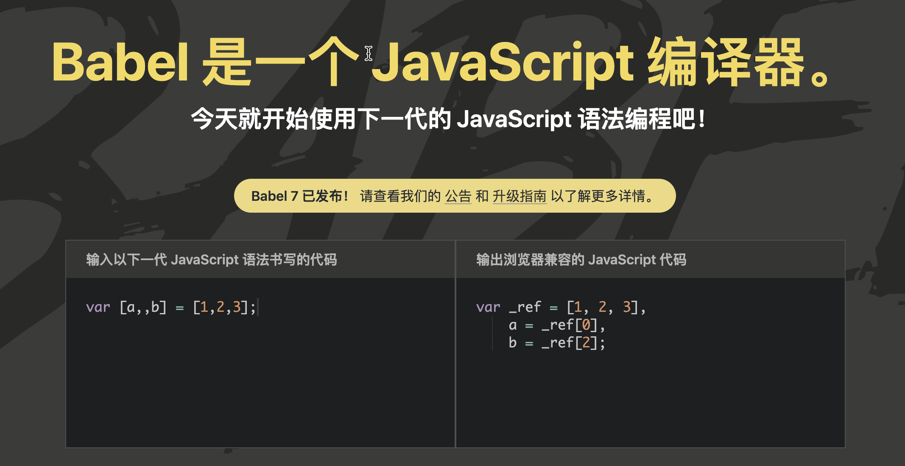
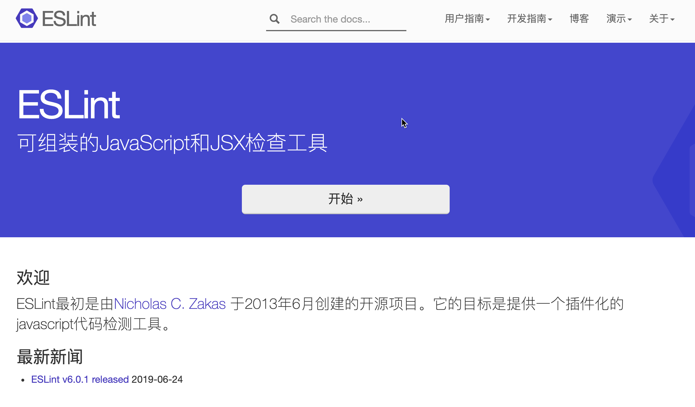
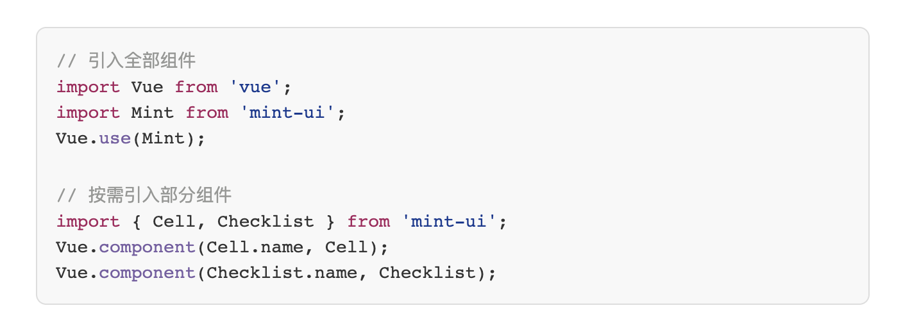
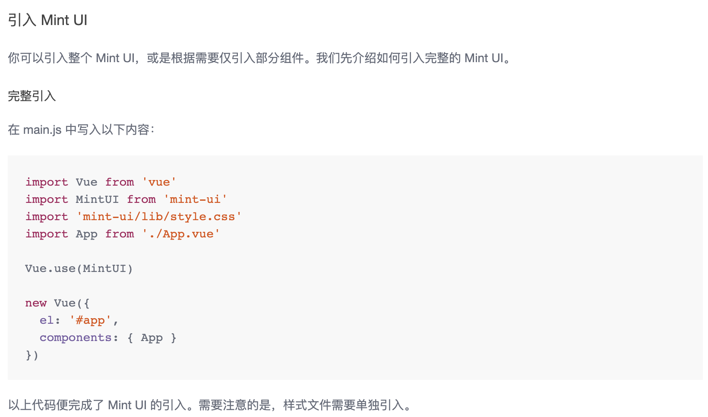
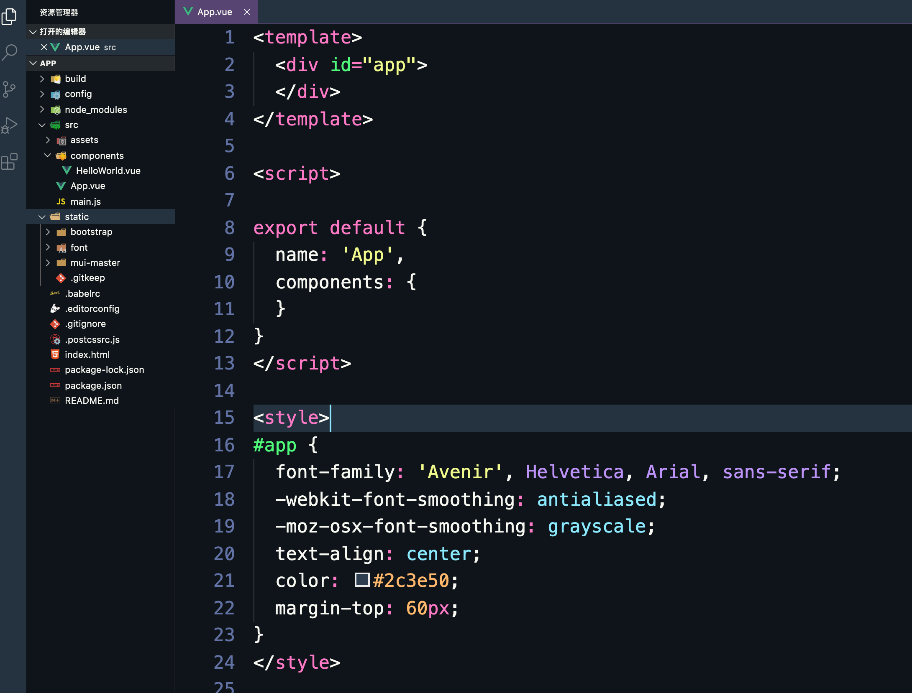

# 一、vue-cli脚手架

帮我们编写好基础代码的工具，搞定目录结构，热加载，本地调试，代码部署

安装

- npm install -g vue-cli(全局安装，安装一次后，无需再次安装)

- 新建项目文件目录，在根目录下执行

  - vue init webpack
  - Generate project in current directory? Yes
  - 项目名？cli-demo
  - 项目描述
  - 作者
  - 安装路由，先不安装
  - eslint检查是否符合规范 n
  - 之后选n，最后选npm安装

- static存放第三方静态资源(static放别人家的，assets放自己写的)

  - `static/` 目录下的文件并不会被 Webpack 处理：它们会直接被复制到最终目录（默认是`dist/static`）下。必须使用绝对路径引用这些文件，这是通过在 `config.js` 文件中的 `build.assetsPublicPath` 和 `build.assetsSubDirectory` 连接来确定的。

    任何放在 `static/` 中文件需要以绝对路径的形式引用：`/static/[filename]`。如果更改 `assetSubDirectory` 的值为 `assets`，那么路径需改为 `/assets/[filename]`

- npm run dev运行模板，之后清理模板


### Vue脚手架生成的项目结构

​    node_modules:依赖包目录
​    static：静态资源目录
​    src：源码目录
​    src/assets:资源目录
​    src/components：组件目录
​    src/App.vue:根组件
​    src/main.js:入口js
​    babel.config.js:babel配置文件
​    .eslintrc.js:






### Vue脚手架的自定义配置

```
A.通过 package.json 进行配置 [不推荐使用]
    "vue":{
        "devServer":{
            "port":"9990",
            "open":true
        }
    }
B.通过单独的配置文件进行配置，创建vue.config.js
    module.exports = {
        devServer:{
            port:8888,
            open:true
        }
    }
```


## 二、mintUI

http://mint-ui.github.io/#!/zh-cn基于 Vue.js 的移动端组件库

安装

```node
npm install mint-ui -S
```





main.js中引入

```js
import MintUI from 'mint-ui'
import 'mint-ui/lib/style.css'
Vue.use(MintUI)
```

测试案例

- 在App.vue中输入,界面出现按钮

  ```html
  <mt-button type="default">default</mt-button>
  <mt-button type="primary">primary</mt-button>
  <mt-button type="danger">danger</mt-button>
  ```

### 按需引入

我们可以只引入需要的组件，以达到减小项目体积的目的。

如果你只希望引入部分组件，比如 Button 和 Cell，那么需要在 main.js 中写入以下内容：

```javascript
// The Vue build version to load with the `import` command
// (runtime-only or standalone) has been set in webpack.base.conf with an alias.
import Vue from 'vue'
import App from './App'
// import MintUI from 'mint-ui'
import { Button, Cell } from 'mint-ui'
import 'mint-ui/lib/style.css'
Vue.component(Button.name, Button)
Vue.component(Cell.name, Cell)

Vue.config.productionTip = false

/* eslint-disable no-new */
new Vue({
  el: '#app',
  components: { App },
  template: '<App/>'
})

```

- Toast

  - 按需导入

  ```js
  // The Vue build version to load with the `import` command
  // (runtime-only or standalone) has been set in webpack.base.conf with an alias.
  import Vue from 'vue'
  import App from './App'
  // import MintUI from 'mint-ui'
  import { Button, Cell, Toast } from 'mint-ui'
  import 'mint-ui/lib/style.css'
  Vue.component(Button.name, Button)
  Vue.component(Toast.name, Toast)
  Vue.config.productionTip = false
  
  /* eslint-disable no-new */
  new Vue({
    el: '#app',
    components: { App },
    template: '<App/>'
  })
  
  ```

  - 导入Toast组件

  ```vue
  <template>
    <div class="hello">
      <mt-button type="default" @click="show">default</mt-button>
      <mt-button type="primary">primary</mt-button>
      <mt-button type="danger">danger</mt-button>
    </div>
  </template>
  
  <script>
  import { Toast } from 'mint-ui';
      
  export default {
    name: "HelloWorld",
    data() {
      return {
        msg: "Welcome to Your Vue.js App"
      };
    },
    methods: {
      show() {
        Toast("提示信息");
      }
    }
  };
  </script>
  
  <!-- Add "scoped" attribute to limit CSS to this component only -->
  <style scoped>
  h1,
  h2 {
    font-weight: normal;
  }
  ul {
    list-style-type: none;
    padding: 0;
  }
  li {
    display: inline-block;
    margin: 0 10px;
  }
  a {
    color: #42b983;
  }
  </style>
  
  ```

| 参数      | 说明                                     | 类型   | 可选值                  | 默认值   |
| --------- | ---------------------------------------- | ------ | ----------------------- | -------- |
| message   | 文本内容                                 | String |                         |          |
| position  | Toast 的位置                             | String | 'top' 'bottom' 'middle' | 'middle' |
| duration  | 持续时间（毫秒），若为 -1 则不会自动关闭 | Number |                         | 3000     |
| className | Toast 的类名。可以为其添加样式           | String |                         |          |
| iconClass | icon 图标的类名                          | String |                         |          |

```js
methods: {
    show() {
      Toast({
        message: "提示",
        position: "bottom",
        duration: 5000
      });
    }
  }
```

若需在文字上方显示一个 icon 图标，可以将图标的类名作为 `iconClass` 的值传给 `Toast`（图标需自行准备）

```javascript
Toast({
  message: '操作成功',
  iconClass: 'mint-toast-icon mintui mintui-success'
});
```

### 自定义图标

iconfont下载字体图标,把font文件夹放入static中

```html
<template>
  <div class="hello">
    <mt-button type="default" @click="show">default</mt-button>
    <mt-button type="primary">primary</mt-button>
    <mt-button type="danger">danger</mt-button>
    <div class="container">
      <div class="row">
        <div class="col-md-6">
          <button class="btn btn-primary">测试按钮</button>
          <span class="iconfont icon-gouwuche"></span>
        </div>
      </div>
    </div>
  </div>
</template>

<script>
import { Toast } from "mint-ui";
import '../../static/font/iconfont.css'
export default {
  name: "HelloWorld",
  data() {
    return {
      msg: "Welcome to Your Vue.js App"
    };
  },
  methods: {
    show() {
          Toast({
            message: "提示",
            position: "bottom",
            duration: 1000,
            iconClass: "iconfont icon-gouwuche",
            className: "myToast"
          });
    }
  }
};
</script>

<!-- Add "scoped" attribute to limit CSS to this component only -->
<style >
.myToast {
  color: red !important;
}
h1,
h2 {
  font-weight: normal;
}
ul {
  list-style-type: none;
  padding: 0;
}
li {
  display: inline-block;
  margin: 0 10px;
}
a {
  color: #42b983;
}
</style>


```

- 设置样式：`取消scope(当前组件的样式)`，设为`全局样式`； 添加`!important`

使用bootstrap

- bootstrap因为依赖jquery首先安装

```node
cnpm i jquery --save
```

- 把bootstrap的依赖包放到static下

- 在main.js中引入bootstrap

  ```js
  import '../static/bootstrap/css/bootstrap.css'
  ```

- 改变颜色

```js
Toast({
        message: "提示",
        position: "bottom",
        duration: 1000,
        iconClass: 'glyphicon glyphicon-ok',
        className: 'myToast'
      });
```

## 三、MUI代码片段

<https://dev.dcloud.net.cn/mui/ui/>

只是开发出来的一套好用的代码片段，里面提供了配套的样式，与Bootstrap类似。从体验上来说，Mint-ui体验更好，因为这是别人帮我们开发好的现成的vue组件

- 没有npm
- 需手动在github下载，引入dist文件夹内的文件

```js
import '../static/mui-master/dist/css/mui.min.css'
```

- 样例：在example下hello-mui文件内
- 按钮

```html
    <div class="mui-content-padded">
		        <button type="button" class="mui-btn">Badge button <span class="mui-badge">1</span></button>
		        <button type="button" class="mui-btn mui-btn-primary">Badge button <span class="mui-badge mui-badge-primary">2</span></button>
		        <button type="button" class="mui-btn mui-btn-success">Badge button <span class="mui-badge mui-badge-success">12</span></button>
		        <button type="button" class="mui-btn mui-btn-warning">Badge button <span class="mui-badge mui-badge-warning">121</span></button>
		        <button type="button" class="mui-btn mui-btn-danger">Badge button <span class="mui-badge mui-badge-danger">999</span></button>
		        <button type="button" class="mui-btn mui-btn-royal">Badge button <span class="mui-badge mui-badge-royal">999</span></button>
		
		    </div>
```

## 四、项目首页

### 项目结构



### 1、制作头部

mint里的header(App.vue)

```html
<template>
  <div id="app">
    <mt-header fixed title="固定在顶部"></mt-header>
  </div>
</template>

<script>
export default {
  name: "App",
  components: {}
};
</script>

<style>
#app {
  font-family: "Avenir", Helvetica, Arial, sans-serif;
  -webkit-font-smoothing: antialiased;
  -moz-osx-font-smoothing: grayscale;
  text-align: center;
  color: #2c3e50;
  margin-top: 60px;
}
</style>

```

Main.js

```js
// The Vue build version to load with the `import` command
// (runtime-only or standalone) has been set in webpack.base.conf with an alias.
import Vue from 'vue'
import App from './App'
// import MintUI from 'mint-ui'
import MintUI from 'mint-ui'
import 'mint-ui/lib/style.css'
Vue.use(MintUI)
import '../static/bootstrap/css/bootstrap.css'
import '../static/mui-master/dist/css/mui.min.css'
Vue.config.productionTip = false

/* eslint-disable no-new */
new Vue({
  el: '#app',
  components: { App },
  template: '<App/>'
})

```

#### 修改样式，安装less

```js
npm i vue-style-loader less-loader@4.1.0 css-loader vue-loader less@3.9.1 -D

版本
"less": "^3.9.1",
"less-loader": "^4.1.0",
```

然后在build/webpack.base.conf.js中添加

```js
module: {
    rules: [
      ...(config.dev.useEslint ? [createLintingRule()] : []),
      {
                
       //已有的其他内容
      },
      {
        test: /\.less$/,
        loader: "style-loader!css-loader!less-loader",
      }
    ]
  },
```


```text
(1) npm install xxx --save  ->npm install xxx -S

这样安装的包,信息写入在package.json中的dependencies中, dependencies是运行时依赖.

(2) npm install xxx --save-dev ->npm install xxx -D

这样安装的包,信息写入在package.json中的devDependencies中, devDependencies是开发时的依赖.

如果是默认安装,npm install xxx ,信息会被写入在package.json中的dependencies对象中.

上述命令执行之后将会在当前的目录下创建一个 node_modules 的目录（如果不存在的话），然后将下载的包保存到这个目录下。

```

在style中使用lang属性

```css
<style lang="less">
#app {
  .mint-header-title {//通过审查元素，改变字体大小
    font-size: 18px;
  }
}
</style>
```

### 2、制作底部

使用mui中tabbar

```html
<nav class="mui-bar mui-bar-tab">
			<a class="mui-tab-item mui-active" href="#tabbar">
				<span class="mui-icon mui-icon-home"></span>
				<span class="mui-tab-label">首页</span>
			</a>
			<a class="mui-tab-item" href="#tabbar-with-chat">
				<span class="mui-icon mui-icon-email"><span class="mui-badge">9</span></span>
				<span class="mui-tab-label">消息</span>
			</a>
			<a class="mui-tab-item" href="#tabbar-with-contact">
				<span class="mui-icon mui-icon-contact"></span>
				<span class="mui-tab-label">通讯录</span>
			</a>
			<a class="mui-tab-item" href="#tabbar-with-map">
				<span class="mui-icon mui-icon-gear"></span>
				<span class="mui-tab-label">设置</span>
			</a>
		</nav>
```

### 3、配置路由

1. 安装路由

```sh
npm install vue-router --save
```

2. 如果在一个模块化工程中使用它，必须要通过Vue.use()明确的安装路由功能：

```js
//main.js
import VueRouter from 'vue-router'
Vue.use(VueRouter)
```

3. 创建路由文件router.js

```js
import VueRouter from 'vue-router'
import home from './components/home.vue'
import news from './components/news.vue'
import cart from './components/cart.vue'
import mycenter from './components/mycenter.vue'
// 2. 定义路由
var routes = [
    { path: '/', redirect:'/home' },
    { path: '/home', component: home },
    { path: '/news', component: news },
    { path: '/cart', component: cart },
    { path: '/mycenter', component: mycenter },
]

// 3. 创建 router 实例，然后传 `routes` 配置
var router = new VueRouter({
    routes // (缩写) 相当于 routes: routes
})

export default router
```

4.导入自己的路由模块并挂在路由对象

```js
//main.js
//导入路由
import VueRouter from 'vue-router'
//使用路由,安装这个插件
Vue.use(VueRouter)
/* eslint-disable no-new */

import router from './router'
new Vue({
  el: '#app',
  components: { App },
  template: '<App/>',
  router
})
```

5. router-link to

```html
 <nav class="mui-bar mui-bar-tab">
			<router-link class="mui-tab-item mui-active" to="/home">
				<span class="mui-icon mui-icon-home"></span>
				<span class="mui-tab-label">首页</span>
			</router-link>
			<router-link class="mui-tab-item" to="/news">
				<span class="mui-icon mui-icon-email"><span class="mui-badge">9</span></span>
				<span class="mui-tab-label">资讯</span>
			</router-link>
			<router-link class="mui-tab-item" to="/cart">
				<span class="mui-icon mui-icon-contact"></span>
				<span class="mui-tab-label">购物车</span>
			</router-link>
			<router-link class="mui-tab-item" to="/mycenter">
				<span class="mui-icon mui-icon-gear"></span>
				<span class="mui-tab-label">个人中心</span>
			</router-link>
		</nav>
```

6. app.vue

```vue
<template>
  <div id="app">
    <mt-header fixed title="固定在顶部"></mt-header>
    <nav class="mui-bar mui-bar-tab">
      <router-link class="mui-tab-item mui-active" to="/home">
        <span class="mui-icon mui-icon-home"></span>
        <span class="mui-tab-label">首页</span>
      </router-link>
      <router-link class="mui-tab-item" to="/news">
        <span class="mui-icon mui-icon-email">
          <span class="mui-badge">9</span>
        </span>
        <span class="mui-tab-label">资讯</span>
      </router-link>
      <router-link class="mui-tab-item" to="/cart">
        <span class="mui-icon mui-icon-contact"></span>
        <span class="mui-tab-label">购物车</span>
      </router-link>
      <router-link class="mui-tab-item" to="/mycenter">
        <span class="mui-icon mui-icon-gear"></span>
        <span class="mui-tab-label">个人中心</span>
      </router-link>
    </nav>
    <!-- 显示组件 -->
    <router-view></router-view>
  </div>
</template>

<script>
export default {
  name: "App",
  components: {}
};
</script>

<style lang="less">
#app {
  padding-top: 140px;
  .mint-header-title {
    //通过审查元素，改变字体大小
    font-size: 18px;
  }
}
</style>
```

### 4、更改tabbar

- 更改购物车图标，mui中icons-extra.html

  ```html
   <span class="mui-icon mui-icon-extra mui-icon-extra-cart"></span>
  ```

  没有显示，因为没有样式，查看源码他引用了

  ```html
  <link rel="stylesheet" type="text/css" href="../css/icons-extra.css" />
  ```

  我们自己引入

  ```js
  import '../static/mui-master/examples/hello-mui/css/icons-extra.css'
  ```

### 5、路由高亮显示

```js
var router = new VueRouter({
    routes, // (缩写) 相当于 routes: routes
    linkActiveClass:'mui-active'
})
```

把app.vue中的样式 mui-active 去掉

### 6、轮播图

mint中的swipe

```html
<mt-swipe :auto="4000">
  <mt-swipe-item>1</mt-swipe-item>
  <mt-swipe-item>2</mt-swipe-item>
  <mt-swipe-item>3</mt-swipe-item>
</mt-swipe>
```

写到home组件中去

```html
<!-- 轮播图 -->
    <mt-swipe :auto="2000">
      <mt-swipe-item>
          
      </mt-swipe-item>
      <mt-swipe-item>
          
      </mt-swipe-item>
      <mt-swipe-item>
          
      </mt-swipe-item>
    </mt-swipe>
```

样式

```css
<style lang="less" scoped>
div {
  .mint-swipe {
    height: 200px;
    .mint-swipe-item {
      img{
        width: 100%;
        height: 200px;
      }
    }
  }
}
</style>
```

### 7、九宫格图标

mui中grid-default.html

```html
<ul class="mui-table-view mui-grid-view mui-grid-9">
		            <li class="mui-table-view-cell mui-media mui-col-xs-4 mui-col-sm-3"><a href="#">
		                    <span class="mui-icon mui-icon-home"></span>
		                    <div class="mui-media-body">Home</div></a></li>
		            <li class="mui-table-view-cell mui-media mui-col-xs-4 mui-col-sm-3"><a href="#">
		                    <span class="mui-icon mui-icon-email"><span class="mui-badge">5</span></span>
		                    <div class="mui-media-body">Email</div></a></li>
		            <li class="mui-table-view-cell mui-media mui-col-xs-4 mui-col-sm-3"><a href="#">
		                    <span class="mui-icon mui-icon-chatbubble"></span>
		                    <div class="mui-media-body">Chat</div></a></li>
		            <li class="mui-table-view-cell mui-media mui-col-xs-4 mui-col-sm-3"><a href="#">
		                    <span class="mui-icon mui-icon-location"></span>
		                    <div class="mui-media-body">location</div></a></li>
		            <li class="mui-table-view-cell mui-media mui-col-xs-4 mui-col-sm-3"><a href="#">
		                    <span class="mui-icon mui-icon-search"></span>
		                    <div class="mui-media-body">Search</div></a></li>
		            <li class="mui-table-view-cell mui-media mui-col-xs-4 mui-col-sm-3"><a href="#">
		                    <span class="mui-icon mui-icon-phone"></span>
		                    <div class="mui-media-body">Phone</div></a></li>
		            <li class="mui-table-view-cell mui-media mui-col-xs-4 mui-col-sm-3"><a href="#">
		                    <span class="mui-icon mui-icon-gear"></span>
		                    <div class="mui-media-body">Setting</div></a></li>
		            <li class="mui-table-view-cell mui-media mui-col-xs-4 mui-col-sm-3"><a href="#">
		                    <span class="mui-icon mui-icon-info"></span>
		                    <div class="mui-media-body">about</div></a></li>
		           <li class="mui-table-view-cell mui-media mui-col-xs-4 mui-col-sm-3"><a href="#">
		                    <span class="mui-icon mui-icon-more"></span>
		                    <div class="mui-media-body">more</div></a></li>
		        </ul> 
```

更改图标

```html
<ul class="mui-table-view mui-grid-view mui-grid-9" id="ul">
        <li class="mui-table-view-cell mui-media mui-col-xs-4 mui-col-sm-3">
          <a href="#">
              
            <div class="mui-media-body">商品购买</div>
          </a>
        </li>
        <li class="mui-table-view-cell mui-media mui-col-xs-4 mui-col-sm-3">
          <a href="#">
            
            <div class="mui-media-body">图片分享</div>
          </a>
        </li>
        <li class="mui-table-view-cell mui-media mui-col-xs-4 mui-col-sm-3">
          <a href="#">
            
            <div class="mui-media-body">Chat</div>
          </a>
        </li>
        <li class="mui-table-view-cell mui-media mui-col-xs-4 mui-col-sm-3">
          <a href="#">
            
            <div class="mui-media-body">地址</div>
          </a>
        </li>
        <li class="mui-table-view-cell mui-media mui-col-xs-4 mui-col-sm-3">
          <a href="#">
            
            <div class="mui-media-body">搜索</div>
          </a>
        </li>
        <li class="mui-table-view-cell mui-media mui-col-xs-4 mui-col-sm-3">
          <a href="#">
           
            <div class="mui-media-body">联系我们</div>
          </a>
        </li>
      </ul>
```

```css
#ul {
      background-color: white;
       .mui-table-view-cell{
          border: 0;
      }
      img {
          width: 54px;
          height: 54px;
      }
  }
```

### 