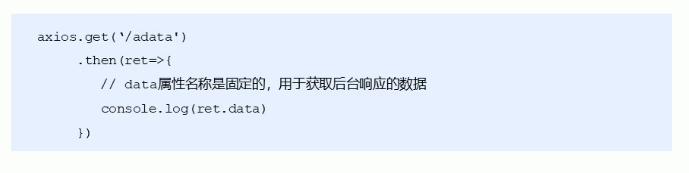
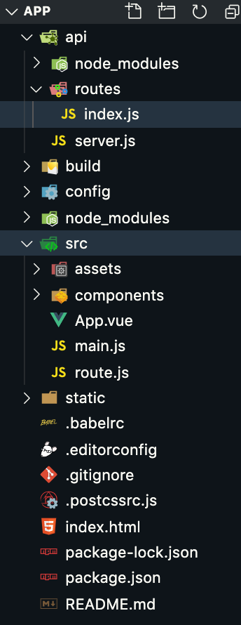
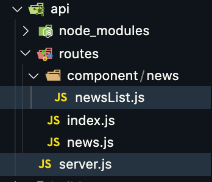

# 一、新闻页面布局

mui中的media-list.html

修改news.vue

```html
 <!-- 资讯 -->
        <ul class="mui-table-view">
				<li class="mui-table-view-cell mui-media">
					<a href="javascript:;">
						
						<div class="mui-media-body">
							幸福
							<p class='mui-ellipsis'>能和心爱的人一起睡觉，是件幸福的事情；可是，打呼噜怎么办？</p>
						</div>
					</a>
				</li>
				<li class="mui-table-view-cell mui-media">
					<a href="javascript:;">
						
						<div class="mui-media-body">
							木屋
							<p class='mui-ellipsis'>想要这样一间小木屋，夏天挫冰吃瓜，冬天围炉取暖.</p>
						</div>
					</a>
				</li>
				<li class="mui-table-view-cell mui-media">
					<a href="javascript:;">
						
						<div class="mui-media-body">
							CBD
							<p class='mui-ellipsis'>烤炉模式的城，到黄昏，如同打翻的调色盘一般.</p>
						</div>
					</a>
				</li>

			</ul>
```

修改布局

```html
<!-- 资讯 -->
    <ul class="mui-table-view">
      <li class="mui-table-view-cell mui-media">
        <a href="javascript:;">
          
          <div class="mui-media-body">幸福
            <p class="mui-ellipsis">能和心爱的人一起睡觉，是件幸福的事情；可是，打呼噜怎么办？</p>
            <p class="pub">
              <span>发表时间：2018-1-1</span>
              <span>点击次数：0次</span>
            </p>
          </div>
        </a>
      </li>
      <li class="mui-table-view-cell mui-media">
        <a href="javascript:;">
          
          <div class="mui-media-body">木屋
            <p class="mui-ellipsis">想要这样一间小木屋，夏天挫冰吃瓜，冬天围炉取暖.</p>
            <p class="pub">
              <span>发表时间：2018-1-1</span>
              <span>点击次数：0次</span>
            </p>
          </div>
        </a>
      </li>
      <li class="mui-table-view-cell mui-media">
        <a href="javascript:;">
          
          <div class="mui-media-body">CBD
            <p class="mui-ellipsis">烤炉模式的城，到黄昏，如同打翻的调色盘一般.</p>
            <p class="pub">
              <span>发表时间：2018-1-1</span>
              <span>点击次数：0次</span>
            </p>
          </div>
        </a>
      </li>
    </ul>
```

css:

```css
<style lang="less">
.mui-table-view {
  .pub {
      display: flex;
        justify-content: space-between;
    span {
      color: blue;
    }
  }
}
</style>
```

# 二、请求后台数据

之前我们使用的是ajax或者jquery的ajax，在vue中也可以使用，但是vue的特点是双向数据绑定，不操作DOM元素，所有我是用axios来发送请求

## 什么是axios？

- 基于promise
- 支持浏览器和node.js
- 能拦截请求和响应
- 自动转换JSON数据

#### axios基础用法



#### 安装

```sh
cnpm install axios
```

#### 配置(Main.js)

```js
import axios from 'axios'
axios.defaults.baseURL='http://127.0.0.1:3000'
Vue.prototype.$http = axios

// 给Vue函数添加一个原型属性$axios指向axios（全局使用axios）
// vue实例中直接用this.$axios就可以执行axios方法
//Vue.prototype.$axios=axios
```

#### axios 全局配置(参考)

```js
#  配置公共的请求头 
axios.defaults.baseURL = 'https://api.example.com';
#  配置 超时时间
axios.defaults.timeout = 2500;
#  配置公共的请求头
axios.defaults.headers.common['Authorization'] = AUTH_TOKEN;
# 配置公共的 post 的 Content-Type
axios.defaults.headers.post['Content-Type'] = 'application/x-www-form-urlencoded';
```

#### 搭建服务器

- 在app项目目录中创建api文件夹，之后创建server.js

```js
cnpm install express
```

```js
 // 引入Express框架
 const express = require('express');
 // 使用框架创建web服务器
 const app = express();
 // 当客户端以get方式访问/路由时
 app.get('/', (req, res) => {
    // 对客户端做出响应 send方法会根据内容的类型自动设置请求头
    res.send('Hello Express'); // <h2>Hello Express</h2> {say: 'hello'}
 });
 // 程序监听3000端口
 app.listen(3000);
```

执行nodemon server.js 访问<http://localhost:3000/>

#### 测试前后台交互

- 在news.vue中，使用axios发送请求
- 由于是在点击新闻页面时就需要发送，所以请求写在created中

news.vue

```vue
<script>
export default {
  data() {
    return {
      msg: "Welcome to Your Vue.js App"
    };
  },
  created(){
    this.getData()
  },
  methods: {
    getData() {
      this.$http.get("/").then(function(ret) {
        console.log(ret);
      });
    }
  }
};
</script>
```

Server.js

- 解决跨域问题

```js
// 引入Express框架
const express = require('express');
// 使用框架创建web服务器
const app = express();

app.use((req, res, next) => {
    console.log(req.url);
    // * 表示允许所有域名访问,可以设置指定的域名
    res.header("Access-Control-Allow-Origin", "*");
    next();
});
// 当客户端以get方式访问/路由时
app.get('/', (req, res) => {
    console.log(1111);
    // 对客户端做出响应 send方法会根据内容的类型自动设置请求头
    res.send('Hello Express');
});
// 程序监听3000端口
app.listen(3000);
```

#### 传参

```js
    # 1. 发送get 请求 
	axios.get('http://localhost:3000/adata').then(function(ret){ 
      #  拿到 ret 是一个对象      所有的对象都存在 ret 的data 属性里面
      // 注意data属性是固定的用法，用于获取后台的实际数据
      // console.log(ret.data)
      console.log(ret)
    })
	# 2.  get 请求传递参数
    # 2.1  通过传统的url  以 ? 的形式传递参数
	axios.get('http://localhost:3000/axios?id=123').then(function(ret){
      console.log(ret.data)
    })
    # 2.2  restful 形式传递参数 
    axios.get('http://localhost:3000/axios/123').then(function(ret){
      console.log(ret.data)
    })
	# 2.3  通过params  形式传递参数 
    axios.get('http://localhost:3000/axios', {
      params: {
        id: 789
      }
    }).then(function(ret){
      console.log(ret.data)
    })
	#3 axios delete 请求传参     传参的形式和 get 请求一样
    axios.delete('http://localhost:3000/axios', {
      params: {
        id: 111
      }
    }).then(function(ret){
      console.log(ret.data)
    })

	# 4  axios 的 post 请求
    # 4.1  通过选项传递参数，默认传递的是json
    axios.post('http://localhost:3000/axios', {
      uname: 'lisi',
      pwd: 123
    }).then(function(ret){
      console.log(ret.data)
    })
	# 4.2  通过 URLSearchParams  传递参数 
    var params = new URLSearchParams();
    params.append('uname', 'zhangsan');
    params.append('pwd', '111');
    axios.post('http://localhost:3000/axios', params).then(function(ret){
      console.log(ret.data)
    })

 	#5  axios put 请求传参   和 post 请求一样 
    axios.put('http://localhost:3000/axios/123', {
      uname: 'lisi',
      pwd: 123
    }).then(function(ret){
      console.log(ret.data)
    })

```

#### 后台接收参数

跟我们之前一样

- req.query 接收？形式传递的参数
- req.params 接收restful
- req.body 接收post

#### axios 拦截器

- 请求拦截器
  - 请求拦截器的作用是在请求发送前进行一些操作
    - 例如在每个请求体里加上token，统一做了处理如果以后要改也非常容易
- 响应拦截器
  - 响应拦截器的作用是在接收到响应后进行一些操作
    - 例如在服务器返回登录状态失效，需要重新登录的时候，跳转到登录页

Main.js

```js
// The Vue build version to load with the `import` command
// (runtime-only or standalone) has been set in webpack.base.conf with an alias.
import Vue from 'vue'
import App from './App'
// import MintUI from 'mint-ui'
import MintUI from 'mint-ui'
import 'mint-ui/lib/style.css'
Vue.use(MintUI)
import '../static/bootstrap/css/bootstrap.css'
import '../static/mui-master/dist/css/mui.min.css'
import '../static/mui-master/examples/hello-mui/css/icons-extra.css'
Vue.config.productionTip = false

import VueRouter from 'vue-router'
Vue.use(VueRouter)
import router from './route'

import axios from 'axios'

axios.defaults.baseURL = 'http://127.0.0.1:3000'
axios.interceptors.request.use(function (config) {
  console.log(config.url)
  console.log('任何请求都会经过这一步   在发送请求之前做些什么');
  // # 1.1  任何请求都会经过这一步   在发送请求之前做些什么
  // config.headers.mytoken = 'nihao';
  // # 1.2  这里一定要return   否则配置不成功
  return config;
}, function (err) {
  //  #1.3 对请求错误做点什么
  console.log(err)
})

axios.interceptors.response.use(function (res) {
  // #2.1  在接收响应做些什么
  var data = res.data;
  console.log('2.1  在接收响应做些什么');
  console.log(data);
  return data;
}, function (err) {
  // #2.2 对响应错误做点什么
  console.log(err)
})
Vue.prototype.$http = axios
/* eslint-disable no-new */
new Vue({
  el: '#app',
  components: { App },
  template: '<App/>',
  router
})


```

#### async  和 await

```js
async getMenuList() {
    let { data: res } = await this.$http.get("menus");
    console.log(res);
    if (res.meta.status != 200) return Toast('请求失败');
    this.menuList = res.data;
},
```

#  三、Mock.js

<http://mockjs.com/>

### 1、什么是Mock.js

是一款模拟数据的生成器，让前端工程师独立开发，不依赖后端

### 2、Mock.js能做什么

- 根据数据模板生成模拟数据
- 模拟ajax请求，生成并返回数据
- 基于html模板生成模拟数据

### 3、为什么用Mockjs

- 开发时，后端还没完成数据输出，前端只能写好静态模拟数据,数据太长了，将数据写在js文件里，完成后挨个改url。
- 某些逻辑复杂的代码，加入或去除模拟数据时容易出错
- 想要尽可能还原真实的数据，要么编写更多的代码，要么手动修改模拟数据
- 特殊的格式，例如ip，随机数，图片，地址，需要去收集，分页显示

### 4、如何正确使用Mockjs

- 项目中安装 npm install mockjs --save-dev
- 使用

```nodejs
var Mock = require('mockjs');
var data = Mock.mock({
    'list|1-10':[{
        'id|+1':1
    }]
});
//JSON.stringify从一个对象解析出字符串，第二个参数是一个过滤函数或者数组，第三个参数是格式化缩进格式按照四个字符缩进
console.log(JSON.stringify(data,null,4))
```

### 5、改造路由

- 在api文件夹中创建routes文件夹，添加路由模块，根据查找规则，找routes文件夹下的index.js



- 修改server.js

```js
// 引入Express框架
const express = require('express');
// 使用框架创建web服务器
const app = express();

// 引入body-parser模块  cnpm install body-parser --save express接收post参数需要此插件
const bodyParser = require('body-parser');
// 创建 application/x-www-form-urlencoded 解析器 返回的对象是一个键值对  
app.use(bodyParser.urlencoded({ extended: false }));
// 添加路由模块，根据查找规则，找routes文件夹下的index.js

app.use((req, res, next) => {
    console.log(req.url);
    // * 表示允许所有域名访问,可以设置指定的域名
    res.header("Access-Control-Allow-Origin", "*");
    next();
});

require('./routes')(app)

// 程序监听3000端口
app.listen(3000);
```



- news.vue中修改请求地址

```js
getData() {
    this.$http.get("/news").then(function(ret) {
        console.log(ret);
    });
}
```

- index.js

```js
// 路由集合
module.exports = app => {
	app.use('/news', require('./news'));
};
```

- news.js

```js
const news = require('express').Router();
// 获取新闻列表
news.get('/',require('./component/news/newsList'))
// 导出路由
module.exports = news;
```

- newsList.js

```js
var Mock = require('mockjs');
module.exports = (req, res) => {
    var data = Mock.mock({
        'news|5-10': [
            {
                'id|+1': 1,
                title: '@ctitle(4,8)',
                text: '@cparagraph',
                time: '@datetime',
                number: '@integer(1, 1000)',
                image: '@image(42x42,@color,@character)'
            }]
    });
    console.log(data);
    res.send(data);
};
```

```json
[
    {
        id: 8,
        title: '习先产展心算她',
        text: '史反观工选都便才同会千龙出验快真位。物五时将算军是长研事支规。我都正回果建题构果基家员没形。积件相么音局五党际听总当几金。此向科回去整育术品公次下中并。',
        time: '1972-08-18 07:46:04',
        number: 129,
        image: 'http://dummyimage.com/42x42/79eef2&text=t'
    }
]
```

- 渲染页面

```vue
<template>
  <div id="news">
    <!-- 资讯 -->
    <ul class="mui-table-view">
      <li class="mui-table-view-cell mui-media" v-for="(item,i) in newsList" :key="item.id">
        <a href="javascript:;">
          
          <div class="mui-media-body">
            {{item.title}}
            <p class="mui-ellipsis">{{item.text}}</p>
            <p class="pub">
              <span>发表时间：{{item.time}}</span>
              <span>点击次数：{{item.number}}次</span>
            </p>
          </div>
        </a>
      </li>
    </ul>
  </div>
</template>

<script>
export default {
  name: "HelloWorld",
  data() {
    return {
      newsList: []
    };
  },
  created() {
    this.getData();
  },
  methods: {
    async getData() {
      let { data } = await this.$http.get("/news");
      this.newsList = data.news;
    }
  }
};
</script>

<!-- Add "scoped" attribute to limit CSS to this component only -->
<style lang="less">
.mui-table-view {
  // 最后一条数据会被底部栏挡住
  padding-bottom: 100px;
  .pub {
    display: flex;
    justify-content: space-between;
    span {
      color: blue;
    }
  }
}
</style>

```

# 四、完善新闻列表

点击后进入详情页

### 1、创建新闻详情组件newsinfo.vue

- 布局

```html
<template>
  <div class="newsinfo">
    <h3 class="title">新闻详情</h3>
    <p class="subtitle">
      <span>发表时间：2018-1-1</span>
      <span>点击9次</span>
    </p>
    <hr>
    <div class="content">text</div>
  </div>
</template>
```

- 样式

```css
<style lang="less" scoped>
.newsinfo {
    padding: 0 5px;
  .title {
      font-size: 18px;
      text-align: center;
      margin: 15px 0;
      color:red;
  }
  .subtitle {
      font-size: 14px;
      color:blue;
      display: flex;
      justify-content: space-between;
  }
  .content {
  }
}
</style>

```

### 2、改造路由连接router-link

```html
<!-- 资讯 -->
<ul class="mui-table-view">
    <li class="mui-table-view-cell mui-media" v-for="(item,i) in newsList" :key="item.id">
        <router-link :to="'/news/newsinfo/'+item.id">
            
            <div class="mui-media-body">
                {{item.title}}
                <p class="mui-ellipsis">{{item.text}}</p>
                <p class="pub">
                    <span>发表时间：{{item.time}}</span>
                    <span>点击次数：{{item.number}}次</span>
                </p>
            </div>
        </router-link>
    </li>
</ul>
```

### 3、添加路由

```js
import VueRouter from 'vue-router'
import home from './components/home.vue'
import news from './components/news.vue'
import cart from './components/cart.vue'
import mycenter from './components/mycenter.vue'
import newsinfo from './components/news/newsinfo.vue'
// 2. 定义路由
var routes = [
    { path: '/', redirect:'/home' },
    { path: '/home', component: home },
    { path: '/news', component: news },
    { path: '/cart', component: cart },
    { path: '/mycenter', component: mycenter },
    { path: '/news/newsinfo/:id', component: newsinfo },
]

// 3. 创建 router 实例，然后传 `routes` 配置
// 你还可以传别的配置参数, 不过先这么简单着吧。
var router = new VueRouter({
    routes, // (缩写) 相当于 routes: routes
    linkActiveClass:'mui-active'
})

export default router
```

进入页面就需要数据，根据id获取

### 4、请求数据

```js
<script>
export default {
  data() {
    return {
      id: this.$route.params.id,
      newsinfo: {}
    };
  },
  methods: {
   async getNewsInfo() {
        let {data}= await this.$http.get('/news/newsinfo')
        this.newsinfo = data.newsinfo
    }
  },
  created() {
    this.getNewsInfo();
  }
};
</script>
```

### 5、后台数据

```js
const news = require('express').Router();
// 获取新闻列表
news.get('/',require('./component/news/newsList'))
// 获取新闻详细信息
news.get('/newsinfo',require('./component/news/newsinfo'))
// 导出路由
module.exports = news;
```

```js
var Mock = require('mockjs');
module.exports = (req, res) => {
    var data = Mock.mock({
        'newsinfo|1': [
            {
                title: '@ctitle',
                text: '@cparagraph(2,8),@cparagraph(2,8)\t\r\n,@cparagraph(3,8)\t\r\n,@cparagraph(5,8)',
                time: '@datetime',
                number: '@integer(1, 1000)',
                image: '@image(842x242,@color,@character)'
            }]
    });
    res.send(data);
};
```

### 6、渲染页面

```html
<template>
  <div class="newsinfo">
    <mt-header fixed title="新闻资讯">
      <router-link to="/news" slot="left">
        <mt-button icon="back">返回</mt-button>
      </router-link>
      <mt-button icon="more" slot="right"></mt-button>
    </mt-header>
    <h3 class="title">{{newsinfo.title}}</h3>
    <p class="subtitle">
      <span>发表时间：{{newsinfo.time}}</span>
      <span>点击{{newsinfo.number}}次</span>
    </p>
    <hr />
    <div class="content">
      <p>{{newsinfo.text}}</p>
      
      <p>{{newsinfo.text}}</p>
    </div>
  </div>
</template>
```

请求的图片过大，需修改样式

```css
<style lang="less" scoped>
.newsinfo {
    padding: 0 5px;
  .title {
      font-size: 18px;
      text-align: center;
      margin: 15px 0;
      color:red;
  }
  .subtitle {
      font-size: 14px;
      color:blue;
      display: flex;
      justify-content: space-between;
  }
  .content {
      img {
          width: 100%;
      }
  }
}
</style>
//如果没有生效，把scoped去掉
```

# 五、评论区

评论区是在新闻详情页面中，可以使用子组件的方式

### 1、创建子组件

在components下的news文件夹创建子组件comment.vue

```vue
<template>
  <div>
    <h4>发表评论</h4>
    <hr />
    <textarea placeholder="请输入要BB的内容（最多120字）" maxlength="120"></textarea>
    <mt-button type="primary" size="large">发表评论</mt-button>

    <div class="box">
      <div class="head">第一楼&nbsp;&nbsp;用户:匿名用户&nbsp;&nbsp;发表时间:2012-1-1 12:12:12</div>
      <div class="cont">啦啦啦</div>
      <div class="head">第一楼&nbsp;&nbsp;用户:匿名用户&nbsp;&nbsp;发表时间:2012-1-1 12:12:12</div>
      <div class="cont">啦啦啦</div>
    </div>

    <mt-button class="more" plain size="large" type="danger">加载更多</mt-button>
  </div>
</template>

<script>
export default {
  data() {
    return {};
  }
};
</script>
<style lang="less" scoped>
.more{
  margin: 10px 0 80px 0;
}
.box {
  .head {
    height: 30px;
    font-size: 14px;
    line-height: 30px;
    background-color: lightblue;
  }
  .cont {
    height: 40px;
    line-height: 40px;
  }
}
</style>
```

### 2、在需要使用子组件的页面中，手动导入子组件

```js
import comment from './comment'
```

### 3、在父组件中，使用components属性，将刚才的子组件注册为自己的子组件

```js
<script>
import comment from "./comment";
export default {
  data() {
    return {
      id: this.$route.params.id,
      newsinfo: {}
    };
  },
  methods: {
    async getNewsInfo() {
      let { data } = await this.$http.get("/news/newsinfo");
      this.newsinfo = data.newsinfo;
    }
  },
  created() {
    this.getNewsInfo();
  },
  components: {
    comment
  }
};
</script>
```

### 4、将注册的子组件名称，以标签形式在页面中引用

```html
<!-- comment -->
<comment/>
```

### 5、加载评论

- 获取所有的评论数据，显示到页面中
- 父组件向子组件传值（id）
- 后台模拟数据

newsinfo.vue

```vue
<!-- comment -->
<comment :id="id"/>
```

comment.vue

```js
<script>
import { Toast } from "mint-ui";
export default {
  data() {
    return {
      pageIndex: 1, //默认第一页数据
      commentsList:[]
    };
  },
  methods: {
    async getComments() {
      // 获取父组件传过来的id
      // console.log(this.id);
      // 获取评论数据，根据id，页数
      let { data } = await this.$http.get(
        "/news/comments/" + this.id + "/?pageIndex=" + this.pageIndex
      );
      if(data.state!=200) return Toast("请求失败");
      // console.log(data.data.comments);
      this.commentsList = data.data.comments
    }
  },
  props: ["id"],
  created() {
    this.getComments();
  }
};
</script>
```

news.js

```js
const news = require('express').Router();
// 获取新闻列表
news.get('/',require('./component/news/newsList'))
// 获取新闻详细信息
news.get('/newsinfo',require('./component/news/newsinfo'))
// 获取评论
news.get('/comments/:id',require('./component/news/comments'))
// 导出路由
module.exports = news;
```

comments.js

```js
var Mock = require('mockjs');
module.exports = (req, res) => {
    // 获取restful参数
    // console.log(req.params.id);
    // 获取传统方式地址栏传参
    // console.log(req.query.pageIndex);
    // 模拟评论数据
    var data = Mock.mock({
        'comments|3-15': [
            {
                'number|+1': 1,
                name: '@cname',
                time: '@datetime',
                text: '@word'
            }]
    });
    // res.send({state:210,data});
    res.send({state:200,data});
};
```

渲染：

```html
<template>
  <div>
    <h4>发表评论{{id}}</h4>
    <hr />
    <textarea placeholder="请输入要BB的内容（最多120字）" maxlength="120"></textarea>
    <mt-button type="primary" size="large">发表评论</mt-button>

    <div class="box" v-for="(item ,i) in commentsList">
      <div class="head">第{{i+1}}楼&nbsp;&nbsp;用户:{{item.name}}&nbsp;&nbsp;发表时间:{{item.time}}</div>
      <div class="cont">{{item.text === 'undefined'?'此用户很懒，什么也没留下':item.text}}</div>
    </div>

    <mt-button class="more" plain size="large" type="danger">加载更多</mt-button>
  </div>
</template>
```

### 6、加载更多

- 为加载更多按钮绑定事件，请求数据

```js
 <mt-button @click="more" class="more" plain size="large" type="danger">加载更多</mt-button>

```

- 每当获取新数据的时候，不要把老数据清空，以老数据拼接上新数据，得到最新的数组

```js
async more() {
    // 点击一次获取下一页数据
    this.count++;
    let { data } = await this.$http.get(
        "/news/comments/" + this.id + "/?pageIndex=" + this.count
    );
    this.commentsList = this.commentsList.concat(data.data.comments);
}

```

### 7、发表评论

- 绑定事件，点击后，通过数据绑定，获取输入的内容，并添加到数组中第一位

```html
<mt-button type="primary" @click="add" size="large">发表评论</mt-button>
<textarea v-model="content" placeholder="请输入要BB的内容（最多120字）" maxlength="120"></textarea>

```

```js
async add(){
    // 获取文本域中的内容
    // console.log(this.content);
    if(this.content=='') return Toast('评论不能为空')
    // 发送数据，并且返回该对象,模拟只返回一条数据
    let { data } = await this.$http.get("/news/comments/" + this.id);
    // console.log(data.data.comments[0]);
    let obj = data.data.comments[0]
    obj.text = this.content
    this.commentsList.unshift(obj)
    this.content = ''
}
```

 


# Fetch

```html
<!DOCTYPE html>
<html>
  <head>
    <meta charset="utf-8">
    <title>Simple example</title>
  </head>
  <body>
  	<ul id="repo"></ul>
      <script>
		fetch('https://api.github.com/users/Fire-zy/repos')
		.then(function(response){
			return response.json();
		})
		.then(function(myJson){
			let content='';
			for(let repo of myJson){
				content+=`<li>
					<span>
						${repo.name}
					</span>
				</li>`
			}
			document.querySelector('#repo').innerHTML=content;
			console.log(myJson);
		});
    </script>
  </body>
</html>
```

改造

```js
    async function getData() {
        let data = await fetch('https://api.github.com/users/Fire-zy/repos')
        //请求的返回值的转化成json的格式 还是一个promise 接着用await
        let result = await data.json()
        console.log(result);
        res = JSON.stringify(result)
        document.querySelector('#repo').innerHTML = res;
    }
    getData()
```

```js
const express = require('express')
const app = express()
app.get('/',(req,res)=>{
    res.header("Access-Control-Allow-Origin","*")
    res.send({name:"tom",age:18})
})
app.listen(3000)
```

axios浏览器端

```html
<!DOCTYPE html>
<html>

<head>
    <meta charset="utf-8">
    <title>Simple example</title>
    <script src="https://cdn.jsdelivr.net/npm/vue/dist/vue.js"></script>
    <script src="https://unpkg.com/axios/dist/axios.min.js"></script>
</head>

<body>
    <div id="app">{{msg}}
        <button @click="show">go</button>
    </div>
    <script>
        new Vue({
            el:"#app",
            data:{
                msg:"hello"
            },
            methods: {
                async show(){
                    let {data:res} = await axios.get('http://localhost:3000/abc')
                    console.log(res);
                }
            },
        })
    </script>
</body>

</html>
```

```html
<!DOCTYPE html>
<html>

<head>
    <meta charset="utf-8">
    <title>Simple example</title>
    <script src="https://cdn.jsdelivr.net/npm/vue/dist/vue.js"></script>
    <script src="https://unpkg.com/axios/dist/axios.min.js"></script>
</head>

<body>
    <div id="app">{{msg}}
        <button @click="show">go</button>
    </div>
    <script>
        axios.defaults.baseURL = 'http://localhost:3000';
        new Vue({
            el:"#app",
            data:{
                msg:"hello"
            },
            methods: {
                async show(){
                    let {data:res} = await axios.get('/abc?name=tom')
                    console.log(res);
                }
            },
        })
    </script>
</body>

</html>
```

