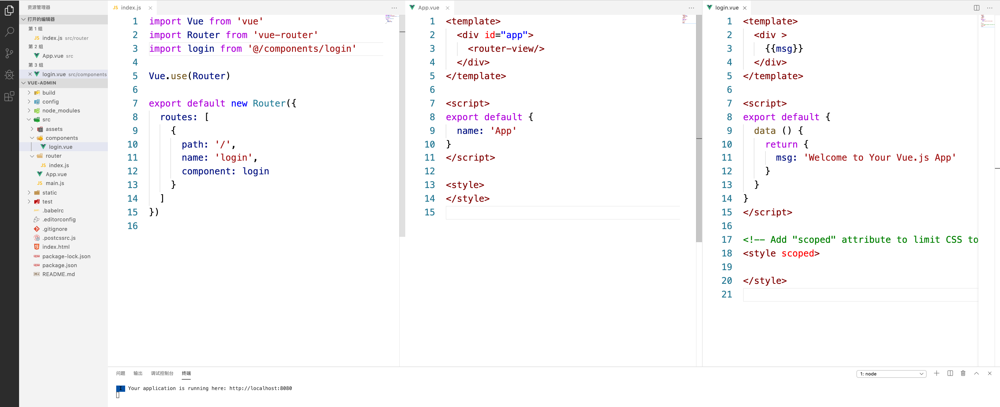
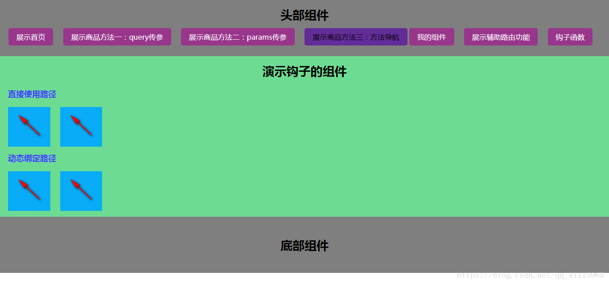
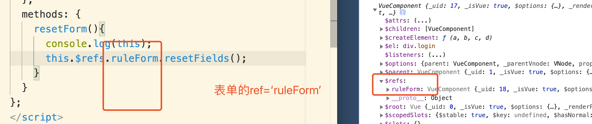
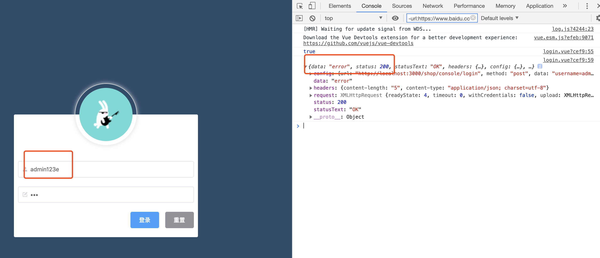

## 一、vue-cli脚手架

帮我们编写好基础代码的工具，搞定目录结构，热加载，本地调试，代码部署

安装

- npm install -g vue-cli(全局安装，安装一次后，无需再次安装)
- 新建项目文件目录，在根目录下执行vue init webpack
  - Generate project in current directory? Yes
  - 项目名？cli-demo
  - 项目描述
  - 作者
  - 安装路由，先不安装
  - eslint检查是否符合规范 n
  - 之后选n，最后选npm安装
- static存放第三方静态资源
- npm run dev运行模板，之后清理模板


### Vue脚手架

Vue脚手架可以快速生成Vue项目基础的架构。
A.安装3.x版本的Vue脚手架：
    npm install -g @vue/cli
B.基于3.x版本的脚手架创建Vue项目：
    1).使用命令创建Vue项目
        命令：vue create my-project
        选择Manually select features(选择特性以创建项目)
        勾选特性可以用空格进行勾选。
        是否选用历史模式的路由：n
        ESLint选择：ESLint + Standard config
        何时进行ESLint语法校验：Lint on save
        babel，postcss等配置文件如何放置：In dedicated config files(单独使用文件进行配置)
        是否保存为模板：n
        使用哪个工具安装包：npm
    2).基于ui界面创建Vue项目
        命令：vue ui
        在自动打开的创建项目网页中配置项目信息。
    3).基于2.x的旧模板，创建Vue项目
        npm install -g @vue/cli-init
        vue init webpack my-project

C.分析Vue脚手架生成的项目结构
    node_modules:依赖包目录
    public：静态资源目录
    src：源码目录
    src/assets:资源目录
    src/components：组件目录
    src/views:视图组件目录
    src/App.vue:根组件
    src/main.js:入口js
    src/router.js:路由js
    babel.config.js:babel配置文件
    .eslintrc.js:


### 16.Vue脚手架的自定义配置

```
A.通过 package.json 进行配置 [不推荐使用]
    "vue":{
        "devServer":{
            "port":"9990",
            "open":true
        }
    }
B.通过单独的配置文件进行配置，创建vue.config.js
    module.exports = {
        devServer:{
            port:8888,
            open:true
        }
    }
```


### 17.Element-UI的基本使用

Element-UI:一套基于2.0的桌面端组件库
官网地址：http://element-cn.eleme.io/#/zh-CN
A.安装：
    npm install element-ui -S
B.导入使用：
    import ElementUI from "element-ui";
    import "element-ui/lib/theme-chalk/index.css";

```
Vue.use(ElementUI)
```

# 项目

## 项目初始化

- 前台
  - vue-shop
- 后台
  - vue-shop-admin
- 服务器
  - vue-shop-server



- router/index.js

```js
import Vue from 'vue'
import Router from 'vue-router'
// import login from '@/components/login'
// import login from '../components/login'
// 写法都一样
import login from '../components/login.vue'

Vue.use(Router)

export default new Router({
  routes: [
    {
      path: '/',
      redirect:'/login'
    },
    {
      path:'/login',
      component:login
    }
  ]
})

```

- Main.js

```js
// The Vue build version to load with the `import` command
// (runtime-only or standalone) has been set in webpack.base.conf with an alias.
import Vue from 'vue'
import App from './App'
import router from './router/router'

Vue.config.productionTip = false

/* eslint-disable no-new */
new Vue({
  el: '#app',
  router,
  components: { App },
  template: '<App/>'
})

```

- login.vue

```vue
<template>
  <div >
    {{msg}}
  </div>
</template>

<script>
export default {
  data () {
    return {
      msg: 'Welcome to Your Vue.js App'
    }
  }
}
</script>

<!-- Add "scoped" attribute to limit CSS to this component only -->
<style scoped>

</style>

```


- app.vue

```vue
<template>
  <div id="app">
    <router-view/>
  </div>
</template>

<script>
export default {
}
</script>

<style>

</style>

```

### 区别

```sh
我们在使用 npm install 安装模块的模块的时候 ，一般会使用下面这几种命令形式：


npm install moduleName # 安装模块到项目目录下
 
npm install -g moduleName # -g 的意思是将模块安装到全局，具体安装到磁盘哪个位置，要看 npm config prefix 的位置。
 
npm install -save moduleName # -save 的意思是将模块安装到项目目录下，并在package文件的dependencies节点写入依赖。
 
npm install -save-dev moduleName # -save-dev 的意思是将模块安装到项目目录下，并在package文件的devDependencies节点写入依赖。
那么问题来了，在项目中我们应该使用四个命令中的哪个呢？这个就要视情况而定了。下面对这四个命令进行对比，看完后你就不再这么问了。

npm install moduleName 命令
1. 安装模块到项目node_modules目录下。
2. 不会将模块依赖写入devDependencies或dependencies 节点。
3. 运行 npm install 初始化项目时不会下载模块。

npm install -g moduleName 命令
1. 安装模块到全局，不会在项目node_modules目录中保存模块包。
2. 不会将模块依赖写入devDependencies或dependencies 节点。
3. 运行 npm install 初始化项目时不会下载模块。

npm install -save moduleName 命令
1. 安装模块到项目node_modules目录下。
2. 会将模块依赖写入dependencies 节点。
3. 运行 npm install 初始化项目时，会将模块下载到项目目录下。
4. 运行npm install --production或者注明NODE_ENV变量值为production时，会自动下载模块到node_modules目录中。

npm install -save-dev moduleName 命令
1. 安装模块到项目node_modules目录下。
2. 会将模块依赖写入devDependencies 节点。
3. 运行 npm install 初始化项目时，会将模块下载到项目目录下。
4. 运行npm install --production或者注明NODE_ENV变量值为production时，不会自动下载模块到node_modules目录中。

总结
devDependencies 节点下的模块是我们在开发时需要用的，比如项目中使用的 gulp ，压缩css、js的模块。这些模块在我们的项目部署后是不需要的，所以我们可以使用 -save-dev 的形式安装。像 express 这些模块是项目运行必备的，应该安装在 dependencies 节点下，所以我们应该使用 -save 的形式安装。
```


### 安装less

```sh
cnpm i less less-loader --save-dev
```

### 全局样式

```css
/* 全局样式 在main.js中引入*/
import "./assets/base.css"
```

```js
// 引入全局样式

html,body,#app{
    margin: 0;
    width: 100%;
    height: 100%;
    padding: 0;
}
```

### assets与static的区别

相同点：资源在html中使用，都是可以的。

不同点：使用assets下面的资源，在js中使用的话，路径要经过webpack中file-loader编译，路径不能直接写。

assets中的文件会经过webpack打包，重新编译，推荐该方式。而static中的文件，不会经过编译。项目在经过打包后，会生成dist文件夹，static中的文件只是复制一遍而已。简单来说，static中建议放一些外部第三方，自己的放到assets，别人的放到static中。

注意：如果把图片放在assets与static中，html页面可以使用；但在动态绑定中，assets路径的图片会加载失败，因为webpack使用的是commenJS规范，必须使用require才可以，具体代码如下：

html

```html
<div id="hook">
    <h3>演示钩子的组件</h3>
    <p>直接使用路径</p>
    
    
    <br>
    <p>动态绑定路径</p>
    
    
  </div>

```

```js
data (){
      return {
        assetsURL: require('../../assets/11.png'),
        staticURL: '../../../static/11.png'
      }
    }
```



## 安装element

```sh
cnpm i element-ui -S
```

### 使用

```js
//main.js
import 'element-ui/lib/theme-chalk/index.css';
import elm from 'element-ui';
Vue.use(elm)
```


### 按需引入

借助 [babel-plugin-component](https://github.com/QingWei-Li/babel-plugin-component)，我们可以只引入需要的组件，以达到减小项目体积的目的。

首先，安装 babel-plugin-component：

```sh
cnpm install babel-plugin-component -D
```

然后，将 .babelrc 修改为：

```js
{
  "presets": [
    ["env", {
      "modules": false,
      "targets": {
        "browsers": ["> 1%", "last 2 versions", "not ie <= 8"]
      }
    }],
    "stage-2"
  ],
  "plugins": [
    "transform-vue-jsx",
    "transform-runtime",
    [
      "component",
      {
        "libraryName": "element-ui",
        "styleLibraryName": "theme-chalk"
      }
    ]
  ]
}

```

需要在 main.js 中写入以下内容

```js
import 'element-ui/lib/theme-chalk/index.css';
import { Button, Select,Form,Input } from 'element-ui';
Vue.use(Button);
Vue.use(Select);
Vue.use(Form);
Vue.use(Input);
```

### 登陆页面

```vue
<template>
  <div class="login">
    <div class="login-form">
      <div class="avatar">
        
      </div>
      <!-- 登陆表单 -->
      <el-form class="ruleForm">
        <el-form-item prop="name">
          <el-input  prefix-icon="el-icon-user-solid"></el-input>
        </el-form-item>
        <el-form-item prop="name">
          <el-input prefix-icon="el-icon-edit-outline"></el-input>
        </el-form-item>

        <el-form-item class="btns">
          <el-button type="primary">登录</el-button>
          <el-button type="info">重置</el-button>
        </el-form-item>
      </el-form>
      <!-- 按钮 -->
    </div>
  </div>
</template>

<script>
export default {};
</script>

<!-- Add "scoped" attribute to limit CSS to this component only -->
<style lang="less" scoped>
.login {
  width: 100%;
  height: 100%;
  background-color: #2b4b6b;
  .login-form {
    width: 28.125rem;
    height: 18.75rem;
    background-color: white;
    border-radius: 3px;
    position: absolute;
    left: 50%;
    top: 50%;
    transform: translate(-50%, -50%);
    .avatar {
      width: 130px;
      height: 130px;
      border: 1px #eee solid;
      border-radius: 50%;
      padding: 10px;
      box-shadow: 0 0 10px #ddd;
      position: absolute;
      left: 50%;
      transform: translate(-50%, -50%);
      // background-color: white;
      img {
        width: 100%;
        height: 100%;
        border-radius: 50%;
      }
    }
    .ruleForm {
      position: absolute;
      width: 100%;
      bottom: 0;
      padding: 0 10px;
      box-sizing: border-box;
    }
    .btns{
      display: flex;
      justify-content: flex-end;
    }
  }
}
</style>

```

## 表单

```html
<template>
  <div class="login">
    <div class="login-form">
      <div class="avatar">
        
      </div>
      <!-- 登陆表单 -->
      <el-form :model="ruleForm" :rules="rules" ref="ruleForm" class="ruleForm">
        <el-form-item prop="username">
          <el-input v-model="ruleForm.username" prefix-icon="el-icon-user-solid"></el-input>
        </el-form-item>
        <el-form-item prop="password">
          <el-input type="password" v-model="ruleForm.password" prefix-icon="el-icon-edit-outline"></el-input>
        </el-form-item>

        <el-form-item class="btns">
          <el-button type="primary" @click="login">登录</el-button>
          <el-button type="info" @click="resetForm('ruleForm')">重置</el-button>
        </el-form-item>
      </el-form>
      <!-- 按钮 -->
    </div>
  </div>
</template>

<script>
import { async } from 'q';
export default {
  data() {
    return {
      ruleForm: {
        username: "admin",
        password: "123"
      },
      rules: {
        username: [
          { required: true, message: "请输入姓名", trigger: "blur" },
          { min: 2, max: 15, message: "长度在 2 到 15 个字符", trigger: "blur" }
        ],
        password: [
          { required: true, message: "请输入密码", trigger: "blur" },
          { min: 3, max: 12, message: "长度在 3 到 12 个字符", trigger: "blur" }
        ]
      }
    };
  },
  methods: {
    resetForm() {
      console.log(this);
      this.$refs.ruleForm.resetFields();
    },
    // 表单登陆验证
    login() {
      this.$refs.ruleForm.validate(async valid => {
        console.log(valid); //返回true  false
        if (!valid) return;
        // this.$http.get('/login?name='+this.ruleForm.username)
        //解构赋值，我只要data的数据 重新赋值到res里
        const {data:res}=await this.$http.post("login", this.$qs.stringify(this.ruleForm));
        console.log(res);//{msg: "登陆失败", status: 400}
        if(res.status!=200){
          alert("登陆失败")
        }else{
          console.log("登陆成功");
          
        }
        
      });
    }
  }
};
</script>

<!-- Add "scoped" attribute to limit CSS to this component only -->
<style lang="less" scoped>
.login {
  width: 100%;
  height: 100%;
  background-color: #2b4b6b;
  .login-form {
    width: 28.125rem;
    height: 18.75rem;
    background-color: white;
    border-radius: 3px;
    position: absolute;
    left: 50%;
    top: 50%;
    transform: translate(-50%, -50%);
    .avatar {
      width: 130px;
      height: 130px;
      border: 1px #eee solid;
      border-radius: 50%;
      padding: 10px;
      box-shadow: 0 0 10px #ddd;
      position: absolute;
      left: 50%;
      transform: translate(-50%, -50%);
      // background-color: white;
      img {
        width: 100%;
        height: 100%;
        border-radius: 50%;
      }
    }
    .ruleForm {
      position: absolute;
      width: 100%;
      bottom: 0;
      padding: 0 10px;
      box-sizing: border-box;
    }
    .btns {
      display: flex;
      justify-content: flex-end;
    }
  }
}
</style>


```


### 表单重置



### 表单登陆验证

- 安装axios

```sh
cnpm install axios

```

Main.js

```js
import axios from 'axios'
axios.defaults.baseURL='http://127.0.0.1:8888/api/private/v1/'
Vue.prototype.$http = axios
```




```js
// 表单登陆验证
    login() {
      this.$refs.ruleForm.validate(async valid => {
        console.log(valid); //返回true  false
        if (!valid) return;
        //解构赋值，我只要data的数据 重新赋值到res里
        const data=await this.$http.post("login", this.ruleForm);
        console.log(data);//返回的数据在data是里，其他是axios给我返回的，不需要，所以用结构赋值
          
        
      });
```

```js
 // 表单登陆验证
    login() {
      this.$refs.ruleForm.validate(async valid => {
        console.log(valid); //返回true  false
        if (!valid) return;
        //解构赋值，我只要data的数据 重新赋值到res里
        // const data=await this.$http.post("login", this.ruleForm);
        // console.log(data);//{msg: "登陆失败", status: 400}
        const {data:res}=await this.$http.post("login", this.ruleForm);
        console.log(res);
        if(res.status!=200){
          alert("登陆失败")
        }else{
          console.log("登陆成功");
        }
      });
    }
```


# 消息提示

main.js

```js

import { Message } from 'element-ui';
Vue.prototype.$message = Message
```

```js
 // 表单登陆验证
    login() {
      this.$refs.ruleForm.validate(async valid => {
        console.log(valid); //返回true  false
        if (!valid) return;
        // this.$http.get('/login?name='+this.ruleForm.username)
        //解构赋值，我只要data的数据 重新赋值到res里
        const {data:res}=await this.$http.post("login", this.$qs.stringify(this.ruleForm));
        console.log(res);//{msg: "登陆失败", status: 400}
        if(res.status!=200){
          this.$message.error("登陆失败")
        }else{
          //跳转到主页
          // this.$message.success("登陆成功")
        }
        
      });

```

# 保存数据

```js
sessionStorage 用于临时保存同一窗口(或标签页)的数据，在关闭窗口或标签页之后将会删除这些数据。
// 保存数据到sessionStorage
sessionStorage.setItem('key', 'value');
 
// 从sessionStorage获取数据
var data = sessionStorage.getItem('key');
 
// 从sessionStorage删除保存的数据
sessionStorage.removeItem('key');
 
// 从sessionStorage删除所有保存的数据
sessionStorage.clear();

```

```js
// 表单登陆验证
    login() {
      this.$refs.ruleForm.validate(async valid => {
        console.log(valid); //返回true  false
        if (!valid) return;
        // this.$http.get('/login?name='+this.ruleForm.username)
        //解构赋值，我只要data的数据 重新赋值到res里
        const {data:res}=await this.$http.post("login", this.$qs.stringify(this.ruleForm));
        console.log(res);//{msg: "登陆失败", status: 400}
        if(res.status!=200){
          this.$message.error("登陆失败")
        }else{
          //跳转到主页
          // this.$message.success("登陆成功")
          //登陆成功后 将用户名密码保存到sessionStorage中
          //通过编程时导航跳转到后台主页，路由地址是/home
          sessionStorage.setItem("token", res.data.token);
          this.$router.push('/home')
        }
        
      });

```

## 主页

创建home组件

```js
import Vue from 'vue'
import Router from 'vue-router'
// import login from '@/components/login'
// import login from '../components/login'
// 写法都一样
import login from '../components/login.vue'
import home from '../components/home.vue'

Vue.use(Router)

export default new Router({
  routes: [
    {
      path: '/',
      redirect:'/login'
    },
    {
      path:'/login',
      component:login
    },
    {
      path:'/home',
      component:home
    }
  ]
})


```

```html
<!--  -->
<template>
  <div>
      home
  </div>
</template>

<script>
export default {
  data () {
    return {
    };
  }
}

</script>
<style lang='less' scoped>
</style>
```


# 路由守卫

如果有token，可以看见home，如果删除后，依然能看见，非法登陆

to:将要访问的路径

from：从哪个页面路径调换过来

next：放行

```js
import Vue from 'vue'
import Router from 'vue-router'
// import login from '@/components/login'
// import login from '../components/login'
// 写法都一样
import login from '../components/login.vue'
import home from '../components/home.vue'

Vue.use(Router)

const router =  new Router({
  routes: [
    {
      path: '/',
      redirect:'/login'
    },
    {
      path:'/login',
      component:login
    },
    {
      path:'/home',
      component:home
    }
  ]
})
// 挂载路由守卫
router.beforeEach((to,form,next)=>{
  // next()放行  next（‘/login’）强制跳转
  if(to.path==="/login") return next();
  let username = sessionStorage.getItem("token")
  console.log(username);//null
  if(username==null){
      return next('/login')
  }else{
    next()
  }

})
export default router


```

# 退出

清除sessionStorage即可

```vue
<template>
    <div class="home">
        <el-button type="primary" @click="loginout">退出</el-button>
    </div>
</template>

<script>
export default{
  methods:{
    loginout(){
      sessionStorage.clear();
      this.$router.push('/login')
    }
  }
}
</script>

<!-- Add "scoped" attribute to limit CSS to this component only -->
<style lang="less" scoped>

</style>


```


