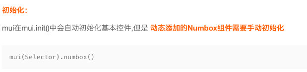

# 一、vuex

> Vuex是Vue.js应用程序的**状态管理模式**。它采用集中式存储管理应用的所用组件的状态，并以相应的规则确保状态以可预测的方式进行变更。它还与Vue的官方[devtools扩展](https://github.com/vuejs/vue-devtools)集成，提供零配置time-travel调试和状态快照导出/导入等高级调试功能。


他是为组件之间共享数据诞生的

data：存储私有数据

props：存储父组件传递过来的数据

vuex:组件之间共享的数据，相当于数据的仓库

安装：

```js
cnpm i vuex -S
```

在main.js导入：

```js
import Vuex from 'vuex'
Vue.use(Vuex)
```

基本语法：创建仓库

```js
const store = new Vuex.Store({
  state: {//相当于data
    count: 0
  },
  mutations: {//相当于methods
    increment (state) {
      state.count++
    }
  }
})
```

### 1、在首页中开一个vuex的页面

```html
<router-link to="/home/vuex">
            
            <div class="mui-media-body">vuex</div>
</router-link>
```

### 2、改造路由

```js
import vuex from './components/home/vuex.vue'
var routes = [
    { path: '/home/vuex', component: vuex },
]
```

### 3、创建两个子组件

- count
- amount

- 导入子组件

  ```js
  <!--  -->
  <template>
    <div>
      <count />
      <amount />
    </div>
  </template>
  
  <script>
  import count from "./count";
  import amount from "./amount";
  export default {
    data() {
      return {};
    },
    components: {
      count,
      amount
    }
  };
  </script>
  <style lang='' scoped>
  </style>
  ```

### 4、创建仓库

main.js

```js
var store = new Vuex.Store({
  state:{
    count:0
  },
  mutations:{}
})
/* eslint-disable no-new */
new Vue({
  el: '#app',
  components: { App },
  template: '<App/>',
  router,//挂在路由
  store//挂在vuex
})

```

### 5、count页面

```html
<!--  -->
<template>
  <div>
    <h1>count</h1>
    <button>增加</button>
    <button>减少</button>
    <input type="text" name id v-model="count" />
  </div>
</template>

<script>
export default {
  data() {
    return {
        count:1000
    };
  },
};
</script>
<style lang='' scoped>
</style>
```

这个count是想从vuex的仓库中取，运行发现报错

- 如果在组件中，想要访问store中的数据，只能通过**this.$store.state.名称**。

```html
<input type="text" name="" id="" v-model="this.$store.state.count">
//this可以省略
```

- 如果要操作store中的state的值，只能通过调用mutations的方法才能操作对应的数据。
- 子组件想要调用mutations中的方法，只能使用this.$store.commit('方法名')

```vue
<!--  -->
<template>
  <div>
    <h1>count</h1>
    <button @click="add">增加</button>
    <button @click="sub">减少</button>
    <input type="text" name id v-model="this.$store.state.count" />
  </div>
</template>

<script>
export default {
  data() {
    return {
      count: 1000
    };
  },
  methods: {
    add() {
      this.$store.commit("add");
    },
    sub() {
      this.$store.commit("sub");
    }
  }
};
</script>
<style lang='' scoped>
</style>
```

```js
var store = new Vuex.Store({
  state: {
    count: 0
  },
  mutations: {
    add(val){
      this.state.count++
      // 参数的val就是state
      // console.log(val);
    },
    sub(){
      this.state.count--
      // console.log(this.state.count);
    }
  }
})
```

- 调用方法的时候也可以传参

```js
this.$store.commit('sub')
可以传参数
this.$store.commit('sub'，3)
每次减3
this.$store.commit('sub'，{c:3,d:1})
sub(state,obj){
    state.count-=(obj.c+obj.d);
}
每次减(3+1)
mutations最多支持两个参数，第一个为state，第二个是传递的参数，想传多个参数，可以用对象
```

```js
var store = new Vuex.Store({
  state: {
    count: 0
  },
  mutations: {
    add(val){
      this.state.count++
      // 参数的val就是state
      // console.log(val);
    },
    sub(state,obj){
      this.state.count--
      // console.log(this.state.count);
      console.log(obj);
      
    }
  }
})
```

### 6、getters包装数据

只负责获取数据，不能修改

```js
var store = new Vuex.Store({
  state: {
    count: 0
  },
  mutations: {
    add(val) {
      this.state.count++
      // 参数的val就是state
      // console.log(val);
    },
    sub(state, obj) {
      this.state.count--
      // console.log(this.state.count);
      // console.log(obj);
    }
  },
  getters: {
    txt: (state) => {
      return `当前最新的count的值=${state.count}`
    }
  }
})
```

```html
<!--  -->
<template>
  <div>
    <h1>amount</h1>
    {{$store.state.count}}
    {{$store.getters.txt}}
  </div>
</template>

<script>
export default {
  data() {
    return {};
  }
};
</script>
<style lang='' scoped>
</style>
```

```vue
{{$store.getters.txt+1}}
{{$store.state.count+1}}
```


# 二、商品页面

### 1、修改路由

home.vue

```html
<router-link to="/home/product">
    
    <div class="mui-media-body">商品购买</div>
</router-link>
```

router.js

```js
import product from './components/home/product.vue'
{ path: '/home/product', component: product },
```

### 2、product.vue布局

```html
<template>
  <div>
    <mt-header fixed title="商品列表">
      <router-link to="/" slot="left">
        <mt-button icon="back">返回</mt-button>
      </router-link>
      <mt-button icon="more" slot="right"></mt-button>
    </mt-header>
    <div class="list">
      <div class="item">
        
        <h2>小米 Nova</h2>
        <div class="info">
          <p class="price">
            <span class="now">￥2399</span>
            <span class="old">￥3000</span>
          </p>
          <p class="sell">
            <span>热卖中</span>
            <span>剩60件</span>
          </p>
        </div>
      </div>
      <div class="item">
        
        <h2>红米</h2>
        <div class="info">
          <p class="price">
            <span class="now">￥2399</span>
            <span class="old">￥3000</span>
          </p>
          <p class="sell">
            <span>热卖中</span>
            <span>剩60件</span>
          </p>
        </div>
      </div>
      <div class="item">
        
        <h2>小米 手环</h2>
        <div class="info">
          <p class="price">
            <span class="now">￥2399</span>
            <span class="old">￥3000</span>
          </p>
          <p class="sell">
            <span>热卖中</span>
            <span>剩60件</span>
          </p>
        </div>
      </div>
    </div>
  </div>
</template>

<script>
export default {
  data() {
    return {};
  }
};
</script>
<style lang='' scoped>
</style>
```

### 3、样式

需要flex布局，需要在list的大盒子来个flex布局，display:flex

一行只能放两个，需要换行 flex-wrap:wrap

每行中的两个盒子各占50%

```html
<style lang="less" scoped>
.list {
  display: flex;
  flex-wrap: wrap;
  justify-content: space-between;
  margin: 13px;
  p {
      margin: 0;
      padding: 0;
  }
  .item {
    margin-bottom: 8px;
    width: 48%;
    border: 1px solid #ccc;
    box-shadow: 0 0 8px #ccc;
    padding: 2px;
    display: flex;
    flex-direction: column;
    justify-content: space-between;
    p {
        margin-left: 5px;
    }
    img {
      width: 100%;
    }
    .title {
      font-size: 12px;
      font-weight: 600;
      color: black;
      padding:5px 10px;
    }
  }
  .info {
      background-color: #ddd;
      p {
          margin:0;
          padding: 5px;
      }
    .price {
        .now{
            color:red;
            font-weight: bold;
            font-size: 16px;
        }
        .old{
            text-decoration: line-through;
            font-size: 12px;
            margin-left:10px;
        }
    }
    .sell {
        display: flex;
        justify-content: space-between;
        font-size: 13px;
    }
  }
}
</style>
```

### 4、请求商品列表数据

```vue
<script>
import { Toast } from "mint-ui";
export default {
  data() {
    return {
      pro: []
    };
  },
  created() {
    this.getPro();
  },
  methods: {
    async getPro() {
      let { data } = await this.$http.get("/products");
      //   console.log(data.pros);
      this.pro = data.pros;
    }
  }
};
</script>
```

### 5、后台路由

```js
// 路由集合
module.exports = app => {
	app.use('/news', require('./news'));
	app.use('/products', require('./products'));
};
```

```js
const products = require('express').Router();
products.get('/',require('./component/products/productsList'))
// 导出路由
module.exports = products;

```

### 6、mock数据

```js
var Mock = require('mockjs');
module.exports = (req, res) => {
    var data = Mock.mock({
        'pros|5-10': [
            {
                img: '@image(162x150,@color,@character)',
                title: '@ctitle',
                new: '@integer(500, 13000)',
                old: '@integer(600, 15000)',
                number: '@integer(1,500)'
            }
        ]
    });
    res.send(data);
};
```

### 7、渲染页面

```html
<template>
  <div>
    <mt-header fixed title="商品列表">
      <router-link to="/" slot="left">
        <mt-button icon="back">返回</mt-button>
      </router-link>
      <mt-button icon="more" slot="right"></mt-button>
    </mt-header>
    <div class="list">
      <div class="item" v-for="(item,i) in pro" :key="i">
        
        <p class="title">{{item.title}}</p>
        <div class="info">
          <p class="price">
            <span class="now">￥{{item.new}}</span>
            <span class="old">￥{{item.old}}</span>
          </p>
          <p class="sell">
            <span>热卖中</span>
            <span>剩{{item.number}}件</span>
          </p>
        </div>
      </div>
    </div>
  </div>
</template>
```

# 三、商品详情页面

### 1、跳转到商品详情页面

```html
<template>
  <div class="proinfo">
    <mt-header fixed title="商品列表">
      <router-link to="/" slot="left">
        <mt-button icon="back">返回</mt-button>
      </router-link>
      <mt-button icon="more" slot="right"></mt-button>
    </mt-header>
    <div class="list">
      <router-link :to="'/home/product/productinfo/'+i" class="item" v-for="(item,i) in pro" :key="i">
        
        <p class="title">{{item.title}}</p>
        <div class="info">
          <p class="price">
            <span class="now">￥{{item.new}}</span>
            <span class="old">￥{{item.old}}</span>
          </p>
          <p class="sell">
            <span>热卖中</span>
            <span>剩{{item.number}}件</span>
          </p>
        </div>
      </router-link>
    </div>
  </div>
</template>
```

### 2、修改路由

```js
import VueRouter from 'vue-router'
import home from './components/home.vue'
import news from './components/news.vue'
import cart from './components/cart.vue'
import mycenter from './components/mycenter.vue'
import newsinfo from './components/news/newsinfo.vue'
import vuex from './components/home/vuex.vue'
import product from './components/home/product.vue'
import productinfo from './components/home/productinfo.vue'
// 2. 定义路由
var routes = [
    { path: '/', redirect: '/home' },
    { path: '/home', component: home },
    { path: '/news', component: news },
    { path: '/cart', component: cart },
    { path: '/mycenter', component: mycenter },
    { path: '/news/newsinfo/:id', component: newsinfo },
    { path: '/home/vuex', component: vuex },
    { path: '/home/product', component: product },
    { path: '/home/product/productinfo/:id', component: productinfo },
]

// 3. 创建 router 实例，然后传 `routes` 配置
// 你还可以传别的配置参数, 不过先这么简单着吧。
var router = new VueRouter({
    routes, // (缩写) 相当于 routes: routes
    linkActiveClass: 'mui-active'
})

export default router
```

### 3、页面布局

mui中的card.html

```html
<template>
  <div>
    <mt-header fixed title="商品详情">
      <router-link to="/home/product" slot="left">
        <mt-button icon="back">返回</mt-button>
      </router-link>
      <mt-button icon="more" slot="right"></mt-button>
    </mt-header>
    <!-- 商品轮播图 -->
    <div class="mui-card">
      <div class="mui-card-content">
        <div class="mui-card-content-inner">这是一个最简单的卡片视图控件；卡片视图常用来显示完整独立的一段信息，比如一篇文章的预览图、作者信息、点赞数量等</div>
      </div>
    </div>
    <!-- 商品购买 -->
    <div class="mui-card">
      <div class="mui-card-header">页眉</div>
      <div class="mui-card-content">
        <div class="mui-card-content-inner">包含页眉页脚的卡片，页眉常用来显示面板标题，页脚用来显示额外信息或支持的操作（比如点赞、评论等）</div>
      </div>
    </div>
    <!-- 商品参数 -->
    <div class="mui-card">
      <div class="mui-card-header">页眉</div>
      <div class="mui-card-content">
        <div class="mui-card-content-inner">包含页眉页脚的卡片，页眉常用来显示面板标题，页脚用来显示额外信息或支持的操作（比如点赞、评论等）</div>
      </div>
      <div class="mui-card-footer">页脚</div>
    </div>
  </div>
</template>
```

### 4、轮播图

```html
<!-- 商品轮播图 -->
<div class="mui-card">
    <div class="mui-card-content">
        <div class="mui-card-content-inner">
            <!-- 轮播图 -->
            <mt-swipe :auto="2000">
                <mt-swipe-item>
                    
                </mt-swipe-item>
                <mt-swipe-item>
                    
                </mt-swipe-item>
                <mt-swipe-item>
                    
                </mt-swipe-item>
            </mt-swipe>
        </div>
    </div>
</div>
```

```css
<style lang='less' scoped>
.proinfo {
  background-color: #eee;
  /* 解决盒子塌陷 */
  overflow: hidden;
  .mui-card-content-inner {
    padding: 0;
    .mint-swipe {
      height: 200px;
    }
    img {
      width: 100%;
      height: 200px;
    }
  }
}
</style>
```

### 5、商品购买区域

用到mui中的数量按钮numbebox.html

```html
<div class="mui-numbox" data-numbox-min='1' data-numbox-max='9'>
    <button class="mui-btn mui-btn-numbox-minus" type="button">-</button>
    <input id="test" class="mui-input-numbox" type="number" value="5" />
    <button class="mui-btn mui-btn-numbox-plus" type="button">+</button>
</div>
```

```vue
<!-- 商品购买 -->
<div class="mui-card">
    <div class="mui-card-header">商品名称</div>
    <div class="mui-card-content">
        <div class="mui-card-content-inner">
            <p class="price">
                市场价：
                <del>￥111</del>&nbsp;&nbsp;&nbsp;销售价：
                <span class="nowprice">￥33</span>
            </p>
        </div>
        <div style="display:inline-block">
            购买数量：
            <div class="mui-numbox" data-numbox-min="1" data-numbox-max="9">
                <button class="mui-btn mui-btn-numbox-minus" type="button">-</button>
                <input id="test" class="mui-input-numbox" type="number" value="5" />
                <button class="mui-btn mui-btn-numbox-plus" type="button">+</button>
            </div>
        </div>
        <p>
            <mt-button type="primary" size="small">立即购买</mt-button>
            <mt-button type="danger" size="small">加入购物车</mt-button>
        </p>
    </div>
</div>
```

其他页面也可能会用到这个numbebox功能，所以把他封装成一个组件提高复用，新建numberbox.vue

```vue
<!--  -->
<template>
    <div class="mui-numbox" data-numbox-min="1" data-numbox-max="9">
      <button class="mui-btn mui-btn-numbox-minus" type="button">-</button>
      <input id="test" class="mui-input-numbox" type="number" value="5" />
      <button class="mui-btn mui-btn-numbox-plus" type="button">+</button>
    </div>
</template>

<script>
export default {
  data() {
    return {};
  },
};
</script>
<style lang='less' scoped>
.mui-numbox{
  margin-bottom: 10px;
  display: inline-block;
}
</style>

```

在productinfo.vue中引入组件

```js
<script>
import numberbox from '../numberbox'
export default {
  data() {
    return {};
  },
  components:{
      numberbox
  }
};
</script>

```

需要初始化js，才能点击



```js
<script>
import numberbox from "../numberbox";
import mui from "../../../static/mui-master/dist/js/mui.js";
export default {
  data() {
    return {
      pro: {},
    };
  },
  mounted() {
    //   初始化数字选择框子组件
    mui(".mui-numbox").numbox();
  },
};
</script>

```

- 注意这里引入mui.js不能引入mui.min.js,如果引入mui.min.js,刷新页面，每次点击加减的时候是加2

修改结构(添加类名cart)

```html
<!-- 商品购买 -->
<div class="mui-card">
    <div class="mui-card-header">商品名称：</div>
    <div class="mui-card-content cart">
        <div class="mui-card-content-inner">
            <p class="price">
                市场价：
                <del>￥111</del>&nbsp;&nbsp;&nbsp;销售价：
                <span class="nowprice">￥33</span>
            </p>
            <p style="display:inline-block">
                购买数量：
            </p>
            <numberbox></numberbox>
            <p>
                <mt-button type="primary" size="small">立即购买</mt-button>
                <mt-button type="danger" size="small">加入购物车</mt-button>
            </p>
        </div>
    </div>
</div>

```

样式

```css
<style lang='less' scoped>
.proinfo {
    background-color: #eee;
    /* 解决盒子塌陷 */
    overflow: hidden;
    .mui-card-content-inner {
        padding: 0;
        .mint-swipe {
            height: 200px;
        }
        img {
            width: 100%;
            height: 200px;
        }
    }
    .mui-card {
        padding: 2px;
        p {
            padding-left: 5px;
            margin: 13px;
        }
    }
    //   商品购买区域样式
    .nowprice {
        color: red;
        font-size: 16px;
        font-weight: bold;
    }

}
</style>

```

### 6、商品参数

布局

```html
<!-- 商品参数 -->
<div class="mui-card">
    <div class="mui-card-header">商品参数</div>
    <div class="mui-card-content cart">
        <div class="mui-card-content-inner">
            <p>商品货号：</p>
            <p>库存情况：</p>
            <p>上架时间：</p>
        </div>
    </div>
    <div class="mui-card-footer">
        <mt-button type="primary" size="large" plain>图文介绍</mt-button>
        <br />
        <mt-button type="danger" size="large" plain>商品评论</mt-button>
    </div>
</div>

```

样式

```html
<style lang='less' scoped>
    .proinfo {
        background-color: #eee;
        /* 解决盒子塌陷 */
        overflow: hidden;
        .mui-card-content-inner {
            padding: 0;
            .mint-swipe {
                height: 200px;
            }
            img {
                width: 100%;
                height: 200px;
            }
        }
        .mui-card {
            padding: 2px;
            p {
                padding-left: 5px;
                margin: 13px;
            }
        }
        //   商品购买区域样式
        .nowprice {
            color: red;
            font-size: 16px;
            font-weight: bold;
        }
        //   商品参数  br不好使  因为父类使用了flex布局 干掉他就行
        .mui-card-footer {
            display: block;
        }
        padding-bottom: 60px;
    }
</style>

```

# BUG

导入mui.js后，底部选项卡失效，后台报错

查看控制台，输出：Unable to preventDefault inside passive event listener due to target 的警告。

用MUI例子中的选项卡，底部的导航只能实现div切换，链接无法跳转。

问题解决：加入以下代码，即可解决问题

```js
mui('body').on('tap','a',function(){document.location.href=this.href;});
```

问题原因：

MUI在选项卡中的文字中已说明：

通过DIV模拟一个独立页面，通过DIV的显示、隐藏模拟不同页面的切换，典型的SPA（single page web application 单页web应用）模式；

所以默认的选项卡只适用于页面内多个div切换显示，如要做页面跳转，则需要加javaScript代码修改浏览器地址。

手机版加入代码：

```js
mui('body').on('tap','a',function(){document.location.href=this.href;});

```

电脑版加入代码：

```js
mui('body').on('click','a',function(){document.location.href=this.href;});

```

延伸：

为什么手机中要用tap，而不和电脑一样的click事件。

###### 首先两者都会在点击时触发，但是在手机web端，click会有 200~300 ms，所以请用tap代替click作为点击事件。但在本次问题中，在手机web端使用click，也能实现跳转，并无影响

##### 之后加样式去报错信息

*{ touch-action: none; }

修改app.vue

```vue
<template>
  <div id="app">
    <index />
    <!-- 显示组件 -->
    <router-view></router-view>
  </div>
</template>

<script>
import index from "./components/index";
import mui from "../static/mui-master/dist/js/mui";
export default {
  name: "App",
  components: {
    index
  },
  mounted() {
    mui("body").on("click", "a", function() {
      document.location.href = this.href;
    });
  }
};
</script>

<style lang="less" scoped>
#app {
  .mint-header-title {
    //通过审查元素，改变字体大小
    font-size: 18px;
  }
}
</style>

```


# 作业

### 图文介绍

### 商品评论


```vue
<template>
  <div class="proinfo">
    <mt-header fixed title="商品详情">
      <router-link to="/home/product" slot="left">
        <mt-button icon="back">返回</mt-button>
      </router-link>
      <mt-button icon="more" slot="right"></mt-button>
    </mt-header>
    <!-- 商品轮播图 -->
    <div class="mui-card">
      <div class="mui-card-content">
        <div class="mui-card-content-inner">
          <!-- 轮播图 -->
          <mt-swipe :auto="2000">
            <mt-swipe-item>
              
            </mt-swipe-item>
            <mt-swipe-item>
              
            </mt-swipe-item>
            <mt-swipe-item>
              
            </mt-swipe-item>
          </mt-swipe>
        </div>
      </div>
    </div>
    <!-- 商品购买 -->
    <div class="mui-card">
      <div class="mui-card-header">商品名称：{{pro.title}}</div>
      <div class="mui-card-content cart">
        <div class="mui-card-content-inner">
          <p class="price">
            市场价：
            <del>￥{{pro.new}}</del>&nbsp;&nbsp;&nbsp;销售价：
            <span class="nowprice">￥{{pro.old}}</span>
          </p>
          <p style="display:inline-block">购买数量：</p>
          <numberbox></numberbox>
          <p>
            <mt-button type="primary" size="small">立即购买</mt-button>
            <mt-button type="danger" size="small">加入购物车</mt-button>
          </p>
        </div>
      </div>
    </div>
    <!-- 商品参数 -->
    <div class="mui-card">
      <div class="mui-card-header">商品参数</div>
      <div class="mui-card-content cart">
        <div class="mui-card-content-inner">
          <p>商品货号：{{pro.store}}</p>
          <p>库存情况：{{pro.number}}</p>
          <p>上架时间：{{pro.time}}</p>
        </div>
      </div>
      <div class="mui-card-footer">
        <mt-button type="primary" size="large" plain>图文介绍</mt-button>
        <br />
        <mt-button type="danger" size="large" plain>商品评论</mt-button>
      </div>
    </div>
  </div>
</template>

<script>
import numberbox from "../numberbox";
export default {
  data() {
    return {
      pro: {}
    };
  },
  components: {
    numberbox
  },
  created() {
    this.getProInfo();
  },
  methods: {
    async getProInfo() {
      let { data } = await this.$http.get("/products");
      this.pro = data.pros[0];
    }
  }
};
</script>
<style lang='less' scoped>
.proinfo {
  background-color: #eee;
  /* 解决盒子塌陷 */
  overflow: hidden;
  .mui-card-content-inner {
    padding: 0;
    .mint-swipe {
      height: 200px;
    }
    img {
      width: 100%;
      height: 200px;
    }
  }
  .mui-card {
    padding: 2px;
    p {
      padding-left: 5px;
      margin: 13px;
    }
  }
  //   商品购买区域样式
  .nowprice {
    color: red;
    font-size: 16px;
    font-weight: bold;
  }
  //   商品参数  br不好使  因为父类使用了flex布局 干掉他就行
  .mui-card-footer {
    display: block;
  }
  padding-bottom: 60px;
}
</style>

```

```js
var Mock = require('mockjs');
module.exports = (req, res) => {
    var data = Mock.mock({
        'pros|5-10': [
            {
                img: '@image(162x150,@color,@character)',
                title: '@ctitle',
                new: '@integer(500, 13000)',
                old: '@integer(600, 15000)',
                number: '@integer(1,500)',
                time:'@datetime',
                store:'@integer(50000, 1300000)'
            }
        ]
    });
    res.send(data);
};

```

图文详情页

```html
<template>
  <div class="newsinfo">
    <h3 class="title">{{newsinfo.title}}</h3>
    <hr>
    <div class="content">
        <p>{{id}}</p>
      <p>{{newsinfo.text}}</p>
      
      <p>{{newsinfo.text}}</p>
    </div>
  </div>
</template>
<script>
// 导入评论组件
export default {
  data() {
    return {
      id: this.$route.params.id,
      newsinfo: []
    };
  },
  methods: {
    getNewsInfo() {
      this.$http
        .jsonp("getNewsInfo/:id")
        .then(res => {
          console.log(res.body);
          this.newsinfo = res.body.newsinfo;
        })
        .catch(res => {
          console.log(失败);
        });
    }
  },
  created() {
    this.getNewsInfo();
  },
  components:{
  }
};
</script>
<style lang="less" >
.newsinfo {
  padding: 0 5px;
  .title {
    font-size: 18px;
    text-align: center;
    margin: 15px 0;
    color: red;
  }
  .subtitle {
    font-size: 14px;
    color: blue;
    display: flex;
    justify-content: space-between;
  }
  .content {
    img {
      width: 100%;
    }
  }
}
</style>


```

商品评论

```html
<template>
  <div class="newsinfo">
    <h3 class="title">{{newsinfo.title}}</h3>
    <hr>
    <div class="content">
      

      <!-- 评论组件 -->
      <comment-box :id="this.id"></comment-box> 
    </div>
  </div>
</template>
<script>
// 导入评论组件
import comment from './subcomponents/comment.vue'
export default {
  data() {
    return {
      id: this.$route.params.id,
      newsinfo: []
    };
  },
  methods: {
    getNewsInfo() {
      this.$http
        .jsonp("getNewsInfo/:id")
        .then(res => {
          console.log(res.body);
          this.newsinfo = res.body.newsinfo;
        })
        .catch(res => {
          console.log(失败);
        });
    }
  },
  created() {
    this.getNewsInfo();
  },
  components:{
      'comment-box':comment
  }
};
</script>
<style lang="less" >
.newsinfo {
  padding: 0 5px;
  .title {
    font-size: 18px;
    text-align: center;
    margin: 15px 0;
    color: red;
  }
  .subtitle {
    font-size: 14px;
    color: blue;
    display: flex;
    justify-content: space-between;
  }
  .content {
    img {
      width: 100%;
    }
  }
}
</style>


```

### 一、图文介绍

练习$router

```html
<div class="mui-card-footer">
        <mt-button type="primary" size="large" plain @click="goDesc(id)">图文介绍</mt-button>
        <br>
        <mt-button type="danger" size="large" plain @click="goComment(id)">商品评论</mt-button>
      </div>

```

```js
 methods: {
    goDesc(id) {
      this.$router.push({ name: "desc", params: { id } });
    },
    goComment(id) {
      this.$router.push({ name: "proComment", params: { id } });
    }
  }

```

```js
{ path: '/home/desc/:id', component: desc,name:'desc' },
{ path: '/home/proComment/:id', component: proComment,name:'proComment' },

```

#### 3、在网页中有两种跳转方式：

- 使用a标签的形式
- 使用window.location.href的形式，叫做编程式导航（js代码编写）
  - 使用router提供的方法*this*.$router.push('home')
- this.$route
  - 是路由参数对象，所有路由中的**参数对象**，params和query
- this.$router
  - this.$router是一个**路由导航对象**，用它可以方便的使用js代码，实现路由的前进和后退，跳转到新的URL地址

|                       声明式                       |               编程式                |
| :------------------------------------------------: | :---------------------------------: |
|              \<router-link :to="...">              |         router.push('...')          |
|                router.push('home')                 |               字符串                |
|             router.push({path:'home'})             |                对象                 |
|   router.push({name:'user',params:{userId:123}})   |             命名的路由              |
| router.push({path:'login',query:{plan:'private'}}) | 带查询参数，变成/login?plan=private |

**注意**：如果提供了path，params会被忽略，需要提供路由的name或手写完整的带有参数的path

```js
const userId =123
router.push({name:'user'},params:{userId})//-->/user/123
router.push({path:`/user/${userId}`})//-->/user/123
//这里的params不生效
router.push({path:'user'，params:{userId}})//-->/user

```


####  

