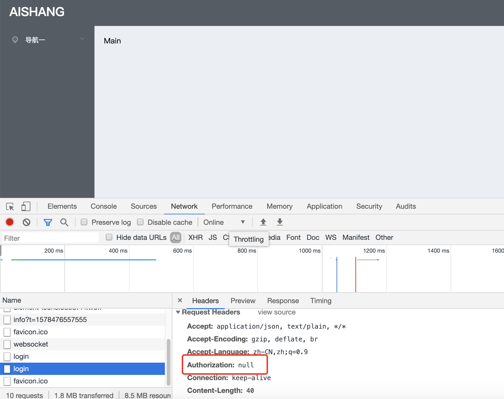
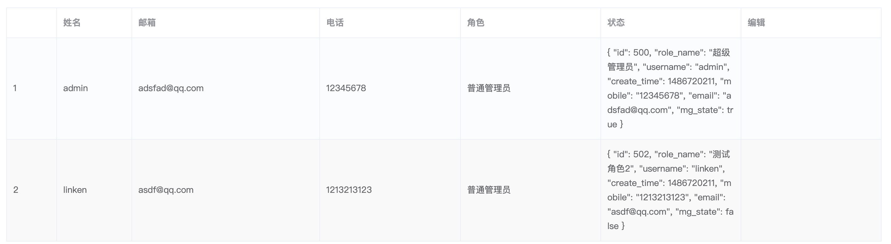

# 主页开发

```vue
<template>
  <el-container class="bg">
    <el-header>
      AISHANG
      <el-button type="info" plain>退出</el-button>
    </el-header>
    <el-container>
      <el-aside width="200px">
        <el-menu
          default-active="2"
          class="el-menu-vertical-demo"
          background-color="#545c64"
          text-color="#fff"
          active-text-color="#ffd04b"
        >
          <el-submenu index="1">
            <template slot="title">
              <i class="el-icon-location"></i>
              <span>导航一</span>
            </template>
            <el-menu-item index="1-4-1">
              <template slot="title">
                <i class="el-icon-location"></i>
                <span>导航一</span>
              </template>
            </el-menu-item>
          </el-submenu>
        </el-menu>
      </el-aside>
      <el-main>Main</el-main>
    </el-container>
  </el-container>
</template>

<script>
export default {
  methods: {
    loginout() {
      sessionStorage.clear();
      this.$router.push("/login");
    }
  }
};
</script>

<!-- Add "scoped" attribute to limit CSS to this component only -->
<style lang="less" scoped>
.el-header {
  font-size: 26px;
  font-weight: bold;
  line-height: 60px;
  background-color: #545c64;
  display: flex;
  justify-content: space-between;
  align-items: center;
  color: white;
  .el-button--info.is-plain {
    background-color: #545c64;
    color: white;

    &:hover {
      background-color: white;
      color: #919399;
    }
  }
}
.el-aside {
  background-color: #545c64;
  li {
    width: 200px;
  }
}
.el-main {
  background-color: #eaeef3;
}
.el-container {
  height: 100%;
}
</style>

```

# 请求拦截器

通过拦截器添加token，保证拥有获取数据的权限

```js
//main.js
import axios from 'axios'
axios.defaults.baseURL='http://127.0.0.1:8888/api/private/v1/'
axios.interceptors.request.use(config=>{
  // console.log('-------');
  // console.log(config);
  // console.log('-------');
  //固定写法，必须return config
  // 需要授权的 API ，必须在请求头中使用 `Authorization` 字段提供 `token` 令牌
  config.headers.Authorization = window.sessionStorage.getItem('token')
  return config
})
Vue.prototype.$http = axios

//之后点击登录，看后台


```



因为是登录期间，服务器肯定不会颁发令牌，默认null，如果登陆后，在调用其他接口，就不是null

# 获取左侧菜单

页面在进入home的时候，需要发送请求，获取菜单数据

```html
<template>
  <el-container class="bg">
    <el-header>
       <span>AISHANG <span class="san"><el-button @click="toggle" type="text" style="color:white">三</el-button></span></span>
      <el-button type="info" plain>退出</el-button>
    </el-header>
    <el-container>
      <el-aside :width="collapse?'64px':'200px'">
        <el-menu
          default-active="2"
          class="el-menu-vertical-demo"
          background-color="#545c64"
          text-color="#fff"
          active-text-color="#ffd04b"
          unique-opened
          :collapse="collapse"
          :collapse-transition="false"
        >
          <!-- index只接收字符串 -->
          <el-submenu v-for="item in menuList" :key="item.id" :index="item.id+''">
            <template slot="title">
              <i :class="iconList[item.id]"></i>
              <span>{{item.authName}}</span>
            </template>
            <el-menu-item :index="items.id + ''" v-for="items in item.children" :key="items.id">
              <template slot="title">
                <i :class="iconListTwo[items.id]"></i>
                <span>{{items.authName}}</span>
              </template>
            </el-menu-item>
          </el-submenu>
        </el-menu>
      </el-aside>
      <el-main>Main</el-main>
    </el-container>
  </el-container>
</template>

<script>
export default {
  data() {
    return {
      menuList: [],
      iconList: {
        "101": "el-icon-s-shop",
        "103": "el-icon-s-opportunity",
        "125": "el-icon-s-custom",
        "102": "el-icon-s-claim",
        "145": "el-icon-thumb"
      },
      iconListTwo: {
        "104": "el-icon-s-shop",
        "115": "el-icon-s-shop",
        "121": "el-icon-s-shop",
        "107": "el-icon-s-opportunity",
        "110": "el-icon-s-custom",
        "112": "el-icon-s-claim",
        "111": "el-icon-s-claim",
        "146": "el-icon-thumb"
      },
      collapse:false
    };
  },
  created() {
    this.getMenuList();
  },
  methods: {
    loginout() {
      sessionStorage.clear();
      this.$router.push("/login");
    },
    async getMenuList() {
      let { data: res } = await this.$http.get("menus");
      console.log(res);
      if (res.meta.status != 200) return this.$message.error("网络错误");
      this.menuList = res.data;
    },
    toggle(){
      this.collapse = !this.collapse
    }
  }
};
</script>

<!-- Add "scoped" attribute to limit CSS to this component only -->
<style lang="less" scoped>
.el-header {
  font-size: 26px;
  font-weight: bold;
  line-height: 60px;
  background-color: #545c64;
  display: flex;
  justify-content: space-between;
  align-items: center;
  color: white;
  .el-button--info.is-plain {
    background-color: #545c64;
    color: white;

    &:hover {
      background-color: white;
      color: #919399;
    }
  }
  .san{
    font-size: 16px;
    position: absolute;
    top:-2px;
    margin-left: 10px;
  }
}
.el-aside {
  background-color: #545c64;
}
.el-main {
  background-color: #eaeef3;
}
.el-container {
  height: 100%;
}
.el-menu{
  border: 0;
}
</style>


```

# 欢迎页面

```js
//router.js
import Vue from 'vue'
import Router from 'vue-router'
// import login from '@/components/login'
// import login from '../components/login'
// 写法都一样
import login from '../components/login.vue'
import home from '../components/home.vue'
import welcome from '../components/welcome.vue'

Vue.use(Router)

const router =  new Router({
  routes: [
    {
      path: '/',
      redirect:'/login'
    },
    {
      path:'/login',
      component:login
    },
    {
      path:'/home',
      component:home,
      redirect:'/welcome',
      children:[
       {
        path:'/welcome',
        component:welcome
       }
      ]
    }
  ]
})
// 挂载路由守卫
router.beforeEach((to,form,next)=>{
  // next()放行  next（‘/login’）强制跳转
  if(to.path==="/login") return next();
  let username = sessionStorage.getItem("username")
  console.log(username);//null
  if(username==null){
      return next('/login')
  }else{
    next()
  }

})
export default router

```

Home.vue

```html
<el-main>
    <router-view></router-view>
</el-main>

.el-main {
  background-color: white;
  padding: 0;
  text-align: center;
}
```

welcome.vue

```html
<!--  -->
<template>
  <div>
      
  </div>
</template>

<script>
export default {
  data () {
    return {
    };
  },

  methods: {}
}

</script>
<style lang='less' scoped>
img{
    width: 1200px;
}
</style>
```


# 左侧菜单改成链接

| router | 是否使用 vue-router 的模式，启用该模式会在激活导航时以 index 作为 path 进行路由跳转 | boolean | —    | false |
| ------ | ------------------------------------------------------------ | ------- | ---- | ----- |
|        | 在el-menu上添加router属性                                    |         |      | true  |

```vue
 <el-menu
          default-active="2"
          class="el-menu-vertical-demo"
          background-color="#545c64"
          text-color="#fff"
          active-text-color="#ffd04b"
          unique-opened
          :collapse="collapse"
          :collapse-transition="false"
          :router="true"
        >
          <!-- index只接收字符串 -->
          <el-submenu v-for="item in menuList" :key="item.id" :index="item.id+''">
            <template slot="title">
              <i :class="iconList[item.id]"></i>
              <span>{{item.menuName}}</span>
            </template>
            <el-menu-item :index="items.path" v-for="items in item.children" :key="items.id">
              <template slot="title">
                <i class="el-icon-menu"></i>
                <span>{{items.menuName}}</span>
              </template>
            </el-menu-item>
          </el-submenu>
        </el-menu>
```

# 用户列表

- 创建用户列表组件users.vue

```html
<!--  -->
<template>
  <div>
      <h1>用户列表</h1>
  </div>
</template>

<script>
export default {
  data () {
    return {
    };
  },

  components: {},

  computed: {},

  mounted: {},

  methods: {}
}

</script>
<style lang='less' scoped>
</style>
```

- 配置路由

```js
{
      path:'/home',
      component:home,
      redirect:'/welcome',
      children:[
       {
        path:'/welcome',
        component:welcome
       },
       {
         path:'/users',
         component:users
       },
      ]
    }
```


- 点击后高亮

  - el-menu添加属性

  ```js
  :default-active="saveActive"
  
  
  
   <el-menu
            default-active="/users"
            class="el-menu-vertical-demo"
            background-color="#545c64"
            text-color="#fff"
            active-text-color="#ffd04b"
            unique-opened
            :collapse="collapse"
            :collapse-transition="false"
            :router="true"
          >
  ```

- 需要动态添加路由地址

```html
 :default-active="active"

 <el-menu-item :index="items.path" @click="activePath(items.path)" v-for="items in item.children" :key="items.id">
     
     
<script>
export default {
  data() {
    return {
      active:''
    };
  },
  created() {
    this.active = window.sessionStorage.getItem('activePath')
  },
  methods: {
    activePath(path){
        window.sessionStorage.setItem('activePath',path)
        this.active  = path
    }
  }
};
</script>
```

#### 面包屑导航区

```html
<template>
  <div>
    <el-breadcrumb separator=">">
      <el-breadcrumb-item :to="{ path: '/welcome' }">首页</el-breadcrumb-item>
      <el-breadcrumb-item :to="{ path: '/user' }">
        用户管理
      </el-breadcrumb-item>
      <el-breadcrumb-item>用户列表</el-breadcrumb-item>
    </el-breadcrumb>
  </div>
</template>

<script>
export default {};
</script>

<style>
</style>
```

- 卡片视图区

```html
    <el-card class="box-card">
      <div slot="header" class="clearfix">
        <el-row :gutter="20">
          <el-col :span="6">
            <el-input placeholder="请输入内容" v-model="input3" class="input-with-select">
              <el-button slot="append" icon="el-icon-search"></el-button>
            </el-input>
          </el-col>
          <el-col :span="6">
            <el-button type="primary">添加用户</el-button>
          </el-col>
        </el-row>
      </div>
      <div v-for="o in 4" :key="o" class="text item">{{'列表内容 ' + o }}</div>
    </el-card>
```

- 列表数据

```js
<!--  -->
<template>
  <div>
    <el-breadcrumb separator=">">
      <el-breadcrumb-item :to="{ path: '/welcome' }">首页</el-breadcrumb-item>
      <el-breadcrumb-item :to="{ path: '/user' }">用户管理</el-breadcrumb-item>
      <el-breadcrumb-item>用户列表</el-breadcrumb-item>
    </el-breadcrumb>

    <el-card class="box-card">
      <div slot="header" class="clearfix">
        <el-row :gutter="20">
          <el-col :span="6">
            <el-input placeholder="请输入内容" v-model="input3" class="input-with-select">
              <el-button slot="append" icon="el-icon-search"></el-button>
            </el-input>
          </el-col>
          <el-col :span="6">
            <el-button type="primary">添加用户</el-button>
          </el-col>
        </el-row>
      </div>


     <div>
        <el-table border :data="userList" style="width: 100%" stripe>
          <!-- 添加序号 -->
          <el-table-column type="index" width="80"></el-table-column>
          <el-table-column prop="username" label="姓名" width="120"></el-table-column>
          <el-table-column prop="email" label="邮箱" width="300"></el-table-column>
          <el-table-column prop="mobile" label="电话"></el-table-column>
          <el-table-column prop="role_name" label="角色">
          </el-table-column>
          <el-table-column label="状态">
            <!-- <template slot-scope="scope">
                {{scope.row}}
            </template> -->
            <template slot-scope="scope">
              <el-switch v-model="scope.row.mg_state"></el-switch>
            </template>
          </el-table-column>

          <el-table-column prop="edit" label="编辑"></el-table-column>
        </el-table>
      </div>


    </el-card>
  </div>
</template>

<script>
export default {
  data() {
    return {
      userList: [],
      // 获取用户列表所需参数
      userInfo:{
        query:'',
        pagenum:1,
        pagesize:2
      },
      // 总数据条数
      total:0
    };
  },
  created() {
    this.getUserList()
  },
  methods: {
    async getUserList() {
      const { data: res } = await this.$http.get("users",{params:this.userInfo});
      // console.log(res);
      if(res.meta.status !==200) return this.$message.error('网络错误')
      this.userList =res.data.users
      this.total = res.data.total
    }
  }
};
</script>
<style lang='less' scoped>
.el-breadcrumb {
  margin-bottom: 20px;
}
</style>
```

插槽，会获取所有数据

```js
<el-table-column label="状态">
    <!-- <template slot-scope="scope">
        {{scope.row}}
    </template> -->
    <template slot-scope="scope">
        <el-switch v-model="scope.row.mg_state"></el-switch>
    </template>
</el-table-column>
```




# 编辑按钮

```html
<el-table-column prop="edit" label="编辑">
    <template slot-scope="scope">
        <el-button type="primary" icon="el-icon-edit"></el-button>
        <el-button type="danger" icon="el-icon-delete"></el-button>
        <el-tooltip :enterable="false" class="item" effect="dark" content="分配权限" placement="top">
            <el-button type="warning" icon="el-icon-setting"></el-button>
        </el-tooltip>
    </template>
</el-table-column>
```

# 分页

```html
<!--  -->
<template>
  <div>
    <el-breadcrumb separator=">">
      <el-breadcrumb-item :to="{ path: '/welcome' }">首页</el-breadcrumb-item>
      <el-breadcrumb-item :to="{ path: '/user' }">用户管理</el-breadcrumb-item>
      <el-breadcrumb-item>用户列表</el-breadcrumb-item>
    </el-breadcrumb>

    <el-card class="box-card">
      <div slot="header" class="clearfix">
        <el-row :gutter="20">
          <el-col :span="6">
            <el-input placeholder="请输入内容" class="input-with-select">
              <el-button slot="append" icon="el-icon-search"></el-button>
            </el-input>
          </el-col>
          <el-col :span="6">
            <el-button type="primary">添加用户</el-button>
          </el-col>
        </el-row>
      </div>
      <div>
        <el-table border :data="userList" style="width: 100%" stripe>
          <!-- 添加序号 -->
          <el-table-column type="index" width="80"></el-table-column>
          <el-table-column prop="username" label="姓名" width="120"></el-table-column>
          <el-table-column prop="email" label="邮箱" width="300"></el-table-column>
          <el-table-column prop="mobile" label="电话"></el-table-column>
          <el-table-column prop="role_name" label="角色"></el-table-column>
          <el-table-column label="状态">
            <!-- <template slot-scope="scope">
                {{scope.row}}
            </template>-->
            <template slot-scope="scope">
              <el-switch v-model="scope.row.mg_state"></el-switch>
            </template>
          </el-table-column>

          <el-table-column prop="edit" label="编辑">
            <template slot-scope="scope">
              <el-button type="primary" icon="el-icon-edit"></el-button>
              <el-button type="danger" icon="el-icon-delete"></el-button>
              <el-tooltip
                :enterable="false"
                class="item"
                effect="dark"
                content="分配权限"
                placement="top"
              >
                <el-button type="warning" icon="el-icon-setting"></el-button>
              </el-tooltip>
            </template>
          </el-table-column>
        </el-table>

        <!-- 分页 -->
        <el-pagination
          @size-change="handleSizeChange"
          @current-change="handleCurrentChange"
          :current-page="userInfo.pagenum"
          :page-sizes="[1,2,3,4]"
          :page-size="userInfo.pagesize"
          layout="total, sizes, prev, pager, next, jumper"
          :total="total"
        ></el-pagination>
      </div>
    </el-card>
  </div>
</template>

<script>
export default {
  data() {
    return {
      userList: [],
      // 获取用户列表所需参数
      userInfo: {
        query: "",
        // 默认显示第几页
        pagenum: 1,
        // 默认每页显示的条数（可修改）
        pagesize: 2
      },
      // 总条数，根据接口获取数据长度(注意：这里不能为空)
      total: 1
    };
  },
  created() {
    this.getUserList();
  },
  methods: {
    async getUserList() {
      const { data: res } = await this.$http.get("users", {
        params: this.userInfo
      });
      // console.log(res);
      if (res.meta.status !== 200) return this.$message.error("网络错误");
      this.userList = res.data.users;
      this.total = res.data.total;
    },
    // 每页显示的条数
    handleSizeChange(val) {
      // 改变每页显示的条数
      this.userInfo.pagesize = val;
      // 注意：在改变每页显示的条数时，要将页码显示到第一页
      this.getUserList();
      this.userInfo.pagenum = 1;
    },
    // 显示第几页
    handleCurrentChange(val) {
      // 改变默认的页数
      this.userInfo.pagenum = val;
      this.getUserList();
    }
  }
};
</script>
<style lang='less' scoped>
.el-breadcrumb {
  margin-bottom: 20px;
}
.el-pagination {
  margin-top: 20px;
}
</style>
```

# 修改用户状态

```html
<!--  -->
<template>
  <div>
    <el-breadcrumb separator=">">
      <el-breadcrumb-item :to="{ path: '/welcome' }">首页</el-breadcrumb-item>
      <el-breadcrumb-item :to="{ path: '/user' }">用户管理</el-breadcrumb-item>
      <el-breadcrumb-item>用户列表</el-breadcrumb-item>
    </el-breadcrumb>

    <el-card class="box-card">
      <div slot="header" class="clearfix">
        <el-row :gutter="20">
          <el-col :span="6">
            <el-input placeholder="请输入内容" class="input-with-select">
              <el-button slot="append" icon="el-icon-search"></el-button>
            </el-input>
          </el-col>
          <el-col :span="6">
            <el-button type="primary">添加用户</el-button>
          </el-col>
        </el-row>
      </div>
      <div>
        <el-table border :data="userList" style="width: 100%" stripe>
          <!-- 添加序号 -->
          <el-table-column type="index" width="80"></el-table-column>
          <el-table-column prop="username" label="姓名" width="120"></el-table-column>
          <el-table-column prop="email" label="邮箱" width="300"></el-table-column>
          <el-table-column prop="mobile" label="电话"></el-table-column>
          <el-table-column prop="role_name" label="角色"></el-table-column>
          <el-table-column label="状态">
            <!-- <template slot-scope="scope">
                {{scope.row}}
            </template>-->
            <template slot-scope="scope">
              <el-switch @change="saveState(scope.row)" v-model="scope.row.mg_state"></el-switch>
            </template>
          </el-table-column>

          <el-table-column prop="edit" label="编辑">
            <template slot-scope="scope">
              <el-button type="primary" icon="el-icon-edit"></el-button>
              <el-button type="danger" icon="el-icon-delete"></el-button>
              <el-tooltip
                :enterable="false"
                class="item"
                effect="dark"
                content="分配权限"
                placement="top"
              >
                <el-button type="warning" icon="el-icon-setting"></el-button>
              </el-tooltip>
            </template>
          </el-table-column>
        </el-table>

        <!-- 分页 -->
        <el-pagination
          @size-change="handleSizeChange"
          @current-change="handleCurrentChange"
          :current-page="userInfo.pagenum"
          :page-sizes="[1,2,5,8]"
          :page-size="userInfo.pagesize"
          layout="total, sizes, prev, pager, next, jumper"
          :total="total"
        ></el-pagination>
      </div>
    </el-card>
  </div>
</template>

<script>
export default {
  data() {
    return {
      userList: [],
      // 获取用户列表所需参数
      userInfo: {
        query: "",
        // 默认显示第几页
        pagenum: 1,
        // 默认每页显示的条数（可修改）
        pagesize: 2
      },
      // 总条数，根据接口获取数据长度(注意：这里不能为空)
      total: 1
    };
  },
  created() {
    this.getUserList();
  },
  methods: {
    async getUserList() {
      const { data: res } = await this.$http.get("users", {
        params: this.userInfo
      });
      // console.log(res);
      if (res.meta.status !== 200) return this.$message.error("网络错误");
      this.userList = res.data.users;
      this.total = res.data.total;
    },
    // 每页显示的条数
    handleSizeChange(val) {
      // 改变每页显示的条数
      this.userInfo.pagesize = val;
      // 注意：在改变每页显示的条数时，要将页码显示到第一页
      this.getUserList();
      this.userInfo.pagenum = 1;
    },
    // 显示第几页
    handleCurrentChange(val) {
      // 改变默认的页数
      this.userInfo.pagenum = val;
      this.getUserList();
    },
    // 修改用户状态
    async saveState(userInfo) {
      console.log(userInfo);
      
      //  this.$http.put(`users/:uid/state/:type`)
      const {data:res} =   await this.$http.put(`users/${userInfo.id}/state/${userInfo.mg_state}`);
      if(res.meta.status !==200){
        userInfo.mg_state = !userInfo.mg_state
        return this.$message.error('更新状态失败')
      }
      this.$message.success('更新状态成功')
    }
  }
};
</script>
<style lang='less' scoped>
.el-breadcrumb {
  margin-bottom: 20px;
}
.el-pagination {
  margin-top: 20px;
}
</style>
```

# 搜索

在搜索标签上添加事件及双向数据绑定

- 额外添加属性clearable 可以清空文本框,并绑定清空事件,当点击清空，重新出发获取列表事件

```html

      <div slot="header" class="clearfix">
        <el-row :gutter="20">
          <el-col :span="6">
            <el-input clearable @clear='getUserList' placeholder="请输入内容" v-model="userInfo.query" class="input-with-select">
              <el-button slot="append" @click="getUserList" icon="el-icon-search"></el-button>
            </el-input>
          </el-col>
          <el-col :span="6">
            <el-button type="primary">添加用户</el-button>
          </el-col>
        </el-row>
      </div>

```

# 添加用户

模态框

```html
<el-button type="primary" @click="dialogVisible = true">添加用户</el-button>

<el-dialog title="提示" :visible.sync="dialogVisible" width="50%">
    test
</el-dialog>

data() {
    return {
      // 添加用户对话框
      dialogVisible:false
    };
  },
```


```html


<el-button type="primary" @click="dialogVisible = true">添加用户</el-button>
 <el-dialog title="添加用户" :visible.sync="dialogVisible" width="50%">
              <el-form
                status-icon
                :model="addForm"
                :rules="addFormRules"
                ref="addFormRef"
                label-width="100px"
              >
                <el-form-item label="用户名" prop="username">
                  <el-input v-model="addForm.username"></el-input>
                </el-form-item>
                <el-form-item label="密码" prop="password">
                  <el-input type="addForm.password" v-model="addForm.password"></el-input>
                </el-form-item>
                <el-form-item label="邮箱" prop="email">
                  <el-input v-model="addForm.email"></el-input>
                </el-form-item>
                <el-form-item label="电话" prop="tel">
                  <el-input v-model="addForm.mobile"></el-input>
                </el-form-item>
          
              </el-form>
              <span slot="footer" class="dialog-footer">
                <el-button @click="dialogVisible = false">取 消</el-button>
                <el-button type="primary" @click="dialogVisible = false">确 定</el-button>
              </span>
            </el-dialog>


data() {
    return {
    
      // 添加用户对话框
      dialogVisible: false,
      addForm:{
        username:'',
        password:'',
        email:'',
        mobile:''
      },
      addFormRules:{
        username: [
          { required: true, message: "请输入姓名", trigger: "blur" },
          { min: 2, max: 15, message: "长度在 3 到 15 个字符", trigger: "blur" }
        ],
        password: [
          { required: true, message: "请输入密码", trigger: "blur" },
          { min: 3, max: 15, message: "长度在 3 到 15 个字符", trigger: "blur" }
        ],
        email: [
          { required: true, message: "请输入邮箱", trigger: "blur" }
        ],
        mobile: [
          { required: true, message: "请输入电话", trigger: "blur" }
        ]
      }
    };
```

#### 自定义验证规则

```js
data() {
    // 自定义验证规则
    var validateEmail = (rule, value, callback) => {
      var regEmail = /^[a-zA-Z0-9.!#$%&'*+\/=?^_`{|}~-]+@[a-zA-Z0-9](?:[a-zA-Z0-9-]{0,61}[a-zA-Z0-9])?(?:\.[a-zA-Z0-9](?:[a-zA-Z0-9-]{0,61}[a-zA-Z0-9])?)*$/;
      if (regEmail.test(value)) {
        //  合法
        return callback();
      }
      callback(new Error("请输入正确的邮箱"));
    };
    var validateTel = (rule, value, callback) => {
      var regTel = /^(?:(?:\+|00)86)?1(?:(?:3[\d])|(?:4[5-7|9])|(?:5[0-3|5-9])|(?:6[5-7])|(?:7[0-8])|(?:8[\d])|(?:9[1|8|9]))\d{8}$/;
      if (regTel.test(value)) {
        //  合法
        return callback();
      }
      callback(new Error("请输入正确的手机号"));
    };
    return {}
}
     
       email: [
          { required: true, message: "请输入邮箱", trigger: "blur" },
          { validator: validateEmail, trigger: "blur" }
        ],
        tel: [
          { required: true, message: "请输入电话", trigger: "blur" },
          { validator: validateTel, trigger: "blur" }
```

#### 表单重置功能

当我输入内容，之后点击取消时，在点击添加用户，会发现上次的内容依然存在

- 查elementui，有添加关闭的事件

```js
 <el-dialog @close='dialogVisibleClose' title="添加用户" :visible.sync="dialogVisible" width="50%">
     
     method中添加事件

  dialogVisibleClose(){
      this.$refs.addFormRef.resetFields()
    }
```

#### 表单提交验证

- 给确定按钮绑定事件

```html
<el-button type="primary" @click="addUser">确 定</el-button>
```

- 添加该方法

```js
addUser(){
    this.$refs.addFormRef.validate(async valid=>{
        console.log(valid);
        if(!valid) return
        // 发送请求
        const {data:res} =  await this.$http.post('users',this.addForm)
        if(res.meta.status!==201){
            this.$message.error('添加失败')
        }
        this.$message.success('添加成功')
        //  隐藏对话框
        this.dialogVisible = false
        // 新增之后重新获取数据
        this.getUserList()
    })
}
```


# 修改用户

- 添加事件 ，显示对话框    @click="showEditDialog"

```html
<el-table-column prop="edit" label="编辑">
    <template slot-scope="scope">
        <el-button type="primary" icon="el-icon-edit" @click="showEditDialog"></el-button>
        <el-button type="danger" icon="el-icon-delete"></el-button>
        <el-tooltip
                    :enterable="false"
                    class="item"
                    effect="dark"
                    content="分配权限"
                    placement="top"
                    >
            <el-button type="warning" icon="el-icon-setting"></el-button>
        </el-tooltip>
    </template>
</el-table-column>


<el-dialog title="修改用户" @close="editClose" :visible.sync="editDialogVisible" width="50%">
    <el-form
             status-icon
             :model="editForm"
             :rules="editrules"
             ref="editForm"
             label-width="100px"
             >
        <el-form-item label="用户名" prop="username">
            <el-input v-model="editForm.username"></el-input>
        </el-form-item>
        <el-form-item label="邮箱" prop="email">
            <el-input v-model="editForm.email"></el-input>
        </el-form-item>
        <el-form-item label="电话" prop="mobile">
            <el-input v-model="editForm.mobile"></el-input>
        </el-form-item>

    </el-form>
    <span slot="footer" class="dialog-footer">
        <el-button @click="dialogVisible = false">取 消</el-button>
        <el-button type="primary" @click="editUser">确 定</el-button>
    </span>
</el-dialog>
```

```js
 data() {
    return {
      editDialogVisible:false,
        editForm: {
        username: "",
        email: "",
        mobile: ""
      },
      editFormRules: {
        username: [
          { required: true, message: "请输入姓名", trigger: "blur" },
          { min: 2, max: 15, message: "长度在 3 到 15 个字符", trigger: "blur" }
        ],
        email: [
          { required: true, message: "请输入邮箱", trigger: "blur" },
          { validator: validateEmail, trigger: "blur" }
        ],
        mobile: [
          { required: true, message: "请输入电话", trigger: "blur" },
          { validator: validateTel, trigger: "blur" }
        ]
      }
    };
  }, 

  methods: {
    showEditDialog(){
      this.editDialogVisible = true
    },
    editClose(){
      this.$refs.editForm.resetFields();
    }
  }
```

数据回显

```html
 <el-table-column prop="edit" label="编辑">
            <template slot-scope="scope">
              <el-button type="primary" icon="el-icon-edit" @click="showEditDialog(scope.row.id)"></el-button>
              <el-button type="danger" icon="el-icon-delete"></el-button>
              <el-tooltip
                :enterable="false"
                class="item"
                effect="dark"
                content="分配权限"
                placement="top"
              >
                <el-button type="warning" icon="el-icon-setting"></el-button>
              </el-tooltip>
            </template>
          </el-table-column>
        </el-table>
```

```js
 async showEditDialog(id) {
      const {data:res} =  await this.$http.get('users/'+id)
      if(res.meta.status!=200){
        return this.$message.error('查询失败')
      }
      this.editForm = res.data
      this.editDialogVisible = true;

    },
```

修改表单

- 用户名禁用

  ```html
  <el-input v-model="editForm.username" disabled></el-input>
  ```

- 表单提交验证

  ```html
   <el-button type="primary" @click="editUser">确 定</el-button>
  
  editUser(){
        this.$refs.editForm.validate(async valid => {
          if (!valid) return;
          // 发送请求
          const { data: res } = await this.$http.put("users/"+this.editForm.id,{
            email:this.editForm.email,
            mobile:this.editForm.mobile
          });
          if (res.meta.status !== 200) {
            this.$message.error("修改失败");
          }
          
          //  隐藏对话框
          this.editDialogVisible = false;
          // 新增之后重新获取数据
          this.getUserList();
          this.$message.success("修改成功");
        });
      }
  ```

# 删除

- 点击按钮提示是否删除

```html


          <el-table-column prop="edit" label="编辑" width="240">
            <template slot-scope="scope">
              <el-button type="primary" icon="el-icon-edit" @click="updateUser(scope.row.id)"></el-button>
              <el-button type="danger" icon="el-icon-delete" @click="del(scope.row.id)"></el-button>
              <el-tooltip
                :enterable="false"
                class="item"
                effect="dark"
                content="分配权限"
                placement="top"
              >
                <el-button type="warning" icon="el-icon-setting"></el-button>
              </el-tooltip>
            </template>
          </el-table-column>
        </el-table>

    // 删除用户  弹出删除提示框
   async del(id) {
      const confirmResult = await this.$confirm("是否删除该用户?", "确认信息", {
        distinguishCancelAndClose: true,
        confirmButtonText: "确认",
        cancelButtonText: "取消",
        type: "warning"
      }).catch(err => err);
      console.log(confirmResult);
      if (confirmResult !== "confirm") {
        return this.$message.info("已取消删除");
      }

      const { data: res } = await this.$http.delete('users/'+id);
      if (res.meta.status !== 200) {
        return this.$message.error("网络错误，删除失败");
      }
       this.$message.success("删除成功");
       this.getUserList()
    }
};

```

