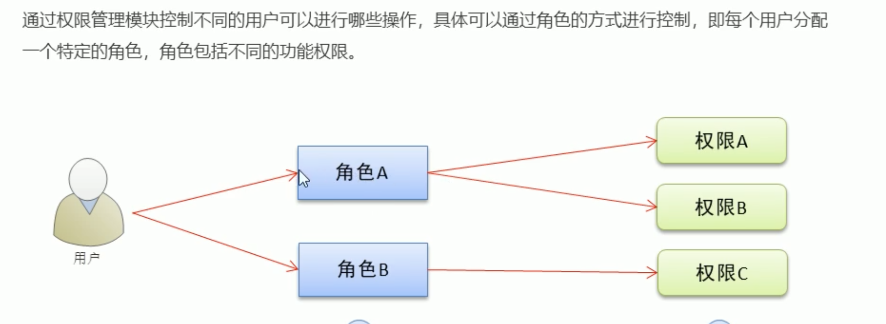
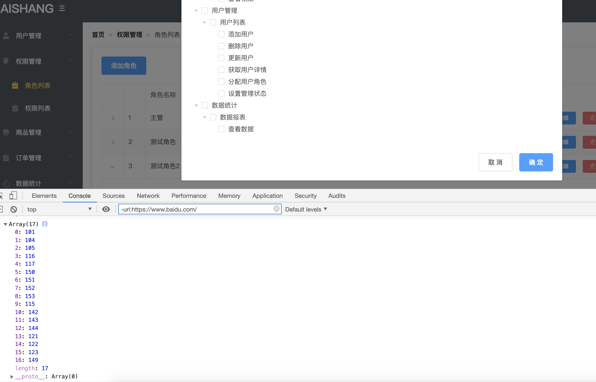
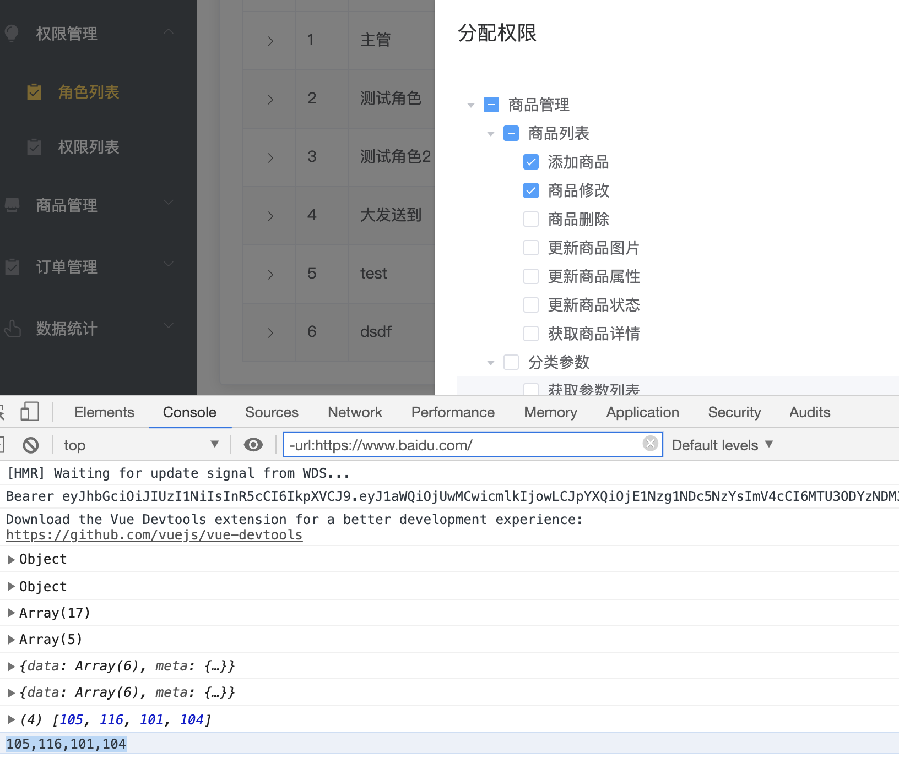

# 权限列表

- 新建权限组件rights.vue

```html
<template>
  <div>
    <!-- mianbaoxie -->
    <el-breadcrumb separator=">">
      <el-breadcrumb-item :to="{ path: '/welcome' }">首页</el-breadcrumb-item>
      <el-breadcrumb-item :to="{ path: '/rights' }">权限管理</el-breadcrumb-item>
      <el-breadcrumb-item>权限列表</el-breadcrumb-item>
    </el-breadcrumb>
    <el-card class="box-card">
      123
    </el-card>
  </div>
</template>

<script>
export default {
  data() {
    return {
      menu: [],
      defaultProps: {
        children: "children",
        label: "pname"
      }
    };
  },
  created() {
  },
  methods: {
  }
};
</script>

<style lang="less" spcopd>
.box-card {
  margin-top: 20px;
}
</style>


```

index.js

```js
import Vue from 'vue'
import Router from 'vue-router'
import login from '@/components/login'
import home from '@/components/home'
import welcome from '@/components/welcome'
import users from '@/components/users'
import rights from '@/components/rights'

Vue.use(Router)

const router = new Router({
  routes: [
    {
      path: '/',
      redirect: '/login'
    },
    {
      path: '/login',
      component: login
    },
    {
      path: '/home',
      component: home,
      redirect: '/welcome',
      children: [
        {
          path: '/welcome',
          component: welcome
        },
        {
          path: '/users',
          component: users
        },
        {
          path: '/rights',
          component: rights
        },
      ]
    }
   
  ]
})
// 挂载路由守卫
router.beforeEach((to, form, next) => {
  // next()放行  next（‘/login’）强制跳转
  if (to.path === "/login") return next();
  let username = sessionStorage.getItem("token")
  console.log(username);//null
  if (username == null) {
    return next('/login')
  } else {
    next()
  }

})
export default router
```

获取列表数据

```html
<template>
  <div>
    <!-- mianbaoxie -->
    <el-breadcrumb separator=">">
      <el-breadcrumb-item :to="{ path: '/welcome' }">首页</el-breadcrumb-item>
      <el-breadcrumb-item :to="{ path: '/rights' }">权限管理</el-breadcrumb-item>
      <el-breadcrumb-item>权限列表</el-breadcrumb-item>
    </el-breadcrumb>
    <el-card class="box-card"></el-card>
  </div>
</template>

<script>
export default {
  data() {
    return {
      menu: [],
      defaultProps: {
        children: "children",
        label: "pname"
      }
    };
  },
  created() {
    this.getRightsList();
  },
  methods: {
    async getRightsList() {
      const { data: res } = await this.$http.get("rights/list");
      this.menu  = res.data
    }
  }
};
</script>

<style lang="less" spcopd>
.box-card {
  margin-top: 20px;
}
</style>


```

渲染数据

```html
<el-table :data="menu" border stripe>
    <el-table-column type="index"></el-table-column>
    <el-table-column label="权限名称" prop="authName"></el-table-column>
    <el-table-column label="路径" prop="path"></el-table-column>
    <el-table-column label="权限等级" prop="level"></el-table-column>
</el-table>
```

标签

```html
<el-table-column label="权限等级" prop="level">
    <template slot-scope="scope">
        <el-tag v-if="scope.row.level === '0'">一级</el-tag>
        <el-tag type="warning" v-else-if="scope.row.level === '1'">二级</el-tag>
        <el-tag type="success" v-else>三级</el-tag>
    </template>
</el-table-column>
```



# 角色列表

- 新建roles.vue

```html
<template>
  <div>
    <el-breadcrumb separator=">">
      <el-breadcrumb-item :to="{ path: '/welcome' }">首页</el-breadcrumb-item>
      <el-breadcrumb-item :to="{ path: '/roles' }">权限管理</el-breadcrumb-item>
      <el-breadcrumb-item>角色列表</el-breadcrumb-item>
    </el-breadcrumb>
    <el-card class="box-card">
      <el-row>
        <el-col>
          <el-button type="primary">添加角色</el-button>
        </el-col>
      </el-row>
    </el-card>
  </div>
</template>

<script>
export default {};
</script>

<style lang="less" spcopd>
.box-card {
  margin-top: 20px;
}
</style>
```

路由

```js
import Vue from 'vue'
import Router from 'vue-router'
import login from '@/components/login'
import home from '@/components/home'
import welcome from '@/components/welcome'
import users from '@/components/users'
import rights from '@/components/rights'
import roles from '@/components/roles'

Vue.use(Router)

const router = new Router({
  routes: [
    {
      path: '/',
      redirect: '/login'
    },
    {
      path: '/login',
      component: login
    },
    {
      path: '/home',
      component: home,
      redirect: '/welcome',
      children: [
        {
          path: '/welcome',
          component: welcome
        },
        {
          path: '/users',
          component: users
        },
        {
          path: '/rights',
          component: rights
        },
        {
          path: '/roles',
          component: roles
        },
      ]
    }
   
  ]
})
// 挂载路由守卫
router.beforeEach((to, form, next) => {
  // next()放行  next（‘/login’）强制跳转
  if (to.path === "/login") return next();
  let username = sessionStorage.getItem("token")
  console.log(username);//null
  if (username == null) {
    return next('/login')
  } else {
    next()
  }

})
export default router
```

渲染数据

```html
<template>
  <div>
    <el-breadcrumb separator=">">
      <el-breadcrumb-item :to="{ path: '/welcome' }">首页</el-breadcrumb-item>
      <el-breadcrumb-item :to="{ path: '/roels' }">权限管理</el-breadcrumb-item>
      <el-breadcrumb-item>角色列表</el-breadcrumb-item>
    </el-breadcrumb>
    <el-card class="box-card">
      <el-row>
        <el-col>
          <el-button type="primary">添加角色</el-button>
        </el-col>
      </el-row>

      <el-table :data="rolesList" border stripe>
        <el-table-column type="index"></el-table-column>
        <el-table-column label="角色名称" prop="roleName"></el-table-column>
        <el-table-column label="角色描述" prop="roleDesc"></el-table-column>
        <el-table-column label="操作">
          <template slot-scope="scope">
            <el-button type="primary" size="mini" icon="el-icon-edit">编辑</el-button>
            <el-button type="danger" size="mini" icon="el-icon-delete">删除</el-button>
            <el-button type="warning" size="mini" icon="el-icon-setting">分配权限</el-button>
          </template>
        </el-table-column>
      </el-table>
    </el-card>
  </div>
</template>

<script>
export default {
  data(){
    return {
      rolesList: []
    }
  },
  created() {
    this.getRolesList();
  },
  methods: {
    async getRolesList() {
      const { data: res } = await this.$http.get("roles");
      console.log(res);
      this.rolesList = res.data
    }
  }
};
</script>

<style lang="less" spcopd>
.box-card {
  margin-top: 20px;
}
.el-table{
    margin-top: 20px
}
</style>
```

- 增加展开按钮列

```html
<el-table-column type="expand"></el-table-column>
```

## 作业：添加编辑删除

## 制作展开列表

```html
<el-table-column type="expand">
    <template slot-scope="scope">
        <el-row v-for="(item1,i1) in scope.row.children" :key='item1.id'>
            <!-- 栅格 24 -->
            <!-- 一级 -->
            <el-col :span="5">
                <el-tag >{{item1.authName}}</el-tag>
            </el-col>
            <!-- 二级、三级 -->
            <el-col :span="19"></el-col>
        </el-row>
    </template>
</el-table-column>

.el-tag{
    margin:10px
}
```

- 定义边框样式

```css
.bdtop{
    border-top: 1px solid #eee;
}
.bdbom{
    border-bottom: 1px solid #eee;
}
```

- 添加样式

```html
<el-row class="bdbom" v-for="(item1,i1) in scope.row.children" :key='item1.id'>
                        <!-- 栅格 24 -->
                        <!-- 一级 -->
                        <el-col :span="5">
                            <el-tag >{{item1.authName}}</el-tag>
                        </el-col>
                        <!-- 二级、三级 -->
                        <el-col :span="19"></el-col>
                    </el-row>
```

改造

```html
<el-table-column type="expand">
            <template slot-scope="scope">
                    <el-row :class="['bdbom',i1 ===0 ? 'bdtop':'bdbom']" v-for="(item1,i1) in scope.row.children" :key='item1.id'>
                        <!-- 栅格 24 -->
                        <!-- 一级 -->
                        <el-col :span="5">
                            <el-tag >{{item1.authName}}</el-tag> <i class="el-icon-caret-right"></i>
                        </el-col>
                        <!-- 二级、三级 -->
                        <el-col :span="19"></el-col>
                    </el-row>
            </template>
        </el-table-column>
```

- 二三级权限

```html
<!-- 二级、三级 -->
<el-col :span="19">
    <el-row :class="[i2===0?'':'bdtop']" v-for="(item2,i2) in item1.children" :key="item2.id">
        <el-col :span="6">
            <el-tag type="success">{{item2.authName}}</el-tag>
            <i class="el-icon-caret-right"></i>
        </el-col>
        <el-col :span="18">
            <el-tag type="warning" v-for="(item3,i3) in item2.children" :key="item3.id">
                {{item3.authName}}
            </el-tag>
        </el-col>
    </el-row>
</el-col>
```

- 列表垂直居中

```css
.el-row {
    display: flex;
    align-items: center;
}
```

- 三级权限添加删除图标  closable

```html
<el-tag closable  type="warning" v-for="(item3,i3) in item2.children" :key="item3.id">
    {{item3.authName}}
</el-tag>
```

- 提示删除

```js
  async removeRolesById(role, rightId) {
      const result = await this.$confirm("是否删除该权限", "提示", {
        confirmButtonText: "确定",
        cancelButtonText: "取消",
        type: "warning"
      });
      if (result !== "confirm") {
        return this.$message.error("取消删除");
      }
      console.log(role.id + "---" + rightId);

      await this.$http.delete(`roles/${role.id}/rights/${rightId}`);
      this.getRolesList();
      this.$$message.success("删除成功");
    }
```

```html
<el-tag
        @close="removeRolesById(scope.row,item3.id)"
        closable
        type="warning"
        v-for="(item3,i3) in item2.children"
        :key="item3.id"
        >{{item3.authName}}</el-tag>
```

- 删除后展开后不合并

```js
  async removeRolesById(role, rightId) {
      const result = await this.$confirm("是否删除该权限", "提示", {
        confirmButtonText: "确定",
        cancelButtonText: "取消",
        type: "warning"
      });
      if (result !== "confirm") {
        return this.$message.error("取消删除");
      }
      console.log(role.id + "---" + rightId);

      const { data: res } = await this.$http.delete(
        `roles/${role.id}/rights/${rightId}`
      );
      role.children = res.data;
      this.$$message.success("删除成功");
    }
```

- 一二级去哪先删除

```html
 复制 closable @close="removeRolesById(scope.row,item3.id)" 到el-tag


<el-tag  @close="removeRolesById(scope.row,item1.id)">{{item1.authName}}</el-tag>

<el-tag  @close="removeRolesById(scope.row,item2.id)" type="success">{{item2.authName}}</el-tag>
```

```html
<template>
  <div>
    <el-breadcrumb separator=">">
      <el-breadcrumb-item :to="{ path: '/welcome' }">首页</el-breadcrumb-item>
      <el-breadcrumb-item :to="{ path: '/roels' }">权限管理</el-breadcrumb-item>
      <el-breadcrumb-item>角色列表</el-breadcrumb-item>
    </el-breadcrumb>
    <el-card class="box-card">
      <el-row>
        <el-col>
          <el-button type="primary">添加角色</el-button>
        </el-col>
      </el-row>

      <el-table :data="rolesList" border stripe>
        <el-table-column type="expand">
          <template slot-scope="scope">
            <el-row
              :class="['bdbom',i1 ===0 ? 'bdtop':'bdbom']"
              v-for="(item1,i1) in scope.row.children"
              :key="item1.id"
            >
              <!-- 栅格 24 -->
              <!-- 一级 -->
              <el-col :span="5">
                <el-tag closable  @close="removeRolesById(scope.row,item1.id)">{{item1.authName}}</el-tag>
                <i class="el-icon-caret-right"></i>
              </el-col>
              <!-- 二级、三级 -->
              <el-col :span="19">
                <el-row
                  :class="[i2===0?'':'bdtop']"
                  v-for="(item2,i2) in item1.children"
                  :key="item2.id"
                >
                  <el-col :span="6">
                    <el-tag closable  @close="removeRolesById(scope.row,item2.id)" type="success">{{item2.authName}}</el-tag>
                    <i class="el-icon-caret-right"></i>
                  </el-col>
                  <el-col :span="18">
                    <el-tag
                      @close="removeRolesById(scope.row,item3.id)"
                      closable
                      type="warning"
                      v-for="(item3,i3) in item2.children"
                      :key="item3.id"
                    >{{item3.authName}}</el-tag>
                  </el-col>
                </el-row>
              </el-col>
            </el-row>
          </template>
        </el-table-column>
        <el-table-column type="index"></el-table-column>
        <el-table-column label="角色名称" prop="roleName"></el-table-column>
        <el-table-column label="角色描述" prop="roleDesc"></el-table-column>
        <el-table-column label="操作">
          <template slot-scope="scope">
            <el-button type="primary" size="mini" icon="el-icon-edit">编辑</el-button>
            <el-button type="danger" size="mini" icon="el-icon-delete">删除</el-button>
            <el-button type="warning" size="mini" icon="el-icon-setting">分配权限</el-button>
          </template>
        </el-table-column>
      </el-table>
    </el-card>
  </div>
</template>

<script>
export default {
  data() {
    return {
      rolesList: []
    };
  },
  created() {
    this.getRolesList();
  },
  methods: {
    async getRolesList() {
      const { data: res } = await this.$http.get("roles");
      console.log(res);
      this.rolesList = res.data;
    },
    async removeRolesById(role, rightId) {
      const result = await this.$confirm("是否删除该权限", "提示", {
        confirmButtonText: "确定",
        cancelButtonText: "取消",
        type: "warning"
      });
      if (result !== "confirm") {
        return this.$message.error("取消删除");
      }
      console.log(role.id + "---" + rightId);

      const { data: res } = await this.$http.delete(
        `roles/${role.id}/rights/${rightId}`
      );
      role.children = res.data;
      this.$$message.success("删除成功");
    }
  }
};
</script>

<style lang="less" spcopd>
.box-card {
  margin-top: 20px;
}
.el-table {
  margin-top: 20px;
}
.el-tag {
  margin: 10px;
}
.bdtop {
  border-top: 1px solid #eee;
}
.bdbom {
  border-bottom: 1px solid #eee;
}
.el-row {
  display: flex;
  align-items: center;
}
</style>
```

# 分配权限

- 弹出对话框

```html
 <el-dialog title="分配权限" @close="rolesClose" :visible.sync="rolesDialogVisible" width="50%">
      <!-- 树形 -->
      <el-tree :data="rightsList" :props="treeProps"></el-tree>

      <span slot="footer" class="dialog-footer">
        <el-button @click="rolesDialogVisible = false">取 消</el-button>
        <el-button type="primary">确 定</el-button>
      </span>
    </el-dialog>
```

```js
<script>
export default {
  data() {
    return {

      rightsList: [],
      treeProps:{
          label:'authName',
          children:'children'
      }
    };
  },

  methods: {

    async showDialog() {
      const { data: res } = await this.$http.get("rights/tree");
      this.rightsList = res.data;
      this.rolesDialogVisible = true;
    },
    rolesClose() {}
  }
};
</script>
```

- 添加show-checkbox 显示选框

```html
  <el-tree show-checkbox  :data="rightsList" :props="treeProps"></el-tree>
```

- 根据id默认选中

```html
 <!-- 树形 -->
      <el-tree   :default-checked-keys="defkeys" node-key="id" show-checkbox  :data="rightsList" :props="treeProps"></el-tree>


data() {
    return {
      rolesList: [],
      rolesDialogVisible: false,
      rightsList: [],
      treeProps:{
          label:'authName',
          children:'children'
      },
      defkeys:[105]  测试
    };
  },
```

- default-expand-all全部展开

```html
      <el-tree default-expand-all show-checkbox  :data="rightsList" :props="treeProps"></el-tree>
```

- 动态获取defkeys

```js
            <el-button type="warning" size="mini" icon="el-icon-setting" @click="showDialog(scope.row)">分配权限</el-button>


 async showDialog(role) {
      const { data: res } = await this.$http.get("rights/tree");
      this.rightsList = res.data;
      //   获取三级节点id
      this.getkeys(role,this.defkeys);
      this.rolesDialogVisible = true;
    },
    // 通过递归，获取角色下所有三级权限id，并保存到defkeys
    getkeys(node, arr) {
      // 如果node节点不包含children，则是三级节点
      if (!node.children) {
        return arr.push(node.id);
      }
      // 不是三级节点
      node.children.forEach(element => {
        this.getkeys(element, arr);
      });
    }
```

- 这里有个bug 权限跟展开项的对应不上，因为每次点击分配权限的时候，都把三级id存到数组中，id越来越多
- 需要关闭时清空

```html
<el-dialog title="分配权限" @close="rolesClose" :visible.sync="rolesDialogVisible" width="50%"> 

    rolesClose(){
    	this.defkeys = []
    }
```

### 添加权限



```html
添加引用属性  ref="treeRef"
绑定事件 @click="allotRights"
<el-dialog title="分配权限" @close="rolesClose" :visible.sync="rolesDialogVisible" width="50%">
      <!-- 树形 -->
      <el-tree
        default-expand-all
        :default-checked-keys="defkeys"
        node-key="id"
        show-checkbox
        :data="rightsList"
        :props="treeProps"
        ref="treeRef"
      ></el-tree>

      <span slot="footer" class="dialog-footer">
        <el-button @click="rolesDialogVisible = false">取 消</el-button>
        <el-button type="primary" @click="allotRights">确 定</el-button>
      </span>
    </el-dialog>
```

```js
allotRights(){
        const keys = [
            // ...展开运算符
            /*
            var arr1=['a','b','c'];
            var arr2=[...arr1,'d','e']; //['a','b','c','d','e']
            */ 
            ...this.$refs.treeRef.getCheckedKeys(), //获取选中节点 √
            ...this.$refs.treeRef.getHalfCheckedKeys() //获取半选中节点 -
        ]
        console.log(keys);
    }
```



```js
    allotRights(){
        const keys = [
            // ...展开运算符
            /*
            var arr1=['a','b','c'];
            var arr2=[...arr1,'d','e']; //['a','b','c','d','e']
            */ 
            ...this.$refs.treeRef.getCheckedKeys(),
            ...this.$refs.treeRef.getHalfCheckedKeys()
        ]
        console.log(keys);
        const str = keys.join(',')
        console.log(str);
    }
```

最终

```html
<template>
  <div>
    <el-breadcrumb separator=">">
      <el-breadcrumb-item :to="{ path: '/welcome' }">首页</el-breadcrumb-item>
      <el-breadcrumb-item :to="{ path: '/roels' }">权限管理</el-breadcrumb-item>
      <el-breadcrumb-item>角色列表</el-breadcrumb-item>
    </el-breadcrumb>
    <el-card class="box-card">
      <el-row>
        <el-col>
          <el-button type="primary">添加角色</el-button>
        </el-col>
      </el-row>

      <el-table :data="rolesList" border stripe>
        <el-table-column type="expand">
          <template slot-scope="scope">
            <el-row
              :class="['bdbom',i1 ===0 ? 'bdtop':'bdbom']"
              v-for="(item1,i1) in scope.row.children"
              :key="item1.id"
            >
              <!-- 栅格 24 -->
              <!-- 一级 -->
              <el-col :span="5">
                <el-tag closable @close="removeRolesById(scope.row,item1.id)">{{item1.authName}}</el-tag>
                <i class="el-icon-caret-right"></i>
              </el-col>
              <!-- 二级、三级 -->
              <el-col :span="19">
                <el-row
                  :class="[i2===0?'':'bdtop']"
                  v-for="(item2,i2) in item1.children"
                  :key="item2.id"
                >
                  <el-col :span="6">
                    <el-tag
                      closable
                      @close="removeRolesById(scope.row,item2.id)"
                      type="success"
                    >{{item2.authName}}</el-tag>
                    <i class="el-icon-caret-right"></i>
                  </el-col>
                  <el-col :span="18">
                    <el-tag
                      @close="removeRolesById(scope.row,item3.id)"
                      closable
                      type="warning"
                      v-for="(item3,i3) in item2.children"
                      :key="item3.id"
                    >{{item3.authName}}</el-tag>
                  </el-col>
                </el-row>
              </el-col>
            </el-row>
          </template>
        </el-table-column>
        <el-table-column type="index"></el-table-column>
        <el-table-column label="角色名称" prop="roleName"></el-table-column>
        <el-table-column label="角色描述" prop="roleDesc"></el-table-column>
        <el-table-column label="操作">
          <template slot-scope="scope">
            <el-button type="primary" size="mini" icon="el-icon-edit">编辑</el-button>
            <el-button type="danger" size="mini" icon="el-icon-delete">删除</el-button>
            <el-button
              type="warning"
              size="mini"
              icon="el-icon-setting"
              @click="showDialog(scope.row)"
            >分配权限</el-button>
          </template>
        </el-table-column>
      </el-table>
    </el-card>

    <el-dialog title="分配权限" @close="rolesClose" :visible.sync="rolesDialogVisible" width="50%">
      <!-- 树形 -->
      <el-tree
        default-expand-all
        :default-checked-keys="defkeys"
        node-key="id"
        show-checkbox
        :data="rightsList"
        :props="treeProps"
        ref="treeRef"
      ></el-tree>

      <span slot="footer" class="dialog-footer">
        <el-button @click="rolesDialogVisible = false">取 消</el-button>
        <el-button type="primary" @click="allotRights">确 定</el-button>
      </span>
    </el-dialog>
  </div>
</template>

<script>
export default {
  data() {
    return {
    
      roleId: ""
    };
  },

  methods: {
   
    async showDialog(role) {
       //获取id
      this.roleId = role.id;
      const { data: res } = await this.$http.get("rights/tree");
      this.rightsList = res.data;
      //   获取三级节点id
      this.getkeys(role, this.defkeys);
      this.rolesDialogVisible = true;
    },
    
    async allotRights() {
      const keys = [
        // ...展开运算符
        /*
            var arr1=['a','b','c'];
            var arr2=[...arr1,'d','e']; //['a','b','c','d','e']
            */

        ...this.$refs.treeRef.getCheckedKeys(),
        ...this.$refs.treeRef.getHalfCheckedKeys()
      ];
      console.log(keys);
      const str = keys.join(",");
      console.log(str);
      await this.$http.post(`roles/${this.roleId}/rights`, { rids: str });
      this.$message.success('添加成功')
      this.getRolesList()
      this.rolesDialogVisible = false
    }
  }
};
</script>

```

# 用户列表分配角色

```html
 <el-button type="warning" icon="el-icon-setting" @click="showAllot(scope.row)"></el-button>
```

```html
  <!-- 分配角色 -->
        <el-dialog title="分配角色" @close="rolesClose" :visible.sync="rolesDialogVisible" width="50%">
         

          <span slot="footer" class="dialog-footer">
            <el-button @click="rolesDialogVisible = false">取 消</el-button>
            <el-button type="primary" @click="allotRights">确 定</el-button>
          </span>
        </el-dialog>
```

```js
rolesDialogVisible:false
 showAllot(){
      this.rolesDialogVisible = true
    }
```

```html

  
        <el-table border :data="userList" style="width: 100%" stripe>
          <!-- 添加序号 -->
          <el-table-column type="index" width="80"></el-table-column>
          <el-table-column prop="username" label="姓名" width="120"></el-table-column>
          <el-table-column prop="email" label="邮箱" width="300"></el-table-column>
          <el-table-column prop="mobile" label="电话"></el-table-column>
          <el-table-column prop="role_name" label="角色"></el-table-column>
          <el-table-column label="状态">
            <!-- <template slot-scope="scope">
                {{scope.row}}
            </template>-->
            <template slot-scope="scope">
              <el-switch @change="saveState(scope.row)" v-model="scope.row.mg_state"></el-switch>
            </template>
          </el-table-column>

          <el-table-column prop="edit" label="编辑">
            <template slot-scope="scope">
              <el-button type="primary" icon="el-icon-edit" @click="showEditDialog(scope.row.id)"></el-button>
              <el-button type="danger" icon="el-icon-delete" @click="del(scope.row.id)"></el-button>
              <el-tooltip
                :enterable="false"
                class="item"
                effect="dark"
                content="分配权限"
                placement="top"
              >
                <el-button type="warning" icon="el-icon-setting" @click="showAllot(scope.row)"></el-button>
              </el-tooltip>
            </template>
          </el-table-column>
        </el-table>

        <!-- 分配角色 -->
        <el-dialog title="分配角色" @close="rolesClose" :visible.sync="rolesDialogVisible" width="50%">
          <div>
            <p>当前用户:{{roleInfo.username}}</p>
            <p>当前角色:{{roleInfo.role_name}}</p>
            <p>分配角色
              <el-select v-model="selectId" placeholder="请选择">
                <el-option v-for="item in rolesList"
                  :key="item.id"
                  :label="item.roleName"
                  :value="item.id">
                </el-option>
              </el-select>
              
            </p>
          </div>

          <span slot="footer" class="dialog-footer">
            <el-button @click="rolesDialogVisible = false">取 消</el-button>
            <el-button type="primary" @click="allotRights">确 定</el-button>
          </span>
        </el-dialog>


<script>

export default {
  data() {

    return {
    
      rolesDialogVisible:false,
      roleInfo:{},
      rolesList:[],
        selectId:''
    };
  },
  created() {
    this.getUserList();
  },
  methods: {
  
    async showAllot(roleInfo){
      this.roleInfo = roleInfo
      // 获取所有角色列表
      const {data:res} = await this.$http.get('roles')
      this.rolesList = res.data
      this.rolesDialogVisible = true
    }
  }
};
</script>
```

确定添加

```html
 <el-button type="primary" @click="allotRights">确 定</el-button>
async allotRights() {
      console.log(!this.selectId); //true  用户没选择角色
      if (!this.selectId) {
        return this.$message.error("请选择角色");
      }
      const { data: res } = await this.$http.put(
        `users/${this.roleInfo.id}/role`,
        { rid: this.selectId }
      );

      this.$message.success("更新角色成功");
      this.getUserList()
      this.rolesDialogVisible = false
    }
  }
```

关闭清空数据

```html
rolesClose(){
      this.selectId = ''
      this.roleInfo= {}
    }
```


