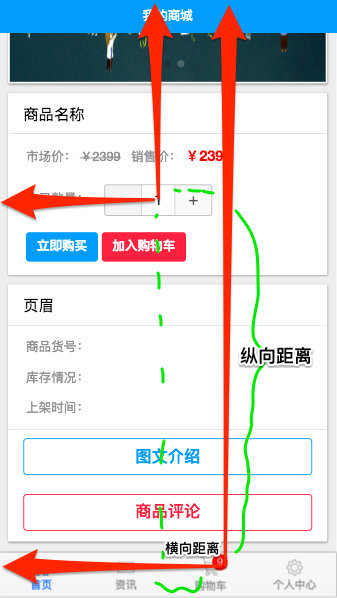
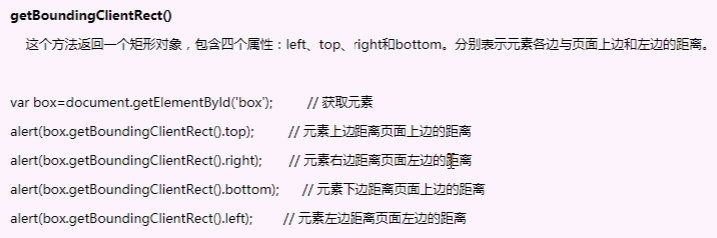

# 一、加入购物车动画

### 1、小球样式

```css
<!-- 小球动画 -->
<div class="ball" v-show="ball"></div> 

// 小球动画
.ball {
    width: 17px;
    height: 19px;
    background-color: red;
    border-radius: 50%;
    position: absolute;
    z-index: 99;
    left: 156px;
    top: 51px;
}


//js
data() {
    return {
        id: this.$route.params.id,
        ball:true//控制小球隐藏
    };
},
methods: {
    async getProInfo() {
        let { data } = await this.$http.get("/products");
        this.pro = data.pros[0];
    },
    showBall() {}
}
```

### 2、在点击加入购物车按钮后，触发事件，进行动画

vue中的简单动画


把完整的动画分成了进入（enter）和离开（leave）

- `v-enter`：定义进入过渡的开始状态。在元素被插入之前生效，在元素被插入之后的下一帧移除。
- `v-enter-active`：定义进入过渡生效时的状态。在整个进入过渡的阶段中应用，在元素被插入之前生效，在过渡/动画完成之后移除。这个类可以被用来定义进入过渡的过程时间，延迟和曲线函数。
- `v-enter-to`: **2.1.8版及以上** 定义进入过渡的结束状态。在元素被插入之后下一帧生效 (与此同时 `v-enter` 被移除)，在过渡/动画完成之后移除。
- `v-leave`: 定义离开过渡的开始状态。在离开过渡被触发时立刻生效，下一帧被移除。
- `v-leave-active`：定义离开过渡生效时的状态。在整个离开过渡的阶段中应用，在离开过渡被触发时立刻生效，在过渡/动画完成之后移除。这个类可以被用来定义离开过渡的过程时间，延迟和曲线函数。
- `v-leave-to`: **2.1.8版及以上** 定义离开过渡的结束状态。在离开过渡被触发之后下一帧生效 (与此同时 `v-leave` 被删除)，在过渡/动画完成之后移除。
- v-enter-to和v-leave，v-enter和v-leave-to状态是一样的

#### 1）使用过度类名实现动画

- 使用transition把需要动画控制的元素包裹起来
- 自定义两组样式，来控制transition内部动画

```html
<template>
    <div class="proinfo">
        <!-- 小球动画 -->
        <transition>
            <div class="ball" v-show="ball"></div>
        </transition>
    </div>
</template>

<script>
    import numberbox from "../numberbox";
    export default {
        data() {
            return {
                ball: true //控制小球隐藏
            };
        },
        methods: {
            showBall() {
                this.ball = !this.ball;
            }
        }
    };
</script>
<style lang='less' scoped>
    .v-enter,
    .v-leave-to {
        opacity: 0;
        transform: translateX(100px);
    }
    .v-enter-active,
    .v-leave-active {
        transition: all 1s linear;
    }
</style>
```

#### 2、使用Animate.css框架

- 引入

```js
<link
rel="stylesheet"
href="https://cdnjs.cloudflare.com/ajax/libs/animate.css/4.0.0/animate.min.css"
/>
```

<https://daneden.github.io/animate.css/>

- 样式上写animated

  ```html
  <button @click='flag=!flag'>我是框架的动画</button>
  <transition enter-active-class="animate__animated animate__backInDown" leave-active-class="animate__animated animate__wobble" name="slide-fade">
              <p v-if="show">hello</p>
          </transition>
  ```

- vue中使用(在vue文件中引入)

```js
import "../../../static/animate.css";
```

```vue
<!-- 小球动画 -->
<transition
            enter-active-class="animated bounceIn"
            leave-active-class="animated bounceOut"
            >
    <div class="ball" v-show="ball"></div>
</transition>
```

#### 3、第三种半场动画

可以在属性中声明 JavaScript 钩子

```html
<transition
  v-on:before-enter="beforeEnter"
  v-on:enter="enter"
  v-on:after-enter="afterEnter"
  v-on:enter-cancelled="enterCancelled"

  v-on:before-leave="beforeLeave"
  v-on:leave="leave"
  v-on:after-leave="afterLeave"
  v-on:leave-cancelled="leaveCancelled"
>
  <!-- ... -->
</transition>
```

- @before-enter 动画入场之前，动画尚未开始
- @enter 表示动画开始之后的样式，设置动画结束的状态
- @after-enter 动画完成之后调用这个函数

```vue
<!-- 小球动画 -->
<transition @before-enter="beforeEnter" @enter="enter" @after-enter="afterEnter">
    <div class="ball" v-show="ball"></div>
</transition>
```

案例

```html
<!DOCTYPE html>
<html>
    <head>
        <meta charset="utf-8" />
        <meta http-equiv="X-UA-Compatible" content="IE=edge">
        <title>Page Title</title>
        <meta name="viewport" content="width=device-width, initial-scale=1">
        <link rel="stylesheet" href="https://cdnjs.cloudflare.com/ajax/libs/animate.css/3.7.0/animate.min.css">
        <script src="https://cdn.jsdelivr.net/npm/vue/dist/vue.js"></script>
        <style>
            .box {
                width: 10px;
                height: 10px;
                border-radius: 50%;
                background-color: red
            }
        </style>
    </head>
    <body>
        <div id="app">

            <button @click='flag=!flag'>加入购物车</button>
            <transition 
                        @before-enter="beforeEnter" 
                        @enter="enter"
                        @after-enter="afterEnter">
                <div class="box" v-show="flag"></div>
            </transition>
        </div>

        <script>
            var vm = new Vue({
                el:'#app',
                data:{
                    flag:false
                },
                methods: {
                    //el代表要执行动画的那个元素，是个原生jsDom对象
                    //document.getElementById('')这种方式获取到的
                    beforeEnter(el){
                        //动画入场之前，动画尚未开始
                        el.style.transform = "translate(0,0)"
                    },
                    enter(el,done){
                        el.offsetWidth//没有实际作用，如果不写没有效果，认为强制刷新
                        //表示动画开始之后的样式，设置动画结束的状态
                        el.style.transform = "translate(100px,500px)"
                        el.style.transition = "all 1s ease"
                        //done其实就是afterEnter函数
                        done()
                    },
                    afterEnter(el){
                        //动画完成之后调用这个函数
                        // el.style.display = "none"
                        this.flag = false//这种会有延迟，需要立即调用这个函数done()
                    }
                },
            })
        </script>
    </body>
</html>
```

- 修改app的代码

```vue
<template>
  <div class="proinfo">
    <!-- 小球动画 -->
    <transition @before-enter="beforeEnter" @enter="enter" @after-enter="afterEnter">
      <div class="ball" v-show="flag"></div>
    </transition>
    <mt-header fixed title="商品详情">
      <router-link to="/home/product" slot="left">
        <mt-button icon="back">返回</mt-button>
      </router-link>
      <mt-button icon="more" slot="right"></mt-button>
    </mt-header>
    <!-- 商品轮播图 -->
    <div class="mui-card">
      <div class="mui-card-content">
        <div class="mui-card-content-inner">
          <!-- 轮播图 -->
          <mt-swipe :auto="2000">
            <mt-swipe-item>
              
            </mt-swipe-item>
            <mt-swipe-item>
              
            </mt-swipe-item>
            <mt-swipe-item>
              
            </mt-swipe-item>
          </mt-swipe>
        </div>
      </div>
    </div>
    <!-- 商品购买 -->
    <div class="mui-card">
      <div class="mui-card-header">商品名称：{{pro.title}}</div>
      <div class="mui-card-content cart">
        <div class="mui-card-content-inner">
          <p class="price">
            市场价：
            <del>￥{{pro.new}}</del>&nbsp;&nbsp;&nbsp;销售价：
            <span class="nowprice">￥{{pro.old}}</span>
          </p>
          <p style="display:inline-block">购买数量：</p>
          <numberbox></numberbox>
          <p>
            <mt-button type="primary" size="small">立即购买</mt-button>
            <mt-button type="danger" size="small" @click="flag=!flag">加入购物车</mt-button>
          </p>
        </div>
      </div>
    </div>
    <!-- 商品参数 -->
    <div class="mui-card">
      <div class="mui-card-header">商品参数</div>
      <div class="mui-card-content cart">
        <div class="mui-card-content-inner">
          <p>商品货号：{{pro.store}}</p>
          <p>库存情况：{{pro.number}}</p>
          <p>上架时间：{{pro.time}}</p>
        </div>
      </div>
      <div class="mui-card-footer">
        <mt-button type="primary" size="large" plain>图文介绍</mt-button>
        <br />
        <mt-button type="danger" size="large" plain>商品评论</mt-button>
      </div>
    </div>
  </div>
</template>

<script>
import numberbox from "../numberbox";
import "../../../static/animate.css";
export default {
  data() {
    return {
      pro: {},
      flag: false //控制小球隐藏
    };
  },
  components: {
    numberbox
  },
  created() {
    this.getProInfo();
  },
  methods: {
    async getProInfo() {
      let { data } = await this.$http.get("/products");
      this.pro = data.pros[0];
    },
    //el代表要执行动画的那个元素，是个原生jsDom对象
    //document.getElementById('')这种方式获取到的
    beforeEnter(el) {
      //动画入场之前，动画尚未开始
      el.style.transform = "translate(0,0)";
    },
    enter(el, done) {
      el.offsetWidth; //没有实际作用，如果不写没有效果，认为强制刷新
      //表示动画开始之后的样式，设置动画结束的状态
      el.style.transform = "translate(100px,500px)";
      el.style.transition = "all 1s ease ";
      //done其实就是afterEnter函数
      done();
    },
    afterEnter(el) {
      //动画完成之后调用这个函数
      // el.style.display = "none"
      this.flag = false; //这种会有延迟，需要立即调用这个函数done()
    }
  }
};
</script>
<style lang='less' scoped>
.proinfo {
  background-color: #eee;
  /* 解决盒子塌陷 */
  overflow: hidden;
  .mui-card-content-inner {
    padding: 0;
    .mint-swipe {
      height: 200px;
    }
    img {
      width: 100%;
      height: 200px;
    }
  }
  .mui-card {
    padding: 2px;
    p {
      padding-left: 5px;
      margin: 13px;
    }
  }
  //   商品购买区域样式
  .nowprice {
    color: red;
    font-size: 16px;
    font-weight: bold;
  }
  //   商品参数  br不好使  因为父类使用了flex布局 干掉他就行
  .mui-card-footer {
    display: block;
  }
  padding-bottom: 60px;
}

.ball {
  width: 17px;
  height: 19px;
  background-color: red;
  border-radius: 50%;
  position: absolute;
  z-index: 1000;
  left: 168px;
  top: 374px;
}
</style>
```

- 动画加上曲线效果更好  (cubic-bezier.com)

  ```js
  el.style.transition="all 1s cubic-bezier(.4,-0.3,1,.68) ";
  ```


### 3、动画bug

- 问题，发现在不同像素之间存在bug，例如，我滑动画面后，小球位置就变了

- 优化思路：

  - 导致动画不准确的原因，我们把小球最终位移到的位置，已经局限在某一分辨率下，滚动条未滚动的未知

  - 只要分辨率和测试的时候不一样，或者滚动条有一定的滚动距离后，bug就出现了

  - 因此，不能把位移的横纵坐标直接写死，而是应该根据不同的情况，动态计算这个坐标值

  - 最终，小球都要到底部的位置，我只要根据底部的位置，拿到纵轴距离顶部的位置和横轴的距离左侧的位置，在拿到小球未移动之前的横纵距离，就可以解决，纵轴减纵轴，横轴减横轴

  - 

  - 如何获取？

  - 用这个方法  domObject.getBoundingClientRect()

  - 获取小球，通过ref="ball"

    ```html
     <div class="ball" v-show="flag" ref="ball"></div>
    ```

  - 获取底部徽标的位置，徽标不是组件属于index.vue，在徽标上加个id  = badge

    ```html
    <router-link class="mui-tab-item" to="/cart">
        <span id="badge" class="mui-icon mui-icon-extra mui-icon-extra-cart"></span>
        <span class="mui-tab-label">购物车</span>
    </router-link>
    ```

  ```js
  enter(el, done) {
      el.offsetWidth;
      // 获取小球在页面中的位置，小球属于当前组件，可以用refs获取
      var ballPosition = this.$refs.ball.getBoundingClientRect();
      console.log(ballPosition.left+'----'+ballPosition.top)
      //   获取底部徽标的位置，徽标不是组件属于app.vue，在app.vue的徽标加个id  = badge
      var badgePosition = document
      .getElementById("badge")
      .getBoundingClientRect();
      console.log(badgePosition.left+'----'+badgePosition.top)
      var x = badgePosition.left - ballPosition.left;
      var y = badgePosition.top - ballPosition.top;
      console.log(x+'----'+y)
      el.style.transform = `translate(${x}px, ${y}px)`;
      el.style.transition = "all 1s cubic-bezier(.4,-0.3,1,.68) ";
      done();
  },
  ```

# 二、切换动画

让谁做动画，只需用transition包裹起来即可

```js
// 导入animate动画
import '../static/css/animate.css'
```

- 由于只是中间的区域在做动画，以新闻列表页面（news.vue）为例

```html
<!-- 资讯 -->
<transition enter-active-class="animated slideInRight">
    <ul class="mui-table-view">
        <li class="mui-table-view-cell mui-media" v-for="(item,i) in newsList" :key="item.id">
            <router-link :to="'/news/newsinfo/'+item.id">
                
                <div class="mui-media-body">
                    {{item.title}}
                    <p class="mui-ellipsis">{{item.text}}</p>
                    <p class="pub">
                        <span>发表时间：{{item.time}}</span>
                        <span>点击次数：{{item.number}}次</span>
                    </p>
                </div>
            </router-link>
        </li>
    </ul>
</transition>
```

- 发现没有效果，我们注释整个ul后，在放开 ，可以看到动画效果，所以我需要在ul上加上v-if

```vue
<ul v-if="flag" class="mui-table-view">
```

- 在生命周期mounted的时候改变整个值，mounted是运行阶段，页面已经渲染好了

```js
data() {
    return {
        newsList: [],
        flag: false
    };
},
    mounted() {
        this.flag = true;
    },
```

- 发现上下有滚动条，因为在做动画的时候，页面被撑宽了

```css
 /* 动画防止上下栏滚动 */
#news {
  overflow: hidden;
}

```

# 三、numberbox的最大值

最大值应该为库存的值，相当于父组件向子组件传值

- 传值

  ```html
  <numberbox  :max="pro.number"></numberbox>
  ```

- 子组件接收   data-numbox-max="max"

  ```html
  <div class="mui-numbox" data-numbox-min="1" data-numbox-max="max">
      <button class="mui-btn mui-btn-numbox-minus" type="button">-</button>
      <input id="test" class="mui-input-numbox" type="number" value="1" >
      <button class="mui-btn mui-btn-numbox-plus" type="button">+</button>
  </div>
  ```

  ```js
  import mui from "../../static/mui-master/dist/js/mui.js";
  export default {
      props:["max"],
      mounted() {
          //   初始化数字选择框子组件
          mui(".mui-numbox").numbox();
          console.log(this.max);
      }
  }
  ```

  - 问题：发现超过库存数量了，那么在钩子函数中先测试一下这个max等于多少，发现为undefined

  - 有可能在解析到子组件的时候，父组件的请求数据还没有拿到数据（then属于异步请求），对象为空，所以为undefined

  - 我们不知道什么拿到这个max值，但总会有一刻会拿到这个max

  - 我们通过watch监听父组件传递过来的值，不管watch会被触发几次，但是最后一次肯定是获取到了

  - 通过js设置最大值，查看mui的文档

    

- | 方法名               | 作用                                               | 示例                                                         |
  | -------------------- | -------------------------------------------------- | ------------------------------------------------------------ |
  | `getValue()`         | 获取当前值                                         | [getValue()](http://dev.dcloud.net.cn/mui/ui/#getValue)      |
  | `setValue(Value)`    | 动态设置新值 `Int`                                 | [setValue(Value)](http://dev.dcloud.net.cn/mui/ui/#setValue) |
  | `setOption(options)` | 更新选项,可取值: `min(Int)`,`step(Int)`,`max(Int)` | [setOption(options)](http://dev.dcloud.net.cn/mui/ui/#setOption) |

  ```js
  mui(Selector).numbox().getValue()
  mui(Selector).numbox().setValue(5)
  mui(Selector).numbox().setOption('step',5)
  ```

  ```js
  <!--  -->
  <template>
    <div class="mui-numbox" data-numbox-min="1" data-numbox-max="max">
      <button class="mui-btn mui-btn-numbox-minus" type="button">-</button>
       <input class="mui-numbox-input" type="number" value="1"/>
      <button class="mui-btn mui-btn-numbox-plus" type="button">+</button>
    </div>
  </template>
  
  <script>
  import mui from "../../static/mui-master/dist/js/mui.js";
  export default {
    props: ["max"],
    data() {
      return {};
    },
    mounted() {
      //   初始化数字选择框子组件
      mui(".mui-numbox").numbox();
    },
    methods: {
    },
    watch: {
      max: function(newValue) {
        mui(".mui-numbox")
          .numbox()
          .setOption("max", newValue);
      }
    }
  };
  
  ```


