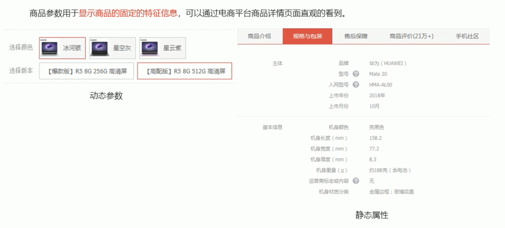
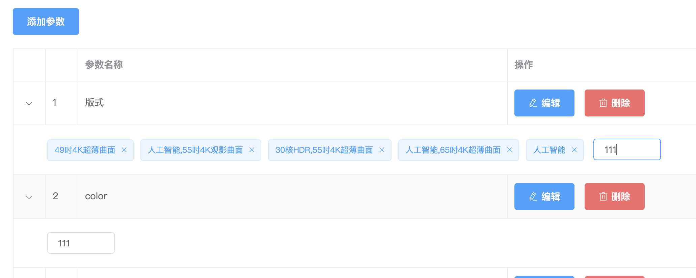

# 商品参数



## 新建组件params

```js
import Vue from 'vue'
import Router from 'vue-router'
import params from '@/components/params'

Vue.use(Router)

const router = new Router({
  routes: [
    {
      path: '/home',
      component: home,
      redirect: '/welcome',
      children: [
        {
          path: '/params',
          component: params
        },
      ]
    }
   
  ]
})
export default router
```

```html
<!--  -->
<template>
  <div>
    <el-breadcrumb separator=">">
      <el-breadcrumb-item :to="{ path: '/welcome' }">首页</el-breadcrumb-item>
      <el-breadcrumb-item :to="{ path: '/params' }">商品管理</el-breadcrumb-item>
      <el-breadcrumb-item>参数列表</el-breadcrumb-item>
    </el-breadcrumb>
    <el-card class="box-card">
        <el-alert :closable="false" title="注意，只能设置第三级分类相关参数" type="warning" show-icon></el-alert>
        
    </el-card>
  </div>
</template>

<script>
export default {
  data() {
    return {};
  },

  computed: {},

  methods: {}
};
</script>
<style lang='less' scoped>
.box-card {
  margin-top: 20px;
}
.el-table {
  margin-top: 20px;
}
</style>
```

## 获取商品分类数据

```html
<!--  -->
<template>
  <div>
    <el-breadcrumb separator=">">
      <el-breadcrumb-item :to="{ path: '/welcome' }">首页</el-breadcrumb-item>
      <el-breadcrumb-item :to="{ path: '/params' }">商品管理</el-breadcrumb-item>
      <el-breadcrumb-item>参数列表</el-breadcrumb-item>
    </el-breadcrumb>
    <el-card class="box-card">
      <el-alert :closable="false" title="注意，只能设置第三级分类相关参数" type="warning" show-icon></el-alert>
      <!-- 分类 -->
      <el-row class="row">
        <el-col>
          <span>选择商品分类：</span>
        </el-col>
      </el-row>
    </el-card>
  </div>
</template>

<script>
export default {
  data() {
    return {
        cateList:[]
    }
  },
  created() {
    this.getCategoriesList();
  },

  methods: {
    async getCategoriesList() {
      const { data: res } = await this.$http.get("categories");
      this.cateList = res.data;
    }
  }
};
</script>
<style lang='less' scoped>
.box-card {
  margin-top: 20px;
}
.el-table {
  margin-top: 20px;
}
.row {
  margin-top: 20px;
}
</style>
```

## 级联选择器

```html
<!--  -->
<template>
  <div>
    <el-breadcrumb separator=">">
      <el-breadcrumb-item :to="{ path: '/welcome' }">首页</el-breadcrumb-item>
      <el-breadcrumb-item :to="{ path: '/params' }">商品管理</el-breadcrumb-item>
      <el-breadcrumb-item>参数列表</el-breadcrumb-item>
    </el-breadcrumb>
    <el-card class="box-card">
      <el-alert :closable="false" title="注意，只能设置第三级分类相关参数" type="warning" show-icon></el-alert>
      <!-- 分类 -->
      <el-row class="row">
        <el-col>
          <span>选择商品分类：</span>
          <!-- options指定数据源 props用来指定配置对象   v-model="必须是数组"-->
          <el-cascader
            v-model="selectedKeys"
            :options="cateList"
            :props="casProps"
            @change="handleChange"
            clearable
            size="medium"
          ></el-cascader>
        </el-col>
      </el-row>
    </el-card>
  </div>
</template>

<script>
export default {
  data() {
    return {
      cateList: [],
      //   级联选择器配置对象
      casProps: {
        //   所选中的值
        value: "cat_id",
        //   指定你看见的值
        label: "cat_name",
        // 父子嵌套的属性
        children: "children",
        expandTrigger: "hover",
       
      },
      //   选择父级分类数组
      selectedKeys: []
    };
  },
  created() {
    this.getCategoriesList();
  },

  methods: {
    async getCategoriesList() {
      const { data: res } = await this.$http.get("categories");
      this.cateList = res.data;
    },
    // 级联选择项变化触发
    handleChange() {
      console.log(this.selectedKeys);
    }
  }
};
</script>
<style lang='less' scoped>
.box-card {
  margin-top: 20px;
}
.el-table {
  margin-top: 20px;
}
.row {
  margin-top: 20px;
}
.el-cascader{
    width: 300px;
}
</style>
```

## Tags标签页

```html
 <el-tabs v-model="activeName" @tab-click="handleClick">
    <el-tab-pane label="用户管理" name="first">用户管理</el-tab-pane>
    <el-tab-pane label="配置管理" name="second">配置管理</el-tab-pane>
    <el-tab-pane label="角色管理" name="third">角色管理</el-tab-pane>
    <el-tab-pane label="定时任务补偿" name="fourth">定时任务补偿</el-tab-pane>
  </el-tabs>


data() {
    return {
      //   默认tags 被激活的标签
      activeName: "first"
    };
```

改造

```html
<!-- tages -->
<el-tabs v-model="activeName" @tab-click="handleTagClick">
    <el-tab-pane label="动态参数" name="first">动态参数</el-tab-pane>
    <el-tab-pane label="静态属性" name="second">静态属性</el-tab-pane>
</el-tabs>
```


## 添加按钮

```html
<el-tabs v-model="activeName" @tab-click="handleTagClick">
    <el-tab-pane label="动态参数" name="first">
        <el-button type="primary" @click>添加参数</el-button>
    </el-tab-pane>
    <el-tab-pane label="静态属性" name="second">
        <el-button type="primary" @click>添加属性</el-button>
    </el-tab-pane>
</el-tabs>
```

## 禁用状态

- 当选中分类，才可点击按钮，否则禁用

- 输入数组的长度等于3（3是三级分类）是选中
- 通过计算属性控制
- 如果按钮需要被禁用返回true，否则返回false

```html
 <!-- tages -->
      <el-tabs v-model="activeName" @tab-click="handleTagClick">
        <el-tab-pane label="动态参数" name="first">
          <el-button :disabled="isBtnDisabled" type="primary" @click>添加参数</el-button>
        </el-tab-pane>
        <el-tab-pane label="静态属性" name="second">
          <el-button :disabled="isBtnDisabled" type="primary" @click>添加属性</el-button>
        </el-tab-pane>
      </el-tabs>
```

```js
 computed:{
       //   如果按钮需要被禁用返回true，否则返回false
      isBtnDisabled(){
          if(this.selectedKeys.length !==3){
              return true
          }
          return false
      }
  }
```

## 获取参数列表

- 获取当前选择的三级分类id

```js
computed:{
       //   如果按钮需要被禁用返回true，否则返回false
      isBtnDisabled(){
          if(this.selectedKeys.length !==3){
              return true
          }
          return false
      },
      getCateId(){
          if(this.selectedKeys.length ==3){
              return this.selectedKeys[2]
          }
          return null
      }
  }
```

- 更改name="many"

```html
<!-- tages -->
      <el-tabs v-model="activeName" @tab-click="handleTagClick">
        <el-tab-pane label="动态参数" name="many">
          <el-button :disabled="isBtnDisabled" type="primary" @click>添加参数</el-button>
        </el-tab-pane>
        <el-tab-pane label="静态属性" name="only">
          <el-button :disabled="isBtnDisabled" type="primary" @click>添加属性</el-button>
        </el-tab-pane>
      </el-tabs>
```

```js
// 级联选择项变化触发
    async handleChange() {
      console.log(this.selectedKeys);
      //   根据id和当前面板获取参数列表
      if (this.getCateId != null) {
        const { data: res } = await this.$http.get(
          `categories/${this.getCateId}/attributes`,
          {
            params: { sel: this.activeName }
          }
        );
        console.log(res.data);
      }
    },
```

- 问题：只有级联选择器发生变化，才能获取列表，点击tags切换的时候不能获取到数据。
- 更改：级联选择器和面板发生变化都发送请求
- 定义一个新的函数，在面板触发事件和级联选择器触发事件都调用这个函数

```js
  manyData:[],
  onlyData:[]


// 级联选择项变化触发
    handleChange() {
      console.log(this.selectedKeys);
      this.getParamsData();
    },
    handleTagClick() {
      this.getParamsData();
    },
     async getParamsData() {
      //   根据id和当前面板获取参数列表
      if (this.getCateId != null) {
        const { data: res } = await this.$http.get(
          `categories/${this.getCateId}/attributes`,
          {
            params: { sel: this.activeName }
          }
        );
        console.log(res.data);
        if(this.activeName === 'many'){
            this.manyData = res.data
        }else{
            this.onlyData = res.data
        }
      }
    }
```

## 列表渲染

```html
      <!-- tages -->
      <el-tabs v-model="activeName" @tab-click="handleTagClick">
        <el-tab-pane label="动态参数" name="many">
          <el-button :disabled="isBtnDisabled" type="primary" @click>添加参数</el-button>
          <!-- 动态参数 -->
          <el-table :data="manyData" border stripe>
            <el-table-column type="expand"></el-table-column>
            <el-table-column type="index"></el-table-column>
            <el-table-column prop="attr_name" label="参数名称"></el-table-column>
            <el-table-column label="操作">
              <template slot-scope="scope">
                <el-button type="primary" icon="el-icon-edit" @click>编辑</el-button>
                <el-button type="danger" icon="el-icon-delete" @click>删除</el-button>
              </template>
            </el-table-column>
          </el-table>
        </el-tab-pane>
        <el-tab-pane label="静态属性" name="only">
          <el-button :disabled="isBtnDisabled" type="primary" @click>添加属性</el-button>
           <el-table :data="onlyData" border stripe>
            <el-table-column type="expand"></el-table-column>
            <el-table-column type="index"></el-table-column>
            <el-table-column prop="attr_name" label="属性名称"></el-table-column>
            <el-table-column label="操作">
              <template slot-scope="scope">
                <el-button type="primary" icon="el-icon-edit" @click>编辑</el-button>
                <el-button type="danger" icon="el-icon-delete" @click>删除</el-button>
              </template>
            </el-table-column>
          </el-table>
        </el-tab-pane>
      </el-tabs>
```

- 之后选择分类，可以看见效果

## 添加属性和参数

- 由于对话框效果一直，我们可以共用一个

```html
<el-button :disabled="isBtnDisabled" type="primary" @click='addDataBtn'>添加参数</el-button>

<el-button :disabled="isBtnDisabled" type="primary" @click='addDataBtn'>添加属性</el-button>

<!-- 共用对话框 -->
    <el-dialog
        :title="'添加'+getTitle"
        :visible.sync="addDialog"
        width="50%"
        @close="closeAddDialog">
        
        <span slot="footer">
            <el-button @click="addDialog = false">取 消</el-button>
            <el-button type="primary" @click="">确 定</el-button>
        </span>
    </el-dialog>


addDialog : false
// 点击添加弹出对话框
addDataBtn(){
	this.addDialog = true
}
```

- 关闭情况表单

```js
 //   添加参数表单
      addForm: {
        attr_name: ""
      } 

closeAddDialog() {
      this.$refs.addFormRef.resetFields();
    }
```

```html
 <!-- 共用对话框 -->
    <el-dialog :title="'添加'+getTitle" :visible.sync="addDialog" width="30%" @close="closeAddDialog">
      <!-- form -->
      <el-form :model="addForm"  ref="addFormRef" label-width="80px">
        <el-form-item :label="getTitle" prop="attr_name">
          <el-input v-model="addForm.attr_name"></el-input>
        </el-form-item>
      </el-form>

      <span slot="footer">
        <el-button @click="addDialog = false">取 消</el-button>
        <el-button type="primary" @click>确 定</el-button>
      </span>
    </el-dialog>
```

- 添加

```html
 <!-- 共用对话框 -->
    <el-dialog :title="'添加'+getTitle" :visible.sync="addDialog" width="30%" @close="closeAddDialog">
      <!-- form -->
      <el-form :model="addForm" ref="addFormRef" label-width="80px">
        <el-form-item :label="getTitle" prop="attr_name">
          <el-input v-model="addForm.attr_name"></el-input>
        </el-form-item>
      </el-form>

      <span slot="footer">
        <el-button @click="addDialog = false">取 消</el-button>
        <el-button type="primary" @click="addParams">确 定</el-button>
      </span>
    </el-dialog>


// 添加
    addParams() {
      this.$refs.addFormRef.validate(async vail => {
        if (!vail) return;
        const { data: res } = await this.$http.post(
          `categories/${this.getCateId}/attributes`,
          {
            attr_name: this.addForm.attr_name,
            attr_sel: this.activeName
          }
        );
        if (res.meta.status !== 201) {
          return this.$message.error("添加参数失败");
        }
        this.$message.success("添加参数成功");
        this.addDialog = false;
        this.getParamsData();
      });
    }
```

## 修改功能

- 弹出对话框

```js
    showEditDialog(id, index) {
      console.log(index);
      console.log(this.manyData);
      if (this.activeName === "many") {
        this.editForm.attr_name = this.manyData[index].attr_name;
      } else {
        this.editForm.attr_name = this.onlyData[index].attr_name;
      }
      this.editDialog = true;
    },
```

```html
 <el-button
                  type="primary"
                  icon="el-icon-edit"
                  @click="showEditDialog(scope.row.attr_id,scope.$index)"
                >编辑</el-button>


  <!-- 修改共用对话框 -->
    <el-dialog
      :title="'修改'+getTitle"
      :visible.sync="editDialog"
      width="30%"
      @close="closeEditDialog"
    >
      <!-- form -->
      <el-form :model="editForm" ref="editFormRef" label-width="80px">
        <el-form-item :label="getTitle" prop="attr_name">
          <el-input v-model="editForm.attr_name"></el-input>
        </el-form-item>
      </el-form>

      <span slot="footer">
        <el-button @click="editDialog = false">取 消</el-button>
        <el-button type="primary" @click="editParams">确 定</el-button>
      </span>
    </el-dialog>
```

- 提交

```js
// 修改参数
    editParams() {
      this.$refs.editFormRef.validate(async vail => {
        if (!vail) return;
        const { data: res } = await this.$http.put(
          `categories/${this.getCateId}/attributes/${this.editForm.attr_id}`,
          {
            attr_name: this.editForm.attr_name,
            attr_sel: this.activeName
          }
        );
        console.log(res);

        if (res.meta.status !== 200) {
          return this.$message.error("修改参数失败");
        }
        this.$message.success("添加参数成功");
        this.getParamsData();
        this.editDialog = false;
      });


showEditDialog(id, index) {
      console.log(index);
      console.log(this.manyData);
      if (this.activeName === "many") {
        this.editForm.attr_name = this.manyData[index].attr_name;
        this.editForm.attr_id = this.manyData[index].attr_id;
      } else {
        this.editForm.attr_name = this.onlyData[index].attr_name;
        this.editForm.attr_id = this.onlyData[index].attr_id;
      }
      this.editDialog = true;
    },
```

## 删除

```js
// 删除
    async del(id) {
      const confirmRes = await this.$confirm(
        "此操作将永久删除该参数, 是否继续?",
        "提示",
        {
          confirmButtonText: "确定",
          cancelButtonText: "取消",
          type: "warning"
        }
      ).catch(err => err);

      if(confirmRes!='confirm'){
           return this.$message.info("取消删除");
      }
     const {data:res} = await  this.$http.delete(`categories/${this.getCateId}/attributes/${id}`)
     if(res.meta.status!=200){
           return this.$message.error("删除失败");
      }
      this.$message.success("删除成功");
      this.getParamsData()
    }
```

## 展开项

- 修改getParamsData()，因为得到attr_vals是个字符串，用空格分割
- 分割后就是我们要的数据

```js
  async getParamsData() {
      //   根据id和当前面板获取参数列表
      if (this.getCateId != null) {
        const { data: res } = await this.$http.get(
          `categories/${this.getCateId}/attributes`,
          {
            params: { sel: this.activeName }
          }
        );
        console.log(res.data);
        // 循环attr_vals  分割字符串,重新赋值 变成数组
        res.data.forEach(item=>{
            item.attr_vals = item.attr_vals.split(' ')
        })

        if (this.activeName === "many") {
          this.manyData = res.data;
        } else {
          this.onlyData = res.data;
        }
      }
    },
```

- 渲染

```html
 <!-- 动态参数 -->
          <el-table :data="manyData" border stripe>
            <!-- 展开项 -->
            <el-table-column type="expand">
              <template slot-scope="scope">
                <el-tag closable v-for="(item,i) in scope.row.attr_vals" :key="i">
                    {{item}}
                </el-tag>
              </template>
            </el-table-column>
            <el-table-column type="index"></el-table-column>
            <el-table-column prop="attr_name" label="参数名称"></el-table-column>
            <el-table-column label="操作">
              <template slot-scope="scope">
                <el-button
                  type="primary"
                  icon="el-icon-edit"
                  @click="showEditDialog(scope.row.attr_id,scope.$index)"
                >编辑</el-button>
                <el-button type="danger" icon="el-icon-delete" @click="del(scope.row.attr_id)">删除</el-button>
              </template>
            </el-table-column>
          </el-table>
```

- 小bug解决

```js
item.attr_vals = item.attr_vals==""? item.attr_vals=[]: item.attr_vals.split(" ");
```

## 添加标签

```html
<el-tag
  :key="tag"
  v-for="tag in dynamicTags"
  closable
  :disable-transitions="false"
  @close="handleClose(tag)">
  {{tag}}
</el-tag>
<el-input
  class="input-new-tag"
  v-if="inputVisible"
  v-model="inputValue"
  ref="saveTagInput"
  size="small"
  @keyup.enter.native="handleInputConfirm"
  @blur="handleInputConfirm"
>
</el-input>
<el-button v-else class="button-new-tag" size="small" @click="showInput">+ New Tag</el-button>
```

```js
//   控制按钮与文本框的形式
inputVisible: false,
    //   文本框中输入的内容
inputValue: ""
handleInputConfirm(){

},
showInput(){
   this.inputVisible = true
}
```

两个联动了，应该分别控制，y因为共用了inputVisible，inputValue



```js
 async getParamsData() {
      //   根据id和当前面板获取参数列表
      if (this.getCateId != null) {
        const { data: res } = await this.$http.get(
          `categories/${this.getCateId}/attributes`,
          {
            params: { sel: this.activeName }
          }
        );
        console.log(res.data);
        // 循环attr_vals  分割字符串,重新赋值 变成数组
        res.data.forEach(item => {
          item.attr_vals =
            item.attr_vals == ""
              ? (item.attr_vals = [])
              : item.attr_vals.split(" ");
           //   控制按钮与文本框的形式
          item.inputVisible=false;
          //   文本框中输入的内容
          item.inputValue="";
        });

        if (this.activeName === "many") {
          this.manyData = res.data;
        } else {
          this.onlyData = res.data;
        }
      }
    },
showInput(row) {
      row.inputVisible = true;
}        
        
<el-input
    class="input-new-tag"
    v-if="scope.row.inputVisible"
    v-model="scope.row.inputValue"
    ref="saveTagInput"
    size="small"
    @keyup.enter.native="handleInputConfirm"
    @blur="handleInputConfirm"
></el-input>

并且把data里的inputVisible，inputValue删除
```

保证每一个都有自己的inputVisible，inputValue

- 点击后自动获取焦点

```js
this.$nextTick(_ => {
    this.$refs.saveTagInput.$refs.input.focus();
});
```

- 按钮切换

```js
@keyup.enter.native="handleInputConfirm(scope.row)"
@blur="handleInputConfirm(scope.row)"

handleInputConfirm(row) {
    if (row.inputValue.trim().length == 0) {
        row.inputValue = "";
        row.inputVisible = false;
        return
    }
    row.attr_vals.push(row.inputValue.trim())
    row.inputValue = "";
    row.inputVisible = false;
},
```

- 保存到数据库

```js
async handleInputConfirm(row) {
      // 如果输入空格
      if (row.inputValue.trim().length == 0) {
        row.inputValue = "";
        row.inputVisible = false;
        return;
      }
      row.attr_vals.push(row.inputValue.trim());
      row.inputValue = "";
      row.inputVisible = false;
      //   保存数据库
      const { data: res } = await this.$http.put(
        `categories/${this.getCateId}/attributes/${row.attr_id}`,
        {
          attr_name: row.attr_name,
          attr_sel: row.attr_sel,
          // 字符串变成数组
          attr_vals: row.attr_vals.join(" ")
        }
      );
      console.log(res);
      
       if (res.meta.status !== 200) {
          return this.$message.error("添加参数项失败");
        }
        this.$message.success("添加参数项成功");
    },
```

## 删除标签

```html
 <el-tag @close="delTag(i)" closable v-for="(item,i) in scope.row.attr_vals" :key="i">{{item}}</el-tag>
```

```js
async delTag(index, row) {
    // 从attr_vals中删除
    row.attr_vals.splice(index, 1);
    //   保存数据库
    const { data: res } = await this.$http.put(
        `categories/${this.getCateId}/attributes/${row.attr_id}`,
        {
            attr_name: row.attr_name,
            attr_sel: row.attr_sel,
            // 字符串变成数组
            attr_vals: row.attr_vals.join(" ")
        }
    );
    console.log(res);

    if (res.meta.status !== 200) {
        return this.$message.error("删除参数项失败");
    }
    this.$message.success("删除参数项成功");
}
},
```

## 级联菜单不是三级的时候或者清空数据的时候，数据应不显示

修改handleChange

```js
// 级联选择项变化触发
    handleChange() {
      console.log(this.selectedKeys);
      if(this.selectedKeys.length!==3){
          this.selectedKeys = []
          this.manyData = []
          this.onlyData = []
          return
      }
      this.getParamsData();
    },
```

## 静态属性

复制之前的动态参数表格里的展开行

```html
<!--  -->
<template>
  <div>
    <el-breadcrumb separator=">">
      <el-breadcrumb-item :to="{ path: '/welcome' }">首页</el-breadcrumb-item>
      <el-breadcrumb-item :to="{ path: '/params' }">商品管理</el-breadcrumb-item>
      <el-breadcrumb-item>参数列表</el-breadcrumb-item>
    </el-breadcrumb>
    <el-card class="box-card">
      <el-alert :closable="false" title="注意，只能设置第三级分类相关参数" type="warning" show-icon></el-alert>
      <!-- 分类 -->
      <el-row class="row">
        <el-col>
          <span>选择商品分类：</span>
          <!-- options指定数据源 props用来指定配置对象   v-model="必须是数组"-->
          <el-cascader
            v-model="selectedKeys"
            :options="cateList"
            :props="casProps"
            @change="handleChange"
            clearable
            size="medium"
          ></el-cascader>
        </el-col>
      </el-row>

      <!-- tages -->
      <el-tabs v-model="activeName" @tab-click="handleTagClick">
        <el-tab-pane label="动态参数" name="many">
          <el-button :disabled="isBtnDisabled" type="primary" @click="addDataBtn">添加参数</el-button>
          <!-- 动态参数 -->
          <el-table :data="manyData" border stripe>
            <!-- 展开项 -->
            <el-table-column type="expand">
              <template slot-scope="scope">
                <el-tag
                  @close="delTag(i,scope.row)"
                  closable
                  v-for="(item,i) in scope.row.attr_vals"
                  :key="i"
                >{{item}}</el-tag>
                <el-input
                  class="input-new-tag"
                  v-if="scope.row.inputVisible"
                  v-model="scope.row.inputValue"
                  ref="saveTagInput"
                  size="small"
                  @keyup.enter.native="handleInputConfirm(scope.row)"
                  @blur="handleInputConfirm(scope.row)"
                ></el-input>
                <el-button
                  v-else
                  class="button-new-tag"
                  size="small"
                  @click="showInput(scope.row)"
                >+ New Tag</el-button>
              </template>
            </el-table-column>
            <el-table-column type="index"></el-table-column>
            <el-table-column prop="attr_name" label="参数名称"></el-table-column>
            <el-table-column label="操作">
              <template slot-scope="scope">
                <el-button
                  type="primary"
                  icon="el-icon-edit"
                  @click="showEditDialog(scope.row.attr_id,scope.$index)"
                >编辑</el-button>
                <el-button type="danger" icon="el-icon-delete" @click="del(scope.row.attr_id)">删除</el-button>
              </template>
            </el-table-column>
          </el-table>
        </el-tab-pane>
        <el-tab-pane label="静态属性" name="only">
          <el-button :disabled="isBtnDisabled" type="primary" @click="addDataBtn">添加属性</el-button>
          <el-table :data="onlyData" border stripe>
                 <!-- 展开项 -->
            <el-table-column type="expand">
              <template slot-scope="scope">
                <el-tag
                  @close="delTag(i,scope.row)"
                  closable
                  v-for="(item,i) in scope.row.attr_vals"
                  :key="i"
                >{{item}}</el-tag>
                <el-input
                  class="input-new-tag"
                  v-if="scope.row.inputVisible"
                  v-model="scope.row.inputValue"
                  ref="saveTagInput"
                  size="small"
                  @keyup.enter.native="handleInputConfirm(scope.row)"
                  @blur="handleInputConfirm(scope.row)"
                ></el-input>
                <el-button
                  v-else
                  class="button-new-tag"
                  size="small"
                  @click="showInput(scope.row)"
                >+ New Tag</el-button>
              </template>
            </el-table-column>
            <el-table-column type="index"></el-table-column>
            <el-table-column prop="attr_name" label="属性名称"></el-table-column>
            <el-table-column label="操作">
              <template slot-scope="scope">
                <el-button
                  type="primary"
                  icon="el-icon-edit"
                  @click="showEditDialog(scope.row.attr_id,scope.$index)"
                >编辑</el-button>
                <el-button type="danger" icon="el-icon-delete" @click="del(scope.row.attr_id)">删除</el-button>
              </template>
            </el-table-column>
          </el-table>
        </el-tab-pane>
      </el-tabs>
    </el-card>

    <!-- 添加共用对话框 -->
    <el-dialog :title="'添加'+getTitle" :visible.sync="addDialog" width="30%" @close="closeAddDialog">
      <!-- form -->
      <el-form :model="addForm" ref="addFormRef" label-width="80px">
        <el-form-item :label="getTitle" prop="attr_name">
          <el-input v-model="addForm.attr_name"></el-input>
        </el-form-item>
      </el-form>

      <span slot="footer">
        <el-button @click="addDialog = false">取 消</el-button>
        <el-button type="primary" @click="addParams">确 定</el-button>
      </span>
    </el-dialog>

    <!-- 修改共用对话框 -->
    <el-dialog
      :title="'修改'+getTitle"
      :visible.sync="editDialog"
      width="30%"
      @close="closeEditDialog"
    >
      <!-- form -->
      <el-form :model="editForm" ref="editFormRef" label-width="80px">
        <el-form-item :label="getTitle" prop="attr_name">
          <el-input v-model="editForm.attr_name"></el-input>
        </el-form-item>
      </el-form>

      <span slot="footer">
        <el-button @click="editDialog = false">取 消</el-button>
        <el-button type="primary" @click="editParams">确 定</el-button>
      </span>
    </el-dialog>
  </div>
</template>

<script>
export default {
  data() {
    return {
      cateList: [],
      //   级联选择器配置对象
      casProps: {
        //   所选中的值
        value: "cat_id",
        //   指定你看见的值
        label: "cat_name",
        // 父子嵌套的属性
        children: "children",
        expandTrigger: "hover"
      },
      //   选择父级分类数组
      selectedKeys: [],
      //   默认tags 被激活的标签
      activeName: "many",
      manyData: [],
      onlyData: [],
      addDialog: false,
      //   添加参数表单
      addForm: {
        attr_name: ""
      },
      //   修改
      editDialog: false,
      editForm: {
        attr_name: "",
        attr_id: ""
      }
    };
  },
  created() {
    this.getCategoriesList();
  },

  methods: {
    async getCategoriesList() {
      const { data: res } = await this.$http.get("categories");
      this.cateList = res.data;
    },
    // 级联选择项变化触发
    handleChange() {
      console.log(this.selectedKeys);
      if(this.selectedKeys.length!==3){
          this.selectedKeys = []
          this.manyData = []
          this.onlyData = []
          return
      }
      this.getParamsData();
    },
    handleTagClick() {
      this.getParamsData();
    },
    async getParamsData() {
      //   根据id和当前面板获取参数列表
      if (this.getCateId != null) {
        const { data: res } = await this.$http.get(
          `categories/${this.getCateId}/attributes`,
          {
            params: { sel: this.activeName }
          }
        );
        console.log(res.data);
        // 循环attr_vals  分割字符串,重新赋值 变成数组
        res.data.forEach(item => {
          item.attr_vals =
            item.attr_vals == ""
              ? (item.attr_vals = [])
              : item.attr_vals.split(" ");
          //   控制按钮与文本框的形式
          item.inputVisible = false;
          //   文本框中输入的内容
          item.inputValue = "";
        });

        if (this.activeName === "many") {
          this.manyData = res.data;
        } else {
          this.onlyData = res.data;
        }
      }
    },
    // 点击添加弹出对话框
    addDataBtn() {
      this.addDialog = true;
    },
    closeAddDialog() {
      this.$refs.addFormRef.resetFields();
    },
    // 添加
    addParams() {
      this.$refs.addFormRef.validate(async vail => {
        if (!vail) return;
        const { data: res } = await this.$http.post(
          `categories/${this.getCateId}/attributes`,
          {
            attr_name: this.addForm.attr_name,
            attr_sel: this.activeName
          }
        );
        if (res.meta.status !== 201) {
          return this.$message.error("添加参数失败");
        }
        this.$message.success("添加参数成功");
        this.addDialog = false;
        this.getParamsData();
      });
    },
    showEditDialog(id, index) {
      console.log(index);
      console.log(this.manyData);
      if (this.activeName === "many") {
        this.editForm.attr_name = this.manyData[index].attr_name;
        this.editForm.attr_id = this.manyData[index].attr_id;
      } else {
        this.editForm.attr_name = this.onlyData[index].attr_name;
        this.editForm.attr_id = this.onlyData[index].attr_id;
      }
      this.editDialog = true;
    },
    closeEditDialog() {
      this.$refs.editFormRef.resetFields();
    },
    // 修改参数
    editParams() {
      this.$refs.editFormRef.validate(async vail => {
        if (!vail) return;
        const { data: res } = await this.$http.put(
          `categories/${this.getCateId}/attributes/${this.editForm.attr_id}`,
          {
            attr_name: this.editForm.attr_name,
            attr_sel: this.activeName
          }
        );
        console.log(res);

        if (res.meta.status !== 200) {
          return this.$message.error("修改参数失败");
        }
        this.$message.success("添加参数成功");
        this.getParamsData();
        this.editDialog = false;
      });
    },
    // 删除
    async del(id) {
      const confirmRes = await this.$confirm(
        "此操作将永久删除该参数, 是否继续?",
        "提示",
        {
          confirmButtonText: "确定",
          cancelButtonText: "取消",
          type: "warning"
        }
      ).catch(err => err);

      if (confirmRes != "confirm") {
        return this.$message.info("取消删除");
      }
      const { data: res } = await this.$http.delete(
        `categories/${this.getCateId}/attributes/${id}`
      );
      if (res.meta.status != 200) {
        return this.$message.error("删除失败");
      }
      this.$message.success("删除成功");
      this.getParamsData();
    },
    async handleInputConfirm(row) {
      // 如果输入空格
      if (row.inputValue.trim().length == 0) {
        row.inputValue = "";
        row.inputVisible = false;
        return;
      }
      row.attr_vals.push(row.inputValue.trim());
      row.inputValue = "";
      row.inputVisible = false;
      //   保存数据库
      const { data: res } = await this.$http.put(
        `categories/${this.getCateId}/attributes/${row.attr_id}`,
        {
          attr_name: row.attr_name,
          attr_sel: row.attr_sel,
          // 字符串变成数组
          attr_vals: row.attr_vals.join(" ")
        }
      );
      console.log(res);

      if (res.meta.status !== 200) {
        return this.$message.error("添加参数项失败");
      }
      this.$message.success("添加参数项成功");
    },
    showInput(row) {
      row.inputVisible = true;
      this.$nextTick(_ => {
        this.$refs.saveTagInput.$refs.input.focus();
      });
    },
    async delTag(index, row) {
      // 从attr_vals中删除
      row.attr_vals.splice(index, 1);
      //   保存数据库
      const { data: res } = await this.$http.put(
        `categories/${this.getCateId}/attributes/${row.attr_id}`,
        {
          attr_name: row.attr_name,
          attr_sel: row.attr_sel,
          // 字符串变成数组
          attr_vals: row.attr_vals.join(" ")
        }
      );
      console.log(res);

      if (res.meta.status !== 200) {
        return this.$message.error("删除参数项失败");
      }
      this.$message.success("删除参数项成功");
    }
  },
  computed: {
    //   如果按钮需要被禁用返回true，否则返回false
    isBtnDisabled() {
      if (this.selectedKeys.length !== 3) {
        return true;
      }
      return false;
    },
    getCateId() {
      if (this.selectedKeys.length === 3) {
        return this.selectedKeys[2];
      }
      return null;
    },
    // 动态获取对画框title
    getTitle() {
      if (this.activeName === "many") {
        return "动态参数";
      } else {
        return "静态属性";
      }
    }
  }
};
</script>
<style lang='less' scoped>
.box-card {
  margin-top: 20px;
}
.el-table {
  margin-top: 20px;
}
.row {
  margin-top: 20px;
}
.el-cascader {
  width: 300px;
}
.el-tabs {
  margin-top: 20px;
}
.el-tag {
  margin-right: 10px;
}
.input-new-tag {
  width: 100px;
}
</style>
```

