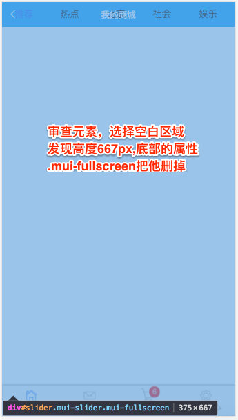
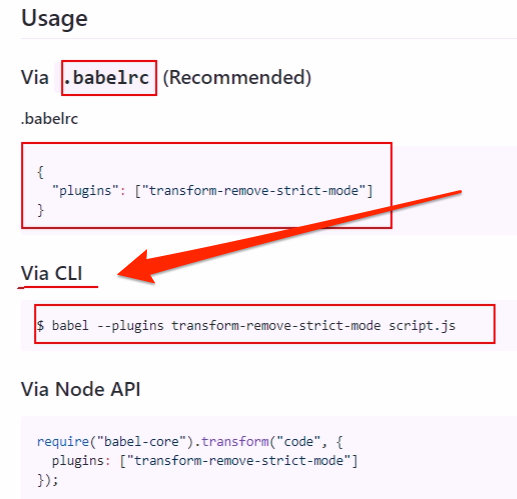
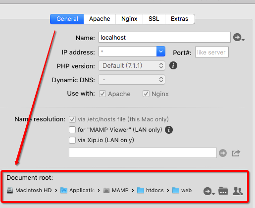
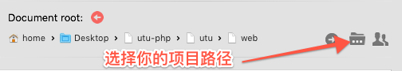
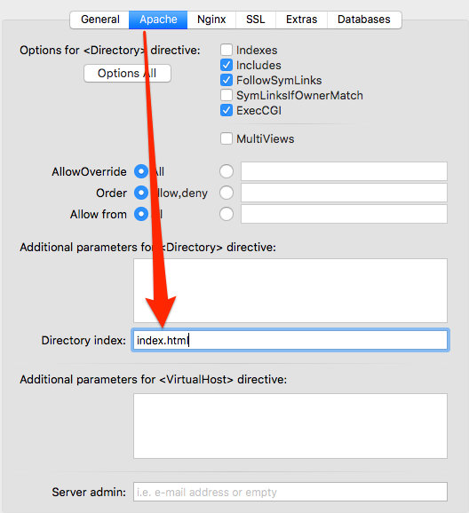
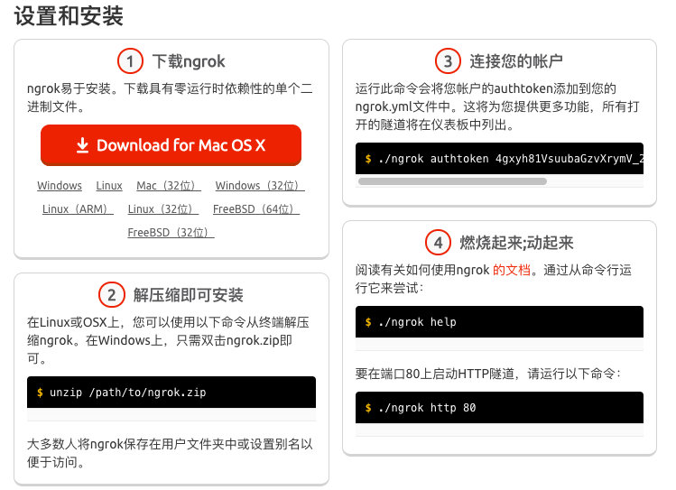
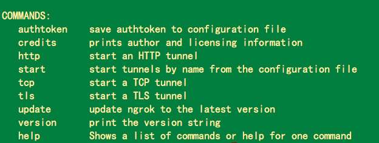
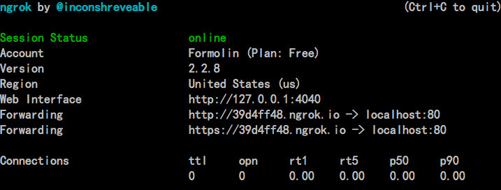
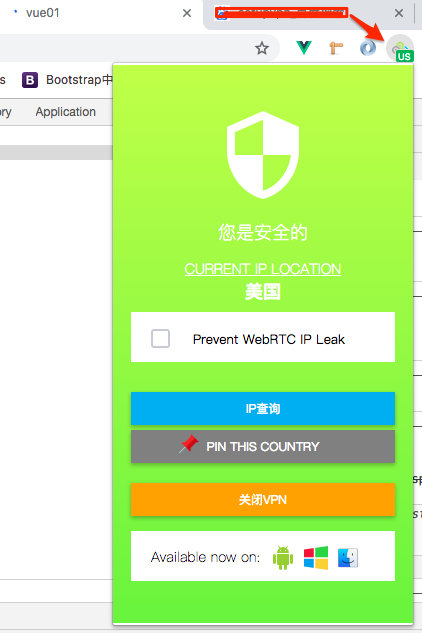

# 一、商品选中按钮

根据store中的selected的属性开和关

官方api中有v-model="value"的属性，和change事件

```html
<mt-switch v-model="item.selected"></mt-switch>
```

那么，怎么存储开关的状态到store中？修改通过mutations实现

```html
<mt-switch v-model="item.selected" @change="changedSelected(item.id,item.selected)"></mt-switch>
```

```js
changedSelected(id,val){
        console.log(id+'----'+val)
        this.$store.commit('updateCartSelectedChange',{id,selected:val})
    }
```

```js
updateCartSelectedChange(state,obj){
      state.cart.some(item=>{
        if(item.id == obj.id){
          item.selected = obj.selected
        }
      })
      localStorage.setItem('cart',JSON.stringify(state.cart))
    }
```

# 二、结算区

### 1、布局+样式

```html
<template>
  <div class="cart">
    <mt-header fixed title="购物车">
      <router-link to="/home/product" slot="left">
        <mt-button icon="back">返回</mt-button>
      </router-link>
      <mt-button icon="more" slot="right"></mt-button>
    </mt-header>
    <div class="carlist">
      <!-- 购物车数据 -->
      <div class="mui-card" v-for="item in $store.state.cart" :key="item.id">
        <div class="mui-card-content">
          <div class="mui-card-content-inner">
            <mt-switch v-model="item.selected" @change="changedSelected(item.id,item.selected)"></mt-switch>

            
            <div class="info">
              <h1 style="margin-left:10px">xx商品</h1>
              <p class="box">
                <span class="price">￥{{$store.getters.sumPrice}}</span>
                <numberbox :num="item.count" :id="item.id" />
                <a href="#" @click.prevent="del(item.id)">删除</a>
              </p>
            </div>
          </div>
        </div>
      </div>
    </div>

    <!-- 结算区域 -->
    <div class="mui-card">
      <div class="mui-card-content">
        <div class="mui-card-content-inner pay">
          <div class="left">
            <p>总计（不含运费）</p>
            <p>
              已勾选商品
              <span>0</span> 件，总价
              <span>￥0</span>
            </p>
          </div>
          <mt-button type="danger">去结算</mt-button>
        </div>
      </div>
    </div>
      
      
  </div>
</template>

<script>
import numberbox from "./numberbox";
export default {
  data() {
    return {
      carList: []
    };
  },
  methods: {
    del(id) {
      this.$store.commit("del", id);
    },
    changedSelected(id, val) {
      console.log(id + "----" + val);
      this.$store.commit("updateCartSelectedChange", { id, selected: val });
    }
  },
  components: {
    numberbox
  }
};
</script>

<style lang="less" scoped>
.cart {
  background-color: #eee;
  overflow: hidden;
  .carlist {
    img {
      width: 60px;
      height: 60px;
    }
    h1 {
      font-size: 14px;
    }
    .info {
      .price {
        color: red;
        font-weight: bold;
        width: 50px;
      }
    }
    .mui-card-content-inner {
      display: flex;
      align-items: center;
    }
    .box {
      display: flex;
      align-items: center;
      span {
        margin-right: 20px;
      }
      a {
        margin-left: 15px;
      }
    }
  }

  .pay {
    display: flex;
    justify-content: space-between;
    align-items: center;
    .mint-button-text {
      line-height: 10px;
    }
    .left {
      span {
        color: red;
        font-weight: bold;
        font-size: 16px;
      }
    }
  }
}
</style>
```

### 2、结算数据

结算数据的获取->通过定义getters的一个方法，循环判断，selected为true把价格相加

```js
//getters
getCartCountAndAmount(state){
      var o = {
        count:0,//勾选数量
        amount:0//勾选的总价
      }
      state.cart.forEach(item=>{
        if(item.selected){
          o.count +=item.count
          o.amount+=item.price*item.count
        }
      })
      return o
    },
```

```html
<!-- 结算区域 -->
    <div class="mui-card">
      <div class="mui-card-content">
        <div class="mui-card-content-inner pay">
          <div class="left">
            <p>总计（不含运费）</p>
            <p>已勾选商品 <span>{{$store.getters.getCartCountAndAmount.count}}</span> 件，总价 <span>￥{{$store.getters.getCartCountAndAmount.amount}}</span></p>
          </div>
          <mt-button type="danger">去结算</mt-button>
        </div>
      </div>
    </div>
```

# 三、添加图片分享

- 新建组件imageshare

```vue
<!--  -->
<template>
  <div>
    <mt-header fixed title="图片分享">
      <router-link to="/home/product" slot="left">
        <mt-button icon="back">返回</mt-button>
      </router-link>
      <mt-button icon="more" slot="right"></mt-button>
    </mt-header>
  </div>
</template>

<script>
export default {
  data() {
    return {};
  }
};
</script>
<style lang='less' scoped>
</style>
```

- 改造路由

  ```html
  <li class="mui-table-view-cell mui-media mui-col-xs-4 mui-col-sm-3">
      <router-link to="/home/imageshare">
          
          <div class="mui-media-body">图片分享</div>
      </router-link>
  </li>
  ```

  ```js
  import imageshare from './components/home/imageshare.vue'
  { path: '/home/imageshare', component: imageshare },
  ```

- 组件页面布局

  - 顶部滑动条

    - mui中的tab-top-webview-main.html

      ```html
      <div id="slider" class="mui-slider mui-fullscreen">
          <div id="sliderSegmentedControl" class="mui-scroll-wrapper mui-slider-indicator mui-segmented-control mui-segmented-control-inverted">
              <div class="mui-scroll">
                  <a class="mui-control-item mui-active" href="#item1mobile" data-wid="tab-top-subpage-1.html">
                      推荐
                  </a>
                  <a class="mui-control-item" href="#item2mobile" data-wid="tab-top-subpage-2.html">
                      热点
                  </a>
                  <a class="mui-control-item" href="#item3mobile" data-wid="tab-top-subpage-3.html">
                      北京
                  </a>
                  <a class="mui-control-item" href="#item4mobile" data-wid="tab-top-subpage-4.html">
                      社会
                  </a>
                  <a class="mui-control-item" href="#item5mobile" data-wid="tab-top-subpage-5.html">
                      娱乐
                  </a>
                      <a class="mui-control-item" href="#item5mobile" data-wid="tab-top-subpage-5.html">
                      娱乐
                  </a>
                      <a class="mui-control-item" href="#item5mobile" data-wid="tab-top-subpage-5.html">
                      娱乐
                  </a>
                      <a class="mui-control-item" href="#item5mobile" data-wid="tab-top-subpage-5.html">
                      娱乐
                  </a>
              </div>
          </div>
      
      </div>
      ```

    - 发现样式不对

    - 

    - 发现不能滑动，因为这属于js的效果，需要引用

    - 区域滚动组件默认为absolute定位，全屏显示；在实际使用过程中，需要手动设置滚动区域的位置（top和height）

    - 若使用区域滚动组件，需手动初始化scroll控件

    - 常用配置项:scroll.options

      ```js
      options = {
       scrollY: true, //是否竖向滚动
       scrollX: false, //是否横向滚动
       startX: 0, //初始化时滚动至x
       startY: 0, //初始化时滚动至y
       indicators: true, //是否显示滚动条
       deceleration:0.0006, //阻尼系数,系数越小滑动越灵敏
       bounce: true //是否启用回弹
      }
      
      示例：初始化scroll控件：
      mui('.mui-scroll-wrapper').scroll({
      	deceleration: 0.0005 //flick 减速系数，系数越大，滚动速度越慢，滚动距离越小，默认值0.0006
      });
      ```

      ```js
      <script>
      import mui from "../../static/mui-master/dist/js/mui.min.js";
      export default {
        data() {
          return {};
        },
        mounted() {
          mui(".mui-scroll-wrapper").scroll({
            deceleration: 0.0005 //flick 减速系数，系数越大，滚动速度越慢，滚动距离越小，默认值0.0006
          });
        }
      };
      </script>
      ```


  #### 附：

  如果出现caller,callee不被允许的错误信息，是因为在严格模式下不允许，因为语法不严谨

  - 那么导入的mui-js可能用到caller等，webpack打包好的bundle.js中，默认是启用严格模式的，所以两者冲突了

  - 解决方案

    - 把mui.js中的非严格模式的代码改掉，但是不现实

    - 把webpack打包的严格模式禁用

      - babel-plugin-transform-remove-strict-mode这个插件

      - npm i babel-plugin-transform-remove-strict-mode

        

    - 解决警告问题

      ```css
      *{touch-action:pay-y;}
      ```

    - 如果底部tabbar栏切换不了
      - 还是因为mui.js
      - 找到tabbar这个组件，mui-tab-item改变这个类名，那么样式就没有了，但是可以切换了
      - 简单办法，先审查元素，把mui-tab-item有关的样式都保存一份，之后新建一个样式，使用就可以了

  ```html
  <div id="slider" class="mui-slider">
        <div
          id="sliderSegmentedControl"
          class="mui-scroll-wrapper mui-slider-indicator mui-segmented-control mui-segmented-control-inverted"
        >
          <div class="mui-scroll">
            <a href="#" :class="['mui-control-item',item.id==0?'mui-active':'']" v-for="item in cates" :key="item.id">
                {{item.title}}
            </a>
          </div>
        </div>
      </div>
  ```

  

# 四、图片列表-懒加载技术（mint-ui提供的现成的lazy-load）

### 1、后台模拟数据

```js
var Mock = require('mockjs');
module.exports = (req, res) => {
    var data = Mock.mock({
        'imagesShare|5-10': [
            {
                'id|+1': 0,
                img: '@image(842x242,@color,@character)'
            }
        ],
        'cate|6': [
            {
                'id|+1': 0,
                title: '@city'
            }
        ]
    })
    res.send(data);
};
```

```vue
<script>
import mui from "../../../static/mui-master/dist/js/mui.js";
export default {
  data() {
    return {
      imgList: [],
      cates:[]
    };
  },
  methods: {
    async getImagesShare() {
      let { data } = await this.$http.get("/imgs");
      this.imgList = data.imagesShare;
      this.cates = data.cate
      console.log(data.imagesShare);
      console.log(data.cate);
    }
  },
  created() {
    this.getImagesShare();
  },
  mounted() {
    mui(".mui-scroll-wrapper").scroll({
      deceleration: 0.0005 //flick 减速系数，系数越大，滚动速度越慢，滚动距离越小，默认值0.0006
    });
  }
};
</script>
<style lang='less' scoped>
</style>
```

### 2、图片渲染

```html
<!-- 图片列表区域 -->
<ul>
    <li v-for="item in imgList" :key="item.id">
        
    </li>
</ul>
```

### 3、加载的样式

```css
img[lazy="loading"] {
  width: 40px;
  height: 300px;
  margin: auto;
}
```

### 4、完成

```html
<template>
  <div class="imageshare">
    <mt-header fixed title="新闻资讯">
      <router-link to="/" slot="left">
        <mt-button icon="back">返回</mt-button>
      </router-link>
      <mt-button icon="more" slot="right"></mt-button>
    </mt-header>
    <!-- 顶部滚动条区域 -->
    <div id="slider" class="mui-slider">
      <div
        id="sliderSegmentedControl"
        class="mui-scroll-wrapper mui-slider-indicator mui-segmented-control mui-segmented-control-inverted"
      >
        <div class="mui-scroll fixed">
          <a
            href="#"
            :class="['mui-control-item',item.id==0?'mui-active':'']"
            v-for="item in cates"
            :key="item.id"
            @click="getImagesShare(item.id)"
          >{{item.title}}</a>
        </div>
      </div>
    </div>
    <!-- end -->
    <!-- 图片列表区域 -->
    <ul>
      <li v-for="item in imgList" :key="item.id">
        
        <div class="info">
          <p class="title">{{item.title}}</p>
          <p class="txt">{{item.text}}</p>
        </div>
      </li>
    </ul>
  </div>
</template>

<script>
import mui from "../../../static/mui-master/dist/js/mui.js";
export default {
  data() {
    return {
      imgList: [],
      cates: []
    };
  },
  methods: {
    async getImagesShare() {
      let { data } = await this.$http.get("/imgs");
      this.imgList = data.imagesShare;
      this.cates = data.cate;
      console.log(data.imagesShare);
      console.log(data.cate);
    }
  },
  created() {
    this.getImagesShare();
  },
  mounted() {
    mui(".mui-scroll-wrapper").scroll({
      deceleration: 0.0005 //flick 减速系数，系数越大，滚动速度越慢，滚动距离越小，默认值0.0006
    });
  }
};
</script>
<style lang="less" scoped>
.imageshare {
  .fixed {
    position: fixed;
    margin-top: 14px;
    background-color: white;
  }
  ul {
    list-style: none;
    margin: 0;
    padding: 0;
    li {
      position: relative;
      margin: 15px 10px;
      background-color: #ccc;
      text-align: center;
      box-shadow: 0 0 9px #999;
      img[lazy="loading"] {
        width: 40px;
        height: 300px;
        margin: auto;
      }
      img {
        width: 100%;
        height: 350px;
      }
      .info {
        padding: 5px;
        position: absolute;
        bottom: 0;
        text-align: left;
        background: rgba(0, 0, 0, 0.4);
        max-height: 84px;
        width: 100%;

        .title {
          font-size: 16px;
          font-weight: bold;
          color: white;
          // 文本溢出
          overflow: hidden;
          text-overflow: ellipsis;
          display: -webkit-box; //作为弹性伸缩盒子模型显示。
          -webkit-box-orient: vertical; //设置伸缩盒子的子元素排列方式--从上到下垂直排列
          -webkit-line-clamp: 2; //显示的行
          height: 22px;
        }
        .txt {
          font-size: 12px;
          color: white;
          // 文本溢出
          overflow: hidden;
          text-overflow: ellipsis;
          display: -webkit-box; //作为弹性伸缩盒子模型显示。
          -webkit-box-orient: vertical; //设置伸缩盒子的子元素排列方式--从上到下垂直排列
          -webkit-line-clamp: 2; //显示的行
        }
      }
    }
  }
  a {
    text-decoration: none;
  }
}
</style>


```

- 没有懒加载效果？

- 把li的背景色换成灰色试试？

- 文本溢出,在p标签里写（文本标签，你要处理溢出的标签）

  ```css
   // 文本溢出
            overflow: hidden;
            text-overflow: ellipsis;
            display: -webkit-box; //作为弹性伸缩盒子模型显示。
            -webkit-box-orient: vertical; //设置伸缩盒子的子元素排列方式--从上到下垂直排列
            -webkit-line-clamp: 2; //显示的行
  ```


# 五、项目打包(不讲)

- npm run build

- 项目会生成dist文件夹

  ```js
  building for production...Error processing file: static/css/app.316977a049dccd7ae4089d9226e81a34.css
  (node:11888) UnhandledPromiseRejectionWarning: postcss-svgo: Error in parsing SVG: Unquoted attribute value
  Line: 0
  Column: 14
  Char: \
  //报错，是因为引用的css文件中的svg使用的单引号，应该改为双引号
  //经查找是mui-css中的，搜索svg发现标签外部用的'（data..svg）'类似这样，改为双引号即可
  ```

- 之后把文件夹内的文件发布到Apache上即可

### 五、MAMP使用

1.Hosts - General - Document root  修改虚拟目录的地址 注意：htdocs放站点文件（把站点里的内容拷进去），web文件是自己的index.php的上级文件夹，在浏览器中输入localhost进行调试,你的项目首页是否显示。



也可以不用把站点文件（你的项目文件）拷贝到htdocs文件里，直接选择Document root 打开的路径就可以了。



注意选择到vue01下的dist文件夹

2.Hosts - General - Apache - Directory index: 修改启动的首页

3.Ports 修改端口号

之后访问localhost，可以看见项目目录

### 六、外网访问

- 使用ngrok将本机映射为一个外网web服务器

- 官网<https://ngrok.com/>   

- github登录

  

  - **$** unzip /path/to/ngrok.zip
  - **$** ./ngrok authtoken 4gxyh81VsuubaGzvXrymV_2UNPK8Yf5rL59iKraEyuN
  - **$** ./ngrok help
  - **$** ./ngrok http 80

- 下载完成后,解压，出现ngrok文件

- 执行./ngrok authtoken 4gxyh81VsuubaGzvXrymV_2UNPK8Yf5rL59iKraEyuN

- 成功后执行./ngrok help

  

- 安装成功，执行启动命令./ngrok http 80(该端口号根据实际情况填写)

- 访问http://39d4ff48.ngrok.io

- 由于服务器在外网，访问很慢，想快的化需要翻墙

- 下载chrome_extension_setupvpn_3.3.4.zip谷歌翻墙插件

- 压缩包直接拖拽到谷歌扩展程序中

- 注册邮箱

- 访问邮箱连接，设置密码

- 登录

- 选择美国或日本的服务器比较快

