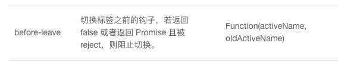

# 商品列表

## 新建组件

goods

```html
<!--  -->
<template>
  <div>
    <el-breadcrumb separator=">">
      <el-breadcrumb-item :to="{ path: '/welcome' }">首页</el-breadcrumb-item>
      <el-breadcrumb-item :to="{ path: '/params' }">商品管理</el-breadcrumb-item>
      <el-breadcrumb-item>商品列表</el-breadcrumb-item>
    </el-breadcrumb>
    <el-card class="box-card">
    111
    </el-card>
  </div>
</template>

<script>
export default {
  data() {
    return {};
  },
  methods: {}
};
</script>
<style lang='less' scoped>
.box-card {
  margin-top: 20px;
}
.el-table {
  margin-top: 20px;
}
.row {
  margin-top: 20px;
}
</style>
```

## 搜索和添加

```html
<el-row :gutter="20">
    <el-col :span="8">
        <el-input placeholder="请输入内容">
            <el-button slot="append" icon="el-icon-search"></el-button>
        </el-input>
    </el-col>
    <el-col :span="4">
        <el-button type="primary" @click="addPro">添加商品</el-button>

    </el-col>
</el-row>
```

## 获取数据

```html
<!--  -->
<template>
  <div>
    <el-breadcrumb separator=">">
      <el-breadcrumb-item :to="{ path: '/welcome' }">首页</el-breadcrumb-item>
      <el-breadcrumb-item :to="{ path: '/params' }">商品管理</el-breadcrumb-item>
      <el-breadcrumb-item>商品列表</el-breadcrumb-item>
    </el-breadcrumb>
    <el-card class="box-card">
      <el-row :gutter="20">
        <el-col :span="8">
          <el-input placeholder="请输入内容">
            <el-button slot="append" icon="el-icon-search"></el-button>
          </el-input>
        </el-col>
        <el-col :span="4">
          <el-button type="primary" @click="addPro">添加商品</el-button>
        </el-col>
      </el-row>
    </el-card>
  </div>
</template>

<script>
export default {
  data() {
    return {
        queryinfo:{
            query:'',
            pagenum:1,
            pagesize:10
        },
        goodsList:[],
        total:0
    };
  },
  created() {
    this.getGoodsList();
  },
  methods: {
    async getGoodsList() {
        const {data:res} =await this.$http.get('goods',{params:this.queryinfo})
        if(res.meta.status!==200){
            return this.$message.error('获取列表失败')
        }
        this.$message.success('获取列表成功')
        console.log(res.data);
        this.goodsList = res.data.goods
        this.total = res.data.total
        
    },
    addPro(){

    }
  }
};
</script>
<style lang='less' scoped>
.box-card {
  margin-top: 20px;
}
.el-table {
  margin-top: 20px;
}
.row {
  margin-top: 20px;
}
</style>
```

## 渲染表格

```html
 <el-card class="box-card">
      <el-row :gutter="20">
        <el-col :span="8">
          <el-input placeholder="请输入内容">
            <el-button slot="append" icon="el-icon-search"></el-button>
          </el-input>
        </el-col>
        <el-col :span="4">
          <el-button type="primary" @click="addPro">添加商品</el-button>
        </el-col>
      </el-row>
      <!-- 表格 -->
      <el-table :data="goodsList" border stripe>
        <el-table-column type="index"></el-table-column>

        <el-table-column prop="goods_name" label="商品名称"></el-table-column>
        <el-table-column prop="goods_price" width="150px" label="商品价格(元)"></el-table-column>
        <el-table-column prop="goods_weight" width="100px" label="商品重量"></el-table-column>
        <el-table-column prop="add_time" width="200px" label="创建时间"></el-table-column>
        <el-table-column label="操作" width="200px">
          <template slot-scope="scope" >
            <el-button size="mini" type="primary" icon="el-icon-edit">编辑</el-button>
            <el-button size="mini" type="danger" icon="el-icon-delete">删除</el-button>
          </template>
        </el-table-column>
      </el-table>
    </el-card>
```

## 全局时间过滤器

main.js

```js
 // 时间过滤器
Vue.filter('dateFormat',function(date){
  const dt = new Date(date)
  const y =  dt.getFullYear()
  const m =  (dt.getMonth()+1+'').padStart(2,'0')
  const d =  (dt.getDate()+'').padStart(2,'0')
  const hh =  (dt.getHours()+'').padStart(2,'0')
  const mm =  (dt.getMinutes()+'').padStart(2,'0')
  const ss =  (dt.getSeconds()+'').padStart(2,'0')
  return `${y}-${m}-${d} ${hh}:${mm}:${ss}`

})
```

```html
<el-table-column prop="add_time" width="200px" label="创建时间">
    <template slot-scope="scope">
        {{scope.row.add_time | dateFormat}}
    </template>
</el-table-column>
```

## 商品分页

```html
    <!-- 分页 -->
    <el-pagination
      @size-change="handleSizeChange"
      @current-change="handleCurrentChange"
      :current-page="queryinfo.pagenum"
      :page-sizes="[5, 10, 15, 20]"
      :page-size="queryinfo.pagesize"
      layout="total, sizes, prev, pager, next, jumper"
      :total="total"
    ></el-pagination>
```

```js
<script>
export default {
  data() {
    return {
      queryinfo: {
        query: "",
        pagenum: 1,
        pagesize: 5
      },
      goodsList: [],
      total: 0
    };
  },
  created() {
    this.getGoodsList();
  },
  methods: {
    async getGoodsList() {
      const { data: res } = await this.$http.get("goods", {
        params: this.queryinfo
      });
      if (res.meta.status !== 200) {
        return this.$message.error("获取列表失败");
      }
    //   this.$message.success("获取列表成功");
      console.log(res.data);
      this.goodsList = res.data.goods;
      this.total = res.data.total;
    },
    // 添加商品
    addPro() {},
    handleSizeChange(newSize) {
      this.queryinfo.pagesize = newSize;
      this.getGoodsList();
    },
    handleCurrentChange(newPage) {
      this.queryinfo.pagenum = newPage;
      this.getGoodsList();
    }
  }
};
</script>
```

## 搜索

```html
<el-input v-model="queryinfo.query" placeholder="请输入内容">
    <el-button @click="getGoodsList" slot="append" icon="el-icon-search"></el-button>
</el-input>
```

- 晴空数据
  - 添加属性clearable

```html
<el-input @clear="clear" clearable v-model="queryinfo.query" placeholder="请输入内容">
    <el-button @click="getGoodsList" slot="append" icon="el-icon-search"></el-button>
</el-input>
```

```js
clear(){
    this.getGoodsList();
}
```

## 删除商品

```js
 async del(id) {
      const confirmRes = await this.$confirm(
        "此操作将永久删除该商品, 是否继续?",
        "提示",
        {
          confirmButtonText: "确定",
          cancelButtonText: "取消",
          type: "warning"
        }
      ).catch(err => err);

      if (confirmRes !== "confirm") {
        return this.$message.info("取消删除");
      }
      const {data:res} = await this.$http.delete(`goods/${id}`);
      if(res.meta.status!==200){
          return this.$message.error('删除失败')
      }
      this.$message.success('删除成功')
      this.getGoodsList()
    }
```

## 添加商品组件

- 点击按钮，通过路由导航的形式，跳转到添加页面

```html
// 添加商品
addPro() {
	this.$router.push('/add')
},
```

- 路由

```js
{
    path: '/add',
    component: addPro
}
```

- 基本布局

```html
<!--  -->
<template>
  <div>
    <el-breadcrumb separator=">">
      <el-breadcrumb-item :to="{ path: '/welcome' }">首页</el-breadcrumb-item>
      <el-breadcrumb-item :to="{ path: '/goods' }">商品列表</el-breadcrumb-item>
      <el-breadcrumb-item>添加商品</el-breadcrumb-item>
    </el-breadcrumb>
    <el-card class="box-card">

    </el-card>
  </div>
</template>

<script>
export default {
  data() {
    return {};
  },

  methods: {}
};
</script>
<style lang='less' scoped>
.box-card {
  margin-top: 20px;
}
.el-table {
  margin-top: 20px;
}
.row {
  margin-top: 20px;
}
.el-pagination {
  margin-top: 20px;
}
</style>
```

## 提示区

```html
<el-card class="box-card">
    <!-- 提示区 -->
          <el-alert title="添加商品信息" type="info" show-icon :closable="false"></el-alert></el-alert>

</el-card>
```

## 步骤条

```html
<el-steps :space="200" :active="1" finish-status="success">
  <el-step title="已完成"></el-step>
  <el-step title="进行中"></el-step>
  <el-step title="步骤 3"></el-step>
</el-steps>
```

- 激活索引从0开始
- 居中 align-center

## Tabs标签页

```html
<el-tabs tab-position="left" style="height: 200px;">
    <el-tab-pane label="用户管理">用户管理</el-tab-pane>
    <el-tab-pane label="配置管理">配置管理</el-tab-pane>
    <el-tab-pane label="角色管理">角色管理</el-tab-pane>
    <el-tab-pane label="定时任务补偿">定时任务补偿</el-tab-pane>
</el-tabs>
```

改造

```html
<!-- tabs -->
<el-tabs tab-position="left" style="height: 200px;">
    <el-tab-pane label="基本信息">基本信息</el-tab-pane>
    <el-tab-pane label="商品参数">商品参数</el-tab-pane>
    <el-tab-pane label="商品属性">商品属性</el-tab-pane>
    <el-tab-pane label="商品图片">商品图片</el-tab-pane>
    <el-tab-pane label="商品内容">商品内容</el-tab-pane>
</el-tabs>
```

## 步骤条和Tabs数据联动

- 步骤条是根据active的值
- Tabs是根据双向数据绑定和name里的值
- Tabs的active: '0' 这里0是字符串
- 步骤条里的active是数值类型
  - :active="active-0" 字符串-0 -》数值

```html
<!-- 步骤条 -->
<el-steps align-center :space="200" :active="active-0" finish-status="success">
    <el-step title="基本信息"></el-step>
    <el-step title="商品参数"></el-step>
    <el-step title="商品属性"></el-step>
    <el-step title="商品图片"></el-step>
    <el-step title="商品内容"></el-step>
    <el-step title="完成"></el-step>
</el-steps>

<!-- tabs -->
<el-tabs v-model='active' tab-position="left" style="height: 200px;">
    <el-tab-pane label="基本信息" name="0">基本信息</el-tab-pane>
    <el-tab-pane label="商品参数" name="1">商品参数</el-tab-pane>
    <el-tab-pane label="商品属性" name="2">商品属性</el-tab-pane>
    <el-tab-pane label="商品图片" name="3">商品图片</el-tab-pane>
    <el-tab-pane label="商品内容" name="4">商品内容</el-tab-pane>
</el-tabs>
```

```js
data() {
    return {
        active: '0'
    };
},
```

## 表单

```html
<el-form :model="addForm" ref="addFormRef" label-width="80px" label-position="top">
    <!-- tabs -->
    <el-tabs v-model="active" tab-position="left">
        <el-tab-pane label="基本信息" name="0">
            <el-form-item label="商品名称" prop="goods_name">
                <el-input placeholder="请输入商品名称" v-model="addForm.goods_name"></el-input>
            </el-form-item>
            <el-form-item label="商品价格" prop="goods_price">
                <el-input type="number" placeholder="请输入数字" v-model="addForm.goods_price"></el-input>
            </el-form-item>
            <el-form-item label="商品重量" prop="goods_weight">
                <el-input type="number" placeholder="请输入数字" v-model="addForm.goods_weight"></el-input>
            </el-form-item>
            <el-form-item label="商品数量" prop="goods_number">
                <el-input type="number" placeholder="请输入数字" v-model="addForm.goods_number"></el-input>
            </el-form-item>
        </el-tab-pane>

        <el-tab-pane label="商品参数" name="1"></el-tab-pane>
        <el-tab-pane label="商品属性" name="2"></el-tab-pane>
        <el-tab-pane label="商品图片" name="3"></el-tab-pane>
        <el-tab-pane label="商品内容" name="4"></el-tab-pane>
    </el-tabs>
</el-form>
```

## 商品分类

### 级联菜单

- 只能选择3级分类

```html
<!--  -->
<template>
  <div>
    <el-breadcrumb separator=">">
      <el-breadcrumb-item :to="{ path: '/welcome' }">首页</el-breadcrumb-item>
      <el-breadcrumb-item :to="{ path: '/goods' }">商品列表</el-breadcrumb-item>
      <el-breadcrumb-item>添加商品</el-breadcrumb-item>
    </el-breadcrumb>
    <el-card class="box-card">
      <!-- 警告区 -->
      <el-alert title="添加商品信息" type="info" show-icon :closable="false"></el-alert>
      <!-- 步骤条 -->
      <el-steps align-center :space="200" :active="active-0" finish-status="success">
        <el-step title="基本信息"></el-step>
        <el-step title="商品参数"></el-step>
        <el-step title="商品属性"></el-step>
        <el-step title="商品图片"></el-step>
        <el-step title="商品内容"></el-step>
        <el-step title="完成"></el-step>
      </el-steps>

      <el-form :model="addForm" ref="addFormRef" label-width="80px" label-position="top">
        <!-- tabs -->
        <el-tabs v-model="active" tab-position="left">
          <el-tab-pane label="基本信息" name="0">
            <el-form-item label="商品名称" prop="goods_name">
              <el-input placeholder="请输入商品名称" v-model="addForm.goods_name"></el-input>
            </el-form-item>
            <el-form-item label="商品价格" prop="goods_price">
              <el-input type="number" placeholder="请输入数字" v-model="addForm.goods_price"></el-input>
            </el-form-item>
            <el-form-item label="商品重量" prop="goods_weight">
              <el-input type="number" placeholder="请输入数字" v-model="addForm.goods_weight"></el-input>
            </el-form-item>
            <el-form-item label="商品数量" prop="goods_number">
              <el-input type="number" placeholder="请输入数字" v-model="addForm.goods_number"></el-input>
            </el-form-item>
            <el-form-item label="商品分类" prop="goods_number">
              <el-cascader
                v-model="addForm.goods_cat"
                :options="cateList"
                :props="casProps"
                @change="handleChange"
                clearable
              ></el-cascader>
            </el-form-item>
          </el-tab-pane>

          <el-tab-pane label="商品参数" name="1"></el-tab-pane>
          <el-tab-pane label="商品属性" name="2"></el-tab-pane>
          <el-tab-pane label="商品图片" name="3"></el-tab-pane>
          <el-tab-pane label="商品内容" name="4"></el-tab-pane>
        </el-tabs>
      </el-form>
    </el-card>
  </div>
</template>

<script>
export default {
  data() {
    return {
      active: "0",
      addForm: {
        goods_name: "",
        goods_price: "",
        goods_weight: "",
        goods_number: "",
        goods_cat:[]
      },
      cateList: [],
      casProps: {
        //   所选中的值
        value: "cat_id",
        //   指定你看见的值
        label: "cat_name",
        // 父子嵌套的属性
        children: "children",
        expandTrigger: "hover",
        // 可以选择一级类目,我们这只能选3级分类
        // checkStrictly: true
      }
    };
  },
  created() {
    this.getCategoriesList();
  },
  methods: {
    async getCategoriesList() {
      const { data: res } = await this.$http.get("categories");
      this.cateList = res.data;
    },
    handleChange(){
        console.log(this.addForm.goods_cat);
        // 如果不是三级菜单，我们清空数据
        if(this.addForm.goods_cat.length !==3){
            this.addForm.goods_cat = []
        }
    }
  }
};
</script>
<style lang='less' scoped>
.box-card {
  margin-top: 20px;
}
.el-table {
  margin-top: 20px;
}
.el-steps {
  margin: 20px 0;
}
.el-tabs {
  margin-top: 50px;
}
.el-cascader{
    width: 300px;
}
</style>
```

- 在选择后，数据是数组，而我们根据api的要求goods_cat是以逗号分隔的字符串
- 需要将数组转成字符串
- 这里等我们最后提交的时候在处理

### 标签切换

- 注意，在我们没选择商品分类，是不能切换到其他标签的
  - 如何阻止标签页的切换？
    - 监听标签页的切换事件
    - 在事件中，判断当前是否处于第一个标签,同时判断是否选中的三级分类
    - 如果三级分类的数组长度等于3可以切换，不等于阻止切换



- ActiveName:即将进入标签页的名称
- oldActiveName:即将离开标签页的名称
- return false 阻止

```html
 <el-tabs :before-leave="bltabs" v-model="active" tab-position="left">
```

```js
bltabs(activeName,oldActiveName){
    console.log('即将进入的标签页'+activeName);
    console.log('即将离开的标签页'+oldActiveName);
    if(oldActiveName==='0' && this.addForm.goods_cat.length !==3){
        this.$message.error('请先选择类别')
        return false
    }
}
```

## 商品参数

- 当我点击商品参数的时候发起请求
-  事件 @tab-click="tabClicked"

```js
methods: {
 async tabClicked() {
      console.log(this.active);
      if (this.active === "1") {
        // 访问的是动态参数面板
        // this.$http.get(`categories/${this.addForm.goods_cat[2]}/attributes`);
        const { data: res } = await this.$http.get(
          `categories/${this.getCateId}/attributes`,
          {
            params: { sel: "many" }
          }
        );
        if (res.meta.status !== 200) {
          return this.$message.error("获取列表失败");
        }
        res.data.forEach(item => {
            // 字符串变成数组
          item.attr_vals =
            item.attr_vals.length === 0 ? [] : item.attr_vals.split(" ");
        });
        this.manyData = res.data;
        console.log(this.manyData);
      }
    }
},
    computed: {
        getCateId() {
            if (this.addForm.goods_cat.length === 3) {
                return this.addForm.goods_cat[2];
            }
            return null;
        }
    }
```

```html
<el-tabs
         :before-leave="bltabs"
         v-model="active"
         tab-position="left"
         @tab-click="tabClicked"
         >
```

- 渲染

```html
<el-tab-pane label="商品参数" name="1">
    <el-form-item :label="item.attr_name" v-for="(item,i) in manyData" :key="i">
        <!-- 复选框 -->
        <el-checkbox-group v-model="item.attr_vals" label="">
            <el-checkbox border :label="val" v-for="(val,i) in item.attr_vals" :key='i'></el-checkbox>
        </el-checkbox-group>
    </el-form-item>
</el-tab-pane>


.el-checkbox{
    margin: 0 5px 0 0 !important;
}
```

## 商品属性

```html
<el-tab-pane label="商品属性" name="2">
    <el-form-item :label='item.attr_name' v-for="(item,i) in onlyData" :key="i">
        <el-input v-model="item.attr_vals"></el-input>
    </el-form-item>
</el-tab-pane>
```

```js
async tabClicked() {
      console.log(this.active);
      if (this.active === "1") {
        
      } else if (this.active === "2") {
        // 商品属性
        const { data: res } = await this.$http.get(
          `categories/${this.getCateId}/attributes`,
          {
            params: { sel: "only" }
          }
        );
        if (res.meta.status !== 200) {
          return this.$message.error("获取属性失败");
        }
        this.onlyData = res.data;
      }
    }
```


## 图片上传

```html
<el-upload
           action="http://127.0.0.1:8888/api/private/v1/upload"
           :on-preview="handlePreview"
           :on-remove="handleRemove"
           list-type="picture"
           >
    <el-button size="small" type="primary">点击上传</el-button>
    <div slot="tip" class="el-upload__tip">只能上传jpg/png文件，且不超过500kb</div>
</el-upload>
```

上传通过network检查，上传错误，需要token，之前axios的拦截器我们已经添加了token，只能说明此上传组件没有用axios，查询文档，需要使用headers属性，手动添加请求头，传token

```html
<el-upload
action="http://127.0.0.1:8888/api/private/v1/upload"
:on-preview="handlePreview"
:on-remove="handleRemove"
list-type="picture"
:headers='headers'
>
    <el-button size="small" type="primary">点击上传</el-button>
<div slot="tip" class="el-upload__tip">只能上传jpg/png文件，且不超过500kb</div>
</el-upload>

headers:{
    Authorization:window.sessionStorage.getItem('token')
}
```

把地址添加到表单中

```html
<el-upload
           action="http://127.0.0.1:8888/api/private/v1/upload"
           :on-preview="handlePreview"
           :on-remove="handleRemove"
           list-type="picture"
           :headers="headers"
           :on-success="handleSuccess"
           >
    <el-button size="small" type="primary">点击上传</el-button>
    <div slot="tip" class="el-upload__tip">只能上传jpg/png文件，且不超过500kb</div>
</el-upload>
```

```js
// 监听图片上传成功的事件
handleSuccess(response) {
    console.log(response);
    // 1. 拼接得到一个图片信息对象
    const picInfo = { pic: response.data.tmp_path };
    // 2. 将图片信息对象，push 到pics数组中
    this.addForm.pics.push(picInfo);
    console.log(this.addForm);
}

addForm: {
        goods_name: "",
        goods_price: "",
        goods_weight: "",
        goods_number: "",
        goods_cat: [],
        pics:[]
      },
```

删除

```js
// 删除图片
handleRemove(file) {
    // console.log(file)
    // 1. 获取将要删除的图片的临时路径
    const filePath = file.response.data.tmp_path
    // 2. 从 pics 数组中，找到这个图片对应的索引值
    const i = this.addForm.pics.findIndex(x => x.pic === filePath)
    // 3. 调用数组的 splice 方法，把图片信息对象，从 pics 数组中移除
    this.addForm.pics.splice(i, 1)
    console.log(this.addForm)
},
```

## 图片预览

```html

<!-- 图片预览 -->
<el-dialog title="图片预览" :visible.sync="previewVisible" width="50%">
    
</el-dialog>
```

```js
// 处理图片预览效果
handlePreview(file) {
    console.log(file);
    this.previewPath = file.response.data.url;
    this.previewVisible = true;
},
```

```js
previewVisible:false,
    previewPath:''
```

```css
.previewImg{
  width: 100%;
}
```

## 富文本编辑器

cnpm i vue-quill-editor --save

- Main.js

```js
// 导入富文本编辑器
import VueQuillEditor from 'vue-quill-editor'
// require styles 导入富文本编辑器对应的样式
import 'quill/dist/quill.core.css'
import 'quill/dist/quill.snow.css'
import 'quill/dist/quill.bubble.css'
// 将富文本编辑器，注册为全局可用的组件
Vue.use(VueQuillEditor)
```

```html
<!-- 富文本编辑器组件 -->
<quill-editor v-model="addForm.goods_introduce"></quill-editor>
```

- 高度

Assets->css->base.css

```css
.ql-editor{
    min-height: 300px;
}
```

## 添加商品

```html
<el-tab-pane label="商品内容" name="4">
    <!-- 富文本编辑器组件 -->
    <quill-editor v-model="addForm.goods_introduce"></quill-editor>
    <!-- 添加商品的按钮 -->
    <el-button type="primary" class="btnAdd" @click="add">添加商品</el-button>
</el-tab-pane>
```

```js
 // 添加商品
    add() {
      this.$refs.addFormRef.validate(async valid => {
        if (!valid) {
          return this.$message.error("请填写必要的表单项！");
        }
        // 执行添加的业务逻辑，级联选择器要求是数组，这里要求是字符串
        // lodash包   深拷贝cloneDeep(obj)
        const form = _.cloneDeep(this.addForm);
        form.goods_cat = form.goods_cat.join(",");
        // 处理动态参数
        this.manyData.forEach(item => {
          const newInfo = {
            attr_id: item.attr_id,
            attr_value: item.attr_vals.join(" ")
          };
          this.addForm.attrs.push(newInfo);
        });
        // 处理静态属性
        this.onlyData.forEach(item => {
          const newInfo = { attr_id: item.attr_id, attr_value: item.attr_vals };
          this.addForm.attrs.push(newInfo);
        });
        form.attrs = this.addForm.attrs;
        console.log(form);

        // 发起请求添加商品
        // 商品的名称，必须是唯一的
        const { data: res } = await this.$http.post("goods", form);

        if (res.meta.status !== 201) {
          return this.$message.error("添加商品失败！");
        }

        this.$message.success("添加商品成功！");
        this.$router.push("/goods");
      });
    }
```

- 第三方包

cnpm i lodash --save

```js
<script>
    //导入
import _ from 'lodash'


export default {
```

```js
addForm: {
        goods_name: "",
        goods_price: "",
        goods_weight: "",
        goods_number: "",
        goods_cat: [],
        pics: [],
        // 商品详情描述
        goods_introduce: "",
        attrs: []
      },
```

