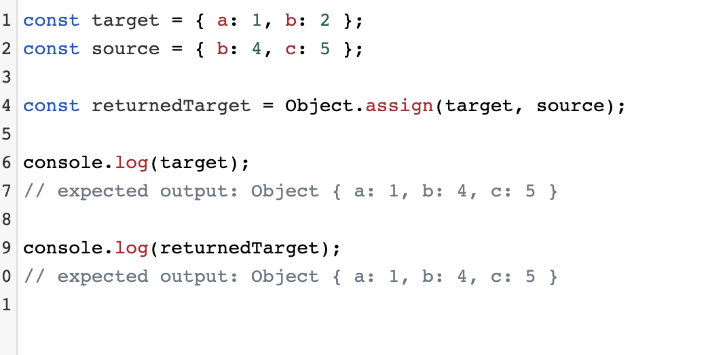

# Canvas

<https://www.canvasapi.cn/>

## 1、常用的三角函数


## 2、Canvas的坐标系


util.js

```js
/**
 * canvas一些基本的工具函数  util.js
 */

let C = {};

// 获取鼠标在元素上的坐标
C.getOffset = function (ele){
  let mouse = {x: 0, y: 0};
  ele.addEventListener('mousemove', function (e){
    let {x, y} = C.eventWrapper(e);
    mouse.x = x;
    mouse.y = y;
  });
  return mouse;
};
C.eventWrapper = function (ev){
  let {pageX, pageY, target} = ev;
  let {left, top} = target.getBoundingClientRect();
  return {x: pageX - left, y: pageY - top};
};
```

```html
<!DOCTYPE html>
<html lang="en">
<head>
    <meta charset="UTF-8">
    <meta name="viewport" content="width=device-width, initial-scale=1.0">
    <title>Document</title>
    <style>
        html,body {
            margin: 0;
            height: 100%;
        }
        #canvas{
            box-shadow: 4px 4px 12px black;
            transform: translate(100px,100px);
        }
    </style>
</head>
<body>
    <canvas id="canvas"></canvas>
    <script src="./util.js"></script>
    <script>
        const canvas = document.querySelector('#canvas')
        const ctx = canvas.getContext('2d')

        let W = canvas.width = 800
        let H = canvas.height = 600
        let pos = C.getOffset(canvas)
        canvas.onclick = ()=>{
            // 鼠标在盒子内的坐标
            console.log(pos.x,pos.y);
        }
    </script>
</body>
</html>
```

## 3、常用的反三角函数


### 角度转弧度、弧度转角度

```js
// 角度转弧度
C.toRad = function (angle){
  return angle * Math.PI / 180
}

// 弧度转角度
C.toAngle = function (rad){
  return rad * 180 / Math.PI
}
```


左边的api，有个问题，一、四象限的值是一样的，那么我鼠标在点击的时候就不能区分，那么就出现了一个新的api，Math.atan2(dy,dx),参数只需要传入两个横纵坐标，就可以获取到与x正方向的夹角

```html
<!DOCTYPE html>
<html lang="en">

<head>
    <meta charset="UTF-8">
    <meta name="viewport" content="width=device-width, initial-scale=1.0">
    <title>Document</title>
    <style>
        html,
        body {
            margin: 0;
            height: 100%;
        }

        #canvas {
            box-shadow: 4px 4px 12px black;
            transform: translate(100px, 100px);
        }
    </style>
</head>

<body>
    <canvas id="canvas"></canvas>
    <script src="./util.js"></script>
    <script>
        const canvas = document.querySelector('#canvas')
        const cvsCtx = canvas.getContext('2d')

        let W = canvas.width = 800
        let H = canvas.height = 600
        let mouse = C.getOffset(canvas)
        canvas.onmousemove = function () {
            // clearRect()在Canvas动画绘制中非常常用，不断清除画布内容再绘制，形成动画效果
            // 登录状态下不会出现这行文字，点击页面右上角一键登录
            cvsCtx.clearRect(0, 0, W, H);
            // 绘制鼠标顶点与x轴的夹角
            // 求出鼠标的x坐标
            let dx = mouse.x-W/2
            // y坐标
            let dy = mouse.y-H/2

            let angle = Math.atan2(dy,dx)*180/Math.PI

            drawSystem()
            cvsCtx.beginPath();
            cvsCtx.lineTo(mouse.x, mouse.y);
            cvsCtx.lineTo(W / 2, H / 2);
            cvsCtx.stroke();
            // 绘制文本 当前鼠标距离x轴的夹角
            cvsCtx.fillText(angle, mouse.x, mouse.y);
        }

        drawSystem();
        function drawSystem() {
            // 初始化
            cvsCtx.save()
            // 设置线条的宽度
            cvsCtx.lineWidth = 1.5;
            // 创建一个新路径
            cvsCtx.beginPath();
            // 把路径移动到画布中的指定点，不创建线条。 
            cvsCtx.moveTo(0, H / 2);
            // lineTo 方法增加一个新点，然后创建一条从上次指定点到目标点的线。
            cvsCtx.lineTo(W, H / 2);

            // y轴
            cvsCtx.moveTo(W / 2, 0);
            cvsCtx.lineTo(W / 2, H);
            // 画出当前路径的边框
            cvsCtx.stroke();
        }
    </script>
</body>

</html>
```


## 4、案例：箭头跟随鼠标

绘制箭头


```js
/**
 * 绘制箭头类
 */

class Arrow {
  constructor(props){
    this.x = 0;
    this.y = 0;
    this.w = 60;
    this.h = 30;
    this.rotation = 0;//旋转
    this.fillStyle = 'rgb(57, 119, 224)';//填充颜色
    this.strokeStyle = 'rgba(0, 0, 0, 0)';//描边颜色
    //源对象复制到目标对象。它将返回目标对象。
    Object.assign(this, props);
    return this;
  }
  createPath(ctx){
    let {w, h} = this;
    ctx.beginPath();
    ctx.moveTo(-w/2, -h/2);
    ctx.lineTo(w/10, -h/2);
    ctx.lineTo(w/10, -h);
    ctx.lineTo(w/2, 0);
    ctx.lineTo(w/10, h);
    ctx.lineTo(w/10, h/2);
    ctx.lineTo(-w/2, h/2);
    ctx.closePath();
    return this;
  }
  render(ctx){
    let {fillStyle, strokeStyle, rotation, x, y} = this;
    ctx.save();
    ctx.fillStyle = fillStyle;
    ctx.strokeStyle = strokeStyle;
    ctx.translate(x, y);
    ctx.rotate(rotation);
    this.createPath(ctx);
    ctx.fill();
    ctx.stroke();
    ctx.restore();
    return this;
  }
}

```



完整代码

```html
<!DOCTYPE html>
<html lang="en">

<head>
    <meta charset="UTF-8">
    <meta name="viewport" content="width=device-width, initial-scale=1.0">
    <meta http-equiv="X-UA-Compatible" content="ie=edge">
    <title></title>
    <style>
        body,
        html {
            margin: 0;
            height: 100%;
        }

        #canvas {
            box-shadow: 4px 4px 12px rgba(0, 0, 0, 0.5);
        }
    </style>
</head>

<body>
    <canvas id="canvas"></canvas>
    <script>
        /**
         * canvas一些基本的工具函数  util.js
         */

        let C = {};

        // 获取鼠标在元素上的坐标
        C.getOffset = function (ele) {
            let mouse = { x: 0, y: 0 };
            ele.addEventListener('mousemove', function (e) {
                let { x, y } = C.eventWrapper(e);
                mouse.x = x;
                mouse.y = y;
            });
            return mouse;
        };
        C.eventWrapper = function (ev) {
            let { pageX, pageY, target } = ev;
            let { left, top } = target.getBoundingClientRect();
            return { x: pageX - left, y: pageY - top };
        };

        // 角度转弧度
        C.toRad = function (angle) {
            return angle * Math.PI / 180
        }

        // 弧度转角度
        C.toAngle = function (rad) {
            return rad * 180 / Math.PI
        }
        /**
         * 绘制箭头类
         */

        class Arrow {
            constructor(props) {
                this.x = 0;
                this.y = 0;
                this.w = 60;
                this.h = 30;
                this.rotation = 0;//旋转
                this.fillStyle = 'rgb(57, 119, 224)';//填充颜色
                this.strokeStyle = 'rgba(0, 0, 0, 0)';//描边颜色
                //源对象复制到目标对象。它将返回目标对象。
                Object.assign(this, props);
                return this;
            }
            createPath(ctx) {
                let { w, h } = this;
                ctx.beginPath();
                ctx.moveTo(-w / 2, -h / 2);
                ctx.lineTo(w / 10, -h / 2);
                ctx.lineTo(w / 10, -h);
                ctx.lineTo(w / 2, 0);
                ctx.lineTo(w / 10, h);
                ctx.lineTo(w / 10, h / 2);
                ctx.lineTo(-w / 2, h / 2);
                ctx.closePath();
                return this;
            }
            render(ctx) {
                let { fillStyle, strokeStyle, rotation, x, y } = this;
                ctx.save();
                ctx.fillStyle = fillStyle;
                ctx.strokeStyle = strokeStyle;
                ctx.translate(x, y);
                ctx.rotate(rotation);
                this.createPath(ctx);
                ctx.fill();
                ctx.stroke();
                ctx.restore();
                return this;
            }
        }


        const canvas = document.getElementById('canvas');
        const ctx = canvas.getContext('2d');

        let W = canvas.width = 800;
        let H = canvas.height = 600;

        const arrow = new Arrow({
            x: W / 2,
            y: H / 2,
            w: 140,
            h: 60
        }).render(ctx);

        let mouse = C.getOffset(canvas);
        let speed = 3;

        (function move() {
            window.requestAnimationFrame(move);

            let dx = mouse.x - arrow.x;
            let dy = mouse.y - arrow.y;

            let angle = Math.atan2(dy, dx);

            let vx = speed * Math.cos(angle);
            let vy = speed * Math.sin(angle);

            arrow.x += vx;
            arrow.y += vy;
            arrow.rotation = angle;

            ctx.clearRect(0, 0, W, H);
            arrow.render(ctx);
        })();

    </script>
</body>

</html>
```

## 5、正弦波


正弦波图形（0-360度）


```html
<!DOCTYPE html>
<html lang="en">
<head>
	<meta charset="UTF-8">
	<meta name="viewport" content="width=device-width, initial-scale=1.0">
	<title>Document</title>
</head>
<body>
	<script>
		for (let index = 0; index < Math.PI*2; index+=0.1) {
			console.log(Math.sin(index));
		}
	</script>
</body>
</html>
```

### 小球类

```js
/**
 * 小球类
 */

class Ball {
  constructor(props){
    this.x = 0;
    this.y = 0;
    this.x3d = 0;
    this.y3d = 0;
    this.z3d = 0;
    this.r = 20;//小球半径
    this.vx = 0;
    this.vy = 0;
    this.vz = 0;
    this.scaleX = 1;//小球横向缩放倍数
    this.scaleY = 1;//小球纵向缩放倍数
    this.strokeStyle = 'rgba(0, 0, 0, 0)';//描边颜色
    this.fillStyle = 'rgb(57, 119, 224)';//填充颜色
    this.alpha = 1;//透明度
    Object.assign(this, props);//初始化
    return this;
  }
  render(ctx){
    let {x, y, r, scaleX, scaleY, fillStyle, strokeStyle, alpha} = this;
    ctx.save();
    ctx.translate(x, y);
    ctx.scale(scaleX, scaleY);
    ctx.strokeStyle = strokeStyle;
    ctx.fillStyle = fillStyle;
    ctx.globalAlpha = alpha;
    ctx.beginPath();
    ctx.arc(0, 0, r, 0, 2*Math.PI);//绘制圆
    ctx.fill();
    ctx.stroke();
    ctx.restore();
    return this;
  }
  isPoint(pos){
    let {x, y} = pos;
    return this.r >= Math.sqrt((x - this.x)**2 + (y - this.y)**2);
  }
}
```

### 平滑运动

```html
<!DOCTYPE html>
<html lang="en">

<head>
	<meta charset="UTF-8">
	<meta name="viewport" content="width=device-width, initial-scale=1.0">
	<meta http-equiv="X-UA-Compatible" content="ie=edge">
	<title></title>
	<style>
		body,
		html {
			margin: 0;
			height: 100%;
		}

		#canvas {
			box-shadow: 4px 4px 12px rgba(0, 0, 0, 0.5);
		}
	</style>
</head>

<body>
	<canvas id="canvas"></canvas>
	<script src="../assets/script/utils.js"></script>
	<script src="../assets/components/Ball.js"></script>
	<script>
		/**
		 * canvas一些基本的工具函数
		 */

		let C = {};

		// 获取鼠标在元素上的坐标
		C.getOffset = function (ele) {
			let mouse = { x: 0, y: 0 };
			ele.addEventListener('mousemove', function (e) {
				let { x, y } = C.eventWrapper(e);
				mouse.x = x;
				mouse.y = y;
			});
			return mouse;
		};

		// 坐标系转换
		C.eventWrapper = function (ev) {
			let { pageX, pageY, target } = ev;
			let { left, top } = target.getBoundingClientRect();
			return { x: pageX - left, y: pageY - top };
		};

		// 角度转弧度
		C.toRad = function (angle) {
			return angle * Math.PI / 180
		}

		// 弧度转角度
		C.toAngle = function (rad) {
			return rad * 180 / Math.PI
		}

		// 生成随机数
		C.rp = function (arr, int) {  // C.rp([10, 20], true)
			const max = Math.max(...arr);
			const min = Math.min(...arr);
			const num = Math.random() * (max - min) + min;
			return int ? Math.round(num) : num;
		};

		// 生成随机颜色
		C.createColor = function () {
			return `rgb(${C.rp([55, 255], true)}, ${C.rp([55, 255], true)}, ${C.rp([55, 255], true)})`;
		};

		// 矩形之间的碰撞检测
		C.rectDuang = function (rect1, rect2) {
			return (rect1.x + rect1.w >= rect2.x && rect1.x <= rect2.x + rect2.w && rect1.y + rect1.h >= rect2.y && rect1.y <= rect2.y + rect2.h);
		};

		// 求俩点间的距离
		C.getDist = function (x1, y1, x2, y2) {
			return Math.sqrt((x2 - x1) ** 2 + (y2 - y1) ** 2);
		};

		// 对小球进行边界反弹处理
		C.checkBallBounce = function (ball, W, H, bounce) {
			if (ball.x - ball.r <= 0) {
				ball.x = ball.r;
				ball.vx *= bounce;
			} else if (ball.x + ball.r >= W) {
				ball.x = W - ball.r;
				ball.vx *= bounce;
			}
			if (ball.y - ball.r <= 0) {
				ball.y = ball.r;
				ball.vy *= bounce;
			} else if (ball.y + ball.r >= H) {
				ball.y = H - ball.r;
				ball.vy *= bounce;
			}
		};


		C.checkBallHit = function (b1, b2) {
			let dx = b2.x - b1.x;
			let dy = b2.y - b1.y;
			let dist = Math.sqrt(dx ** 2 + dy ** 2);
			if (dist < b1.r + b2.r) {
				let angle = Math.atan2(dy, dx);
				let sin = Math.sin(angle);
				let cos = Math.cos(angle);

				// 以b1为参照物，设定b1的中心点为旋转基点
				let x1 = 0;
				let y1 = 0;
				let x2 = dx * cos + dy * sin;
				let y2 = dy * cos - dx * sin;

				// 旋转b1和b2的速度
				let vx1 = b1.vx * cos + b1.vy * sin;
				let vy1 = b1.vy * cos - b1.vx * sin;
				let vx2 = b2.vx * cos + b2.vy * sin;
				let vy2 = b2.vy * cos - b2.vx * sin;

				// 求出b1和b2碰撞之后的速度
				let vx1Final = ((b1.m - b2.m) * vx1 + 2 * b2.m * vx2) / (b1.m + b2.m);
				let vx2Final = ((b2.m - b1.m) * vx2 + 2 * b1.m * vx1) / (b1.m + b2.m);

				// 处理两个小球碰撞之后，将它们进行归位
				let lep = (b1.r + b2.r) - Math.abs(x2 - x1);

				x1 = x1 + (vx1Final < 0 ? -lep / 2 : lep / 2);
				x2 = x2 + (vx2Final < 0 ? -lep / 2 : lep / 2);

				b2.x = b1.x + (x2 * cos - y2 * sin);
				b2.y = b1.y + (y2 * cos + x2 * sin);
				b1.x = b1.x + (x1 * cos - y1 * sin);
				b1.y = b1.y + (y1 * cos + x1 * sin);

				b1.vx = vx1Final * cos - vy1 * sin;
				b1.vy = vy1 * cos + vx1Final * sin;
				b2.vx = vx2Final * cos - vy2 * sin;
				b2.vy = vy2 * cos + vx2Final * sin;
			}
		};


		/**
		 * 小球类
		 */

		class Ball {
			constructor(props) {
				this.x = 0;
				this.y = 0;
				this.x3d = 0;
				this.y3d = 0;
				this.z3d = 0;
				this.r = 20;//小球半径
				this.vx = 0;
				this.vy = 0;
				this.vz = 0;
				this.scaleX = 1;//小球横向缩放倍数
				this.scaleY = 1;//小球纵向缩放倍数
				this.strokeStyle = 'rgba(0, 0, 0, 0)';//描边颜色
				this.fillStyle = 'rgb(57, 119, 224)';//填充颜色
				this.alpha = 1;//透明度
				Object.assign(this, props);//初始化
				return this;
			}
			render(ctx) {
				let { x, y, r, scaleX, scaleY, fillStyle, strokeStyle, alpha } = this;
				ctx.save();
				ctx.translate(x, y);
				ctx.scale(scaleX, scaleY);
				ctx.strokeStyle = strokeStyle;
				ctx.fillStyle = fillStyle;
				ctx.globalAlpha = alpha;
				ctx.beginPath();
				ctx.arc(0, 0, r, 0, 2 * Math.PI);//绘制圆
				ctx.fill();
				ctx.stroke();
				ctx.restore();
				return this;
			}
			isPoint(pos) {
				let { x, y } = pos;
				return this.r >= Math.sqrt((x - this.x) ** 2 + (y - this.y) ** 2);
			}
		}
		const canvas = document.getElementById('canvas');
		const ctx = canvas.getContext('2d');

		let W = canvas.width = 800;
		let H = canvas.height = 600;


		const ball = new Ball({
			x: W / 2,
			y: H / 2,
			r: 50
		}).render(ctx);

		let angle = 0;
		const SWING = 160; // 振幅

		(function move() {
			window.requestAnimationFrame(move);

			ctx.clearRect(0, 0, W, H);

			ball.x = W / 2 + Math.sin(angle) * SWING;

			angle += 0.05;
			angle %= Math.PI * 2;

			ball.render(ctx);
		})();

	</script>
</body>

</html>
```

### 平滑运动

```html
<!DOCTYPE html>
<html lang="en">

<head>
    <meta charset="UTF-8">
    <meta name="viewport" content="width=device-width, initial-scale=1.0">
    <meta http-equiv="X-UA-Compatible" content="ie=edge">
    <title></title>
    <style>
        body,
        html {
            margin: 0;
            height: 100%;
        }

        #canvas {
            box-shadow: 4px 4px 12px rgba(0, 0, 0, 0.5);
        }
    </style>
</head>

<body>
    <canvas id="canvas"></canvas>
    <script>
		/**
		 * canvas一些基本的工具函数
		 */

        let C = {};

        // 获取鼠标在元素上的坐标
        C.getOffset = function (ele) {
            let mouse = { x: 0, y: 0 };
            ele.addEventListener('mousemove', function (e) {
                let { x, y } = C.eventWrapper(e);
                mouse.x = x;
                mouse.y = y;
            });
            return mouse;
        };

        // 坐标系转换
        C.eventWrapper = function (ev) {
            let { pageX, pageY, target } = ev;
            let { left, top } = target.getBoundingClientRect();
            return { x: pageX - left, y: pageY - top };
        };

        // 角度转弧度
        C.toRad = function (angle) {
            return angle * Math.PI / 180
        }

        // 弧度转角度
        C.toAngle = function (rad) {
            return rad * 180 / Math.PI
        }

        // 生成随机数
        C.rp = function (arr, int) {  // C.rp([10, 20], true)
            const max = Math.max(...arr);
            const min = Math.min(...arr);
            const num = Math.random() * (max - min) + min;
            return int ? Math.round(num) : num;
        };

        // 生成随机颜色
        C.createColor = function () {
            return `rgb(${C.rp([55, 255], true)}, ${C.rp([55, 255], true)}, ${C.rp([55, 255], true)})`;
        };

        // 矩形之间的碰撞检测
        C.rectDuang = function (rect1, rect2) {
            return (rect1.x + rect1.w >= rect2.x && rect1.x <= rect2.x + rect2.w && rect1.y + rect1.h >= rect2.y && rect1.y <= rect2.y + rect2.h);
        };

        // 求俩点间的距离
        C.getDist = function (x1, y1, x2, y2) {
            return Math.sqrt((x2 - x1) ** 2 + (y2 - y1) ** 2);
        };

        // 对小球进行边界反弹处理
        C.checkBallBounce = function (ball, W, H, bounce) {
            if (ball.x - ball.r <= 0) {
                ball.x = ball.r;
                ball.vx *= bounce;
            } else if (ball.x + ball.r >= W) {
                ball.x = W - ball.r;
                ball.vx *= bounce;
            }
            if (ball.y - ball.r <= 0) {
                ball.y = ball.r;
                ball.vy *= bounce;
            } else if (ball.y + ball.r >= H) {
                ball.y = H - ball.r;
                ball.vy *= bounce;
            }
        };


        C.checkBallHit = function (b1, b2) {
            let dx = b2.x - b1.x;
            let dy = b2.y - b1.y;
            let dist = Math.sqrt(dx ** 2 + dy ** 2);
            if (dist < b1.r + b2.r) {
                let angle = Math.atan2(dy, dx);
                let sin = Math.sin(angle);
                let cos = Math.cos(angle);

                // 以b1为参照物，设定b1的中心点为旋转基点
                let x1 = 0;
                let y1 = 0;
                let x2 = dx * cos + dy * sin;
                let y2 = dy * cos - dx * sin;

                // 旋转b1和b2的速度
                let vx1 = b1.vx * cos + b1.vy * sin;
                let vy1 = b1.vy * cos - b1.vx * sin;
                let vx2 = b2.vx * cos + b2.vy * sin;
                let vy2 = b2.vy * cos - b2.vx * sin;

                // 求出b1和b2碰撞之后的速度
                let vx1Final = ((b1.m - b2.m) * vx1 + 2 * b2.m * vx2) / (b1.m + b2.m);
                let vx2Final = ((b2.m - b1.m) * vx2 + 2 * b1.m * vx1) / (b1.m + b2.m);

                // 处理两个小球碰撞之后，将它们进行归位
                let lep = (b1.r + b2.r) - Math.abs(x2 - x1);

                x1 = x1 + (vx1Final < 0 ? -lep / 2 : lep / 2);
                x2 = x2 + (vx2Final < 0 ? -lep / 2 : lep / 2);

                b2.x = b1.x + (x2 * cos - y2 * sin);
                b2.y = b1.y + (y2 * cos + x2 * sin);
                b1.x = b1.x + (x1 * cos - y1 * sin);
                b1.y = b1.y + (y1 * cos + x1 * sin);

                b1.vx = vx1Final * cos - vy1 * sin;
                b1.vy = vy1 * cos + vx1Final * sin;
                b2.vx = vx2Final * cos - vy2 * sin;
                b2.vy = vy2 * cos + vx2Final * sin;
            }
        };


		/**
		 * 小球类
		 */

        class Ball {
            constructor(props) {
                this.x = 0;
                this.y = 0;
                this.x3d = 0;
                this.y3d = 0;
                this.z3d = 0;
                this.r = 20;//小球半径
                this.vx = 0;
                this.vy = 0;
                this.vz = 0;
                this.scaleX = 1;//小球横向缩放倍数
                this.scaleY = 1;//小球纵向缩放倍数
                this.strokeStyle = 'rgba(0, 0, 0, 0)';//描边颜色
                this.fillStyle = 'rgb(57, 119, 224)';//填充颜色
                this.alpha = 1;//透明度
                Object.assign(this, props);//初始化
                return this;
            }
            render(ctx) {
                let { x, y, r, scaleX, scaleY, fillStyle, strokeStyle, alpha } = this;
                ctx.save();
                ctx.translate(x, y);
                ctx.scale(scaleX, scaleY);
                ctx.strokeStyle = strokeStyle;
                ctx.fillStyle = fillStyle;
                ctx.globalAlpha = alpha;
                ctx.beginPath();
                ctx.arc(0, 0, r, 0, 2 * Math.PI);//绘制圆
                ctx.fill();
                ctx.stroke();
                ctx.restore();
                return this;
            }
            isPoint(pos) {
                let { x, y } = pos;
                return this.r >= Math.sqrt((x - this.x) ** 2 + (y - this.y) ** 2);
            }
        }
        const canvas = document.getElementById('canvas');
        const ctx = canvas.getContext('2d');

        let W = canvas.width = 800;
        let H = canvas.height = 600;


        const ball = new Ball({
            x: 50,
            y: H / 2,
            r: 40
        }).render(ctx);

        let vx = 0.5;

        (function move() {
            window.requestAnimationFrame(move);

            ctx.clearRect(0, 0, W, H);

            ball.x += vx;

            ball.render(ctx);
        })();

    </script>
</body>

</html>
```

### 线性运动

```html
<!DOCTYPE html>
<html lang="en">

<head>
    <meta charset="UTF-8">
    <meta name="viewport" content="width=device-width, initial-scale=1.0">
    <meta http-equiv="X-UA-Compatible" content="ie=edge">
    <title></title>
    <style>
        body,
        html {
            margin: 0;
            height: 100%;
        }

        #canvas {
            box-shadow: 4px 4px 12px rgba(0, 0, 0, 0.5);
        }
    </style>
</head>

<body>
    <canvas id="canvas"></canvas>
    <script>
		/**
		 * canvas一些基本的工具函数
		 */

        let C = {};

        // 获取鼠标在元素上的坐标
        C.getOffset = function (ele) {
            let mouse = { x: 0, y: 0 };
            ele.addEventListener('mousemove', function (e) {
                let { x, y } = C.eventWrapper(e);
                mouse.x = x;
                mouse.y = y;
            });
            return mouse;
        };

        // 坐标系转换
        C.eventWrapper = function (ev) {
            let { pageX, pageY, target } = ev;
            let { left, top } = target.getBoundingClientRect();
            return { x: pageX - left, y: pageY - top };
        };

        // 角度转弧度
        C.toRad = function (angle) {
            return angle * Math.PI / 180
        }

        // 弧度转角度
        C.toAngle = function (rad) {
            return rad * 180 / Math.PI
        }

        // 生成随机数
        C.rp = function (arr, int) {  // C.rp([10, 20], true)
            const max = Math.max(...arr);
            const min = Math.min(...arr);
            const num = Math.random() * (max - min) + min;
            return int ? Math.round(num) : num;
        };

        // 生成随机颜色
        C.createColor = function () {
            return `rgb(${C.rp([55, 255], true)}, ${C.rp([55, 255], true)}, ${C.rp([55, 255], true)})`;
        };

        // 矩形之间的碰撞检测
        C.rectDuang = function (rect1, rect2) {
            return (rect1.x + rect1.w >= rect2.x && rect1.x <= rect2.x + rect2.w && rect1.y + rect1.h >= rect2.y && rect1.y <= rect2.y + rect2.h);
        };

        // 求俩点间的距离
        C.getDist = function (x1, y1, x2, y2) {
            return Math.sqrt((x2 - x1) ** 2 + (y2 - y1) ** 2);
        };

        // 对小球进行边界反弹处理
        C.checkBallBounce = function (ball, W, H, bounce) {
            if (ball.x - ball.r <= 0) {
                ball.x = ball.r;
                ball.vx *= bounce;
            } else if (ball.x + ball.r >= W) {
                ball.x = W - ball.r;
                ball.vx *= bounce;
            }
            if (ball.y - ball.r <= 0) {
                ball.y = ball.r;
                ball.vy *= bounce;
            } else if (ball.y + ball.r >= H) {
                ball.y = H - ball.r;
                ball.vy *= bounce;
            }
        };


        C.checkBallHit = function (b1, b2) {
            let dx = b2.x - b1.x;
            let dy = b2.y - b1.y;
            let dist = Math.sqrt(dx ** 2 + dy ** 2);
            if (dist < b1.r + b2.r) {
                let angle = Math.atan2(dy, dx);
                let sin = Math.sin(angle);
                let cos = Math.cos(angle);

                // 以b1为参照物，设定b1的中心点为旋转基点
                let x1 = 0;
                let y1 = 0;
                let x2 = dx * cos + dy * sin;
                let y2 = dy * cos - dx * sin;

                // 旋转b1和b2的速度
                let vx1 = b1.vx * cos + b1.vy * sin;
                let vy1 = b1.vy * cos - b1.vx * sin;
                let vx2 = b2.vx * cos + b2.vy * sin;
                let vy2 = b2.vy * cos - b2.vx * sin;

                // 求出b1和b2碰撞之后的速度
                let vx1Final = ((b1.m - b2.m) * vx1 + 2 * b2.m * vx2) / (b1.m + b2.m);
                let vx2Final = ((b2.m - b1.m) * vx2 + 2 * b1.m * vx1) / (b1.m + b2.m);

                // 处理两个小球碰撞之后，将它们进行归位
                let lep = (b1.r + b2.r) - Math.abs(x2 - x1);

                x1 = x1 + (vx1Final < 0 ? -lep / 2 : lep / 2);
                x2 = x2 + (vx2Final < 0 ? -lep / 2 : lep / 2);

                b2.x = b1.x + (x2 * cos - y2 * sin);
                b2.y = b1.y + (y2 * cos + x2 * sin);
                b1.x = b1.x + (x1 * cos - y1 * sin);
                b1.y = b1.y + (y1 * cos + x1 * sin);

                b1.vx = vx1Final * cos - vy1 * sin;
                b1.vy = vy1 * cos + vx1Final * sin;
                b2.vx = vx2Final * cos - vy2 * sin;
                b2.vy = vy2 * cos + vx2Final * sin;
            }
        };


		/**
		 * 小球类
		 */

        class Ball {
            constructor(props) {
                this.x = 0;
                this.y = 0;
                this.x3d = 0;
                this.y3d = 0;
                this.z3d = 0;
                this.r = 20;//小球半径
                this.vx = 0;
                this.vy = 0;
                this.vz = 0;
                this.scaleX = 1;//小球横向缩放倍数
                this.scaleY = 1;//小球纵向缩放倍数
                this.strokeStyle = 'rgba(0, 0, 0, 0)';//描边颜色
                this.fillStyle = 'rgb(57, 119, 224)';//填充颜色
                this.alpha = 1;//透明度
                Object.assign(this, props);//初始化
                return this;
            }
            render(ctx) {
                let { x, y, r, scaleX, scaleY, fillStyle, strokeStyle, alpha } = this;
                ctx.save();
                ctx.translate(x, y);
                ctx.scale(scaleX, scaleY);
                ctx.strokeStyle = strokeStyle;
                ctx.fillStyle = fillStyle;
                ctx.globalAlpha = alpha;
                ctx.beginPath();
                ctx.arc(0, 0, r, 0, 2 * Math.PI);//绘制圆
                ctx.fill();
                ctx.stroke();
                ctx.restore();
                return this;
            }
            isPoint(pos) {
                let { x, y } = pos;
                return this.r >= Math.sqrt((x - this.x) ** 2 + (y - this.y) ** 2);
            }
        }
        const canvas = document.getElementById('canvas');
        const ctx = canvas.getContext('2d');

        let W = canvas.width = 800;
        let H = canvas.height = 600;


        const ball = new Ball({
            x: 100,
            y: H / 2,
            r: 30
        }).render(ctx);

        let angle = 0;
        let vx = 1;

        let vy = 0.5;
        const SWING = 60;

        (function move() {
            window.requestAnimationFrame(move);

            ctx.clearRect(0, 0, W, H);

            ball.x += vx;

            ball.y = H / 2 + Math.sin(angle) * SWING;

            angle += 0.05;
            angle %= Math.PI * 2;

            ball.render(ctx);
        })();
    </script>
</body>

</html>
```

### 脉冲运动

```html
<!DOCTYPE html>
<html lang="en">

<head>
    <meta charset="UTF-8">
    <meta name="viewport" content="width=device-width, initial-scale=1.0">
    <meta http-equiv="X-UA-Compatible" content="ie=edge">
    <title></title>
    <style>
        body,
        html {
            margin: 0;
            height: 100%;
        }

        #canvas {
            box-shadow: 4px 4px 12px rgba(0, 0, 0, 0.5);
        }
    </style>
</head>

<body>
    <canvas id="canvas"></canvas>
    <script>
		/**
		 * canvas一些基本的工具函数
		 */

        let C = {};

        // 获取鼠标在元素上的坐标
        C.getOffset = function (ele) {
            let mouse = { x: 0, y: 0 };
            ele.addEventListener('mousemove', function (e) {
                let { x, y } = C.eventWrapper(e);
                mouse.x = x;
                mouse.y = y;
            });
            return mouse;
        };

        // 坐标系转换
        C.eventWrapper = function (ev) {
            let { pageX, pageY, target } = ev;
            let { left, top } = target.getBoundingClientRect();
            return { x: pageX - left, y: pageY - top };
        };

        // 角度转弧度
        C.toRad = function (angle) {
            return angle * Math.PI / 180
        }

        // 弧度转角度
        C.toAngle = function (rad) {
            return rad * 180 / Math.PI
        }

        // 生成随机数
        C.rp = function (arr, int) {  // C.rp([10, 20], true)
            const max = Math.max(...arr);
            const min = Math.min(...arr);
            const num = Math.random() * (max - min) + min;
            return int ? Math.round(num) : num;
        };

        // 生成随机颜色
        C.createColor = function () {
            return `rgb(${C.rp([55, 255], true)}, ${C.rp([55, 255], true)}, ${C.rp([55, 255], true)})`;
        };

        // 矩形之间的碰撞检测
        C.rectDuang = function (rect1, rect2) {
            return (rect1.x + rect1.w >= rect2.x && rect1.x <= rect2.x + rect2.w && rect1.y + rect1.h >= rect2.y && rect1.y <= rect2.y + rect2.h);
        };

        // 求俩点间的距离
        C.getDist = function (x1, y1, x2, y2) {
            return Math.sqrt((x2 - x1) ** 2 + (y2 - y1) ** 2);
        };

        // 对小球进行边界反弹处理
        C.checkBallBounce = function (ball, W, H, bounce) {
            if (ball.x - ball.r <= 0) {
                ball.x = ball.r;
                ball.vx *= bounce;
            } else if (ball.x + ball.r >= W) {
                ball.x = W - ball.r;
                ball.vx *= bounce;
            }
            if (ball.y - ball.r <= 0) {
                ball.y = ball.r;
                ball.vy *= bounce;
            } else if (ball.y + ball.r >= H) {
                ball.y = H - ball.r;
                ball.vy *= bounce;
            }
        };


        C.checkBallHit = function (b1, b2) {
            let dx = b2.x - b1.x;
            let dy = b2.y - b1.y;
            let dist = Math.sqrt(dx ** 2 + dy ** 2);
            if (dist < b1.r + b2.r) {
                let angle = Math.atan2(dy, dx);
                let sin = Math.sin(angle);
                let cos = Math.cos(angle);

                // 以b1为参照物，设定b1的中心点为旋转基点
                let x1 = 0;
                let y1 = 0;
                let x2 = dx * cos + dy * sin;
                let y2 = dy * cos - dx * sin;

                // 旋转b1和b2的速度
                let vx1 = b1.vx * cos + b1.vy * sin;
                let vy1 = b1.vy * cos - b1.vx * sin;
                let vx2 = b2.vx * cos + b2.vy * sin;
                let vy2 = b2.vy * cos - b2.vx * sin;

                // 求出b1和b2碰撞之后的速度
                let vx1Final = ((b1.m - b2.m) * vx1 + 2 * b2.m * vx2) / (b1.m + b2.m);
                let vx2Final = ((b2.m - b1.m) * vx2 + 2 * b1.m * vx1) / (b1.m + b2.m);

                // 处理两个小球碰撞之后，将它们进行归位
                let lep = (b1.r + b2.r) - Math.abs(x2 - x1);

                x1 = x1 + (vx1Final < 0 ? -lep / 2 : lep / 2);
                x2 = x2 + (vx2Final < 0 ? -lep / 2 : lep / 2);

                b2.x = b1.x + (x2 * cos - y2 * sin);
                b2.y = b1.y + (y2 * cos + x2 * sin);
                b1.x = b1.x + (x1 * cos - y1 * sin);
                b1.y = b1.y + (y1 * cos + x1 * sin);

                b1.vx = vx1Final * cos - vy1 * sin;
                b1.vy = vy1 * cos + vx1Final * sin;
                b2.vx = vx2Final * cos - vy2 * sin;
                b2.vy = vy2 * cos + vx2Final * sin;
            }
        };


		/**
		 * 小球类
		 */

        class Ball {
            constructor(props) {
                this.x = 0;
                this.y = 0;
                this.x3d = 0;
                this.y3d = 0;
                this.z3d = 0;
                this.r = 20;//小球半径
                this.vx = 0;
                this.vy = 0;
                this.vz = 0;
                this.scaleX = 1;//小球横向缩放倍数
                this.scaleY = 1;//小球纵向缩放倍数
                this.strokeStyle = 'rgba(0, 0, 0, 0)';//描边颜色
                this.fillStyle = 'rgb(57, 119, 224)';//填充颜色
                this.alpha = 1;//透明度
                Object.assign(this, props);//初始化
                return this;
            }
            render(ctx) {
                let { x, y, r, scaleX, scaleY, fillStyle, strokeStyle, alpha } = this;
                ctx.save();
                ctx.translate(x, y);
                ctx.scale(scaleX, scaleY);
                ctx.strokeStyle = strokeStyle;
                ctx.fillStyle = fillStyle;
                ctx.globalAlpha = alpha;
                ctx.beginPath();
                ctx.arc(0, 0, r, 0, 2 * Math.PI);//绘制圆
                ctx.fill();
                ctx.stroke();
                ctx.restore();
                return this;
            }
            isPoint(pos) {
                let { x, y } = pos;
                return this.r >= Math.sqrt((x - this.x) ** 2 + (y - this.y) ** 2);
            }
        }
        const canvas = document.getElementById('canvas');
        const ctx = canvas.getContext('2d');

        let W = canvas.width = 800;
        let H = canvas.height = 600;


        const ball = new Ball({
            x: W / 2,
            y: H / 2,
            r: 50
        }).render(ctx);

        let angle = 0;
        let initScale = 1;

        const SWING = 0.5;

        (function move() {
            window.requestAnimationFrame(move);

            ctx.clearRect(0, 0, W, H);

            ball.scaleX = ball.scaleY = initScale + Math.sin(angle) * SWING;

            angle += 0.05;
            angle %= Math.PI * 2;

            ball.render(ctx);
        })();
    </script>
</body>

</html>
```

## 6、圆周运动


### 正圆运动


# 创建 Canvas 元素

```html
<canvas id="myCanvas" width="200" height="100"></canvas>
```

### getContext() 方法返回一个用于在画布上绘图的环境。

contextType参数有以下四种：

- “2d”,创建一个CanvasRenderingContext2D对象作为2D渲染的上下文。
- “webgl”(或“experimental-webgl”),创建一个WebGLRenderingContext对象作为3D渲染的上下文，只在实现了WebGL 2的浏览器上可用，实验性特性。
- “webgl2”,创建一个WebGL2RenderingContext对象作为3D渲染的上下文，只在实现了WebGL 3的浏览器上可用。
- “bitmaprenderer”，创建一个ImageBitmapRenderingContext，用于将位图渲染到canvas上下文上，实验性特性。

```html
 var gl = canvas.getContext('webgl');
```

### Shader

使用WebGL绘制，依赖于着色器（shader）；

1. 顶点着色器（Vertex shader）: 绘制每个定点都会调用一次；
2. 片段着色器（Fragment shader）: 每个片源（可以简单的理解为像素）都会调用一次；

下面是一个简单的例子：

```js
/**
 * 使用WebGL画点
 * xu.lidong@qq.com
 * */

// 顶点着色器源码
var vertexShaderSrc = `
void main(){
    gl_Position = vec4(0.0, 0.0, 0.0, 1.0);// gl_Position 内置变量，表示点的位置，必须赋值
    gl_PointSize = 10.0;// gl_PointSize 内置变量，表示点的大小（单位像素），可以不赋值，默认为1.0，，绘制单个点时才生效
}`;

// 片段着色器源码
var fragmentShaderSrc = `
void main(){
    gl_FragColor = vec4(1.0, 0.0, 0.0, 1.0);// 内存变量，表示片元颜色RGBA
}`;

// 初始化使用的shader
function initShader(gl) {
    var vertexShader = gl.createShader(gl.VERTEX_SHADER);// 创建顶点着色器
    gl.shaderSource(vertexShader, vertexShaderSrc);// 绑定顶点着色器源码
    gl.compileShader(vertexShader);// 编译定点着色器

    var fragmentShader = gl.createShader(gl.FRAGMENT_SHADER);// 创建片段着色器
    gl.shaderSource(fragmentShader, fragmentShaderSrc);// 绑定片段着色器源码
    gl.compileShader(fragmentShader);// 编译片段着色器

    var shaderProgram = gl.createProgram();// 创建着色器程序
    gl.attachShader(shaderProgram, vertexShader);// 指定顶点着色器
    gl.attachShader(shaderProgram, fragmentShader);// 指定片段着色色器
    gl.linkProgram(shaderProgram);// 链接程序
    gl.useProgram(shaderProgram);//使用着色器
}

function main() {
    var canvas = document.getElementById("container");
    var gl = canvas.getContext("webgl") || canvas.getContext("experimental-webgl");
    initShader(gl);// 初始化着色器
    gl.clearColor(0.0, 0.0, 0.0, 1.0);// 指定清空canvas的颜色
    gl.clear(gl.COLOR_BUFFER_BIT);// 清空canvas
    gl.drawArrays(gl.POINTS, 0, 1);// 画点
}

```

### 坐标系

WebGL使用的是右手系，x水平（右为正），y竖直（上为正），z垂直屏幕（外为正）。

WebGL的宽高范围是从-1到1。

将前面vertexShaderSrc代码中的gl_Position = vec4(0.0, 0.0, 0.0, 1.0);分别修改为:

gl_Position = vec4(1.0, 0.0, 0.0, 1.0);
gl_Position = vec4(-1.0, 0.0, 0.0, 1.0);
gl_Position = vec4(0.0, 1.0, 0.0, 1.0);
gl_Position = vec4(0.0, -1.0, 0.0, 1.0);
gl_Position = vec4(1.0, 1.0, 0.0, 1.0);
gl_Position = vec4-(1.0, 1.0, 0.0, 1.0);
gl_Position = vec4(1.0, -1.0, 0.0, 1.0);
gl_Position = vec4(-1.0, -1.0, 0.0, 1.0);
可以看到点会被绘制在不同的位置。

### 向shader中传值

向shader中传值有两种方式：

1. attribute变量，传递与顶点相关的数组，只能在顶点着色器中使用；
2. uniform变量，传递与顶点无关的数据；

前面的代码将点的位置和大小都直接写在了顶点着色器中，现在将其改为由外面的程序传入。首先修改顶点着色器：

```js
var vertexShaderSrc = `
attribute vec4 a_Position;// 接收传入位置坐标，必须声明为全局
attribute float a_PointSize;// 接收传入位置坐标，必须声明为全局
void main(){
    gl_Position = a_Position;// gl_Position 内置变量，表示点的位置，必须赋值
    gl_PointSize = a_PointSize;// gl_PointSize 内置变量，表示点的大小（单位像素），可以不赋值，默认为1.0
}`;

```

然后在initShader的最后给这两个变量赋值：

```js
var a_Position = gl.getAttribLocation(shaderProgram, "a_Position");// 获取shader中的a_Position变量
    gl.vertexAttrib4f(a_Position, 0.0, 0.0, 0.0, 1.0);// 给变量a_Position赋值

    var a_PointSize = gl.getAttribLocation(shaderProgram, "a_PointSize");// 获取shader中的a_PointSize变量
    gl.vertexAttrib1f(a_PointSize, 10.0);// a_PointSize
```

最终的效果跟前面看到的是一样的


# 效果：心

```html
<!DOCTYPE html>
<html>
<head>
    <meta charset="UTF-8">
    <meta name="viewport" content="width=device-width, initial-scale=1.0">
    <title>Document</title>
    <style>
        *{
            padding: 0;
            margin: 0;
        }
        body{
            overflow: hidden;
        }
    </style>
</head>
<body>
    <canvas id="canvas"></canvas>
    <script>
        var canvas  = document.querySelector('#canvas')
        canvas.width = window.innerWidth
        canvas.height = window.innerHeight

         // 3D渲染
         var gl = canvas.getContext('webgl');
        // 如果不支持
        if (!gl) {
            console.error("Unable to initialize WebGL.");
        }

        //时间不长
        var dt = 0.015;
        //时间起始
        var time = 0.0;

        //************** 着色源 **************
// 顶点着色器源码
        var vertexSource = `
attribute vec2 position;
void main() {
    gl_Position = vec4(position, 0.0, 1.0);// gl_Position 内置变量，表示点的位置，必须赋值
    //gl_PointSize = 10.0; gl_PointSize 内置变量，表示点的大小（单位像素），可以不赋值，默认为1.0，，绘制单个点时才生效
}
`;
// 片段着色器源码
        var fragmentSource =
            `
precision highp float;

uniform float width;
uniform float height;
vec2 resolution = vec2(width, height);

uniform float time;

#define POINT_COUNT 8

vec2 points[POINT_COUNT];
const float speed = -0.5;
const float len = 0.25;
float intensity = 0.9;
float radius = 0.015;

//https://www.shadertoy.com/view/MlKcDD
//Signed distance to a quadratic bezier
float sdBezier(vec2 pos, vec2 A, vec2 B, vec2 C){    
	vec2 a = B - A;
	vec2 b = A - 2.0*B + C;
	vec2 c = a * 2.0;
	vec2 d = A - pos;

	float kk = 1.0 / dot(b,b);
	float kx = kk * dot(a,b);
	float ky = kk * (2.0*dot(a,a)+dot(d,b)) / 3.0;
	float kz = kk * dot(d,a);      

	float res = 0.0;

	float p = ky - kx*kx;
	float p3 = p*p*p;
	float q = kx*(2.0*kx*kx - 3.0*ky) + kz;
	float h = q*q + 4.0*p3;

	if(h >= 0.0){ 
		h = sqrt(h);
		vec2 x = (vec2(h, -h) - q) / 2.0;
		vec2 uv = sign(x)*pow(abs(x), vec2(1.0/3.0));
		float t = uv.x + uv.y - kx;
		t = clamp( t, 0.0, 1.0 );

		// 1 root
		vec2 qos = d + (c + b*t)*t;
		res = length(qos);
	}else{
		float z = sqrt(-p);
		float v = acos( q/(p*z*2.0) ) / 3.0;
		float m = cos(v);
		float n = sin(v)*1.732050808;
		vec3 t = vec3(m + m, -n - m, n - m) * z - kx;
		t = clamp( t, 0.0, 1.0 );

		// 3 roots
		vec2 qos = d + (c + b*t.x)*t.x;
		float dis = dot(qos,qos);
        
		res = dis;

		qos = d + (c + b*t.y)*t.y;
		dis = dot(qos,qos);
		res = min(res,dis);
		
		qos = d + (c + b*t.z)*t.z;
		dis = dot(qos,qos);
		res = min(res,dis);

		res = sqrt( res );
	}
    
	return res;
}


//http://mathworld.wolfram.com/HeartCurve.html
vec2 getHeartPosition(float t){
	return vec2(16.0 * sin(t) * sin(t) * sin(t),
							-(13.0 * cos(t) - 5.0 * cos(2.0*t)
							- 2.0 * cos(3.0*t) - cos(4.0*t)));
}

//https://www.shadertoy.com/view/3s3GDn
float getGlow(float dist, float radius, float intensity){
	return pow(radius/dist, intensity);
}

float getSegment(float t, vec2 pos, float offset, float scale){
	for(int i = 0; i < POINT_COUNT; i++){
		points[i] = getHeartPosition(offset + float(i)*len + fract(speed * t) * 6.28);
	}
    
	vec2 c = (points[0] + points[1]) / 2.0;
	vec2 c_prev;
	float dist = 10000.0;
    
	for(int i = 0; i < POINT_COUNT-1; i++){
		//https://tinyurl.com/y2htbwkm
		c_prev = c;
		c = (points[i] + points[i+1]) / 2.0;
		dist = min(dist, sdBezier(pos, scale * c_prev, scale * points[i], scale * c));
	}
	return max(0.0, dist);
}

void main(){
	vec2 uv = gl_FragCoord.xy/resolution.xy;
	float widthHeightRatio = resolution.x/resolution.y;
	vec2 centre = vec2(0.5, 0.5);
	vec2 pos = centre - uv;
	pos.y /= widthHeightRatio;
	//Shift upwards to centre heart
	pos.y += 0.02;
	float scale = 0.000015 * height;
	
	float t = time;
    
	//Get first segment
	float dist = getSegment(t, pos, 0.0, scale);
	float glow = getGlow(dist, radius, intensity);
    
	vec3 col = vec3(0.0);
    
	//White core
	col += 10.0*vec3(smoothstep(0.003, 0.001, dist));
	//Pink glow
	col += glow * vec3(0.94,0.14,0.4);
    
	//Get second segment
	dist = getSegment(t, pos, 3.4, scale);
	glow = getGlow(dist, radius, intensity);
    
	//White core
	col += 10.0*vec3(smoothstep(0.003, 0.001, dist));
	//Blue glow
	col += glow * vec3(0.2,0.6,1.0);
        
	//Tone mapping
	col = 1.0 - exp(-col);

	//Output to screen
 	gl_FragColor = vec4(col,1.0);
}
`;

        //************** Utility functions 公用功能 **************


        //Compile shader and combine with source  编译着色器并与源代码结合
        function compileShader(shaderSource, shaderType) {
            // 用于创建一个 WebGLShader 着色器对象，该对象可以使用 
            // WebGLRenderingContext.shaderSource() 和 
            // WebGLRenderingContext.compileShader() 方法配置着色器代码.
            var shader = gl.createShader(shaderType);
            gl.shaderSource(shader, shaderSource);;// 绑定顶点着色器源码
            gl.compileShader(shader);// 编译定点着色器
            if (!gl.getShaderParameter(shader, gl.COMPILE_STATUS)) {
                throw "Shader compile failed with: " + gl.getShaderInfoLog(shader);
            }
            return shader;
        }

        //From https://codepen.io/jlfwong/pen/GqmroZ
        //Utility to complain loudly if we fail to find the attribute/uniform
        function getAttribLocation(program, name) {
            var attributeLocation = gl.getAttribLocation(program, name);
            if (attributeLocation === -1) {
                throw 'Cannot find attribute ' + name + '.';
            }
            return attributeLocation;
        }

        function getUniformLocation(program, name) {
            var attributeLocation = gl.getUniformLocation(program, name);
            if (attributeLocation === -1) {
                throw 'Cannot find uniform ' + name + '.';
            }
            return attributeLocation;
        }

        //************** Create shaders **************

        //Create vertex and fragment shaders
        var vertexShader = compileShader(vertexSource, gl.VERTEX_SHADER);
        var fragmentShader = compileShader(fragmentSource, gl.FRAGMENT_SHADER);

        //Create shader programs
        var program = gl.createProgram();
        gl.attachShader(program, vertexShader);
        gl.attachShader(program, fragmentShader);
        gl.linkProgram(program);

        gl.useProgram(program);

        //Set up rectangle covering entire canvas 
        var vertexData = new Float32Array([
            -1.0, 1.0, // top left
            -1.0, -1.0, // bottom left
            1.0, 1.0, // top right
            1.0, -1.0, // bottom right
        ]);

        //Create vertex buffer
        var vertexDataBuffer = gl.createBuffer();
        gl.bindBuffer(gl.ARRAY_BUFFER, vertexDataBuffer);
        gl.bufferData(gl.ARRAY_BUFFER, vertexData, gl.STATIC_DRAW);

        // Layout of our data in the vertex buffer
        var positionHandle = getAttribLocation(program, 'position');

        gl.enableVertexAttribArray(positionHandle);
        gl.vertexAttribPointer(positionHandle,
            2, // position is a vec2 (2 values per component)
            gl.FLOAT, // each component is a float
            false, // don't normalize values
            2 * 4, // two 4 byte float components per vertex (32 bit float is 4 bytes)
            0 // how many bytes inside the buffer to start from
        );

        //Set uniform handle
        var timeHandle = getUniformLocation(program, 'time');
        var widthHandle = getUniformLocation(program, 'width');
        var heightHandle = getUniformLocation(program, 'height');

        gl.uniform1f(widthHandle, window.innerWidth);
        gl.uniform1f(heightHandle, window.innerHeight);

        function draw() {
            //Update time
            time += dt;

            //Send uniforms to program
            gl.uniform1f(timeHandle, time);
            //Draw a triangle strip connecting vertices 0-4
            gl.drawArrays(gl.TRIANGLE_STRIP, 0, 4);

            requestAnimationFrame(draw);
        }

        draw()

    </script>
</body>
</html>
```


