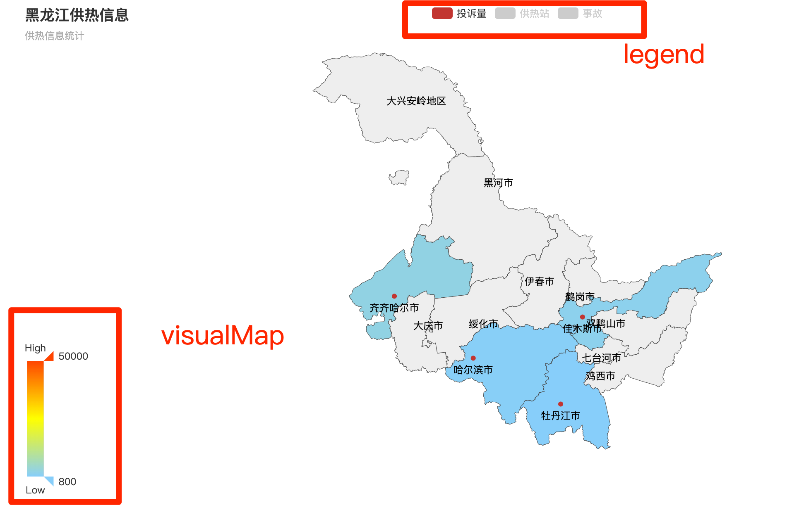
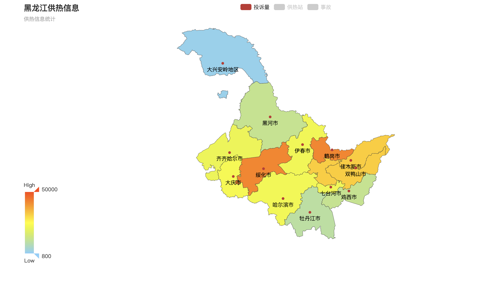

# 初始化

```html
<!DOCTYPE html>
<html lang="en">
<head>
    <meta charset="UTF-8">
    <meta name="viewport" content="width=device-width, initial-scale=1.0">
    <meta http-equiv="X-UA-Compatible" content="ie=edge">

    <script src="jquery-1.11.1.min.js"></script>
    <script src="echarts.min.js"></script>
    <title>Document</title>
</head>
<body>
    <div id="main" style="width: 1200px;height: 600px;"></div>
    <script src="index.js"></script>
</body>
</html>
```

```js
// 基于准备好的dom，初始化echarts实例
var myChart = echarts.init(document.getElementById('main'));
// 指定图表的配置项和数据
 // 指定图表的配置项和数据
 var option = {
    title: {
        text: 'ECharts 入门示例'
    },
    tooltip: {},
    legend: {
        data:['销量']
    },
    xAxis: {
        data: ["衬衫","羊毛衫","雪纺衫","裤子","高跟鞋","袜子"]
    },
    yAxis: {},
    series: [{
        name: '销量',
        type: 'bar',
        data: [5, 20, 36, 10, 10, 20]
    }]
};
// 使用刚指定的配置项和数据显示图表。
myChart.setOption(option);
```

# 使用地图

```js
// 基于准备好的dom，初始化echarts实例
var myChart = echarts.init(document.getElementById('main'));
// 指定图表的配置项和数据
 // 指定图表的配置项和数据
 $.get('./heilongjiang.json', function (geoJson) {
    //向echarts插件注册地图
    echarts.registerMap('HLJ', geoJson);
    var option = {
        tooltip: {
            trigger: 'item',
            formatter: '{b}'
        },
        series: [
            {
                name: '',
                type: 'map',
                mapType: 'HLJ',
                selectedMode : 'multiple',
                label: {
                    normal: {
                        show: true
                    },
                    emphasis: {
                        show: true
                    }
                },
                data:[
                ]
            }
        ]
     };
     myChart.setOption(option);
});
```

# legend和visualMap

```js
// 基于准备好的dom，初始化echarts实例
var myChart = echarts.init(document.getElementById('main'));
// 指定图表的配置项和数据
// 指定图表的配置项和数据
$.get('./heilongjiang.json', function (geoJson) {
    //向echarts插件注册地图
    echarts.registerMap('HLJ', geoJson);
    var option = {
        title: {
            text: '黑龙江供热信息',
            subtext: '供热信息统计',
            // left:'center'
        },
        // 提示
        tooltip: {
            trigger: 'item',
            formatter: '{b}: {c} 件'
        },
        visualMap: {
            min: 800,
            max: 50000,
            text: ['High', 'Low'],
            realtime: false,
            calculable: true,
            inRange: {
                color: ['lightskyblue', 'yellow', 'orangered']
            }
        },
        legend: {
            // 单选多选
            selectedMode: 'single',
            data: ['投诉量', '供热站', '事故']
        },
        series: [
            {
                name: '投诉量',
                type: 'map',
                mapType: 'HLJ',
                selectedMode: 'multiple',
                label: {
                    show: true
                },
                data: [
                    { name: '哈尔滨市', value: 1057.34 },
                    { name: '牡丹江市', value: 57.34 },
                    { name: '齐齐哈尔市', value: 3057.34 },
                    { name: '佳木斯市', value: 2057.34 },
                ]
            },
            {
                name: '供热站',
                type: 'map',
                mapType: 'HLJ',
                selectedMode: 'multiple',
                label: {
                    show: true
                },
                data: [
                    { name: '哈尔滨市', value: 20057.34 },
                    { name: '牡丹江市', value: 10057.34 },
                    { name: '齐齐哈尔市', value: 1057.34 },
                    { name: '佳木斯市', value: 2057.34 },
                ]
            },
            {
                name: '事故',
                type: 'map',
                mapType: 'HLJ',
                selectedMode: 'multiple',
                label: {
                    show: true
                },
                data: [
                    { name: '哈尔滨市', value: 20057.34 },
                    { name: '牡丹江市', value: 10057.34 },
                    { name: '齐齐哈尔市', value: 1057.34 },
                    { name: '佳木斯市', value: 2057.34 },
                ]
            }
        ]
    };
    myChart.setOption(option);
});

```



# 结果

```js
// 基于准备好的dom，初始化echarts实例
var myChart = echarts.init(document.getElementById('main'));
// 指定图表的配置项和数据
var curMap = ''
// 哈尔滨
var hrb = {
   't': [{ name: '依兰县', value: 22223.34 },
   { name: '通河县', value: 10057.34 },
   { name: '方正县', value: 21057.34 },
   { name: '延寿县', value: 32057.34 },
   { name: '木兰县', value: 23057.34 },
   { name: '宾县', value: 42057.34 },
   { name: '巴彦县', value: 12057.34 },
   { name: '尚志市', value: 22057.34 },
   { name: '呼兰区', value: 32057.34 },
   { name: '阿城区', value: 42057.34 },
   { name: '五常市', value: 22057.34 },
   { name: '双城区', value: 12057.34 },
   { name: '松北区', value: 2057.34 },
   { name: '道外区', value: 2057.34 },
   { name: '香坊区', value: 2057.34 },
   { name: '南岗区', value: 2057.34 },
   { name: '道里区', value: 2057.34 },
   { name: '平房区', value: 2057.34 }],
   'g':[{ name: '依兰县', value: 2.34 },
   { name: '通河县', value: 3.34 },
   { name: '方正县', value: 1.34 },
   { name: '延寿县', value: 3.34 },
   { name: '木兰县', value: 4.34 },
   { name: '宾县', value: 1.34 },
   { name: '巴彦县', value: 1.34 },
   { name: '尚志市', value: 2.34 },
   { name: '呼兰区', value: 3.34 },
   { name: '阿城区', value: 4.34 },
   { name: '五常市', value: 1.34 },
   { name: '双城区', value: 2.34 },
   { name: '松北区', value: 2057.34 },
   { name: '道外区', value: 2057.34 },
   { name: '香坊区', value: 2057.34 },
   { name: '南岗区', value: 2057.34 },
   { name: '道里区', value: 2057.34 },
   { name: '平房区', value: 2057.34 }],
   's':[{ name: '依兰县', value: 22223.34 },
   { name: '通河县', value: 23.34 },
   { name: '方正县', value: 21057.34 },
   { name: '延寿县', value: 32057.34 },
   { name: '木兰县', value: 23057.34 },
   { name: '宾县', value: 42057.34 },
   { name: '巴彦县', value: 12057.34 },
   { name: '尚志市', value: 22057.34 },
   { name: '呼兰区', value: 13.34 },
   { name: '阿城区', value: 44.34 },
   { name: '五常市', value: 111.34 },
   { name: '双城区', value: 222.34 },
   { name: '松北区', value: 3333.34 },
   { name: '道外区', value: 4444.34 },
   { name: '香坊区', value: 222.34 },
   { name: '南岗区', value: 22222.34 },
   { name: '道里区', value: 11111.34 },
   { name: '平房区', value: 33333.34 }]
}

var hlj = {
    't': [{ name: '哈尔滨市', value: 22223.34 },
    { name: '牡丹江市', value: 10057.34 },
    { name: '齐齐哈尔市', value: 21057.34 },
    { name: '佳木斯市', value: 32057.34 },
    { name: '大庆市', value: 23057.34 },
    { name: '鹤岗市', value: 42057.34 },
    { name: '鸡西市', value: 12057.34 },
    { name: '七台河市', value: 22057.34 },
    { name: '双鸭山市', value: 32057.34 },
    { name: '绥化市', value: 42057.34 },
    { name: '伊春市', value: 22057.34 },
    { name: '黑河市', value: 12057.34 },
    { name: '大兴安岭地区', value: 2057.34 }],
    'g':[{ name: '哈尔滨市', value: 4 },
    { name: '牡丹江市', value: 1 },
    { name: '齐齐哈尔市', value: 2 },
    { name: '佳木斯市', value: 4 },
    { name: '大庆市', value: 23 },
    { name: '鹤岗市', value: 12 },
    { name: '鸡西市', value: 1 },
    { name: '七台河市', value: 2 },
    { name: '双鸭山市', value: 2 },
    { name: '绥化市', value: 3 },
    { name: '伊春市', value: 4 },
    { name: '黑河市', value: 5 },
    { name: '大兴安岭地区', value: 2 }],
    's':[{ name: '哈尔滨市', value: 34 },
    { name: '牡丹江市', value: 1 },
    { name: '齐齐哈尔市', value: 33 },
    { name: '佳木斯市', value: 2 },
    { name: '大庆市', value: 3 },
    { name: '鹤岗市', value: 44 },
    { name: '鸡西市', value: 23 },
    { name: '七台河市', value: 21 },
    { name: '双鸭山市', value: 22 },
    { name: '绥化市', value: 1 },
    { name: '伊春市', value: 2 },
    { name: '黑河市', value: 3 },
    { name: '大兴安岭地区', value: 4 }]
 }

function loadMap(mapName) {
    var tousu = []
    var shigu = []
    var gongre = []
    if(mapName == '黑龙江省'){
        tousu = hlj.t
        shigu = hlj.s
        gongre = hlj.g
    }
    if(mapName == '哈尔滨市'){
        tousu = hrb.t
        shigu = hrb.s
        gongre = hrb.g
    }
    $.get('./230000/' + mapName + '.geoJson', function (geoJson) {
        //向echarts插件注册地图
        echarts.registerMap('HLJ', geoJson);
        var option = {
            title: {
                text: '黑龙江供热信息',
                subtext: '供热信息统计',
                // left:'center'
            },
            // 提示
            tooltip: {
                trigger: 'item',
                formatter: '{b}: {c} '
            },
            toolbox: {
                feature: {

                    // restore: {},
                    // saveAsImage: {}
                    myTool1: {
                        show: true,
                        title: '返回上一级',
                        icon: 'path://M684.032 403.456q-17.408-8.192-15.872-22.016t11.776-22.016q3.072-2.048 19.968-15.872t41.472-33.28q-43.008-49.152-102.4-77.312t-129.024-28.16q-64.512 0-120.832 24.064t-98.304 66.048-66.048 98.304-24.064 120.832q0 63.488 24.064 119.808t66.048 98.304 98.304 66.048 120.832 24.064q53.248 0 100.864-16.896t87.04-47.616 67.584-72.192 41.472-90.624q7.168-23.552 26.624-38.912t46.08-15.36q31.744 0 53.76 22.528t22.016 53.248q0 14.336-5.12 27.648-21.504 71.68-63.488 132.096t-99.84 103.936-128.512 68.096-148.48 24.576q-95.232 0-179.2-35.84t-145.92-98.304-98.304-145.92-36.352-178.688 36.352-179.2 98.304-145.92 145.92-98.304 179.2-36.352q105.472 0 195.584 43.52t153.6 118.272q23.552-17.408 39.424-30.208t19.968-15.872q6.144-5.12 13.312-7.68t13.312 0 10.752 10.752 6.656 24.576q1.024 9.216 2.048 31.232t2.048 51.2 1.024 60.416-1.024 58.88q-1.024 34.816-16.384 50.176-8.192 8.192-24.576 9.216t-34.816-3.072q-27.648-6.144-60.928-13.312t-63.488-14.848-53.248-14.336-29.184-9.728',
                        onclick: function () {
                            location.reload()
                        }
                    },
                }
            },
            visualMap: {
                min: 800,
                max: 50000,
                text: ['High', 'Low'],
                realtime: false,
                calculable: true,
                inRange: {
                    color: ['lightskyblue', 'yellow', 'orangered']
                }
            },
            legend: {
                // 单选多选
                selectedMode: 'single',
                data: ['投诉量', '供热站', '事故']
            },
            series: [
                {
                    name: '投诉量',
                    type: 'map',
                    mapType: 'HLJ',
                    selectedMode: 'multiple',
                    label: {
                        show: true,
                        // distance : 22
                        // position: [-20, 30],
                    },
                    data: tousu
                },
                {
                    name: '供热站',
                    type: 'map',
                    mapType: 'HLJ',
                    selectedMode: 'multiple',
                    label: {
                        show: true
                    },
                    data: gongre
                },
                {
                    name: '事故',
                    type: 'map',
                    mapType: 'HLJ',
                    selectedMode: 'multiple',
                    label: {
                        show: true
                    },
                    data: shigu
                }
            ]
        };
        myChart.setOption(option);
        curMap = mapName
    });
}

loadMap('黑龙江省');
myChart.on('mapselectchanged', function (params) {
    var name = params.batch[0].name;
    loadMap(name)
})


```



# 仪表盘

```html
<!DOCTYPE html>
<html lang="en">

<head>
    <meta charset="UTF-8">
    <meta name="viewport" content="width=device-width, initial-scale=1.0">
    <title>Document</title>
    <script src="https://cdn.bootcss.com/jquery/3.4.1/jquery.min.js"></script>
    <script src="https://cdn.bootcss.com/echarts/4.6.0/echarts-en.min.js"></script>
</head>

<body>
    <div id="main" style="width: 1200px;height: 600px;"></div>
    <script>
        // 基于准备好的dom，初始化echarts实例
        var myChart = echarts.init(document.getElementById('main'));
        option = {
            backgroundColor: '#1b1b1b',
            tooltip: {
                formatter: '{a} <br/>{c} {b}'
            },
            toolbox: {
                show: true,
                feature: {
                    mark: { show: true },
                    restore: { show: true },
                    saveAsImage: { show: true }
                }
            },
            series: [
                {
                    name: '速度',
                    type: 'gauge',
                    min: 0,
                    max: 220,
                    splitNumber: 11,
                    radius: '50%',
                    axisLine: {            // 坐标轴线
                        lineStyle: {       // 属性lineStyle控制线条样式
                            color: [[0.09, 'lime'], [0.82, '#1e90ff'], [1, '#ff4500']],
                            width: 3,
                            shadowColor: '#fff', //默认透明
                            shadowBlur: 10
                        }
                    },
                    axisLabel: {            // 坐标轴小标记
                        fontWeight: 'bolder',
                        color: '#fff',
                        shadowColor: '#fff', //默认透明
                        shadowBlur: 10
                    },
                    axisTick: {            // 坐标轴小标记
                        length: 15,        // 属性length控制线长
                        lineStyle: {       // 属性lineStyle控制线条样式
                            color: 'auto',
                            shadowColor: '#fff', //默认透明
                            shadowBlur: 10
                        }
                    },
                    splitLine: {           // 分隔线
                        length: 25,         // 属性length控制线长
                        lineStyle: {       // 属性lineStyle（详见lineStyle）控制线条样式
                            width: 3,
                            color: '#fff',
                            shadowColor: '#fff', //默认透明
                            shadowBlur: 10
                        }
                    },
                    pointer: {           // 分隔线
                        shadowColor: '#fff', //默认透明
                        shadowBlur: 5
                    },
                    title: {
                        textStyle: {       // 其余属性默认使用全局文本样式，详见TEXTSTYLE
                            fontWeight: 'bolder',
                            fontSize: 20,
                            fontStyle: 'italic',
                            color: '#fff',
                            shadowColor: '#fff', //默认透明
                            shadowBlur: 10
                        }
                    },
                    detail: {
                        backgroundColor: 'rgba(30,144,255,0.8)',
                        borderWidth: 1,
                        borderColor: '#fff',
                        shadowColor: '#fff', //默认透明
                        shadowBlur: 5,
                        offsetCenter: [0, '50%'],       // x, y，单位px
                        textStyle: {       // 其余属性默认使用全局文本样式，详见TEXTSTYLE
                            fontWeight: 'bolder',
                            color: '#fff'
                        }
                    },
                    data: [{ value: 40, name: 'km/h' }]
                },
                {
                    name: '转速',
                    type: 'gauge',
                    center: ['25%', '55%'],    // 默认全局居中
                    radius: '30%',
                    min: 0,
                    max: 7,
                    endAngle: 45,
                    splitNumber: 7,
                    axisLine: {            // 坐标轴线
                        lineStyle: {       // 属性lineStyle控制线条样式
                            color: [[0.29, 'lime'], [0.86, '#1e90ff'], [1, '#ff4500']],
                            width: 2,
                            shadowColor: '#fff', //默认透明
                            shadowBlur: 10
                        }
                    },
                    axisLabel: {            // 坐标轴小标记
                        fontWeight: 'bolder',
                        color: '#fff',
                        shadowColor: '#fff', //默认透明
                        shadowBlur: 10
                    },
                    axisTick: {            // 坐标轴小标记
                        length: 12,        // 属性length控制线长
                        lineStyle: {       // 属性lineStyle控制线条样式
                            color: 'auto',
                            shadowColor: '#fff', //默认透明
                            shadowBlur: 10
                        }
                    },
                    splitLine: {           // 分隔线
                        length: 20,         // 属性length控制线长
                        lineStyle: {       // 属性lineStyle（详见lineStyle）控制线条样式
                            width: 3,
                            color: '#fff',
                            shadowColor: '#fff', //默认透明
                            shadowBlur: 10
                        }
                    },
                    pointer: {
                        width: 5,
                        shadowColor: '#fff', //默认透明
                        shadowBlur: 5
                    },
                    title: {
                        offsetCenter: [0, '-30%'],       // x, y，单位px
                        textStyle: {       // 其余属性默认使用全局文本样式，详见TEXTSTYLE
                            fontWeight: 'bolder',
                            fontStyle: 'italic',
                            color: '#fff',
                            shadowColor: '#fff', //默认透明
                            shadowBlur: 10
                        }
                    },
                    detail: {
                        //backgroundColor: 'rgba(30,144,255,0.8)',
                        // borderWidth: 1,
                        borderColor: '#fff',
                        shadowColor: '#fff', //默认透明
                        shadowBlur: 5,
                        width: 80,
                        height: 30,
                        offsetCenter: [25, '20%'],       // x, y，单位px
                        textStyle: {       // 其余属性默认使用全局文本样式，详见TEXTSTYLE
                            fontWeight: 'bolder',
                            color: '#fff'
                        }
                    },
                    data: [{ value: 1.5, name: 'x1000 r/min' }]
                },
                {
                    name: '油表',
                    type: 'gauge',
                    center: ['75%', '50%'],    // 默认全局居中
                    radius: '30%',
                    min: 0,
                    max: 2,
                    startAngle: 135,
                    endAngle: 45,
                    splitNumber: 2,
                    axisLine: {            // 坐标轴线
                        lineStyle: {       // 属性lineStyle控制线条样式
                            color: [[0.2, 'lime'], [0.8, '#1e90ff'], [1, '#ff4500']],
                            width: 2,
                            shadowColor: '#fff', //默认透明
                            shadowBlur: 10
                        }
                    },
                    axisTick: {            // 坐标轴小标记
                        length: 12,        // 属性length控制线长
                        lineStyle: {       // 属性lineStyle控制线条样式
                            color: 'auto',
                            shadowColor: '#fff', //默认透明
                            shadowBlur: 10
                        }
                    },
                    axisLabel: {
                        fontWeight: 'bolder',
                        color: '#fff',
                        shadowColor: '#fff', //默认透明
                        shadowBlur: 10,
                        formatter: function (v) {
                            switch (v + '') {
                                case '0': return 'E';
                                case '1': return 'Gas';
                                case '2': return 'F';
                            }
                        }
                    },
                    splitLine: {           // 分隔线
                        length: 15,         // 属性length控制线长
                        lineStyle: {       // 属性lineStyle（详见lineStyle）控制线条样式
                            width: 3,
                            color: '#fff',
                            shadowColor: '#fff', //默认透明
                            shadowBlur: 10
                        }
                    },
                    pointer: {
                        width: 2,
                        shadowColor: '#fff', //默认透明
                        shadowBlur: 5
                    },
                    title: {
                        show: false
                    },
                    detail: {
                        show: false
                    },
                    data: [{ value: 0.5, name: 'gas' }]
                },
                {
                    name: '水表',
                    type: 'gauge',
                    center: ['75%', '50%'],    // 默认全局居中
                    radius: '30%',
                    min: 0,
                    max: 2,
                    startAngle: 315,
                    endAngle: 225,
                    splitNumber: 2,
                    axisLine: {            // 坐标轴线
                        lineStyle: {       // 属性lineStyle控制线条样式
                            color: [[0.2, 'lime'], [0.8, '#1e90ff'], [1, '#ff4500']],
                            width: 2,
                            shadowColor: '#fff', //默认透明
                            shadowBlur: 10
                        }
                    },
                    axisTick: {            // 坐标轴小标记
                        show: false
                    },
                    axisLabel: {
                        fontWeight: 'bolder',
                        color: '#fff',
                        shadowColor: '#fff', //默认透明
                        shadowBlur: 10,
                        formatter: function (v) {
                            switch (v + '') {
                                case '0': return 'H';
                                case '1': return 'Water';
                                case '2': return 'C';
                            }
                        }
                    },
                    splitLine: {           // 分隔线
                        length: 15,         // 属性length控制线长
                        lineStyle: {       // 属性lineStyle（详见lineStyle）控制线条样式
                            width: 3,
                            color: '#fff',
                            shadowColor: '#fff', //默认透明
                            shadowBlur: 10
                        }
                    },
                    pointer: {
                        width: 2,
                        shadowColor: '#fff', //默认透明
                        shadowBlur: 5
                    },
                    title: {
                        show: false
                    },
                    detail: {
                        show: false
                    },
                    data: [{ value: 0.5, name: 'gas' }]
                }
            ]
        };

        setInterval(function () {
            option.series[0].data[0].value = (Math.random() * 100).toFixed(2) - 0;
            option.series[1].data[0].value = (Math.random() * 7).toFixed(2) - 0;
            option.series[2].data[0].value = (Math.random() * 2).toFixed(2) - 0;
            option.series[3].data[0].value = (Math.random() * 2).toFixed(2) - 0;
            myChart.setOption(option);
        }, 2000);

        myChart.setOption(option);
    </script>
</body>

</html>
```

