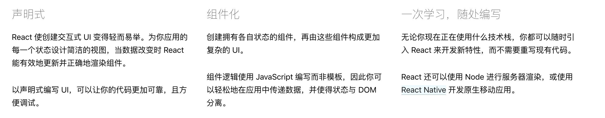
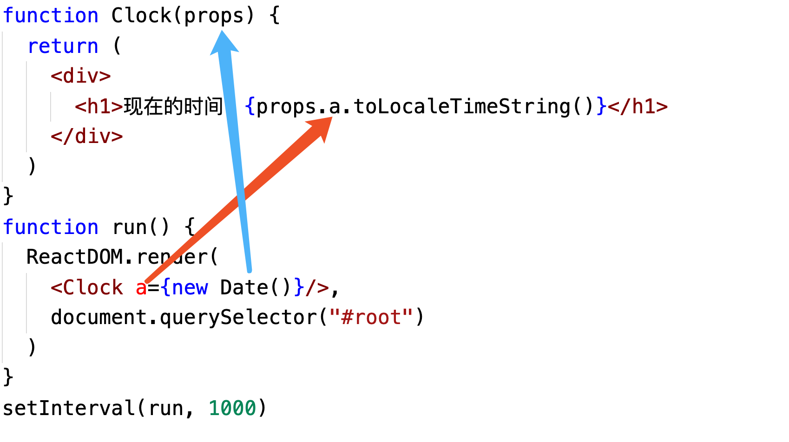
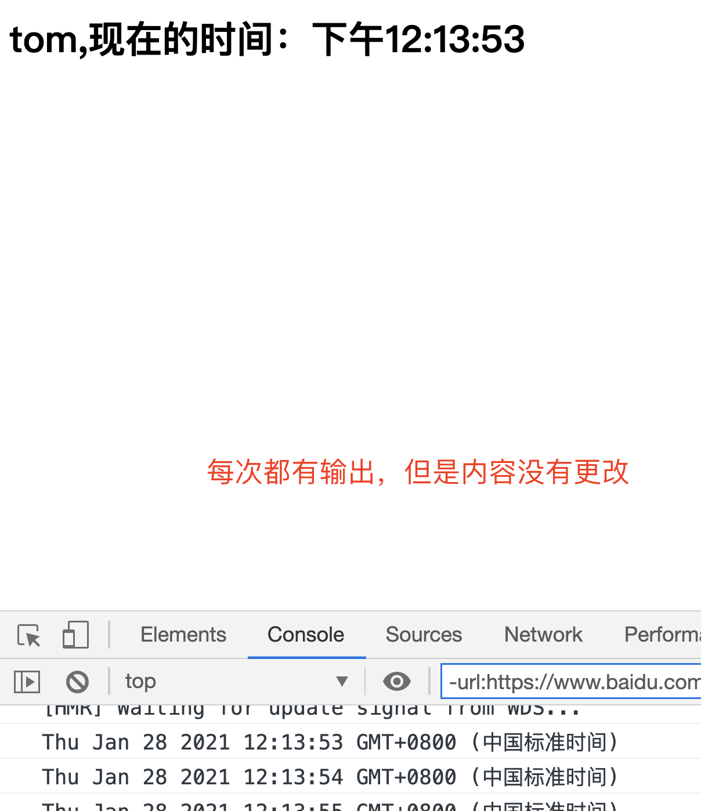

# React01

用于构建用户界面的 JavaScript 库

https://react.docschina.org/

## 1、特点



1、声明式的设计

2、高效，采用虚拟DOM来实现DOM的渲染，最大限度的减少DOM的操作。

3、灵活，跟其他库灵活搭配使用。

4、JSX，俗称JS里面写HTML， JavaScript语法的扩展。

5、组件化，模块化。代码容易复用，2016年之前大型项目非常喜欢 react

6、单向数据流。没有实现数据的双向绑定。数据一》视图一》事件一》数据

## 2、创建项目

```js
npm install -g create-react-app

create-react-app demo(自定义项目名称)
cd demo
启动项目：npm start
```

## 3、元素渲染

```js
//jsx语法  就是在js里写html
import App from './App';
let app = <App></App>
->
let app = <App/>
```

index.js

```js
import React from 'react';
import ReactDOM from 'react-dom';
import './index.css';
import App from './App';
import reportWebVitals from './reportWebVitals';
let h1 = <h1>hello</h1>
ReactDOM.render(h1,document.getElementById('root')
);

// If you want to start measuring performance in your app, pass a function
// to log results (for example: reportWebVitals(console.log))
// or send to an analytics endpoint. Learn more: https://bit.ly/CRA-vitals
reportWebVitals();
```

```js
let h1 = <h1>hello</h1>
使用JSX的写法，可以创建js元素对象
注意：JSX元素对象，或者组件对象，必须只有1个根元素(根节点)

不能这么写
let h1 = <h1>hello</h1><span></span>
也就是只有一个父元素，可以这么写
let h1 = <h1>hello<span></span></h1>
```

函数渲染

```js
import React from 'react';
import ReactDOM from 'react-dom';
import './index.css';
import App from './App';


function clock() {
  let time = new Date().toLocaleTimeString()
  let item = <h1>现在的时间：{time}</h1>
  let root = document.querySelector('#root')
  ReactDOM.render(item,root)
}

setInterval(clock,1000)
```

函数式组件

```js
import React from 'react';
import ReactDOM from 'react-dom';
import './index.css';
import App from './App';
function Clock(props) {
  return (
    <div>
      <h1>现在的时间：{props.a.toLocaleTimeString()}</h1>
    </div>
  )
}
function run() {
  ReactDOM.render(
    <Clock a={new Date()}/>,
    document.querySelector("#root")
  )
}
setInterval(run, 1000)
```



## 4、JSX语法

优点（自己说的，过时了，因为vue的出现）

- jsx执行更快，编译为js代码时进行了优化
- 类型更安全，编译过程出错就直接报错不能编译
- 编写模板简洁快速

注意：

- 必须有根节点
- 正常的普通HTML元素要小写，如果是大写，默认是组件

### 表达式

index.js

```js
import React from 'react';
import ReactDOM from 'react-dom';
let element = (
  <div>
    <h1>hello world!!!</h1>
    <h2>{1+1}</h2>
  </div>
)
ReactDOM.render(
  element,document.querySelector("#root")
)
```

```js
import React from 'react';
import ReactDOM from 'react-dom';
let element = (
  <div>
    <h1>hello world!!!</h1>
    <h2>{"当前时间："+new Date()}</h2>
  </div>
)
ReactDOM.render(
  element,document.querySelector("#root")
)
```

三元运算符

```js
import React from 'react';
import ReactDOM from 'react-dom';
let str = "发烧"
let element = (
  <div>
    <h1>hello world!!!</h1>
    <h2>{str=="发烧"?'隔离':'不隔离'}</h2>
  </div>
)
ReactDOM.render(
  element, document.querySelector("#root")
)

//也可以这么写
 <h2>{str=="发烧"?<button>隔离</button>:'不隔离'}</h2>
```

### 添加样式

```js
import React from 'react';
import ReactDOM from 'react-dom';
import './App.css'
let str = "发烧"
let bg = "bg"
let element = (
  <div>
    <h1 class="bg">hello world!!!</h1>
    <h2 className={bg}>{str=="发烧"?<button>隔离</button>:'不隔离'}</h2>
  </div>
)
ReactDOM.render(
  element, document.querySelector("#root")
)

//多个类名 不能一起写
 <h2 class="abc" className={bg}></h2>
//应该这样写
<h2 className={"abc "+bg}></h2>

let cs = ['abc','bg'].join(' ')
<h2 className={cs}></h2>
```

```css
/* app.css 背景色 */
.bg {
  background-color: red;
}
```

两种方法都可以，建议写className ，因为class是关键词，在早版本会报错

添加图片

```js
import React from 'react';
import ReactDOM from 'react-dom';
import './App.css'
let str = "发烧"
let bg = "bg"
let element = (
  <div>
    <h1 class="bg">hello world!!!</h1>
    <h2 className={bg}>{str=="发烧"?<button>隔离</button>:'不隔离'}</h2>
    
  </div>
)
ReactDOM.render(
  element, document.querySelector("#root")
)
```

- 由html元素构成
- 中间如果需要插入变量用 {}
- {} 中间可以使用表达式
- {} 中间表达式中可以使用jsx对象
- 属性和html内容一样都是用{} 来插入内容

### style样式

```js
import React from 'react';
import ReactDOM from 'react-dom';
import './App.css'
let divStyle = {
  background:"red",
  borderBottom:"10px solid blue"
}
let element = (
  <div >
    <h1 style={divStyle}>hello world!!!</h1>
  </div>
)
ReactDOM.render(
  element, document.querySelector("#root")
)
```

注释

```js
  {/* jsx的注释 */}
```

## 5、组件

### 函数式组件

之前已经讲过，注意的是，函数名首字母必须大写

返回的还是模板

### 类组件

```js
import React from 'react';
import ReactDOM from 'react-dom';
class Hello extends React.Component {
  render() {
    return (
      <div >
        <h1 >类组件：hello world!!!</h1>
      </div>
    )
  }
}
ReactDOM.render(
  <Hello />
  , document.querySelector("#root")
)
```

#### 组件嵌套

```js
import React from 'react';
import ReactDOM from 'react-dom';
function Clock(props) {
  return (
    <div>
      <h1>现在的时间：{props.a.toLocaleTimeString()}</h1>
    </div>
  )
}
class Hello extends React.Component {
  render() {
    return (
      <div >
        <h1 >类组件：hello world!!!</h1>
        <Clock a={new Date()}/>
      </div>
    )
  }
}
ReactDOM.render(
  <Hello />
  , document.querySelector("#root")
)
```

注意：渲染只能是一个组件

#### 类组件传参

```js
import React from 'react';
import ReactDOM from 'react-dom';
function Clock(props) {
  return (
    <div>
      <h1>现在的时间：{props.a.toLocaleTimeString()}</h1>
    </div>
  )
}
class Hello extends React.Component {
  render() {
    console.log(this)
    let name = this.props.name
    return (
      <div >
        <h1 >类组件：hello world!!! {name}</h1>
        <Clock a={new Date()}/>
      </div>
    )
  }
}
ReactDOM.render(
  <Hello name="tom"/>
  , document.querySelector("#root")
)
```

函数式比较简单，一般用于静态没有交互事件内容的组件页面

类组件，一般叫动态组件，会有交互或者数据修改的操作

## 6、React State

相当于vue的data，但是它没有双向数据绑定

```js
import React from 'react';
import ReactDOM from 'react-dom';
class Clock extends React.Component {
  constructor(props) {
    super(props)
    // 状态 state -> 数据 -> view
    this.state = {
      time: new Date().toLocaleTimeString(),
      name:"tom"
    }
  }
  render() {
    return (
      <div>
        <h1>{this.state.name},现在的时间：{this.state.time}</h1>
      </div>
    )
  }
}
//  ReactDOM.render(
//    <Clock/>
//    , document.querySelector("#root")
// )

setInterval(()=>{
  ReactDOM.render(
    <Clock/>
    , document.querySelector("#root")
  )
},1000)
```

这时发现并没有生效，测试

```js
import React from 'react';
import ReactDOM from 'react-dom';
class Clock extends React.Component {
  constructor(props) {
    super(props)
    // 状态 state -> 数据 -> view
    this.state = {
      time: new Date().toLocaleTimeString(),
      name:"tom"
    }
  }
  render() {
    return (
      <div>
        <h1>{this.state.name},现在的时间：{this.state.time}</h1>
      </div>
    )
  }
}
setInterval(()=>{
  ReactDOM.render(
    <Clock/>
    , document.querySelector("#root")
  )
  
  
  console.log(new Date());
},1000)
```




构造函数默认只调用一次，但是渲染函数会每次调用

```js
import React from 'react';
import ReactDOM from 'react-dom';
class Clock extends React.Component {
  constructor(props) {
    super(props)
    // 状态 state -> 数据 -> view
    this.state = {
      time: new Date().toLocaleTimeString(),
      name:"tom"
    }
  }
  render() {
    this.state = {
      time: new Date().toLocaleTimeString(),
      name:"tom"
    }
    return (
      <div>
        <h1>{this.state.name},现在的时间：{this.state.time}</h1>
      </div>
    )
  }
}
setInterval(()=>{
  ReactDOM.render(
    <Clock/>
    , document.querySelector("#root")
  )
},1000)
```

改造代码

```js
import React from 'react';
import ReactDOM from 'react-dom';
class Clock extends React.Component {
  constructor(props) {
    super(props)
    // 状态 state -> 数据 -> view
    this.state = {
      time: new Date().toLocaleTimeString(),
      name: "tom"
    }
  }
  render() {
    this.state = {
      time: new Date().toLocaleTimeString(),
      name: "tom"
    }
    return (
      <div>
        <h1>{this.state.name},现在的时间：{this.state.time}</h1>
      </div>
    )
  }
  // 生命周期函数，组件渲染完成时调用的函数
  componentDidMount() {
    setInterval(() => {
      // 每次都触发，但是不会调用render函数
      console.log(this.state.time);
      // 修改数据
      // this.state = {
      //   time: new Date().toLocaleTimeString(),
      //   name: "tom"
      // }
      this.setState({
        time: new Date().toLocaleTimeString(),
        name: "tom"
      })
    }, 1000)
  }
}

ReactDOM.render(
  <Clock />
  , document.querySelector("#root")
)
```


## 7、案例：切换

```js
import React from 'react';
import ReactDOM from 'react-dom';
import './App.css'
class Tab extends React.Component {
  constructor(props) {
    super(props)
    this.state = {
      c1:"",
      c2:""
    }
  }
  g1(e){
    console.log(e.target.dataset.index);
  }
  render() {
    return (
      <div>
        <button data-index="1" onClick={this.g1}>go1</button>
        <button data-index="2" onClick={this.g1}>go2</button>
        <h1 className="content active">内容1</h1>
        <h1 className="content">内容2</h1>
      </div>
    )
  }
}

ReactDOM.render(
  <Tab />
  , document.querySelector("#root")
)
```

```js
import React from 'react';
import ReactDOM from 'react-dom';
import './App.css'
class Tab extends React.Component {
  constructor(props) {
    super(props)
    this.state = {
      c1:"content active",
      c2:"content"
    }
    this.g1 = this.g1.bind(this)
  }
  g1(e){
    console.log(e.target.dataset.index);
    let index = e.target.dataset.index
    if(index==='1'){
      this.setState({
        c1:"content active",
        c2:"content"
      })
    }else{
      this.setState({
        c2:"content active",
        c1:"content"
      })
    }
  }
  render() {
    return (
      <div>
        <button data-index="1" onClick={this.g1}>go1</button>
        <button data-index="2" onClick={this.g1}>go2</button>
        <h1 className={this.state.c1}>内容1</h1>
        <h1 className={this.state.c2}>内容2</h1>
      </div>
    )
  }
}

ReactDOM.render(
  <Tab />
  , document.querySelector("#root")
)
```

```css
.content {
  display: none;
}
.content.active {
  display: block;
}
```

## 8、父传子

```js
import React from 'react';
import ReactDOM from 'react-dom';
class Clock extends React.Component {
  constructor(props) {
    super(props)
    // this.state={} 不加这句警告
    // Useless constructor  no-useless-constructor
  }
  render() {
    console.log(this.props.futozi);
    return (
      <div>
        <h1>{this.props.futozi}</h1>
      </div>
    )
  }
}
class Hello extends React.Component {
  constructor(props) {
    super(props)
    this.state = {
      age: 18
    }
  }
  render() {
    console.log(this)
    let name = this.props.name
    return (
      <div >
        <h1 >类组件：hello world!!! {name}</h1>
        <Clock futozi={this.state.age} />
      </div>
    )
  }
}
ReactDOM.render(
  <Hello name="tom" />
  , document.querySelector("#root")
)
```

## 9、子传父

调用父元素的函数从而操作父元素的数据，从而实现数据从子元素传递至父元素

```js
import React from 'react';
import ReactDOM from 'react-dom';
class Clock extends React.Component {
  constructor(props) {
    super(props)
    this.state = {
      msg: "子组件的msg"
    }
  }
  render() {
    console.log(this);
    return (
      <div>
        <button onClick={this.send}>传递msg给父组件</button>
      </div>
    )
  }
  send = ()=>{
    console.log(this.state.msg);
    console.log(this.props);
    {/* 2 通过props获取传递过来的函数 */} 
    this.props.setChildData(this.state.msg)
  }
}
class Hello extends React.Component {
  constructor(props) {
    super(props)
    this.state = {
      childData: "haha",
      age: 18
    }
    // this.setChildData = this.setChildData.bind(this)
  }
  render() {
    return (
      <div >
        <h1 >{this.state.age} </h1>
        <h1 >子传递过来的数据：{this.state.childData} </h1>
        {/* 1 先把函数传给子组件 */}
        <Clock setChildData={this.setChildData} />
      </div>
    )
  }
  // ES6 写法 不用再上面写bind了
  setChildData = (data) => {
    console.log(data);
       {/* 3 渲染数据 */} 
    this.setState({
      childData: data
    })
  }
}
ReactDOM.render(
  <Hello name="tom" />
  , document.querySelector("#root")
)
```

