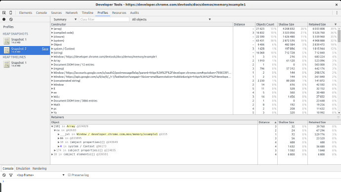

# JavaScript 内存泄露问题


内存泄露是每个开发者最终都不得不面对的问题。即便使用自动内存管理的语言，你还是会碰到一些内存泄漏的情况。内存泄露会导致一系列问题，比如：运行缓慢，崩溃，高延迟，甚至一些与其他应用相关的问题。

### 什么是内存泄漏

本质上来讲，内存泄露是当一块内存不再被应用程序使用的时候，由于某种原因，这块内存没有返还给操作系统或者空闲内存池的现象。编程语言使用不同的方式来管理内存。这些方式可能会减少内存泄露的机会。然而，某一块具体的内存是否被使用实际上是一个不可判定问题（undecidable problem）。换句话说，只有开发者可以搞清楚一块内存是否应该被操作系统回收。某些编程语言提供了帮助开发者来处理这件事情的特性。而其它的编程语言需要开发者明确知道内存的使用情况。维基百科上有几篇写的不错的讲述[手动 ](https://en.wikipedia.org/wiki/Manual_memory_management)和[自动](https://en.wikipedia.org/wiki/Manual_memory_management)内存管理的文章。

### Javascript 的内存管理

Javascript 是那些被称作垃圾回收语言当中的一员。垃圾回收语言通过周期性地检查那些之前被分配出去的内存是否可以从应用的其他部分访问来帮助开发者管理内存。换句话说，垃圾回收语言将内存管理的问题从“什么样的内存是仍然被使用的？”简化成为“什么样的内存仍然可以从应用程序的其他部分访问？”。两者的区别是细微的，但是很重要：开发者只需要知道一块已分配的内存是否会在将来被使用，而不可访问的内存可以通过算法确定并标记以便返还给操作系统。

> 非垃圾回收语言通常使用其他的技术来管理内存，包括：显式内存管理，程序员显式地告诉编译器在何时不再需要某块内存；引用计数，一个计数器关联着每个内存块（当计数器的计数变为0的时候，这块内存就被操作系统回收）。这些技术都有它们的折中考虑（也就是说都有潜在的内存泄漏风险）。

### Javascript 中的内存泄露

引起垃圾收集语言内存泄露的主要原因是不必要的引用。想要理解什么是不必要的引用，首先我们需要理解垃圾收集器是怎样确定一块内存能否被访问的。

#### Mark-and-sweep

大多数的垃圾收集器（简称 GC）使用一个叫做 mark-and-sweep 的算法。这个算法由以下的几个步骤组成：

垃圾收集器建立了一个“根节点”列表。根节点通常是那些引用被保留在代码中的全局变量。对于 Javascript 而言，“Window” 对象就是一个能作为根节点的全局变量例子。window 对象是一直都存在的（即：不是垃圾）。所有根节点都是检查过的并且被标记为活动的（即：不是垃圾）。所有的子节点也都被递归地检查过。每块可以从根节点访问的内存都不会被视为垃圾。 所有没有被标记为垃圾的内存现在可以被当做垃圾，而垃圾收集器也可以释放这些内存并将它们返还给操作系统。现代垃圾收集器使用不同的方式来改进这些算法，但是它们都有相同的本质：可以访问的内存块被标记为非垃圾而其余的就被视为垃圾。

不必要的引用就是那些程序员知道这块内存已经没用了，但是出于某种原因这块内存依然存在于活跃的根节点发出的节点树中。在 Javascript 的环境中，不必要的引用是某些不再被使用的代码中的变量。这些变量指向了一块本来可以被释放的内存。一些人认为这是程序员的失误。

所以想要理解什么是 Javascript 中最常见的内存泄露，我们需要知道在什么情况下会出现不必要的引用。

### 3 种常见的 Javascript 内存泄露

#### 【1】意外的全局变量

Javascript 语言的设计目标之一是开发一种类似于 Java 但是对初学者十分友好的语言。体现 JavaScript 宽容性的一点表现在它处理未声明变量的方式上：一个未声明变量的引用会在全局对象中创建一个新的变量。在浏览器的环境下，全局对象就是 window，也就是说：

```js
`function foo(arg) {``    ``bar =``'this is a hidden global variable'``;``}　`
```

实际上是： 

```js
`function foo(arg) {``    ``window.bar =``'this is an explicit global variable'``;``}`
```

如果 bar 是一个应该指向 foo 函数作用域内变量的引用，但是你忘记使用 var 来声明这个变量，这时一个全局变量就会被创建出来。在这个例子中，一个简单的字符串泄露并不会造成很大的危害，但这无疑是错误的。

另外一种偶然创建全局变量的方式如下：

```js
`function foo() {``    ``this``.variable =``"potential accidental global"``;``}``// Foo called on its own, this points to the global object (window)``// rather than being undefined.``// 函数自身发生了调用，this 指向全局对象（window），（译者注：这时候会为全局对象 window 添加一个 variable 属性）而不是 undefined。`` ` `foo();`
```

> 为了防止这种错误的发生，可以在你的 JavaScript 文件开头添加 `'use strict';`语句。这个语句实际上开启了解释 JavaScript 代码的严格模式，这种模式可以避免创建意外的全局变量。

**全局变量的注意事项**

尽管我们在讨论那些隐蔽的全局变量，但是也有很多代码被明确的全局变量污染的情况。按照定义来讲，这些都是不会被回收的变量（除非设置 null 或者被重新赋值）。特别需要注意的是那些被用来临时存储和处理一些大量的信息的全局变量。如果你必须使用全局变量来存储很多的数据，请确保在使用过后将它设置为 null 或者将它重新赋值。常见的和全局变量相关的引发内存消耗增长的原因就是缓存。缓存存储着可复用的数据。为了让这种做法更高效，必须为缓存的容量规定一个上界。由于缓存不能被及时回收的缘故，缓存无限制地增长会导致很高的内存消耗。

#### 【2】被遗漏的定时器和回调函数

在 JavaScript 中 setInterval 的使用十分常见。其他的库也经常会提供观察者和其他需要回调的功能。这些库中的绝大部分都会关注一点，就是当它们本身的实例被销毁之前销毁所有指向回调的引用。在 setInterval 这种情况下，一般情况下的代码是这样的：

```js
`var``someResource = getData();``setInterval(function() {``    ``var``node = document.getElementById(``'Node'``);``    ``if``(node) {``        ``// Do stuff with node and someResource.``        ``node.innerHTML = JSON.stringify(someResource));``    ``}``}, 1000);`
```

这个例子说明了摇晃的定时器会发生什么：引用节点或者数据的定时器已经没用了。那些表示节点的对象在将来可能会被移除掉，所以将整个代码块放在周期处理函数中并不是必要的。然而，由于周期函数一直在运行，处理函数并不会被回收（只有周期函数停止运行之后才开始回收内存）。如果周期处理函数不能被回收，它的依赖程序也同样无法被回收。这意味着一些资源，也许是一些相当大的数据都也无法被回收。

下面举一个观察者的例子，当它们不再被需要的时候（或者关联对象将要失效的时候）显式地将他们移除是十分重要的。在以前，尤其是对于某些浏览器（IE6）是一个至关重要的步骤，因为它们不能很好地管理循环引用（下面的代码描述了更多的细节）。现在，当观察者对象失效的时候便会被回收，即便 listener 没有被明确地移除，绝大多数的浏览器可以或者将会支持这个特性。尽管如此，在对象被销毁之前移除观察者依然是一个好的实践。示例如下：

```js
`var``element = document.getElementById(``'button'``);`` ` `function onClick(``event``) {``    ``element.innerHtml =``'text'``;``}`` ` `element.addEventListener(``'click'``, onClick);``// Do stuff``element.removeEventListener(``'click'``, onClick);``element.parentNode.removeChild(element);``// Now when element goes out of scope,``// both element and onClick will be collected even in old browsers that don't``// handle cycles well.`
```

**对象观察者和循环引用中一些需要注意的点**

观察者和循环引用常常会让 JavaScript 开发者踩坑。以前在 IE 浏览器的垃圾回收器上会导致一个 bug（或者说是浏览器设计上的问题）。旧版本的 IE 浏览器不会发现 DOM 节点和 JavaScript 代码之间的循环引用。这是一种观察者的典型情况，观察者通常保留着一个被观察者的引用（正如上述例子中描述的那样）。换句话说，在 IE 浏览器中，每当一个观察者被添加到一个节点上时，就会发生一次内存泄漏。这也就是开发者在节点或者空的引用被添加到观察者中之前显式移除处理方法的原因。目前，现代的浏览器（包括 IE 和 Microsoft Edge）都使用了可以发现这些循环引用并正确的处理它们的现代化垃圾回收算法。换言之，严格地讲，在废弃一个节点之前调用 removeEventListener 不再是必要的操作。

像是 jQuery 这样的框架和库（当使用一些特定的 API 时候）都在废弃一个结点之前移除了 listener 。它们在内部就已经处理了这些事情，并且保证不会产生内存泄露，即便程序运行在那些问题很多的浏览器中，比如老版本的 IE。

#### 【3】DOM 之外的引用

有些情况下将 DOM 结点存储到数据结构中会十分有用。假设你想要快速地更新一个表格中的几行，如果你把每一行的引用都存储在一个字典或者数组里面会起到很大作用。如果你这么做了，程序中将会保留同一个结点的两个引用：一个引用存在于 DOM 树中，另一个被保留在字典中。如果在未来的某个时刻你决定要将这些行移除，则需要将所有的引用清除。

```js
`var``elements = {``    ``button: document.getElementById(``'button'``),``    ``image: document.getElementById(``'image'``),``    ``text: document.getElementById(``'text'``)``};`` ` `function doStuff() {``    ``image.src =``'http://some.url/image'``;``    ``button.click();``    ``console.log(text.innerHTML);``    ``// Much more logic``}`` ` `function removeButton() {``    ``// The button is a direct child of body.``    ``document.body.removeChild(document.getElementById(``'button'``));`` ` `    ``// At this point, we still have a reference to #button in the global``    ``// elements dictionary. In other words, the button element is still in``    ``// memory and cannot be collected by the GC.``}`
```

还需要考虑另一种情况，就是对 DOM 树子节点的引用。假设你在 JavaScript 代码中保留了一个表格中特定单元格(一个 `<td> `标签)的引用。在将来你决定将这个表格从 DOM 中移除，但是仍旧保留这个单元格的引用。凭直觉，你可能会认为 GC 会回收除了这个单元格之外所有的东西，但是实际上这并不会发生：单元格是表格的一个子节点且所有子节点都保留着它们父节点的引用。换句话说，JavaScript 代码中对单元格的引用导致整个表格被保留在内存中。所以当你想要保留 DOM 元素的引用时，要仔细的考虑清除这一点。

#### 【4】闭包

JavaScript 开发中一个重要的内容就是闭包，它是可以获取父级作用域的匿名函数。Meteor 的开发者发现在一种特殊情况下有可能会以一种很微妙的方式产生内存泄漏，这取决于 JavaScript 运行时的实现细节。

```js
`var``theThing =``null``;``var``replaceThing = function () {``  ``var``originalThing = theThing;``  ``var``unused = function () {``    ``if``(originalThing)``      ``console.log(``'hi'``);``  ``};``  ``theThing = {``    ``longStr:``new``Array(1000000).``join``(``'*'``),``    ``someMethod: function () {``      ``console.log(someMessage);``    ``}``  ``};``};``setInterval(replaceThing, 1000);`
```

这段代码做了一件事：每次调用 `replaceThing` 时，`theThing` 都会得到新的包含一个大数组和新的闭包（`someMethod`）的对象。同时，没有用到的那个变量持有一个引用了 `originalThing`（`replaceThing` 调用之前的 `theThing`）闭包。哈，是不是已经有点晕了？关键的问题是每当在同一个父作用域下创建闭包作用域的时候，这个作用域是被共享的。在这种情况下，`someMethod` 的闭包作用域和 `unused` 的作用域是共享的。`unused` 持有一个 `originalThing` 的引用。尽管 `unused` 从来没有被使用过，`someMethod` 可以在 `theThing` 之外被访问。而且 `someMethod` 和 `unused` 共享了闭包作用域，即便 `unused` 从来都没有被使用过，它对 `originalThing` 的引用还是强制它保持活跃状态（阻止它被回收）。当这段代码重复运行时，将可以观察到内存消耗稳定地上涨，并且不会因为 GC 的存在而下降。本质上来讲，创建了一个闭包链表（根节点是 `theThing` 形式的变量），而且每个闭包作用域都持有一个对大数组的间接引用，这导致了一个巨大的内存泄露。

> 这是一种人为的实现方式。可以想到一个能够解决这个问题的不同的闭包实现，就像 Metero 的[博客](http://info.meteor.com/blog/an-interesting-kind-of-javascript-memory-leak)里面说的那样。

### 垃圾收集器的直观行为

尽管垃圾收集器是便利的，但是使用它们也需要有一些利弊权衡。其中之一就是不确定性。也就是说，GC 的行为是不可预测的。通常情况下都不能确定什么时候会发生垃圾回收。这意味着在一些情形下，程序会使用比实际需要更多的内存。有些的情况下，在很敏感的应用中可以观察到明显的卡顿。尽管不确定性意味着你无法确定什么时候垃圾回收会发生，不过绝大多数的 GC 实现都会在内存分配时遵从通用的垃圾回收过程模式。如果没有内存分配发生，大部分的 GC 都会保持静默。考虑以下的情形：

- 大量内存分配发生时。
- 大部分（或者全部）的元素都被标记为不可达（假设我们讲一个指向无用缓存的引用置 null 的时候）。
- 没有进一步的内存分配发生。

这个情形下，GC 将不会运行任何进一步的回收过程。也就是说，尽管有不可达的引用可以触发回收，但是收集器并不要求回收它们。严格的说这些不是内存泄露，但仍然导致高于正常情况的内存空间使用。

Google 在它们的 JavaScript 内存分析文档中提供一个关于这个行为的优秀例子，见[示例#2](https://developer.chrome.com/devtools/docs/demos/memory/example2).

### Chrome 内存分析工具简介

Chrome 提供了一套很好的工具用来分析 JavaScript 的内存适用。这里有两个与内存相关的重要视图：timeline 视图和 profiles 视图。

#### Timeline view


timeline 视图是我们用于发现不正常内存模式的必要工具。当我们寻找严重的内存泄漏时，内存回收发生后产生的周期性的不会消减的内存跳跃式增长会被一面红旗标记。在这个截图里面我们可以看到，这很像是一个稳定的对象内存泄露。即便最后经历了一个很大的内存回收，它占用的内存依旧比开始时多得多。节点数也比开始要高。这些都是代码中某处 DOM 节点内存泄露的标志。

#### Profiles 视图



你将会花费大部分的时间在观察这个视图上。profiles 视图让你可以对 JavaScript 代码运行时的内存进行快照，并且可以比较这些内存快照。它还让你可以记录一段时间内的内存分配情况。在每一个结果视图中都可以展示不同类型的列表，但是对我们的任务最有用的是 summary 列表和 comparison 列表。

summary 视图提供了不同类型的分配对象以及它们的合计大小：shallow size （一个特定类型的所有对象的总和）和 retained size （shallow size 加上保留此对象的其它对象的大小）。distance 显示了对象到达 GC 根（校者注：最初引用的那块内存，具体内容可自行搜索该术语）的最短距离。

comparison 视图提供了同样的信息但是允许对比不同的快照。这对于找到泄露很有帮助。

### 使用 Chrome 来发现内存泄露

有两个重要类型的内存泄露：引起内存周期性增长的泄露和只发生一次且不引起更进一步内存增长的泄露。显而易见的是，寻找周期性的内存泄漏是更简单的。这些也是最麻烦的事情：如果内存会按时增长，泄露最终将导致浏览器变慢或者停止执行脚本。很明显的非周期性大量内存泄露可以很容易的在其他内存分配中被发现。但是实际情况并不如此，往往这些泄露都是不足以引起注意的。这种情况下，小的非周期性内存泄露可以被当做一个优化点。然而那些周期性的内存泄露应该被视为 bug 并且必须被修复。

为了举例，我们将会使用 Chrome 的文档中提供的一个例子。完整的代码在下面可以找到：

```js
`var``x = [];`` ` `function createSomeNodes() {``    ``var``div,``        ``i = 100,``        ``frag = document.createDocumentFragment();``    ``for``(; i > 0; i--) {``        ``div = document.createElement(``'div'``);``        ``div.appendChild(document.createTextNode(i +``' - '``+``new``Date().toTimeString()));``        ``frag.appendChild(div);``    ``}``    ``document.getElementById(``"nodes"``).appendChild(frag);``}``function grow() {``    ``x.push(``new``Array(1000000).``join``(``'x'``));``    ``createSomeNodes();``    ``setTimeout(grow,1000);``}`
```

当调用 grow 的时候，它会开始创建 div 节点并且把他们追加到 DOM 上。它将会分配一个大数组并将它追加到一个全局数组中。这将会导致内存的稳定增长，使用上面提到的工具可以观察到这一点。

> 垃圾收集语言通常表现出内存用量的抖动。如果代码在一个发生分配的循环中运行时，这是很常见的。我们将要寻找那些在内存分配之后周期性且不会回落的内存增长。

#### 查看内存是否周期性增长

对于这个问题，timeline 视图最合适不过了。在 Chrome 中运行这个例子，打开开发者工具，定位到 timeline，选择内存并且点击记录按钮。然后去到那个页面点击按钮开始内存泄露。一段时间后停止记录，然后观察结果：


> 这个例子中每秒都会发生一次内存泄露。记录停止后，在 grow 函数中设置一个断点来防止 Chrome 强制关闭这个页面。

在图中有两个明显的标志表明我们正在泄漏内存。节点的图表（绿色的线）和 JS 堆内存（蓝色的线）。节点数稳定地增长并且从不减少。这是一个明显的警告标志。

JS 堆内存表现出稳定的内存用量增长。由于垃圾回收器的作用，这很难被发现。你能看到一个初始内存的增长的图线，紧接着有一个很大的回落，接着又有一段增长然后出现了一个峰值，接着又是一个回落。这个情况的关键是在于一个事实，即每次内存用量回落时候，堆内存总是比上一次回落后的内存占用量更多。也就是说，尽管垃圾收集器成功地回收了很多的内存，还是有一部分内存周期性的泄露了。

我们现在确定程序中有一个泄露，让我们一起找到它。 

#### 拍两张快照

为了找到这个内存泄漏，我们将使用 Chrome 开发者工具红的 profiles 选项卡。为了保证内存的使用在一个可控制的范围内，在做这一步之前刷新一下页面。我们将使用 Take Heap Snapshot 功能。

刷新页面，在页面加载结束后为堆内存捕获一个快照。我们将要使用这个快照作为我们的基准。然后再次点击按钮，等几秒，然后再拍一个快照。拍完照后，推荐的做法是在脚本中设置一个断点来停止它的运行，防止更多的内存泄露。


有两个方法来查看两个快照之间的内存分配情况，其中一种方法需要选择 Summary 然后在右面选取在快照1和快照2之间分配的对象，另一种方法，选择 Comparison 而不是 Summary。两种方法下，我们都将会看到一个列表，列表中展示了在两个快照之间分配的对象。

本例中，我们很容易就可以找到内存泄露：它们很明显。看一下（string）构造函数的 Size Delta。58个对象占用了8 MB 内存。这看起来很可疑：新的对象被创建，但是没有被释放导致了8 MB 的内存消耗。

如果我们打开（string）构造函数分配列表，我们会注意到在很多小内存分配中掺杂着的几个大量的内存分配。这些情况立即引起了我们的注意。如果我们选择它们当中的任意一个，我们将会在下面的 retainer 选项卡中得到一些有趣的结果。


我们发现我们选中的内存分配信息是一个数组的一部分。相应地，数组被变量 x 在全局 window 对象内部引用。这给我们指引了一条从我们的大对象到不会被回收的根节点（window）的完整的路径。我们也就找到了潜在的泄漏点以及它在哪里被引用。

到现在为止，一切都很不错。但是我们的例子太简单了：像例子中这样大的内存分配并不是很常见。幸运的是我们的例子中还存在着细小的 DOM 节点内存泄漏。使用上面的内存快照可以很容易地找到这些节点，但是在更大的站点中，事情变得复杂起来。最近，新的 Chrome 的版本中提供了一个附加的工具，这个工具十分适合我们的工作，这就是堆内存分配记录（Record Heap Allocations）功能

#### 通过记录堆内存分配来发现内存泄露

取消掉你之前设置的断点让脚本继续运行，然后回到开发者工具的 Profiles 选项卡。现在点击 Record Heap Allocations。当工具运行时候你将注意到图表顶部的蓝色细线。这些代表着内存分配。我们的代码导致每秒钟都有一个大的内存分配发生。让它运行几秒然后让程序停止（不要忘记在此设置断点来防止 Chrome 吃掉过多的内存）。


在这张图中你能看到这个工具的杀手锏：选择时间线中的一片来观察在这段时间片中内存分配发生在什么地方。我们将时间片设置的尽量与蓝色线接近。只有三个构造函数在这个列表中显示出来：一个是与我们的大泄露有关的（string），一个是和 DOM 节点的内存分配相关的，另一个是 Text 构造函数（DOM 节点中的文本构造函数）。

从列表中选择一个 HTMLDivElement 构造函数然后选择一个内存分配堆栈。


啊哈！我们现在知道那些元素在什么地方被分配了（grow -> createSomeNodes）。如果我们集中精神观察图像中的每个蓝色线，还会注意到 HTMLDivElement 的构造函数被调用了很多次。如果我们回到快照 comparison 视图就不难发现这个构造函数分配了很多次内存但是没有从未释放它们。也就是说，它不断地分配内存空间，但却没有允许 GC 回收它们。种种迹象表明这是一个泄露，加上我们确切地知道这些对象被分配到了什么地方（createSomeNodes 函数）。现在应该去研究代码，并修复这个泄漏。

#### 其他有用的特性

在堆内存分配结果视图中我们可以使用比 Summary 更好的 Allocation 视图。


这个视图为我们呈现了一个函数的列表，同时也显示了与它们相关的内存分配情况。我们能立即看到 grow 和 createSomeNodes 凸显了出来。当选择 grow 我们看到了与它相关的对象构造函数被调用的情况。我们注意到了（string），HTMLDivElement 和 Text 而现在我们已经知道是对象的构造函数被泄露了。

这些工具的组合对找到泄漏有很大帮助。和它们一起工作。为你的生产环境站点做不同的分析（最好用没有最小化或混淆的代码）。看看你能不能找到那些比正常情况消耗更多内存的对象吧（提示：这些很难被找到）。

> 如果要使用 Allocation 视图，需要进入 Dev Tools -> Settings，选中“record heap allocation stack traces”。获取记录之前必须要这么做。