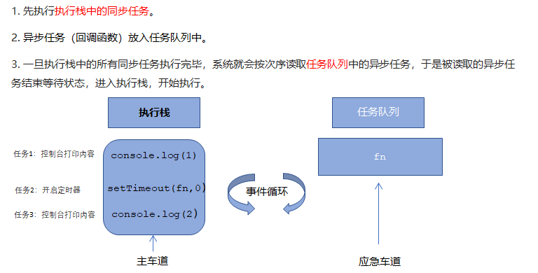

## 1.3. JS执行机制

以下代码执行的结果是什么？

```js
 console.log(1);
 
 setTimeout(function () {
     console.log(3);
 }, 1000);
 
 console.log(2);
```

以下代码执行的结果是什么？

```js
 console.log(1);
 
 setTimeout(function () {
     console.log(3);
 }, 0);
 
 console.log(2);
```


### 1.3.1 JS 是单线程


```js
	单线程就意味着，所有任务需要排队，前一个任务结束，才会执行后一个任务。如果前一个任务耗时很长，后一个任务就不得不一直等着。
	这样所导致的问题是： 如果 JS 执行的时间过长，这样就会造成页面的渲染不连贯，导致页面渲染加载阻塞的感觉。
```

### 1.3.2 同步任务和异步任务

​	单线程导致的问题就是后面的任务等待前面任务完成，如果前面任务很耗时（比如读取网络数据），后面任务不得不一直等待！！

​	为了解决这个问题，利用多核 CPU 的计算能力，HTML5 提出 Web Worker 标准，允许 JavaScript 脚本创建多个线程，但是子线程完全受主线程控制。于是，JS 中出现了**同步任务**和**异步任务**。

#### 同步

​	前一个任务结束后再执行后一个任务，程序的执行顺序与任务的排列顺序是一致的、同步的。比如做饭的同步做法：我们要烧水煮饭，等水开了（10分钟之后），再去切菜，炒菜。

#### 异步

​	你在做一件事情时，因为这件事情会花费很长时间，在做这件事的同时，你还可以去处理其他事情。比如做饭的异步做法，我们在烧水的同时，利用这10分钟，去切菜，炒菜。


> ```js
> JS中所有任务可以分成两种，一种是同步任务（synchronous），另一种是异步任务（asynchronous）。
> 
> 同步任务指的是：
> 	在主线程上排队执行的任务，只有前一个任务执行完毕，才能执行后一个任务；
> 异步任务指的是：
> 	不进入主线程、而进入”任务队列”的任务，当主线程中的任务运行完了，才会从”任务队列”取出异步任务放入主线程执行。
> ```


### 1.3.3 JS执行机制（事件循环）




### 1.3.4 代码思考题

```js
 console.log(1);
 document.onclick = function() {
   console.log('click');
 }

 setTimeout(function() {
   console.log(3)
 }, 3000)
 console.log(2);
```

