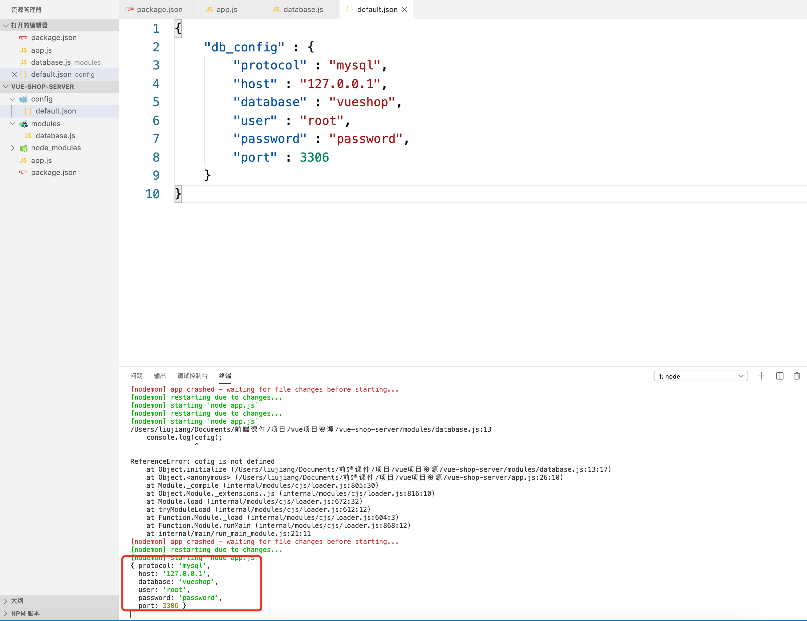

## 项目初始化

- 导入/Users/liujiang/Documents/前端课件/项目/vue项目资源/mydb.sql
- 新建项目vue-shop-server

```sh
npm init -y
```

- 修改package.json，如下

```js
{
  "name": "vue-shop-server",
  "version": "1.0.0",
  "description": "",
  "main": "index.js",
  "scripts": {
    "test": "echo \"Error: no test specified\" && exit 1"
  },
  "keywords": [],
  "author": "",
  "license": "ISC",
  "dependencies": {
    "bluebird": "^3.5.1",
    "body-parser": "~1.18.2",
    "busboy": "^0.2.14",
    "config": "^1.28.0",
    "debug": "~2.6.9",
    "express": "^4.16.2",
    "gm": "^1.23.0",
    "je": "^1.0.2",
    "jsonwebtoken": "^7.1.9",
    "lodash": "^4.17.4",
    "log4js": "^2.4.1",
    "morgan": "~1.9.0",
    "mount-routes": "^1.0.8",
    "multer": "^1.3.0",
    "mysql": "^2.15.0",
    "node-orm": "^2.1.15",
    "node-php-password": "^0.1.2",
    "orm": "^4.0.1",
    "passport": "^0.4.0",
    "passport-http-bearer": "^1.0.1",
    "passport-local": "^1.0.0",
    "serve-favicon": "~2.4.5",
    "underscore": "^1.8.3",
    "uniqid": "^4.1.1"
  },
  "devDependencies": {
    "chai": "^4.1.2",
    "chai-http": "^3.0.0",
    "gulp": "^3.9.1",
    "mocha": "^4.0.1",
    "request": "^2.83.0"
  }
}

```

执行命令

```sh
cnpm install
```

## 新建app.js

```js
var express = require('express')
var app = express()

/**
 *
 * 统一处理无响应
 *
 */
// 如果没有路径处理就返回 Not Found
app.use(function (req, res, next) {
    res.send({status:404,msg:'Not Found'})
})

app.listen(8888)

module.exports = app
```

## 连接数据库

- 新建文件夹modules
  - 新建database.js

- 新建config文件夹
  - 新建default.json

App.js

```js
var express = require('express')
// var bodyParser = require('body-parser')
// var path = require('path')
var app = express()

/**
 *
 * 公共系统初始化
 *
 */
// app.use(bodyParser.json())
// app.use(bodyParser.urlencoded({ extended: true }))

/**
 *
 * 统一处理无响应
 *
 */
// 如果没有路径处理就返回 Not Found
app.use(function (req, res, next) {
    res.send({status:404,msg:'Not Found'})
})

// 初始化数据库模块
var database = require('./modules/database')
database.initialize(app, function(err) {
  if (err) {
    console.error('连接数据库失败失败 %s', err)
  }
})

app.listen(8888)

module.exports = app
```

Database.js

```js
require('mysql');
var fs = require("fs");
var path = require("path");
var Promise = require("bluebird");
/*
	app: 应用程序环境
	config: 数据库配置
	callback: 回调
*/
function initialize(app,callback) {
    // 加载配置文件
    var config = require('config').get("db_config");
    console.log(config);
    
}

module.exports.initialize = initialize;
```

Default.json

```json
{
	"db_config" : {
		"host" : "127.0.0.1",
		"database" : "vueshop",
		"user" : "root",
		"password" : "password"
	}
}
```



测试

app.js

```js
var express = require('express')
// var bodyParser = require('body-parser')
// var path = require('path')
var app = express()

/**
 *
 * 公共系统初始化
 *
 */
// app.use(bodyParser.json())
// app.use(bodyParser.urlencoded({ extended: true }))

/**
 *
 * 统一处理无响应
 *
 */
// 如果没有路径处理就返回 Not Found
app.use(function (req, res, next) {
    res.send({ status: 404, msg: 'Not Found' })
})

// 连接数据库
var db = require('./modules/database')
var conn = db.connection()

conn.query("SELECT * FROM sp_user", (err, data) => {
    if (err) {
        console.log('[SELECT ERROR] - ', err.message);
        return;
    }
    console.log(data);
    // 关闭连接
    db.close(conn)
})

app.listen(8888)

module.exports = app
```

database.js

```js
const mysql = require('mysql');
var fs = require("fs");
var path = require("path");
var Promise = require("bluebird");
/*
    连接数据库
*/
function connection() {
    // 加载配置文件
    var config = require('config').get("db_config");
    console.log(config);
    const connection = mysql.createConnection(config);
    //2.开始连接
    connection.connect()
    return connection
}

function close(connection) {
    //4.关闭数据库
    connection.end()
}

module.exports = {
    connection,
    close
};
```


## 用户路由

### 登陆