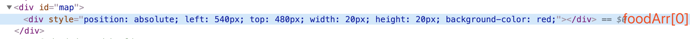

# 像素鸟

## 1、布局

```html
<!DOCTYPE html>
<html lang="en">

<head>
    <meta charset="UTF-8">
    <meta name="viewport" content="width=device-width, initial-scale=1.0">
    <meta http-equiv="X-UA-Compatible" content="ie=edge">
    <title>Document</title>
    <script src="https://cdn.bootcss.com/jquery/3.4.1/jquery.min.js"></script>
    <style>
        * {
            margin: 0;
            padding: 0;
        }

        #game {
            width: 800px;
            height: 600px;
            background: url('./images/sky.png');
            position: relative;
            overflow: hidden;

        }

        #bird {
            width: 34px;
            height: 25px;
            background: url('./images/birds.png') -8px -10px no-repeat;
            position: absolute;
            top: 100px;
            left: 100px;
        }
    </style>
</head>

<body>
    <div id="game">
        <div id="bird"></div>
    </div>
    <script>
      
    </script>
</body>

</html>
```


## 2、创建背景对象

- 背景图片可以重复
- 移动背景的x坐标
- 背景移动的方法

```js
var game = document.querySelector('#game')
class BG {
    constructor() {
        this.x = 0
    }
    bgRun(game) {
        // 背景移动,样式注意不要no-repeat
        this.x -= 5
        game.style.backgroundPositionX = this.x + 'px';
    }
}
var bg = new BG()
var timer = setInterval(function () {
     bg.bgRun(game)
}, 30)
```

## 3、创建鸟对象

- 鸟上下移动的速度
- 鸟距离顶部的距离
- 小鸟距离左边的距离
- 鸟移动的方法

```js
class Bird {
    constructor(position) {
        // 纵轴的速度
        this.speedY = 0
        // 小鸟距离顶部的距离
        this.y = position.offsetTop
        // 小鸟距离左边的距离
        this.x = position.offsetLeft
    }
    birdRun(position) {
        // 小鸟上下运动
        this.speedY += 1
        this.y += this.speedY

        if (this.y < 0) {
            this.y = 0;
            clearInterval(timer)
        }
        // 小鸟距离顶部的距离+小鸟自身的高度 如果大于 背景高度600
        if (this.y + position.offsetHeight > 600) {
            this.y = 600 - position.offsetHeight;
            clearInterval(timer)
        }
        position.style.top = this.y + 'px'
    }
}
var bird = new Bird(birdPosition)
var timer = setInterval(function () {
    bg.bgRun(game)
    bird.birdRun(birdPosition)
}, 30)
```

## 4、点击document使小鸟上下移动

```js
// 点击文档的时候实现小鸟向上运动
document.onclick = function () {
    bird.speedY = -10;
}
```

## 5、创建管道对象

- 管道的x坐标
- 上下管道的高度
- 下管道距离top的距离

```js
class Pipe {
    constructor(position, game) {
        // 管道的x坐标
        this.x = position
        // 上管道的高度,总高度600，不超过300
        this.upPipeHeight = 200 + parseInt(Math.random() * 100)
        // 上下管道中间留200px的空间
        this.downPipeHeight = 600 - this.upPipeHeight - 200
        // 下管道距离顶部的距离
        this.dTop = this.upPipeHeight + 200;
        // 把上下管道元素绑定到对象上
        this.uPipe = null
        this.dPipe = null
        this.createPipe(game)

    }
    createPipe(game) {
        this.uPipe = document.createElement('div');
        this.uPipe.style.width = '52px';
        this.uPipe.style.height = this.upPipeHeight + 'px';
        this.uPipe.style.background = 'url("/资料/像素鸟案例资料/images/pipe2.png") no-repeat center bottom';
        this.uPipe.style.position = 'absolute';
        this.uPipe.style.top = '0px';
        this.uPipe.style.left = this.x + 'px';
        game.appendChild(this.uPipe);

        this.dPipe = document.createElement('div');
        this.dPipe.style.width = '52px';
        this.dPipe.style.height = this.downPipeHeight + 'px';
        this.dPipe.style.background = 'url("/资料/像素鸟案例资料/images/pipe1.png") no-repeat center  top';
        this.dPipe.style.position = 'absolute';
        this.dPipe.style.top = this.dTop + 'px';
        this.dPipe.style.left = this.x + 'px';
        game.appendChild(this.dPipe);
    }
    pipeRun() {
        this.x -= 2
        this.uPipe.style.left = this.x + 'px'
        this.dPipe.style.left = this.x + 'px'
    }
}
var p1 = new Pipe(400, game)
var p2 = new Pipe(600, game)
var p3 = new Pipe(800, game)
var p4 = new Pipe(1000, game)
```

## 6、让管道移动

```js
var timer = setInterval(function () {
    bg.bgRun(game)
    bird.birdRun(birdPosition)
    p1.pipeRun()
    p2.pipeRun()
    p3.pipeRun()
    p4.pipeRun()
}, 30)
```

## 7、管道循环

- 在pipeRun方法里添加判断

```js
pipeRun() {
    this.x -= 2
    this.uPipe.style.left = this.x + 'px'
    this.dPipe.style.left = this.x + 'px'
    // 当管道进入最左边的时候，整好是管道图片的宽度
    if (this.x < -52) {
        this.x = 800;
    }
}
```

## 8、判断游戏结束

- 小鸟的x、y坐标在管道的x、y坐标的范围内

```html
<!DOCTYPE html>
<html lang="en">

<head>
    <meta charset="UTF-8">
    <meta name="viewport" content="width=device-width, initial-scale=1.0">
    <meta http-equiv="X-UA-Compatible" content="ie=edge">
    <title>Document</title>
    <script src="https://cdn.bootcss.com/jquery/3.4.1/jquery.min.js"></script>
    <style>
        * {
            margin: 0;
            padding: 0;
        }

        #game {
            width: 800px;
            height: 600px;
            background: url('./images/sky.png');
            position: relative;
            overflow: hidden;

        }

        #bird {
            width: 34px;
            height: 25px;
            background: url('./images/birds.png') -8px -10px no-repeat;
            position: absolute;
            top: 100px;
            left: 100px;
        }
    </style>
</head>

<body>
    <div id="game">
        <div id="bird"></div>
    </div>
    <script>
        var birdPosition = document.querySelector('#bird')
        var game = document.querySelector('#game')
        // 创建小鸟对象
        class Bird {
            constructor(position) {
                // 纵轴的速度
                this.speedY = 0
                // 小鸟距离顶部的距离
                this.y = position.offsetTop
                // 小鸟距离左边的距离
                this.x = position.offsetLeft
            }
            birdRun(position) {
                // 小鸟上下运动
                this.speedY += 1
                this.y += this.speedY

                if (this.y < 0) {
                    this.y = 0;
                    clearInterval(timer)
                }
                // 小鸟距离顶部的距离+小鸟自身的高度 如果大于 背景高度600
                if (this.y + position.offsetHeight > 600) {
                    this.y = 600 - position.offsetHeight;
                    clearInterval(timer)
                }
                position.style.top = this.y + 'px'
            }
        }
        class BG {
            constructor() {
                this.x = 0
            }
            bgRun(game) {
                // 背景移动,样式注意不要no-repeat
                this.x -= 5
                game.style.backgroundPositionX = this.x + 'px';
            }
        }
        var bg = new BG()
        var bird = new Bird(birdPosition)

        class Pipe {
            constructor(position, game) {
                // 管道的x坐标
                this.x = position
                // 上管道的高度,总高度600，不超过300
                this.upPipeHeight = 200 + parseInt(Math.random() * 100)
                // 上下管道中间留200px的空间
                this.downPipeHeight = 600 - this.upPipeHeight - 200
                // 下管道距离顶部的距离
                this.dTop = this.upPipeHeight + 200;
                // 把上下管道元素绑定到对象上
                this.uPipe = null
                this.dPipe = null
                this.createPipe(game)

            }
            createPipe(game) {
                this.uPipe = document.createElement('div');
                this.uPipe.style.width = '52px';
                this.uPipe.style.height = this.upPipeHeight + 'px';
                this.uPipe.style.background = 'url("/资料/像素鸟案例资料/images/pipe2.png") no-repeat center bottom';
                this.uPipe.style.position = 'absolute';
                this.uPipe.style.top = '0px';
                this.uPipe.style.left = this.x + 'px';
                game.appendChild(this.uPipe);

                this.dPipe = document.createElement('div');
                this.dPipe.style.width = '52px';
                this.dPipe.style.height = this.downPipeHeight + 'px';
                this.dPipe.style.background = 'url("/资料/像素鸟案例资料/images/pipe1.png") no-repeat center  top';
                this.dPipe.style.position = 'absolute';
                this.dPipe.style.top = this.dTop + 'px';
                this.dPipe.style.left = this.x + 'px';
                game.appendChild(this.dPipe);
            }
            pipeRun() {
                this.x -= 2
                this.uPipe.style.left = this.x + 'px'
                this.dPipe.style.left = this.x + 'px'
                // 当管道进入最左边的时候，整好是管道图片的宽度
                if (this.x < -52) {
                    this.x = 800;
                }
            }
            gameover(bird, birdPosition) {
                // 游戏结束条件
                // 小鸟的x坐标+自身的宽度的数值 如果在管道的坐标数值的范围内 gameover
                // console.log(bird.x+birdPosition.offsetWidth);
                // 上管道的x坐标的范围
                var uCheck = bird.x + 34 > this.x && bird.x < this.x + 52 && bird.y < this.upPipeHeight;
                var dCheck = bird.x + 34 > this.x && bird.x < this.x + 52 && bird.y+birdPosition.offsetHeight > this.upPipeHeight + 200;
                if(uCheck||dCheck){
                    clearInterval(timer)
                }
            }
        }
        var p1 = new Pipe(400, game)
        var p2 = new Pipe(600, game)
        var p3 = new Pipe(800, game)
        var p4 = new Pipe(1000, game)
        var timer = setInterval(function () {
            bg.bgRun(game)
            bird.birdRun(birdPosition)
            p1.pipeRun()
            p2.pipeRun()
            p3.pipeRun()
            p4.pipeRun()
            p1.gameover(bird,birdPosition)
            p2.gameover(bird,birdPosition)
            p3.gameover(bird,birdPosition)
            p4.gameover(bird,birdPosition)
        }, 30)

        // 点击文档的时候实现小鸟向上运动
        document.onclick = function () {
            bird.speedY = -10;
        }


    </script>
</body>

</html>
```


## 贪吃蛇

#### 游戏演示


### 功能实现

#### 搭建页面

放一个容器盛放游戏场景 div#map，设置样式

```css
/* 游戏背景区域 */
#map {
    width: 800px;
    height: 600px;
    background-color: aliceblue;
    margin: 0 auto;
    /* 所有的食物和蛇都在此背景上 */
    position: relative;
}
```

#### 分析对象

- 游戏对象
  - 控制游戏的逻辑
- 蛇对象
- 食物对象

#### 创建食物对象

- Food
  - 属性
    - x       
    - y
    - width
    - height
    - color       
  - 方法
    - render       随机创建一个食物对象，并输出到map上
- 新建food.js
- 创建Food的构造函数，并设置属性

```js
class Food {
    // x, y, width, height, color
    constructor() {
        this.x = 0
        this.y = 0
        this.width = 20
        this.height = 20
        this.color = 'red'
    }
}
```

- 通过原型设置render方法，实现随机产生食物对象，并渲染到map上

```js
var position = 'absolute'
Food.prototype.render = function(map){
    // 动态创建食物,map就是食物的父容器 就是放到地图上
    var div = document.createElement('div');
    map.appendChild(div);
    // 设置食物样式
    div.style.position = position
    div.style.left = this.x + 'px'
    div.style.top = this.y + 'px'
    div.style.width = this.width+'px'
    div.style.height = this.height+ 'px'
    div.style.backgroundColor = this.color
}
```

- 测试

```js
//测试
var food = new Food()
var map = document.getElementById("map")
food.render(map)
```


### 随机生成食物对象

- 目前我每次刷新页面都在0，0位置

- 新建Tool.js

```js
var Tools = {
    getRandom: function (max) {
        // floor 向下取整 min=0 max=10  -> 0-9
        //random 返回介于 0（包含） ~ 1（不包含） 之间的一个随机数
        return Math.floor(Math.random()*max)
    }
}
```


但是如果随机数随到10，那么x的坐标就是10*20=200，对于盒子来说，宽度就是200，那么会溢出，所有取0-9


随机生成食物

```js
// 随机生成x,y值
this.x = Tools.getRandom(map.offsetWidth/this.width)*this.width;
this.y = Tools.getRandom(map.offsetHeight/this.height)*this.height;
```

food.js

```js
Food.prototype.render = function (map) {
    // 随机生成x,y值
    this.x = Tools.getRandom(map.offsetWidth / this.width) * this.width;
    this.y = Tools.getRandom(map.offsetHeight / this.height) * this.height;
    // 动态创建食物,map就是食物的父容器 就是放到地图上
    var div = document.createElement('div');
    map.appendChild(div);
    // 设置食物样式
    div.style.position = 'absolute'
    div.style.left = this.x + 'px'
    div.style.top = this.y + 'px'
    div.style.width = this.width + 'px'
    div.style.height = this.height + 'px'
    div.style.backgroundColor = this.color
}
```

蛇碰到食物，删除之前的食物，在生成新的

```js
class Food {
    // x, y, width, height, color
    constructor() {
        this.x = 0
        this.y = 0
        this.width = 20
        this.height = 20
        this.color = 'red'
    }
}
// 存储食物
var foodArr = []
Food.prototype.render = function (map) {
    // 蛇碰到食物，删除之前的食物，在生成新的
    removeFood()
    // 随机生成x,y值
    this.x = Tools.getRandom(map.offsetWidth / this.width) * this.width;
    this.y = Tools.getRandom(map.offsetHeight / this.height) * this.height;
    // 动态创建食物,map就是食物的父容器 就是放到地图上
    var div = document.createElement('div');
    map.appendChild(div);
    // 设置食物样式
    div.style.position = 'absolute'
    div.style.left = this.x + 'px'
    div.style.top = this.y + 'px'
    div.style.width = this.width + 'px'
    div.style.height = this.height + 'px'
    div.style.backgroundColor = this.color
}

var food = new Food()
// console.log(food);
var map = document.getElementById("map")
food.render(map)
function removeFood() {
    if (foodArr.length > 0) {
        // 找到map的div，删除第一个儿子，并且清空数组
        foodArr[0].parentNode.removeChild(foodArr[0])
        foodArr = []
    }
}
```



#### 创建蛇对象

- snake.js
- 属性
  - width    蛇节的宽度 默认20
  - height   蛇节的高度 默认20
  - body     数组，蛇的头部和身体，第一个位置是蛇头
  - direction    蛇运动的方向  默认right  可以是 left  top bottom
- 方法
  - render  把蛇渲染到map上
- Index.html引入


```js
class Snake {
    constructor() {
        // 设置每一个蛇节的宽度
        this.width = 20;
        this.height = 20;
        this.direction = 'right';
        // 蛇的每一部分, 第一部分是蛇头
        this.body = [
            { x: 3, y: 2, color: 'green' },//蛇头
            { x: 2, y: 2, color: 'blue' },//第一个蛇节
            { x: 1, y: 2, color: 'blue' }//最后一个蛇节
        ];
    }
}
```

- render方法

```js
Snake.prototype.render = function (map) {
    for (var i = 0; i < this.body.length; i++) {
        var obj = this.body[i];
        var div = document.createElement('div');
        map.appendChild(div);
        div.style.left = obj.x * this.width + 'px';
        div.style.top = obj.y * this.height + 'px';
        div.style.position = position;
        div.style.backgroundColor = obj.color;
        div.style.width = this.width + 'px';
        div.style.height = this.height + 'px';
    }
}

```

- 测试

```js
var snake = new Snake();
snake.render(map)

```

#### 创建游戏对象

游戏对象，用来管理游戏中的所有对象和开始游戏 game.js

- Game
  - 属性
    - food
    - snake
    - map
  - 方法
    - start            开始游戏（绘制所有游戏对象）


- 构造函数

```js
class Game{
    constructor(map){
        this.food = new Food()
        this.snake = new Snake()
        this.map = map
    }
}
```

- 开始游戏，渲染食物对象和蛇对象

```js
Game.prototype.start = function () {
  this.food.render(this.map);
  this.snake.render(this.map);
}
```

- 测试(删除其他js里的测试代码)

```js
class Game {
    constructor(map) {
        this.food = new Food()
        this.snake = new Snake()
        this.map = map
    }
}

Game.prototype.start = function () {
    this.food.render(this.map);
    this.snake.render(this.map);
}

var map = document.getElementById("map")
var game = new Game(map)
game.start()


```


### 游戏的逻辑

#### 写蛇的move方法

- 在蛇对象(snake.js)中，在Snake的原型上新增move方法

1. 让蛇移动起来，把蛇身体的每一部分往前移动一下
2. 蛇头部分根据不同的方向决定 往哪里移动
3. 把创建蛇的节点存到数组里

```js
var snakeArr = [];
Snake.prototype.render = function (map) {
    for (var i = 0; i < this.body.length; i++) {
        var obj = this.body[i];
        var div = document.createElement('div');
        map.appendChild(div);
        snakeArr.push(div)
        div.style.left = obj.x * this.width + 'px';
        div.style.top = obj.y * this.height + 'px';
        div.style.position = position;
        div.style.backgroundColor = obj.color;
        div.style.width = this.width + 'px';
        div.style.height = this.height + 'px';
    }	
}

// var snake = new Snake();
// snake.render(map)

Snake.prototype.move = function (food, map) {
    // 先删除之前创建的蛇
    removeSnake()
    // 让蛇身体的每一部分往前移动一下,不包含蛇头
    for (var i = this.body.length- 1; i>0; i--) {
        this.body[i].x = this.body[i-1].x//当前蛇节的位置=上一个蛇节的位置
        this.body[i].y = this.body[i-1].y
    }
    // 根据移动的方向，决定蛇头如何处理
    switch (this.direction) {
        case 'left':
            this.body[0].x -= 1;
            break;
        case 'right':
            this.body[0].x += 1;
            break;
        case 'top':
            this.body[0].y -= 1;
            break;
        case 'bottom':
            this.body[0].y += 1;
            break;
    }
}
function removeSnake(){
    for(var i= snakeArr.length-1;i>=0;i--){
        // 删除div
        snakeArr[i].parentNode.removeChild(snakeArr[i])
        // 删除数组
        // 第一个参数，从那个元素开始删除
        // 第二个参数，删除几个
        snakeArr.splice(i,1);
    }
}
```

- 在game中测试

```js
function Game(map) {
    this.food = new Food();
    this.snake = new Snake();
    this.map = map;
}

Game.prototype.start = function () {
    // 把蛇和食物渲染到地图上
    this.food.render(this.map);
    // 蛇移动，在snakejs添加蛇移动的方法

    // 测试
    this.snake.move()
    this.snake.render(this.map);
    this.snake.move()
    this.snake.render(this.map);
    this.snake.move()
    this.snake.render(this.map);
}

var game = new Game(map)
game.start()
```

#### 让蛇自己动起来

- 判断蛇是否撞墙
- Game.js

```js
var that;
var over = document.getElementById("over")
function run() {
    var opa = 1;
    var timeid = setInterval(function () {
        // 让蛇走一格

        that.snake.move()
        that.snake.render(that.map)
        // 当蛇遇到边界 gameover 
        //  获取蛇头的位置
        var snakeHeadX = that.snake.body[0].x;
        var snakeHeadY = that.snake.body[0].y;
        var maxX = that.map.offsetWidth / that.snake.width;
        var maxY = that.map.offsetHeight / that.snake.height;

        if (snakeHeadX < 0 || snakeHeadX >= maxX) {
            // 获取over的兄弟节点不包含自己和食物
            var divs = over.parentNode.children
            for (var i = 2; i < divs.length; i++) {
                //    console.log(divs[i].offsetLeft);
                divs[i].style.left = divs[i].offsetLeft - 20 + 'px'
            }


            if (snakeHeadX >= maxX + 1) {
                over.innerHTML = "<font color='red'>Game over</font>"
                // 获取over的兄弟节点不包含自己和食物
                var divs = over.parentNode.children
                for (var i = 2; i < divs.length; i++) {
                    //    console.log(divs[i].offsetLeft);
                    divs[i].style.left = divs[i].offsetLeft - 20 + 'px'
                }
                clearInterval(timeid)
            }

        }
        if (snakeHeadY < 0 || snakeHeadY >= maxY ) {
            // 获取over的兄弟节点不包含自己和食物
            var divs = over.parentNode.children
            for (var i = 2; i < divs.length; i++) {
                //    console.log(divs[i].offsetLeft);
                divs[i].style.top = divs[i].offsetTop - 20 + 'px'
            }


            if (snakeHeadY >= maxY + 1) {
                over.innerHTML = "<font color='red'>Game over</font>"
                // 获取over的兄弟节点不包含自己和食物
                var divs = over.parentNode.children
                for (var i = 2; i < divs.length; i++) {
                    //    console.log(divs[i].offsetLeft);
                    divs[i].style.top = divs[i].offsetTop - 20 + 'px'
                }
                clearInterval(timeid)
            }
        }
    }, 150)
}
```


- 在game中通过键盘控制蛇的移动方向

```js
// 通过键盘控制移动
function bindKey() {
    document.addEventListener('keydown', function (e) {
        console.log(e.keyCode);
        // 上38
        // 下40
        // 左37
        // 右39

        switch (e.keyCode) {
            case 37:
                // left
                that.snake.direction = 'left';
                break;
            case 38:
                // top
                that.snake.direction = 'top';
                break;
            case 39:
                // right
                that.snake.direction = 'right';
                break;
            case 40:
                // bottom
                that.snake.direction = 'bottom';
                break;
        }
    }, false)
}


```

#### 判断蛇是否吃到食物

```js
// 在Snake的move方法中

// 在移动的过程中判断蛇是否吃到食物
// 如果蛇头和食物的位置重合代表吃到食物
// 食物的坐标是像素，蛇的坐标是几个宽度，进行转换
var headX = this.body[0].x * this.width;
var headY = this.body[0].y * this.height;
if (headX === food.x && headY === food.y) {
  // 吃到食物，往蛇节的最后加一节
  var last = this.body[this.body.length - 1];
  this.body.push({
    x: last.x,
    y: last.y,
    color: last.color
  })
  // 把现在的食物对象删除，并重新随机渲染一个食物对象
  food.render(map);
}


```

> 源码

Index.html

```html
<!DOCTYPE html>
<html lang="en">
<head>
    <meta charset="UTF-8">
    <meta name="viewport" content="width=device-width, initial-scale=1.0">
    <meta http-equiv="X-UA-Compatible" content="ie=edge">
    <title>Document</title>
    <link rel="stylesheet" href="index.css">

</head>
<body>
    <div id="map" class="map">
        <span id="over"></span>
    </div>
    <!-- food里需要依赖tools，所以先引入tools -->
    <script src="tools.js"></script>
    <script src="food.js"></script>
    <script src="snake.js"></script>
    <script src="game.js"></script>
</body>
</html>

```


Food.js

```js
class Food {
    // x, y, width, height, color
    constructor() {
        this.x = 0
        this.y = 0
        this.width = 20
        this.height = 20
        this.color = 'red'
    }
}
// 存储食物
var foodArr = []
Food.prototype.render = function (map) {
    // 蛇碰到食物，删除之前的食物，在生成新的
    removeFood()
    // 随机生成x,y值
    console.log(map.offsetWidth);
    
    this.x = Tools.getRandom(map.offsetWidth / this.width) * this.width;
    this.y = Tools.getRandom(map.offsetHeight / this.height) * this.height;
    // 动态创建食物,map就是食物的父容器 就是放到地图上
    var div = document.createElement('div');
    map.appendChild(div);
    foodArr.push(div)
    // 设置食物样式
    div.style.position = 'absolute'
    div.style.left = this.x + 'px'
    div.style.top = this.y + 'px'
    div.style.width = this.width + 'px'
    div.style.height = this.height + 'px'
    div.style.backgroundColor = this.color
}
var food= new Food()
var map = document.querySelector('#map')
food.render(map)
removeFood()

function removeFood() {
    if(foodArr.length>0){
        // 删除map下的食物，通过自己找父级，在删除自己
        foodArr[0].parentNode.removeChild(foodArr[0])
        // 清空数组
        foodArr = []
    }
}
```


game.js

```js
var over = document.querySelector('.over')

var that
class Game {
    constructor(map) {
        this.food = new Food()
        this.snake = new Snake()
        this.map = map
        that = this
    }
}

Game.prototype.start = function () {
    // this.food.render(this.map);
    // 把蛇和食物渲染到地图上
    this.food.render(this.map);
    // 蛇移动，在snakejs添加蛇移动的方法
    this.snake.render(this.map);
    // 测试
    // this.snake.move()
    // this.snake.render(this.map);
    // this.snake.move()
    // this.snake.render(this.map);
    // this.snake.move()
    // this.snake.render(this.map);

    // 让蛇移动起来
    run()
    // 通过键盘控制蛇移动的方向
     bindKey()
    // 当蛇遇到食物做出相应的处理

}

function run() {
    var timer = setInterval(function () {
        that.snake.move(that.food,that.map)
        that.snake.render(this.map);

        var snakeHeadX = that.snake.body[0].x;
        var snakeHeadY = that.snake.body[0].y;
        var maxX = that.map.offsetWidth / that.snake.width;
        var maxY = that.map.offsetHeight / that.snake.height;


        if (snakeHeadX < 0 || snakeHeadX >= maxX || snakeHeadX >= maxX + 1) {
            over.innerHTML = "<font color='red'>Game over</font>"
            // 获取over的兄弟节点不包含自己和食物
            var divs = over.parentNode.children
            for (var i = 2; i < divs.length; i++) {
                //    console.log(divs[i].offsetLeft);
                divs[i].style.left = divs[i].offsetLeft - 20 + 'px'
            }
            clearInterval(timer)
        }
        if (snakeHeadY < 0 || snakeHeadY >= maxY || snakeHeadY >= maxY + 1) {
            // 获取over的兄弟节点不包含自己和食物
            var divs = over.parentNode.children
            over.innerHTML = "<font color='red'>Game over</font>"
            for (var i = 2; i < divs.length; i++) {
                //    console.log(divs[i].offsetLeft);
                divs[i].style.top = divs[i].offsetTop - 20 + 'px'
            }

            clearInterval(timer)
        }
    }, 150)
}


// 通过键盘控制移动
function bindKey() {
    document.addEventListener('keydown', function (e) {
        console.log(e.keyCode);
        // 上38
        // 下40
        // 左37
        // 右39

        switch (e.keyCode) {
            case 37:
                // left
                that.snake.direction = 'left';
                break;
            case 38:
                // top
                that.snake.direction = 'top';
                break;
            case 39:
                // right
                that.snake.direction = 'right';
                break;
            case 40:
                // bottom
                that.snake.direction = 'bottom';
                break;
        }
    }, false)
}
var map = document.getElementById("map")
var game = new Game(map)
game.start()


```


index.css

```css
/* 游戏背景区域 */
.map {
    width: 800px;
    height: 600px;
    background-color: aliceblue;
    margin: 0 auto;
    /* 所有的食物和蛇都在此背景上 */
    position: relative;
    overflow: hidden;
}

```


snake.js

```js
class Snake {
    constructor() {
        // 设置每一个蛇节的宽度
        this.width = 20;
        this.height = 20;
        this.direction = 'right';
        // 蛇的每一部分, 第一部分是蛇头
        this.body = [
            { x: 3, y: 2, color: 'green' },//蛇头
            { x: 2, y: 2, color: 'blue' },//第一个蛇节
            { x: 1, y: 2, color: 'blue' }//最后一个蛇节
        ];
    }
}
var snakeArr = [];
Snake.prototype.render = function (map) {
    for (var i = 0; i < this.body.length; i++) {
        var obj = this.body[i];
        var div = document.createElement('div');
        map.appendChild(div);
        snakeArr.push(div)
        div.style.left = obj.x * this.width + 'px';
        div.style.top = obj.y * this.height + 'px';
        div.style.position = 'absolute';
        div.style.backgroundColor = obj.color;
        div.style.width = this.width + 'px';
        div.style.height = this.height + 'px';
    }
}


Snake.prototype.move = function (food, map) {
    // 先删除之前创建的蛇
    removeSnake()
    // 让蛇身体的每一部分往前移动一下,不包含蛇头
    for (var i = this.body.length - 1; i > 0; i--) {
        this.body[i].x = this.body[i - 1].x//当前蛇节的位置=上一个蛇节的位置
        this.body[i].y = this.body[i - 1].y
    }
    // 根据移动的方向，决定蛇头如何处理
    switch (this.direction) {
        case 'left':
            this.body[0].x -= 1;
            break;
        case 'right':
            this.body[0].x += 1;
            break;
        case 'top':
            this.body[0].y -= 1;
            break;
        case 'bottom':
            this.body[0].y += 1;
            break;
    }
    // 判断蛇与食物坐标是否重合
    // 蛇头位置（蛇节）
    var headX = this.body[0].x * this.width
    var headY = this.body[0].y * this.height

    if (headX === food.x && headY === food.y) {
        // 让蛇自增一节
        // 吃到食物，往蛇节的最后加一节
        var last = this.body[this.body.length - 1];
        this.body.push({
            x: last.x,
            y: last.y,
            color: last.color
        })
        // 随机生成一个新的食物
        food.render(map)
    }
}

function removeSnake() {
    for (var i = snakeArr.length - 1; i >= 0; i--) {
        // 删除div
        snakeArr[i].parentNode.removeChild(snakeArr[i])
        // 删除数组
        // 第一个参数，从那个元素开始删除
        // 第二个参数，删除几个
        snakeArr.splice(i, 1);
    }
}
```


tools.js

```js
var Tools = {
    getRandom: function (max) {
        // floor 向下取整 min=0 max=10  -> 0-9
        //random 返回介于 0（包含） ~ 1（不包含） 之间的一个随机数
        return Math.floor(Math.random()*max)
    }
}
```

​	