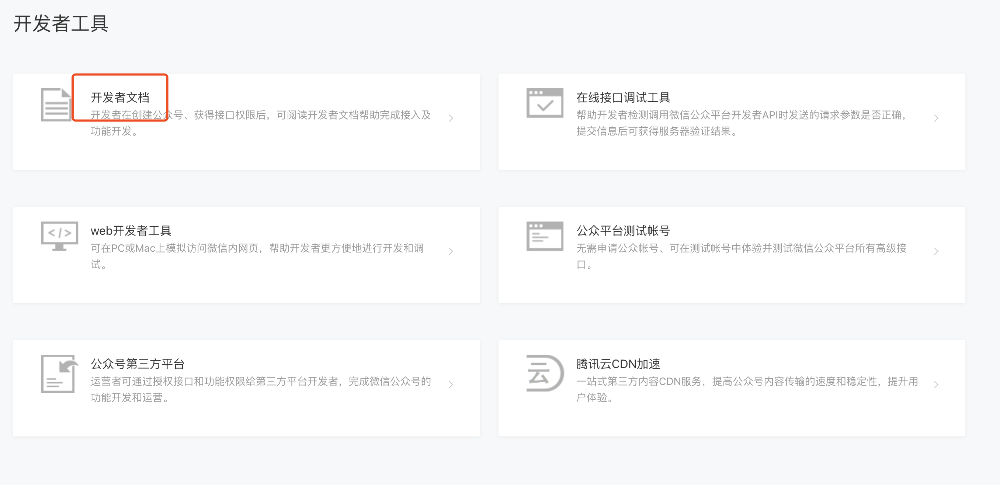
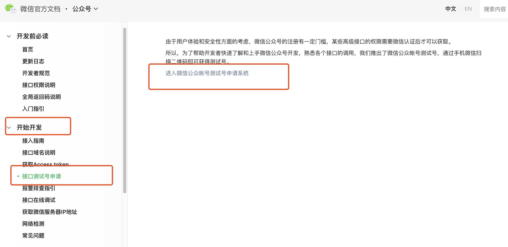
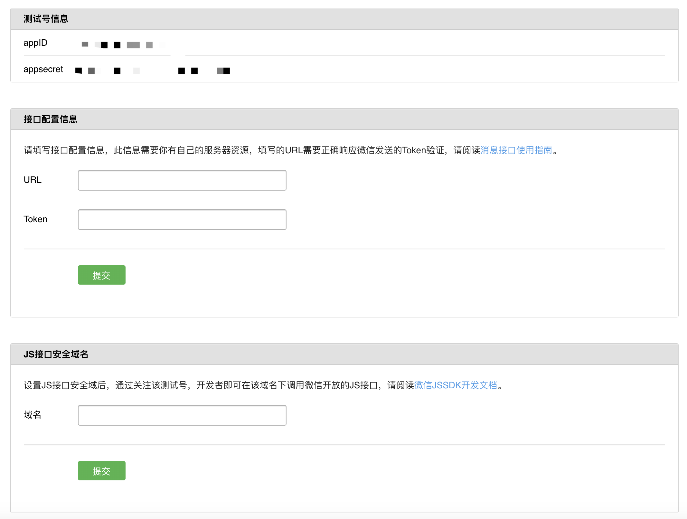
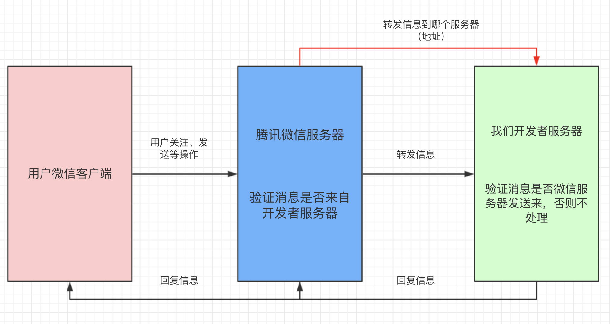
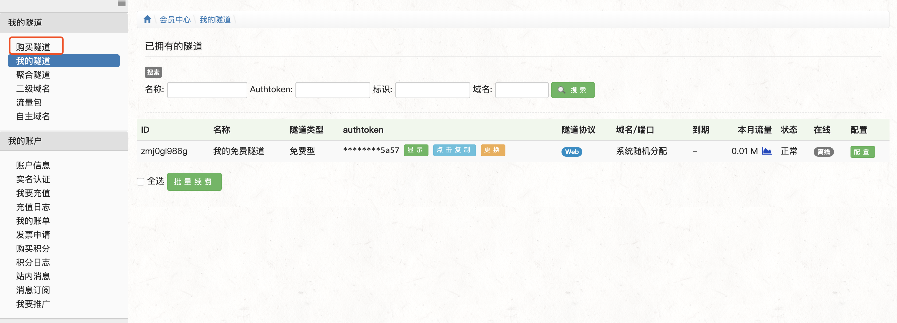
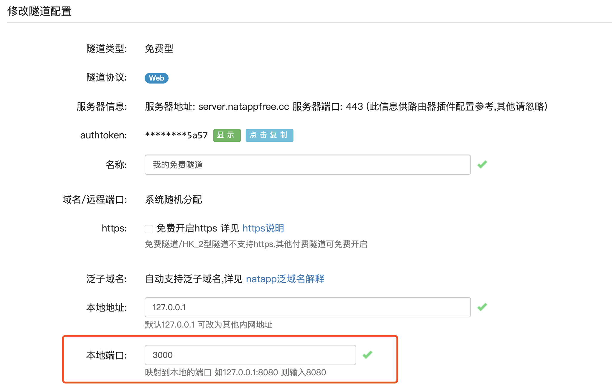
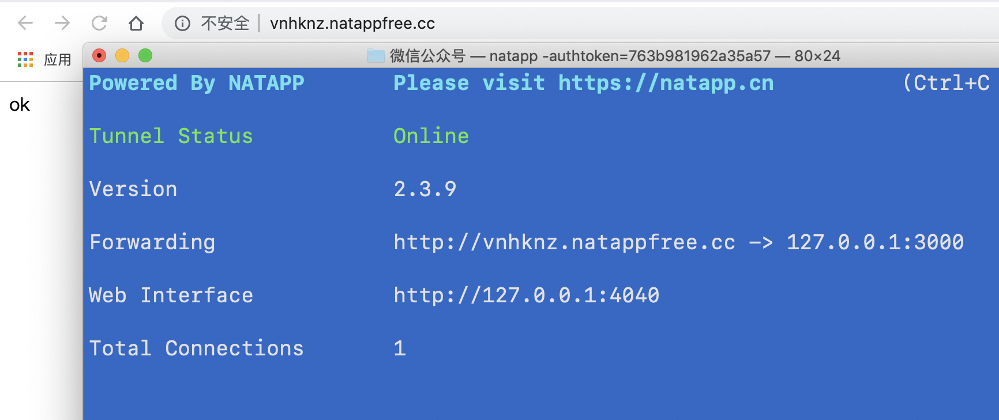
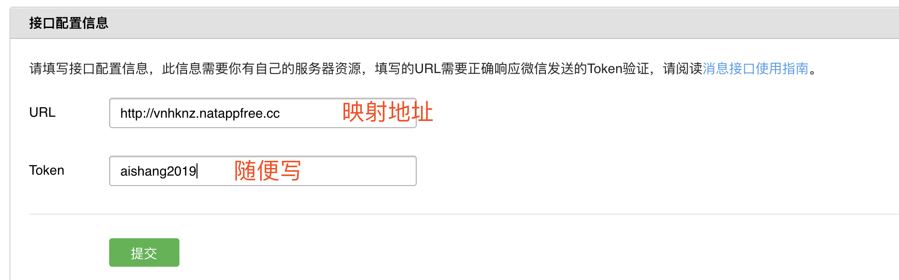
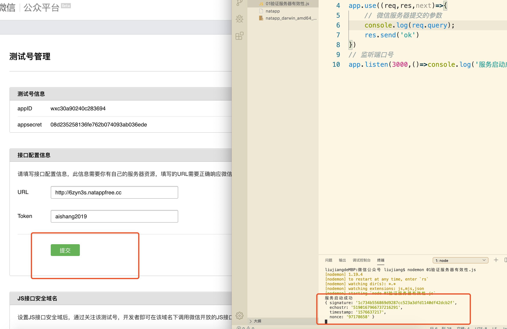
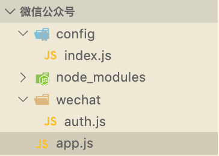

# 公众号开发



## 一、使用测试号开发







## 二、填写服务器地址

### 1、创建服务器

```sh
cnpm i express
```

```js
const express = require('express')
const app = express();
// 验证服务器
app.use((req,res,next)=>{
    res.send('ok')
})
// 监听端口号
app.listen(3000,()=>console.log('服务启动成功'))
```

此时访问地址是：localhost:3000,但是添加url的时候，微信服务器访问不到localhost，需要外网的网址

把内网端口映射外网

<https://natapp.cn/>

下载客户端到资料里

在NATAPP注册完账号后，选择购买隧道购买免费隧道：



官网教程：<https://natapp.cn/article/natapp_newbie>



切换到安装目录

```sh
  chmod a+x natapp
 ./natapp -authtoken=763b981962a35a57
 
 //运行js  node server.js
 //浏览器访问http://vnhknz.natappfree.cc/
```





当我点击提交的时候，微信服务器会向开发者服务器发送信息



```js
{ signature: '1c734b556869d9287cc523a3dfd1140df42dcb2f', 微信的加密签名
  echostr: '5190167966737216291',随机字符串
  timestamp: '1576637217',发送请求的时间戳
  nonce: '97178658' }随机数
```

目的：我们要计算得出signature和微信传过来的signature一样，说明信息来自微信服务器

- 将参与微信加密的参数timestamp，nonce，token，组合在一起，按照字典顺序排序，形成一个数组
- 将数组里的参数拼接成一个字符串，进行sha1加密
- 加密完成就生成了signature，和微信发送过来的对比，如果一样说明信息来自微信服务器，并需要返回echostr给微信服务器，如果不是返货error

#### sha1加密需要安装

```sh
cnpm i sha1
```

```js
const express = require('express')
const app = express();
const sha1 = require('sha1')
// 全局配置
const config = {
    token:"aishang2019",
    appID:"wxc30a90240c283694",
    appsecret:"08d235258136fe762b074093ab036ede"
}
// 验证服务器
app.use((req,res,next)=>{
    // 微信服务器提交的参数
    console.log(req.query);
    const {signature,echostr,timestamp,nonce} = req.query
    const {token} = config
    //定义一个数组，排序
    const arr = [timestamp,nonce,token]
    arr.sort();
    const str = arr.join('')
    const sha1Str = sha1(str)
    console.log(sha1Str);
    if(sha1Str===signature){
        res.send(echostr)
    }else{
        res.end('error')
    }
    
    
})
// 监听端口号
app.listen(3000,()=>console.log('服务启动成功'))
```

#### 测试，点击提交，显示配置成功（可能需要多点几次）

## 三、模块化开发



App.js

```js
const express = require('express')
const app = express();

// 引入模块
const config = require('./config')
const auth = require('./wechat/auth')
// 验证服务器
app.use(auth())
// 监听端口号
app.listen(3000,()=>console.log('服务启动成功'))
```

Auth.js

```js

const sha1 = require('sha1')
const config = require('../config')
module.exports = () => {
    return (req, res, next) => {
        // 微信服务器提交的参数
        console.log(req.query);
        const { signature, echostr, timestamp, nonce } = req.query
        const { token } = config
        //定义一个数组，排序
        const arr = [timestamp, nonce, token]
        const arrSort = arr.sort();
        const str = arr.join('')
        const sha1Str = sha1(str)
        console.log(sha1Str);
        if (sha1Str === signature) {
            res.send(echostr)
        } else {
            res.end('error')
        }
    }
}
```

Config.js

```js
module.exports = {
    // 全局配置
    token:"aishang2019",
    appID:"wxc30a90240c283694",
    appsecret:"08d235258136fe762b074093ab036ede"
}
```

## 四、获取Access token

access_token是公众号的全局唯一接口调用凭据，公众号调用各接口时都需使用access_token。开发者需要进行妥善保存。access_token的存储至少要保留512个字符空间。access_token的有效期目前为2个小时，需定时刷新，重复获取将导致上次获取的access_token失效。

目前access_token的有效期通过返回的expire_in来传达，目前是7200秒之内的值。中控服务器需要根据这个有效时间提前去刷新新access_token。在刷新过程中，中控服务器可对外继续输出的老access_token，此时公众平台后台会保证在5分钟内，新老access_token都可用，这保证了第三方业务的平滑过渡；

例如7点请求的，9点过期，需要提前重新获取

**接口调用请求说明**

> https请求方式: GET https://api.weixin.qq.com/cgi-bin/token?grant_type=client_credential&appid=APPID&secret=APPSECRET

**参数说明**

| 参数       | 是否必须 | 说明                                  |
| ---------- | -------- | ------------------------------------- |
| grant_type | 是       | 获取access_token填写client_credential |
| appid      | 是       | 第三方用户唯一凭证                    |
| secret     | 是       | 第三方用户唯一凭证密钥，即appsecret   |

**返回说明**

正常情况下，微信会返回下述JSON数据包给公众号：

```json
{"access_token":"ACCESS_TOKEN","expires_in":7200}
```

- 首次本地没有，发送请求获取access_token,保存下来
- 第二次以后
  - 先去读本地文件，判断他是否过期
    - 过期了，重新请求获取accesstoken，保存本地
    - 没过期直接使用

- *服务发送请求没法使用ajax，需要下载包*

```sh
cnpm i request
cnpm i request-promise-native
```

accesstoken.js

```js
const {appID,appsecret} = require('../config')
// 只需要引入request-promise-native
const rp = require('request-promise-native')
class Wechat{
    constructor(){

    }
    getAccessToken(){
        const url = `https://api.weixin.qq.com/cgi-bin/token?grant_type=client_credential&appid=${appID}&secret=${appsecret}`
        // 服务发送请求没法使用ajax，需要下载包
        // cnpm i request
        //cnpm i request-promise-native
        rp({
            method:'get',
            url:url,
            json:true//数据转成json发送
        }).then(
            res=>{
                console.log(res);
            }
        ).catch(err=>{
            console.log(err);
        })
    }
}

// 模拟测试,node accesstoken.js
const w = new Wechat()
w.getAccessToken()
```

返回结果

```js
{ access_token:
   '28_b--6TJWWZM9iei6L46mwXxY6GZa7tRdIheOfDutXN6HglG4qpOtxtql928xNdRsSRc2DK_rffBwFdSksueGK93H4K03s3_tdorvR4lD-La4ewHQ2ST5EmcrvwFrr-o3II4M1ToKdV8Pkoq68MFKfAAACVA',
  expires_in: 7200 }
```

过期时间：当前时间+7200

```js
const { appID, appsecret } = require('../config')
// 只需要引入request-promise-native
const rp = require('request-promise-native')
class Wechat {
    constructor() {

    }
    getAccessToken() {
        const url = `https://api.weixin.qq.com/cgi-bin/token?grant_type=client_credential&appid=${appID}&secret=${appsecret}`
        // 服务发送请求没法使用ajax，需要下载包
        // cnpm i request
        //cnpm i request-promise-native
        return new Promise((resolve,reject)=>{
            rp({
                method: 'get',
                url: url,
                json: true//数据转成json发送
            }).then(
                res => {
                    console.log(res);
                    // 设置过期时间  提前5分钟刷新
                    res.expires_in = Date.now() + (res.expires_in - 5*60)*1000
                    //需要返回res，但是此时返回的结果是rp的，不是getAccessToken，需要promise
                    //将promise对象状态改成成功的状态
                    resolve(res)
                }
            ).catch(err => {
                console.log(err);
                reject(err)
            })
        })
    }
    saveAccessToken(){}
}

// 模拟测试,node accesstoken.js
const w = new Wechat()
w.getAccessToken()
```

#### 保存accesstoken

```js
saveAccessToken(accesstoken){
        //accesstoken是对象，需要转成字符串
        accesstoken =  JSON.stringify(accesstoken)
        return new Promise((resolve,reject)=>{
            fs.writeFile('./accesstoken.txt',accesstoken,err=>{
                if(!err){
                    console.log('文件保存成功');
                    resolve()
                }else{
                    reject('保存失败'+err)
                }
            })
        })
    }

//测试
w.getAccessToken().then(res=>{
    w.saveAccessToken(res)
})
```

#### 读取accesstoken

```js
 readAccessToken(){
        return new Promise((resolve,reject)=>{
            fs.readFile('./accesstoken.txt',(err,data)=>{
                if(!err){
                    console.log('文件读取成功');
                    // 字符串转json对象
                    data = JSON.parse(data)
                    resolve(data)
                }else{
                    reject('读取失败'+err)
                }
            })
        })
    }

//测试
w.readAccessToken().then(res=>console.log(res));
```

```js
 // 判断是否过期
    isValidAccessToken(data) {
        if (!accesstoken && !data.expires_in) {
            // 参数无效
            return false;
        }
        // if (data.expires_in < Date.now()) {
        //     // 过期了
        // }else{
        //     // 没有过期
        // }
        return data.expires_in>Date.now()
    }
```

测试

```js
new Promise((resolve, reject) => {
    w.readAccessToken().then(res => {
        // 有文件
        if (w.isValidAccessToken(res)) {
            // 有效
            resolve(res)
        } else {
            w.getAccessToken().then(res => {
                w.saveAccessToken(res).then(() => {
                    resolve(res)
                })
            })
        }
    }).catch(err => {
        // 本地没有文件
        w.getAccessToken().then(res => {
            w.saveAccessToken(res).then(() => {
                resolve(res)
            })
        })
    })
}).then(res=>{
    console.log(res);
})
```

node accesstoken.js 

```json
文件保存成功
{ access_token:
   '28_zNnYQbRXy-1L4e7C1Iq1AuioI24JQXUVTSxruvIu-Up6MJVLoe3Q1nJMmqyd2rkDpJOEktP9GDKDb4t1NCUqr_LPynu_cSl041_qrdT3Ed8f9EbZcaiG2PQdG_zpyOw959gbeQhh2PXwgo5JEZQaAJARMD',
  expires_in: 1576655249143 }
```

改造代码

```js
 // 获取没有过期的token
    fetchAccesstoken() {
        if (this.access_token && this.expires_in && this.isValidAccessToken(this)) {
            // 说明之前保存 access_token 并且是有效的
            return Promise.resolve({
                access_token:this.access_token,
                expires_in:this.expires_in
            })
        }
        return this.readAccessToken()
            .then(async res => {
                // 有文件
                if (this.isValidAccessToken(res)) {
                    // 有效
                    return Promise.resolve(res)
                } else {
                    // 过期了
                    const res = await this.getAccessToken();
                    await this.saveAccessToken(res)
                    return Promise.resolve(res)
                }
            })
            .catch(async err => {
                // 本地没有文件
                const res = await this.getAccessToken();
                await this.saveAccessToken(res)
                return Promise.resolve(res)
            })
            .then(res => {
                this.access_token = res.access_token
                this.expires_in = res.expires_in
                return Promise.resolve(res)
            })
    }

//测试
var w = new Wechat()
w.fetchAccesstoken()
```

