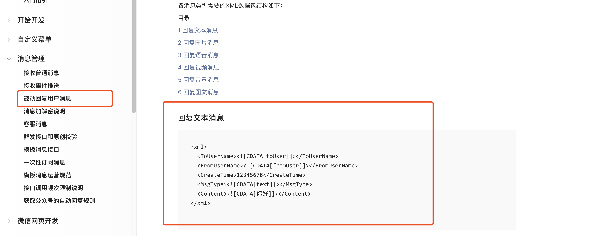
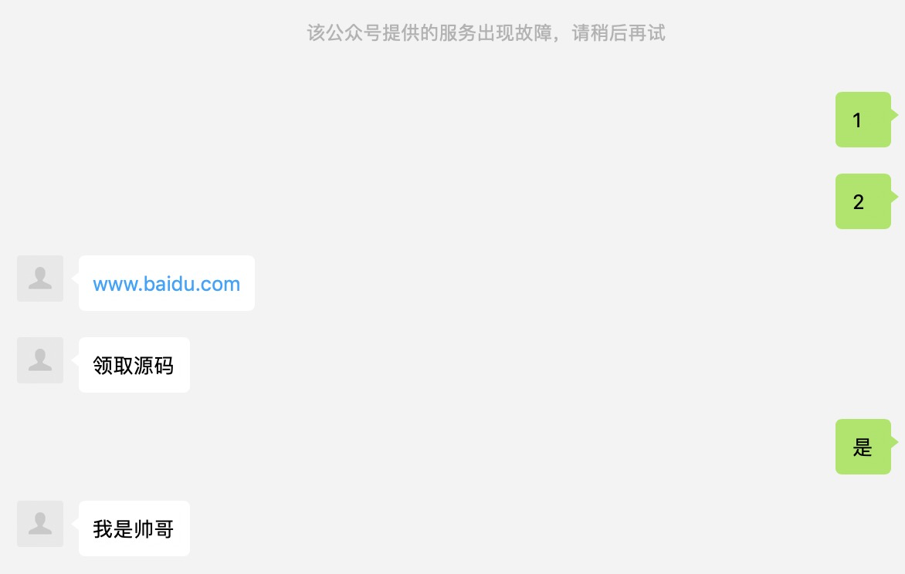
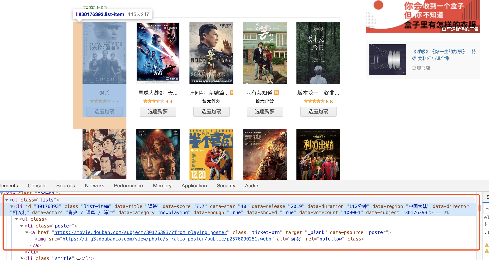
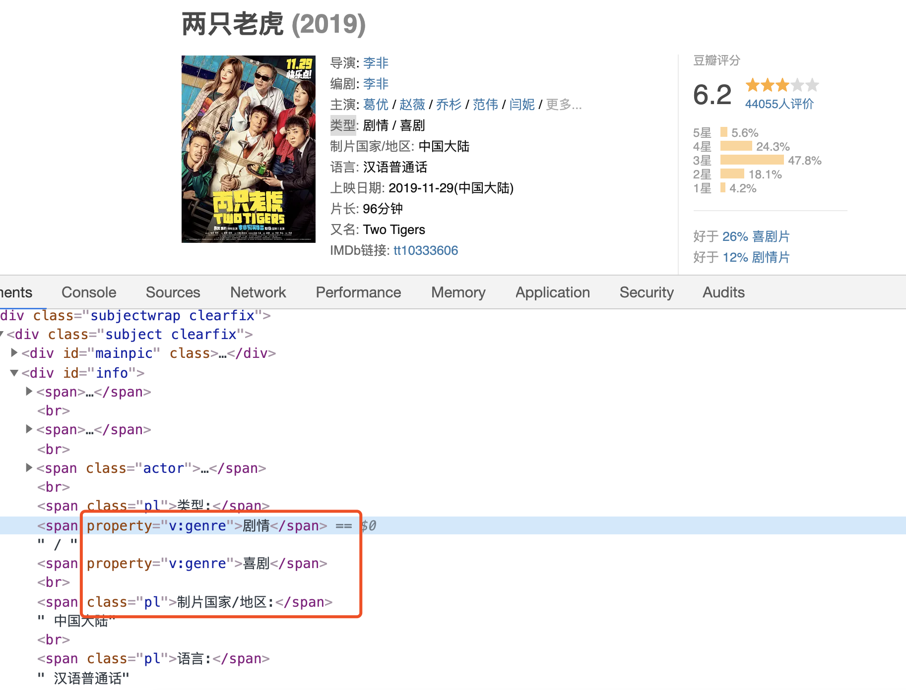

# 获取用户发送的信息

```js

const sha1 = require('sha1')
const config = require('../config')
module.exports = () => {
    return (req, res, next) => {
        // 微信服务器提交的参数
        // console.log(req.query);
        const { signature, echostr, timestamp, nonce } = req.query
        const { token } = config
        //定义一个数组，排序
        const arr = [timestamp, nonce, token]
        const arrSort = arr.sort();
        const str = arr.join('')
        const sha1Str = sha1(str)

        // 接收用户的消息
        // 微信服务器发送两种类型
        // get -》验证服务器有效性
        // post -》用户的数据以post提交方式
        console.log(req.method);
        
        if (req.method === "GET") {
            if (sha1Str === signature) {
                console.log("我是get");
                res.send(echostr)
            } else {
                res.end('error')
            }
        } else if (req.method === "POST") {
            // 验证消息来自微信服务器
            if (sha1Str !== signature) {
                res.end('error')
            }
            // console.log(req.query);
            console.log("我是post");
            /*
            
            { signature: '2da0dc4e29442733d4258a92b2604a4eacb0e75c',
                timestamp: '1576730268',
                nonce: '1329001144',
                openid: 'oz1NUxBLzGsOZ_J4Bq9t7UYqLfzg' }用户的微信id
            
            */

            // 接收数据
            let xmlData = ''
            let result = new Promise((resolve,reject)=>{
                req.on('data',data=>{
                    console.log(data);//<Buffer
                    xmlData+=data.toString()//把buffer转成字符串
                    resolve(xmlData)
                }).on('end',()=>{
                    // 接收完毕触发
                })
            })
            result.then(res=>{
                console.log(res);
            })
            
        } else {
            res.end('error')
        }
    }
}
```

```xml
结果
<xml><ToUserName><![CDATA[gh_3811d1c17e22]]></ToUserName>开发者id
<FromUserName><![CDATA[oz1NUxBLzGsOZ_J4Bq9t7UYqLfzg]]></FromUserName>用户的openid
<CreateTime>1576737821</CreateTime>发送时间戳
<MsgType><![CDATA[text]]></MsgType>发送的类型
<Content><![CDATA[啦啦啦啦]]></Content>内容
<MsgId>22573458034780932</MsgId>消息id 微信服务器默认保存3天
</xml>
```

- 将xml解析成json

```js
cnpm i xml2js
const {parseString} = require('xml2js')
```

```js

const sha1 = require('sha1')
const config = require('../config')
const { parseString } = require('xml2js')
module.exports = () => {
    return (req, res, next) => {
        // 微信服务器提交的参数
        // console.log(req.query);
        const { signature, echostr, timestamp, nonce } = req.query
        const { token } = config
        //定义一个数组，排序
        const arr = [timestamp, nonce, token]
        const arrSort = arr.sort();
        const str = arr.join('')
        const sha1Str = sha1(str)

        // 接收用户的小新
        // 微信服务器发送两种类型
        // get -》验证服务器有效性
        // post -》用户的数据以post提交方式
        console.log(req.method);

        if (req.method === "GET") {
            if (sha1Str === signature) {
                console.log("我是get");
                res.send(echostr)
            } else {
                res.end('error')
            }
        } else if (req.method === "POST") {
            // 验证消息来自微信服务器
            if (sha1Str !== signature) {
                res.end('error')
            }
            // console.log(req.query);
            console.log("我是post");
            /*
            
            { signature: '2da0dc4e29442733d4258a92b2604a4eacb0e75c',
                timestamp: '1576730268',
                nonce: '1329001144',
                openid: 'oz1NUxBLzGsOZ_J4Bq9t7UYqLfzg' }用户的微信id
            
            */

            // 接收数据
            let xmlData = ''
            let result = new Promise((resolve, reject) => {
                req.on('data', data => {
                    // console.log(data);//<Buffer
                    xmlData += data.toString()//把buffer转成字符串
                    resolve(xmlData)
                }).on('end', () => {
                    // 接收完毕触发
                })
            })
            result.then(res => {
                const json =xmlToJson(res)
                json.then(res=>{
                    console.log(res);
                })
                
                
            })

        } else {
            res.end('error')
        }
    }
}

 function xmlToJson(xmldata) {
    return new Promise((resolve,reject)=>{
        parseString(xmldata, { trim: true }, (err, data) => {
            if (!err) {
                console.log(data);
                resolve(data)
            } else {
                reject('err')
            }
        })
    })
 
}
```

结果

```js
{ xml:
   { ToUserName: [ 'gh_3811d1c17e22' ],
     FromUserName: [ 'oz1NUxBLzGsOZ_J4Bq9t7UYqLfzg' ],
     CreateTime: [ '1576739060' ],
     MsgType: [ 'text' ],
     Content: [ 'adfasdf' ],
     MsgId: [ '22573472070690913' ] } }
```

重新处理数据

```js

const sha1 = require('sha1')
const config = require('../config')
const { parseString } = require('xml2js')
module.exports = () => {
    return (req, res, next) => {
        // 微信服务器提交的参数
        // console.log(req.query);
        const { signature, echostr, timestamp, nonce } = req.query
        const { token } = config
        //定义一个数组，排序
        const arr = [timestamp, nonce, token]
        const arrSort = arr.sort();
        const str = arr.join('')
        const sha1Str = sha1(str)

        // 接收用户的小新
        // 微信服务器发送两种类型
        // get -》验证服务器有效性
        // post -》用户的数据以post提交方式
        console.log(req.method);

        if (req.method === "GET") {
            if (sha1Str === signature) {
                console.log("我是get");
                res.send(echostr)
            } else {
                res.end('error')
            }
        } else if (req.method === "POST") {
            // 验证消息来自微信服务器
            if (sha1Str !== signature) {
                res.end('error')
            }
            // console.log(req.query);
            console.log("我是post");
            /*
            
            { signature: '2da0dc4e29442733d4258a92b2604a4eacb0e75c',
                timestamp: '1576730268',
                nonce: '1329001144',
                openid: 'oz1NUxBLzGsOZ_J4Bq9t7UYqLfzg' }用户的微信id
            
            */

            // 接收数据
            let xmlData = ''
            let result = new Promise((resolve, reject) => {
                req.on('data', data => {
                    // console.log(data);//<Buffer
                    xmlData += data.toString()//把buffer转成字符串
                    resolve(xmlData)
                }).on('end', () => {
                    // 接收完毕触发
                })
            })
            result.then(res => {
                const json =xmlToJson(res)
                json.then(res=>{
                    let msg = {}
                    if(typeof res === "object"){
                        for (const key in res) {
                      
                            
                            let value = res[key]
                            for (const key in value) {
                                if(Array.isArray(value[key])&&value[key].length>0 ){
                                    msg[key] = value[key][0]
                                }
                            }
                        }
                    }
                    // console.log(msg);
                    /*
                        { ToUserName: 'gh_3811d1c17e22',
                        FromUserName: 'oz1NUxBLzGsOZ_J4Bq9t7UYqLfzg',
                        CreateTime: '1576740432',
                        MsgType: 'text',
                        Content: 'asdfas',
                        MsgId: '22573495682869495' }
                    
                    
                    */

                    // 简单的自动回复文本内容


                })
               
                
                
            })

        } else {
            res.end('error')
        }
    }
}

 function xmlToJson(xmldata) {
    return new Promise((resolve,reject)=>{
        parseString(xmldata, { trim: true }, (err, data) => {
            if (!err) {
                resolve(data)
            } else {
                reject('err')
            }
        })
    })
 
}
```

- 一旦遇到一下情况，微信都会在公众号会话中向用户发送系统提示“该公众号出现故障，请稍后再试”
  - 开发者在5秒内未回复任何内容
  - 开发者回复了异常数据，比如json、字符串、xml数据中有多余的空格、空字符串等



```xml
<xml>
  <ToUserName><![CDATA[toUser]]></ToUserName>
  <FromUserName><![CDATA[fromUser]]></FromUserName>
  <CreateTime>12345678</CreateTime>
  <MsgType><![CDATA[text]]></MsgType>
  <Content><![CDATA[你好]]></Content>
</xml>
```

最终：

```js

const sha1 = require('sha1')
const config = require('../config')
const { parseString } = require('xml2js')
module.exports = () => {
    return (req, res, next) => {
        // 微信服务器提交的参数
        // console.log(req.query);
        const { signature, echostr, timestamp, nonce } = req.query
        const { token } = config
        //定义一个数组，排序
        const arr = [timestamp, nonce, token]
        const arrSort = arr.sort();
        const str = arr.join('')
        const sha1Str = sha1(str)

        // 接收用户的小新
        // 微信服务器发送两种类型
        // get -》验证服务器有效性
        // post -》用户的数据以post提交方式
        console.log(req.method);

        if (req.method === "GET") {
            if (sha1Str === signature) {
                console.log("我是get");
                res.send(echostr)
            } else {
                res.end('error')
            }
        } else if (req.method === "POST") {
            // 验证消息来自微信服务器
            if (sha1Str !== signature) {
                res.end('error')
            }
            // console.log(req.query);
            console.log("我是post");
            /*
            
            { signature: '2da0dc4e29442733d4258a92b2604a4eacb0e75c',
                timestamp: '1576730268',
                nonce: '1329001144',
                openid: 'oz1NUxBLzGsOZ_J4Bq9t7UYqLfzg' }用户的微信id
            
            */

            // 接收数据
            let xmlData = ''
            let result = new Promise((resolve, reject) => {
                req.on('data', data => {
                    // console.log(data);//<Buffer
                    xmlData += data.toString()//把buffer转成字符串
                    resolve(xmlData)
                }).on('end', () => {
                    // 接收完毕触发
                })
            })
            var callmsg = result.then(res => {
                const json =xmlToJson(res)
                var str = json.then(res=>{
                    let msg = {}
                    if(typeof res === "object"){
                        for (const key in res) {
                      
                            
                            let value = res[key]
                            for (const key in value) {
                                if(Array.isArray(value[key])&&value[key].length>0 ){
                                    msg[key] = value[key][0]
                                }
                            }
                        }
                    }
                    // console.log(msg);
                    /*
                        { ToUserName: 'gh_3811d1c17e22',
                        FromUserName: 'oz1NUxBLzGsOZ_J4Bq9t7UYqLfzg',
                        CreateTime: '1576740432',
                        MsgType: 'text',
                        Content: 'asdfas',
                        MsgId: '22573495682869495' }
                    
                    
                    */
                    // 判断用户发送的消息是否是文本消息
                    let content = ''
                    if(msg.MsgType === "text"){
                        if(msg.Content === "1"){
                            content="领取源码"
                        }else if(msg.Content === "2"){
                            content="www.baidu.com"
                        }else if(msg.Content.match('是')){
                            content="我是帅哥"
                        }else{
                            content="没有相关资讯"
                        }
                        
                    }
                    // 简单的自动回复文本内容
                    let callMsg = `<xml>
                    <ToUserName><![CDATA[${msg.FromUserName}]]></ToUserName>
                    <FromUserName><![CDATA[${msg.ToUserName}]]></FromUserName>
                    <CreateTime>${Date.now()}</CreateTime>
                    <MsgType><![CDATA[text]]></MsgType>
                    <Content><![CDATA[${content}]]></Content>
                  </xml>`

                    return callMsg;

                })
                return str
            })
            callmsg.then(data=>{
                console.log(data);
                res.send(data)
            })

        } else {
            res.end('error')
        }
    }
}

 function xmlToJson(xmldata) {
    return new Promise((resolve,reject)=>{
        parseString(xmldata, { trim: true }, (err, data) => {
            if (!err) {
                resolve(data)
            } else {
                reject('err')
            }
        })
    })
 
}
```



# Puppeteer爬虫

github：<https://github.com/puppeteer/puppeteer>

中文文档：<https://www.kancloud.cn/luponu/puppeteer/870135>

爬取数据

```
npm i puppeteer --save-dev
npm i puppeteer-core
```

```js
const puppeteer = require('puppeteer');

(async () => {
  const browser = await puppeteer.launch();
  const page = await browser.newPage();
  await page.goto('https://example.com');
  await page.screenshot({path: 'example.png'});//截屏 
  await browser.close();
})();
```



```js
const puppeteer = require("puppeteer")
const url = 'https://movie.douban.com/cinema/nowplaying/haerbin/'
module.exports = async () => {
    // 打开浏览器
    const browser = await puppeteer.launch({
        // args: [''],
        headless: false, //以无头浏览器的形式代开浏览器，没有界面显示，在后台运行，默认的true


    });
    // 创建标签页
    const page = await browser.newPage();
    // 跳转到指定网址
    await page.goto(url, {
        waitUntil: 'networkidle2'//等待网络空闲时在跳转加载页面
    });
    // 等待网址加载完成，开始爬取数据，开启延时器，延时2秒在爬取数据
    await timeout();

    const result = await page.evaluate(() => {
        // 对加载好的页面进行dom操作
        // 获取所有热门电影的li  需要8个
        const $list = $('#nowplaying>.mod-bd>.lists>.list-item')
        const result = []
        for (let i = 0; i < 8; i++) {
            const liDom = $list[i];
            let title = $(liDom).data('title')
            let score = $(liDom).data('score')
            let durations = $(liDom).data('duration')
            let actors = $(liDom).data('actors')
            //    详情网址
            let href = $(liDom).find('.poster>a').attr('href')
            // 海报图
            let img = $(liDom).find('.poster>a>img').attr('src')
            result.push({
                title,
                score,
                durations,
                actors,
                href,
                img

            })
        }
       
        // 将数据返回
        return result;
    })
    console.log(result);
    // 浏览器关闭
    await browser.close();
    return result
}
function timeout() {
    return new Promise(resolve => {
        setTimeout(resolve, 2000)
    })
}
```

测试

```js
const douban = require('./crawler/douban')
douban()
```

```js
[ { title: '误杀',
    score: 7.7,
    durations: '112分钟',
    actors: '肖央 / 谭卓 / 陈冲',
    href:
     'https://movie.douban.com/subject/30176393/?from=playing_poster',
    img:
     'https://img3.doubanio.com/view/photo/s_ratio_poster/public/p2576090251.webp' },
  { title: '星球大战9：天行者崛起',
    score: 6.9,
    durations: '142分钟',
    actors: '黛西·雷德利 / 亚当·德赖弗 / 奥斯卡·伊萨克',
    href:
     'https://movie.douban.com/subject/22265687/?from=playing_poster',
    img:
     'https://img1.doubanio.com/view/photo/s_ratio_poster/public/p2575456458.webp' },
  { title: '叶问4：完结篇',
    score: 0,
    durations: '107分钟',
    actors: '甄子丹 / 吴樾 / 吴建豪',
    href:
     'https://movie.douban.com/subject/26885074/?from=playing_poster',
    img:
     'https://img9.doubanio.com/view/photo/s_ratio_poster/public/p2577437186.webp' },
  { title: '只有芸知道',
    score: 0,
    durations: '132分钟',
    actors: '黄轩 / 杨采钰 / 徐帆',
    href:
     'https://movie.douban.com/subject/33436135/?from=playing_poster',
    img:
     'https://img3.doubanio.com/view/photo/s_ratio_poster/public/p2575158172.webp' },
  { title: '坂本龙一：终曲',
    score: 8.8,
    durations: '100分钟',
    actors: '坂本龙一',
    href:
     'https://movie.douban.com/subject/26984189/?from=playing_poster',
    img:
     'https://img3.doubanio.com/view/photo/s_ratio_poster/public/p2575892083.webp' },
  { title: '被光抓走的人',
    score: 7.1,
    durations: '131分钟',
    actors: '黄渤 / 王珞丹 / 谭卓',
    href:
     'https://movie.douban.com/subject/30394535/?from=playing_poster',
    img:
     'https://img1.doubanio.com/view/photo/s_ratio_poster/public/p2575887979.webp' },
  { title: '南方车站的聚会',
    score: 7.4,
    durations: '113分钟',
    actors: '胡歌 / 桂纶镁 / 廖凡',
    href:
     'https://movie.douban.com/subject/27668250/?from=playing_poster',
    img:
     'https://img9.doubanio.com/view/photo/s_ratio_poster/public/p2574278284.webp' },
  { title: '半个喜剧',
    score: 0,
    durations: '111分钟',
    actors: '任素汐 / 吴昱翰 / 刘迅',
    href:
     'https://movie.douban.com/subject/30269016/?from=playing_poster',
    img:
     'https://img3.doubanio.com/view/photo/s_ratio_poster/public/p2577327061.webp' } ]
```

# 获取电影简介及类型



```js
const puppeteer = require("puppeteer")
const url = 'https://movie.douban.com/cinema/nowplaying/haerbin/'
module.exports = async () => {
    // 打开浏览器
    const browser = await puppeteer.launch({
        // args: [''],
        headless: true, //以无头浏览器的形式代开浏览器，没有界面显示，在后台运行，默认的true


    });
    // 创建标签页
    const page = await browser.newPage();
    // 跳转到指定网址
    await page.goto(url, {
        waitUntil: 'networkidle2'//等待网络空闲时在跳转加载页面
    });
    // 等待网址加载完成，开始爬取数据，开启延时器，延时2秒在爬取数据
    await timeout();

    const result = await page.evaluate(() => {
        // 对加载好的页面进行dom操作
        // 获取所有热门电影的li  需要8个
        const $list = $('#nowplaying>.mod-bd>.lists>.list-item')
        const result = []
        for (let i = 0; i < 8; i++) {
            const liDom = $list[i];
            let title = $(liDom).data('title')
            let score = $(liDom).data('score')
            let durations = $(liDom).data('duration')
            let actors = $(liDom).data('actors')
            //    详情网址
            let href = $(liDom).find('.poster>a').attr('href')
            // 海报图
            let img = $(liDom).find('.poster>a>img').attr('src')
            result.push({
                title,
                score,
                durations,
                actors,
                href,
                img

            })
        }

        // 将数据返回
        return result;
    })

    for (let i = 0; i < result.length; i++) {
        let item = result[i]
        let url = result[i].href
        await page.goto(url, {
            waitUntil: 'networkidle2'//等待网络空闲时在跳转加载页面
        });
        let itemresult = await page.evaluate(() => {
            // 类型
            let category = []
            var cates = $('[property="v:genre"]')
            for (let index = 0; index < cates.length; index++) {
                category.push(cates[index].innerText)
            }
            // 简介
            var summary = $('[property="v:summary"]').html()
            // 给对象添加属性
            return {
                category,
                summary
            }
        })
        // 在evaluate中无法读取到服务器中的变量，他爬取的是网页的
        item.genre = itemresult.category
        item.summary = itemresult.summary
    }
    console.log(result);
    return result
    // 浏览器关闭
    await browser.close();
}
function timeout() {
    return new Promise(resolve => {
        setTimeout(resolve, 2000)
    })
}
```

```js
[ { title: '误杀',
    score: 7.7,
    durations: '112分钟',
    actors: '肖央 / 谭卓 / 陈冲',
    href:
     'https://movie.douban.com/subject/30176393/?from=playing_poster',
    img:
     'https://img3.doubanio.com/view/photo/s_ratio_poster/public/p2576090251.webp',
    genre: [ '剧情', '悬疑', '犯罪' ],
    summary:
     '\n                                　　李维杰与妻子阿玉来泰打拼17年，膝下育有两个女儿，年届四十的他靠开设网络公司为生，为人也颇得小镇居民的好感，而这一切美好却被突如其来的不速之客打破。这个充斥走私，贩毒活动的边陲小镇，各种权力交织碾压公平正义。李维杰的大女儿被督察长的儿子强暴，因反抗误杀对方。李维杰曾亲眼 目睹督察长滥用私刑，深知法律无用，为了维护女儿，捍卫家人，李维杰埋尸掩盖一切证据，在时间与空间的交错缝隙中，与警方在身心层面，展开了殊死一搏的较量。\n                        ' },
  { title: '星球大战9：天行者崛起',
    score: 6.8,
    durations: '142分钟',
    actors: '黛西·雷德利 / 亚当·德赖弗 / 奥斯卡·伊萨克',
    href:
     'https://movie.douban.com/subject/22265687/?from=playing_poster',
    img:
     'https://img1.doubanio.com/view/photo/s_ratio_poster/public/p2575456458.webp',
    genre: [ '动作', '科幻', '冒险' ],
    summary:
     '\n                                　　本片为2017年电影《星球大战：最后的绝地武士》的续集，“星球大战后传三部曲”的第三部作品，同时是“天行者传奇”的第九部作品以及最终章。在卢克·天行者化为绝地英灵的一年后，残存的抵抗势力将再次面对第一秩序。同时，绝地和西斯之间的大战将天行者的传奇带到最后。\n                        ' },
  { title: '叶问4：完结篇',
    score: 0,
    durations: '107分钟',
    actors: '甄子丹 / 吴樾 / 吴建豪',
    href:
     'https://movie.douban.com/subject/26885074/?from=playing_poster',
    img:
     'https://img9.doubanio.com/view/photo/s_ratio_poster/public/p2577437186.webp',
    genre: [ '剧情', '动作' ],
    summary:
     '\n                                　　因故来到美国唐人街的叶问，意外卷入一场当地军方势力与华人武馆的纠纷，面对日益猖狂的民族歧视与压迫，叶问挺身而出，在美国海军陆战队军营拼死一战，以正宗咏春，向世界证明了中国功夫。\n                        ' },
  { title: '半个喜剧',
    score: 7.6,
    durations: '111分钟',
    actors: '任素汐 / 吴昱翰 / 刘迅',
    href:
     'https://movie.douban.com/subject/30269016/?from=playing_poster',
    img:
     'https://img3.doubanio.com/view/photo/s_ratio_poster/public/p2577327061.webp',
    genre: [ '喜剧', '爱情' ],
    summary:
     '\n                                　　三个自由浪漫的年轻人，过着各怀心思的人生：有人急着摆脱单身，有人想在结婚前放荡一番，有人想在 大城市站稳脚跟。因为一次情感出轨，三人扭结成了一团“嬉笑怒骂”的乱麻。当各种价值观碰撞在一起， 当一个人需要平衡亲情友情与爱情......他们慌乱的生活，就像是半个喜剧。\n                        ' },
  { title: '只有芸知道',
    score: 6.6,
    durations: '132分钟',
    actors: '黄轩 / 杨采钰 / 徐帆',
    href:
     'https://movie.douban.com/subject/33436135/?from=playing_poster',
    img:
     'https://img3.doubanio.com/view/photo/s_ratio_poster/public/p2575158172.webp',
    genre: [ '剧情', '爱情' ],
    summary:
     '\n                                　　改编自冯小刚挚友的真实爱情经历，讲述了隋东风和罗芸之间相濡以沫的动人爱情故事。但罗芸隐藏了一个只有她知道的秘密，秘密的背后却是她对隋东风刻骨铭心的爱……\n                                    <br>\n                                　　\n                        ' },
  { title: '坂本龙一：终曲',
    score: 8.8,
    durations: '100分钟',
    actors: '坂本龙一',
    href:
     'https://movie.douban.com/subject/26984189/?from=playing_poster',
    img:
     'https://img3.doubanio.com/view/photo/s_ratio_poster/public/p2575892083.webp',
    genre: [ '纪录片', '音乐' ],
    summary:
     '\n                                　　这部关于日本顶级作曲家坂本龙一的纪录片，主要按照2012年到2017年的时间顺序，剪辑了坂本龙一30年前参与《末代皇帝》等电影以及40年前作为YMO乐队成员活动的宝贵片段。Coda在音乐术语中是，Coda是一个乐章最后的段落里强调终止效果的乐段。，正如有着匠人精神的坂本龙一，愿将每部作品都当做生命中的最后一部进行创作。\n                        ' },
  { title: '被光抓走的人',
    score: 7.1,
    durations: '131分钟',
    actors: '黄渤 / 王珞丹 / 谭卓',
    href:
     'https://movie.douban.com/subject/30394535/?from=playing_poster',
    img:
     'https://img1.doubanio.com/view/photo/s_ratio_poster/public/p2575887979.webp',
    genre: [ '剧情', '爱情', '科幻' ],
    summary:
     '\n                                　　据说该片的创作灵感来源于董润年的一个脑洞：“如果有一道神秘的光把一部分人抓走，社会的平静与法则被打破，我们该怎么办？” 在导演的脑洞中，光代表什么？为什么人会被光抓走？谁会被光抓走？留下来的人要怎么办？这一系列疑问未来都需要在片中得到解答。\n                        ' },
  { title: '南方车站的聚会',
    score: 7.4,
    durations: '113分钟',
    actors: '胡歌 / 桂纶镁 / 廖凡',
    href:
     'https://movie.douban.com/subject/27668250/?from=playing_poster',
    img:
     'https://img9.doubanio.com/view/photo/s_ratio_poster/public/p2574278284.webp',
    genre: [ '剧情', '犯罪' ],
    summary:
     '\n                                　　南方某城市，重案队长刘队（廖凡 饰）重金悬赏在逃罪犯周泽农（胡歌 饰）。陪泳女刘爱爱（桂纶镁 饰） 、周泽农曾经的好友华华（奇道 饰）、五年未见的妻子杨淑俊（万茜 饰），各色人等各怀心事，相继被卷入这场罪与罚的追击旋涡。冒险与爱情，人性与救赎，这场特别的“聚会”该如何收场？善恶有道一念之间。\n                                    <br>\n                                　　中国导演刁亦男曾凭借前作《白日焰火》获第 64届柏林国际电影节最佳影片金熊奖，凭本片入围第 72届戛纳国际电影节主竞赛单元。\n                        ' } ]
```

需要去掉换行

```js
var summary = $('[property="v:summary"]').html().replace(/\s+/g,'')
/\s+/g  全局匹配换行 空格等
```

```js
[ { title: '误杀',
    score: 7.7,
    durations: '112分钟',
    actors: '肖央 / 谭卓 / 陈冲',
    href:
     'https://movie.douban.com/subject/30176393/?from=playing_poster',
    img:
     'https://img3.doubanio.com/view/photo/s_ratio_poster/public/p2576090251.webp',
    genre: [ '剧情', '悬疑', '犯罪' ],
    summary:
     '李维杰与妻子阿玉来泰打拼17年，膝下育有两个女儿，年届四十的他靠开设网络公司为生，为人也颇得小镇居民的好感，而这一切美好却被突如其来的不速之客打破。这个充斥走私，贩毒活动的边陲小镇，各种权力交织碾压公平正义。李维杰的大女儿被督察长的儿子强暴，因反抗误杀对方。李维杰曾亲眼目睹督察长滥用私刑，深知法律无用，为了维护女儿，捍卫家人，李维杰埋尸掩盖一切证据，在时间与空间的交错缝隙中，与警方在身心层面，展开了殊死一搏的较量。' },
  { title: '星球大战9：天行者崛起',
    score: 6.8,
    durations: '142分钟',
    actors: '黛西·雷德利 / 亚当·德赖弗 / 奥斯卡·伊萨克',
    href:
     'https://movie.douban.com/subject/22265687/?from=playing_poster',
    img:
     'https://img1.doubanio.com/view/photo/s_ratio_poster/public/p2575456458.webp',
    genre: [ '动作', '科幻', '冒险' ],
    summary:
     '本片为2017年电影《星球大战：最后的绝地武士》的续集，“星球大战后传三部曲”的第三部作品，同时是“天行者传奇”的第九部作品以及最终章。在卢克·天行者化为绝地英灵的一年后，残存的抵抗势力将再次面对第一秩序。同时，绝地和西斯之间的大战将天行者的传奇带到最后。' },
  { title: '叶问4：完结篇',
    score: 0,
    durations: '107分钟',
    actors: '甄子丹 / 吴樾 / 吴建豪',
    href:
     'https://movie.douban.com/subject/26885074/?from=playing_poster',
    img:
     'https://img9.doubanio.com/view/photo/s_ratio_poster/public/p2577437186.webp',
    genre: [ '剧情', '动作' ],
    summary:
     '因故来到美国唐人街的叶问，意外卷入一场当地军方势力与华人武馆的纠纷，面对日益猖狂的民族歧视与压迫，叶问挺身而出，在美国海军陆战队军营拼死一战，以正宗咏春，向世界证明了中国功夫。' },
  { title: '半个喜剧',
    score: 7.6,
    durations: '111分钟',
    actors: '任素汐 / 吴昱翰 / 刘迅',
    href:
     'https://movie.douban.com/subject/30269016/?from=playing_poster',
    img:
     'https://img3.doubanio.com/view/photo/s_ratio_poster/public/p2577327061.webp',
    genre: [ '喜剧', '爱情' ],
    summary:
     '三个自由浪漫的年轻人，过着各怀心思的人生：有人急着摆脱单身，有人想在结婚前放荡一番，有人想在大城市站稳脚跟。因为一次情感出轨，三人扭结成了一团“嬉笑怒骂”的乱麻。当各种价值观碰撞在一起，当一个人需要平衡亲情友情与爱情......他们慌乱的生活，就像是半个喜剧。' },
  { title: '只有芸知道',
    score: 6.6,
    durations: '132分钟',
    actors: '黄轩 / 杨采钰 / 徐帆',
    href:
     'https://movie.douban.com/subject/33436135/?from=playing_poster',
    img:
     'https://img3.doubanio.com/view/photo/s_ratio_poster/public/p2575158172.webp',
    genre: [ '剧情', '爱情' ],
    summary:
     '改编自冯小刚挚友的真实爱情经历，讲述了隋东风和罗芸之间相濡以沫的动人爱情故事。但罗芸隐藏了一个只有她知道的秘密，秘密的背后却是她对隋东风刻骨铭心的爱……<br>' },
  { title: '坂本龙一：终曲',
    score: 8.8,
    durations: '100分钟',
    actors: '坂本龙一',
    href:
     'https://movie.douban.com/subject/26984189/?from=playing_poster',
    img:
     'https://img3.doubanio.com/view/photo/s_ratio_poster/public/p2575892083.webp',
    genre: [ '纪录片', '音乐' ],
    summary:
     '这部关于日本顶级作曲家坂本龙一的纪录片，主要按照2012年到2017年的时间顺序，剪辑了坂本龙一30年前参与《末代皇帝》等电影以及40年前作为YMO乐队成员活动的宝贵片段。Coda在音乐术语中是，Coda是一个乐章最后的段落里强调终止效果的乐段。，正如有着匠人精神的坂本龙一，愿将每部作品都当做生命中的最后一部进行创作。' },
  { title: '被光抓走的人',
    score: 7.1,
    durations: '131分钟',
    actors: '黄渤 / 王珞丹 / 谭卓',
    href:
     'https://movie.douban.com/subject/30394535/?from=playing_poster',
    img:
     'https://img1.doubanio.com/view/photo/s_ratio_poster/public/p2575887979.webp',
    genre: [ '剧情', '爱情', '科幻' ],
    summary:
     '据说该片的创作灵感来源于董润年的一个脑洞：“如果有一道神秘的光把一部分人抓走，社会的平静与法则被打破，我们该怎么办？”在导演的脑洞中，光代表什么？为什么人会被光抓走？谁会被光抓走？留下来的人要怎么办？这一系列疑问未来都需要在片中得到解答。' },
  { title: '南方车站的聚会',
    score: 7.4,
    durations: '113分钟',
    actors: '胡歌 / 桂纶镁 / 廖凡',
    href:
     'https://movie.douban.com/subject/27668250/?from=playing_poster',
    img:
     'https://img9.doubanio.com/view/photo/s_ratio_poster/public/p2574278284.webp',
    genre: [ '剧情', '犯罪' ],
    summary:
     '南方某城市，重案队长刘队（廖凡饰）重金悬赏在逃罪犯周泽农（胡歌饰）。陪泳女刘爱爱（桂纶镁饰）、周泽农曾经的好友华华（奇道饰）、五年未见的妻子杨淑俊（万茜饰），各色人等各怀心事，相继被卷入这场罪与罚的追击旋涡。冒险与爱情，人性与救赎，这场特别的“聚会”该如何收场？善恶有道一念之间。<br>中国导演刁亦男曾凭借前作《白日焰火》获第64届柏林国际电影节最佳影片金熊奖，凭本片入围第72届戛纳国际电影节主竞赛单元。' } ]
```


# 保存到数据库

```sh
cnpm i mongoose
```

- 终端启动  mongod
- db.js

```js
const mongoose = require('mongoose')
module.exports =   new Promise((resolve, reject) => {
    mongoose.connect('mongodb://localhost:27017/cms', { useNewUrlParser: true })//异步的方法连接数据可能需要时间
    // 必须连上数据库后才操作数据
    mongoose.connection.once('open', err => {
        if (!err) {
            console.log("数据库连接成功");
            resolve()
        }else{
            reject('连接失败'+err)
        }
    })
    
}) 
```

- savedb.js

```js
const mongoose = require('mongoose')
const Schema = mongoose.Schema;
//创建表
const movieSchema = new Schema({
    title: String,
    score: Number,
    durations: String,
    actors: String,
    img: String,
    genre: [String],
    summary: String,
    createTime: {
        type: Date,
        default: Date.now()
    }
})
// 创建模型对象
const movie = mongoose.model('Movie', movieSchema)
// 暴露出去
module.exports = movie
```

- Savetodb.js

```js
const movie = require('../db/savedb')

module.exports = async data => {
    for (var i = 0; i < data.length; i++) {
        let item = data[i]
        const result = await movie.create({
            title: item.title,
            score: item.score,
            durations: item.durations,
            actors: item.actors,
            img: item.img,
            genre: item.genre,
            summary: item.summary,
        })
        console.log("数据保存成功");
        console.log(result);
    }
}
```

- 测试 node test.js

```js
const douban = require('./puppeteer')


// 引入数据库模块
const db = require('../db');
const savetodb = require('./savetodb');


(async () => {
        // 连接数据库
        await db;
        // 爬取数据
        const data = await douban();
        // 保存到数据库
        await savetodb(data)
})()
```

