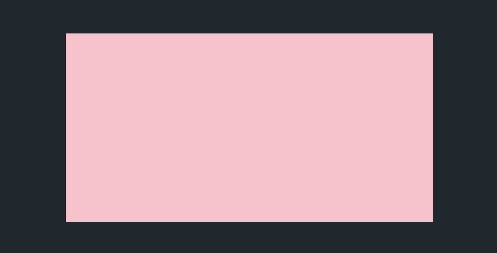
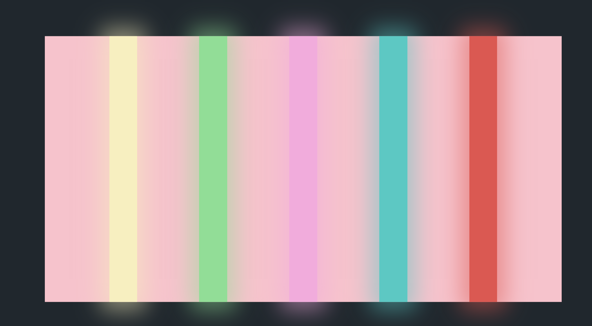
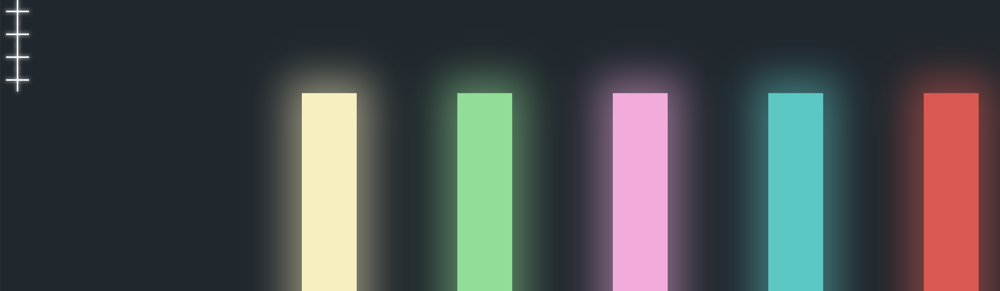

### 基础布局



```html
<!DOCTYPE html>
<html lang="en">

<head>
    <meta charset="UTF-8">
    <meta name="viewport" content="width=device-width, initial-scale=1.0">
    <title>Document</title>
    <link rel="stylesheet" href="./index.css">
</head>

<body>
    <div class="container">
        <div class="video">
            <div class="colors">
                <div class="color1 color"></div>
                <div class="color2 color"></div>
                <div class="color3 color"></div>
                <div class="color4 color"></div>
                <div class="color5 color"></div>
            </div>
        </div>
    </div>
</body>

</html>
```

```less
@import url("https://fonts.googleapis.com/css?family=Luckiest+Guy&display=swap");

body {
    background-color:#1e272e;
    overflow:hidden;
    font-family: "Luckiest Guy", cursive;
}
.container{
    .video {
        width: 70%;
        height:70%;
        margin: auto;
        position: absolute;
        top: 50%;
        left: 50%;
        transform: translate(-50%, -50%);
        background-color: pink;
    }
}
```

### 线条放大




```css
body {
    background-color:#1e272e;
    overflow:hidden;
    font-family:'Exo 2', sans-serif;
}
.container{
    .video {
        width: 70%;
        height:70%;
        margin: auto;
        position: absolute;
        top: 50%;
        left: 50%;
        transform: translate(-50%, -50%);
        // background-color: pink;
        .color {
            display:inline-block;
            width:16%;
            height:100%;
            // 每个线条宽度缩小在放大在缩小为0
            animation: animation1 1.5s ease forwards;
        }
        .colors {
            position:absolute;
            top:0;
            left:0;
            right:0;
            bottom:0;
            text-align:center;
            // background-color: lightgreen;
            // 线条外的盒子 整体放大
            animation: animation1-1 1.5s ease forwards;
            // 每个线条的颜色
            .color1 {
                background-color:rgba(248, 239, 186, 1.0);
                box-shadow: 0px 0px 50px 20px rgba(248, 239, 186, .5);
            }
            .color2 {
                background-color:rgba(120, 224, 143, 1.0);
                box-shadow: 0px 0px 50px 20px rgba(120, 224, 143, .5);
            }
            .color3 {
                background-color:rgba(253, 167, 223, 1.0);
                box-shadow: 0px 0px 50px 20px rgba(253, 167, 223, .5);
            }
            .color4 {
                background-color:rgba(18, 203, 196, 1.0);
                box-shadow: 0px 0px 50px 20px rgba(18, 203, 196, .5);
            }
            .color5 {
                background-color:rgba(235, 77, 75, 1.0);
                box-shadow: 0px 0px 50px 20px rgba(235, 77, 75, .5);
            }
        }
    }
}


@keyframes animation1-1 {
    0% {
        transform:scale(1);
    }
    50% {
        transform:scale(1);
    }
    70% {
        transform:scale(2);
    }
    100% {
        transform:scale(1);
    }
}

@keyframes animation1 {
    0% {
        margin-left:0%;
        margin-right:0%;
        width:16%;
        transform:scale(1);
    }
    50% {
        margin-left:6%;
        margin-right:6%;
        width:5%;
        transform:scale(1);
    }
    70% {
        margin-left:6%;
        margin-right:6%;
        width:5%;
        transform:scale(2);
    }
    90% {
        margin-left:0%;
        margin-right:0%;
        width:5%;
        transform:scale(.1);
    }
    100% {
        margin-left:2%;
        margin-right:2%;
        width:5%;
        transform:scale(0);
    }
}
```

### 4个叉



```js
// 4个叉
    .plus {
        position:relative;    
        height:30px;  
        width:30px;  
    }   
    // 竖杠
    .plus:after {
        background-color:white;
        content:"";
        height:30px;
        width:2px;
        color:white;
        position:absolute;
        margin-left:14px;
        box-shadow:0px 0px 5px 1px rgba(255, 255, 255, .5);
    }
    // 横杠
    .plus:before {
        margin-top:14px;
        background-color:white;
        content:"";
        height:2px;
        width:30px;
        color:white;
        position:absolute;
        box-shadow:0px 0px 5px 1px rgba(255, 255, 255, .5);
    }
```

```html
<!DOCTYPE html>
<html lang="en">

<head>
    <meta charset="UTF-8">
    <meta name="viewport" content="width=device-width, initial-scale=1.0">
    <title>Document</title>
    <link rel="stylesheet" href="./index.css">
</head>

<body>
    <div class="container">
        <div class="video">
            <div class="colors">
                <!-- 线条 -->
                <div class="color1 color"></div>
                <div class="color2 color"></div>
                <div class="color3 color"></div>
                <div class="color4 color"></div>
                <div class="color5 color"></div>
            </div>
        </div>
        <!-- 4个叉 -->
        <div class="plus plus-center plus1"></div>
        <div class="plus plus-center plus2"></div>
        <div class="plus plus-center plus3"></div>
        <div class="plus plus-center plus4"></div>
        <!-- 方块 -->


    </div>
</body>

</html>
```

让叉居中

```js
// 让叉居中
.plus-center {
    margin: auto;
    position: absolute;
    top: calc(50% - 15px);
    left: calc(50% - 15px);
    // 先隐藏
    opacity: 0;
}
```

4个叉做旋转动画

```js
    // 4个叉做动画
    // 从隐藏到显示，旋转0度到990度  等待1.3s开始
    .plus1 {
        animation: crotate 5s ease forwards 1.3s;
    }
    .plus2 {
        animation: crotate 5s ease forwards 1.3s;
    }
    .plus3 {
        animation: crotate 5s ease forwards 1.3s;
    }
    .plus4 {
        animation: crotate 5s ease forwards 1.3s;
    }
```

```js
@keyframes crotate {
    0% {
        opacity:0;
    }
    10% {
        opacity:1;
    }
    20% {
        opacity:1;
        transform:rotate(0deg);
    }
    70% {
        opacity:1;
        transform:rotate(880deg);
    }
    100% {
        opacity:1;
        transform:rotate(900deg);
    }
}

```

4个叉位移

```js
 // 4个叉做动画
    // 从隐藏到显示，旋转0度到990度  等待1.3s开始
    .plus1 {
        animation: crotate 5s ease forwards 1.3s,leftTop 1s ease forwards 4s;
    }
    .plus2 {
        animation: crotate 5s ease forwards 1.3s,rightTop 1s ease forwards 4s;
    }
    .plus3 {
        animation: crotate 5s ease forwards 1.3s,leftBottom 1s ease forwards 4s;
    }
    .plus4 {
        animation: crotate 5s ease forwards 1.3s,rightBottom 1s ease forwards 4s;
    }
```

```js
// 4个叉旋转后移动到四个角
@keyframes leftTop {
    0% {
        top: calc(50% - 15px);
        left: calc(50% - 15px);
        opacity:1;
    }
    60% {
        top: calc(20% - 15px);
        left: calc(20% - 15px);
        opacity:1;
        transform:rotate(0deg);
    }
    100% {
        top: calc(10% - 15px);
        left: calc(10% - 15px);
        opacity:1;
        transform:rotate(45deg);
    }
}
@keyframes rightTop {


    0% {


        top: calc(50% - 15px);


        left: calc(50% - 15px);


        opacity:1;


    }


    60% {


        top: calc(20% - 15px);


        left: calc(80% - 15px);


        opacity:1;


        transform:rotate(0deg);


    }


    100% {


        top: calc(10% - 15px);


        left: calc(90% - 15px);


        opacity:1;


        transform:rotate(45deg);


    }


}


@keyframes leftBottom {


    0% {


        top: calc(50% - 15px);


        left: calc(50% - 15px);


        opacity:1;


    }


    60% {


        top: calc(80% - 15px);


        left: calc(20% - 15px);


        opacity:1;


        transform:rotate(0deg);


    }


    100% {


        top: calc(90% - 15px);


        left: calc(10% - 15px);


        opacity:1;


        transform:rotate(45deg);


    }


}


@keyframes rightBottom {


    0% {


        top: calc(50% - 15px);


        left: calc(50% - 15px);


        opacity:1;


    }


    60% {


        top: calc(80% - 15px);


        left: calc(80% - 15px);


        opacity:1;


        transform:rotate(0deg);


    }


    100% {


        top: calc(90% - 15px);


        left: calc(90% - 15px);


        opacity:1;


        transform:rotate(45deg);


    }


}
```

### 方块

```js

    // 方块

    .center-square {


        border:2px solid white;


        height:100px;


        width:200px;


        margin: auto;


        position: absolute;


        top: 50%;


        left: 50%;


        transform: translate(-50%, -50%);

        // 显示 隐藏 之间切换， 宽度的变化
        animation: block 1s linear 2.3s forwards ;


        opacity:0;


    }

}
```

```html
<!DOCTYPE html>
<html lang="en">

<head>
    <meta charset="UTF-8">
    <meta name="viewport" content="width=device-width, initial-scale=1.0">
    <title>Document</title>
    <link rel="stylesheet" href="./index.css">
</head>

<body>
    <div class="container">
        <div class="video">
            <div class="colors">
                <!-- 线条 -->
                <div class="color1 color"></div>
                <div class="color2 color"></div>
                <div class="color3 color"></div>
                <div class="color4 color"></div>
                <div class="color5 color"></div>
            </div>
        </div>
        <!-- 4个叉 -->
        <div class="plus plus-center plus1"></div>
        <div class="plus plus-center plus2"></div>
        <div class="plus plus-center plus3"></div>
        <div class="plus plus-center plus4"></div>
        <!-- 方块 -->
        <div class="center-square"></div>

    </div>
</body>

</html>
```

```js
// 方块

@keyframes block {


    0% {


        opacity:1;


    }


    5% {


        opacity:0;


    }


    10% {


        opacity:1;


    }


    23.9% {


        opacity:0;


        width:100px;


    }


    24% {


        opacity:1;


    }


    25% {


        opacity:0;


    }


    60% {


        opacity:1;


    }


    100% {


        opacity:0;


    }


}


```

### 文字信息

```html
<!DOCTYPE html>
<html lang="en">

<head>
    <meta charset="UTF-8">
    <meta name="viewport" content="width=device-width, initial-scale=1.0">
    <title>Document</title>
    <link rel="stylesheet" href="./index.css">
</head>

<body>
    <div class="container">
        <div class="video">
            <div class="colors">
                <!-- 线条 -->
                <div class="color1 color"></div>
                <div class="color2 color"></div>
                <div class="color3 color"></div>
                <div class="color4 color"></div>
                <div class="color5 color"></div>
            </div>
        </div>
        <!-- 4个叉 -->
        <div class="plus plus-center plus1"></div>
        <div class="plus plus-center plus2"></div>
        <div class="plus plus-center plus3"></div>
        <div class="plus plus-center plus4"></div>
        <!-- 方块 -->
        <div class="center-square"></div>
        <!-- 文字信息 -->
        <div class="top-text first-text">
            <div class="this">THIS&nbsp;</div>
            <div class="is">IS&nbsp;</div>
            <div class="my">我的助手</div>
        </div>

    </div>
</body>

</html>
```

```js
// 文字信息
    // 居中
    .top-text {
        position:absolute;
        left:0;
        right:0;
        margin: 0 auto;
        top:20px;
        text-align:center;
        color: white;
        font-size: 30px;
        // 文字整体做动画
        animation: text 2s ease 2.3s forwards;
    }
    // 文字一行
    .first-text div {
        display:inline-block;
        color:white;
        opacity:0;
        margin-left:10px;
    }
    // 文字分别做动画
    .welcome {
        animation: welcome 1s ease 1.3s forwards;
    }
    .to {
        animation: to 1s ease 1.3s forwards;
    }
    .as {
        animation: as 1s ease 1.3s forwards;
    }
```

```js
// 文字整体做动画
@keyframes text {
    0% {
        font-size:14px;
    }
    20% {
        font-size:25px;
        top:20px;
    }
    22% {
        font-size:25px;
        top:20px;
        filter:blur(3px);
    }
    32% {
        font-size:25px;
        top:20px;
        filter:blur(0px);
    }
    80% {
        font-size:25px;
        top:20px;
        filter:blur(0px);
    }
    82% {
        font-size:25px;
        top:20px;
         // 改变模糊度
        filter:blur(3px);
    }
    85% {
        font-size:25px;
        top:20px;
        
        filter:blur(3px);
    }
    100% {
        font-size:25px;
        top:-100px;
    }
}


```

### 网格图片

```html
<!DOCTYPE html>
<html lang="en">

<head>
    <meta charset="UTF-8">
    <meta name="viewport" content="width=device-width, initial-scale=1.0">
    <title>Document</title>
    <link rel="stylesheet" href="./index.css">
</head>

<body>
    <div class="container">
        <div class="video">
            <div class="colors">
                <!-- 线条 -->
                <div class="color1 color"></div>
                <div class="color2 color"></div>
                <div class="color3 color"></div>
                <div class="color4 color"></div>
                <div class="color5 color"></div>
            </div>
        </div>
        <!-- 4个叉 -->
        <div class="plus plus-center plus1"></div>
        <div class="plus plus-center plus2"></div>
        <div class="plus plus-center plus3"></div>
        <div class="plus plus-center plus4"></div>
        <!-- 方块 -->
        <div class="center-square"></div>
        <!-- 文字信息 -->
        <div class="top-text first-text">
            <div class="welcome">Welcome&nbsp;</div>
            <div class="to">To&nbsp;</div>
            <div class="as">AISHANG</div>
        </div>
        <!-- 网格图片 -->
        <div class="projects">
            <div class="row row-first">
                <!-- div这里换行 会有1px 间隔  不能换行  25%的时候 图片放不进去 -->
                <!--  因为两个子div是行内块元素 inline-block, 这样的两个元素之间有空白字符会占据一定的空间，可以把两个元素之间的空白删掉，或者把父元素的字体大小设为0。具体可以看一下行内的盒模型 -->
                <div class="project binary"></div><div class="project arcade"></div><div class="project building"></div><div class="project ball"></div>
            </div>
            <div class="row row-second"><div class="project pikachu"></div><div class="project torchic"></div><div class="project portfolio"></div><div class="project ps4"></div>
            </div>
        </div>
    </div>
</body>

</html>
```

网格整体动画，宽度的改变

```js
    // 网格图片 
    // 让网格居中
    .projects {
        width: 0%;
        height:0%;
        margin: auto;
        position: absolute;
        top: 50%;
        left: 50%;
        transform: translate(-50%, -50%);
        background-color:black;
        animation:wg .9s ease 4.1s forwards;
    }
    // 行高
    .row {
        height:50%;
        .project {
            display:inline-block;
            width:25%;
            height:100%;
            vertical-align:top;
            color:white;
            background-size:cover;
            font-weight:bold;
            position:relative;
            cursor:pointer;
        }
    }
    .binary {
        background-image: url("./1.jpg");
    }
    .arcade {
        background-image: url("./15.jpeg");
    }
    .building {
        background-image: url("./7.jpeg");
    }
    .ball {
        background-image: url("./2.jpg");
    }
    .pikachu {
        background-image: url("./5.jpg");
        background-position:top;
    }
    .torchic {
        background-image: url("./3.jpeg");
        background-position:center;
    }
    .portfolio {
        background-image: url("./8.jpeg");
    }
    .ps4 {
        background-image: url("./17.jpeg");
        background-position:center;
    }


// 网格整体动画
@keyframes wg {
    0% {
        width:0%;
        height:0%;
    }
    100% {
        width:70%;
        height:80%;
    }
}

```

## 完整代码

```html
<!DOCTYPE html>
<html lang="en">

<head>
    <meta charset="UTF-8">
    <meta name="viewport" content="width=device-width, initial-scale=1.0">
    <title>Document</title>
    <link rel="stylesheet" href="./index.css">
</head>

<body>
    <div class="container">
        <div class="video">
            <div class="colors">
                <!-- 线条 -->
                <div class="color1 color"></div>
                <div class="color2 color"></div>
                <div class="color3 color"></div>
                <div class="color4 color"></div>
                <div class="color5 color"></div>
            </div>
        </div>
            <!-- 4个叉 -->
            <div class="plus plus-center plus1"></div>
            <div class="plus plus-center plus2"></div>
            <div class="plus plus-center plus3"></div>
            <div class="plus plus-center plus4"></div>
            <!-- 方块 -->
            <div class="center-square"></div>
            <!-- 文字信息 -->
            <div class="top-text first-text">
                <div class="welcome">Welcome&nbsp;</div>
                <div class="to">To&nbsp;</div>
                <div class="as">AISHANG</div>
            </div>
            <!-- 网格图片 -->
            <div class="projects">
                <div class="row row-first">
                    <!-- div这里换行 会有1px 间隔  不能换行  25%的时候 图片放不进去 -->
                    <!--  因为两个子div是行内块元素 inline-block, 这样的两个元素之间有空白字符会占据一定的空间，可以把两个元素之间的空白删掉，或者把父元素的字体大小设为0。具体可以看一下行内的盒模型 -->
                    <div class="project binary"></div><div class="project arcade"></div><div class="project building"></div><div class="project ball"></div>
                </div>
                <div class="row row-second"><div class="project pikachu"></div><div class="project torchic"></div><div class="project portfolio"></div><div class="project ps4"></div>
                </div>
            </div>
    </div>
</body>

</html>
```

```less
@import url("https://fonts.googleapis.com/css?family=Luckiest+Guy&display=swap");
*{
    padding: 0;
    margin: 0;
    outline: 0;
    border: 0;
}
body {
    background-color:#1e272e;
    overflow:hidden;
    font-family: "Luckiest Guy", cursive;
}
.container{
    .video {
        width: 70%;
        height:70%;
        margin: auto;
        position: absolute;
        top: 50%;
        left: 50%;
        transform: translate(-50%, -50%);
        // background-color: pink;
        .color {
            display:inline-block;
            width:16%;
            height:100%;
            // 每个线条宽度缩小在放大在缩小为0
            animation: animation1 1.5s ease forwards;
        }
        .colors {
            position:absolute;
            top:0;
            left:0;
            right:0;
            bottom:0;
            text-align:center;
            // background-color: lightgreen;
            // 线条外的盒子 整体放大
            animation: animation1-1 1.5s ease forwards;
            // 每个线条的颜色
            .color1 {
                background-color:rgba(248, 239, 186, 1.0);
                box-shadow: 0px 0px 50px 20px rgba(248, 239, 186, .5);
            }
            .color2 {
                background-color:rgba(120, 224, 143, 1.0);
                box-shadow: 0px 0px 50px 20px rgba(120, 224, 143, .5);
            }
            .color3 {
                background-color:rgba(253, 167, 223, 1.0);
                box-shadow: 0px 0px 50px 20px rgba(253, 167, 223, .5);
            }
            .color4 {
                background-color:rgba(18, 203, 196, 1.0);
                box-shadow: 0px 0px 50px 20px rgba(18, 203, 196, .5);
            }
            .color5 {
                background-color:rgba(235, 77, 75, 1.0);
                box-shadow: 0px 0px 50px 20px rgba(235, 77, 75, .5);
            }
        }
    }
    // 4个叉
    .plus {
        position:relative;    
        height:30px;  
        width:30px;  
    }   
    // 竖杠
    .plus:after {
        background-color:white;
        content:"";
        height:30px;
        width:2px;
        color:white;
        position:absolute;
        margin-left:14px;
        box-shadow:0px 0px 5px 1px rgba(255, 255, 255, .5);
    }
    // 横杠
    .plus:before {
        margin-top:14px;
        background-color:white;
        content:"";
        height:2px;
        width:30px;
        color:white;
        position:absolute;
        box-shadow:0px 0px 5px 1px rgba(255, 255, 255, .5);
    }
    // 让叉居中
    .plus-center {
        margin: auto;
        position: absolute;
        top: calc(50% - 15px);
        left: calc(50% - 15px);
        // 先隐藏
        opacity: 0;
    }
    // 4个叉做动画
    // 从隐藏到显示，旋转0度到990度  等待1.3s开始
    .plus1 {
        animation: crotate 5s ease forwards 1.3s,leftTop 1s ease forwards 4s;
    }
    .plus2 {
        animation: crotate 5s ease forwards 1.3s,rightTop 1s ease forwards 4s;
    }
    .plus3 {
        animation: crotate 5s ease forwards 1.3s,leftBottom 1s ease forwards 4s;
    }
    .plus4 {
        animation: crotate 5s ease forwards 1.3s,rightBottom 1s ease forwards 4s;
    }

    // 方块

    .center-square {


        border:2px solid white;


        height:100px;


        width:200px;


        margin: auto;


        position: absolute;


        top: 50%;


        left: 50%;


        transform: translate(-50%, -50%);

        // 显示 隐藏 之间切换， 宽度的变化
        animation: block 1s linear 2.3s forwards ;


        opacity:0;


    }

    // 文字信息
    // 居中
    .top-text {
        position:absolute;
        left:0;
        right:0;
        margin: 0 auto;
        top:20px;
        text-align:center;
        color: white;
        font-size: 30px;
        // 文字整体做动画
        animation: text 2s ease 2.3s forwards;
    }
    // 文字一行
    .first-text div {
        display:inline-block;
        color:white;
        opacity:0;
        margin-left:10px;
    }
    // 文字分别做动画
    .welcome {
        animation: welcome 1s ease 1.3s forwards;
    }
    .to {
        animation: to 1s ease 1.3s forwards;
    }
    .as {
        animation: as 1s ease 1.3s forwards;
    }

    // 网格图片 
    // 让网格居中
    .projects {
        width: 0%;
        height:0%;
        margin: auto;
        position: absolute;
        top: 50%;
        left: 50%;
        transform: translate(-50%, -50%);
        background-color:black;
        animation:wg .9s ease 4.1s forwards;
    }
    // 行高
    .row {
        height:50%;
        .project {
            display:inline-block;
            width:25%;
            height:100%;
            vertical-align:top;
            color:white;
            background-size:cover;
            font-weight:bold;
            position:relative;
            cursor:pointer;
            animation:wgskew .1s linear 5s;
        }
    }
    .binary {
        background-image: url("./1.jpg");
    }
    .arcade {
        background-image: url("./15.jpeg");
    }
    .building {
        background-image: url("./7.jpeg");
    }
    .ball {
        background-image: url("./2.jpg");
    }
    .pikachu {
        background-image: url("./5.jpg");
        background-position:top;
    }
    .torchic {
        background-image: url("./3.jpeg");
        background-position:center;
    }
    .portfolio {
        background-image: url("./8.jpeg");
    }
    .ps4 {
        background-image: url("./17.jpeg");
        background-position:center;
    }
}


@keyframes animation1-1 {
    0% {
        transform:scale(1);
    }
    50% {
        transform:scale(1);
    }
    70% {
        transform:scale(2);
    }
    100% {
        transform:scale(1);
    }
}

@keyframes animation1 {
    0% {
        margin-left:0%;
        margin-right:0%;
        width:16%;
        transform:scale(1);
    }
    50% {
        margin-left:6%;
        margin-right:6%;
        width:5%;
        transform:scale(1);
    }
    70% {
        margin-left:6%;
        margin-right:6%;
        width:5%;
        transform:scale(2);
    }
    90% {
        margin-left:0%;
        margin-right:0%;
        width:5%;
        transform:scale(.1);
    }
    100% {
        margin-left:2%;
        margin-right:2%;
        width:5%;
        transform:scale(0);
    }
    
}
// 四个叉旋转
@keyframes crotate {
    0% {
        opacity:0;
    }
    10% {
        opacity:1;
    }


    20% {


        opacity:1;


        transform:rotate(0deg);


    }


    70% {


        opacity:1;


        transform:rotate(880deg);


    }


    100% {


        opacity:1;


        transform:rotate(900deg);


    }


}
// 4个叉旋转后移动到四个角
@keyframes leftTop {
    0% {
        top: calc(50% - 15px);
        left: calc(50% - 15px);
        opacity:1;
    }
    60% {
        top: calc(20% - 15px);
        left: calc(20% - 15px);
        opacity:1;
        transform:rotate(0deg);
    }
    100% {
        top: calc(10% - 15px);
        left: calc(10% - 15px);
        opacity:1;
        transform:rotate(45deg);
    }
}
@keyframes rightTop {


    0% {


        top: calc(50% - 15px);


        left: calc(50% - 15px);


        opacity:1;


    }


    60% {


        top: calc(20% - 15px);


        left: calc(80% - 15px);


        opacity:1;


        transform:rotate(0deg);


    }


    100% {


        top: calc(10% - 15px);


        left: calc(90% - 15px);


        opacity:1;


        transform:rotate(45deg);


    }


}


@keyframes leftBottom {


    0% {


        top: calc(50% - 15px);


        left: calc(50% - 15px);


        opacity:1;


    }


    60% {


        top: calc(80% - 15px);


        left: calc(20% - 15px);


        opacity:1;


        transform:rotate(0deg);


    }


    100% {


        top: calc(90% - 15px);


        left: calc(10% - 15px);


        opacity:1;


        transform:rotate(45deg);


    }


}


@keyframes rightBottom {


    0% {


        top: calc(50% - 15px);


        left: calc(50% - 15px);


        opacity:1;


    }


    60% {


        top: calc(80% - 15px);


        left: calc(80% - 15px);


        opacity:1;


        transform:rotate(0deg);


    }


    100% {


        top: calc(90% - 15px);


        left: calc(90% - 15px);


        opacity:1;


        transform:rotate(45deg);


    }


}
// 方块

@keyframes block {


    0% {


        opacity:1;


    }


    5% {


        opacity:0;


    }


    10% {


        opacity:1;


    }


    23.9% {


        opacity:0;


        width:100px;


    }


    24% {


        opacity:1;


    }


    25% {


        opacity:0;


    }


    60% {


        opacity:1;


    }


    100% {


        opacity:0;


    }


}

// 文字做动画
@keyframes welcome {


    0% {


        opacity:0;


        transform:translate(-20px);


    }


    100% {


        opacity:1;


        transform:translate(0px);


    }


}


@keyframes as {
    0% {
        opacity:0;
        transform:translate(20px);
    }


    100% {


        opacity:1;


        transform:translate(0px);


    }


}


@keyframes to {


    0% {


        opacity:0;


    }


    100% {


        opacity:1;


    }


}
// 文字整体做动画
@keyframes text {
    0% {
        font-size:14px;
    }
    20% {
        font-size:25px;
        top:20px;
    }
    22% {
        font-size:25px;
        top:20px;
        // 改变模糊度
        filter:blur(3px);
    }
    32% {
        font-size:25px;
        top:20px;
        filter:blur(0px);
    }
    80% {
        font-size:25px;
        top:20px;
        filter:blur(0px);
    }
    82% {
        font-size:25px;
        top:20px;
        filter:blur(3px);
    }
    85% {
        font-size:25px;
        top:20px;
        filter:blur(3px);
    }
    100% {
        font-size:25px;
        top:-100px;
    }
}


@keyframes wg{
    from{
        width: 0%;
        height: 0%;
    }
    to{
        width: 70%;
        height: 80%;
    }
}
@keyframes wgskew{
    from{
        transform: skew(0deg);
    }
    to{
        transform: skew(90deg);
    }
}
```

hover

```less
  .binary {
        position: relative;
        background-image: url("./1.jpg");
        transition: all .2s;
        &:hover{
            z-index: 100;
            transform: scale(1.1);
            box-shadow: 0 0 20px white;
        }
    }
    .arcade {
        position: relative;
        background-image: url("./15.jpeg");
        transition: all .2s;
        &:hover{
            z-index: 100;
            transform: scale(1.1);
            box-shadow: 0 0 20px white;
        }
    }
    .building {
        position: relative;
        background-image: url("./7.jpeg");
        transition: all .2s;
        &:hover{
            z-index: 100;
            transform: scale(1.1);
            box-shadow: 0 0 20px white;
        }
    }
    .ball {
        position: relative;
        background-image: url("./2.jpg");
        transition: all .2s;
        &:hover{
            z-index: 100;
            transform: scale(1.1);
            box-shadow: 0 0 20px white;
        }
    }
    .pikachu {
        position: relative;
        background-image: url("./5.jpg");
        background-position:top;
        transition: all .2s;
        &:hover{
            z-index: 100;
            transform: scale(1.1);
            box-shadow: 0 0 20px white;
        }
    }
    .torchic {
        position: relative;
        background-image: url("./3.jpeg");
        background-position:center;
        transition: all .2s;
        &:hover{
            z-index: 100;
            transform: scale(1.1);
            box-shadow: 0 0 20px white;
        }
    }
    .portfolio {
        position: relative;
        background-image: url("./8.jpeg");
        transition: all .2s;
        &:hover{
            z-index: 100;
            transform: scale(1.1);
            box-shadow: 0 0 20px white;
        }
    }
    .ps4 {
        position: relative;
        background-image: url("./17.jpeg");
        background-position:center;
        transition: all .2s;
        &:hover{
            z-index: 100;
            transform: scale(1.1);
            box-shadow: 0 0 20px white;
        }
    }
```

