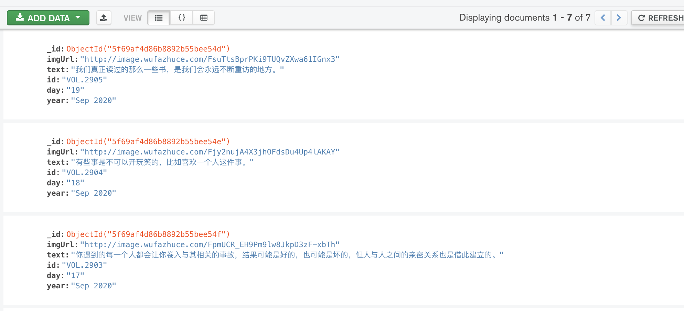
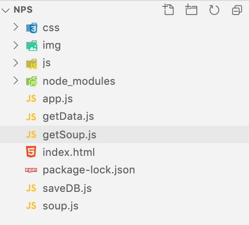

# Node爬虫+定时任务

## 1、我们先来看一看这个项目用到的框架和依赖

Express--框架

Art-template--模板引擎

Puppetteer--抓取网页数据模块

node-schedule--任务调度器模块

MongoDB--数据存储

## 2、安装

js文件夹中下载模板引擎（template-web.js）

```sh
npm install express node-schedule --save-dev
npm i puppeteer --save-dev
npm i puppeteer-core
```

## 3、爬取数据

https://zhaoqize.github.io/puppeteer-api-zh_CN/#?product=Puppeteer&version=v3.0.1&show=api-class-page

```js
const puppeteer = require("puppeteer")
const url = 'http://wufazhuce.com/'
module.exports = async () => {
    // 打开浏览器
    const browser = await puppeteer.launch({
        headless: true, //以无头浏览器的形式代开浏览器，没有界面显示，在后台运行，默认的true
    });
    // 创建标签页
    const page = await browser.newPage();
    // 跳转到指定网址
    await page.goto(url, {
        waitUntil: 'networkidle2'//等待网络空闲时在跳转加载页面
    });
    // 等待网址加载完成，开始爬取数据，开启延时器，延时2秒在爬取数据
    await timeout();
    const result = await page.evaluate(() => {
        let selectItem = $('#carousel-one .carousel-inner .item');
        const result = []
        for (let i = 0; i < selectItem.length; i++) {
            const liDom = selectItem[i];
            // 图片
            var imgUrl = $(liDom).find('.fp-one-imagen').attr('src');
            // 鸡汤
            var text = $(liDom).find('.fp-one-cita').text().replace(/(^\s*)|(\s*$)/g, "");
            // 序号
            var id = $(liDom).find('.titulo').text();
            // 日期
            var day = $(liDom).find('.dom').text();
            // 年月
            var year = $(liDom).find('.may').text();
            result.push({
                imgUrl,
                text,
                id,
                day,
                year
            })
        }

        // 将数据返回
        return result;
    })
    // 浏览器关闭
    await browser.close();
    return result;
}
function timeout() {
    return new Promise(resolve => {
        setTimeout(resolve, 2000)
    })
}
```

测试

```js
const data = require('./getData');
data()
```

结果

```js
{
  imgUrl: 'http://image.wufazhuce.com/Fq57jFfi60wFAdG0XGj0uAgQmxpR',
  text: '生活是第一位的。有生活，就可以头头是道，横写竖写都行；没有生活，就会捉襟见肘，或者，瞎编。',
  id: 'VOL.2907',
  day: '21',
  year: 'Sep 2020'
}
```

改造代码

```js
const data = require('./getData');
const express = require('express');
const app = express();
app.use((req,res,next)=>{
    // 解决跨域
    res.header("Access-Control-Allow-Origin","*")
    next()
})
app.get('/', async(req, res) => {
    const result = await data();
    res.send(result); 
});
app.listen(3000);
```

首页

```html
<!DOCTYPE html>
<html>

<head>
  <meta http-equiv="Content-Type" content="text/html; charset=UTF-8">

  <title>AS_EveryDay</title>
  <script src="./js/jquery.min.js"></script>
  <script src="./js/swiper.min.js"></script>
  <link href="./css/swiper.min.css" type="text/css" rel="stylesheet">
  <link href="./css/style.css" type="text/css" rel="stylesheet">
  <script src="./js/art-template/template-web.js"></script>
</head>

<body>
  <div class="wrapper">

    <div class="background">
      
    </div>
    <div class="item-bg active" style="width: 400px; height: 622px; transform: translateX(1040px) translateY(60px);">
    </div>

    <div class="news-slider swiper-container-coverflow swiper-container-3d swiper-container-horizontal"
      style="cursor: grab;">
      <div class="news-slider__wrp swiper-wrapper " id="swiperBox"
        style="transition-duration: 0ms; transform: translate3d(-2750px, 0px, 0px); perspective-origin: 3400px 50%;">


        <!-- <div class="news-slider__item swiper-slide swiper-slide-prev" data-swiper-slide-index="0"
          style="transition-duration: 0ms; transform: translate3d(0px, 0px, 0px) rotateX(0deg) rotateY(0deg); z-index: -2;">
          <a href="#" class="news__item">
            <div class="news-date">
              <span class="news-date__title">1</span>
              <span class="news-date__txt">九月</span>
            </div>
            <div class="news__title">
              VOL.1
            </div>

            <p class="news__txt">
              你遇到的每一个人都会让你卷入与其相关的事故，结果可能是好的，也可能是坏的，但人与人之间的亲密关系也是借此建立的。
            </p>

            <div class="news__img">
              
            </div>
          </a>
        </div>
        <div class="news-slider__item swiper-slide " data-swiper-slide-index="1"
          style="transition-duration: 0ms; transform: translate3d(0px, 0px, 0px) rotateX(0deg) rotateY(0deg); z-index: 1;">
          <a href="#" class="news__item">
            <div class="news-date">
              <span class="news-date__title">2</span>
              <span class="news-date__txt">九月</span>
            </div>
            <div class="news__title">
              VOL.2
            </div>

            <p class="news__txt">
              我不想成为上帝或英雄。只是成为一棵树，为岁月而生长，不伤害任何人。
            </p>

            <div class="news__img">
              
            </div>
          </a>
        </div>
        <div class="news-slider__item swiper-slide swiper-slide-prev" data-swiper-slide-index="2"
          style="transition-duration: 0ms; transform: translate3d(0px, 0px, 0px) rotateX(0deg) rotateY(0deg); z-index: -2;">
          <a href="#" class="news__item">
            <div class="news-date">
              <span class="news-date__title">3</span>
              <span class="news-date__txt">九月</span>
            </div>
            <div class="news__title">
              VOL.1
            </div>

            <p class="news__txt">
              你遇到的每一个人都会让你卷入与其相关的事故，结果可能是好的，也可能是坏的，但人与人之间的亲密关系也是借此建立的。
            </p>

            <div class="news__img">
              
            </div>
          </a>
        </div>
        <div class="news-slider__item swiper-slide swiper-slide-prev" data-swiper-slide-index="3"
          style="transition-duration: 0ms; transform: translate3d(0px, 0px, 0px) rotateX(0deg) rotateY(0deg); z-index: -2;">
          <a href="#" class="news__item">
            <div class="news-date">
              <span class="news-date__title">4</span>
              <span class="news-date__txt">九月</span>
            </div>
            <div class="news__title">
              VOL.1
            </div>

            <p class="news__txt">
              你遇到的每一个人都会让你卷入与其相关的事故，结果可能是好的，也可能是坏的，但人与人之间的亲密关系也是借此建立的。
            </p>

            <div class="news__img">
              
            </div>
          </a>
        </div>
        <div class="news-slider__item swiper-slide swiper-slide-prev" data-swiper-slide-index="4"
          style="transition-duration: 0ms; transform: translate3d(0px, 0px, 0px) rotateX(0deg) rotateY(0deg); z-index: -2;">
          <a href="#" class="news__item">
            <div class="news-date">
              <span class="news-date__title">5</span>
              <span class="news-date__txt">九月</span>
            </div>
            <div class="news__title">
              VOL.1
            </div>

            <p class="news__txt">
              你遇到的每一个人都会让你卷入与其相关的事故，结果可能是好的，也可能是坏的，但人与人之间的亲密关系也是借此建立的。
            </p>

            <div class="news__img">
              
            </div>
          </a>
        </div>

        <div class="news-slider__item swiper-slide swiper-slide-prev" data-swiper-slide-index="5"
        style="transition-duration: 0ms; transform: translate3d(0px, 0px, 0px) rotateX(0deg) rotateY(0deg); z-index: -2;">
        <a href="#" class="news__item">
          <div class="news-date">
            <span class="news-date__title">6</span>
            <span class="news-date__txt">九月</span>
          </div>
          <div class="news__title">
            VOL.1
          </div>

          <p class="news__txt">
            你遇到的每一个人都会让你卷入与其相关的事故，结果可能是好的，也可能是坏的，但人与人之间的亲密关系也是借此建立的。
          </p>

          <div class="news__img">
            
          </div>
        </a>
      </div> -->

      </div>

      <!-- 模板引擎 -->
      <script type="text/html" id="swiperTpl">
          {{each data}}
          <div class="news-slider__item swiper-slide swiper-slide-prev swiper-slide-active" data-swiper-slide-index="{{$index}}"
          style="transition-duration: 0ms; transform: translate3d(0px, 0px, 0px) rotateX(0deg) rotateY(0deg); z-index: -2;">
          <a href="#" class="news__item">
            <div class="news-date">
              <span class="news-date__title">{{$value.day}}</span>
              <span class="news-date__txt">{{$value.year}}</span>
            </div>
            <div class="news__title">
             {{$value.id}}
            </div>

            <p class="news__txt">
              {{$value.text}}
            </p>

            <div class="news__img">
              
            </div>
          </a>
        </div>
        {{/each}}
        </script>


      <!-- 左右 -->
      <div class="news-slider__ctr">

        <div class="news-slider__arrows">
          <button class="news-slider__arrow news-slider-prev" tabindex="0" role="button" aria-label="Previous slide">
            <span class="icon-font">
              <svg class="icon icon-arrow-left">
                <use xlink:href="#icon-arrow-left"></use>
              </svg>
            </span>
          </button>
          <button class="news-slider__arrow news-slider-next" tabindex="0" role="button" aria-label="Next slide">
            <span class="icon-font">
              <svg class="icon icon-arrow-right">
                <use xlink:href="#icon-arrow-right"></use>
              </svg>
            </span>
          </button>
        </div>
        <!-- 底部滚动条 -->
        <div class="news-slider__pagination swiper-pagination-clickable swiper-pagination-bullets">

        </div>

      </div>

      <span class="swiper-notification" aria-live="assertive" aria-atomic="true"></span>
    </div>

  </div>

  <svg hidden="hidden" id="icon">
    <defs>
      <symbol id="icon-arrow-left" viewBox="0 0 32 32">
        <title>arrow-left</title>
        <path
          d="M0.704 17.696l9.856 9.856c0.896 0.896 2.432 0.896 3.328 0s0.896-2.432 0-3.328l-5.792-5.856h21.568c1.312 0 2.368-1.056 2.368-2.368s-1.056-2.368-2.368-2.368h-21.568l5.824-5.824c0.896-0.896 0.896-2.432 0-3.328-0.48-0.48-1.088-0.704-1.696-0.704s-1.216 0.224-1.696 0.704l-9.824 9.824c-0.448 0.448-0.704 1.056-0.704 1.696s0.224 1.248 0.704 1.696z">
        </path>
      </symbol>
      <symbol id="icon-arrow-right" viewBox="0 0 32 32">
        <title>arrow-right</title>
        <path
          d="M31.296 14.336l-9.888-9.888c-0.896-0.896-2.432-0.896-3.328 0s-0.896 2.432 0 3.328l5.824 5.856h-21.536c-1.312 0-2.368 1.056-2.368 2.368s1.056 2.368 2.368 2.368h21.568l-5.856 5.824c-0.896 0.896-0.896 2.432 0 3.328 0.48 0.48 1.088 0.704 1.696 0.704s1.216-0.224 1.696-0.704l9.824-9.824c0.448-0.448 0.704-1.056 0.704-1.696s-0.224-1.248-0.704-1.664z">
        </path>
      </symbol>
    </defs>
  </svg>

  <script src="./js/slide.js"></script>
  <script>


    $.ajax({
      url: "http://localhost:3000",
      success: function (response) {
        var html = template('swiperTpl', { data: response })
        // 将拼接好的字符串显示在页面中
        $('#swiperBox').append(html);
        //插件
        var swiper = new Swiper('.news-slider', {
          effect: 'coverflow',
          grabCursor: true,
          loop: true,
          centeredSlides: true,
          keyboard: true,
          spaceBetween: 0,
          slidesPerView: 'auto',
          speed: 300,
          coverflowEffect: {
            rotate: 0,
            stretch: 0,
            depth: 0,
            modifier: 3,
            slideShadows: false
          },
          breakpoints: {
            480: {
              spaceBetween: 0,
              centeredSlides: true
            }
          },
          simulateTouch: true,
          navigation: {
            nextEl: '.news-slider-next',
            prevEl: '.news-slider-prev'
          },
          pagination: {
            el: '.news-slider__pagination',
            clickable: true
          },
          on: {
            init: function () {
              var activeItem = document.querySelector('.swiper-slide-active');

              var sliderItem = activeItem.querySelector('.news__item');

              $('.swiper-slide-active .news__item').addClass('active');

              var x = sliderItem.getBoundingClientRect().left;
              var y = sliderItem.getBoundingClientRect().top;
              var width = sliderItem.getBoundingClientRect().width;
              var height = sliderItem.getBoundingClientRect().height;


              $('.item-bg').addClass('active');

              bg.style.width = width + 'px';
              bg.style.height = height + 'px';
              bg.style.transform = 'translateX(' + x + 'px ) translateY(' + y + 'px)';
            }
          }
        });

        swiper.on('touchEnd', function () {
          $('.news__item').removeClass('active');
          $('.swiper-slide-active .news__item').addClass('active');
        });

        swiper.on('slideChange', function () {
          $('.news__item').removeClass('active');
        });

        swiper.on('slideChangeTransitionEnd', function () {
          $('.news__item').removeClass('active');
          var activeItem = document.querySelector('.swiper-slide-active');

          var sliderItem = activeItem.querySelector('.news__item');

          $('.swiper-slide-active .news__item').addClass('active');

          var x = sliderItem.getBoundingClientRect().left;
          var y = sliderItem.getBoundingClientRect().top;
          var width = sliderItem.getBoundingClientRect().width;
          var height = sliderItem.getBoundingClientRect().height;


          $('.item-bg').addClass('active');

          bg.style.width = width + 'px';
          bg.style.height = height + 'px';
          bg.style.transform = 'translateX(' + x + 'px ) translateY(' + y + 'px)';
        });
        //插件结束
        console.log(response)
     
      }
    });
  </script>
</body>

</html>
```

## 连接MongoDB

```sh
npm install mongoose
```

启动数据库，终端执行  mongod

```sh
nodemon app.js
```

创建模板

```js
// 数据库操作
const mongoose = require('mongoose');
// 模型规则类
const { Schema } = mongoose;

const SoupSchema = new Schema({
	// 图片地址
	imgUrl: {
		type: String
	},
	// 鸡汤
	text: {
		type: String
	},
	// 日期
	day: {
		type: String
	},
	// 年
	year: {
		type: String
	},
	// 编号
	id: {
		type: String
	}
}, {versionKey: false});

const Soup = mongoose.model('Soup', SoupSchema);


// 导出对象
module.exports = {
	Soup
};
```


保存数据

```js
const schedule = require('node-schedule');
const data = require('./getData');
const { Soup } = require('./soup')
module.exports = async () => {
    // 　6个占位符从左到右分别代表：秒、分、时、日、月、周几
    // 　　'*'表示通配符，匹配任意，当秒是'*'时，表示任意秒数都触发，其它类推
    schedule.scheduleJob('30 * * * * *', async () => {
        const result = await data();
        await Soup.deleteMany({});
        await Soup.create(result);
        console.log("定时爬取数据成功");
    });
}


```

测试

```js
const data = require('./getData');
const saveDB = require('./saveDB');
const express = require('express');
const app = express();
// 引入数据库处理模块
const mongoose = require('mongoose');
// 数据库连接
mongoose.connect('mongodb://localhost/cms', { useNewUrlParser: true, useCreateIndex: true })
    .then(() => console.log('数据库连接成功'))
    .catch(() => console.log('数据库连接失败'));

app.use((req, res, next) => {
    // 解决跨域
    res.header("Access-Control-Allow-Origin", "*")
    next()
})
app.get('/', async (req, res) => {
    const result = await data();
    await saveDB(result);
    res.send(result);
});
app.listen(3000);
```



### 改造代码

查询数据库渲染

```js
 $.ajax({
      url: "http://localhost:3000/getImgList",
```

```js
const data = require('./getData');
const saveDB = require('./saveDB');
const getSoup = require('./getSoup');
const express = require('express');
const app = express();
// 引入数据库处理模块
const mongoose = require('mongoose');
// 数据库连接
mongoose.connect('mongodb://localhost/cms', { useNewUrlParser: true, useCreateIndex: true })
    .then(() => console.log('数据库连接成功'))
    .catch(() => console.log('数据库连接失败'));

app.use((req, res, next) => {
    // 解决跨域
    res.header("Access-Control-Allow-Origin", "*")
    next()
})
app.get('/', async (req, res) => {
    const result = await data();
    await saveDB(result);
    res.send(result);
});
app.get('/getImgList', async (req, res) => {
    // 查询数据库
    let list =await getSoup();
    res.send(list)
});
app.listen(3000);
```

```js
const { Soup } = require('./soup')
module.exports = async () => {
    let soup = await Soup.find()
    return soup
}
```



## 定时爬取数据

https://cron.qqe2.com/

```sh
var schedule = require('node-schedule');

function scheduleCronstyle() {
    // 　6个占位符从左到右分别代表：秒、分、时、日、月、周几
    // 　　'*'表示通配符，匹配任意，当秒是'*'时，表示任意秒数都触发，其它类推
    schedule.scheduleJob('30 * * * * *', function () {
        console.log('scheduleCronstyle:' + new Date());
    });
}
scheduleCronstyle()

结果 ：  每分钟的30秒都会执行
scheduleCronstyle:Tue Sep 22 2020 17:00:30 GMT+0800 (中国标准时间)
scheduleCronstyle:Tue Sep 22 2020 17:01:30 GMT+0800 (中国标准时间)
scheduleCronstyle:Tue Sep 22 2020 17:02:30 GMT+0800 (中国标准时间)


每分钟的第30秒触发： '30 * * * * *'

每小时的1分30秒触发 ：'30 1 * * * *'

每天的凌晨1点1分30秒触发 ：'30 1 1 * * *'

每月的1日1点1分30秒触发 ：'30 1 1 1 * *'

2016年的1月1日1点1分30秒触发 ：'30 1 1 1 2016 *'

每周1的1点1分30秒触发 ：'30 1 1 * * 1'
```

删除数据库数据

```sh
const schedule = require('node-schedule');
const data = require('./getData');
const { Soup } = require('./soup')
module.exports = async () => {
    // 　6个占位符从左到右分别代表：秒、分、时、日、月、周几
    // 　　'*'表示通配符，匹配任意，当秒是'*'时，表示任意秒数都触发，其它类推
    schedule.scheduleJob('10 * * * * *', async () => {
        const result = await data();
        await Soup.deleteMany({});
        await Soup.create(result);
        console.log("定时爬取数据成功");
    });
}

```

```js
const getSoup = require('./getSoup');
const express = require('express');
const job = require('./job');

const app = express();
// 引入数据库处理模块
const mongoose = require('mongoose');
// 数据库连接
mongoose.connect('mongodb://localhost/cms', { useNewUrlParser: true, useCreateIndex: true })
    .then(() => console.log('数据库连接成功'))
    .catch(() => console.log('数据库连接失败'));

app.use((req, res, next) => {
    // 解决跨域
    res.header("Access-Control-Allow-Origin", "*")
    next()
})


app.get('/getImgList', async (req, res) => {
    // 查询数据库
    let list =await getSoup();
    res.send(list)
});
// 定时任务
job()

app.listen(3000);
```

```js
const { Soup } = require('./soup')
module.exports = async () => {
    let soup = await Soup.find()
    return soup
}
```

