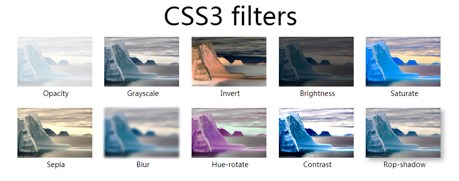
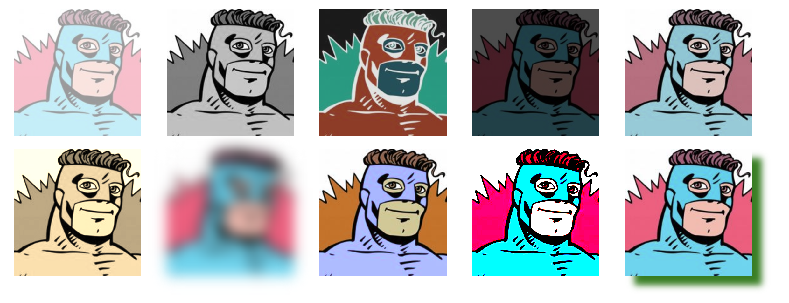
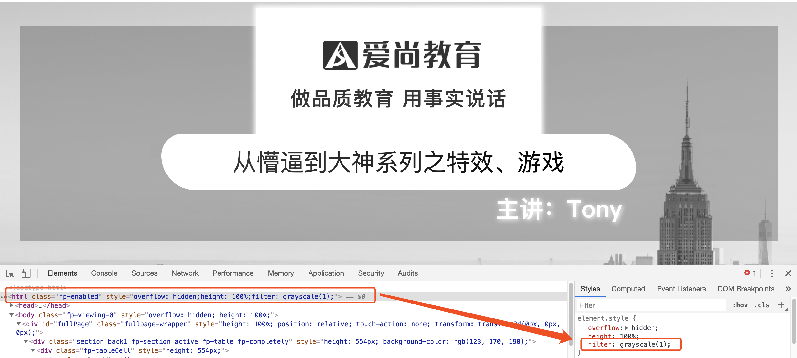
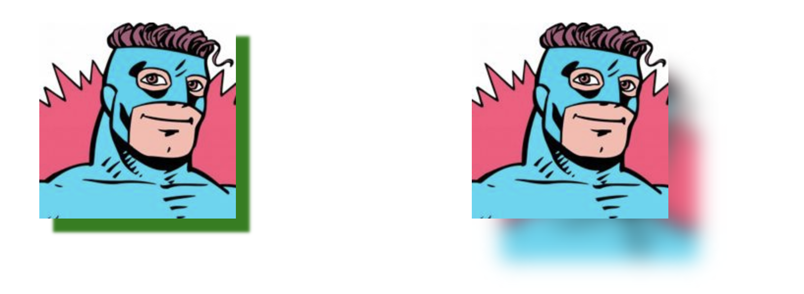
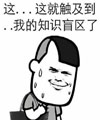
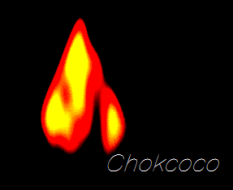

# 滤镜



```css
img
{
    filter: opacity(25%); 透明度
    filter: grayscale(50%);  灰度
    filter: invert(1);  反色
    filter: brightness(0.4);亮度
    filter: saturate(300%);饱和度
    filter: sepia(60%);褐色
    filter: blur(2px);模糊
    filter: hue-rotate(90deg);色相翻转
    filter: contrast(2);对比度
    filter: drop-shadow(5px 5px 5px #aaa);阴影
}    
```



```html
<!DOCTYPE html>
<html lang="en">

<head>
    <meta charset="UTF-8">
    <meta name="viewport" content="width=device-width, initial-scale=1.0">
    <title>Document</title>
    <style>
        ul {
            margin: 0 auto;
            width: 1200px;
        }
        li{
            width: 200px;
            height: 200px;
            list-style: none;
            float: left;
            margin: 10px 20px;
        }
        ul li:nth-child(1){
            /* 0.0-1.0 或者 0%-100%*/
            filter: opacity(40%);
        }
        ul li:nth-child(2){
            /* 0.0-1.0 或者 0%-100%*/
            filter: grayscale(1);
        }
        ul li:nth-child(3){
            /* 0.0-1.0 或者 0%-100%*/
            filter: invert(0.9);
        }
        ul li:nth-child(4){
            /* 0.0-1.0 或者 0%-100%*/
            filter: brightness(0.3);
        }
        ul li:nth-child(5){
            /* 0.0-1.0 或者 0%-100%*/
            filter: saturate(0.5);
        }
        ul li:nth-child(6){
            /* 0.0-1.0 或者 0%-100%*/
            filter: sepia(1);
        }
        ul li:nth-child(7){
            /* px单位 */
            filter: blur(10px);
        }
        ul li:nth-child(8){
            /* deg单位 */
            filter: hue-rotate(50deg);
        }
        ul li:nth-child(9){
            /* 正数 */
            filter: contrast(10);
        }
        ul li:nth-child(10){
            filter: drop-shadow(15px 15px 5px green);
        }
    </style>
</head>

<body>
    <ul>
        <li>
            
        </li>
        <li>
            
        </li>
        <li>
            
        </li>
        <li>
            
        </li>
        <li>
            
        </li>
        <li>
            
        </li>
        <li>
            
        </li>
        <li>
            
        </li>
        <li>
            
        </li>
        <li>
            
        </li>
    </ul>
</body>

</html>
```

### 重点学习：阴影、对比度、模糊、灰度

# 灰度

让网站整体变成黑白的

```css
html{
    filter:grayscale(1);
}
```



# 阴影

一提到阴影，可能多数人想到的是box-shadow，filter：drop-shadow，text-shadow。但这种方式生成的阴影都是单色，有没有能跟随图像颜色的阴影



```html
<!DOCTYPE html>
<html lang="en">
<head>
    <meta charset="UTF-8">
    <meta name="viewport" content="width=device-width, initial-scale=1.0">
    <title>Document</title>
    <style>
        li{
            list-style: none;
            width: 200px;
            height: 200px;
            margin: 10px 120px;
            float: left;
            background: url('./2.jpeg');
        }
        ul li:nth-child(1){
            box-shadow: 14px 14px 3px green;
        }
        ul li:nth-child(2)::after{
            background: inherit;
            content: '';
            position: absolute;
            top:8%;
            left: 38%;
            z-index: -1;
            width: 200px;
            height: 200px;
            filter: blur(10px);
        }
    </style>
</head>
<body>
    <ul>
        <li>
        </li>
        <li>
        </li>
    </ul>
</body>
</html>
```

# 融合效果

1. filter：blur()： 给图像设置高斯模糊效果。
2. filter：contrast()： 调整图像的对比度。
3. 利用 blur 混合 contrast 产生融合效果


上述效果的实现基于两点：

1. 图形是在被设置了 `filter: contrast()` 的画布背景上进行动画的
2. 进行动画的图形被设置了 `filter: blur()`（ 进行动画的图形的父元素需要是被设置了 `filter: contrast()` 的画布）

意思是，上面两圆运动的背后，其实是叠加了一张设置了 `filter: contrast()` 的大白色背景，而两个圆形则被设置了 `filter: blur()` ，两个条件缺一不可。

```html
<!DOCTYPE html>
<html lang="en">

<head>
    <meta charset="UTF-8">
    <meta name="viewport" content="width=device-width, initial-scale=1.0">
    <title>Document</title>
    <style>
        .filter-mix {
            position: absolute;
            width: 300px;
            height: 200px;
            filter: contrast(30);
            background: #fff;
        }

        .filter-mix::before {
            content: "";
            position: absolute;
            width: 120px;
            height: 120px;
            border-radius: 50%;
            background: #333;
            top: 40px;
            left: 40px;
            z-index: 2;
            filter: blur(6px);
            /* box-sizing: border-box; */
            animation: filterBallMove 4s ease-out infinite;
        }

        .filter-mix::after {
            content: "";
            position: absolute;
            width: 80px;
            height: 80px;
            border-radius: 50%;
            background: #3F51B5;
            top: 60px;
            right: 40px;
            z-index: 2;
            filter: blur(6px);
            animation: filterBallMove2 4s ease-out infinite;
        }

        @keyframes filterBallMove2 {
            50% {
                right: 140px;
            }
        }

        @keyframes filterBallMove {
            50% {
                left: 140px;
            }
        }
    </style>
</head>

<body>
    <div class="filter-mix"></div>
</body>

</html>
```



# 文字融合动画


```html
<!DOCTYPE html>
<html lang="en">

<head>
    <meta charset="UTF-8">
    <meta name="viewport" content="width=device-width, initial-scale=1.0">
    <title>Document</title>
    <style>
        *{
            margin: 0;
            padding: 0;
        }
        .container {
            width: 100%;
            height: calc(100vh);
            position: relative;
            filter: contrast(30);
            background-color: black;
        }

        h1 {
            color: white;
            font-size: 100px;
            animation: letterspacing 5s infinite alternate ;
            letter-spacing: -60px;
            text-align: center;
        }


        @keyframes letterspacing {
            0% {
                letter-spacing: -60px;
                filter: blur(3px);
            }

            50% {
                filter: blur(6px);
            }

            100% {
                letter-spacing: 10px;
                filter: blur(0);
            }
        }
    </style>
</head>

<body>
    <div class="container">
        <h1>AI SHANG</h1>
    </div>
</body>

</html>
```

# 火焰




```html
<!DOCTYPE html>
<html lang="en">

<head>
    <meta charset="UTF-8">
    <meta name="viewport" content="width=device-width, initial-scale=1.0">
    <title>Document</title>
    <style>
        body{
            background-color: black;
        }
        .g-container {
            position: relative;
            width: 384px;
            height: 300px;
            margin: 100px auto;
            background-color: #000;
        }

        .g-fire {
            position: absolute;
            width: 0;
            height: 0;
            bottom: 100px;
            left: 50%;
            border-radius: 45%;
            border: 200px solid #000;
            border-bottom: 200px solid transparent;
            transform: translate(-50%, 0) scaleX(0.4);
            background-color: gold;
            filter: blur(20px) contrast(30);
        }

        .g-dot {
            position: absolute;
            bottom: -210px;
            left: 0;
            width: 30px;
            height: 30px;
            background: #000;
            border-radius: 50%;
        }

        .g-dot:nth-child(1) {
            bottom: -352px;
            left: -138px;
            animation: move 2s infinite 0.2s linear;
        }

        .g-dot:nth-child(2) {
            bottom: -339px;
            left: -86px;
            animation: move 1.9s infinite 5.8s linear;
        }

        .g-dot:nth-child(3) {
            bottom: -344px;
            left: -27px;
            animation: move 1.4s infinite 2.5s linear;
        }

        .g-dot:nth-child(4) {
            bottom: -308px;
            left: -119px;
            animation: move 3.2s infinite 2.8s linear;
        }

        .g-dot:nth-child(5) {
            bottom: -311px;
            left: 81px;
            animation: move 0.9s infinite 0.2s linear;
        }

        .g-dot:nth-child(6) {
            bottom: -275px;
            left: 130px;
            animation: move 2.7s infinite 1.8s linear;
        }

        .g-dot:nth-child(7) {
            bottom: -354px;
            left: -41px;
            animation: move 2.7s infinite 5.1s linear;
        }

        .g-dot:nth-child(8) {
            bottom: -303px;
            left: -21px;
            animation: move 0.9s infinite 5.1s linear;
        }

        .g-dot:nth-child(9) {
            bottom: -245px;
            left: 24px;
            animation: move 2.4s infinite 1.5s linear;
        }

        .g-dot:nth-child(10) {
            bottom: -347px;
            left: -115px;
            animation: move 1.2s infinite 5.5s linear;
        }

        .g-dot:nth-child(11) {
            bottom: -317px;
            left: -70px;
            animation: move 1s infinite 3.4s linear;
        }

        .g-dot:nth-child(12) {
            bottom: -354px;
            left: 39px;
            animation: move 1.6s infinite 3.1s linear;
        }

        .g-dot:nth-child(13) {
            bottom: -333px;
            left: 2px;
            animation: move 2.5s infinite 1.6s linear;
        }

        .g-dot:nth-child(14) {
            bottom: -314px;
            left: -45px;
            animation: move 1.5s infinite 5.7s linear;
        }

        .g-dot:nth-child(15) {
            bottom: -336px;
            left: 38px;
            animation: move 3s infinite 1.3s linear;
        }

        .g-dot:nth-child(16) {
            bottom: -258px;
            left: -44px;
            animation: move 1.1s infinite 2s linear;
        }

        .g-dot:nth-child(17) {
            bottom: -348px;
            left: -80px;
            animation: move 0.9s infinite 3.8s linear;
        }

        .g-dot:nth-child(18) {
            bottom: -335px;
            left: 23px;
            animation: move 2.4s infinite 4.8s linear;
        }

        .g-dot:nth-child(19) {
            bottom: -329px;
            left: -100px;
            animation: move 0.9s infinite 1.3s linear;
        }

        .g-dot:nth-child(20) {
            bottom: -348px;
            left: 30px;
            animation: move 3.3s infinite 1s linear;
        }

        .g-dot:nth-child(21) {
            bottom: -329px;
            left: -135px;
            animation: move 2s infinite 2.9s linear;
        }

        .g-dot:nth-child(22) {
            bottom: -249px;
            left: 139px;
            animation: move 3.1s infinite 0.8s linear;
        }

        .g-dot:nth-child(23) {
            bottom: -281px;
            left: -74px;
            animation: move 1.1s infinite 5.6s linear;
        }

        .g-dot:nth-child(24) {
            bottom: -310px;
            left: -156px;
            animation: move 2.9s infinite 1.7s linear;
        }

        .g-dot:nth-child(25) {
            bottom: -317px;
            left: -147px;
            animation: move 2.5s infinite 1.4s linear;
        }

        .g-dot:nth-child(26) {
            bottom: -276px;
            left: -116px;
            animation: move 2.4s infinite 4.7s linear;
        }

        .g-dot:nth-child(27) {
            bottom: -270px;
            left: 108px;
            animation: move 0.8s infinite 0.4s linear;
        }

        .g-dot:nth-child(28) {
            bottom: -337px;
            left: -91px;
            -webkit-animation: move 2.4s infinite 4.3s linear;
            animation: move 2.4s infinite 4.3s linear;
        }

        .g-dot:nth-child(29) {
            bottom: -298px;
            left: 91px;
            animation: move 0.8s infinite 0.3s linear;
        }

        .g-dot:nth-child(30) {
            bottom: -282px;
            left: 57px;
            animation: move 1.7s infinite 5.4s linear;
        }

        .g-dot:nth-child(31) {
            bottom: -342px;
            left: -25px;
            animation: move 1.4s infinite 4.9s linear;
        }

        .g-dot:nth-child(32) {
            bottom: -289px;
            left: -72px;
            animation: move 1.8s infinite 4.7s linear;
        }

        .g-dot:nth-child(33) {
            bottom: -356px;
            left: 99px;
            animation: move 1.6s infinite 0.5s linear;
        }

        .g-dot:nth-child(34) {
            bottom: -301px;
            left: -117px;
            animation: move 1.9s infinite 1.7s linear;
        }

        .g-dot:nth-child(35) {
            bottom: -288px;
            left: 27px;
            animation: move 2.9s infinite 2.3s linear;
        }

        .g-dot:nth-child(36) {
            bottom: -359px;
            left: -26px;
            animation: move 2.5s infinite 2s linear;
        }

        .g-dot:nth-child(37) {
            bottom: -247px;
            left: 88px;
            animation: move 3.1s infinite 0.1s linear;
        }

        .g-dot:nth-child(38) {
            bottom: -343px;
            left: -14px;
            animation: move 0.9s infinite 5.8s linear;
        }

        .g-dot:nth-child(39) {
            bottom: -289px;
            left: 97px;
            animation: move 1.5s infinite 5.2s linear;
        }

        .g-dot:nth-child(40) {
            bottom: -259px;
            left: -112px;
            animation: move 3.2s infinite 0.2s linear;
        }

        @keyframes move {
            100% {
                -webkit-transform: translate3d(0, -350px, 0);
                transform: translate3d(0, -350px, 0);
            }
        }
    </style>
</head>

<body>
    <div class="g-container">
        <div class="g-fire">
            <div class="g-dot"></div>
            <div class="g-dot"></div>
            <div class="g-dot"></div>
            <div class="g-dot"></div>
            <div class="g-dot"></div>
            <div class="g-dot"></div>
            <div class="g-dot"></div>
            <div class="g-dot"></div>
            <div class="g-dot"></div>
            <div class="g-dot"></div>
            <div class="g-dot"></div>
            <div class="g-dot"></div>
            <div class="g-dot"></div>
            <div class="g-dot"></div>
            <div class="g-dot"></div>
            <div class="g-dot"></div>
            <div class="g-dot"></div>
            <div class="g-dot"></div>
            <div class="g-dot"></div>
            <div class="g-dot"></div>
            <div class="g-dot"></div>
            <div class="g-dot"></div>
            <div class="g-dot"></div>
            <div class="g-dot"></div>
            <div class="g-dot"></div>
            <div class="g-dot"></div>
            <div class="g-dot"></div>
            <div class="g-dot"></div>
            <div class="g-dot"></div>
            <div class="g-dot"></div>
            <div class="g-dot"></div>
            <div class="g-dot"></div>
            <div class="g-dot"></div>
            <div class="g-dot"></div>
            <div class="g-dot"></div>
            <div class="g-dot"></div>
            <div class="g-dot"></div>
            <div class="g-dot"></div>
            <div class="g-dot"></div>
            <div class="g-dot"></div>
        </div>
    </div>
</body>

</html>
```

