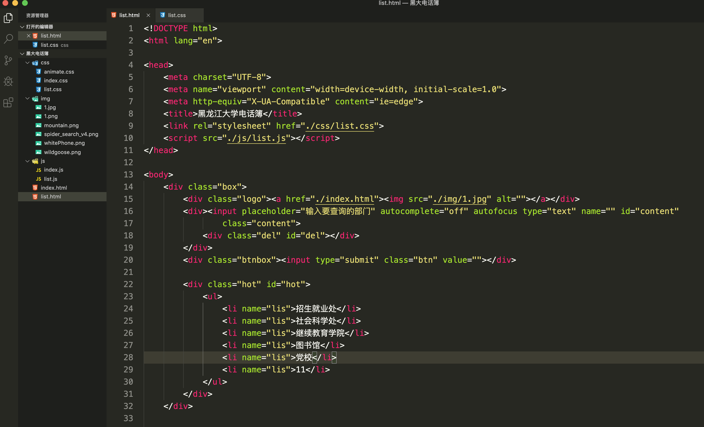

index.html

```html
<!DOCTYPE html>
<html lang="en">

<head>
    <meta charset="UTF-8">
    <meta name="viewport" content="width=device-width, initial-scale=1.0">
    <meta http-equiv="X-UA-Compatible" content="ie=edge">
    <title>黑龙江大学电话簿</title>
    <link rel="stylesheet" href="./css/index.css">
    <script src="./js/index.js"></script>
</head>

<body>
    <div class="title">黑龙江大学电话簿</div>
    <form action="./list.html" method="GET">
        <div class="box">
            <div class="logo"></div>
            <div><input placeholder="输入要查询的部门" autocomplete="off" autofocus type="text" name="" id="content" class="content">
                <div class="del" id="del"></div>
            </div>
            <div class="btnbox"><input type="submit" class="btn" value=""></div>

            <div id="" class="history">
                历史记录：
        
                <a href="#">学校办公室</a><span>&nbsp;&nbsp;|&nbsp;&nbsp;</span>
        
                <a href="#">信息与网络中心</a><span>&nbsp;&nbsp;|&nbsp;&nbsp;</span>
        
                <a href="#">学生处</a><span>&nbsp;&nbsp;|&nbsp;&nbsp;</span>
        
                <a href="#">教务处</a><span>&nbsp;&nbsp;|&nbsp;&nbsp;</span>
        
                <a href="#">财务处</a><span>&nbsp;&nbsp;|&nbsp;&nbsp;</span>
        
            </div>
            <div class="hot" id="hot">
                <ul>
                    <li name="lis">招生就业处</li>
                    <li name="lis">社会科学处</li>
                    <li name="lis">继续教育学院</li>
                    <li name="lis">图书馆</li>
                    <li name="lis">党校</li>
                    <li name="lis">11</li>
                </ul>
            </div>
        </div>

       
    </form>
  
    <div class="mountain"></div>
    <div class="snow">
        <ul>
            <li></li>
            <li></li>
            <li></li>
            <li></li>
            <li></li>
            <li></li>
            <li></li>
            <li></li>
            <li></li>
            <li></li>
            <li></li>
            <li></li>
            <li></li>
            <li></li>
            <li></li>
            <li></li>
            <li></li>
            <li></li>
            <li></li>
            <li></li>
        </ul>
    </div>
</body>

</html>
```

Index.css

```css
*{margin: 0;padding: 0;}
a{
    text-decoration: none;
    color: white;
}
li{
    list-style: none;
}

body {
    width: 100%;
    height: 100%;
    background-color: #51AB5C;
    position: fixed;
}
/* 去掉input篮框 */
input{ outline:none; border:0; }
.title{
    position: absolute;
    width: 1000px;
    height: 50px;
    top:260px;
    left: 50%;
    margin-left: -500px;
    text-align: center;
    font-size: 48px;
    color: white;
    letter-spacing: 10px;
    text-shadow:5px 5px  3px #0d8c3e; 
}
.box{
    position: relative;
    width: 1000px;
    height: 50px;
    background-color: white;
    /* top:400px; */
    /* margin-top: -25px; */
    /* left: 50%; */
    /* margin-left: -500px; */
    margin: 0 auto;
    top:360px;
    box-shadow: 0 0 20px 3px #0d8c3e;
}

.box .logo {
    width: 5%;
    float: left;
    padding: 5px 5px;
    box-sizing: border-box;
    height: 50px;
    border-right: 1px #ccc solid;
}
.box img {
    width: 100%;
}
.box .content {
    float: left;
    width: 76%;
    height: 50px;
    padding-left: 10px;
    font-size: 16px;
}
input::-webkit-input-placeholder {
             /* placeholder颜色  */
            color: #aab2bd;
            /* placeholder字体大小  */
            font-size: 16px;
        }
.box .btn {
    height: 50px;
    width: 180px;
    background-color: orange;
    float: right;
    cursor: pointer;
    font-size: 18px;
    color: #fff;
    background: url(../img/spider_search_v4.png) 78px -580px no-repeat #ff7800;
}

.box .del {
    cursor: pointer;
    position: absolute;
    background: url('../img/spider_search_v4.png') no-repeat ;
    background-position:5px -274px;
    width: 40px;
    height: 40px;
    right: 18%;
    top:4%;
    display: none;
    z-index: 1000;
}

 .mountain{
    position: absolute;
    width: 500px;
    height: 150px;
    background: url('../img/mountain.png') no-repeat;
    background-size: cover;
    bottom: -5px;
    left: 50%;
    margin-left: -250px;
}
.history {
    position: absolute;
    width: 1000px;
    height: 50px;
    top:60px;
    left: 50%;
    margin-left: -500px;
    color: white;
}

/* snow */
.snow ul li:nth-child(1){
    width: 50px;
    height: 50px;
    background: url('../img/wildgoose.png') no-repeat ;
    background-position:16px -60px;
    position: absolute;
    left: 60%;
    bottom: 10%;
    background-size: cover;
}
.snow ul li:nth-child(2){
    width: 50px;
    height: 50px;
    background: url('../img/wildgoose.png') no-repeat ;
    background-position:16px -60px;
    position: absolute;
    left: 50%;
    bottom: 20%;
    background-size: cover;
}
.snow ul li:nth-child(3){
    width: 50px;
    height: 50px;
    background: url('../img/wildgoose.png') no-repeat ;
    background-position:16px -60px;
    position: absolute;
    left: 50%;
    bottom: 20%;
    background-size: cover;
}
.snow ul li:nth-child(4){
    width: 50px;
    height: 50px;
    background: url('../img/wildgoose.png') no-repeat ;
    background-position:16px -60px;
    position: absolute;
    left: 45%;
    bottom: 30%;
    background-size: cover;
}
.snow ul li:nth-child(5){
    width: 50px;
    height: 50px;
    background: url('../img/wildgoose.png') no-repeat ;
    background-position:16px -30px;
    position: absolute;
    left: 43%;
    bottom: 20%;
    background-size: cover;
}

.snow ul li:nth-child(6){
    width: 35px;
    height: 20px;
    background: url('../img/wildgoose.png') no-repeat ;
    background-position:16px -27px;
    position: absolute;
    left: 41%;
    bottom: 25%;
    background-size: cover;
}
.snow ul li:nth-child(7){
    width: 50px;
    height: 50px;
    background: url('../img/wildgoose.png') no-repeat ;
    background-position:16px -60px;
    position: absolute;
    left: 42%;
    bottom: 12%;
    background-size: cover;
}
.snow ul li:nth-child(8){
    width: 35px;
    height: 20px;
    background: url('../img/wildgoose.png') no-repeat ;
    background-position:16px -27px;
    position: absolute;
    left: 41%;
    bottom: 15%;
    background-size: cover;
}
.snow ul li:nth-child(9){
    width: 35px;
    height: 20px;
    background: url('../img/wildgoose.png') no-repeat ;
    background-position:16px -27px;
    position: absolute;
    left: 56%;
    bottom: 25%;
    background-size: cover;
}

.snow ul li:nth-child(10){
    width: 50px;
    height: 50px;
    background: url('../img/wildgoose.png') no-repeat ;
    background-position:16px -27px;
    position: absolute;
    left: 57%;
    bottom: 12%;
    background-size: cover;
}

.snow ul li:nth-child(11){
    width: 50px;
    height: 50px;
    background: url('../img/wildgoose.png') no-repeat ;
    background-position:16px -240px;
    position: absolute;
    left: 30%;
    bottom: 12%;
    background-size: cover;
}
.snow ul li:nth-child(12){
    width: 50px;
    height: 50px;
    background: url('../img/wildgoose.png') no-repeat ;
    background-position:16px -320px;
    position: absolute;
    left: 20%;
    bottom: 22%;
    background-size: cover;
}

.snow ul li:nth-child(13){
    width: 50px;
    height: 50px;
    background: url('../img/wildgoose.png') no-repeat ;
    background-position:16px -240px;
    position: absolute;
    left: 10%;
    bottom: 42%;
    background-size: cover;
}
.snow ul li:nth-child(14){
    width: 50px;
    height: 50px;
    background: url('../img/wildgoose.png') no-repeat ;
    background-position:16px -240px;
    position: absolute;
    left: 20%;
    bottom: 60%;
    background-size: cover;
}
.snow ul li:nth-child(15){
    width: 50px;
    height: 50px;
    background: url('../img/wildgoose.png') no-repeat ;
    background-position:16px -240px;
    position: absolute;
    right: 30%;
    bottom: 70%;
    background-size: cover;
}
.snow ul li:nth-child(16){
    width: 50px;
    height: 50px;
    background: url('../img/wildgoose.png') no-repeat ;
    background-position:16px -320px;
    position: absolute;
    right: 25%;
    bottom: 70%;
    background-size: cover;
}
.snow ul li:nth-child(17){
    width: 50px;
    height: 50px;
    background: url('../img/wildgoose.png') no-repeat ;
    background-position:16px -320px;
    position: absolute;
    right: 10%;
    bottom: 60%;
    background-size: cover;
}
.snow ul li:nth-child(18){
    width: 50px;
    height: 50px;
    background: url('../img/wildgoose.png') no-repeat ;
    background-position:16px -240px;
    position: absolute;
    right: 22%;
    bottom: 40%;
    background-size: cover;
}

/* hot */
.box .hot {
    display: none;
    position: absolute;
    left: 5%;
    width: 77%;
    margin-top: 50px;
    z-index: 999;
    box-sizing: border-box;
}
.box .hot li {
    background-color: white;
    height: 50px;
    line-height: 50px;
    padding: 0 10px;
    color: rgb(110, 108, 108) ;
    cursor: pointer;
}
.box .hot li:hover {
    color:#51AB5C ;
}

/* 媒体查询 */
@media screen and (max-width:1280px){
    .title{
        position: absolute;
        width: 62.5rem;
        height: 3.125rem;
        top: 16.25rem;
        left: 50%;
        margin-left: -500px;
        text-align: center;
        font-size: 3rem;
        color: white;
        letter-spacing: 10px;
        text-shadow:5px 5px  3px #0d8c3e; 
    }
    .box{
        position: absolute;
        width: 62.5rem;
        height: 5rem;
        background-color: white;
        top: 25rem;
        margin-top: -25px;
        left: 50%;
        margin-left: -500px;
        box-shadow: 0 0 20px 3px #0d8c3e;
    }
    
    .box .logo {
        width: 8%;
        float: left;
        padding: .3125rem .3125rem;
        box-sizing: border-box;
        height: 5rem;
        border-right: 1px #ccc solid;
    }
    .box img {
        width: 100%;
    }
    .box .content {
        float: left;
        width: 73%;
        height: 5rem;
        padding-left: 10px;
        font-size: 1.8rem;
    }
    input::-webkit-input-placeholder {
                 /* placeholder颜色  */
                color: #aab2bd;
                /* placeholder字体大小  */
                font-size: 1.4rem;
            }
    .box .btnbox{
        background-color: #ff7800;
        height: 5rem;
        width: 11.25rem;
        float: right;
    }
    .box .btn {
        cursor: pointer;
        color: #fff;
        height: 5rem;
        background: url(../img/spider_search_v4.png) 68px -1200px no-repeat #ff7800;
        background-size: cover;
    }
    
    .box .del {
        cursor: pointer;
        position: absolute;
        background: url('../img/spider_search_v4.png') no-repeat ;
        background-position:5px -274px;
        width: 40px;
        height: 40px;
        right: 18%;
        top:20px;
        display: none;
        z-index: 1000;
    }

    /* hot */
.box .hot {
    display: none;
    position: absolute;
    left: 8%;
    width: 74%;
    margin-top: 80px;
    z-index: 999;
    box-sizing: border-box;
    height: 40.75rem;
    overflow-y: auto;
}
.box .hot li {
    background-color: white;
    height: 60px;
    line-height: 60px;
    padding: 0 10px;
    color: rgb(110, 108, 108) ;
    cursor: pointer;
    font-size: 1.6rem;
}

.snow ul li:nth-child(15){
    width: 50px;
    height: 50px;
    background: url('../img/wildgoose.png') no-repeat ;
    background-position:16px -240px;
    position: absolute;
    right: 27%;
    bottom: 85%;
    background-size: cover;
}
.snow ul li:nth-child(16){
    width: 50px;
    height: 50px;
    background: url('../img/wildgoose.png') no-repeat ;
    background-position:16px -320px;
    position: absolute;
    right: 20%;
    bottom: 85%;
    background-size: cover;
}
.history {
    position: absolute;
    width: 1000px;
    height: 50px;
    top:100px;
    left: 50%;
    margin-left: -500px;
    color: white;
    font-size: 1.6rem;
}
}

@media screen and (max-width:1024px){
   
    .box{
        width: 800px;
        height: 5rem;
        background-color: white;
        box-shadow: 0 0 20px 3px #0d8c3e;
        margin: 0 auto;
        margin-left: -400px;
    }
    
    .box .logo {
        width: 8%;
        float: left;
        padding: 14px 5px;
        box-sizing: border-box;
        height: 5rem;
        border-right: 1px #ccc solid;
    }
   
    .box .content {
        float: left;
        width: 72%;
        height: 5rem;
        padding-left: 10px;
        font-size: 1.8rem;
    }
    input::-webkit-input-placeholder {
                 /* placeholder颜色  */
                color: #aab2bd;
                /* placeholder字体大小  */
                font-size: 1.4rem;
            }
    .box .btnbox{
        background-color: #ff7800;
        height: 5rem;
        width: 150px !important;
        float: right;
    }
    .box .btn {
        width: 150px !important;
        cursor: pointer;
        color: #fff;
        height: 5rem;
        background: url(../img/spider_search_v4.png) 57px -992px no-repeat #ff7800;
        background-size: cover;
    }
    
    .box .del {
        cursor: pointer;
        position: absolute;
        background: url('../img/spider_search_v4.png') no-repeat ;
        background-position:5px -274px;
        width: 40px;
        height: 40px;
        right: 20%;
        top:20px;
        display: none;
        z-index: 1000;
    }

    /* hot */
.box .hot {
    display: none;
    position: absolute;
    left: 8%;
    width:586px;
    margin-top: 80px;
    z-index: 999;
    box-sizing: border-box;
    height: 40.75rem;
    overflow-y: auto;
}
.box .hot li {
    background-color: white;
    height: 60px;
    line-height: 60px;
    padding: 0 10px;
    color: rgb(110, 108, 108) ;
    cursor: pointer;
    font-size: 1.6rem;
}
.history {
    position: absolute;
    width:800px;
    height: 50px;
    top:100px;
    left: 63%;
    margin-left: -500px;
    color: white;
    font-size: 1.6rem;
}
}

@media screen and (max-width:840px){
   
    .box{
        width: 600px;
        height: 4rem;
        background-color: white;
        box-shadow: 0 0 20px 3px #0d8c3e;
        margin: 0 auto;
        margin-left: -300px;
    }
    
    .box .logo {
        width: 8%;
        float: left;
        padding: 14px 5px;
        box-sizing: border-box;
        height: 4rem;
        border-right: 1px #ccc solid;
    }
   
    .box .content {
        float: left;
        width: 68%;
        height: 4rem;
        padding-left: 10px;
        font-size: 1.8rem;
    }
    input::-webkit-input-placeholder {
                 /* placeholder颜色  */
                color: #aab2bd;
                /* placeholder字体大小  */
                font-size: 1.4rem;
            }
    .box .btnbox{
        background-color: #ff7800;
        height: 4rem;
        width: 130px !important;
        float: right;
    }
    .box .btn {
        width: 130px !important;
        cursor: pointer;
        color: #fff;
        height: 4rem;
        background: url(../img/spider_search_v4.png) 50px -863px no-repeat #ff7800;
        background-size: cover;
    }
    
    .box .del {
        cursor: pointer;
        position: absolute;
        background: url('../img/spider_search_v4.png') no-repeat ;
        background-position:5px -274px;
        width: 40px;
        height: 40px;
        right: 22%;
        top:10px;
        display: none;
        z-index: 1000;
    }

    /* hot */
.box .hot {
    display: none;
    position: absolute;
    left: 8%;
    width:422px;
    margin-top: 64px;
    z-index: 999;
    box-sizing: border-box;
    height: 40.75rem;
    overflow-y: auto;
}

.history {
    position: absolute;
    width:600px;
    height: 50px;
    color: white;
    font-size: 1.3rem;
    margin: 0 auto;
    margin-left: -370px;
}
}
@media screen and (max-width:620px){
   
    .box{
        width: 500px;
        height: 4rem;
        background-color: white;
        box-shadow: 0 0 20px 3px #0d8c3e;
        margin: 0 auto;
        margin-left: -250px;
    }
    
    .box .logo {
        width: 10%;
        float: left;
        padding: 14px 5px;
        box-sizing: border-box;
        height: 4rem;
        border-right: 1px #ccc solid;
    }
   
    .box .content {
        float: left;
        width: 68%;
        height: 4rem;
        padding-left: 10px;
        font-size: 1.5rem;
    }
    input::-webkit-input-placeholder {
                 /* placeholder颜色  */
                color: #aab2bd;
                /* placeholder字体大小  */
                font-size: 1.4rem;
            }
    .box .btnbox{
        background-color: #ff7800;
        height: 4rem;
        width: 100px !important;
        float: right;
    }
    .box .btn {
        width: 100px !important;
        cursor: pointer;
        color: #fff;
        height: 4rem;
        background: url(../img/spider_search_v4.png) 40px -574px no-repeat #ff7800;
    }
    
    .box .del {
        cursor: pointer;
        position: absolute;
        background: url('../img/spider_search_v4.png') no-repeat ;
        background-position:5px -274px;
        width: 40px;
        height: 40px;
        right: 20%;
        top:10px;
        display: none;
        z-index: 1000;
    }

    /* hot */
.box .hot {
    display: none;
    position: absolute;
    left: 10%;
    width:350px;
    margin-top: 64px;
    z-index: 999;
    box-sizing: border-box;
    height: 40.75rem;
    overflow-y: auto;
}
.box .hot li{
    font-size: 1.4rem;
}
.history {
    position: absolute;
    width:500px;
    height: 50px;
    color: white;
    font-size: 1.3rem;
    margin: 0 auto;
    margin-left: -310px;
}
}

@media screen and (max-width:512px){
    .title{
        position: absolute;
        width: 62.5rem;
        height: 3.125rem;
        top: 16.25rem;
        left: 50%;
        margin-left: -500px;
        text-align: center;
        font-size: 2rem;
        color: white;
        letter-spacing: 10px;
        text-shadow:5px 5px  3px #0d8c3e; 
    }
    .box{
        width: 400px;
        height: 3rem;
        background-color: white;
        box-shadow: 0 0 20px 3px #0d8c3e;
        margin: 0 auto;
        margin-left: -200px;
        top:320px;
    }
    
    .box .logo {
        box-sizing: border-box;
        height: 3rem;
        border-right: 1px #ccc solid;
        padding-bottom: 10px;
        width: 51px;
        height: 48px;
    }
    .box .logo img {
        position: absolute;
        width: 40px;
        height: 40px;
        top:5px;
    }
    .box .content {
        float: left;
        width: 68%;
        height: 3rem;
        padding-left: 10px;
        font-size: 1.2rem;
    }
    input::-webkit-input-placeholder {
        /* placeholder颜色  */
       color: #aab2bd;
       /* placeholder字体大小  */
       font-size: 1rem;
   }
    .box .btnbox{
        background-color: #ff7800;
        height: 3rem;
        width: 60px !important;
        float: right;
    }
    .box .btn {
        width: 60px !important;
        cursor: pointer;
        color: #fff;
        height: 3rem;
        background: url(../img/spider_search_v4.png) 20px -580px no-repeat #ff7800;
    }
    
    .box .del {
        cursor: pointer;
        position: absolute;
        background: url('../img/spider_search_v4.png') no-repeat ;
        background-position:7px -130px;
        background-size: cover;
        width: 40px;
        height: 12px;
        right: 12%;
        font-size: 12px;
        top:18px;
        display: none;
        z-index: 1000;
    }

    /* hot */
.box .hot {
    display: none;
    position: absolute;
    left: 51px;
    width:289px;
    margin-top: 48px;
    z-index: 999;
    box-sizing: border-box;
    height: 30rem;
    overflow-y: auto;
}
.box .hot li{
    height: 30px;
    font-size: 1rem;
    line-height:30px ;
}
.history {
    position: absolute;
    width:400px;
    height: 50px;
    color: white;
    font-size: .8rem;
    margin: 0 auto;
    margin-left: -244px;
    margin-top: -40px;
}
}

@media screen and (max-width:414px){
    .title{
        position: absolute;
        width: 62.5rem;
        height: 3.125rem;
        top: 7.25rem;
        left: 50%;
        margin-left: -500px;
        text-align: center;
        font-size: 1.8rem;
        color: white;
        letter-spacing: 3px;
        text-shadow:5px 5px  3px #0d8c3e; 
    }
    .box{
        width: 360px;
        height: 3rem;
        background-color: white;
        box-shadow: 0 0 20px 3px #0d8c3e;
        margin: 0 auto;
        margin-left: -180px;
        top:190px;
    }
    
    .box .content {
        float: left;
        width: 66%;
        height: 3rem;
        padding-left: 10px;
        font-size: 1.2rem;
    }
    input::-webkit-input-placeholder {
        /* placeholder颜色  */
       color: #aab2bd;
       /* placeholder字体大小  */
       font-size: 1rem;
   }
    .box .btnbox{
        background-color: #ff7800;
        height: 3rem;
        width: 60px !important;
        float: right;
    }
    .box .btn {
        width: 60px !important;
        cursor: pointer;
        color: #fff;
        height: 3rem;
        background: url(../img/spider_search_v4.png) 20px -580px no-repeat #ff7800;
    }
    
    .box .del {
        cursor: pointer;
        position: absolute;
        background: url('../img/spider_search_v4.png') no-repeat ;
        background-position:7px -130px;
        background-size: cover;
        width: 40px;
        height: 12px;
        right: 12%;
        font-size: 12px;
        top:18px;
        display: none;
        z-index: 1000;
    }

    /* hot */
.box .hot {
    display: none;
    position: absolute;
    left: 51px;
    width:249px;
    margin-top: 48px;
    z-index: 999;
    box-sizing: border-box;
    height: 30rem;
    overflow-y: auto;
}
.box .hot li{
    height: 45px;
    font-size: 1rem;
    line-height:45px ;
}
.history {
    position: absolute;
    width:360px;
    height: 50px;
    color: white;
    font-size: .8rem;
    margin: 0 auto;
    margin-left: -224px;
    margin-top: -40px;
}
}

@media screen and (max-width:375px){
    .title{
        position: absolute;
        width: 62.5rem;
        height: 3.125rem;
        top: 7.25rem;
        left: 50%;
        margin-left: -500px;
        text-align: center;
        font-size: 1.8rem;
        color: white;
        letter-spacing: 3px;
        text-shadow:5px 5px  3px #0d8c3e; 
    }
    .box{
        width: 320px;
        height: 3rem;
        background-color: white;
        box-shadow: 0 0 20px 3px #0d8c3e;
        margin: 0 auto;
        margin-left: -160px;
        top:180px;
    }
    
    .box .content {
        float: left;
        width: 62%;
        height: 3rem;
        padding-left: 10px;
        font-size: 1rem;
    }
    input::-webkit-input-placeholder {
        /* placeholder颜色  */
       color: #aab2bd;
       /* placeholder字体大小  */
       font-size: .8rem;
   }
    .box .btnbox{
        background-color: #ff7800;
        height: 3rem;
        width: 60px !important;
        float: right;
    }
    .box .btn {
        width: 60px !important;
        cursor: pointer;
        color: #fff;
        height: 3rem;
        background: url(../img/spider_search_v4.png) 20px -580px no-repeat #ff7800;
    }
    
    .box .del {
        cursor: pointer;
        position: absolute;
        background: url('../img/spider_search_v4.png') no-repeat ;
        background-position:7px -130px;
        background-size: cover;
        width: 40px;
        height: 12px;
        right: 14%;
        top:18px;
        display: none;
        z-index: 1000;
    }

    /* hot */
.box .hot {
    display: none;
    position: absolute;
    left: 51px;
    width:209px;
    margin-top: 48px;
    z-index: 999;
    box-sizing: border-box;
    height: 30rem;
    overflow-y: auto;
}
.box .hot li{
    height: 40px;
    font-size: .8rem;
    line-height:40px ;
}
.history {
    position: absolute;
    width:320px;
    height: 50px;
    color: white;
    font-size: .8rem;
    margin: 0 auto;
    margin-left: -200px;
    margin-top: -40px;
}
}

@media screen and (max-width:320px){
    .title{
        position: absolute;
        width: 62.5rem;
        height: 3.125rem;
        top: 7.25rem;
        left: 50%;
        margin-left: -500px;
        text-align: center;
        font-size: 1.6rem;
        color: white;
        letter-spacing: 3px;
        text-shadow:5px 5px  3px #0d8c3e; 
    }
    .box{
        width: 280px;
        height: 2.4rem;
        background-color: white;
        box-shadow: 0 0 20px 3px #0d8c3e;
        margin: 0 auto;
        margin-left: -140px;
        top:180px;
    }
    
    .box .content {
        float: left;
        width: 62%;
        height: 2.4rem;
        padding-left: 10px;
        font-size: 1rem;
    }
    .box .logo {
        box-sizing: border-box;
        height: 2.4rem;
        border-right: 1px #ccc solid;
        width: 40px;
    }
    .box .logo img {
        position: absolute;
        width: 30px;
        height: 30px;
        top:5px;
    }
    input::-webkit-input-placeholder {
        /* placeholder颜色  */
       color: #aab2bd;
       /* placeholder字体大小  */
       font-size: .8rem;
   }
    .box .btnbox{
        background-color: #ff7800;
        height: 2.4rem;
        width: 40px !important;
        float: right;
        z-index: 9999;
    }
    .box .btn {
        width: 40px !important;
        cursor: pointer;
        color: #fff;
        height: 2.4rem;
        background: url(../img/spider_search_v4.png) 10px -531px no-repeat #ff7800;
        background-size: 80px;
        z-index: 9999;
    }
    
    .box .del {
        cursor: pointer;
        position: absolute;
        background: url('../img/spider_search_v4.png') no-repeat ;
        background-position:7px -130px;
        background-size: cover;
        width: 40px;
        height: 12px;
        right: 9%;
        top:14px;
        display: none;
        z-index: 1000;
    }

    /* hot */
.box .hot {
    display: none;
    position: absolute;
    left: 40px;
    width:200px;
    margin-top: 38px;
    z-index: 999;
    box-sizing: border-box;
    height: 30rem;
    overflow-y: auto;
}
.box .hot li{
    height: 30px;
    font-size: .6rem;
    line-height:30px ;
}
.history {
    position: absolute;
    width:280px;
    height: 50px;
    color: white;
    font-size: .6rem;
    margin: 0 auto;
    margin-left: -180px;
    margin-top: -50px;
}
.snow ul li:nth-child(17){
    width: 50px;
    height: 50px;
    background: url('../img/wildgoose.png') no-repeat ;
    background-position:16px -320px;
    position: absolute;
    right: 20%;
    bottom: 65%;
    background-size: cover;
}
}
```

index.js

```js
window.onload = function () {
    var content = document.getElementById('content')
    var del = document.getElementById('del')
    var hots = document.getElementsByName('lis')
    var hot = document.getElementById('hot')
    content.oninput = function () {
        del.style.display = "block"
        hot.style.display = "block"
        if (content.value == "") {
            del.style.display = "none"
            hot.style.display = "none"
        }

    }

    del.onclick = function () {
        content.value = ""
        del.style.display = "none"
        hot.style.display = "none"
    }

    for (var i = 0; i < hots.length; i++) {
        hots[i].setAttribute('index', i);
        hots[i].onclick = function () {
            var index = this.getAttribute('index');
            content.value = hots[index].innerText
            hot.style.display = "none"
        }
    }


}
```

list.html

```html
<!DOCTYPE html>
<html lang="en">

<head>
    <meta charset="UTF-8">
    <meta name="viewport" content="width=device-width, initial-scale=1.0">
    <meta http-equiv="X-UA-Compatible" content="ie=edge">
    <title>黑龙江大学电话簿</title>
    <link rel="stylesheet" href="./css/list.css">
    <script src="./js/list.js"></script>
</head>

<body>
    <div class="box">
        <div class="logo"><a href="./index.html"></a></div>
        <div><input placeholder="输入要查询的部门" autocomplete="off" autofocus type="text" name="" id="content"
                class="content">
            <div class="del" id="del"></div>
        </div>
        <div class="btnbox"><input type="submit" class="btn" value=""></div>

        <div class="hot" id="hot">
            <ul>
                <li name="lis">招生就业处</li>
                <li name="lis">社会科学处</li>
                <li name="lis">继续教育学院</li>
                <li name="lis">图书馆</li>
                <li name="lis">党校</li>
                <li name="lis">11</li>
            </ul>
        </div>
    </div>

    <div class="list">
        <ul>
            <li>
                <div>
                    <div class="dep">组织部、党校、组织员办公室</div>
                    <div class="tel" name="tel"><span class="info" >18104628800</span></div>
                </div>
            </li>
            <li>
                <div>
                    <div class="dep">组织部、党校、组织员办公室</div>
                    <div class="tel" name="tel"><span class="info">18104628800</span></div>
                </div>
            </li>
        </ul>
    </div>


    <div class="mountain"></div>
    <div class="snow">
        <ul>
            <li></li>
            <li></li>
            <li></li>
            <li></li>
            <li></li>
            <li></li>
            <li></li>
            <li></li>
            <li></li>
            <li></li>
            <li></li>
            <li></li>
            <li></li>
            <li></li>
            <li></li>
            <li></li>
            <li></li>
            <li></li>
            <li></li>
            <li></li>
        </ul>
    </div>
</body>

</html>
```

list.css

```css
*{margin: 0;padding: 0;}
a{
    text-decoration: none;
    color: white;
}
li{
    list-style: none;
}

body {
    width: 100%;
    height: 100%;
    background-color: #51AB5C;
    position: fixed;
}
/* 去掉input篮框 */
input{ outline:none; border:0; }
.box{
    position: relative;
    width: 1000px;
    height: 50px;
    background-color: white;
    margin: 0 auto;
    top:20px;
    box-shadow: 0 0 20px 3px #0d8c3e;
}

.box .logo {
    width: 5%;
    float: left;
    padding: 5px 5px;
    box-sizing: border-box;
    height: 50px;
    border-right: 1px #ccc solid;
}
.box img {
    width: 100%;
}
.box .content {
    float: left;
    width: 76%;
    height: 50px;
    padding-left: 10px;
    font-size: 16px;
}
input::-webkit-input-placeholder {
             /* placeholder颜色  */
            color: #aab2bd;
            /* placeholder字体大小  */
            font-size: 16px;
        }
.box .btn {
    height: 50px;
    width: 180px;
    background-color: orange;
    float: right;
    cursor: pointer;
    font-size: 18px;
    color: #fff;
    background: url(../img/spider_search_v4.png) 78px -580px no-repeat #ff7800;
}

.box .del {
    cursor: pointer;
    position: absolute;
    background: url('../img/spider_search_v4.png') no-repeat ;
    background-position:5px -274px;
    width: 40px;
    height: 40px;
    right: 18%;
    top:4%;
    display: none;
    z-index: 1000;
}

 .mountain{
    position: absolute;
    width: 500px;
    height: 150px;
    background: url('../img/mountain.png') no-repeat;
    background-size: cover;
    bottom: -5px;
    left: 50%;
    margin-left: -250px;
}

/* snow */
.snow ul li:nth-child(1){
    width: 50px;
    height: 50px;
    background: url('../img/wildgoose.png') no-repeat ;
    background-position:16px -60px;
    position: absolute;
    left: 60%;
    bottom: 10%;
    background-size: cover;
}
.snow ul li:nth-child(2){
    width: 50px;
    height: 50px;
    background: url('../img/wildgoose.png') no-repeat ;
    background-position:16px -60px;
    position: absolute;
    left: 50%;
    bottom: 20%;
    background-size: cover;
}
.snow ul li:nth-child(3){
    width: 50px;
    height: 50px;
    background: url('../img/wildgoose.png') no-repeat ;
    background-position:16px -60px;
    position: absolute;
    left: 50%;
    bottom: 20%;
    background-size: cover;
}
.snow ul li:nth-child(4){
    width: 50px;
    height: 50px;
    background: url('../img/wildgoose.png') no-repeat ;
    background-position:16px -60px;
    position: absolute;
    left: 45%;
    bottom: 30%;
    background-size: cover;
}
.snow ul li:nth-child(5){
    width: 50px;
    height: 50px;
    background: url('../img/wildgoose.png') no-repeat ;
    background-position:16px -30px;
    position: absolute;
    left: 43%;
    bottom: 20%;
    background-size: cover;
}

.snow ul li:nth-child(6){
    width: 35px;
    height: 20px;
    background: url('../img/wildgoose.png') no-repeat ;
    background-position:16px -27px;
    position: absolute;
    left: 41%;
    bottom: 25%;
    background-size: cover;
}
.snow ul li:nth-child(7){
    width: 50px;
    height: 50px;
    background: url('../img/wildgoose.png') no-repeat ;
    background-position:16px -60px;
    position: absolute;
    left: 42%;
    bottom: 12%;
    background-size: cover;
}
.snow ul li:nth-child(8){
    width: 35px;
    height: 20px;
    background: url('../img/wildgoose.png') no-repeat ;
    background-position:16px -27px;
    position: absolute;
    left: 41%;
    bottom: 15%;
    background-size: cover;
}
.snow ul li:nth-child(9){
    width: 35px;
    height: 20px;
    background: url('../img/wildgoose.png') no-repeat ;
    background-position:16px -27px;
    position: absolute;
    left: 56%;
    bottom: 25%;
    background-size: cover;
}

.snow ul li:nth-child(10){
    width: 50px;
    height: 50px;
    background: url('../img/wildgoose.png') no-repeat ;
    background-position:16px -27px;
    position: absolute;
    left: 57%;
    bottom: 12%;
    background-size: cover;
}

.snow ul li:nth-child(11){
    width: 50px;
    height: 50px;
    background: url('../img/wildgoose.png') no-repeat ;
    background-position:16px -240px;
    position: absolute;
    left: 30%;
    bottom: 12%;
    background-size: cover;
}
.snow ul li:nth-child(12){
    width: 50px;
    height: 50px;
    background: url('../img/wildgoose.png') no-repeat ;
    background-position:16px -320px;
    position: absolute;
    left: 20%;
    bottom: 22%;
    background-size: cover;
}

.snow ul li:nth-child(13){
    width: 50px;
    height: 50px;
    background: url('../img/wildgoose.png') no-repeat ;
    background-position:16px -240px;
    position: absolute;
    left: 10%;
    bottom: 42%;
    background-size: cover;
}
.snow ul li:nth-child(14){
    width: 50px;
    height: 50px;
    background: url('../img/wildgoose.png') no-repeat ;
    background-position:16px -240px;
    position: absolute;
    left: 20%;
    bottom: 60%;
    background-size: cover;
}
.snow ul li:nth-child(15){
    width: 50px;
    height: 50px;
    background: url('../img/wildgoose.png') no-repeat ;
    background-position:16px -240px;
    position: absolute;
    right: 30%;
    bottom: 70%;
    background-size: cover;
}
.snow ul li:nth-child(16){
    width: 50px;
    height: 50px;
    background: url('../img/wildgoose.png') no-repeat ;
    background-position:16px -320px;
    position: absolute;
    right: 25%;
    bottom: 70%;
    background-size: cover;
}
.snow ul li:nth-child(17){
    width: 50px;
    height: 50px;
    background: url('../img/wildgoose.png') no-repeat ;
    background-position:16px -320px;
    position: absolute;
    right: 10%;
    bottom: 60%;
    background-size: cover;
}
.snow ul li:nth-child(18){
    width: 50px;
    height: 50px;
    background: url('../img/wildgoose.png') no-repeat ;
    background-position:16px -240px;
    position: absolute;
    right: 22%;
    bottom: 40%;
    background-size: cover;
}

/* hot */
.box .hot {
    display: none;
    position: absolute;
    left: 5%;
    width: 77%;
    margin-top: 50px;
    z-index: 999;
    box-sizing: border-box;
}
.box .hot li {
    background-color: white;
    height: 50px;
    line-height: 50px;
    padding: 0 10px;
    color: rgb(110, 108, 108) ;
    cursor: pointer;
}
.box .hot li:hover {
    color:#51AB5C ;
}
/* 列表 */
.list ul li{
  
    color: black;
    height: 80px;
    background-color: white;
    border: 1px #ccc solid;
}
.list ul li:hover{
    border: 1px orange solid;
}
.list ul {
    margin: 0 auto;
    top:60px;
    width: 1000px;
    margin-top: 50px;
    box-shadow: 0 0 20px 3px #0d8c3e;
}
.list ul li .dep{
    box-sizing: border-box;
    line-height: 80px;
    width: 70%;
    padding-left: 50px;
    float: left;
    font-size: 24px;
}
.list ul li .tel{
    box-sizing: border-box;
    height: 40px;
    width: 40px;
    float: right;
    font-size: 24px;
    background: url('../img/1.png') no-repeat;
    background-position: center;
    margin-right: 120px;
    margin-top: 20px;
    cursor: pointer;
}
.list .tel .info{
    display: none;
    width: 160px;
    height: 40px;
    line-height: 40px;
    background: url(../img/whitePhone.png) no-repeat;
    background-position-y: 4px;
    background-color: #18ad51;
    color: white;
    border-radius: 20px;
    padding: 0 20px 0 40px;
    background-position-x: 12px;
    white-space: nowrap;
    margin-left: -170px;
}


/* 媒体查询 */
@media screen and (max-width:1280px){
    .box{
        position: absolute;
        width: 62.5rem;
        height: 4rem;
        background-color: white;
        top: 2rem;
        margin-top: -25px;
        left: 50%;
        margin-left: -500px;
        box-shadow: 0 0 20px 3px #0d8c3e;
    }
    
    .box .logo {
        width: 6%;
        float: left;
        box-sizing: border-box;
        height: 4rem;
        border-right: 1px #ccc solid;
    }
    .box img {
        width: 50px;
        height: 50px;
    }
    .box .content {
        float: left;
        width: 73%;
        height: 4rem;
        padding-left: 10px;
        font-size: 1.8rem;
    }
    input::-webkit-input-placeholder {
                 /* placeholder颜色  */
                color: #aab2bd;
                /* placeholder字体大小  */
                font-size: 1.4rem;
            }
    .box .btnbox{
        background-color: #ff7800;
        height: 4rem;
        width: 11.25rem;
        float: right;
    }
    .box .btn {
        cursor: pointer;
        color: #fff;
        height: 4rem;
        background: url(../img/spider_search_v4.png) 75px -575px no-repeat #ff7800;
    }
    
    .box .del {
        cursor: pointer;
        position: absolute;
        background: url('../img/spider_search_v4.png') no-repeat ;
        background-position:5px -274px;
        width: 40px;
        height: 40px;
        right: 18%;
        top:20px;
        display: none;
        z-index: 1000;
    }

    /* hot */
.box .hot {
    display: none;
    position: absolute;
    left: 8%;
    width: 74%;
    margin-top: 80px;
    z-index: 999;
    box-sizing: border-box;
    height: 40.75rem;
    overflow-y: auto;
}
.box .hot li {
    background-color: white;
    height: 60px;
    line-height: 60px;
    padding: 0 10px;
    color: rgb(110, 108, 108) ;
    cursor: pointer;
    font-size: 1.6rem;
}

.snow ul li:nth-child(15){
    width: 50px;
    height: 50px;
    background: url('../img/wildgoose.png') no-repeat ;
    background-position:16px -240px;
    position: absolute;
    right: 27%;
    bottom: 85%;
    background-size: cover;
}
.snow ul li:nth-child(16){
    width: 50px;
    height: 50px;
    background: url('../img/wildgoose.png') no-repeat ;
    background-position:16px -320px;
    position: absolute;
    right: 20%;
    bottom: 85%;
    background-size: cover;
}

/* 列表 */


.list ul {
    margin: 0 auto;
    width: 1000px;
    margin-top: 120px;
    box-shadow: 0 0 20px 3px #0d8c3e;
}
.list ul li .dep{
    box-sizing: border-box;
    line-height: 80px;
    width: 70%;
    padding-left: 50px;
    float: left;
    font-size: 24px;
}
.list ul li .tel{
    box-sizing: border-box;
    height: 40px;
    width: 40px;
    float: right;
    font-size: 24px;
    background: url('../img/1.png') no-repeat;
    background-position: center;
    margin-right: 120px;
    margin-top: 20px;
    cursor: pointer;
}
.list .tel .info{
    display: none;
    width: 150px;
    height: 40px;
    line-height: 40px;
    background: url(../img/whitePhone.png) no-repeat;
    background-position-y: 2px;
    background-color: #18ad51;
    color: white;
    border-radius: 20px;
    padding: 0 20px 0 40px;
    background-position-x: 8px;
    white-space: nowrap;
    margin-left: -170px;
}

}

@media screen and (max-width:1024px){
    .box{
        width: 800px;
        height: 4rem;
        background-color: white;
        margin: 0 auto;
        margin-left: -400px;
        box-shadow: 0 0 20px 3px #0d8c3e;
    }
    
    .box .logo {
        width: 8%;
        float: left;
        box-sizing: border-box;
        height: 4rem;
        border-right: 1px #ccc solid;
    }
    .box img {
        width: 50px;
        height: 50px;
    }
    .box .content {
        float: left;
        width: 72%;
        height: 4rem;
        padding-left: 10px;
        font-size: 1.8rem;
    }
    input::-webkit-input-placeholder {
                 /* placeholder颜色  */
                color: #aab2bd;
                /* placeholder字体大小  */
                font-size: 1.4rem;
            }
    .box .btnbox{
        background-color: #ff7800;
        height: 4rem;
        width: 150px !important;
        float: right;
    }
    .box .btn {
        cursor: pointer;
        color: #fff;
        height: 4rem;
        width: 150px !important;
        background: url(../img/spider_search_v4.png) 65px -575px no-repeat #ff7800;
    }
    
    .box .del {
        cursor: pointer;
        position: absolute;
        background: url('../img/spider_search_v4.png') no-repeat ;
        background-position:5px -274px;
        width: 40px;
        height: 40px;
        right: 19%;
        top:10px;
        display: none;
        z-index: 1000;
    }

    /* hot */
.box .hot {
    display: none;
    position: absolute;
    left: 8%;
    width: 586px;
    margin-top: 64px;
    z-index: 999;
    box-sizing: border-box;
    height: 40.75rem;
    overflow-y: auto;
}
.box .hot li {
    background-color: white;
    height: 60px;
    line-height: 60px;
    padding: 0 10px;
    color: rgb(110, 108, 108) ;
    cursor: pointer;
    font-size: 1.6rem;
}

.snow ul li:nth-child(15){
    width: 50px;
    height: 50px;
    background: url('../img/wildgoose.png') no-repeat ;
    background-position:16px -240px;
    position: absolute;
    right: 27%;
    bottom: 85%;
    background-size: cover;
}
.snow ul li:nth-child(16){
    width: 50px;
    height: 50px;
    background: url('../img/wildgoose.png') no-repeat ;
    background-position:16px -320px;
    position: absolute;
    right: 20%;
    bottom: 85%;
    background-size: cover;
}

/* 列表 */


.list ul {
    margin: 0 auto;
    width: 800px;
    margin-top: 120px;
    box-shadow: 0 0 20px 3px #0d8c3e;
}

}

@media screen and (max-width:840px){
    .box{
        width: 600px;
        height: 4rem;
        background-color: white;
        margin: 0 auto;
        margin-left: -300px;
        box-shadow: 0 0 20px 3px #0d8c3e;
    }
    
    .box .logo {
        width: 10%;
        float: left;
        box-sizing: border-box;
        height: 4rem;
        border-right: 1px #ccc solid;
    }
    .box img {
        width: 50px;
        height: 50px;
    }
    .box .content {
        float: left;
        width: 71%;
        height: 4rem;
        padding-left: 10px;
        font-size: 1.8rem;
    }
    input::-webkit-input-placeholder {
                 /* placeholder颜色  */
                color: #aab2bd;
                /* placeholder字体大小  */
                font-size: 1.4rem;
            }
    .box .btnbox{
        background-color: #ff7800;
        height: 4rem;
        width: 100px !important;
        float: right;
    }
    .box .btn {
        cursor: pointer;
        color: #fff;
        height: 4rem;
        width: 100px !important;
        background: url(../img/spider_search_v4.png) 40px -575px no-repeat #ff7800;
    }
    
    .box .del {
        cursor: pointer;
        position: absolute;
        background: url('../img/spider_search_v4.png') no-repeat ;
        background-position:5px -274px;
        width: 40px;
        height: 40px;
        right: 17%;
        top:10px;
        display: none;
        z-index: 1000;
    }

    /* hot */
.box .hot {
    display: none;
    position: absolute;
    left: 10%;
    width: 440px;
    margin-top: 64px;
    z-index: 999;
    box-sizing: border-box;
    height: 40.75rem;
    overflow-y: auto;
}
.box .hot li {
    background-color: white;
    height: 50px;
    line-height: 50px;
    padding: 0 10px;
    color: rgb(110, 108, 108) ;
    cursor: pointer;
    font-size: 1.4rem;
}

.snow ul li:nth-child(15){
    width: 50px;
    height: 50px;
    background: url('../img/wildgoose.png') no-repeat ;
    background-position:16px -240px;
    position: absolute;
    right: 27%;
    bottom: 85%;
    background-size: cover;
}
.snow ul li:nth-child(16){
    width: 50px;
    height: 50px;
    background: url('../img/wildgoose.png') no-repeat ;
    background-position:16px -320px;
    position: absolute;
    right: 20%;
    bottom: 85%;
    background-size: cover;
}

/* 列表 */


.list ul {
    margin: 0 auto;
    width: 600px;
    margin-top: 120px;
    box-shadow: 0 0 20px 3px #0d8c3e;
}

.list ul li .dep{
    box-sizing: border-box;
    line-height: 80px;
    width: 60%;
    padding-left: 30px;
    float: left;
    font-size: 18px;
}
.list ul li .tel{
    box-sizing: border-box;
    height: 40px;
    width: 40px;
    float: right;
    font-size: 18px;
    background: url('../img/1.png') no-repeat;
    background-position: center;
    margin-right: 40px;
    margin-top: 20px;
    cursor: pointer;
}
.list .tel .info{
    display: none;
    width: 150px;
    height: 40px;
    line-height: 40px;
    background: url(../img/whitePhone.png) no-repeat;
    background-position-y: 4px;
    background-color: #18ad51;
    color: white;
    border-radius: 20px;
    padding: 0 20px 0 40px;
    background-position-x: 8px;
    white-space: nowrap;
    margin-left: -170px;
}

}
@media screen and (max-width:620px){
   
    .box{
        width: 500px;
        height: 4rem;
        background-color: white;
        box-shadow: 0 0 20px 3px #0d8c3e;
        margin: 0 auto;
        margin-left: -250px;
    }
    
    .box .logo {
        width: 12%;
        float: left;
        padding: 8px 5px;
        box-sizing: border-box;
        height: 4rem;
        border-right: 1px #ccc solid;
    }
   
    .box .content {
        float: left;
        width: 68%;
        height: 4rem;
        padding-left: 10px;
        font-size: 1.5rem;
    }
    input::-webkit-input-placeholder {
                 /* placeholder颜色  */
                color: #aab2bd;
                /* placeholder字体大小  */
                font-size: 1.4rem;
            }
    .box .btnbox{
        background-color: #ff7800;
        height: 4rem;
        width: 80px !important;
        float: right;
    }
    .box .btn {
        width: 80px !important;
        cursor: pointer;
        color: #fff;
        height: 4rem;
        background: url(../img/spider_search_v4.png) 25px -574px no-repeat #ff7800;
    }
    
    .box .del {
        cursor: pointer;
        position: absolute;
        background: url('../img/spider_search_v4.png') no-repeat ;
        background-position:5px -274px;
        width: 40px;
        height: 40px;
        right: 16%;
        top:10px;
        display: none;
        z-index: 1000;
    }

    /* hot */
.box .hot {
    display: none;
    position: absolute;
    left: 12%;
    width:360px;
    margin-top: 64px;
    z-index: 999;
    box-sizing: border-box;
    height: 40.75rem;
    overflow-y: auto;
}
.box .hot li{
    font-size: 1.2rem;
    line-height: 40px;
    height: 40px;
}

/* 列表 */


.list ul {
    margin: 0 auto;
    width: 500px;
    margin-top: 120px;
    box-shadow: 0 0 20px 3px #0d8c3e;
}

.list ul li .dep{
    box-sizing: border-box;
    line-height: 80px;
    width: 60%;
    padding-left: 30px;
    float: left;
    font-size: 18px;
}
.list ul li .tel{
    box-sizing: border-box;
    height: 40px;
    width: 40px;
    float: right;
    font-size: 18px;
    background: url('../img/1.png') no-repeat;
    background-position: center;
    margin-right: 40px;
    margin-top: 20px;
    cursor: pointer;
}
.list .tel .info{
    display: none;
    width: 110px;
    height: 40px;
    line-height: 40px;
    background: url(../img/whitePhone.png) no-repeat;
    background-position-y: 4px;
    background-color: #18ad51;
    color: white;
    border-radius: 20px;
    padding: 0 20px 0 40px;
    background-position-x: 8px;
    white-space: nowrap;
    margin-left: -130px;
}


}

@media screen and (max-width:512px){
    .box{
        width: 400px;
        height: 3rem;
        background-color: white;
        box-shadow: 0 0 20px 3px #0d8c3e;
        margin: 0 auto;
        margin-left: -200px;
        top:20px;
    }
    
    .box .logo {
        box-sizing: border-box;
        height: 3rem;
        border-right: 1px #ccc solid;
        padding-bottom: 10px;
        width: 51px;
        height: 48px;
    }
    .box .logo img {
        position: absolute;
        width: 40px;
        height: 40px;
        top:5px;
    }
    .box .content {
        float: left;
        width: 68%;
        height: 3rem;
        padding-left: 10px;
        font-size: 1.2rem;
    }
    input::-webkit-input-placeholder {
        /* placeholder颜色  */
       color: #aab2bd;
       /* placeholder字体大小  */
       font-size: 1rem;
   }
    .box .btnbox{
        background-color: #ff7800;
        height: 3rem;
        width: 60px !important;
        float: right;
    }
    .box .btn {
        width: 60px !important;
        cursor: pointer;
        color: #fff;
        height: 3rem;
        background: url(../img/spider_search_v4.png) 20px -580px no-repeat #ff7800;
    }
    
    .box .del {
        cursor: pointer;
        position: absolute;
        background: url('../img/spider_search_v4.png') no-repeat ;
        background-position:7px -130px;
        background-size: cover;
        width: 40px;
        height: 12px;
        right: 12%;
        font-size: 12px;
        top:18px;
        display: none;
        z-index: 1000;
    }

    /* hot */
.box .hot {
    display: none;
    position: absolute;
    left: 51px;
    width:289px;
    margin-top: 48px;
    z-index: 999;
    box-sizing: border-box;
    height: 30rem;
    overflow-y: auto;
}
.box .hot li{
    height: 30px;
    font-size: 1rem;
    line-height:30px ;
}

/* 列表 */


.list ul {
    margin: 0 auto;
    width: 400px;
    margin-top: 120px;
    box-shadow: 0 0 20px 3px #0d8c3e;
}

.list ul li .dep{
    box-sizing: border-box;
    line-height: 80px;
    width: 60%;
    padding-left: 10px;
    float: left;
    font-size: 16px;
}
.list ul li .tel{
    box-sizing: border-box;
    height: 40px;
    width: 40px;
    float: right;
    font-size: 16px;
    background: url('../img/1.png') no-repeat;
    background-position: center;
    margin-right: 20px;
    margin-top: 20px;
    cursor: pointer;
}
.list .tel .info{
    display: none;
    width: 100px;
    height: 40px;
    line-height: 40px;
    background: url(../img/whitePhone.png) no-repeat;
    background-position-y: 4px;
    background-color: #18ad51;
    color: white;
    border-radius: 20px;
    padding: 0 20px 0 40px;
    background-position-x: 8px;
    white-space: nowrap;
    margin-left: -110px;
}

}

@media screen and (max-width:414px){
    .box{
        width: 360px;
        height: 3rem;
        background-color: white;
        box-shadow: 0 0 20px 3px #0d8c3e;
        margin: 0 auto;
        margin-left: -180px;
        top:10px;
    }
    
    .box .content {
        float: left;
        width: 66%;
        height: 3rem;
        padding-left: 10px;
        font-size: 1.2rem;
    }
    input::-webkit-input-placeholder {
        /* placeholder颜色  */
       color: #aab2bd;
       /* placeholder字体大小  */
       font-size: 1rem;
   }
    .box .btnbox{
        background-color: #ff7800;
        height: 3rem;
        width: 60px !important;
        float: right;
    }
    .box .btn {
        width: 60px !important;
        cursor: pointer;
        color: #fff;
        height: 3rem;
        background: url(../img/spider_search_v4.png) 20px -580px no-repeat #ff7800;
    }
    
    .box .del {
        cursor: pointer;
        position: absolute;
        background: url('../img/spider_search_v4.png') no-repeat ;
        background-position:7px -130px;
        background-size: cover;
        width: 40px;
        height: 12px;
        right: 12%;
        font-size: 12px;
        top:18px;
        display: none;
        z-index: 1000;
    }

    /* hot */
.box .hot {
    display: none;
    position: absolute;
    left: 51px;
    width:249px;
    margin-top: 48px;
    z-index: 999;
    box-sizing: border-box;
    height: 30rem;
    overflow-y: auto;
}
.box .hot li{
    height: 45px;
    font-size: 1rem;
    line-height:45px ;
}

/* 列表 */


.list ul {
    margin: 0 auto;
    width: 360px;
    margin-top: 80px;
    box-shadow: 0 0 20px 3px #0d8c3e;
}
.list ul li{
    white-space: nowrap;
}

.list ul li .dep{
    box-sizing: border-box;
    line-height: 80px;
    width: 60%;
    padding-left: 10px;
    float: left;
    font-size: 16px;
}
.list ul li .tel{
    box-sizing: border-box;
    height: 40px;
    width: 40px;
    float: right;
    font-size: 16px;
    background: url('../img/1.png') no-repeat;
    background-position: center;
    margin-right: 20px;
    margin-top: 20px;
    cursor: pointer;
}
.list .tel .info{
    display: none;
    width: 100px;
    height: 40px;
    line-height: 40px;
    background: url(../img/whitePhone.png) no-repeat;
    background-position-y: 4px;
    background-color: #18ad51;
    color: white;
    border-radius: 20px;
    padding: 0 20px 0 40px;
    background-position-x: 8px;
    white-space: nowrap;
    margin-left: -110px;
}

}

@media screen and (max-width:375px){
    .box{
        width: 320px;
        height: 3rem;
        background-color: white;
        box-shadow: 0 0 20px 3px #0d8c3e;
        margin: 0 auto;
        margin-left: -160px;
        top:10px;
    }
    
    .box .content {
        float: left;
        width: 62%;
        height: 3rem;
        padding-left: 10px;
        font-size: 1rem;
    }
    input::-webkit-input-placeholder {
        /* placeholder颜色  */
       color: #aab2bd;
       /* placeholder字体大小  */
       font-size: .8rem;
   }
    .box .btnbox{
        background-color: #ff7800;
        height: 3rem;
        width: 60px !important;
        float: right;
    }
    .box .btn {
        width: 60px !important;
        cursor: pointer;
        color: #fff;
        height: 3rem;
        background: url(../img/spider_search_v4.png) 20px -580px no-repeat #ff7800;
    }
    
    .box .del {
        cursor: pointer;
        position: absolute;
        background: url('../img/spider_search_v4.png') no-repeat ;
        background-position:7px -130px;
        background-size: cover;
        width: 40px;
        height: 12px;
        right: 14%;
        top:18px;
        display: none;
        z-index: 1000;
    }

    /* hot */
.box .hot {
    display: none;
    position: absolute;
    left: 51px;
    width:209px;
    margin-top: 48px;
    z-index: 999;
    box-sizing: border-box;
    height: 30rem;
    overflow-y: auto;
}
.box .hot li{
    height: 40px;
    font-size: .8rem;
    line-height:40px ;
}

/* 列表 */


.list ul {
    margin: 0 auto;
    width: 320px;
    margin-top: 80px;
    box-shadow: 0 0 20px 3px #0d8c3e;
}
.list ul li{
    white-space: nowrap;
}

.list ul li .dep{
    box-sizing: border-box;
    line-height: 80px;
    width: 60%;
    padding-left: 10px;
    float: left;
    font-size: 16px;
}
.list ul li .tel{
    box-sizing: border-box;
    height: 40px;
    width: 40px;
    float: right;
    font-size: 16px;
    background: url('../img/1.png') no-repeat;
    background-position: center;
    margin-right: 20px;
    margin-top: 20px;
    cursor: pointer;
}
.list .tel .info{
    display: none;
    width: 100px;
    height: 40px;
    line-height: 40px;
    background: url(../img/whitePhone.png) no-repeat;
    background-position-y: 4px;
    background-color: #18ad51;
    color: white;
    border-radius: 20px;
    padding: 0 20px 0 40px;
    background-position-x: 8px;
    white-space: nowrap;
    margin-left: -110px;
}
}

@media screen and (max-width:320px){
    .box{
        width: 280px;
        height: 2.4rem;
        background-color: white;
        box-shadow: 0 0 20px 3px #0d8c3e;
        margin: 0 auto;
        margin-left: -140px;
        top:10px;
    }
    
    .box .content {
        float: left;
        width: 62%;
        height: 2.4rem;
        padding-left: 10px;
        font-size: 1rem;
    }
    .box .logo {
        box-sizing: border-box;
        height: 2.4rem;
        border-right: 1px #ccc solid;
        width: 40px;
    }
    .box .logo img {
        position: absolute;
        width: 30px;
        height: 30px;
        top:5px;
    }
    input::-webkit-input-placeholder {
        /* placeholder颜色  */
       color: #aab2bd;
       /* placeholder字体大小  */
       font-size: .8rem;
   }
    .box .btnbox{
        background-color: #ff7800;
        height: 2.4rem;
        width: 40px !important;
        float: right;
        z-index: 9999;
    }
    .box .btn {
        width: 40px !important;
        cursor: pointer;
        color: #fff;
        height: 2.4rem;
        background: url(../img/spider_search_v4.png) 10px -531px no-repeat #ff7800;
        background-size: 80px;
        z-index: 9999;
    }
    
    .box .del {
        cursor: pointer;
        position: absolute;
        background: url('../img/spider_search_v4.png') no-repeat ;
        background-position:7px -130px;
        background-size: cover;
        width: 40px;
        height: 12px;
        right: 9%;
        top:14px;
        display: none;
        z-index: 1000;
    }

    /* hot */
.box .hot {
    display: none;
    position: absolute;
    left: 40px;
    width:200px;
    margin-top: 38px;
    z-index: 999;
    box-sizing: border-box;
    height: 30rem;
    overflow-y: auto;
}
.box .hot li{
    height: 30px;
    font-size: .6rem;
    line-height:30px ;
}
.history {
    position: absolute;
    width:280px;
    height: 50px;
    color: white;
    font-size: .6rem;
    margin: 0 auto;
    margin-left: -180px;
    margin-top: -50px;
}
.snow ul li:nth-child(15){
    width: 50px;
    height: 50px;
    background: url('../img/wildgoose.png') no-repeat ;
    background-position:16px -320px;
    position: absolute;
    right: 20%;
    bottom: 35%;
    background-size: cover;
}


/* 列表 */


.list ul {
    margin: 0 auto;
    width: 280px;
    margin-top: 80px;
    box-shadow: 0 0 20px 3px #0d8c3e;
}
.list ul li{
    white-space: nowrap;
    height: 60px;
}

.list ul li .dep{
    box-sizing: border-box;
    line-height: 60px;
    width: 60%;
    padding-left: 10px;
    float: left;
    font-size: 12px;
}
.list ul li .tel{
    box-sizing: border-box;
    height: 40px;
    width: 40px;
    float: right;
    font-size: 12px;
    background: url('../img/1.png') no-repeat;
    background-position: center;
    margin-right: 10px;
    margin-top: 10px;
    cursor: pointer;
}
.list .tel .info{
    display: none;
    width: 70px;
    height: 40px;
    line-height: 40px;
    background: url(../img/whitePhone.png) no-repeat;
    background-position-y: 4px;
    background-color: #18ad51;
    color: white;
    border-radius: 20px;
    padding: 0 20px 0 40px;
    background-position-x: 8px;
    white-space: nowrap;
    margin-left: -90px;
}
}
```

List.js

```js
window.onload = function () {
    var tels = document.getElementsByName('tel')
    var infos = document.getElementsByTagName('span')
    var content = document.getElementById('content')
    var del = document.getElementById('del')
    var hots = document.getElementsByName('lis')
    var hot = document.getElementById('hot')
    content.oninput = function () {
        del.style.display = "block"
        hot.style.display = "block"
        if (content.value == "") {
            del.style.display = "none"
            hot.style.display = "none"
        }

    }

    del.onclick = function () {
        content.value = ""
        del.style.display = "none"
        hot.style.display = "none"
    }

    for (var i = 0; i < hots.length; i++) {
        hots[i].setAttribute('index', i);
        hots[i].onclick = function () {
            var index = this.getAttribute('index');
            content.value = hots[index].innerText
            hot.style.display = "none"
        }
    }
    for (var i = 0; i < tels.length; i++) {
     
        
        tels[i].setAttribute('index', i);
      
        tels[i].onmousemove = function () {
            var index = this.getAttribute('index');
            infos[index].style.display = "block"
        }
        tels[i].onmouseout = function () {
            var index = this.getAttribute('index');
            infos[index].style.display = "none"
        }
    }

    
}
```


