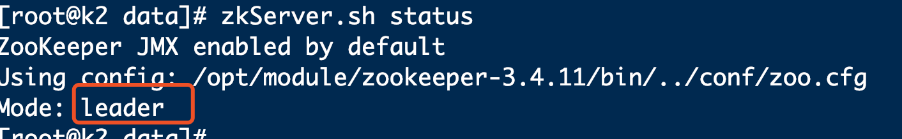
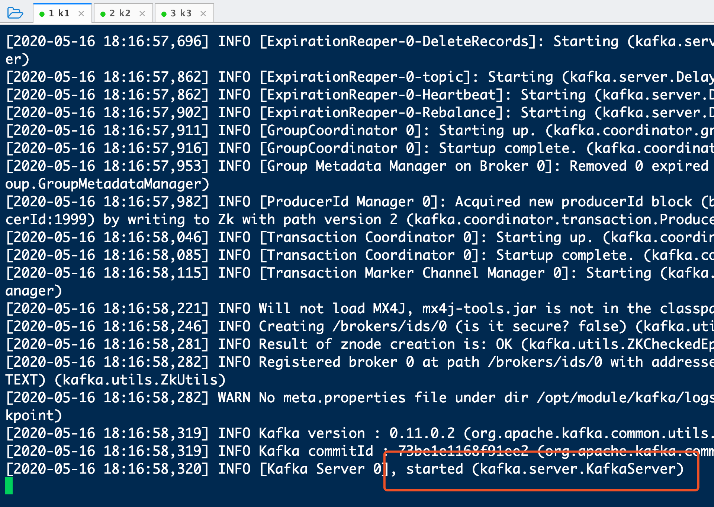
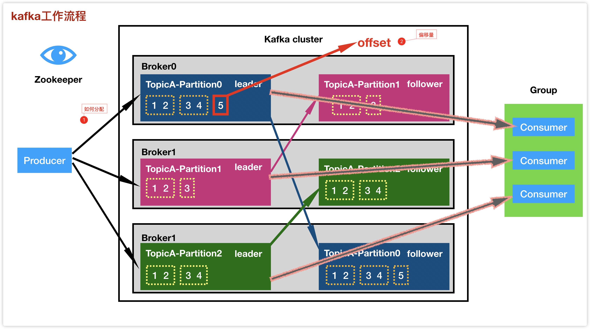
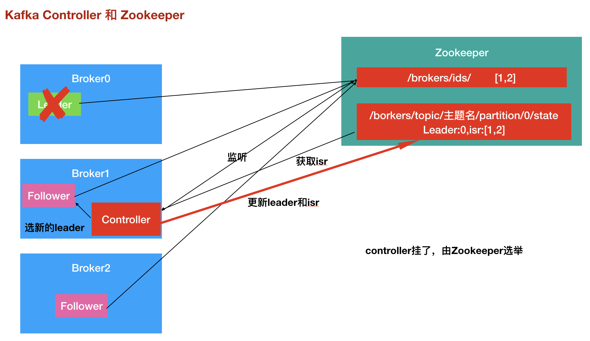

# Kafka

# 一、基本原理及应用场景

## 1、为什么要学习 Kafka 呢？

要回答这个问题，我们不妨先聊聊这几年互联网技术发展。

互联网蓬勃发展的这些年涌现出了很多令人眼花缭乱的新技术。截止到 2019 年，当下互联网行业最火的技术当属 ABC 了，即所谓的 AI 人工智能、BigData 大数据和 Cloud 云计算云平台。

在这 ABC 当中，坦率说 A 和 C 是有点曲高和寡的，不是所有玩家都能入场。反观 B 要显得平民得多，几乎所有公司都能参与进来。

作为工程师或架构师，你在实际工作过程中一定参与到了很多大数据业务系统的构建。由于这些系统都是为公司业务服务的，所以通常来说它们仅仅是执行一些常规的业务逻辑，因此它们不能算是计算密集型应用，相反更应该是数据密集型的。

对于数据密集型应用来说，如何应对数据量激增、数据复杂度增加以及数据变化速率变快，是彰显大数据工程师、架构师功力的最有效表征。我们发现 Kafka 在帮助你应对这些问题方面能起到非常好的效果。就拿数据量激增来说，Kafka 能够有效隔离上下游业务，将上游突增的流量缓存起来，以平滑的方式传导到下游子系统中，避免了流量的不规则冲击。由此可见，如果你是一名大数据从业人员，熟练掌握 Kafka 是非常必要的一项技能。

刚刚所举的例子仅仅是 Kafka 助力业务的一个场景罢了。事实上，Kafka 有着非常广阔的应用场景。目前 Apache Kafka 被认为是整个消息引擎领域的执牛耳者，仅凭这一点就值得我们好好学习一下它。另外，从学习技术的角度而言，Kafka 也是很有亮点的。我们仅需要学习一套框架就能在实际业务系统中实现消息引擎应用、应用程序集成、分布式存储构建，甚至是流处理应用的开发与部署，听起来还是很超值的吧。

不仅如此，再给你看一个数据。援引美国 2019 年 Dice 技术薪资报告中的数据，在 10 大薪资最高的技术技能中，掌握 Kafka 以平均每年 12.8 万美元排名第二！排名第一位的是 13.2 万美元 / 年的 Go 语言。好吧，希望你看到这个之后不会立即关闭我的专栏然后转头直奔隔壁的 Go 语言专栏。虽然这是美国人才市场的数据，但是我们有理由相信在国内 Kafka 的行情也是水涨船高。2019 年两会上再一次提到了要深化**大数据**、人工智能等研发应用，而 Kafka 无论是作为消息引擎还是实时流处理平台，都能在大数据工程领域发挥重要的作用。

#### 总之 Kafka 是个利器，值得一试！


一张思维导图，可以帮你迅速了解这个专栏的知识结构体系是什么样的。专栏大致从八个方面展开，包括 Kafka 入门、Kafka 的基本使用、客户端详解、Kafka 原理介绍、Kafka 运维与监控

## 2、什么是kafka？


**是一款开源的消息引擎系统**。简单来说是一个分布式的基于发布/订阅模式的**消息队列，**主要应用于大数据实时处理领域。

由LinkedIn使用Scala编写，用作LinkedIn的活动流（Activity Stream）和运营数据处理管道（Pipeline）的基础，具有高水平扩展和高吞吐量。 已被多家不同类型的公司作为多种类型的数据管道和消息系统使用。如:淘宝，支付宝，百度，twitter等

目前越来越多的开源分布式处理系统如Apache flume、Apache Storm、Spark,elasticsearch都支持与Kafka集成。

## 3、什么是消息引擎系统？这类系统是做什么用的呢？

比如，系统 A 发送消息给消息引擎系统，系统 B 从消息引擎系统中读取 A 发送的消息。

最基础的消息引擎就是做这点事的！

- 消息引擎传输的对象是消息；
- 如何传输消息属于消息引擎设计机制的一部分。

既然消息引擎是用于在不同系统之间传输消息的，那么如何设计待传输消息的格式？

一个比较容易想到的是使用已有的一些成熟解决方案，比如使用 CSV、XML 亦或是 JSON；又或者你可能熟知国外大厂开源的一些序列化框架，比如 Google 的 Protocol Buffer 或 Facebook 的 Thrift。那么Kafka 的选择：它使用的是纯二进制的字节序列。当然消息还是结构化的，只是在使用之前都要将其转换成二进制的字节序列。

消息设计出来之后还不够，消息引擎系统还要设定具体的传输协议，即我用什么方法把消息传输出去。常见的有两种模式：

- **点对点模式**：也叫消息队列模型。生产者发送消息到一个队列中。此时，将有一个或多个消费者消费队列中的数据。但是一条消息只能被消费一次。当一个消费者消费了队列中的某条数据之后，该条数据则从消息队列中删除。即使有多个消费者同时消费数据，也能保证顺序

  **生产者发送一条消息到queue，只有一个消费者能收到**。

  日常生活的例子比如电话客服就属于这种模型：同一个客户呼入电话只能被一位客服人员处理，第二个客服人员不能为该客户服务。


- **发布 / 订阅模式**：与上面不同的是，它有一个主题（Topic）的概念，你可以理解成是一个消息容器，类似新闻中的体育、娱乐、财经等分类的概念，通常在书记业务中一个业务就是一个主题。生产者生产数据到一个topic中。与点对点消不同的是，消费者可以订阅一个或多个topic，消费者可以消费该topic中所有的数据，同一条数据可以被多个消费者消费，数据被消费后不会立马删除。

  **发布者发送到topic的消息，只有订阅了topic的订阅者才会收到消息**。生活中的公众号订阅就是一种典型的发布 / 订阅模型。


## 4、什么是消息队列呢？

队列就是一种数据结构，先进先出，比如排队，我们一般把消息队列叫做Message Queue（MQ）。它定义了两

个对象——发送数据的叫生产者；接收数据的叫消费者。


#### 传统MQ的应用场景（javaEE项目）


解决方案：采用异步


## 5、消息队列的作用

秒杀系统


订单流量会瞬时增加，可能出现的结果就是直接压跨系统。

解决方案，使用MQ


##### 作用就是削峰限流

所谓的“削峰限流”就是指缓冲上下游瞬时突发流量，使其更平滑。特别是对于那种发送能力很强的上游系统，如果没有消息引擎的保护，“脆弱”的下游系统可能会直接被压垮导致全链路服务“雪崩”。但是，一旦有了消息引擎，它能够有效地对抗上游的流量冲击，避免了流量的震荡。消息引擎系统的另一大好处在于发送方和接收方的松耦合，这也在一定程度上简化了应用的开发，减少了系统间不必要的交互。

#### 消息队列的三个作用：

- 解耦 各个系统之间通过消息系统这个统一的接口交换数据，无须了解彼此的存在
- 削峰限流 消息系统可顶住峰值流量，业务系统可根据处理能力从消息系统中获取并处理对应量的请求
- 异步 在不需要立即处理请求的场景下，可以将请求放入消息系统，合适的时候再处理 

## 6、kafka在实时处理领域中位置

实时日志采集系统


Flume是Cloudera提供的一个高可用的，高可靠的，分布式的海量日志采集、聚合和传输的系统，Flume支持在日志系统中定制各类数据发送方，用于收集数据；同时，Flume提供对数据进行简单处理，并写到各种数据接受方（可定制）的能力。

# 二、kafka基础架构和相关概念

## 1、kafka的基础架构


那么这里就有几种概念需要我们掌握，borker、zookeeper、partition等

我们一步步分解来看，这些是什么意思？

首先，kafka是一个基于发布订阅模式的分布式的消息队列，提到分布式这里就有一个分区的概念

比如：我有一个很大的数据 （10T），为了快速计算分析出我想要的结果，通常会把数据分片

在分别计算分片里的内容，这个分片相当于分区，这样我们就可以并行的计算分区里的内容，提高效率。


## 2、partition

kafka的分区（partition）分谁呢？就是Topic


如果我的生产者生成的速度要远大于消费者消费的速度，那么会造成数据积压的越来越多，直到装满为止，如果满了，我们就需要扩展，也就是分区。


内部随时增加分区，方便扩展，一个Topic分为多个partition


## 3、消费者组

生产者发往分区的数据是不同的！那么消费者在消费的时候，为了配合分区，也发生了改变，出现了消费者组的概念。


好处：组里的消费者，每一个消费者都会消费一个分区上的数据，就可以并行的消费我一个Topic里的数据，提高吞吐量。

##### 注意：一个分区，只能被一个组里的一个消费者消费，下图是不允许的


##### 注意：消费者组之间互不影响

## 4、分区分配问题

目前我的分区数和消费者数是一致的，没有问题。但是如果不一致就会出现两种情况

##### 分区数和消费者数不一致：

- 分区数大于消费者数
- 分区数小于消费者数

##### 我们先看第一种：分区数大于消费者数


多出来的分区给谁呢？首先不能是其他组！！！

一个组是一个单元，一个组负责消费一个Topic，一个组得消费到完整的数据

而且，一个分区，只能被一个组里的一个消费者消费

这里涉及到分区如何分配的问题，也是面试经常问到的，我们后期专门讲解，留一个悬念。

##### 我们在看第二种：分区数小于消费者数

##### 

多出消费者没有分区消费，这里注意在使用kafka的时候，消费者个数不能超过分区个数，多出来的消费者，消费不到数据。

## 5、集群环境

既然是分布式，那必须也涉及到集群环境

那么我们这几个分区如何分配到集群上？


把分区尽可能的分配到不同的节点上（服务器），如图，一个集群3个节点，这个节点就叫broker（相当于一个服务器）

如果我broker0这个节点挂了，我的数据怎么办？


解决办法：为每一个partition制作一个副本

## 6、Replica

每个partition可以在其他的kafka broker节点上存副本，以便某个kafka broker节点宕机不会影响这个kafka集

群。


主从都不在一个节点上，如果存在一个节点上，没有用，节点宕机了还是没有数据

一般副本可以有一个或多个，我们自己定义

副本一般叫follower 从， 与主同步，真正负责数据的读写的还是leader

副本数=leader+follower的个数

##### 注意：replica副本数目不能大于kafka broker节点的数目，否则报错。

这样如果某个broker宕机，其实整个kafka内数据依然是完整的。但是，replica副本数越高，系统虽然越稳定，但是会带来资源和性能上的下降；replica副本少的话，也会造成系统丢数据的风险。

## 7、zookeeper

最后，如果我们的leader宕机了，他的副本如果有多个，我们会选举其中一个作为新的leader，如何选举leader，我们就用到了zookeeper。也就是需要做一个HA高可用，想我们springcloud中的eureka，redis中的哨兵。他的功能不止是选举，后面我们在详细讲解。

所以在使用kafka的时候，我们应该先启动zookeeper。

## 8、总结相关概念

- broker
  - Kafka 集群包含一个或多个服务器，服务器节点称为broker。
- Topic
  - 每条发布到Kafka集群的消息都有一个类别，这个类别被称为Topic。类似于数据库的表名
- partition
  - 为了实现扩展性,topic中的数据分割为一个或多个partition。每个topic至少有一个partition。
- Producer
  - 生产者即数据的发布者，该角色将消息发布到Kafka的topic中。broker接收到生产者发送的消息后，存储到一个partition中，生产者也可以指定数据存储的partition。
- Consumer
  - 消费者可以从broker中读取数据。

- Consumer Group （CG）消费者组
  - 由多个consumer组成。**消费者组内每个消费者负责消费不同分区的数据，一个分区只能由一个消费者消费；消费者组之间互不影响。**所有的消费者都属于某个消费者组，即**消费者组是逻辑上的一个订阅者**。

- Replica
  - 副本，为保证集群中的某个节点发生故障时，该节点上的partition数据不丢失，且kafka仍然能够继续工作，kafka提供了副本机制，一个topic的每个分区都有若干个副本，一个leader和若干个follower。

- leader
  - 每个分区多个副本的“主”，生产者发送数据的对象，以及消费者消费数据的对象都是leader。
- follower
  - 每个分区多个副本中的“从”，实时从leader中同步数据，保持和leader数据的同步。leader发生故障时，某个follower会成为新的follower

#  三、常见的消息队列对比

## 1、消息队列的流派

### 有 Broker 的 MQ

这个流派通常有一台服务器作为 Broker，所有的消息都通过它中转。生产者把消息发送给它就结束自己的任务了，Broker 则把消息主动推送给消费者（或者消费者主动轮询）

#### 重 Topic

kafka、JMS（ActiveMQ）就属于这个流派，虽然架构一样但是 kafka 的性能要比 jms 的性能不知道高到多少倍，所以基本这种类型的 MQ 只有 kafka 一种备选方案。如果你需要一条暴力的数据流（在乎性能而非灵活性）那么 kafka 是最好的选择

### 轻 Topic

这种的代表是 RabbitMQ（或者说是 AMQP）。生产者发送 key 和数据，消费者定义订阅的队列，Broker 收到数据之后会通过一定的逻辑计算出 key 对应的队列，然后把数据交给队列


这种模式下解耦了 key 和 queue，在这种架构中 queue 是非常轻量级的（在 RabbitMQ 中它的上限取决于你的内存），消费者关心的只是自己的 queue；生产者不必关心数据最终给谁只要指定 key 就行了，中间的那层映射在 AMQP 中叫 exchange（交换机）。

AMQP 中有四种 exchange

- Direct exchange：key 就等于 queue
- Fanout exchange：无视 key，给所有的 queue 都来一份
- Topic exchange：key 可以用“宽字符”模糊匹配 queue
- Headers exchange：无视 key，通过查看消息的头部元数据来决定发给那个 queue（AMQP 头部元数据非常丰富而且可以自定义）

这种结构的架构给通讯带来了很大的灵活性，我们能想到的通讯方式都可以用这四种 exchange 表达出来。如果你需要一个企业数据总线（在乎灵活性）那么 RabbitMQ 绝对的值得一用

### 无 Broker 的 MQ

无 Broker 的 MQ 的代表是 ZeroMQ。该作者非常睿智，他非常敏锐的意识到——MQ 是更高级的 Socket，它是解决通讯问题的。所以 ZeroMQ 被设计成了一个“库”而不是一个中间件，这种实现也可以达到——没有 Broker 的目的


节点之间通讯的消息都是发送到彼此的队列中，每个节点都既是生产者又是消费者。ZeroMQ 做的事情就是封装出一套类似于 Socket 的 API 可以完成发送数据，读取数据

ZeroMQ 其实就是一个跨语言的、重量级的 Actor 模型邮箱库。你可以把自己的程序想象成一个 Actor，ZeroMQ 就是提供邮箱功能的库；ZeroMQ 可以实现同一台机器的 RPC 通讯也可以实现不同机器的 TCP、UDP 通讯，如果你需要一个强大的、灵活、野蛮的通讯能力，别犹豫 ZeroMQ

## 2、Actor 模型

### 什么是 Actor 模型

Actor 模式是一个解决分布式计算的数学模型，其中 Actor 是基础，它能回应接收到消息，能够自我决策，创建更多的 Actor，发送更多的消息，决定如何回应下一个接收到的消息。Actor 认为一切皆是 Actor，类似于面向对象认为一切皆 Object 一样。OO 的执行是顺序的，Actor 模型内在设计就是并行的

### Actor 是异步的

Actor 是计算实体，它回复接收到的消息，能够并行的：

- 发生有限的消息给其他 Actor
- 创建有限数目的新 Actor
- 指定一个消息到达时的行为

这些操作并没有顺序要求，它们能够并行地实施。由于没有对消息的时序做规定，Actor 模式是一种异步模型，发送到 Actor 不等待消息被接收而继续执行。Actor 之间不共享状态，如果想获取其他 Actor 的状态，只能通过消息请求的方式

Actor 在消息内部指定接收消息的 Actor 地址。Actor 可以用自己的地址发送消息，相当于自己接收到自己发送的消息，可以驱动自己的状态

### 所谓真正的 Actor 模型

Actor 可以被认为是在用户空间实现的并发实体，所以它应该是应用级别的线程。如果认同这个观点那么 **Actor 要满足的要求 = 操作系统对进程/线程** 提出的要求一样

### 内存结构

每个并发实体都是要有一个固定的数据结构，必须有一个容器可以保存当前所有的并发实体。这一点基本上很容易满足，Akka 中 Actor 就是一个类，所以它的结构就是这个类的数据结构，大小也就是这个类的大小。Akka 中的 Dispatcher 保存有所有 Actor 的列表

### 并发原语

操作系统的是通过临界区，锁来定义多线程共享数据模型的。在 Actor 中是通过消息来共享数据的。基于消息传递要求“数据只读”，你发送出去的数据再修改肯定就不对了。但是这一点在 Java 里面无论如何都是做不到的，你不修改变量的引用但是还可以修改变量里面的值，调用对象的方法。

### 调度

这是最重要的：没有调度，并发实体根本不能称之为并发实体。操作系统中 CPU 是由内核管理的，调度算法是基于时间片来调任务的，内核随时可以剥夺一个任务的 CPU 使用权这就是“抢占”。这一点非常重要，没有这个功能就意味着调度是不公平的。一个任务耗费大量 CPU 会把另个一任务给饿死。但是在用户空间（应用层）很难实现这一点，毕竟 CPU 是不受应用程序的控制的，没有把办法剥夺。抢占看似可有可无，但是没有它就没有“公平调度”，也就谈不上并发。（有任务撑死，有任务饿死）

### 所谓“公平调度”

比如写两个 Actor，使用无限循环输出字符串（while(true)）会疯狂的吃 CPU，如果是可抢占的公平调度，则 actor1 和 actor2 应该是比较有规律的交替（大家得到的 CPU 时间差不多）

### Java 中的 Akka

```text
test1
test1
test1
...
test2
test2
test2
...
test1
...
```

### ErLang

```text
test1
test2
test1
test2
test1
test2
test1
test2
...
```

ErLang 非常均匀的任务切换，实现了“可抢占的公平”

## 3、常用消息系统对比

- RabbitMQ Erlang编写，支持多协议 AMQP，XMPP，SMTP，STOMP。支持负载均衡、数据持久化。同时 支持Peer-to-Peer和发布/订阅模式 

- Redis 基于Key-Value对的NoSQL数据库，同时支持MQ功能，可做轻量级队列服务使用。就入队操作而言， Redis对短消息(小于10KB)的性能比RabbitMQ好，长消息的性能比RabbitMQ差。 

- ZeroMQ 轻量级，不需要单独的消息服务器或中间件，应用程序本身扮演该角色，Peer-to-Peer。它实质上是 一个库，需要开发人员自己组合多种技术，使用复杂度高 

- ActiveMQ JMS实现，Peer-to-Peer，支持持久化、XA事务 

- Kafka/Jafka 高性能跨语言的分布式发布/订阅消息系统，数据持久化，全分布式，同时支持在线和离线处理 

- MetaQ/RocketMQ 纯Java实现，发布/订阅消息系统，支持本地事务和XA分布式事务 

## 4、Kafka的优点

### Kafka设计目标

- 高吞吐率 在廉价的商用机器上单机可支持每秒100万条消息的读写
- 消息持久化 所有消息均被持久化到磁盘，无消息丢失，支持消息重放
-  完全分布式 Producer，Broker，Consumer均支持水平扩展
- 同时适应在线流处理和离线批处理 

### 优点

- 解耦

在项目启动之初来预测将来项目会碰到什么需求，是极其困难的。消息系统在处理过程中间插入了一个隐含的、基于数据的接口层，两边的处理过程都要实现这一接口。这允许你独立的扩展或修改两边的处理过程，只要确保它们遵守同样的接口约束。

- 冗余（副本）

有些情况下，处理数据的过程会失败。除非数据被持久化，否则将造成丢失。消息队列把数据进行持久化直到它们已经被完全处理，通过这一方式规避了数据丢失风险。许多消息队列所采用的"插入-获取-删除"范式中，在把一个消息从队列中删除之前，需要你的处理系统明确的指出该消息已经被处理完毕，从而确保你的数据被安全的保存直到你使用完毕。

- 扩展性

因为消息队列解耦了你的处理过程，所以增大消息入队和处理的频率是很容易的，只要另外增加处理过程即可。不需要改变代码、不需要调节参数。扩展就像调大电力按钮一样简单。

- 灵活性&峰值处理能力

在访问量剧增的情况下，应用仍然需要继续发挥作用，但是这样的突发流量并不常见；如果为以能处理这类峰值访问为标准来投入资源随时待命无疑是巨大的浪费。使用消息队列能够使关键组件顶住突发的访问压力，而不会因为突发的超负荷的请求而完全崩溃。

- 可恢复性

系统的一部分组件失效时，不会影响到整个系统。消息队列降低了进程间的耦合度，所以即使一个处理消息的进程挂掉，加入队列中的消息仍然可以在系统恢复后被处理。

- 顺序保证

在大多使用场景下，数据处理的顺序都很重要。大部分消息队列本来就是排序的，并且能保证数据会按照特定的顺序来处理。Kafka保证一个Partition内的消息的有序性。

- 缓冲

在任何重要的系统中，都会有需要不同的处理时间的元素。例如，加载一张图片比应用过滤器花费更少的时间。消息队列通过一个缓冲层来帮助任务最高效率的执行———写入队列的处理会尽可能的快速。该缓冲有助于控制和优化数据流经过系统的速度。

- 异步通信

很多时候，用户不想也不需要立即处理消息。消息队列提供了异步处理机制，允许用户把一个消息放入队列，但并不立即处理它。想向队列中放入多少消息就放多少，然后在需要的时候再去处理它们。

# 四、集群环境搭建

## 1、搭建集群

创建三台服务器，分别k1、k2、k3

### 第1台k1（centos7）

网络连接选择nat模式，启动服务器

账号：root

密码：root

查看防火墙

```sh
sudo systemctl status  firewalld
```

关闭防火墙

```sh
sudo systemctl disable firewalld
```

之后重启

```sh
reboot
```

查看ip

```sh
ip addr
```

测试是否能上网

```sh
ping www.baidu.com
```

如果不能，修改ip

```sh
vi /etc/sysconfig/network-scripts/ifcfg-ens33
```

修改->  ONBOOT=yes   改成静态  BOOTPROTO=static 

添加ip,这里的前3位与刚才查看的ip匹配

```sh
IPADDR=192.168.83.101
GATEWAY=192.168.83.2
DNS1=192.168.83.2
```

重启网络

```sh
service network restart
#测试
ping www.baidu.com
```

设置主机名称

```sh
vi /etc/hostname

删除localhost.localdomain
直接写k1
:wq
```

修改hosts之后重启  

```sh
vi /etc/hosts

127.0.0.1   localhost localhost.localdomain localhost4 localhost4.localdomain4
::1         localhost localhost.localdomain localhost6 localhost6.localdomain6
192.168.83.101 k1
192.168.83.102 k2
192.168.83.103 k3

reboot

ping k1
```

### 第2台k2

重复上述步骤

ip不一样

```sh
IPADDR=192.168.83.102
GATEWAY=192.168.83.2
DNS1=192.168.83.2
```

主机名称不一样

```sh
vi /etc/hostname

k2
```

```sh
vi /etc/hosts

127.0.0.1   localhost localhost.localdomain localhost4 localhost4.localdomain4
::1         localhost localhost.localdomain localhost6 localhost6.localdomain6
192.168.83.101 k1
192.168.83.102 k2
192.168.83.103 k3

reboot

ping k1
```


其他配置一样

### 第3台k3

重复上述步骤

ip不一样

```sh
IPADDR=192.168.83.103
GATEWAY=192.168.83.2
DNS1=192.168.83.2
```

主机名称不一样

```sh
vi /etc/hostname

k3
```

```sh
vi /etc/hosts

127.0.0.1   localhost localhost.localdomain localhost4 localhost4.localdomain4
::1         localhost localhost.localdomain localhost6 localhost6.localdomain6
192.168.83.101 k1
192.168.83.102 k2
192.168.83.103 k3

reboot

ping k1
```

其他配置一样

### 测试

三台机器相互ping同即可

## 2、FinalShell

使用finalShell或者其他工具连接，分别连接三台服务器


连接后在k1上，进入/opt目录下创建module、software文件夹

```sh
mkdir module software
```

- software用于存放jar包
- module存放解压后的jar包

由于k1的操作和k2、k3是一样的，所以使用分发脚本

## 3、xsync集群分发脚本

安装xsync

yum install rsync -y 每个都需要安装

在/usr/local/bin这个目录下创建 xsync 文件，向里面添加下存放的脚本

```sh
#!/bin/bash
#1 获取输入参数个数，如果没有参数，直接退出
pcount=$#
if((pcount==0)); then
echo no args;
exit;
fi

#2 获取文件名称
p1=$1
fname=`basename $p1`
echo fname=$fname

#3 获取上级目录到绝对路径
pdir=`cd -P $(dirname $p1); pwd`
echo pdir=$pdir

#4 获取当前用户名称
user=`whoami`

#5 循环
for((host=2; host<4; host++)); do
        echo ------------------- k$host --------------
        rsync -rvl $pdir/$fname $user@k$host:$pdir
done
```

修改脚本 xsync 具有可执行权限，使用ll命令查看权限

```sh
chmod 777 xsync
ll
```

使用xsync filename就能将filename分发到集群中的各个节点中。

```sh
cd /opt
xsync module/
```

之后提示输入yes，输入密码

查看k2、k3是否有文件夹,在分发software

```sh
xsync software/
```

发现每次都需要输入密码，很麻烦，配置ssh免登陆

## 4、ssh免登陆

在k1上使用命令

```sh
ssh k2
```

连接k2,需要输入密码，输入后，当前变成k2服务器，退出

```sh
exit
```

配置免密码登陆

在k1上，执行如下命令

```sh
cd ~
cd .ssh/
ssh-keygen -t rsa
直接回车即可
```


发送到其他服务器,只需要输入一次密码。以后就不需要了

```sh
ssh-copy-id k2
ssh-copy-id k3
```

之后测试

```sh
ssh k2
#登陆成功
exit
```

**这里我们只配置k1即可，由它去向其他服务器分发脚本，免登陆**

同理，在k2上操作,步骤一致

```sh
ssh-copy-id k1
ssh-copy-id k3
```

在k3上操作

```sh
ssh-copy-id k1
ssh-copy-id k2
```

**测试分发脚本，是否免密码**

```sh
cd /opt
mkdir aa
ls
xsync aa
#切换到k2查看文件夹
rm -r aa
```

## 5、安装jdk

我们使用kafka，它依赖zookeeper，而zookeeper需要jdk

查看系统版本

```sh
file /bin/ls
```


下载对应的1.8安装包（jdk-8u144-linux-x64.tar.gz）

上传到k1的software文件夹

解压文件

```sh
tar -zxvf jdk-8u144-linux-x64.tar.gz

mv jdk1.8.0_144/ ../module/
```

设置环境变量

```sh
vi /etc/profile
#在最后添加(快捷键G) JAVA_HOME （安装的具体目录）
export JAVA_HOME=/opt/module/jdk1.8.0_144
export PATH=$PATH:$JAVA_HOME/bin
```

查看安装目录，切换到jdk文件夹，pwd命令

立即生效

```sh
source /etc/profile
```

查看配置是否成功

```sh
java -version
```


使用分发脚本，分发到其他两台服务器

```sh
cd /opt/module/
xsync jdk1.8.0_144
xsync /etc/profile
```

其他两台服务器执行

```sh
source /etc/profile
java
```

# 五、快速入门

## 1、集群规划

| K1        | k1        | k2        |
| --------- | --------- | --------- |
| Zookeeper | Zookeeper | Zookeeper |
| Kafka     | Kafka     | Kafka     |

kafka依赖zookeeper，所以先安装zookeeper

## 2、安装zookeeper

下载zookeeper的安装包，下载地址：http://zookeeper.apache.org/

 上传到software下，解压安装包到module。

```sh
tar -zxvf zookeeper-3.4.11.tar.gz 

mv zookeeper-3.4.11/ ../module/
```

### 集群配置

进入conf目录，复制zoo-sample.cfg重命名为zoo.cfg，通过修改zoo.cfg来对zookeeper进行配置。这个名字固定写死，因为zookeeper启动会检查这个文件，根据这个配置文件里的信息来启动服务。

```sh
cd zookeeper-3.4.11/
cd conf
cp zoo_sample.cfg zoo.cfg
```

此文件中需要修改以下内容：

#### dataDir

指定zookeeper将数据保存在哪个目录下，如果不修改，默认在/tmp下，这个目录下的数据有可能会在磁盘空间不足或服务器重启时自动被linux清理，所以一定要修改这个地址。

在根目录新建文件夹data


修改配置文件

```sh
dataDir=/opt/module/zookeeper-3.4.11/data
```

在配置文件末尾加上这三行

```sh
server.1=192.168.0.1:2888:3888
server.2=192.168.0.2:2888:3888
server.3=192.168.0.3:2888:3888
```

ip填写自己规划的ip即可，zookeeper服务默认的端口号为2888和3888，也可将/etc/hosts文件添加主机和ip映射，将此处的ip写成主机名称

修改成我们自己的

```sh
server.1=k1:2888:3888
server.2=k2:2888:3888
server.3=k3:2888:3888
```

### 修改myid文件

在刚创建的data文件夹中创建myid文件，其中写上一个数字表明当前机器是哪一个编号的机器。

```sh
cd data
vi myid
1
```

注意：文件名称必须是myid，文件内容只需要一个数字即服务器列表中当前服务器的编号

### 配置环境变量

为了能够在任意目录启动zookeeper集群，我们需要配置环境变量。

你也可以不配，这不是搭建集群的必要操作，只不过如果你不配置环境变量，那么每次启动zookeeper需要到安装文件的 bin 目录下去启动。

```sh
vi /etc/profile
#在最后添加信息
export ZK_HOME=/opt/module/zookeeper-3.4.11
export PATH=$PATH:$ZK_HOME/bin
```

```sh
source /etc/profile
```

分发,其他服务器上执行

```sh
xsync /etc/profile
source /etc/profile
```

### 分发到其他服务器

```sh
cd /opt/module/
xsync zookeeper-3.4.11
```

修改k2的myid文件

```sh
vi myid
2
```

修改k3的myid文件

```sh
vi myid
3
```

### 启动

```
#启动ZK服务: 
bin/zkServer.sh start
#停止ZK服务: 
bin/zkServer.sh stop
#重启ZK服务: 
bin/zkServer.sh restart
#查看ZK服务状态: 
bin/zkServer.sh status
```

Zookeeper集群需要每台挨个启动。

```sh
zkServer.sh start
#可以是用jps命令查看线程。
jps
```


启动集群的时候，集群数量启动没有超过一半，状态会有错误提示，当集群启动数量超过一半就会自动转为正常状态，并且此台使集群进入正常工作状态的服务器会成为leader角色，集群中其他服务器的角色为follower。

### 查看状态

```sh
#k1
zkServer.sh status
```


```sh
#k2
zkServer.sh status
```



```sh
#k3
zkServer.sh status
```


一个主，两个从

## 3、安装kafka

<http://kafka.apache.org/downloads.html>

版本：kafka_2.11-0.11.0.2.tgz

kafka服务器用scala开发，客户端是java开发

2.11是scala的版本号，后面的是kafka的版本号

0.9版本后，kafka对消费者重新设计，简化了使用难度

### 1)上传压缩包，解压

```sh
tar -zxvf kafka_2.11-0.11.0.2.tgz -C /opt/module/
#重命名
mv kafka_2.11-0.11.0.2 kafka
```

### 2)在/opt/module/kafka目录下创建logs文件夹

```sh
mkdir logs
```

### 3)修改配置文件

```sh
cd config/
vi server.properties 
```

### 4)更改红色字体的内容


1、2181：对cline端提供服务

2、3888：选举leader使用

3、2888：集群内机器通讯使用（Leader监听此端口）

### 5)配置环境变量(可选)

```sh
vi /etc/profile

export KAFKA_HOME=/opt/module/kafka
export PATH=$PATH:$KAFKA_HOME/bin

source /etc/profile
```

分发

```sh
xsync /etc/profile
#k2\k3
source /etc/profile
```

### 6)分发安装包

```sh
xsync kafka/
```

### 7)修改broker.id

分别在k2和k3上修改配置文件/opt/module/kafka/config/server.properties中的broker.id

```sh
#k2
broker.id=1
#k3
broker.id=2
```

注：broker.id不得重复

### 8)启动集群

注意先启动zookeeper

```sh
cd /opt/module/kafka
#k1 加-daemon 是后台启动  我们暂时不加
bin/kafka-server-start.sh -daemon config/server.properties
#k2
bin/kafka-server-start.sh config/server.properties
#k3
bin/kafka-server-start.sh config/server.properties
```



kafka/bin目录下的核心命令

```sh
#开启
kafka-server-start.sh
#停止
kafka-server-stop.sh
#只能单节点启动，除非写脚本

#关于topic的命令
kafka-topics.sh
#测试用，控制台的生产者和消费者，生产环境没有用
kafka-console-consumer.sh
kafka-console-producer.sh
```

## 4、命令行操作

由于我们启动kafka是前台启动，不能中断，使用finalShell复制一个新的k1标签

所有的命令都在kafka的bin目录下

生产者消费者，使用数据都需要有一个topic

- 创建Topic，需要指定分区和副本和主题名称，并且告诉zookeeper

```sh
bin/kafka-topics.sh --create --zookeeper k1:2181 --partitions 3 --replication-factor 2 --topic news
```


topic创建主要分为两个部分：命令行部分+后台(controller)逻辑部分，如下图所示。

主要的思想就是后台逻辑会监听zookeeper下对应的目录节点，一旦发起topic创建命

令，该命令会创建新的数据节点从而触发后台的创建逻辑。


简单来说我们发起的命令行主要做两件事情：

1. 确定分区副本的分配方案(就是每个分区的副本都分配到哪些broker上)；
2. 创建zookeeper节点，把这个方案写入/brokers/topics/<topic>节点下

Kafka controller部分主要做下面这些事情：

1. 创建分区；
2. 创建副本；
3. 为每个分区选举leader、ISR；
4. 更新各种缓存

创建成功后，显示

```sh
bin/kafka-topics.sh --create --zookeeper k1:2181 --partitions 3 --replication-factor 2 --topic test01
```


- 查看

```sh
bin/kafka-topics.sh --list --zookeeper k1:2181

显示news
```

- 发送消息(k1 生产者)

```sh
bin/kafka-console-producer.sh --broker-list k1:9092 --topic news
#可以输入数据了
```

注意：9092是kafka的通信端口号

- 接收消息（k2 k3 选一个当消费者）

```sh
bin/kafka-console-consumer.sh --zookeeper k1:2181 --topic news
#上面可以接收新发送的消息
bin/kafka-console-consumer.sh --zookeeper k1:2181 --topic news --from-beginning
#消费全部数据

#新版本命令
bin/kafka-console-consumer.sh --bootstrap-server k1:9092 --topic news --from-beginning
```

- 查看某个Topic的详情

```sh
bin/kafka-topics.sh --zookeeper k1:2181 --describe --topic news
```


isr我们后面详细讲解

- 修改分区数

```sh
bin/kafka-topics.sh --zookeeper k1:2181 --alter --topic news --partitions 6
```

只能增加不能减少，之前的分区有数据，不能删

- 删除topic

```sh
bin/kafka-topics.sh --zookeeper k1:2181 --delete --topic news
```

# 六、深入kafka内核

## 1、工作流程



Ps:具体流程详见ppt

- 创建topic
- 创建分区、副本
- 生产者发送数据给leader（数据如何分配？）
- 每次发一批数据，如果每次只发一条，频繁的连接，网络传输（我们可以通过生产者api配置发送数据的大小，详见生产者和消费者API配置详情）
- follower去leader上同步数据
- 消费者消费数据
- 每个分区互不干扰，存在一个offset偏移量
- 主要给消费者使用的，如果消费者在消费数据的时候宕机了，之后再消费的时候，从什么位置开始消费呢？所以要实时保存消费到哪的位置，这就是offset，简单的说，你可以把它理解为一个书签，由消费者者自己维护
- offset存在哪？
- 在0.9之前，存在zookeeper中，如果消费者过多，会造成zookeeper的过载，在新版本，保存在kafka内置的topic里，这个topic叫__consumer_offset
- 消费者在消费数据的时候，由于分区有3个，互不干扰，是否能保障消费顺序？
  - 不能保障全局的顺序
  - 只能保障分区内的顺序

## 2、数据存储

Kafka中消息是以**topic**进行分类的，生产者生产消息，消费者消费消息，都是面向

topic的。

topic是逻辑上的概念，而partition是物理上的概念，每个partition物理上对应服务器

上的一个文件夹。


- 当生产者往partition中存储数据时，相当于在往一个文件添加数据，假设这个文件叫log，Producer生产的数据会被不断追加到该log文件末端，且每条数据都有自己offset。消费者组中的每个消费者，都会实时记录自己消费到了哪个offset，以便出错恢复时，从上次的位置继续消费。

- 由于生产者生产的消息会不断追加到log文件末尾，为防止log文件过大导致数据定位效率低下（简单理解就是消费者挂了，需要查offset，大文件查的慢）

- Kafka采取了**分片**和**索引**机制，将每个partition分为多个segment（segment对用户透明）。数据只会被append到segment中，不会单独删除或修改。每个segment 对应两个文件，分别是以.log结尾的数据文件和以.index结尾的索引文件。在服务器上，这些文件位于一个文件夹下，该文件夹的命名规则为：topic名称+分区序号,例如，news这个topic有三个分区，则其对应的文件夹为news-0,news-1,news-2。

  ```sh
  cd /opt/module/kafka/logs
  ls
  ```

  

  

- 如下，有三个segment

  ```sh
  00000000000000000000.index
  00000000000000000000.log
  
  00000000000000166677.index
  00000000000000166677.log
  
  00000000000000288811.index
  00000000000000288811.log
  ```

- 每个segment file也有自己的命名规则，每个名字有20个字符，不够用0填充。每个名字从0开始命名，index和log文件以当前segment的第一条消息的offset命名。下图为index文件和log文件的结构示意图

  

- 在.index文件中，存储的是key-value格式的，key代表在.log中按顺序开始第几条消息，value代表该消息的位置偏移。

- “.index”文件存储大量的索引信息，“.log”文件存储大量的数据，索引文件中的元数据指向对应数据文件中message的物理偏移地址。

- kafka数据默认保存时间是一周，在数据量大，而磁盘容量不足的情况下，经常出现无法写入的情况，有时候需要我们自己调整配置。清除过期数据时，直接删除一个或多个segment

## 3、生产者

我们在使用 Apache Kafka 生产和消费消息的时候，肯定是希望能够将数据均匀地分配到所有服务器上。比如很多公司使用 Kafka 收集应用服务器的日志数据，这种数据都是很多的，特别是对于那种大批量机器组成的集群环境，每分钟产生的日志量都能以 GB 数，因此如何将这么大的数据量均匀地分配到 Kafka 的各个 Broker 上，就成为一个非常重要的问题。

### 为什么分区？

- 方便扩展
- 提高吞吐量

不同的分区能够被放置到不同节点的机器上，而数据的读写操作也都是针对分区这个粒度而进行的，这样每个节点的机器都能独立地执行各自分区的读写请求处理。并且，我们还可以通过添加新的节点机器来增加整体系统的吞吐量

不同的分布式系统对分区的叫法也不尽相同。比如在 Kafka 中叫分区，在 MongoDB 和 Elasticsearch 中就叫分片 Shard，而在 HBase 中则叫 Region，在 Cassandra 中又被称作 vnode。从表面看起来它们实现原理可能不尽相同，但对底层分区（Partitioning）的整体思想却从未改变。

### 分区策略

**所谓分区策略是决定生产者将消息发送到哪个分区的算法。**Kafka 为我们提供了默认的分区策略，同时它也支持你自定义分区策略。

- **轮询策略**

也称 Round-robin 策略，即顺序分配。比如一个主题下有 3 个分区，那么第一条消息被发送到分区 0，第二条被发送到分区 1，第三条被发送到分区 2，以此类推。当生产第 4 条消息时又会重新开始，即将其分配到分区 0，就像下面这张图展示的那样。


这就是所谓的轮询策略。轮询策略是 Kafka Java 生产者 API 默认提供的分区策略。

**轮询策略有非常优秀的负载均衡表现，它总是能保证消息最大限度地被平均分配到所有分区上，故默认情况下它是最合理的分区策略，也是我们最常用的分区策略之一。**

- **随机策略**

也称 Randomness 策略。所谓随机就是我们随意地将消息放置到任意一个分区上，如下面这张图所示。


先计算出该主题总的分区数，然后随机地返回一个小于它的正整数。

本质上看随机策略也是力求将数据均匀地打散到各个分区，但从实际表现来看，它要逊于轮询策略，所以**如果追求数据的均匀分布，还是使用轮询策略比较好**。事实上，随机策略是老版本生产者使用的分区策略，在新版本中已经改为轮询了。

- ##### 按消息key保存策略

Kafka 允许为每条消息定义消息键，简称为 Key。这个 Key 的作用非常大，它可以是一个有着明确业务含义的字符串，比如客户代码、部门编号或是业务 ID 等；也可以用来表征消息元数据。特别是在 Kafka 不支持时间戳的年代，在一些场景中，工程师们都是直接将消息创建时间封装进 Key 里面的。一旦消息被定义了 Key，那么你就可以保证同一个 Key 的所有消息都进入到相同的分区里面，由于每个分区下的消息处理都是有顺序的，故这个策略被称为按消息键保序策略，如下图所示。


- **Kafka 默认分区策略实际上同时实现了两种策略：如果指定了 Key，那么默认实现按消息键保序策略；如果没有指定 Key，则使用轮询策略。**

### 如何自定义分区策略？

我们需要将producer发送的数据封装成一个ProducerRecord对象

提供三种构造函数:

```java
ProducerRecord(topic, partition, key, value)

ProducerRecord(topic, key, value)

ProducerRecord(topic, value)
```

- Topic （名字）
- Partition (可选)
- Key (可选 )
- Value

必须指定消息所属的Topic和消息值Value

发送逻辑:

<1> 若指定Partition ,则发送至指定Partition

<2> 若未指定Partition,但指定了Key, 按照key发送至对应Partition

<3> 若既未指定Partition也没指定Key，会按照轮询(round-robin)模式发送到每个Partition

<4> 若同时指定了Partition和Key, 只会发送到指定的Partition (Key不起作用，代码逻辑决定)

### 数据可靠性保障


之后我们使用了消息队列：kafka


这个时候，我们就需要分成两段来分析数据可靠性


我们先看第一段，从生产者到消费者，如何保障数据可靠性的


收到ack后，我就可以继续发送，如果没收到ack，我就重新发送


这样就保障了数据可靠性，对于我们外界来说，我只知道这么发送就ok了，但是对于kafka内部的partition来说，里面还有leader，follower

我们发送消息是往leader中发送


#### leader收到消息后，什么时候返回ACK？

- 第一种情况，收到消息后，立即返回ACK，但是，别忘了，我们的follower需要同步leader里的数据，如果你立即返回，恰好这时leader挂了，而此时还没有同步，无法从follower中选举新的leader，这部分数据就丢失了
- follower周期性或者尝试去pull(拉)过来leader上的数据


- 第二种情况，等follower与leader同步完成，leader在发送ack，这样就能保证leader挂了后，能在follower中选举出新的leader


#### 有多少个follower同步完成之后发送ack？

- 半数以上同步完成发送ack
  - 为什么是半数以上？
    - 跟选举机制有关，leader挂了，我们需要重新选举，因为我们只能选举出一个leader，所以是半数以上是唯一的，如果不是半数以上，就会发生脑裂。（比如10台机器，有两个同票的4，4，1，1，0，0，0，0，0，0）
  - 延迟低（同步的过程中，机器有快有慢，自然而然就把慢的过滤掉了），容错率低（10台机器，我最多只能容忍4台机器挂掉，因为最少满足6台机器才能选举新的leader）

- 全部同步完成发送ack
  - 延迟高，数据可靠，容错率高（10台机器，全部同步完，我可以容忍9台机器挂掉）


- 如果使用第二种方案，需要等我follower全部同步完成才可以，但是如果我在同步的过程中，有一台follower挂了，那么我就需要一直等待下去，那么这显然是不合理的。所以出现了ISR

### ISR(in-sync replica set)

是一个和leader保持同步的集合，leader等isr集合里的同步完成后，就发送ack，如果有一台迟迟没有同步的follower，那么我就把你踢出isr，我就不等你了(该时间阈值由**replica.lag.time.max.ms**参数设定)。被移除ISR的replica一直在追赶leader,如果追上了，还会继续加入isr。

如果leader挂了，我去选举的时候，我也从isr中取选举

### ACK应答机制

kafka使用第二种方案，保障了数据可靠性，但有些情况下，我们对数据的可靠性要求并不高，比如我们在采集用户访问的日志时，这种数据丢就丢了，所以没必要等ISR中的follower全部同步成功。在银行金融领域、像订单这种数据必须保障不丢的。

所以kafka给我们提供了ack应答机制，这样我们在可靠性和效率上自己选择适合的方案

##### acks参数配置：

- 0：producer不等待broker的ack，这一操作提供了一个最低的延迟，broker一接收到还没有写入磁盘就已经返回，当broker故障时有可能**丢失数据**；
- 1：producer等待broker的ack，partition的leader落盘成功后返回ack，如果在follower同步成功之前leader故障，那么将会**丢失数据**；
- -1（all）：producer等待broker的ack，partition的leader和follower全部落盘成功后才返回ack。但是如果在follower同步完成后，broker发送ack之前，leader发生故障，那么会造成**数据重复**。


## 4、LEO和HW

### LEO

每个副本的最后一个offset

### HW

所有副本中最小的LEO


## 5、故障处理

### follower故障

follower发生故障后会被临时踢出ISR，待该follower恢复后，follower会读取本地磁盘记录的上次的HW，并将log文件高于HW的部分截取掉，从HW开始向leader进行同步。等该**follower的LEO大于等于该Partition的HW**，即follower追上leader之后，就可以重新加入ISR了

### leader故障

leader发生故障之后，会从ISR中选出一个新的leader，之后，为保证多个副本之间的数据一致性，其余的follower会先将各自的log文件高于HW的部分截掉，然后从新的leader同步数据。

**注意：这只能保证副本之间的数据一致性，并不能保证数据不丢失或者不重复（由ack决定）。**

### exactly once

对于某些比较重要的消息，我们需要保证每条消息被发送且仅被发送一次（exactly once）。

在0.11版本之后，Kafka引入了幂等性机制（idempotent，无论请求多少次，结果都是一样的，像我们的get请求），配合acks = -1时的at least once（数据重复不丢失）语义，实现了producer到broker的exactly once语义。

**idempotent + at least once = exactly once**

使用时，只需将enable.idempotence属性设置为true，kafka自动将acks属性设为-1。

## 6、消费者

### 消费方式

consumer采用pull（拉）模式从broker中读取数据。

push（推）模式很难适应消费速率不同的消费者，因为消息发送速率是由broker决定的。它的目标是尽可能以最快速度传递消息，但是这样很容易造成consumer来不及处理消息，典型的表现就是拒绝服务以及网络拥塞。而pull模式则可以根据consumer的消费能力以适当的速率消费消息。

pull模式不足之处是，如果kafka没有数据，消费者可能会陷入循环中，一直返回空数据。针对这一点，Kafka的消费者在消费数据时会传入一个时长参数timeout，如果当前没有数据可供消费，consumer会等待一段时间之后再返回，这段时长即为timeout

### 分区分配策略

一个consumer group中有多个consumer，一个 topic有多个partition，所以必然会涉及到partition的分配问题，即确定那个partition由哪个consumer来消费。

Kafka有两种分配策略，一是roundrobin，一是range。

- roundrobin（默认轮询）

  

- range（范围）

  

### offset维护

由于consumer在消费过程中可能会出现断电宕机等故障，consumer恢复后，需要从故障前的位置的继续消费，所以consumer需要实时记录自己消费到了哪个offset，以便故障恢复后继续消费。

Kafka 0.9版本之前，consumer将offset保存在Zookeeper中，从0.9版本开始，consumer默认将offset保存在Kafka一个内置的topic中，该topic为__consumer_offsets

# 七、kafka高效读写

数据需要持久化，磁盘的读写，拷贝大文件不会很慢，小文件越多越慢，大文件是顺序读写，而小文件不是顺序读写，浪费在寻道上。

- 顺序写磁盘

  Kafka的producer生产数据，要写入到log文件中，写的过程是一直追加到文件末端，为顺序写。官网有数据表明，同样的磁盘，顺序写能到到600M/s，而随机写只有100k/s。这与磁盘的机械机构有关，顺序写之所以快，是因为其省去了大量磁头寻道的时间

- 零拷贝技术

  kafka中的消费者在读取服务端的数据时，需要将服务端的磁盘文件通过网络发送到消费者进程，网络发送需要经过几种网络节点。如下图所示

  

通常情况下，Kafka的消息会有多个订阅者，生产者发布的消息会被不同的消费者多次消费，为了优化这个流程，Kafka使用了“零拷贝技术”，如下图所示：


# 八、zookeeper的作用

Kafka集群中有一个broker会被选举为Controller，负责管理集群broker的上下线，所有topic的分区副本分配和leader选举等工作。

Controller的管理工作都是依赖于Zookeeper的。

以下为partition的leader选举过程：



# 九、Kafka API实战

## 生产者

- 启动zk和kafka集群，在kafka集群中打开一个消费者(新建一个topic)

  ```sh
  bin/kafka-console-consumer.sh --bootstrap-server k1:9092 --topic test01
  ```

#### 创建项目(maven)

- 导入pom依赖

  ```xml
   <dependencies>
          <dependency>
              <groupId>org.apache.kafka</groupId>
              <artifactId>kafka-clients</artifactId>
              <version>0.11.0.0</version>
          </dependency>
          <!-- https://mvnrepository.com/artifact/org.apache.kafka/kafka -->
          <dependency>
              <groupId>org.apache.kafka</groupId>
              <artifactId>kafka_2.12</artifactId>
              <version>0.11.0.0</version>
          </dependency>
      </dependencies>
  ```


修改本地映射：hosts文件


### 创建生产者

```java
import org.apache.kafka.clients.producer.KafkaProducer;
import org.apache.kafka.clients.producer.Producer;
import org.apache.kafka.clients.producer.ProducerRecord;

import java.util.Properties;

public class NewProducer {

    public static void main(String[] args) {

        Properties props = new Properties();
        // Kafka服务端的主机名和端口号
        props.put("bootstrap.servers", "k1:9092");
        // 等待所有副本节点的应答
        props.put("acks", "all");
        // 消息发送最大尝试次数
        props.put("retries", 0);
        // 一批消息处理大小
        props.put("batch.size", 16384);
        // 请求延时
        props.put("linger.ms", 1);
        // 发送缓存区内存大小
        props.put("buffer.memory", 33554432);
        // key序列化
        props.put("key.serializer", "org.apache.kafka.common.serialization.StringSerializer");
        // value序列化
        props.put("value.serializer", "org.apache.kafka.common.serialization.StringSerializer");

        KafkaProducer<String, String> producer = new KafkaProducer<String,String>(props);
        for (int i = 0; i < 50; i++) {
            producer.send(new ProducerRecord<String, String>("test01", Integer.toString(i), "hello world-" + i));
        }

        producer.close();
    }
}
```

如果接收不到信息,配置之后重启kafka集群

```sh
将kafka/config/server.properties文件中advertised.listeners改为如下属性。192.168.83.101是我虚拟机的IP。改完后重启，OK了
advertised.listeners=PLAINTEXT://192.168.83.101:9092
```

### 创建生产者带回调函数（新API）

回调函数会在producer收到ack时调用，为异步调用，该方法有两个参数，分别是RecordMetadata和Exception，如果Exception为null，说明消息发送成功，如果Exception不为null，说明消息发送失败。

注意：消息发送失败会自动重试，不需要我们在回调函数中手动重试。

```java
public static void main(String[] args) {

Properties props = new Properties();
		// Kafka服务端的主机名和端口号
		props.put("bootstrap.servers", "k1:9092");
		// 等待所有副本节点的应答
		props.put("acks", "all");
		// 消息发送最大尝试次数
		props.put("retries", 0);
		// 一批消息处理大小
		props.put("batch.size", 16384);
		// 增加服务端请求延时
		props.put("linger.ms", 1);
// 发送缓存区内存大小
		props.put("buffer.memory", 33554432);
		// key序列化
		props.put("key.serializer", "org.apache.kafka.common.serialization.StringSerializer");
		// value序列化
		props.put("value.serializer", "org.apache.kafka.common.serialization.StringSerializer");

		KafkaProducer<String, String> kafkaProducer = new KafkaProducer<>(props);

		for (int i = 0; i < 50; i++) {

			kafkaProducer.send(new ProducerRecord<String, String>("test01", "hello" + i), new Callback() {

				@Override
				public void onCompletion(RecordMetadata metadata, Exception exception) {

					if (metadata != null) {

						System.err.println(metadata.partition() + "---" + metadata.offset());
					}
				}
			});
		}

		kafkaProducer.close();
	}
```

### 自定义分区生产者

- 需求：将所有数据存储到topic的第0号分区上

```java
1.ProducerRecord 含义: 发送给Kafka Broker的key/value 值对

2.内部数据结构：
-- Topic （名字）
-- PartitionID ( 可选)
-- Key[( 可选 )
-- Value
3.生产者记录（简称PR）的发送逻辑:
<1> 若指定Partition ID,则PR被发送至指定Partition
<2> 若未指定Partition ID,但指定了Key, PR会按照hasy(key)发送至对应Partition
<3> 若既未指定Partition ID也没指定Key，PR会按照round-robin模式发送到每个Partition
<4> 若同时指定了Partition ID和Key, PR只会发送到指定的Partition (Key不起作用，代码逻辑决定)
4.生产者记录(PR)的实现：
 针对3,提供三种构造函数形参:

-- ProducerRecord(topic, partition, key, value)

-- ProducerRecord(topic, key, value)

-- ProducerRecord(topic, value)
```

- 在代码中调用

  ```java
  public class PartitionerProducer {
  
      public static void main(String[] args) {
  
          Properties props = new Properties();
          // Kafka服务端的主机名和端口号
          props.put("bootstrap.servers", "k1:9092");
          // 等待所有副本节点的应答
          props.put("acks", "all");
          // 消息发送最大尝试次数
          props.put("retries", 0);
          // 一批消息处理大小
          props.put("batch.size", 16384);
          // 增加服务端请求延时
          props.put("linger.ms", 1);
          // 发送缓存区内存大小
          props.put("buffer.memory", 33554432);
          // key序列化
          props.put("key.serializer", "org.apache.kafka.common.serialization.StringSerializer");
          // value序列化
          props.put("value.serializer", "org.apache.kafka.common.serialization.StringSerializer");
          // 自定义分区
          props.put("partitioner.class", "com.aishang.kafka.CustomPartitioner");
  
          KafkaProducer<String, String> producer = new KafkaProducer<String, String>(props);
          for (int i = 0; i < 10 ; i++) {
              producer.send(new ProducerRecord<String, String>("news",0, i + "", "hello-" + i), new Callback() {
                  @Override
                  public void onCompletion(RecordMetadata metadata, Exception e) {
                      if (metadata != null) {
                          System.err.println(metadata.partition() + "---" + metadata.offset());
                      }
                  }
              });
          }
  
          producer.close();
      }
  }
  ```


## Kafka消费者Java API

- 在控制台创建发送者

  ```sh
  $ bin/kafka-console-producer.sh --broker-list k1:9092 --topic news
  >hello world
  ```

- 官方提供案例（自动维护消费情况）

  ```java
  public class CustomNewConsumer {
  
  	public static void main(String[] args) {
  
  		Properties props = new Properties();
  		// 定义kakfa 服务的地址，不需要将所有broker指定上 
  		props.put("bootstrap.servers", "k1:9092");
  		// 制定consumer group 
  		props.put("group.id", "test");
  		// 是否自动确认offset 
  		props.put("enable.auto.commit", "true");
  		// 自动确认offset的时间间隔 
  		props.put("auto.commit.interval.ms", "1000");
  		// key的序列化类
  		props.put("key.deserializer", "org.apache.kafka.common.serialization.StringDeserializer");
  		// value的序列化类 
  		props.put("value.deserializer", "org.apache.kafka.common.serialization.StringDeserializer");
  		// 定义consumer 
  		KafkaConsumer<String, String> consumer = new KafkaConsumer<String, String>(props);
  		
  		// 消费者订阅的topic, 可同时订阅多个 
          consumer.subscribe(Arrays.asList("news"));
  		//consumer.subscribe(Arrays.asList("first", "second","third"));
  
  		while (true) {
  			// 读取数据，读取超时时间为100ms 
  			ConsumerRecords<String, String> records = consumer.poll(100);
  			
  			for (ConsumerRecord<String, String> record : records)
  				System.out.printf("offset = %d, key = %s, value = %s%n", record.offset(), record.key(), record.value());
  		}
  	}
  }
  ```

### 测试生产者消费者代码

- 先启动消费者程序
- 之后启动生产者程序

### 手动提交offset

```java
public class CustomConsumer {

    public static void main(String[] args) {
        Properties props = new Properties();
        props.put("bootstrap.servers", "hadoop102:9092");
        props.put("group.id", "test");//消费者组，只要group.id相同，就属于同一个消费者组
        props.put("enable.auto.commit", "false");//自动提交offset
       
        props.put("key.deserializer", "org.apache.kafka.common.serialization.StringDeserializer");
        props.put("value.deserializer", "org.apache.kafka.common.serialization.StringDeserializer");
        KafkaConsumer<String, String> consumer = new KafkaConsumer<>(props);
        consumer.subscribe(Arrays.asList("first"));
        while (true) {
            ConsumerRecords<String, String> records = consumer.poll(100);
            for (ConsumerRecord<String, String> record : records) {
                System.out.printf("offset = %d, key = %s, value = %s%n", record.offset(), record.key(), record.value());
            }
            consumer.commitSync();
        }
    }
}
```

手动提交offset的方法有两种：分别是commitSync（同步提交）和commitAsync（异步提交）。两者的相同点是，都会将**本次poll的一批数据最高的偏移量提交**；不同点是，commitSync会失败重试，一直到提交成功（如果由于不可恢复原因导致，也会提交失败）；而commitAsync则没有失败重试机制，故有可能提交失败

## 拦截器

Producer拦截器(interceptor)是在Kafka 0.10版本被引入的，主要用于实现clients端的定制化控制逻辑。

对于producer而言，interceptor使得用户在消息发送前以及producer回调逻辑前有机会对消息做一些定制化需求，比如修改消息等。同时，producer允许用户指定多个interceptor按序作用于同一条消息从而形成一个拦截链(interceptor chain)。Intercetpor的实现接口是org.apache.kafka.clients.producer.ProducerInterceptor，其定义的方法包括：

（1）configure(configs)

获取配置信息和初始化数据时调用。

（2）onSend(ProducerRecord)：

该方法封装进KafkaProducer.send方法中，即它运行在用户主线程中。Producer确保在消息被序列化以及计算分区前调用该方法。**用户可以在该方法中对消息做任何操作，但最好保证不要修改消息所属的topic和分区，否则会影响目标分区的计算**。

（3）onAcknowledgement(RecordMetadata, Exception)：

**该方法会在消息从RecordAccumulator成功发送到Kafka Broker之后，或者在发送过程中失败时调用。**并且通常都是在producer回调逻辑触发之前。onAcknowledgement运行在producer的IO线程中，因此不要在该方法中放入很重的逻辑，否则会拖慢producer的消息发送效率。

（4）close：

**关闭interceptor，主要用于执行一些资源清理工作**

如前所述，interceptor可能被运行在多个线程中，因此在具体实现时用户需要自行确保线程安全。另外**倘若指定了多个interceptor，则producer将按照指定顺序调用它们，**并仅仅是捕获每个interceptor可能抛出的异常记录到错误日志中而非在向上传递。这在使用过程中要特别留意。

#### 统计发送消息成功和发送失败消息数，并在producer关闭时打印这两个计数器

```java
package com.aishang.k1;

import org.apache.kafka.clients.producer.ProducerInterceptor;
import org.apache.kafka.clients.producer.ProducerRecord;
import org.apache.kafka.clients.producer.RecordMetadata;

import java.util.Map;


public class CountInterceptor implements ProducerInterceptor<String, String> {
    private int errorCounter = 0;
    private int successCounter = 0;


    @Override
    public ProducerRecord<String, String> onSend(ProducerRecord<String, String> producerRecord) {
        return producerRecord;
    }

    @Override
    public void onAcknowledgement(RecordMetadata recordMetadata, Exception exception) {
        if (exception == null) {
            successCounter++;
        } else {
            errorCounter++;
        }
    }

    @Override
    public void close() {
        System.out.println("Successful sent: " + successCounter);
        System.out.println("Failed sent: " + errorCounter);
    }

    @Override
    public void configure(Map<String, ?> map) {

    }
}

```

```java
package com.aishang.k1;

import org.apache.kafka.clients.producer.*;
import org.apache.kafka.common.serialization.StringSerializer;

import java.util.ArrayList;
import java.util.List;
import java.util.Properties;

public class NewProducer {
    public static void main(String[] args) {
        Properties props = new Properties();
        // Kafka服务端的主机名和端口号
        props.put("bootstrap.servers", "k1:9092");
        // 等待所有副本节点的应答
        props.put("acks", "all");
        // 消息发送最大尝试次数
        props.put("retries", 0);
        // 一批消息处理大小
        props.put("batch.size", 16384);
        // 请求延时
        props.put("linger.ms", 1);
        // 发送缓存区内存大小
        props.put("buffer.memory", 33554432);
        // key序列化
        props.put("key.serializer", "org.apache.kafka.common.serialization.StringSerializer");
        // value序列化
        props.put("value.serializer", "org.apache.kafka.common.serialization.StringSerializer");

        // 构建拦截链
//        List<String> interceptors = new ArrayList<String>();
//        interceptors.add("com.aishang.k1.TimeStampPrependerInterceptor"); // interceptor 1
//        interceptors.add("com.aishang.k1.CountInterceptor"); // interceptor 2
        props.put(ProducerConfig.INTERCEPTOR_CLASSES_CONFIG, "com.aishang.k1.CountInterceptor");

        KafkaProducer<String, String> producer = new KafkaProducer<String, String>(props);

        for (int i = 0; i < 50; i++) {
            producer.send(new ProducerRecord<String, String>("news",0,i+"","hei-"+i), new Callback() {
                public void onCompletion(RecordMetadata recordMetadata, Exception e) {
                    if (recordMetadata!=null){
                        System.out.println(recordMetadata.partition()+"--"+recordMetadata.offset());
                    }
                }
            });
        }
        producer.close();
    }
}

```


# 十、项目实战

### 双十一商品销量排行榜


通过用户购物下单，统计商品销售数据进行展示

#### 使用Nginx整合Kafka

nginx-kafka-module是nginx的一个插件，可以将kafka整合到nginx中，便于web项目中前端页面埋点数据的收集，如前端页面设置了埋点，即可将用户的一些访问和请求数据通过http请求直接发送到消息中间件kafka中，后端可以通过程序消费kafka中的消息来进行实时的计算。比如通过SparkStreaming来实时的消费Kafka中的数据来分析用户PV,UV、用户的一些行为及页面的漏斗模型转化率，来更好的对系统进行优化或者对来访用户进行实时动态的分析。也可以做离线分析平台，存储到ELK或者HDFS。

本项目使用最简单的技术，让你了解kafka实际应用，通过埋点，发送到kafka，消费数据，保存到mysql，前端通过echarts渲染

### 具体整合步骤

在k1上

```sh
安装git
yum install -y git

切换到/usr/local/src目录，然后将kafka的客户端源码clone到本地
cd /usr/local/src
git clone https://github.com/edenhill/librdkafka

进入到librdkafka，然后进行编译
cd librdkafka
yum install -y gcc gcc-c++ pcre-devel zlib-devel

./configure; make; sudo make install

安装nginx整合kafka的插件，进入到/usr/local/src，clone nginx整合kafka的源码
cd /usr/local/src
git clone https://github.com/brg-liuwei/ngx_kafka_module

下载nginx到/usr/local/src/目录下
yum install wget
wget http://nginx.org/download/nginx-1.15.5.tar.gz
tar -zxvf nginx-1.15.5.tar.gz 


进入到nginx的源码包目录下   （编译nginx，然后将插件同时编译）
cd /usr/local/src/nginx-1.15.5
安装依赖
yum -y install gcc pcre-devel openssl openssl-devel
预编译 时将插件同时编译
后面跟的目录是 克隆的nginx整合kafka的插件的目录

./configure --add-module=/usr/local/src/ngx_kafka_module/
make && make install
安装后在/usr/local/下会有一个nginx目录

#启动测试
cd /usr/local/nginx
sbin/nginx
#查看
ps -ef | grep nginx

root      33550      1  0 21:40 ?        00:00:00 nginx: master process sbin/nginx
nobody    33551  33550  0 21:40 ?        00:00:00 nginx: worker process

浏览器访问http://192.168.83.101/


修改nginx的配置文件：设置一个location和kafaka的topic
cd /usr/local/nginx/conf
vi nginx.conf
#添加配置(2处)
kafka;
kafka_broker_list k1:9092 k2:9092 k3:9092;
#如果topic不存在会自动创建
location = /kafka/access {
kafka_topic product;
}
#可以配置多个topic
location = /kafka/tt2 {
kafka_topic user;
}
```


```sh
启动zk和kafka集群(创建topic)
zkServer.sh start
kafka-server-start.sh  config/server.properties


#测试
浏览器访问192.168.83.101


报错，找不到kafka.so.1的文件
error while loading shared libraries: librdkafka.so.1: cannot open shared object file: No such file or directory


则执行下面的命令，再重新启动
echo "/usr/local/lib" >> /etc/ld.so.conf
#手动加载
ldconfig
重新加载执行
sbin/nginx -s reload
报错：
nginx: [error] open() "/usr/local/nginx/logs/nginx.pid" failed (2: No such file or directory)
修改conf/nginx.conf 把pid的注释打开
/usr/local/nginx/sbin/nginx -c /usr/local/nginx/conf/nginx.conf
sbin/nginx -s reload
端口号被占用
yum install lsof  
lsof -i:80
kill -9 id

#开启消费者
bin/kafka-console-consumer.sh --bootstrap-server k1:9092 --topic product

测试，向nginx中写入数据，然后观察kafka的消费者能不能消费到数据
curl http://localhost/kafka/access -d "message send to kafka topic"
curl http://localhost/kafka/access -d "666" 
```

#### 创建html页面，埋点

```html
<!doctype html>
<html>
<head>
<meta charset="UTF-8">
<title>Untitled Document</title>
<script src="https://cdn.bootcdn.net/ajax/libs/jquery/3.5.1/jquery.min.js"></script>
</head>

<body>
	<script type="text/javascript">
		var url = "http://192.168.83.101/kafka/access"
		var data = {
			name:'tom'
		}
		$(function () {
			$.post(url,data)

		})
	</script>
</body>
</html>

```


- 启动consumer，刷新页面


### 项目整合

新建springboot项目，选择web的spring web和Messaging的spring kafka

```xml
<?xml version="1.0" encoding="UTF-8"?>
<project xmlns="http://maven.apache.org/POM/4.0.0" xmlns:xsi="http://www.w3.org/2001/XMLSchema-instance"
         xsi:schemaLocation="http://maven.apache.org/POM/4.0.0 https://maven.apache.org/xsd/maven-4.0.0.xsd">
    <modelVersion>4.0.0</modelVersion>
    <parent>
        <groupId>org.springframework.boot</groupId>
        <artifactId>spring-boot-starter-parent</artifactId>
        <version>2.3.0.RELEASE</version>
        <relativePath/> <!-- lookup parent from repository -->
    </parent>
    <groupId>com.aishang</groupId>
    <artifactId>top10</artifactId>
    <version>0.0.1-SNAPSHOT</version>
    <name>top10</name>
    <description>Demo project for Spring Boot</description>

    <properties>
        <java.version>1.8</java.version>
    </properties>

    <dependencies>
        <dependency>
            <groupId>org.springframework.boot</groupId>
            <artifactId>spring-boot-starter-web</artifactId>
        </dependency>
        <dependency>
            <groupId>org.springframework.kafka</groupId>
            <artifactId>spring-kafka</artifactId>
        </dependency>
        <!--<dependency>-->
            <!--<groupId>org.mybatis.spring.boot</groupId>-->
            <!--<artifactId>mybatis-spring-boot-starter</artifactId>-->
            <!--<version>1.3.2</version>-->
        <!--</dependency>-->
        <dependency>
            <groupId>org.apache.kafka</groupId>
            <artifactId>kafka-clients</artifactId>
        </dependency>
        <dependency>
            <groupId>org.springframework.boot</groupId>
            <artifactId>spring-boot-starter-test</artifactId>
            <scope>test</scope>
            <exclusions>
                <exclusion>
                    <groupId>org.junit.vintage</groupId>
                    <artifactId>junit-vintage-engine</artifactId>
                </exclusion>
            </exclusions>
        </dependency>
    </dependencies>

    <build>
        <plugins>
            <plugin>
                <groupId>org.springframework.boot</groupId>
                <artifactId>spring-boot-maven-plugin</artifactId>
            </plugin>
        </plugins>
    </build>

</project>

```

application.yml

```xml
spring:
  kafka:
    bootstrap-servers: 192.168.83.101:9092 #指定kafka server的地址，集群配多个，中间，逗号隔开
    producer:
      key-serializer: org.apache.kafka.common.serialization.StringSerializer
      value-serializer: org.apache.kafka.common.serialization.StringSerializer
    consumer:
      group-id: top10 #群组ID
      enable-auto-commit: true
      auto-commit-interval: 1000
      key-deserializer: org.apache.kafka.common.serialization.StringDeserializer
      value-deserializer: org.apache.kafka.common.serialization.StringDeserializer
server:
  port: 8500
```


ConsumerKafka

```java
package com.aishang.top10.Consumer;

import org.apache.kafka.clients.consumer.ConsumerRecord;
import org.springframework.kafka.annotation.KafkaListener;
import org.springframework.stereotype.Component;


@Component
public class ConsumerKafka {
    /**
     * 定义此消费者接收topics = "demo"的消息
     * @param record 变量代表消息本身，可以通过ConsumerRecord<?,?>类型的record变量来打印接收的消息的各种信息
     */
    @KafkaListener(topics = "product")
    public void listen (ConsumerRecord<?, ?> record){
        System.out.printf("topic is %s, offset is %d, value is %s \n", record.topic(), record.offset(), record.value());
    }
}

```

启动程序

打开之前的index.html


使用静态页面进行数据埋点，进行测试


改造埋点

```js
<script src="https://cdn.bootcdn.net/ajax/libs/jquery/3.5.1/jquery.min.js"></script>
<script>
	var url = "http://192.168.83.101/kafka/access"
	var addrs = ['北京','杭州','哈尔滨','长春','大连','沈阳','青岛','上海','深圳','广州','南京',
	'无锡','西安','武汉','长沙','郑州','天津','呼兰浩特','太原','乌鲁木齐','宁夏','重庆','成都']
	var addr = addrs[parseInt(Math.random()*addrs.length)]
	
	var data = {
		productName: '抱枕',
		price:'69',
		addr:addr
	}
	$.post(url, data)
</script>
```

获取商品名称

```java
package com.aishang.top10.Consumer;

import org.apache.kafka.clients.consumer.ConsumerRecord;
import org.springframework.kafka.annotation.KafkaListener;
import org.springframework.stereotype.Component;

import java.io.UnsupportedEncodingException;
import java.net.URLDecoder;


@Component
public class ConsumerKafka {
    /**
     * 定义此消费者接收topics = "demo"的消息
     * @param record 变量代表消息本身，可以通过ConsumerRecord<?,?>类型的record变量来打印接收的消息的各种信息
     */
    @KafkaListener(topics = "product")
    public void listen (ConsumerRecord<?, ?> record) throws UnsupportedEncodingException {
        System.out.printf("topic is %s, offset is %d, value is %s \n", record.topic(), record.offset(),record.value());
        String proName =  record.value().toString();
        String[] split = proName.split("&");
        for (String s : split) {
            String[] str = s.split("=");
            String decode = URLDecoder.decode(str[1], "UTF-8");
            System.out.println(decode);
        }
    }
}

```

```java
package com.aishang.top10.po;

public class Product {
    String productName;
    String addr;
    double price;

    public String getProductName() {
        return productName;
    }

    public void setProductName(String productName) {
        this.productName = productName;
    }

    public String getAddr() {
        return addr;
    }

    public void setAddr(String addr) {
        this.addr = addr;
    }

    public double getPrice() {
        return price;
    }

    public void setPrice(double price) {
        this.price = price;
    }

    @Override
    public String toString() {
        return "Product{" +
                "productName='" + productName + '\'' +
                ", addr='" + addr + '\'' +
                ", price=" + price +
                '}';
    }
}

```

```java
package com.aishang.top10.Consumer;

import com.aishang.top10.po.Product;
import org.apache.kafka.clients.consumer.ConsumerRecord;
import org.springframework.kafka.annotation.KafkaListener;
import org.springframework.stereotype.Component;

import java.io.UnsupportedEncodingException;
import java.net.URLDecoder;
import java.util.ArrayList;
import java.util.List;


@Component
public class ConsumerKafka {
    /**
     * 定义此消费者接收topics = "demo"的消息
     * @param record 变量代表消息本身，可以通过ConsumerRecord<?,?>类型的record变量来打印接收的消息的各种信息
     */
    @KafkaListener(topics = "product")
    public void listen (ConsumerRecord<?, ?> record) throws UnsupportedEncodingException {
        String proName =  record.value().toString();
        String[] split = proName.split("&");
        Product product = new Product();
        for (String s : split) {
            String[] str = s.split("=");
            String decode = URLDecoder.decode(str[1], "UTF-8");
            if("productName".equals(str[0])){
                product.setProductName(decode);
            }else if("price".equals(str[0])){
                product.setPrice(Double.valueOf(decode));
            }else{
                product.setAddr(decode);
            }
        }
        System.out.println(product);
    }
}

```

连接数据库

```xml
<?xml version="1.0" encoding="UTF-8"?>
<project xmlns="http://maven.apache.org/POM/4.0.0" xmlns:xsi="http://www.w3.org/2001/XMLSchema-instance"
         xsi:schemaLocation="http://maven.apache.org/POM/4.0.0 https://maven.apache.org/xsd/maven-4.0.0.xsd">
    <modelVersion>4.0.0</modelVersion>
    <parent>
        <groupId>org.springframework.boot</groupId>
        <artifactId>spring-boot-starter-parent</artifactId>
        <version>2.3.0.RELEASE</version>
        <relativePath/> <!-- lookup parent from repository -->
    </parent>
    <groupId>com.aishang</groupId>
    <artifactId>top10</artifactId>
    <version>0.0.1-SNAPSHOT</version>
    <name>top10</name>
    <description>Demo project for Spring Boot</description>

    <properties>
        <java.version>1.8</java.version>
    </properties>

    <dependencies>
        <dependency>
            <groupId>org.springframework.boot</groupId>
            <artifactId>spring-boot-starter-web</artifactId>
        </dependency>
        <dependency>
            <groupId>org.springframework.kafka</groupId>
            <artifactId>spring-kafka</artifactId>
        </dependency>
        <dependency>
            <groupId>com.alibaba</groupId>
            <artifactId>druid-spring-boot-starter</artifactId>
            <version>1.1.10</version>
        </dependency>
        <dependency>
            <groupId>tk.mybatis</groupId>
            <artifactId>mapper-spring-boot-starter</artifactId>
            <version>2.0.2</version>
        </dependency>
        <dependency>
            <groupId>mysql</groupId>
            <artifactId>mysql-connector-java</artifactId>
            <scope>runtime</scope>
        </dependency>
        <dependency>
            <groupId>org.apache.kafka</groupId>
            <artifactId>kafka-clients</artifactId>
        </dependency>
        <dependency>
            <groupId>org.springframework.boot</groupId>
            <artifactId>spring-boot-starter-test</artifactId>
            <scope>test</scope>
            <exclusions>
                <exclusion>
                    <groupId>org.junit.vintage</groupId>
                    <artifactId>junit-vintage-engine</artifactId>
                </exclusion>
            </exclusions>
        </dependency>
    </dependencies>

    <build>
        <plugins>
            <plugin>
                <groupId>org.springframework.boot</groupId>
                <artifactId>spring-boot-maven-plugin</artifactId>
            </plugin>
        </plugins>
    </build>

</project>

```

```xml
spring:
  kafka:
    bootstrap-servers: 192.168.83.101:9092 #指定kafka server的地址，集群配多个，中间，逗号隔开
    producer:
      key-serializer: org.apache.kafka.common.serialization.StringSerializer
      value-serializer: org.apache.kafka.common.serialization.StringSerializer
    consumer:
      group-id: top10 #群组ID
      enable-auto-commit: true
      auto-commit-interval: 1000
      key-deserializer: org.apache.kafka.common.serialization.StringDeserializer
      value-deserializer: org.apache.kafka.common.serialization.StringDeserializer
  datasource:
    druid:
      url: jdbc:mysql://localhost:3306/1901?useUnicode=true&characterEncoding=utf-8&useSSL=false
      username: root
      password: password
      initial-size: 1
      min-idle: 1
      max-active: 20
      test-on-borrow: true
      # MySQL 8.x: com.mysql.cj.jdbc.Driver
      driver-class-name: com.mysql.cj.jdbc.Driver
server:
  port: 8500

```

```java
package com.aishang.top10.service.impl;

import com.aishang.top10.dao.ProductDao;
import com.aishang.top10.po.Product;
import com.aishang.top10.service.ProductService;
import org.springframework.stereotype.Repository;
import org.springframework.stereotype.Service;

import javax.annotation.PostConstruct;
import javax.annotation.Resource;


@Service
public class ProductServiceImpl implements ProductService {
    @Resource
    ProductDao productDao;
    public static ProductServiceImpl proUtil;
    @PostConstruct
    public void init() {
        proUtil = this;
    }

    @Override
    public void addPro(Product product) {
        proUtil.productDao.addPro(product);
    }

}

```

```java
package com.aishang.top10.dao;

import com.aishang.top10.po.Product;
import org.apache.ibatis.annotations.Insert;
import org.apache.ibatis.annotations.Mapper;

@Mapper
public interface ProductDao {
    @Insert("insert into tb_products values(default,#{productName},#{price},#{addr})")
    void addPro(Product product);
}

```

### 数据渲染，大数据模板在count/index.html

controller

```java
package com.aishang.top10.controller;

import com.aishang.top10.po.Addr;
import com.aishang.top10.po.Hot;
import com.aishang.top10.po.Product;
import com.aishang.top10.po.Sale;
import com.aishang.top10.service.ProductService;
import org.apache.kafka.common.metrics.stats.Sum;
import org.springframework.stereotype.Controller;
import org.springframework.web.bind.annotation.CrossOrigin;
import org.springframework.web.bind.annotation.RequestMapping;
import org.springframework.web.bind.annotation.RestController;

import javax.annotation.Resource;
import java.util.List;


@RestController
@CrossOrigin(origins = "*", maxAge = 3600)
public class TopController {
    @Resource
    ProductService productService;

    @RequestMapping("/hot")
    public List<Hot> hot(String msg) {
//        System.out.println(msg);
        List<Hot> hotProList = productService.getHotProList();
        return hotProList;
    }
    @RequestMapping("/sale")
    public List<Sale> sale() {
        List<Sale> saleList = productService.getSale();
        return saleList;
    }
    @RequestMapping("/sum")
    public Double sum() {
        Double num = productService.getSum();
        return num;
    }
    @RequestMapping("/addr")
    public List<Addr> addr() {
        List<Addr> AddrList = productService.getAddrList();
        return AddrList;
    }
}

```

实体类

```java
package com.aishang.top10.po;


public class Addr {
    String addr;
    Double price;

    @Override
    public String toString() {
        return "Addr{" +
                "addr='" + addr + '\'' +
                ", price=" + price +
                '}';
    }

    public String getAddr() {
        return addr;
    }

    public void setAddr(String addr) {
        this.addr = addr;
    }

    public Double getPrice() {
        return price;
    }

    public void setPrice(Double price) {
        this.price = price;
    }
}

```

```java
package com.aishang.top10.po;


public class Hot {
    String productName;
    int count;

    @Override
    public String toString() {
        return "Hot{" +
                "name='" + productName + '\'' +
                ", count=" + count +
                '}';
    }

    public String getName() {
        return productName;
    }

    public void setName(String productName) {
        this.productName = productName;
    }

    public int getCount() {
        return count;
    }

    public void setCount(int count) {
        this.count = count;
    }
}

```

```java
package com.aishang.top10.po;


public class Sale {
    String productName;
    double price;

    @Override
    public String toString() {
        return "Sale{" +
                "productName='" + productName + '\'' +
                ", price=" + price +
                '}';
    }

    public String getProductName() {
        return productName;
    }

    public void setProductName(String productName) {
        this.productName = productName;
    }

    public double getPrice() {
        return price;
    }

    public void setPrice(double price) {
        this.price = price;
    }
}

```

ProductService

```java
package com.aishang.top10.service;

import com.aishang.top10.po.Addr;
import com.aishang.top10.po.Hot;
import com.aishang.top10.po.Product;
import com.aishang.top10.po.Sale;

import java.util.List;


public interface ProductService {
//    add
   void addPro(Product product);
//   查询热门商品
   List<Hot> getHotProList();

   List<Sale> getSale();

   Double getSum();

   List<Addr> getAddrList();
}

```

ProductServiceImpl

```java
package com.aishang.top10.service.impl;

import com.aishang.top10.dao.ProductDao;
import com.aishang.top10.po.Addr;
import com.aishang.top10.po.Hot;
import com.aishang.top10.po.Product;
import com.aishang.top10.po.Sale;
import com.aishang.top10.service.ProductService;
import org.springframework.stereotype.Repository;
import org.springframework.stereotype.Service;

import javax.annotation.PostConstruct;
import javax.annotation.Resource;
import java.util.List;


@Service
public class ProductServiceImpl implements ProductService {
    @Resource
    ProductDao productDao;

    public static ProductServiceImpl proUtil;
    @PostConstruct
    public void init() {
        proUtil = this;
    }
    @Override
    public void addPro(Product product) {
        proUtil.productDao.addPro(product);
    }

    @Override
    public List<Hot> getHotProList() {
        List<Hot> hotProList = productDao.getHotProList();
        return hotProList;
    }

    @Override
    public List<Sale> getSale() {
        List<Sale> sale = productDao.getSale();
        return sale;
    }

    @Override
    public Double getSum() {
        Double sum = productDao.getSum();
        return sum;
    }

    @Override
    public List<Addr> getAddrList() {
        List<Addr> addrList = productDao.getAddrList();
        return addrList;
    }

}

```

ProductDao

```java
package com.aishang.top10.dao;

import com.aishang.top10.po.Addr;
import com.aishang.top10.po.Hot;
import com.aishang.top10.po.Product;
import com.aishang.top10.po.Sale;
import org.apache.ibatis.annotations.Insert;
import org.apache.ibatis.annotations.Mapper;
import org.apache.ibatis.annotations.Select;

import java.util.List;


@Mapper
public interface ProductDao {
    @Insert("insert into tb_products values(default,#{productName},#{price},#{addr})")
    void addPro(Product product);
    @Select("SELECT productName,count(*) count from tb_products GROUP BY productName ORDER BY count(*) desc limit 10")
    List<Hot> getHotProList();
    @Select("SELECT productName,sum(price) price from tb_products GROUP BY productName ORDER BY sum(price) desc limit 10")
    List<Sale> getSale();
    @Select("SELECT sum(price) price from tb_products ")
    Double getSum();
    @Select("SELECT addr,sum(price) price from tb_products GROUP BY addr")
    List<Addr> getAddrList();
}

```

html

```html
<!DOCTYPE html>

<html>

<head>
	<meta charset="utf-8" />
	<meta name="viewport"
		content="width=device-width,initial-scale=1,minimum-scale=1,maximum-scale=1,user-scalable=no" />
	<meta http-equiv="X-UA-Compatible" content="IE=edge, chrome=1" />
	<title>大屏数据可视化</title>
	<link rel="stylesheet" href="css/app.css" />
	<script src="https://cdn.bootcdn.net/ajax/libs/jquery/3.5.1/jquery.min.js"></script>
	<script src="https://cdn.bootcdn.net/ajax/libs/echarts/4.8.0/echarts.min.js"></script>
	<script src="../js/echarts-map-china.js"></script>
</head>

<body>
	<div class="header">
		<h1 class="header-title">天猫双十一TOP10</h1>
	</div>
	<div class="wrapper">
		<div class="content">
			<div class="col col-l">
				<div class="xpanel-wrapper xpanel-wrapper-100">
					<div class="xpanel xpanel-l-t">
						<div class="title">热门商品</div>
						<div id="main" style="width: 100%;height: 100%;"></div>
					</div>
				</div>
			</div>
			<div class="col col-c">
				<div class="xpanel-wrapper xpanel-wrapper-70">
					<div class="xpanel no-bg">
						<div id="map" style="width: 100%;height: 100%;"></div>
					</div>
				</div>
				<div class="xpanel-wrapper xpanel-wrapper-30">
					<div class="xpanel xpanel-c-b">
						<div class="title title-long">往年对比</div>
						<div id="main3" style="width: 100%;height: 100%;"></div>
					</div>
				</div>
			</div>
			<div class="col col-r">
				<div class="xpanel-wrapper xpanel-wrapper-50">
					<div class="xpanel xpanel-r-t">
						<div class="title">单品销售额TOP10</div>
						<div id="main1" style="width: 100%;height: 100%;"></div>
					</div>
				</div>
				<div class="xpanel-wrapper xpanel-wrapper-50">
					<div class="xpanel xpanel-r-m">
						<div class="title">销售指标 100万</div>
						<div id="main2" style="width: 100%;height: 100%;"></div>
					</div>
				</div>
			</div>
		</div>
	</div>
</body>

</html>

<script>

	// 基于准备好的dom，初始化echarts实例
	var myChart = echarts.init(document.getElementById('main'));
	var myChart1 = echarts.init(document.getElementById('main1'));
	var myChart2 = echarts.init(document.getElementById('main2'));
	var myChart3 = echarts.init(document.getElementById('main3'));
	var map = echarts.init(document.getElementById('map'));
	var url = "http://localhost:8500/hot"
	$.post(url, { msg: "我要...热门商品" }, function (result) {
		var pros = []
		var counts = []
		for (var i = 0; i < result.length; i++) {
			pros.push(result[i].name)
			counts.push(result[i].count)
		}
		pros = pros.reverse();
		counts = counts.reverse();

		// 指定图表的配置项和数据
		var option = {
			tooltip: {
				trigger: 'axis',
				axisPointer: {
					type: 'shadow'
				}
			},
			grid: {
				top: '2%',
				left: '3%',
				right: '4%',
				bottom: '7%',
				containLabel: true
			},
			xAxis: {
				type: 'value',
				boundaryGap: [0, 0.01],
				axisLabel: {
					show: true,
					textStyle: {
						color: '#c3dbff',  //更改坐标轴文字颜色
						fontSize: 12      //更改坐标轴文字大小
					}
				},
			},
			yAxis: {
				type: 'category',
				data: pros,
				axisLabel: {
					show: true,
					textStyle: {
						color: '#CAD6F3',  //更改坐标轴文字颜色
						fontSize: 12      //更改坐标轴文字大小
					}
				},
			},
			series: [
				{
					type: 'bar',
					color: ['#B6D3C4'],
					data: counts
				}
			]
		};

		// 使用刚指定的配置项和数据显示图表。
		myChart.setOption(option);
	})

	// 销售额
	$.post('http://localhost:8500/sale', function (result) {
		var arr = []
		var title = []
		for (var i = 0; i < result.length; i++) {
			title.push(result[i].productName)
			var obj = {}
			obj.name = result[i].productName
			obj.value = result[i].price
			arr.push(obj)
		}


		// 指定图表的配置项和数据
		var option = {
			tooltip: {
				trigger: 'item',
				formatter: '{a} <br/>{b} : {c} ({d}%)'
			},
			series: [
				{
					name: '总金额',
					type: 'pie',
					radius: '55%',
					center: ['50%', '50%'],
					data: arr,
					emphasis: {
						itemStyle: {
							shadowBlur: 10,
							shadowOffsetX: 0,
							shadowColor: 'rgba(0, 0, 0, 0.5)'
						}
					}
				}
			]
		};


		// 使用刚指定的配置项和数据显示图表。
		myChart1.setOption(option);
	})

	// 销售指标
	$.post('http://localhost:8500/sum', function (result) {
		// 指定图表的配置项和数据
		var num = (result / 1000000).toFixed(2);
		var option = {
			tooltip: {
				formatter: '{a} <br/>{c} {b}'
			},
			series: [
				{
					name: '销售指标',
					type: 'gauge',
					min: 0,
					max: 100,
					radius: '80%',
					axisLine: {            // 坐标轴线
						lineStyle: {       // 属性lineStyle控制线条样式
							color: [[0.09, 'lime'], [0.82, '#1e90ff'], [1, '#ff4500']],
							width: 3,
							shadowColor: '#fff', //默认透明
							shadowBlur: 10
						}
					},
					axisLabel: {            // 坐标轴小标记
						fontWeight: 'bolder',
						color: '#fff',
						shadowColor: '#fff', //默认透明
						shadowBlur: 10
					},
					axisTick: {            // 坐标轴小标记
						length: 15,        // 属性length控制线长
						lineStyle: {       // 属性lineStyle控制线条样式
							color: 'auto',
							shadowColor: '#fff', //默认透明
							shadowBlur: 10
						}
					},
					splitLine: {           // 分隔线
						length: 25,         // 属性length控制线长
						lineStyle: {       // 属性lineStyle（详见lineStyle）控制线条样式
							width: 3,
							color: '#fff',
							shadowColor: '#fff', //默认透明
							shadowBlur: 10
						}
					},
					pointer: {           // 分隔线
						shadowColor: '#fff', //默认透明
						shadowBlur: 5
					},
					title: {
						textStyle: {
							fontWeight: 'bolder',
							fontSize: 20,
							fontStyle: 'italic',
							color: '#fff',
							shadowColor: '#fff', //默认透明
							shadowBlur: 10
						}
					},
					detail: {
						shadowColor: '#fff', //默认透明
						shadowBlur: 5,
						offsetCenter: [0, '50%'],       // x, y，单位px
						textStyle: {
							fontWeight: 'bolder',
							color: '#fff'
						},
						formatter: '{value}%'
					},
					data: [{ value: num, name: '完成率' }]
				},
			]
		};


		// 使用刚指定的配置项和数据显示图表。
		myChart2.setOption(option);
	})


	// 地图
	$.post("http://localhost:8500/addr", function (data) {
		//城市经纬度
		const scatterGeo = {
			"海门": [121.15, 31.89],
			"鄂尔多斯": [109.781327, 39.608266],
			"招远": [120.38, 37.35],
			"舟山": [122.207216, 29.985295],
			"齐齐哈尔": [123.97, 47.33],
			"盐城": [120.13, 33.38],
			"赤峰": [118.87, 42.28],
			"青岛": [120.33, 36.07],
			"乳山": [121.52, 36.89],
			"金昌": [102.188043, 38.520089],
			"泉州": [118.58, 24.93],
			"莱西": [120.53, 36.86],
			"日照": [119.46, 35.42],
			"胶南": [119.97, 35.88],
			"南通": [121.05, 32.08],
			"拉萨": [91.11, 29.97],
			"云浮": [112.02, 22.93],
			"梅州": [116.1, 24.55],
			"文登": [122.05, 37.2],
			"上海": [121.48, 31.22],
			"攀枝花": [101.718637, 26.582347],
			"威海": [122.1, 37.5],
			"承德": [117.93, 40.97],
			"厦门": [118.1, 24.46],
			"汕尾": [115.375279, 22.786211],
			"潮州": [116.63, 23.68],
			"丹东": [124.37, 40.13],
			"太仓": [121.1, 31.45],
			"曲靖": [103.79, 25.51],
			"烟台": [121.39, 37.52],
			"福州": [119.3, 26.08],
			"瓦房店": [121.979603, 39.627114],
			"即墨": [120.45, 36.38],
			"抚顺": [123.97, 41.97],
			"玉溪": [102.52, 24.35],
			"张家口": [114.87, 40.82],
			"阳泉": [113.57, 37.85],
			"莱州": [119.942327, 37.177017],
			"湖州": [120.1, 30.86],
			"汕头": [116.69, 23.39],
			"昆山": [120.95, 31.39],
			"宁波": [121.56, 29.86],
			"湛江": [110.359377, 21.270708],
			"揭阳": [116.35, 23.55],
			"荣成": [122.41, 37.16],
			"连云港": [119.16, 34.59],
			"葫芦岛": [120.836932, 40.711052],
			"常熟": [120.74, 31.64],
			"东莞": [113.75, 23.04],
			"河源": [114.68, 23.73],
			"淮安": [119.15, 33.5],
			"泰州": [119.9, 32.49],
			"南宁": [108.33, 22.84],
			"营口": [122.18, 40.65],
			"惠州": [114.4, 23.09],
			"江阴": [120.26, 31.91],
			"蓬莱": [120.75, 37.8],
			"韶关": [113.62, 24.84],
			"嘉峪关": [98.289152, 39.77313],
			"广州": [113.23, 23.16],
			"延安": [109.47, 36.6],
			"太原": [112.53, 37.87],
			"清远": [113.01, 23.7],
			"中山": [113.38, 22.52],
			"昆明": [102.73, 25.04],
			"寿光": [118.73, 36.86],
			"盘锦": [122.070714, 41.119997],
			"长治": [113.08, 36.18],
			"深圳": [114.07, 22.62],
			"珠海": [113.52, 22.3],
			"宿迁": [118.3, 33.96],
			"咸阳": [108.72, 34.36],
			"铜川": [109.11, 35.09],
			"平度": [119.97, 36.77],
			"佛山": [113.11, 23.05],
			"海口": [110.35, 20.02],
			"江门": [113.06, 22.61],
			"章丘": [117.53, 36.72],
			"肇庆": [112.44, 23.05],
			"大连": [121.62, 38.92],
			"临汾": [111.5, 36.08],
			"吴江": [120.63, 31.16],
			"石嘴山": [106.39, 39.04],
			"沈阳": [123.38, 41.8],
			"苏州": [120.62, 31.32],
			"茂名": [110.88, 21.68],
			"嘉兴": [120.76, 30.77],
			"长春": [125.35, 43.88],
			"胶州": [120.03336, 36.264622],
			"银川": [106.27, 38.47],
			"张家港": [120.555821, 31.875428],
			"三门峡": [111.19, 34.76],
			"锦州": [121.15, 41.13],
			"南昌": [115.89, 28.68],
			"柳州": [109.4, 24.33],
			"三亚": [109.511909, 18.252847],
			"自贡": [104.778442, 29.33903],
			"吉林": [126.57, 43.87],
			"阳江": [111.95, 21.85],
			"泸州": [105.39, 28.91],
			"西宁": [101.74, 36.56],
			"宜宾": [104.56, 29.77],
			"呼和浩特": [111.65, 40.82],
			"成都": [104.06, 30.67],
			"大同": [113.3, 40.12],
			"镇江": [119.44, 32.2],
			"桂林": [110.28, 25.29],
			"张家界": [110.479191, 29.117096],
			"宜兴": [119.82, 31.36],
			"北海": [109.12, 21.49],
			"西安": [108.95, 34.27],
			"金坛": [119.56, 31.74],
			"东营": [118.49, 37.46],
			"牡丹江": [129.58, 44.6],
			"遵义": [106.9, 27.7],
			"绍兴": [120.58, 30.01],
			"扬州": [119.42, 32.39],
			"常州": [119.95, 31.79],
			"潍坊": [119.1, 36.62],
			"重庆": [106.54, 29.59],
			"台州": [121.420757, 28.656386],
			"南京": [118.78, 32.04],
			"滨州": [118.03, 37.36],
			"贵阳": [106.71, 26.57],
			"无锡": [120.29, 31.59],
			"本溪": [123.73, 41.3],
			"克拉玛依": [84.77, 45.59],
			"渭南": [109.5, 34.52],
			"马鞍山": [118.48, 31.56],
			"宝鸡": [107.15, 34.38],
			"焦作": [113.21, 35.24],
			"句容": [119.16, 31.95],
			"北京": [116.46, 39.92],
			"徐州": [117.2, 34.26],
			"衡水": [115.72, 37.72],
			"包头": [110, 40.58],
			"绵阳": [104.73, 31.48],
			"乌鲁木齐": [87.68, 43.77],
			"枣庄": [117.57, 34.86],
			"杭州": [120.19, 30.26],
			"淄博": [118.05, 36.78],
			"鞍山": [122.85, 41.12],
			"溧阳": [119.48, 31.43],
			"库尔勒": [86.06, 41.68],
			"安阳": [114.35, 36.1],
			"开封": [114.35, 34.79],
			"济南": [117, 36.65],
			"德阳": [104.37, 31.13],
			"温州": [120.65, 28.01],
			"九江": [115.97, 29.71],
			"邯郸": [114.47, 36.6],
			"临安": [119.72, 30.23],
			"兰州": [103.73, 36.03],
			"沧州": [116.83, 38.33],
			"临沂": [118.35, 35.05],
			"南充": [106.110698, 30.837793],
			"天津": [117.2, 39.13],
			"富阳": [119.95, 30.07],
			"泰安": [117.13, 36.18],
			"诸暨": [120.23, 29.71],
			"郑州": [113.65, 34.76],
			"哈尔滨": [126.63, 45.75],
			"聊城": [115.97, 36.45],
			"芜湖": [118.38, 31.33],
			"唐山": [118.02, 39.63],
			"平顶山": [113.29, 33.75],
			"邢台": [114.48, 37.05],
			"德州": [116.29, 37.45],
			"济宁": [116.59, 35.38],
			"荆州": [112.239741, 30.335165],
			"宜昌": [111.3, 30.7],
			"义乌": [120.06, 29.32],
			"丽水": [119.92, 28.45],
			"洛阳": [112.44, 34.7],
			"秦皇岛": [119.57, 39.95],
			"株洲": [113.16, 27.83],
			"石家庄": [114.48, 38.03],
			"莱芜": [117.67, 36.19],
			"常德": [111.69, 29.05],
			"保定": [115.48, 38.85],
			"湘潭": [112.91, 27.87],
			"金华": [119.64, 29.12],
			"岳阳": [113.09, 29.37],
			"长沙": [113, 28.21],
			"衢州": [118.88, 28.97],
			"廊坊": [116.7, 39.53],
			"菏泽": [115.480656, 35.23375],
			"合肥": [117.27, 31.86],
			"武汉": [114.31, 30.52],
			"大庆": [125.03, 46.58]
		};
	

		const convertScatterData = function (data) {
			let res = [];
			for (let i = 0; i < data.length; i++) {
				let geoCoord = scatterGeo[data[i].addr];
				if (geoCoord) {
					res.push({
						name: data[i].addr,
						value: geoCoord.concat(data[i].price)
					});
				}
			}
			return res;
		};

		//地图配置项
		const sactterMapOpt = {
			title: {
				text: '全国销售额预览',
				x: 'center',
				top: '10%',
				textStyle: {
					color: '#fff'
				}
			},
			tooltip: {
				trigger: 'item',
				formatter: function (params) {
					return params.name + ' : ' + params.value[2];
				}
			},
			visualMap: {
				min: 0,
				max: 2000,
				calculable: true,
				inRange: {
					color: ['#50a3ba', '#eac736', '#d94e5d']
				},
				textStyle: {
					color: '#fff'
				}
			},
			geo: {
				map: 'china',
				roam: false, //开启鼠标缩放和漫游
				zoom: 1, //地图缩放级别
				selectedMode: false, //选中模式：single | multiple
				left: 0,
				right: 0,
				top: 0,
				bottom: 0,
				layoutCenter: ['50%', '50%'], //设置后left/right/top/bottom等属性无效
				layoutSize: '100%',
				label: {
					emphasis: {
						show: false
					}
				},
				itemStyle: {
					normal: {
						areaColor: '#101f32',
						borderWidth: 1.1,
						borderColor: '#43d0d6'
					},
					emphasis: {
						areaColor: '#069'
					}
				}
			},
			series: [{
				name: '全国销售额',
				type: 'scatter',
				coordinateSystem: 'geo',
				symbolSize: 12,
				label: {
					normal: {
						show: false
					},
					emphasis: {
						show: false
					}
				},
				itemStyle: {
					emphasis: {
						borderColor: '#fff',
						borderWidth: 1
					}
				},
				// data: convertScatterData(scatterVal)
				data: convertScatterData(data)
			}]
		};
		//渲染报表
		map.setOption(sactterMapOpt);


	},
	);


	// 往年对比
	var option = {
		grid: {
			top: '12%',
			left: '3%',
			right: '4%',
			bottom: '25%',
			containLabel: true
		},
		textStyle: {
			color: '#fff'
		},
		xAxis: {
			type: 'category',
			data: ['2015', '2016', '2017', '2018', '2019', '2020']
		},
		yAxis: {
			type: 'value',
			bottom: '20%'
		},
		series: [{
			data: [820, 932, 901, 934, 1290, 1330, 1320],
			type: 'line',
			color: 'gold',
			smooth: true
		}]
	};
	myChart3.setOption(option);


</script>
```


# 十一、Kafka监控和管理

### 1、Kafka Monitor（监控）

1.在/opt/module/下创建kafka-monitor文件夹

2.上传jar包KafkaOffsetMonitor-assembly-0.4.6.jar到刚创建的目录下

3.在/opt/module/kafka-monitor目录下创建启动脚本start.sh，内容如下：

```sh
vi start.sh


#!/bin/bash
java -cp KafkaOffsetMonitor-assembly-0.4.6-SNAPSHOT.jar com.quantifind.kafka.offsetapp.OffsetGetterWeb \
--zk k1:2181,k2:2181,k3:2181 \
--kafkaBrokers k1:9092,k2:9092,k3:9092 \
--offsetStorage kafka \
--port 8089 \
--refresh 10.seconds \
--retain 2.days

```

refresh 10.seconds -> 监控，10秒刷新一次

retain 2.days ->日志保存两天

修改权限 chmod +x start.sh

4.在/opt/module/kafka-monitor目录下创建mobile-logs文件夹

mkdir mobile-logs

5.启动KafkaMonitor

./start.sh

6.登录页面k1:8086端口查看详情

CommitedOffset 消费到哪个offset

leo：写入的offset

lag:消费的和写入的之间差多少数据 

owener：partition属于哪个消费者

### 2、Kafka manager（管理）

1.上传压缩包kafka-manager-1.3.3.15.zip到集群

2.解压到/opt/module

```sh
unzip /opt/software/kafka-manager-1.3.3.15.zip -d /opt/module
```

3.修改配置文件conf/application.conf

kafka-manager.zkhosts="kafka-manager-zookeeper:2181"

修改为：

kafka-manager.zkhosts="k1:2181,k2:2181,k3:2181"

4.启动kafka-manager

```sh
cd bin
chmod +x kafka-manager
./kafka-manager
```

报错是需要开启jmx一个管理服务，监控一些信息,可以不开

如果开启 会向zookeeper中注册，下次启动时会去找jmx，没找到就报错

```sh
停止kafka
JMX_PORT=9988 bin/kafka-server-start.sh config/server.properties
```

5.添加集群 add Cluster


名字随便起

集群：k1:2181,k2:2181,k3:2181

版本：0.11.0.0

勾选jmx  


打开，不开监控不到消费者信息

6.登录k1:9000页面查看详细信息

# 附：面试题

# 消息队列的常见使用场景，比较核心的有3个：解耦、异步、削峰

 

**解耦**：现场画个图来说明一下，A系统发送个数据到BCD三个系统，接口调用发送，那如果E系统也要这个数据呢？那如果C系统现在不需要了呢？现在A系统又要发送第二种数据了呢？A系统负责人濒临崩溃中。。。再来点更加崩溃的事儿，A系统要时时刻刻考虑BCDE四个系统如果挂了咋办？我要不要重发？我要不要把消息存起来？头发都白了啊。。。

- 不用mq场景如下：

 

面试技巧：你需要去考虑一下你负责的系统中是否有类似的场景，就是一个系统或者一个模块，调用了多个系统或者模块，互相之间的调用很复杂，维护起来很麻烦。但是其实这个调用是不需要直接同步调用接口的，如果用MQ给他异步化解耦，也是可以的，你就需要去考虑在你的项目里，是不是可以运用这个MQ去进行系统的解耦。在简历中体现出来这块东西，用MQ作解耦。

- 使用mq场景：


**异步**：现场画个图来说明一下，A系统接收一个请求，需要在自己本地写库，还需要在BCD三个系统写库，自己本地写库要3ms，BCD三个系统分别写库要300ms、450ms、200ms。最终请求总延时是3 + 300 + 450 + 200 = 953ms，接近1s，用户感觉搞个什么东西，慢死了慢死了。

- 正常情况

  

- 使用MQ进行异步化之后的接口性能优化

 

**削峰**：每天0点到11点，A系统风平浪静，每秒并发请求数量就100个。结果每次一到11点~1点，每秒并发请求数量突然会暴增到1万条。但是系统最大的处理能力就只能是每秒钟处理1000个请求啊。。。尴尬了，系统会死。。。

- 没有mq的高峰期，系统被打死的场景


- 使用mq的削峰场景


# 消息队列有什么优点和缺点啊？

优点上面已经说了，就是在特殊场景下有其对应的好处，解耦、异步、削峰

 

缺点呢？显而易见的

 

系统可用性降低：系统引入的外部依赖越多，越容易挂掉，本来你就是A系统调用BCD三个系统的接口就好了，人ABCD四个系统好好的，没啥问题，你偏加个MQ进来，万一MQ挂了咋整？MQ挂了，整套系统崩溃了，你不就完了么。

 

系统复杂性提高：硬生生加个MQ进来，你怎么保证消息没有重复消费？怎么处理消息丢失的情况？怎么保证消息传递的顺序性？头大头大，问题一大堆，痛苦不已

 

一致性问题：A系统处理完了直接返回成功了，人都以为你这个请求就成功了；但是问题是，要是BCD三个系统那里，BD两个系统写库成功了，结果C系统写库失败了，咋整？你这数据就不一致了。

 

所以消息队列实际是一种非常复杂的架构，你引入它有很多好处，但是也得针对它带来的坏处做各种额外的技术方案和架构来规避掉，最好之后，你会发现，妈呀，系统复杂度提升了一个数量级，也许是复杂了10倍。但是关键时刻，用，还是得用的。。。

### kafka、activemq、rabbitmq、rocketmq都有什么优点和缺点啊？

| 特性                    | ActiveMQ                                                     | RabbitMQ                                                     | RocketMQ                                                     | Kafka                                                        |
| ----------------------- | ------------------------------------------------------------ | ------------------------------------------------------------ | ------------------------------------------------------------ | :----------------------------------------------------------- |
| 单机吞吐量              | 万级，吞吐量比RocketMQ和Kafka要低了一个数量级                | 万级，吞吐量比RocketMQ和Kafka要低了一个数量级                | 10万级，RocketMQ也是可以支撑高吞吐的一种MQ                   | 10万级别，这是kafka最大的优点，就是吞吐量高。       一般配合大数据类的系统来进行实时数据计算、日志采集等场景 |
| topic数量对吞吐量的影响 |                                                              |                                                              | topic可以达到几百，几千个的级别，吞吐量会有较小幅度的下降       这是RocketMQ的一大优势，在同等机器下，可以支撑大量的topic | topic从几十个到几百个的时候，吞吐量会大幅度下降       所以在同等机器下，kafka尽量保证topic数量不要过多。如果要支撑大规模topic，需要增加更多的机器资源 |
| 时效性                  | ms级                                                         | 微秒级，这是rabbitmq的一大特点，延迟是最低的                 | ms级                                                         | 延迟在ms级以内                                               |
| 可用性                  | 高，基于主从架构实现高可用性                                 | 高，基于主从架构实现高可用性                                 | 非常高，分布式架构                                           | 非常高，kafka是分布式的，一个数据多个副本，少数机器宕机，不会丢失数据，不会导致不可用 |
| 消息可靠性              | 有较低的概率丢失数据                                         |                                                              | 经过参数优化配置，可以做到0丢失                              | 经过参数优化配置，消息可以做到0丢失                          |
| 功能支持                | MQ领域的功能极其完备                                         | 基于erlang开发，所以并发能力很强，性能极其好，延时很低       | MQ功能较为完善，还是分布式的，扩展性好                       | 功能较为简单，主要支持简单的MQ功能，在大数据领域的实时计算以及日志采集被大规模使用，是事实上的标准 |
| 优劣势总结              | 非常成熟，功能强大，在业内大量的公司以及项目中都有应用       偶尔会有较低概率丢失消息       而且现在社区以及国内应用都越来越少，官方社区现在对ActiveMQ 5.x维护越来越少，几个月才发布一个版本       而且确实主要是基于解耦和异步来用的，较少在大规模吞吐的场景中使用 | erlang语言开发，性能极其好，延时很低；       吞吐量到万级，MQ功能比较完备       而且开源提供的管理界面非常棒，用起来很好用       社区相对比较活跃，几乎每个月都发布几个版本分       在国内一些互联网公司近几年用rabbitmq也比较多一些       但是问题也是显而易见的，RabbitMQ确实吞吐量会低一些，这是因为他做的实现机制比较重。       而且erlang开发，国内有几个公司有实力做erlang源码级别的研究和定制？如果说你没这个实力的话，确实偶尔会有一些问题，你很难去看懂源码，你公司对这个东西的掌控很弱，基本职能依赖于开源社区的快速维护和修复bug。       而且rabbitmq集群动态扩展会很麻烦，不过这个我觉得还好。其实主要是erlang语言本身带来的问题。很难读源码，很难定制和掌控。 | 接口简单易用，而且毕竟在阿里大规模应用过，有阿里品牌保障       日处理消息上百亿之多，可以做到大规模吞吐，性能也非常好，分布式扩展也很方便，社区维护还可以，可靠性和可用性都是ok的，还可以支撑大规模的topic数量，支持复杂MQ业务场景       而且一个很大的优势在于，阿里出品都是java系的，我们可以自己阅读源码，定制自己公司的MQ，可以掌控       社区活跃度相对较为一般，不过也还可以，文档相对来说简单一些，然后接口这块不是按照标准JMS规范走的有些系统要迁移需要修改大量代码       还有就是阿里出台的技术，你得做好这个技术万一被抛弃，社区黄掉的风险，那如果你们公司有技术实力我觉得用RocketMQ挺好的 | kafka的特点其实很明显，就是仅仅提供较少的核心功能，但是提供超高的吞吐量，ms级的延迟，极高的可用性以及可靠性，而且分布式可以任意扩展       同时kafka最好是支撑较少的topic数量即可，保证其超高吞吐量       而且kafka唯一的一点劣势是有可能消息重复消费，那么对数据准确性会造成极其轻微的影响，在大数据领域中以及日志采集中，这点轻微影响可以忽略       这个特性天然适合大数据实时计算以及日志收集 |

综上所述，各种对比之后，我个人倾向于是：

 

一般的业务系统要引入MQ，最早大家都用ActiveMQ，但是现在确实大家用的不多了，没经过大规模吞吐量场景的验证，社区也不是很活跃，所以大家还是算了吧，我个人不推荐用这个了；

 

后来大家开始用RabbitMQ，但是确实erlang语言阻止了大量的java工程师去深入研究和掌控他，对公司而言，几乎处于不可控的状态，但是确实人是开源的，比较稳定的支持，活跃度也高；

 

不过现在确实越来越多的公司，会去用RocketMQ，确实很不错，但是我提醒一下自己想好社区万一突然黄掉的风险，对自己公司技术实力有绝对自信的，我推荐用RocketMQ，否则回去老老实实用RabbitMQ吧，人是活跃开源社区，绝对不会黄

 

所以中小型公司，技术实力较为一般，技术挑战不是特别高，用RabbitMQ是不错的选择；大型公司，基础架构研发实力较强，用RocketMQ是很好的选择

 

如果是大数据领域的实时计算、日志采集等场景，用Kafka是业内标准的，绝对没问题，社区活跃度很高，绝对不会黄，何况几乎是全世界这个领域的事实性规范

# 如何保证消息队列的高可用啊？

（1）RabbitMQ的高可用性

 

RabbitMQ是比较有代表性的，因为是基于主从做高可用性的，我们就以他为例子讲解第一种MQ的高可用性怎么实现。


rabbitmq有三种模式：单机模式，普通集群模式，镜像集群模式

 

#### 1）单机模式

 

就是demo级别的，一般就是你本地启动了玩玩儿的，没人生产用单机模式

 

#### 2）普通集群模式

  

意思就是在多台机器上启动多个rabbitmq实例，每个机器启动一个。但是你创建的queue，只会放在一个rabbtimq实例上，但是每个实例都同步queue的元数据。完了你消费的时候，实际上如果连接到了另外一个实例，那么那个实例会从queue所在实例上拉取数据过来。

 

这种方式确实很麻烦，也不怎么好，没做到所谓的分布式，就是个普通集群。因为这导致你要么消费者每次随机连接一个实例然后拉取数据，要么固定连接那个queue所在实例消费数据，前者有数据拉取的开销，后者导致单实例性能瓶颈。

 

而且如果那个放queue的实例宕机了，会导致接下来其他实例就无法从那个实例拉取，如果你开启了消息持久化，让rabbitmq落地存储消息的话，消息不一定会丢，得等这个实例恢复了，然后才可以继续从这个queue拉取数据。

 

所以这个事儿就比较尴尬了，这就没有什么所谓的高可用性可言了，这方案主要是提高吞吐量的，就是说让集群中多个节点来服务某个queue的读写操作。

 

#### 3）镜像集群模式

 

这种模式，才是所谓的rabbitmq的高可用模式，跟普通集群模式不一样的是，你创建的queue，无论元数据还是queue里的消息都会存在于多个实例上，然后每次你写消息到queue的时候，都会自动把消息到多个实例的queue里进行消息同步。

 

这样的话，好处在于，你任何一个机器宕机了，没事儿，别的机器都可以用。坏处在于，第一，这个性能开销也太大了吧，消息同步所有机器，导致网络带宽压力和消耗很重！第二，这么玩儿，就没有扩展性可言了，如果某个queue负载很重，你加机器，新增的机器也包含了这个queue的所有数据，并没有办法线性扩展你的queue

 

那么怎么开启这个镜像集群模式呢？我这里简单说一下，避免面试人家问你你不知道，其实很简单rabbitmq有很好的管理控制台，就是在后台新增一个策略，这个策略是镜像集群模式的策略，指定的时候可以要求数据同步到所有节点的，也可以要求就同步到指定数量的节点，然后你再次创建queue的时候，应用这个策略，就会自动将数据同步到其他的节点上去了。

 

#### kafka的高可用性

 

kafka一个最基本的架构认识：多个broker组成，每个broker是一个节点；你创建一个topic，这个topic可以划分为多个partition，每个partition可以存在于不同的broker上，每个partition就放一部分数据。

 

这就是天然的分布式消息队列，就是说一个topic的数据，是分散放在多个机器上的，每个机器就放一部分数据。

 

实际上rabbitmq之类的，并不是分布式消息队列，他就是传统的消息队列，只不过提供了一些集群、HA的机制而已，因为无论怎么玩儿，rabbitmq一个queue的数据都是放在一个节点里的，镜像集群下，也是每个节点都放这个queue的完整数据。

 

kafka 0.8以前，是没有HA机制的，就是任何一个broker宕机了，那个broker上的partition就废了，没法写也没法读，没有什么高可用性可言。

 

kafka 0.8以后，提供了HA机制，就是replica副本机制。每个partition的数据都会同步到吉他机器上，形成自己的多个replica副本。然后所有replica会选举一个leader出来，那么生产和消费都跟这个leader打交道，然后其他replica就是follower。写的时候，leader会负责把数据同步到所有follower上去，读的时候就直接读leader上数据即可。只能读写leader？很简单，要是你可以随意读写每个follower，那么就要care数据一致性的问题，系统复杂度太高，很容易出问题。kafka会均匀的将一个partition的所有replica分布在不同的机器上，这样才可以提高容错性。

 

这么搞，就有所谓的高可用性了，因为如果某个broker宕机了，没事儿，那个broker上面的partition在其他机器上都有副本的，如果这上面有某个partition的leader，那么此时会重新选举一个新的leader出来，大家继续读写那个新的leader即可。这就有所谓的高可用性了。

 

写数据的时候，生产者就写leader，然后leader将数据落地写本地磁盘，接着其他follower自己主动从leader来pull数据。一旦所有follower同步好数据了，就会发送ack给leader，leader收到所有follower的ack之后，就会返回写成功的消息给生产者。（当然，这只是其中一种模式，还可以适当调整这个行为）

 

消费的时候，只会从leader去读，但是只有一个消息已经被所有follower都同步成功返回ack的时候，这个消息才会被消费者读到。

 

实际上这块机制，讲深了，是可以非常之深入的，但是我还是回到我们这个课程的主题和定位，聚焦面试，至少你听到这里大致明白了kafka是如何保证高可用机制的了，对吧？不至于一无所知，现场还能给面试官画画图。要遇上面试官确实是kafka高手，深挖了问，那你只能说不好意思，太深入的你没研究过。

# 如何保证消息不被重复消费啊（如何保证消息消费时的幂等性）


首先就是比如rabbitmq、rocketmq、kafka，都有可能会出现消费重复消费的问题，正常。因为这问题通常不是mq自己保证的，是给你保证的。然后我们挑一个kafka来举个例子，说说怎么重复消费吧

kafka实际上有个offset的概念，就是每个消息写进去，都有一个offset，代表他的序号，然后consumer消费了数据之后，每隔一段时间，会把自己消费过的消息的offset提交一下，代表我已经消费过了，下次我要是重启啥的，你就让我继续从上次消费到的offset来继续消费

但是凡事总有意外，比如我们之前生产经常遇到的，就是你有时候重启系统，看你怎么重启了，如果碰到点着急的，直接kill进程了，再重启。这会导致consumer有些消息处理了，但是没来得及提交offset，尴尬了。重启之后，少数消息会再次消费一次

其实重复消费不可怕，可怕的是你没考虑到重复消费之后，怎么保证幂等性

给你举个例子吧。假设你有个系统，消费一条往数据库里插入一条，要是你一个消息重复两次，你不就插入了两条，这数据不就错了？但是你要是消费到第二次的时候，自己判断一下已经消费过了，直接扔了，不就保留了一条数据？

一条数据重复出现两次，数据库里就只有一条数据，这就保证了系统的幂等性

幂等性，我通俗点说，就一个数据，或者一个请求，给你重复来多次，你得确保对应的数据是不会改变的，不能出错。

# 怎么保证消息队列消费的幂等性？

 其实还是得结合业务来思考，我这里给几个思路：

 （1）比如你拿个数据要写库，你先根据主键查一下，如果这数据都有了，你就别插入了，update一下好吧

 （2）比如你是写redis，那没问题了，反正每次都是set，天然幂等性

 （3）比如你不是上面两个场景，那做的稍微复杂一点，你需要让生产者发送每条数据的时候，里面加一个全局唯一的id，类似订单id之类的东西，然后你这里消费到了之后，先根据这个id去比如redis里查一下，之前消费过吗？如果没有消费过，你就处理，然后这个id写redis。如果消费过了，那你就别处理了，保证别重复处理相同的消息即可。


还有比如基于数据库的唯一键来保证重复数据不会重复插入多条，我们之前线上系统就有这个问题，就是拿到数据的时候，每次重启可能会有重复，因为kafka消费者还没来得及提交offset，重复数据拿到了以后我们插入的时候，因为有唯一键约束了，所以重复数据只会插入报错，不会导致数据库中出现脏数据

如何保证MQ的消费是幂等性的，需要结合具体的业务来看

# 如何保证消息的可靠性传输（如何处理消息丢失的问题）？

这个是肯定的，用mq有个基本原则，就是数据不能多一条，也不能少一条，不能多，就是刚才说的重复消费和幂等性问题。不能少，就是说这数据别搞丢了。那这个问题你必须得考虑一下。

 

如果说你这个是用mq来传递非常核心的消息，比如说计费，扣费的一些消息，因为我以前设计和研发过一个公司非常核心的广告平台，计费系统，计费系统是很重的一个业务，操作是很耗时的。所以说广告系统整体的架构里面，实际上是将计费做成异步化的，然后中间就是加了一个MQ。

 

我们当时为了确保说这个MQ传递过程中绝对不会把计费消息给弄丢，花了很多的精力。广告主投放了一个广告，明明说好了，用户点击一次扣费1块钱。结果要是用户动不动点击了一次，扣费的时候搞的消息丢了，我们公司就会不断的少几块钱，几块钱，积少成多，这个就对公司是一个很大的损失。

这个丢数据，mq一般分为两种，要么是mq自己弄丢了，要么是我们消费的时候弄丢了。咱们从rabbitmq和kafka分别来分析一下吧

 

rabbitmq这种mq，一般来说都是承载公司的核心业务的，数据是绝对不能弄丢的

 

### （1）rabbitmq

 

#### 1）生产者弄丢了数据

 

生产者将数据发送到rabbitmq的时候，可能数据就在半路给搞丢了，因为网络啥的问题，都有可能。

 

此时可以选择用rabbitmq提供的事务功能，就是生产者发送数据之前开启rabbitmq事务（channel.txSelect），然后发送消息，如果消息没有成功被rabbitmq接收到，那么生产者会收到异常报错，此时就可以回滚事务（channel.txRollback），然后重试发送消息；如果收到了消息，那么可以提交事务（channel.txCommit）。但是问题是，rabbitmq事务机制一搞，基本上吞吐量会下来，因为太耗性能。

 

所以一般来说，如果你要确保说写rabbitmq的消息别丢，可以开启confirm模式，在生产者那里设置开启confirm模式之后，你每次写的消息都会分配一个唯一的id，然后如果写入了rabbitmq中，rabbitmq会给你回传一个ack消息，告诉你说这个消息ok了。如果rabbitmq没能处理这个消息，会回调你一个nack接口，告诉你这个消息接收失败，你可以重试。而且你可以结合这个机制自己在内存里维护每个消息id的状态，如果超过一定时间还没接收到这个消息的回调，那么你可以重发。

 

事务机制和cnofirm机制最大的不同在于，事务机制是同步的，你提交一个事务之后会阻塞在那儿，但是confirm机制是异步的，你发送个消息之后就可以发送下一个消息，然后那个消息rabbitmq接收了之后会异步回调你一个接口通知你这个消息接收到了。

 

所以一般在生产者这块避免数据丢失，都是用confirm机制的。

 

#### 2）rabbitmq弄丢了数据

 

就是rabbitmq自己弄丢了数据，这个你必须开启rabbitmq的持久化，就是消息写入之后会持久化到磁盘，哪怕是rabbitmq自己挂了，恢复之后会自动读取之前存储的数据，一般数据不会丢。除非极其罕见的是，rabbitmq还没持久化，自己就挂了，可能导致少量数据会丢失的，但是这个概率较小。

 

设置持久化有两个步骤，第一个是创建queue的时候将其设置为持久化的，这样就可以保证rabbitmq持久化queue的元数据，但是不会持久化queue里的数据；第二个是发送消息的时候将消息的deliveryMode设置为2，就是将消息设置为持久化的，此时rabbitmq就会将消息持久化到磁盘上去。必须要同时设置这两个持久化才行，rabbitmq哪怕是挂了，再次重启，也会从磁盘上重启恢复queue，恢复这个queue里的数据。

 

而且持久化可以跟生产者那边的confirm机制配合起来，只有消息被持久化到磁盘之后，才会通知生产者ack了，所以哪怕是在持久化到磁盘之前，rabbitmq挂了，数据丢了，生产者收不到ack，你也是可以自己重发的。

 

哪怕是你给rabbitmq开启了持久化机制，也有一种可能，就是这个消息写到了rabbitmq中，但是还没来得及持久化到磁盘上，结果不巧，此时rabbitmq挂了，就会导致内存里的一点点数据会丢失。

 

#### 3）消费端弄丢了数据

 

rabbitmq如果丢失了数据，主要是因为你消费的时候，刚消费到，还没处理，结果进程挂了，比如重启了，那么就尴尬了，rabbitmq认为你都消费了，这数据就丢了。

 

这个时候得用rabbitmq提供的ack机制，简单来说，就是你关闭rabbitmq自动ack，可以通过一个api来调用就行，然后每次你自己代码里确保处理完的时候，再程序里ack一把。这样的话，如果你还没处理完，不就没有ack？那rabbitmq就认为你还没处理完，这个时候rabbitmq会把这个消费分配给别的consumer去处理，消息是不会丢的。

 

### （2）kafka

 

#### 1）消费端弄丢了数据

 

唯一可能导致消费者弄丢数据的情况，就是说，你那个消费到了这个消息，然后消费者那边自动提交了offset，让kafka以为你已经消费好了这个消息，其实你刚准备处理这个消息，你还没处理，你自己就挂了，此时这条消息就丢咯。

 

这不是一样么，大家都知道kafka会自动提交offset，那么只要关闭自动提交offset，在处理完之后自己手动提交offset，就可以保证数据不会丢。但是此时确实还是会重复消费，比如你刚处理完，还没提交offset，结果自己挂了，此时肯定会重复消费一次，自己保证幂等性就好了。

 

生产环境碰到的一个问题，就是说我们的kafka消费者消费到了数据之后是写到一个内存的queue里先缓冲一下，结果有的时候，你刚把消息写入内存queue，然后消费者会自动提交offset。

 

然后此时我们重启了系统，就会导致内存queue里还没来得及处理的数据就丢失了

 

#### 2）kafka弄丢了数据

 

这块比较常见的一个场景，就是kafka某个broker宕机，然后重新选举partiton的leader时。大家想想，要是此时其他的follower刚好还有些数据没有同步，结果此时leader挂了，然后选举某个follower成leader之后，他不就少了一些数据？这就丢了一些数据啊。

 

生产环境也遇到过，我们也是，之前kafka的leader机器宕机了，将follower切换为leader之后，就会发现说这个数据就丢了

 

所以此时一般是要求起码设置如下4个参数：

 

给这个topic设置replication.factor参数：这个值必须大于1，要求每个partition必须有至少2个副本

 

在kafka服务端设置min.insync.replicas参数：这个值必须大于1，这个是要求一个leader至少感知到有至少一个follower还跟自己保持联系，没掉队，这样才能确保leader挂了还有一个follower吧

 

在producer端设置acks=all：这个是要求每条数据，必须是写入所有replica之后，才能认为是写成功了

 

在producer端设置retries=MAX（很大很大很大的一个值，无限次重试的意思）：这个是要求一旦写入失败，就无限重试，卡在这里了

 

我们生产环境就是按照上述要求配置的，这样配置之后，至少在kafka broker端就可以保证在leader所在broker发生故障，进行leader切换时，数据不会丢失

 

#### 3）生产者会不会弄丢数据

 

如果按照上述的思路设置了ack=all，一定不会丢，要求是，你的leader接收到消息，所有的follower都同步到了消息之后，才认为本次写成功了。如果没满足这个条件，生产者会自动不断的重试，重试无限次。

