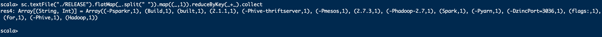

# Spark

## 产生背景


谷歌的三驾马车 hadoop hbase

Spark是一种快速、通用、可扩展的大数据分析引擎，2009年诞生于加州大学伯克利分校AMPLab，2010年开源，2013年6月成为Apache孵化项目，2014年2月成为Apache顶级项目。项目是用Scala进行编写。

目前，Spark生态系统已经发展成为一个包含多个子项目的集合，其中包含SparkSQL、Spark Streaming、GraphX、MLib、SparkR等子项目，Spark是基于内存计算的大数据并行计算框架。除了扩展了广泛使用的 MapReduce 计算模型，而且高效地支持更多计算模式，包括交互式查询和流处理。Spark 适用于各种各样原先需要多种不同的分布式平台的场景，包括批处理、迭代算法、交互式查询、流处理。通过在一个统一的框架下支持这些不同的计算，Spark 使我们可以简单而低耗地把各种处理流程整合在一起。而这样的组合，在实际的数据分析 过程中是很有意义的。不仅如此，Spark 的这种特性还大大减轻了原先需要对各种平台分 别管理的负担。 

大一统的软件栈，各个组件关系密切并且可以相互调用，这种设计有几个好处：1、软件栈中所有的程序库和高级组件 都可以从下层的改进中获益。2、运行整个软件栈的代价变小了。不需要运 行 5 到 10 套独立的软件系统了，一个机构只需要运行一套软件系统即可。系统的部署、维护、测试、支持等大大缩减。3、能够构建出无缝整合不同处理模型的应用。

Spark的内置项目如下：

 

 

**Spark Core：**实现了 Spark 的基本功能，包含任务调度、内存管理、错误恢复、与存储系统 交互等模块。Spark Core 中还包含了对弹性分布式数据集(resilient distributed dataset，简称RDD)的 API 定义。 

**Spark SQL：**是 Spark 用来操作结构化数据的程序包。通过 Spark SQL，我们可以使用 SQL 或者 Apache Hive 版本的 SQL 方言(HQL)来查询数据。Spark SQL 支持多种数据源，比 如 Hive 表、Parquet 以及 JSON 等。 

**Spark Streaming：**是 Spark 提供的对实时数据进行流式计算的组件。提供了用来操作数据流的 API，并且与 Spark Core 中的 RDD API 高度对应。 

**Spark MLlib：**提供常见的机器学习(ML)功能的程序库。包括分类、回归、聚类、协同过滤等，还提供了模型评估、数据 导入等额外的支持功能。 

**集群管理器：**Spark 设计为可以高效地在一个计算节点到数千个计算节点之间伸缩计 算。为了实现这样的要求，同时获得最大灵活性，Spark 支持在各种集群管理器(cluster manager)上运行，包括 Hadoop YARN、Apache Mesos，以及 Spark 自带的一个简易调度 器，叫作独立调度器。 

 

​    Spark得到了众多大数据公司的支持，这些公司包括Hortonworks、IBM、Intel、Cloudera、MapR、Pivotal、百度、阿里、腾讯、京东、携程、优酷土豆。当前百度的Spark已应用于凤巢、大搜索、直达号、百度大数据等业务；阿里利用GraphX构建了大规模的图计算和图挖掘系统，实现了很多生产系统的推荐算法；腾讯Spark集群达到8000台的规模，是当前已知的世界上最大的Spark集群。

## 一、Standalone模式安装

- 启动hadoop102、103、104

  

- 上传并解压spark安装包spark-2.1.1-bin-hadoop2.7.tgz到102  /opt/software/

  ```sh
  cd  /opt/software/
  tar -zxvf spark-2.1.1-bin-hadoop2.7.tgz -C /opt/module/
  
  cd /opt/module/
  mv spark-2.1.1-bin-hadoop2.7 spark
  ```

  

- 进入spark安装目录下的conf文件夹

- 修改配置文件名称

  ```sh
  mv slaves.template slaves
  
  mv spark-env.sh.template spark-env.sh
  ```

- 修改slave文件，添加work节点：

  ```sh
  vi slaves
  
  hadoop102
  
  hadoop103
  
  hadoop104
  ```

  

- 修改spark-env.sh文件，添加如下配置： 

  

  ```sh
  vi spark-env.sh
  
  SPARK_MASTER_HOST=hadoop102
  SPARK_MASTER_PORT=7077       #服务端口
  ```

  

- 分发spark包

  ```sh
  #回到module目录下
  cd /opt/module
  
  xsync spark/
  
  #查看103、104
  ```

- 启动

  ```sh
  cd /spark/sbin
  
  start-all.sh
  ```

  - 报错

    ```sh
    failed to launch: nice -n 0 /opt/module/spark/bin/spark-class org.apache.spark.deploy.worker.Worker --webui-port 8081 spark://hadoop102:7077
    hadoop103:   JAVA_HOME is not set
    
    注意：如果遇到 “JAVA_HOME not set” 异常，可以在sbin目录下的spark-config.sh 文件中加入如下配置：
    export JAVA_HOME=XXXX
    
    
    linux：
    whereis java
    which java （java执行路径）
    echo $JAVA_HOME
    
    echo $PATH
    /opt/module/jdk1.8.0_144
    #如果不好使在配置下面
    vi /root/.bashrc
    
    export JAVA_HOME=/opt/module/jdk1.8.0_144
    
    
    
    
    重启hadoop
    
    切换到hadoop下的sbin执行stop-all.sh
    
    注意每台机器都需要改
    
    
    
    ```

- jps查看

  


- hadoop102:8080

  

- 提交任务&执行程序

  ```sh
  命令介绍
  
  bin/spark-submit \       
  --class org.apache.spark.examples.SparkPi \             主类
  --master spark://hadoop102:7077 \                         master
  --executor-memory 1G \										任务的资源
  --total-executor-cores 2 \										
  ./examples/jars/spark-examples_2.11-2.1.1.jar \		jar包
  100
  
  
  这个任务式求pi的值，迭代100次
  
  ```

  

参数说明：

--master spark://hadoop102:7077 指定Master的地址

--class: 你的应用的启动类 (如 org.apache.spark.examples.SparkPi)

--deploy-mode: 是否发布你的驱动到worker节点(cluster) 或者作为一个本地客户端 (client) (default: client)*

--conf: 任意的Spark配置属性， 格式key=value. 如果值包含空格，可以加引号“key=value” 

application-jar: 打包好的应用jar,包含依赖. 这个URL在集群中全局可见。 比如hdfs:// 共享存储系统， 如果是 file:// path， 那么所有的节点的path都包含同样的jar

application-arguments: 传给main()方法的参数

--executor-memory 1G 指定每个executor可用内存为1G

--total-executor-cores 2 指定每个executor使用的cup核数为2个 

- 启动spark shell

```sh
bin/spark-shell --master spark://hadoop102:7077
```


**注意：**如果启动spark shell时没有指定master地址，但是也可以正常启动spark shell和执行spark shell中的程序，其实是启动了spark的local模式，该模式仅在本机启动一个进程，没有与集群建立联系。

Spark Shell中已经默认将SparkContext类初始化为对象sc。用户代码如果需要用到，则直接应用sc即可      sparksession  是sparksql 

```sh
scala> sc.textFile("./RELEASE").flatMap(_.split(" ")).map((_,1)).reduceByKey(_+_).collect
```



 

## 二、JobHistoryServer配置

http://192.168.83.102:4040

- 修改spark-default.conf.template名称

  ```sh
  cd /conf
  mv spark-defaults.conf.template spark-defaults.conf
  ```

- 修改spark-default.conf文件，开启Log：

  ```sh
  vi spark-defaults.conf
  
  spark.eventLog.enabled           true
  spark.eventLog.dir               hdfs://hadoop102:9000/directory 
  #directory这个文件夹需要提前创建
  
  #在hadoop102开启hdfs
  [root@hadoop102 spark]# start-dfs.sh 
  
  #分发脚本
  
  xsync conf/
  
  #访问
  hadoop102:50070
  
  #创建文件夹
  [root@hadoop102 spark]# hadoop fs -mkdir /directory
  #刷新页面，发现文件夹穿件成功
  ```

  


- 修改spark-env.sh文件，添加如下配置：

  ```sh
  vi spark-env.sh
  
  export SPARK_HISTORY_OPTS="-Dspark.history.ui.port=4000 
  -Dspark.history.retainedApplications=3 
  -Dspark.history.fs.logDirectory=hdfs://hadoop102:9000/directory"
  
  #上面注意是一行，中间有空格
  ```

  

  - 参数描述：

    spark.eventLog.dir：Application在运行过程中所有的信息均记录在该属性指定的路径下； 

    spark.history.ui.port=4000  调整WEBUI访问的端口号为4000

    spark.history.fs.logDirectory=hdfs://hadoop102:9000/directory  配置了该属性后，在start-history-server.sh时就无需再显式的指定路径，Spark History Server页面只展示该指定路径下的信息

    spark.history.retainedApplications=3   指定保存Application历史记录的个数，如果超过这个值，旧的应用程序信息将被删除，这个是内存中的应用数，而不是页面上显示的应用数。

- 分发脚本

  ```sh
  xsync spark-defaults.conf
  xsync spark-env.sh
  ```

  

- 启动历史服务

  ```sh
  cd ../
  sbin/start-history-server.sh
  
  查看历史服务
  hadoop102:4000
  ```

  

## 三、HA配置(高可用)


- zookeeper正常安装并启动

  ```sh
  #上传zookeeper
  [root@hadoop102 software]# tar -zvxf zookeeper-3.4.11.tar.gz 
  mv zookeeper-3.4.11 ../module/
  cd /opt/module/zookeeper-3.4.11/bin
  [root@hadoop102 bin]# ./zkServer.sh start
  ./zkServer.sh status
  
  
  #安装看dubbo-zookeeper里的步骤，修改conf下的zoo.cfg，目录=../data
  #之后创建data
  
  #zoo.cfg
  dataDir=../data
  dataLogDir=/home/zookeeper/logs
  clientPort=2181
  server.1=hadoop102:2888:3888
  server.2=hadoop103:2888:3888
  server.3=hadoop103:2888:3888
  
  #我这里有3台zk集群机器，每台机器都需要在/home/zookeeper/data 目录下创建一个myid的文件、并且要写上自己对应的服务id号，比如我在slave1这台机器对应的service.id是1 那么我在myid就会写上1，slave2的service.id是2 就会写上2.. 以此类推。
  
  cd data/
  
  vi myid (写上服务的id号保存退出)
  
  
  xsync zookeeper-3.4.11/
  ```

  

- 修改spark-env.sh文件添加如下配置：

  ```sh
  vi spark-env.sh
  
  注释掉如下内容：
  #SPARK_MASTER_HOST=hadoop102
  #SPARK_MASTER_PORT=7077
  添加上如下内容：
  export SPARK_DAEMON_JAVA_OPTS="
  -Dspark.deploy.recoveryMode=ZOOKEEPER 
  -Dspark.deploy.zookeeper.url=hadoop102,hadoop103,hadoop104 
  -Dspark.deploy.zookeeper.dir=/spark"
  
  #注意 也是一行
  
   xsync spark-env.sh
   
   
   #重启
   [root@hadoop102 spark]# sbin/stop-all.sh 
  
  ```

- 在hadoop102上启动全部节点

  ```sh
  sbin/start-all.sh
  ```

- 在hadoop103上单独启动master节点88

  ```sh
  sbin/start-master.sh
  ```

- spark HA集群访问

  - 也就是需要两台都有master节点
  - [http://192.168.83.102:8080/](http://192.168.83.102:8080/)
  - [http://hadoop103:8080/](http://hadoop103:8080/)

  

  

  ```sh
  /opt/module/spark/bin/spark-shell \
  --master spark://hadoop102:7077,hadoop103:7077 \   单独指定102也能
  --executor-memory 2g \
  --total-executor-cores 2
  ```

  ## Yarn模式安装

- 修改hadoop配置文件yarn-site.xml,添加如下内容

  ```sh
  cd /opt/module/hadoop-2.7.2/etc/hadoop
  vi yarn-site.xml
  <!--是否启动一个线程检查每个任务正使用的物理内存量，如果任务超出分配值，则直接将其杀掉，默认是true -->
          <property>
                  <name>yarn.nodemanager.pmem-check-enabled</name>
                  <value>false</value>
          </property>
          <!--是否启动一个线程检查每个任务正使用的虚拟内存量，如果任务超出分配值，则直接将其杀掉，默认是true -->
          <property>
                  <name>yarn.nodemanager.vmem-check-enabled</name>
                  <value>false</value>
          </property>
  ```

- 修改spark-env.sh，添加如下配置

  ```sh
  cd /opt/module/spark/conf
  
  vi spark-env.sh
  
  YARN_CONF_DIR=/opt/module/hadoop-2.7.2/etc/hadoop  
  HADOOP_CONF_DIR=/opt/module/hadoop-2.7.2/etc/hadoop
  ```

- 分发配置文件

  ```sh
  xsync /opt/module/hadoop-2.7.2/etc/hadoop/yarn-site.xml
  
  xsync spark-env.sh
  ```

- 在提交任务之前需启动HDFS以及YARN集群

  ```sh
  必须在resourcesManager节点上启动
  在103上启动
  
  start-yarn.sh
  
  ```

## 四、IDEA环境应用

### 1、在IDEA中编写WordCount程序

- 先停掉yarn，只启动standalone\hdfs

  ```sh
  #102
  stop-all.sh
  #103
  stop-yarn.sh 
  #102
  sbin/start-all.sh 
  
  ```

  

### 2、创建一个Maven项目spark-demo01并导入依赖

- pom

  

  ```xml
  <dependencies>
      <dependency>
          <groupId>org.apache.spark</groupId>
          <artifactId>spark-core_2.11</artifactId>
          <version>2.3.0</version>
      </dependency>
  </dependencies>
  
  ```

- 这里建一个父子项目

  - 先把src删掉

  - new module

    

  - pom

    ```xml
    <build>
           
            <plugins>
                <plugin>
                    <groupId>net.alchim31.maven</groupId>
                    <artifactId>scala-maven-plugin</artifactId>
                    <version>3.2.2</version>
                    <executions>
                        <execution>
                            <goals>
                                <goal>compile</goal>
                                <goal>testCompile</goal>
                            </goals>
                        </execution>
                    </executions>
                </plugin>
                <plugin>
                    <groupId>org.apache.maven.plugins</groupId>
                    <artifactId>maven-assembly-plugin</artifactId>
                    <version>3.0.0</version>
                    <configuration>
                        <archive>
                            <manifest>
                              <!--此处可修改，你的主程序类名-->
                                <mainClass>WordCount</mainClass>
                            </manifest>
                        </archive>
                        <descriptorRefs>
                            <descriptorRef>jar-with-dependencies</descriptorRef>
                        </descriptorRefs>
                    </configuration>
                    <executions>
                        <execution>
                            <id>make-assembly</id>
                            <phase>package</phase>
                            <goals>
                                <goal>single</goal>
                            </goals>
                        </execution>
                    </executions>
                </plugin>
            </plugins>
    </build>
    ```

    

- 新建scala

  ```scala
  package com.aishang
  
  import org.apache.spark.{SparkConf, SparkContext}
  
  object WordCount {
    def main(args: Array[String]): Unit = {
      //    创建配置信息
      val conf = new SparkConf().setAppName("wc")
      //    创建sparkcontext
      val sc = new SparkContext(conf)
      //    处理,读取数据
      val lines = sc.textFile(args(0))
      //    压平
      val words = lines.flatMap(_.split(" "))
      //    map(word,1)
      val k2v = words.map((_, 1))
      //    reduceByKey(word,x)
      val result = k2v.reduceByKey(_+_)
      //    保存数据
      result.saveAsTextFile(args(1))
      //    关闭连接
      sc.stop()
  
    }
  }
  
  
  ```

- 打包，放到集群上运行

  

```sh


bin/spark-submit --class com.aishang.WordCount --master spark://hadoop102:7077 ./wordcount.jar hdfs://hadoop102:9000/ab.txt hdfs://hadoop102:9000/spark1

#spark1文件夹不能存在

#此方式在实际工作中用
```


## 五、本地测试

```scala
package com.aishang

import org.apache.spark.{SparkConf, SparkContext}

object WordCount {
  def main(args: Array[String]): Unit = {
    //    创建配置信息
    val conf = new SparkConf().setAppName("wc").setMaster("local[*]")
    //    创建sparkcontext
    val sc = new SparkContext(conf)
    //    处理,读取数据
    val lines = sc.textFile("/Users/liujiang/Documents/hadoop-test-txt/one/hello.txt")
    //    压平
    val words = lines.flatMap(_.split(" "))
    //    map(word,1)
    val k2v = words.map((_, 1))
    //    reduceByKey(word,x)
    val result = k2v.reduceByKey(_+_)
    result.foreach(println)
    //    关闭连接
    sc.stop()

  }
}


```

- 直接运行程序，本地测试用

## 六、SparkCore

### 1、RDD概念 弹性分布式数据集

RDD是Spark的基石，是实现Spark数据处理的核心抽象。那么RDD为什么会产生呢？

Hadoop的MapReduce是一种基于数据集的工作模式，面向数据，这种工作模式一般是从存储上加载数据集，然后操作数据集，最后写入物理存储设备。数据更多面临的是一次性处理。

MR的这种方式对数据领域两种常见的操作不是很高效。第一种是迭代式的算法。比如机器学习中ALS、凸优化梯度下降等。这些都需要基于数据集或者数据集的衍生数据反复查询反复操作。MR这种模式不太合适，即使多MR串行处理，性能和时间也是一个问题。数据的共享依赖于磁盘。另外一种是交互式数据挖掘，MR显然不擅长。

MR中的迭代：

 

Spark中的迭代：

 

我们需要一个效率非常快，且能够支持迭代计算和有效数据共享的模型，Spark应运而生。RDD是基于工作集的工作模式，更多的是面向工作流。

但是无论是MR还是RDD都应该具有类似位置感知、容错和负载均衡等特性。

### 2、什么是RDD

RDD（Resilient Distributed Dataset）叫做分布式数据集，是Spark中最基本的数据抽象，它代表一个不可变、可分区、里面的元素可并行计算的集合。在 Spark 中，对数据的所有操作不外乎创建 RDD、转化已有RDD 以及调用 RDD 操作进行求值。每个 RDD 都被分为多个分区，这些分区运行在集群中的不同节点上。RDD 可以包含 Python、Java、Scala 中任意类型的对象， 甚至可以包含用户自定义的对象。RDD具有数据流模型的特点：自动容错、位置感知性调度和可伸缩性。RDD允许用户在执行多个查询时显式地将工作集缓存在内存中，后续的查询能够重用工作集，这极大地提升了查询速度。

RDD支持两种操作:转化操作和行动操作。RDD 的转化操作是返回一个新的 RDD的操作，比如 map()和 filter()，而行动操作则是向驱动器程序返回结果或把结果写入外部系统的操作。比如 count() 和 first()。 

Spark采用惰性计算模式，RDD只有第一次在一个行动操作中用到时，才会真正计算。Spark可以优化整个计算过程。默认情况下，Spark 的 RDD 会在你每次对它们进行行动操作时重新计算。如果想在多个行动操作中重用同一个 RDD，可以使用 RDD.persist() 让 Spark 把这个 RDD 缓存下来。

### 3、RDD的属性

- 一组分片（Partition），即数据集的基本组成单位。对于RDD来说，每个分片都会被一个计算任务处理，并决定并行计算的粒度。用户可以在创建RDD时指定RDD的分片个数，如果没有指定，那么就会采用默认值。默认值就是程序所分配到的CPU Core的数目。

-  一个计算每个分区的函数。Spark中RDD的计算是以分片为单位的，每个RDD都会实现compute函数以达到这个目的。compute函数会对迭代器进行复合，不需要保存每次计算的结果。

-  RDD之间的依赖关系。RDD的每次转换都会生成一个新的RDD，所以RDD之间就会形成类似于流水线一样的前后依赖关系。在部分分区数据丢失时，Spark可以通过这个依赖关系重新计算丢失的分区数据，而不是对RDD的所有分区进行重新计算。

-  一个Partitioner，即RDD的分片函数。当前Spark中实现了两种类型的分片函数，一个是基于哈希的HashPartitioner，另外一个是基于范围的RangePartitioner。只有对于于key-value的RDD，才会有Partitioner，非key-value的RDD的Parititioner的值是None。Partitioner函数不但决定了RDD本身的分片数量，也决定了parent RDD Shuffle输出时的分片数量。

-  一个列表，存储存取每个Partition的优先位置（preferred location）。对于一个HDFS文件来说，这个列表保存的就是每个Partition所在的块的位置。按照“移动数据不如移动计算”的理念，Spark在进行任务调度的时候，会尽可能地将计算任务分配到其所要处理数据块的存储位置。

- RDD是一个应用层面的逻辑概念。一个RDD多个分片。RDD就是一个元数据记录集，记录了RDD内存所有的关系数据。

### 4、RDD的弹性

- 自动进行内存和磁盘数据存储的切换
  - Spark优先把数据放到内存中，如果内存放不下，就会放到磁盘里面，程序进行自动的存储切换

- 基于血统的高效容错机制
  - 在RDD进行转换和动作的时候，会形成RDD的Lineage依赖链，当某一个RDD失效的时候，可以通过重新计算上游的RDD来重新生成丢失的RDD数据。

- Task如果失败会自动进行特定次数的重试
  - RDD的计算任务如果运行失败，会自动进行任务的重新计算，默认次数是4次。
- Stage如果失败会自动进行特定次数的重试
  - 如果Job的某个Stage阶段计算失败，框架也会自动进行任务的重新计算，默认次数也是4次。

- Checkpoint和Persist可主动或被动触发
  - RDD可以通过Persist持久化将RDD缓存到内存或者磁盘，当再次用到该RDD时直接读取就行。也可以将RDD进行检查点，检查点会将数据存储在HDFS中，该RDD的所有父RDD依赖都会被移除。

- 数据调度弹性
  - Spark把这个JOB执行模型抽象为通用的有向无环图DAG，可以将多Stage的任务串联或并行执行，调度引擎自动处理Stage的失败以及Task的失败。

-  数据分片的高度弹性
  - 可以根据业务的特征，动态调整数据分片的个数，提升整体的应用执行效率。

> RDD全称叫做弹性分布式数据集(Resilient Distributed Datasets)，它是一种分布式的内存抽象，表示一个只读的记录分区的集合，它只能通过其他RDD转换而创建，为此，RDD支持丰富的转换操作(如map, join, filter, groupBy等)，通过这种转换操作，新的RDD则包含了如何从其他RDDs衍生所必需的信息，所以说RDDs之间是有依赖关系的。基于RDDs之间的依赖，RDDs会形成一个有向无环图DAG，该DAG描述了整个流式计算的流程，实际执行的时候，RDD是通过血缘关系(Lineage)一气呵成的，即使出现数据分区丢失，也可以通过血缘关系重建分区，总结起来，基于RDD的流式计算任务可描述为：从稳定的物理存储(如分布式文件系统)中加载记录，记录被传入由一组确定性操作构成的DAG，然后写回稳定存储。另外RDD还可以将数据集缓存到内存中，使得在多个操作之间可以重用数据集，基于这个特点可以很方便地构建迭代型应用(图计算、机器学习等)或者交互式数据分析应用。可以说Spark最初也就是实现RDD的一个分布式系统，后面通过不断发展壮大成为现在较为完善的大数据生态系统，简单来讲，Spark-RDD的关系类似于Hadoop-MapReduce关系。

### 5、RDD特点

RDD表示只读的分区的数据集，对RDD进行改动，只能通过RDD的转换操作，由一个RDD得到一个新的RDD，新的RDD包含了从其他RDD衍生所必需的信息。RDDs之间存在依赖，RDD的执行是按照血缘关系延时计算的。如果血缘关系较长，可以通过持久化RDD来切断血缘关系。

### 6、分区

RDD逻辑上是分区的，每个分区的数据是抽象存在的，计算的时候会通过一个compute函数得到每个分区的数据。如果RDD是通过已有的文件系统构建，则compute函数是读取指定文件系统中的数据，如果RDD是通过其他RDD转换而来，则compute函数是执行转换逻辑将其他RDD的数据进行转换。


### 7、只读

如下图所示，RDD是只读的，要想改变RDD中的数据，只能在现有的RDD基础上创建新的RDD。

 

 由一个RDD转换到另一个RDD，可以通过丰富的操作算子实现，不再像MapReduce那样只能写map和reduce了，如下图所示。


 RDD的操作算子包括两类，一类叫做transformations，它是用来将RDD进行转化，构建RDD的血缘关系；另一类叫做actions，它是用来触发RDD的计算，得到RDD的相关计算结果或者将RDD保存的文件系统中。下图是RDD所支持的操作算子列表。

 

### 8、依赖

RDDs通过操作算子进行转换，转换得到的新RDD包含了从其他RDDs衍生所必需的信息，RDDs之间维护着这种血缘关系，也称之为依赖。如下图所示，依赖包括两种，一种是窄依赖，RDDs之间分区是一一对应的，另一种是宽依赖，下游RDD的每个分区与上游RDD(也称之为父RDD)的每个分区都有关，是多对多的关系。

 

通过RDDs之间的这种依赖关系，一个任务流可以描述为DAG(有向无环图)，如下图所示，在实际执行过程中宽依赖对应于Shuffle(图中的reduceByKey和join)，窄依赖中的所有转换操作可以通过类似于管道的方式一气呵成执行(图中map和union可以一起执行)。

 

### 9、**缓存**

如果在应用程序中多次使用同一个RDD，可以将该RDD缓存起来，该RDD只有在第一次计算的时候会根据血缘关系得到分区的数据，在后续其他地方用到该RDD的时候，会直接从缓存处取而不用再根据血缘关系计算，这样就加速后期的重用。如下图所示，RDD-1经过一系列的转换后得到RDD-n并保存到hdfs，RDD-1在这一过程中会有个中间结果，如果将其缓存到内存，那么在随后的RDD-1转换到RDD-m这一过程中，就不会计算其之前的RDD-0了。

 

### 10、CheckPoint

虽然RDD的血缘关系天然地可以实现容错，当RDD的某个分区数据失败或丢失，可以通过血缘关系重建。但是对于长时间迭代型应用来说，随着迭代的进行，RDDs之间的血缘关系会越来越长，一旦在后续迭代过程中出错，则需要通过非常长的血缘关系去重建，势必影响性能。为此，RDD支持checkpoint将数据保存到持久化的存储中，这样就可以切断之前的血缘关系，因为checkpoint后的RDD不需要知道它的父RDDs了，它可以从checkpoint处拿到数据。

给定一个RDD我们至少可以知道如下几点信息：

1、分区数以及分区方式；

2、由父RDDs衍生而来的相关依赖信息；

3、计算每个分区的数据，计算步骤为：

​	1）如果被缓存，则从缓存中取的分区的数据；

​	2）如果被checkpoint，则从checkpoint处恢复数据；

​	3）根据血缘关系计算分区的数据。

## 七、RDD编程

### 1、RDD创建

在Spark中创建RDD的创建方式大概可以分为三种：

- 从集合中创建RDD；
- 从外部存储创建RDD；
- 从其他RDD创建。

在hadoop102测试

```sh
[root@hadoop102 spark]# bin/spark-shell 
```


```sh
sc.makeRDD(Array(1 to 10))

#res0: org.apache.spark.rdd.RDD[scala.collection.immutable.Range.Inclusive] = ParallelCollectionRDD[0] at makeRDD at <console>:25

res0.collect
```

### 2、转换

#### map(func)

- 返回一个新的RDD，该RDD由每一个输入元素经过func函数转换后组成

```sh
scala> var source  = sc.parallelize(1 to 10)

scala> source.collect()
res7: Array[Int] = Array(1, 2, 3, 4, 5, 6, 7, 8, 9, 10)

scala> val mapadd = source.map(_ * 2)


scala> mapadd.collect()
res8: Array[Int] = Array(2, 4, 6, 8, 10, 12, 14, 16, 18, 20)
```

#### mapPartitions(func)

- 类似于map，但独立地在RDD的每一个分片上运行，因此在类型为T的RDD上运行时，func的函数类型必须是Iterator[T] => Iterator[U]。假设有N个元素，有M个分区，那么map的函数的将被调用N次,而mapPartitions被调用M次,一个函数一次处理所有分区

```sh
var r =  sc.makeRDD(Array(1,2,3,4,5))
r.map(_+1).collect
r.map((_,1))

r.map((_,1)).collect
res13: Array[(Int, Int)] = Array((1,1), (2,1), (3,1), (4,1), (5,1))

sc.parallelize(Array(1,2,3,4,5))
var rdd  = sc.parallelize(Array(1,2,3,4,5))


r.partitions.size
 rdd.mapPartitions(x=>Iterator(x.mkString("|")))
 rdd.mapPartitions(x=>Iterator(x.mkString("|"))).collect

#res23: Array[String] = Array(1|2|3|4|5)

```


####  glom

将每一个分区形成一个数组，形成新的RDD类型时RDD[Array[T]]

```sh
scala> val rdd = sc.parallelize(1 to 16,4)
rdd: org.apache.spark.rdd.RDD[Int] = ParallelCollectionRDD[65] at parallelize at <console>:24

scala> rdd.glom().collect()
res25: Array[Array[Int]] = Array(Array(1, 2, 3, 4), Array(5, 6, 7, 8), Array(9, 10, 11, 12), Array(13, 14, 15, 16))
```

#### flatMap(func)

类似于map，但是每一个输入元素可以被映射为0或多个输出元素（所以func应该返回一个序列，而不是单一元素）

```sh
scala> val sourceFlat = sc.parallelize(1 to 5)
sourceFlat: org.apache.spark.rdd.RDD[Int] = ParallelCollectionRDD[12] at parallelize at <console>:24

scala> sourceFlat.collect()
res11: Array[Int] = Array(1, 2, 3, 4, 5)

scala> val flatMap = sourceFlat.flatMap(1 to _)
flatMap: org.apache.spark.rdd.RDD[Int] = MapPartitionsRDD[13] at flatMap at <console>:26

scala> flatMap.collect()
res12: Array[Int] = Array(1, 1, 2, 1, 2, 3, 1, 2, 3, 4, 1, 2, 3, 4, 5)
#相当于从1到1，从1到2，从1到3
```

#### filter(func)

返回一个新的RDD，该RDD由经过func函数计算后返回值为true的输入元素组成

```sh
scala> var sourceFilter = sc.parallelize(Array("xiaoming","xiaojiang","xiaohe","dazhi"))
sourceFilter: org.apache.spark.rdd.RDD[String] = ParallelCollectionRDD[10] at parallelize at <console>:24

scala> val filter = sourceFilter.filter(_.contains("xiao"))
filter: org.apache.spark.rdd.RDD[String] = MapPartitionsRDD[11] at filter at <console>:26

scala> sourceFilter.collect()
res9: Array[String] = Array(xiaoming, xiaojiang, xiaohe, dazhi)

scala> filter.collect()
res10: Array[String] = Array(xiaoming, xiaojiang, xiaohe)
```

#### mapPartitionsWithIndex(func)

类似于mapPartitions，但func带有一个整数参数表示分片的索引值，因此在类型为T的RDD上运行时，func的函数类型必须是(Int, Interator[T]) => Iterator[U]

```sh
scala> val rdd = sc.parallelize(List(("kpop","female"),("zorro","male"),("mobin","male"),("lucy","female")))
rdd: org.apache.spark.rdd.RDD[(String, String)] = ParallelCollectionRDD[18] at parallelize at <console>:24

scala> :paste
// Entering paste mode (ctrl-D to finish)
def partitionsFun(index : Int, iter : Iterator[(String,String)]) : Iterator[String] = {
  var woman = List[String]()
  while (iter.hasNext){
    val next = iter.next()
    next match {
       case (_,"female") => woman = "["+index+"]"+next._1 :: woman
       case _ =>
    }
  }
  woman.iterator
}
// Exiting paste mode, now interpreting.

partitionsFun: (index: Int, iter: Iterator[(String, String)])Iterator[String]

scala> val result = rdd.mapPartitionsWithIndex(partitionsFun)
result: org.apache.spark.rdd.RDD[String] = MapPartitionsRDD[19] at mapPartitionsWithIndex at <console>:28

scala> result.collect()
res14: Array[String] = Array([0]kpop, [3]lucy)
```

#### sample(withReplacement, fraction, seed)

以指定的随机种子随机抽样出数量为fraction的数据，withReplacement表示是抽出的数据是否放回，true为有放回的抽样，false为无放回的抽样，seed用于指定随机数生成器种子。例子从RDD中随机且有放回的抽出50%的数据，随机种子值为3（即可能以1 2 3的其中一个起始值）

```sh
scala> val rdd = sc.parallelize(1 to 10)
rdd: org.apache.spark.rdd.RDD[Int] = ParallelCollectionRDD[20] at parallelize at <console>:24

scala> rdd.collect()
res15: Array[Int] = Array(1, 2, 3, 4, 5, 6, 7, 8, 9, 10)

scala> var sample1 = rdd.sample(true,0.4,2)
sample1: org.apache.spark.rdd.RDD[Int] = PartitionwiseSampledRDD[21] at sample at <console>:26

scala> sample1.collect()
res16: Array[Int] = Array(1, 2, 2, 7, 7, 8, 9)

scala> var sample2 = rdd.sample(false,0.2,3)
sample2: org.apache.spark.rdd.RDD[Int] = PartitionwiseSampledRDD[22] at sample at <console>:26

scala> sample2.collect()
res17: Array[Int] = Array(1, 9)
```

#### distinct([numTasks]))

对源RDD进行去重后返回一个新的RDD. 默认情况下，只有8个并行任务来操作，但是可以传入一个可选的numTasks参数改变它。

```sh
scala> val distinctRdd = sc.parallelize(List(1,2,1,5,2,9,6,1))
distinctRdd: org.apache.spark.rdd.RDD[Int] = ParallelCollectionRDD[34] at parallelize at <console>:24

scala> val unionRDD = distinctRdd.distinct()
unionRDD: org.apache.spark.rdd.RDD[Int] = MapPartitionsRDD[37] at distinct at <console>:26

scala> unionRDD.collect()
[Stage 16:> (0 + 4) [Stage 16:=============================>                            (2 + 2)                                                                             res20: Array[Int] = Array(1, 9, 5, 6, 2)

scala> val unionRDD = distinctRdd.distinct(2)
unionRDD: org.apache.spark.rdd.RDD[Int] = MapPartitionsRDD[40] at distinct at <console>:26

scala> unionRDD.collect()
res21: Array[Int] = Array(6, 2, 1, 9, 5)
```

#### partitionBy

对RDD进行分区操作，如果原有的partionRDD和现有的partionRDD是一致的话就不进行分区， 否则会生成ShuffleRDD

```sh
scala> val rdd = sc.parallelize(Array((1,"aaa"),(2,"bbb"),(3,"ccc"),(4,"ddd")),4)
rdd: org.apache.spark.rdd.RDD[(Int, String)] = ParallelCollectionRDD[44] at parallelize at <console>:24

scala> rdd.partitions.size
res24: Int = 4

scala> var rdd2 = rdd.partitionBy(new org.apache.spark.HashPartitioner(2))
rdd2: org.apache.spark.rdd.RDD[(Int, String)] = ShuffledRDD[45] at partitionBy at <console>:26

scala> rdd2.partitions.size
res25: Int = 2
```

#### coalesce(numPartitions)

缩减分区数，用于大数据集过滤后，提高小数据集的执行效率

```sh
scala> val rdd = sc.parallelize(1 to 16,4)
rdd: org.apache.spark.rdd.RDD[Int] = ParallelCollectionRDD[54] at parallelize at <console>:24

scala> rdd.partitions.size
res20: Int = 4

scala> val coalesceRDD = rdd.coalesce(3)
coalesceRDD: org.apache.spark.rdd.RDD[Int] = CoalescedRDD[55] at coalesce at <console>:26

scala> coalesceRDD.partitions.size
res21: Int = 3
```

#### repartition(numPartitions)

根据分区数，从新通过网络随机洗牌所有数据

```sh
scala> val rdd = sc.parallelize(1 to 16,4)
rdd: org.apache.spark.rdd.RDD[Int] = ParallelCollectionRDD[56] at parallelize at <console>:24

scala> rdd.partitions.size
res22: Int = 4

scala> val rerdd = rdd.repartition(2)
rerdd: org.apache.spark.rdd.RDD[Int] = MapPartitionsRDD[60] at repartition at <console>:26

scala> rerdd.partitions.size
res23: Int = 2

scala> val rerdd = rdd.repartition(4)
rerdd: org.apache.spark.rdd.RDD[Int] = MapPartitionsRDD[64] at repartition at <console>:26

scala> rerdd.partitions.size
res24: Int = 4
```

#### repartitionAndSortWithinPartitions(partitioner)

repartitionAndSortWithinPartitions函数是repartition函数的变种，与repartition函数不同的是，repartitionAndSortWithinPartitions在给定的partitioner内部进行排序，性能比repartition要高

#### sortBy(func,[ascending], [numTasks])

用func先对数据进行处理，按照处理后的数据比较结果排序。

```sh
scala> val rdd = sc.parallelize(List(1,2,3,4))
rdd: org.apache.spark.rdd.RDD[Int] = ParallelCollectionRDD[21] at parallelize at <console>:24

scala> rdd.sortBy(x => x).collect()
res11: Array[Int] = Array(1, 2, 3, 4)

scala> rdd.sortBy(x => x%3).collect()
res12: Array[Int] = Array(3, 4, 1, 2)
```

#### union(otherDataset)

对源RDD和参数RDD求并集后返回一个新的RDD  不去重

```sh
scala> val rdd1 = sc.parallelize(1 to 5)
rdd1: org.apache.spark.rdd.RDD[Int] = ParallelCollectionRDD[23] at parallelize at <console>:24

scala> val rdd2 = sc.parallelize(5 to 10)
rdd2: org.apache.spark.rdd.RDD[Int] = ParallelCollectionRDD[24] at parallelize at <console>:24

scala> val rdd3 = rdd1.union(rdd2)
rdd3: org.apache.spark.rdd.RDD[Int] = UnionRDD[25] at union at <console>:28

scala> rdd3.collect()
res18: Array[Int] = Array(1, 2, 3, 4, 5, 5, 6, 7, 8, 9, 10)
```

#### subtract (otherDataset)

计算差的一种函数，去除两个RDD中相同的元素，不同的RDD将保留下来

```sh
scala> val rdd = sc.parallelize(3 to 8)
rdd: org.apache.spark.rdd.RDD[Int] = ParallelCollectionRDD[70] at parallelize at <console>:24

scala> val rdd1 = sc.parallelize(1 to 5)
rdd1: org.apache.spark.rdd.RDD[Int] = ParallelCollectionRDD[71] at parallelize at <console>:24

scala> rdd.subtract(rdd1).collect()
res27: Array[Int] = Array(8, 6, 7)
```

#### intersection(otherDataset)

对源RDD和参数RDD求交集后返回一个新的RDD

```sh
scala> val rdd1 = sc.parallelize(1 to 7)
rdd1: org.apache.spark.rdd.RDD[Int] = ParallelCollectionRDD[26] at parallelize at <console>:24

scala> val rdd2 = sc.parallelize(5 to 10)
rdd2: org.apache.spark.rdd.RDD[Int] = ParallelCollectionRDD[27] at parallelize at <console>:24

scala> val rdd3 = rdd1.intersection(rdd2)
rdd3: org.apache.spark.rdd.RDD[Int] = MapPartitionsRDD[33] at intersection at <console>:28

scala> rdd3.collect()
res19: Array[Int] = Array(5, 6, 7)
```

#### cartesian(otherDataset)

笛卡尔积

```sh
scala> val rdd1 = sc.parallelize(1 to 3)
rdd1: org.apache.spark.rdd.RDD[Int] = ParallelCollectionRDD[47] at parallelize at <console>:24

scala> val rdd2 = sc.parallelize(2 to 5)
rdd2: org.apache.spark.rdd.RDD[Int] = ParallelCollectionRDD[48] at parallelize at <console>:24

scala> rdd1.cartesian(rdd2).collect()
res17: Array[(Int, Int)] = Array((1,2), (1,3), (1,4), (1,5), (2,2), (2,3), (2,4), (2,5), (3,2), (3,3), (3,4), (3,5))
```

#### pipe(command, [envVars])

管道，对于每个分区，都执行一个perl或者shell脚本，返回输出的RDD

```sh
Shell脚本
#!/bin/sh
echo "AA"
while read LINE; do
   echo ">>>"${LINE}
done
scala> val rdd = sc.parallelize(List("hi","Hello","how","are","you"),1)
rdd: org.apache.spark.rdd.RDD[String] = ParallelCollectionRDD[50] at parallelize at <console>:24

scala> rdd.pipe("/home/bigdata/pipe.sh").collect()
res18: Array[String] = Array(AA, >>>hi, >>>Hello, >>>how, >>>are, >>>you)

scala> val rdd = sc.parallelize(List("hi","Hello","how","are","you"),2)
rdd: org.apache.spark.rdd.RDD[String] = ParallelCollectionRDD[52] at parallelize at <console>:24

scala> rdd.pipe("/home/bigdata/pipe.sh").collect()
res19: Array[String] = Array(AA, >>>hi, >>>Hello, AA, >>>how, >>>are, >>>you)

pipe.sh:
#!/bin/sh
echo "AA"
while read LINE; do
   echo ">>>"${LINE}
done
```

####  join(otherDataset, [numTasks])

在类型为(K,V)和(K,W)的RDD上调用，返回一个相同key对应的所有元素对在一起的(K,(V,W))的RDD

```sh
scala> val rdd = sc.parallelize(Array((1,"a"),(2,"b"),(3,"c")))
rdd: org.apache.spark.rdd.RDD[(Int, String)] = ParallelCollectionRDD[32] at parallelize at <console>:24

scala> val rdd1 = sc.parallelize(Array((1,4),(2,5),(3,6)))
rdd1: org.apache.spark.rdd.RDD[(Int, Int)] = ParallelCollectionRDD[33] at parallelize at <console>:24

scala> rdd.join(rdd1).collect()
res13: Array[(Int, (String, Int))] = Array((1,(a,4)), (2,(b,5)), (3,(c,6)))
```

####  cogroup(otherDataset, [numTasks])

在类型为(K,V)和(K,W)的RDD上调用，返回一个(K,(Iterable<V>,Iterable<W>))类型的RDD

```sh
scala> val rdd = sc.parallelize(Array((1,"a"),(2,"b"),(3,"c")))
rdd: org.apache.spark.rdd.RDD[(Int, String)] = ParallelCollectionRDD[37] at parallelize at <console>:24

scala> val rdd1 = sc.parallelize(Array((1,4),(2,5),(3,6)))
rdd1: org.apache.spark.rdd.RDD[(Int, Int)] = ParallelCollectionRDD[38] at parallelize at <console>:24

scala> rdd.cogroup(rdd1).collect()
res14: Array[(Int, (Iterable[String], Iterable[Int]))] = Array((1,(CompactBuffer(a),CompactBuffer(4))), (2,(CompactBuffer(b),CompactBuffer(5))), (3,(CompactBuffer(c),CompactBuffer(6))))

scala> val rdd2 = sc.parallelize(Array((4,4),(2,5),(3,6)))
rdd2: org.apache.spark.rdd.RDD[(Int, Int)] = ParallelCollectionRDD[41] at parallelize at <console>:24

scala> rdd.cogroup(rdd2).collect()
res15: Array[(Int, (Iterable[String], Iterable[Int]))] = Array((4,(CompactBuffer(),CompactBuffer(4))), (1,(CompactBuffer(a),CompactBuffer())), (2,(CompactBuffer(b),CompactBuffer(5))), (3,(CompactBuffer(c),CompactBuffer(6))))

scala> val rdd3 = sc.parallelize(Array((1,"a"),(1,"d"),(2,"b"),(3,"c")))
rdd3: org.apache.spark.rdd.RDD[(Int, String)] = ParallelCollectionRDD[44] at parallelize at <console>:24

scala> rdd3.cogroup(rdd2).collect()
[Stage 36:>                                                         (0 + 0)                                                                             res16: Array[(Int, (Iterable[String], Iterable[Int]))] = Array((4,(CompactBuffer(),CompactBuffer(4))), (1,(CompactBuffer(d, a),CompactBuffer())), (2,(CompactBuffer(b),CompactBuffer(5))), (3,(CompactBuffer(c),CompactBuffer(6))))
```

#### reduceByKey(func, [numTasks])

在一个(K,V)的RDD上调用，返回一个(K,V)的RDD，使用指定的reduce函数，将相同key的值聚合到一起，reduce任务的个数可以通过第二个可选的参数来设置

```sh
scala> val rdd = sc.parallelize(List(("female",1),("male",5),("female",5),("male",2)))
rdd: org.apache.spark.rdd.RDD[(String, Int)] = ParallelCollectionRDD[46] at parallelize at <console>:24

scala> val reduce = rdd.reduceByKey((x,y) => x+y)
reduce: org.apache.spark.rdd.RDD[(String, Int)] = ShuffledRDD[47] at reduceByKey at <console>:26

scala> reduce.collect()
res29: Array[(String, Int)] = Array((female,6), (male,7))
```


#### groupByKey

groupByKey也是对每个key进行操作，但只生成一个sequence

```sh
scala> val words = Array("one", "two", "two", "three", "three", "three")
words: Array[String] = Array(one, two, two, three, three, three)

scala> val wordPairsRDD = sc.parallelize(words).map(word => (word, 1))
wordPairsRDD: org.apache.spark.rdd.RDD[(String, Int)] = MapPartitionsRDD[4] at map at <console>:26

scala> val group = wordPairsRDD.groupByKey()
group: org.apache.spark.rdd.RDD[(String, Iterable[Int])] = ShuffledRDD[5] at groupByKey at <console>:28

scala> group.collect()
res1: Array[(String, Iterable[Int])] = Array((two,CompactBuffer(1, 1)), (one,CompactBuffer(1)), (three,CompactBuffer(1, 1, 1)))

scala> group.map(t => (t._1, t._2.sum))
res2: org.apache.spark.rdd.RDD[(String, Int)] = MapPartitionsRDD[6] at map at <console>:31

scala> res2.collect()
res3: Array[(String, Int)] = Array((two,2), (one,1), (three,3))

scala> val map = group.map(t => (t._1, t._2.sum))
map: org.apache.spark.rdd.RDD[(String, Int)] = MapPartitionsRDD[7] at map at <console>:30

scala> map.collect()
res4: Array[(String, Int)] = Array((two,2), (one,1), (three,3))
```


#### combineByKey[C]

(  createCombiner: V => C,  mergeValue: (C, V) => C,  mergeCombiners: (C, C) => C) 

对相同K，把V合并成一个集合。

createCombiner: combineByKey() 会遍历分区中的所有元素，因此每个元素的键要么还没有遇到过，要么就 和之前的某个元素的键相同。如果这是一个新的元素,combineByKey() 会使用一个叫作 createCombiner() 的函数来创建 
那个键对应的累加器的初始值

mergeValue: 如果这是一个在处理当前分区之前已经遇到的键， 它会使用 mergeValue() 方法将该键的累加器对应的当前值与这个新的值进行合并

mergeCombiners: 由于每个分区都是独立处理的， 因此对于同一个键可以有多个累加器。如果有两个或者更多的分区都有对应同一个键的累加器， 就需要使用用户提供的 mergeCombiners() 方法将各个分区的结果进行合并。

```sh
scala> val scores = Array(("Fred", 88), ("Fred", 95), ("Fred", 91), ("Wilma", 93), ("Wilma", 95), ("Wilma", 98))
scores: Array[(String, Int)] = Array((Fred,88), (Fred,95), (Fred,91), (Wilma,93), (Wilma,95), (Wilma,98))

scala> val input = sc.parallelize(scores)
input: org.apache.spark.rdd.RDD[(String, Int)] = ParallelCollectionRDD[52] at parallelize at <console>:26

scala> val combine = input.combineByKey(
     |     (v)=>(v,1),
     |     (acc:(Int,Int),v)=>(acc._1+v,acc._2+1),
     |     (acc1:(Int,Int),acc2:(Int,Int))=>(acc1._1+acc2._1,acc1._2+acc2._2))
combine: org.apache.spark.rdd.RDD[(String, (Int, Int))] = ShuffledRDD[53] at combineByKey at <console>:28

scala> val result = combine.map{
     |     case (key,value) => (key,value._1/value._2.toDouble)}
result: org.apache.spark.rdd.RDD[(String, Double)] = MapPartitionsRDD[54] at map at <console>:30

scala> result.collect()
res33: Array[(String, Double)] = Array((Wilma,95.33333333333333), (Fred,91.33333333333333))
```

####  aggregateByKey

(zeroValue:U,[partitioner: Partitioner]) (seqOp: (U, V) => U,combOp: (U, U) => U) 

在kv对的RDD中，，按key将value进行分组合并，合并时，将每个value和初始值作为seq函数的参数，进行计算，返回的结果作为一个新的kv对，然后再将结果按照key进行合并，最后将每个分组的value传递给combine函数进行计算（先将前两个value进行计算，将返回结果和下一个value传给combine函数，以此类推），将key与计算结果作为一个新的kv对输出。

seqOp函数用于在每一个分区中用初始值逐步迭代value，combOp函数用于合并每个分区中的结果。

```sh
scala> val rdd = sc.parallelize(List((1,3),(1,2),(1,4),(2,3),(3,6),(3,8)),3)
rdd: org.apache.spark.rdd.RDD[(Int, Int)] = ParallelCollectionRDD[12] at parallelize at <console>:24

scala> val agg = rdd.aggregateByKey(0)(math.max(_,_),_+_)
agg: org.apache.spark.rdd.RDD[(Int, Int)] = ShuffledRDD[13] at aggregateByKey at <console>:26

scala> agg.collect()
res7: Array[(Int, Int)] = Array((3,8), (1,7), (2,3))

scala> agg.partitions.size
res8: Int = 3

scala> val rdd = sc.parallelize(List((1,3),(1,2),(1,4),(2,3),(3,6),(3,8)),1)
rdd: org.apache.spark.rdd.RDD[(Int, Int)] = ParallelCollectionRDD[10] at parallelize at <console>:24

scala> val agg = rdd.aggregateByKey(0)(math.max(_,_),_+_).collect()
agg: Array[(Int, Int)] = Array((1,4), (3,8), (2,3))
```

#### foldByKey

(zeroValue: V)(func: (V, V) => V): RDD[(K, V)] 

aggregateByKey的简化操作，seqop和combop相同

```sh
scala> val rdd = sc.parallelize(List((1,3),(1,2),(1,4),(2,3),(3,6),(3,8)),3)
rdd: org.apache.spark.rdd.RDD[(Int, Int)] = ParallelCollectionRDD[91] at parallelize at <console>:24

scala> val agg = rdd.foldByKey(0)(_+_)
agg: org.apache.spark.rdd.RDD[(Int, Int)] = ShuffledRDD[92] at foldByKey at <console>:26

scala> agg.collect()
res61: Array[(Int, Int)] = Array((3,14), (1,9), (2,3))
```

#### sortByKey([ascending], [numTasks])

在一个(K,V)的RDD上调用，K必须实现Ordered接口，返回一个按照key进行排序的(K,V)的RDD

```sh
scala> val rdd = sc.parallelize(Array((3,"aa"),(6,"cc"),(2,"bb"),(1,"dd")))
rdd: org.apache.spark.rdd.RDD[(Int, String)] = ParallelCollectionRDD[14] at parallelize at <console>:24

scala> rdd.sortByKey(true).collect()
res9: Array[(Int, String)] = Array((1,dd), (2,bb), (3,aa), (6,cc))

scala> rdd.sortByKey(false).collect()
res10: Array[(Int, String)] = Array((6,cc), (3,aa), (2,bb), (1,dd))
```

#### mapValues

针对于(K,V)形式的类型只对V进行操作

```sh
scala> val rdd3 = sc.parallelize(Array((1,"a"),(1,"d"),(2,"b"),(3,"c")))
rdd3: org.apache.spark.rdd.RDD[(Int, String)] = ParallelCollectionRDD[67] at parallelize at <console>:24

scala> rdd3.mapValues(_+"|||").collect()
res26: Array[(Int, String)] = Array((1,a|||), (1,d|||), (2,b|||), (3,c|||))
```

### 3、Action

#### reduce(func)

通过func函数聚集RDD中的所有元素，这个功能必须是可交换且可并联的

```sh
scala> val rdd1 = sc.makeRDD(1 to 10,2)
rdd1: org.apache.spark.rdd.RDD[Int] = ParallelCollectionRDD[85] at makeRDD at <console>:24

scala> rdd1.reduce(_+_)
res50: Int = 55

scala> val rdd2 = sc.makeRDD(Array(("a",1),("a",3),("c",3),("d",5)))
rdd2: org.apache.spark.rdd.RDD[(String, Int)] = ParallelCollectionRDD[86] at makeRDD at <console>:24

scala> rdd2.reduce((x,y)=>(x._1 + y._1,x._2 + y._2))
res51: (String, Int) = (adca,12)
```

#### collect()

在驱动程序中，以数组的形式返回数据集的所有元素

#### count()

返回RDD的元素个数

#### first()

返回RDD的第一个元素（类似于take(1)）

#### take(n)

返回一个由数据集的前n个元素组成的数组

#### takeSample(withReplacement,num, [seed])

返回一个数组，该数组由从数据集中随机采样的num个元素组成，可以选择是否用随机数替换不足的部分，seed用于指定随机数生成器种子

#### takeOrdered(n)

返回前几个的排序

#### aggregate

(zeroValue: U)(seqOp: (U, T) ⇒ U, combOp: (U, U) ⇒ U)

aggregate函数将每个分区里面的元素通过seqOp和初始值进行聚合，然后用combine函数将每个分区的结果和初始值(zeroValue)进行combine操作。这个函数最终返回的类型不需要和RDD中元素类型一致。

```sh
scala> var rdd1 = sc.makeRDD(1 to 10,2)
rdd1: org.apache.spark.rdd.RDD[Int] = ParallelCollectionRDD[88] at makeRDD at <console>:24

scala> rdd1.aggregate(1)(
     | {(x : Int,y : Int) => x + y},
     | {(a : Int,b : Int) => a + b}
     | )
res56: Int = 58

scala> rdd1.aggregate(1)(
     | {(x : Int,y : Int) => x * y},
     | {(a : Int,b : Int) => a + b}
     | )
res57: Int = 30361
```

#### fold(num)(func)

折叠操作，aggregate的简化操作，seqop和combop一样。

```sh
scala> var rdd1 = sc.makeRDD(1 to 4,2)
rdd1: org.apache.spark.rdd.RDD[Int] = ParallelCollectionRDD[90] at makeRDD at <console>:24

scala> rdd1.aggregate(1)(
     | {(x : Int,y : Int) => x + y},
     | {(a : Int,b : Int) => a + b}
     | )
res59: Int = 13

scala> rdd1.fold(1)(_+_)
res60: Int = 13
```

####  saveAsTextFile(path)

将数据集的元素以textfile的形式保存到HDFS文件系统或者其他支持的文件系统，对于每个元素，Spark将会调用toString方法，将它装换为文件中的文本

#### saveAsSequenceFile(path)

将数据集中的元素以Hadoop sequencefile的格式保存到指定的目录下，可以使HDFS或者其他Hadoop支持的文件系统。

#### saveAsObjectFile(path)

用于将RDD中的元素序列化成对象，存储到文件中。

#### countByKey()

针对(K,V)类型的RDD，返回一个(K,Int)的map，表示每一个key对应的元素个数。

```sh
scala> val rdd = sc.parallelize(List((1,3),(1,2),(1,4),(2,3),(3,6),(3,8)),3)
rdd: org.apache.spark.rdd.RDD[(Int, Int)] = ParallelCollectionRDD[95] at parallelize at <console>:24

scala> rdd.countByKey()
res63: scala.collection.Map[Int,Long] = Map(3 -> 2, 1 -> 3, 2 -> 1)
```

####  foreach(func)

在数据集的每一个元素上，运行函数func进行更新。

```sh
scala> var rdd = sc.makeRDD(1 to 10,2)
rdd: org.apache.spark.rdd.RDD[Int] = ParallelCollectionRDD[107] at makeRDD at <console>:24

scala> var sum = sc.accumulator(0)
warning: there were two deprecation warnings; re-run with -deprecation for details
sum: org.apache.spark.Accumulator[Int] = 0

scala> rdd.foreach(sum+=_)

scala> sum.value
res68: Int = 55

scala> rdd.collect().foreach(println)
1
2
3
4
5
6
7
8
9
10
```

###  4、累加器

```scala
import org.apache.spark.{SparkConf, SparkContext}

object CountTest {
  def main(args: Array[String]): Unit = {
    val sparkConf = new SparkConf().setAppName("TopN").setMaster("local[*]")
    val sc = new SparkContext(sparkConf)


    val rdd = sc.makeRDD(Array(1, 2, 3))
    var sum = 0
    rdd.foreach(x => {
      sum = sum + 1
      println("sum=" + sum)
      /*
      sum=1
      sum=1
      sum=1
       */
    })
    println(sum)//0
    sc.stop()
  }
}


  val rdd = sc.makeRDD(Array(1, 2, 3))
    val sum = sc.accumulator(0)
    rdd.foreach(x=>sum+=2)
    println(sum)//6
    sc.stop()
```

- 自定义累加器

```scala
import java.util
 
import org.apache.spark.util.AccumulatorV2
 
class LogAccumulator extends AccumulatorV2[String, java.util.Set[String]] {
  private val _logArray: java.util.Set[String] = new java.util.HashSet[String]()
 
  override def isZero: Boolean = {
    _logArray.isEmpty
  }
 
  override def reset(): Unit = {
    _logArray.clear()
  }
 
  override def add(v: String): Unit = {
    _logArray.add(v)
  }
 
  override def merge(other: AccumulatorV2[String, java.util.Set[String]]): Unit = {
    other match {
      case o: LogAccumulator => _logArray.addAll(o.value)
    }
 
  }
 
  override def value: java.util.Set[String] = {
    java.util.Collections.unmodifiableSet(_logArray)
  }
 
  override def copy(): AccumulatorV2[String, util.Set[String]] = {
    val newAcc = new LogAccumulator()
    _logArray.synchronized{
      newAcc._logArray.addAll(_logArray)
    }
    newAcc
  }
}
```


### 5、foldLeft

```scala
val lst = List(20,30,60,90)
    //0为初始值，b表示返回结果对象（迭代值），a表示lst集合中的每个值
    val rs = lst.foldLeft(0)((b,a)=>{
      b+a
    })


运行过程为：b=0+a，即0+20=20
b=20+a，即20+30=50
b=50+a，即50+60=110
b=110+a，即110+90=200
此处的a为循环取出集合中的值
最终结果: rs=200

override def merge(other:AccumulatorV2[String,mutable.HashMap[String,Int]]): Unit = {
    other match {
      case  acc:SessionStatAccumulator=>
        acc.countMap.foldLeft(this.countMap){
            //map是迭代的值，(k,v)是集合里的值
          case (map,(k,v))=>map+=(k->(map.getOrElse(k,0)+v))
        }
    }
  }
```

```scala
import commons.utils.DateUtils

object Demo {
  def main(args: Array[String]): Unit = {
    //合并两个Map集合对象（将两个对应KEY的值累加）
    val m1 = Map(
      "a"->1,
      "b"->2,
      "c"->3
    )
    val m2 = Map(
      "x"->10,
      "a"->20,
      "z"->30
    )
    //Map的折叠函数是依次传入Map的键值对。所以操作函数希望传入的操作数可以是（K,V）形式。。于是用case表达式：(map, (k,v))
    var rdd = m2.foldLeft(m1){
      case (map, (k,v)) => map + ( k -> (v + map.getOrElse(k, 0)) )
    }

    print(rdd)//Map(x -> 10, a -> 21, b -> 2, c -> 3, z -> 30)

  }
}

```


```scala
import org.apache.spark.util.AccumulatorV2

import scala.collection.mutable

class SessionStatAccumulator extends AccumulatorV2[String,mutable.HashMap[String,Int]]{
  val countMap = new mutable.HashMap[String,Int]()
  override def isZero: Boolean = countMap.isEmpty

  override def copy(): AccumulatorV2[String,mutable.HashMap[String,Int]] = {
    val acc = new SessionStatAccumulator

    acc.countMap++=this.countMap  //往map集合里追加map集合
    acc
  }

  override def reset(): Unit = {
    countMap.clear()
  }

  override def add(v: String): Unit = {
    if(!countMap.contains(v)){
      countMap+=(v->0)
    }

    countMap.update(v,countMap(v)+1)
  }

  override def merge(other:AccumulatorV2[String,mutable.HashMap[String,Int]]): Unit = {
    other match {
      case  acc:SessionStatAccumulator=>
        acc.countMap.foldLeft(this.countMap){
          case (map,(k,v))=>map+=(k->(map.getOrElse(k,0)+v))
        }
    }
  }

  override def value: mutable.HashMap[String,Int] = {
    this.countMap
  }
}

```


## 八、spark sql

pom

```xml
  <dependency>
            <groupId>org.apache.spark</groupId>
            <artifactId>spark-sql_2.11</artifactId>
            <version>2.3.0</version>
        </dependency>
```

```scala
import org.apache.spark.{SparkConf, SparkContext}
import org.apache.spark.sql.SparkSession

object HelloWorld {
  def main(args: Array[String]): Unit = {
    val sparkConf = new SparkConf().setAppName("HelloWorld").setMaster("local[*]")
//    获取sparksession
    val spark = SparkSession.builder().config(sparkConf).getOrCreate()
    val df = spark.read.json("/Users/liujiang/Documents/hadoop-test-txt/people.json")
//    df.show()
//    df.select("name").show()
    df.createTempView("people")
    spark.sql("select * from people").show()
    spark.close()
  }
}

```


```scala
import org.apache.spark.sql.SparkSession
import org.apache.spark.{SparkConf, SparkContext}

object Phone {
  def main(args: Array[String]): Unit = {
    val sparkConf = new SparkConf().setAppName("HelloWorld").setMaster("local[*]")
    //    获取sparksession
    val spark = SparkSession.builder().config(sparkConf).getOrCreate()
    import spark.implicits._
    val rdd = spark.read.textFile("/Users/liujiang/Documents/hadoop-test-txt/two/phone.txt")
    //    df.createTempView("phone")
    //    spark.sql("select * from phone").show()
    //
    //    spark.close()


    //    rdd->df
    val df = rdd.map(x => {
      val p = x.split(",")
      Phone(p(0).toInt, p(1), p(2), p(3), p(4).toInt, p(5).toInt, p(6).toInt)
    }).toDF

    df.createTempView("phone")
    spark.sql("select * from phone").show()
    spark.close()
  }
}

case class Phone(id: Int, phone: String, ip: String, com: String, num1: Int, num2: Int, status: Int)
```


```scala
import org.apache.spark.SparkConf
import org.apache.spark.sql.SparkSession

object Kuaidi100 {
  def main(args: Array[String]): Unit = {
    val sparkConf = new SparkConf().setAppName("HelloWorld").setMaster("local[*]")
    //    获取sparksession
    val spark = SparkSession.builder().config(sparkConf).getOrCreate()
    import spark.implicits._
    val rdd = spark.read.json("/Users/liujiang/Documents/hadoop-test-txt/kuaidi100.json")
    rdd.createTempView("kuaidi")

    spark.sql("select * from kuaidi").show()
    spark.close()
  }
}

```


### UDF

```scala
spark.udf.register("strLen", (str: String) => str.length())

spark.sql("select name,strLen(name) as name_len from user").show
```

### UDAF

#### **1.** **弱类型** **UDAF** **函数**

```scala
/**
  * 用户自定义聚合函数
  */
class GroupConcatDistinctUDAF extends UserDefinedAggregateFunction {

  /**
    * 聚合函数输入参数的数据类型
    */
  override def inputSchema: StructType = StructType(StructField("cityInfo", StringType) :: Nil)

  /**
    *聚合缓冲区中值的类型
    *中间进行聚合时所处理的数据类型
    */
  override def bufferSchema: StructType = StructType(StructField("bufferCityInfo", StringType) :: Nil)

  /**
    *函数返回值的数据类型
    */
  override def dataType: DataType = StringType

  /**
    *一致性检验，如果为 true，那么输入不变的情况下计算的结果也是不变的
    */
  override def deterministic: Boolean = true

  /**
    *设置聚合中间 buffer 的初始值
    *需要保证这个语义：两个初始 buffer 调用下面实现的 merge 方法后也应该为初始 buffer 即如果你初始值是
1，然后你 merge 是执行一个相加的动作，两个初始 buffer 合并之后等于 2，不会等于初始 buffer 了。这样的初始值就是有问题的，所以初始值也叫"zero value"
    */
  override def initialize(buffer: MutableAggregationBuffer): Unit = { buffer(0)= ""
  }

  /**
    *用输入数据 input 更新 buffer 值,类似于 combineByKey
    */
  override def update(buffer: MutableAggregationBuffer, input: Row): Unit = {
    // 缓冲中的已经拼接过的城市信息串
    var bufferCityInfo = buffer.getString(0)
    // 刚刚传递进来的某个城市信息
    val cityInfo = input.getString(0)

    // 在这里要实现去重的逻辑
    // 判断：之前没有拼接过某个城市信息，那么这里才可以接下去拼接新的城市信息
    if(!bufferCityInfo.contains(cityInfo)) { if("".equals(bufferCityInfo))
      bufferCityInfo += cityInfo else {
      // 比如 1:北京
      // 1:北京,2:上海
      bufferCityInfo += "," + cityInfo
    }

      buffer.update(0, bufferCityInfo)
    }
  }

  /**
    *合并两个 buffer, 将 buffer2 合并到 buffer1. 在合并两个分区聚合结果的时候会被用到, 类似于
reduceByKey
    *这里要注意该方法没有返回值，在实现的时候是把 buffer2 合并到 buffer1 中去，你需要实现这个合并细节
    */
  override def merge(buffer1: MutableAggregationBuffer, buffer2: Row): Unit = { var bufferCityInfo1 = buffer1.getString(0);
    val bufferCityInfo2 = buffer2.getString(0);

    for(cityInfo <- bufferCityInfo2.split(",")) { if(!bufferCityInfo1.contains(cityInfo)) {
      if("".equals(bufferCityInfo1)) { bufferCityInfo1 += cityInfo;
      } else {
        bufferCityInfo1 += "," + cityInfo;
      }
    }
    }

    buffer1.update(0, bufferCityInfo1);
  }

  /**
    *计算并返回最终的聚合结果
    */
  override def evaluate(buffer: Row): Any = { buffer.getString(0)
  }
}
```

#### **2.** **强类型** **UDAF** **函数**

```scala
// 定义 case 类
case class Employee(name: String, salary: Long) case class Average(var sum: Long, var count: Long)

object MyAverage extends Aggregator[Employee, Average, Double] {

  /**
    * 计算并返回最终的聚合结果
    */
  def zero: Average = Average(0L, 0L)

  /**
    * 根据传入的参数值更新 buffer 值
    */
  def reduce(buffer: Average, employee: Employee): Average = { buffer.sum += employee.salary
    buffer.count += 1 buffer
  }

  /**
    * 合并两个 buffer 值,将 buffer2 的值合并到 buffer1
    */
  def merge(b1: Average, b2: Average): Average = { b1.sum += b2.sum
    b1.count += b2.count b1
  }

  /**
    * 计算输出
    */
  def finish(reduction: Average): Double = reduction.sum.toDouble / reduction.count

  /**
    *设定中间值类型的编码器，要转换成 case 类
    *Encoders.product 是进行 scala 元组和 case 类转换的编码器
    */
  def bufferEncoder: Encoder[Average] = Encoders.product

  /**
    *设定最终输出值的编码器
    */
  def outputEncoder: Encoder[Double] = Encoders.scalaDouble
}
```

### 开窗函数

###### 开窗函数与聚合函数一样，都是对行的集合组进行聚合计算。

开窗用于为行定义一个窗口（ 这里的窗口是指运算将要操作的行的集合） ， 它对一组值进行操作，不需要使用 GROUP BY 子句对数据进行分组，能够在同一行中同时返回基础行的列和聚合列。

开窗函数的调用格式为： 

```sc
 函数名(列)	OVER(选项)
```


###### 第一大类： 聚合开窗函数 à  聚合函数(列)  OVER  (选项)，这里的选项可以是

PARTITION BY 子句，但不可是 ORDER BY 子句。

第二大类： 排序开窗函数 à 排序函数(列) OVER(选项)， 这里的选项可以是ORDER BY 子句， 也可以是 OVER（PARTITION BY 子句 ORDER BY 子句）， 但不可以是 PARTITION BY 子句。

```scala
def main(args: Array[String]): Unit = {
val sparkConf = new SparkConf().setAppName("score").setMaster("local[*]")
    val sparkSession = SparkSession.builder().config(sparkConf).getOrCreate()

import sparkSession.implicits._
val scoreDF = sparkSession.sparkContext.makeRDD(Array(Score("a1", 1, 80),
Score("a2", 1, 78),
Score("a3", 1, 95),
Score("a4", 2, 74),
Score("a5", 2, 92),
Score("a6", 3, 99),
Score("a7", 3, 99),
Score("a8", 3, 45),
Score("a9", 3, 55),
Score("a10", 3, 78))).toDF("name", "class
", "score") scoreDF.createOrReplaceTempView("score") scoreDF.show()
}
```

#### **1.** **聚合开窗函数**

###### OVER 关键字表示把聚合函数当成聚合开窗函数而不是聚合函数。SQL 标准允许将所有聚合函数用做聚合开窗函数。

```scala
sparkSession.sql("select name, class, score, count(name) over() name_count from score")
```


```txt
运算的窗口范围。如果 OVER 关键字后的括号中的选项为空，则开窗函数会对结果集中的所有行进行聚合运算。
开窗函数的 OVER 关键字后括号中的可以使用 PARTITION BY  子句来定义行的分区来供进行聚合计算。与 GROUP BY 子句不同，PARTITION BY  子句创建的分区是独立于结果集的，创建的分区只是供进行聚合计算的，而且不同的开窗函数所创建的分区也不互相影响。下面的 SQL 语句用于显示按照班级分组后每组的人数：


sparkSession.sql("select name, class, score, count(name) over(partition by class) name_count from score").show()

```


```txt
OVER(PARTITION BY class)表示对结果集按照 class 进行分区，并且计算当前行所属的组的聚合计算结果。在同一个 SELECT 语句中可以同时使用多个开窗函数， 而且这些开窗函数并不会相互干扰。比如下面的 SQL 语句用于显示每一个人员的信息、所属城市的人员数以及同龄人的人数： 
sparkSession.sql("select name, class, score, count(name) over(partition by class) name_count1 from score").show()
sparkSession.sql("select name, class, score, count(name) over(partition by score)
name_count2 from score").show()
```

**2.** **排序开窗函数**

```txt
对于排序开窗函数来讲，它支持的开窗函数分别为：ROW_NUMBER（ 行号）、
RANK（排名）、DENSE_RANK（ 密集排名）和 NTILE（ 分组排名）。


sparkSession.sql("select name, class, score, row_number() over(order by score) rank from score").show()
sparkSession.sql("select name, class, score, rank() over(order by score) rank from score").show()
sparkSession.sql("select name, class, score, dense_rank() over(order by score) rank from score").show()
sparkSession.sql("select name, class, score, ntile(6) over(order by score) rank from
score").show()


执行的结果如下： 


```


```txt

看到上面的结果了吧， 下面来介绍下相关的内容。我们得到的最终结果是按照
score 进行升序显示的。
对于 row_number() over(order by score) as rownum 来说，这个排序开窗函数是按
score 升序的方式来排序，并得出排序结果的序号。
对于 rank() over(order by score) as rank 来说，这个排序形容函数是按 FSalary 升序的方式来排序，并得出排序结果的排名号。这个函数求出来的排名结果可以并列， 并列排名之后的排名将是并列的排名加上并列数（简单说每个人只有一种排名，然 后出现两个并列第一名的情况，这时候排在两个第一名后面的人将是第三名，也就 是没有了第二名，但是有两个第一名）。
对于 dense_rank() over(order by  score) as  dense_rank 来说，这个排序函数是按

score 升序的方式来排序，并得出排序结果的排名号。这个函数与 rank()函数不同在
于，并列排名之后的排名只是并列排名加１ （ 简单说每个人只有一种排名， 然后出现两个并列第一名的情况，这时候排在两个第一名后面的人将是第二名，也就是两个第一名，一个第二名）。
对于 ntile(6) over(order by score)as ntile 来说，这个排序函数是按 FSalary 升序的方式来排序，然后 6 等分成 6 个组， 并显示所在组的序号。
排序函数和聚合开窗函数类似，也支持在 OVER 子句中使用 PARTITION BY 语句。例如： 
sparkSession.sql("select name, class, score, row_number() over(partition by class order by score) rank from score").show()
sparkSession.sql("select name, class, score, rank() over(partition by class order by score) rank from score").show()
sparkSession.sql("select name, class, score, dense_rank() over(partition by class order by score) rank from score").show()
sparkSession.sql("select name, class, score, ntile(6) over(partition by class order by score)
rank from score").show()
```

```txt
需要注意一点， 在排序开窗函数中使用 PARTITION  BY  子句需要放置在
ORDER    BY 子句之前。
```


## 九、sparkstreaming

pom

```xml
  <!-- https://mvnrepository.com/artifact/org.apache.spark/spark-streaming -->
    <dependency>
            <groupId>org.apache.spark</groupId>
            <artifactId>spark-streaming_2.11</artifactId>
            <version>2.3.0</version>
        </dependency>
```

安装netcat到102

```sh
下载
上传
tar -zxvf netcat-0.7.1.tar.gz 
进入目录

./configure

make && make install


nc -help


pwd


/opt/software/netcat-0.7.1


vi /etc/profile

export NETCAT_HOME=/opt/software/netcat-0.7.1

export PATH=$PATH:$NETCAT_HOME/bin


source /etc/profile
切换到其他目录测试
nc -help
#开启服务端
 nc -lp 9999

```

```scala
import org.apache.spark.SparkConf
import org.apache.spark.sql.SparkSession
import org.apache.spark.streaming.{Seconds, StreamingContext}

object WordCount {
  def main(args: Array[String]): Unit = {
    val sc = new SparkConf().setAppName("wc").setMaster("local[*]")
    val ssc = new StreamingContext(sc,Seconds(5))
    //获取数据
    val lineDS = ssc.socketTextStream("hadoop102",9999)
    val result = lineDS.flatMap(_.split(" ")).map((_,1)).reduceByKey(_+_);
    result.print()

    ssc.start()
    ssc.awaitTermination()
  }
}

```

启动程序


上面是无状态的，因为每次输入之后，只能计算当前批次，不能累加

- 有状态的

  ```scala
  import org.apache.spark.SparkConf
  import org.apache.spark.streaming.{Seconds, StreamingContext}
  
  object Count {
    def main(args: Array[String]): Unit = {
      val sc = new SparkConf().setAppName("wc").setMaster("local[*]")
      val ssc = new StreamingContext(sc,Seconds(5))
      ssc.checkpoint("./check")
      //获取数据
      val lineDS = ssc.socketTextStream("hadoop102",9999)
      val updataFuc = (v:Seq[Int],state:Option[Int])=>{
        val preStatus = state.getOrElse(0)
        Some(preStatus+v.sum)
      }
      val result = lineDS.flatMap(_.split(" ")).map((_,1)).updateStateByKey(updataFuc);
      result.print()
  
      ssc.start()
      ssc.awaitTermination()
    }
  }
  
  ```


| 算子名称        | 说明                                                         |
| --------------- | ------------------------------------------------------------ |
| map             | 对每个传入的元素，返回一个新的元素                           |
| flatMap         | 对每个传入的 u 安苏，返回一个或多个元素                      |
| fliter          | 对传入的元素返回 true 或 false，返回 false的元素将会被过滤掉 |
| union           | 将连个 Dsrteam 进行合并                                      |
| count           | 返回元素的个数                                               |
| reduce          | 对所有 value 进行聚合                                        |
| countByValue    | 对元素按照值进行分组，对每个组进行计数，最后返回<K, V>的格式 |
| reduceByKey     | 对 Key 对应的 values 进行聚合                                |
| cogroup         | 对两个 Dstream 进行连接操作                                  |
| join            | 对两个 Dstream 进行 join 操作，每个链接起来的 pair，作为新 Dstream 的 RDD 的一个元素 |
| transform       | 对数据进行转换操作                                           |
| updateStaeByKey | 对每个 key 维护一份 state，并进行更新                        |
| window          | 对滑动窗口数据进行操作                                       |

```txt
2.4.2Dstream updataStateByKey 算子

updateStateByKey 操作， 可以让我们为每一个 key 维护一根 state，并持续不断地更新该 state。
1.首先，要定义一个 state，可以是任意的数据类型； 
2.其次，要定义 state 更新函数—— 指定一个函数如何使用之前的 state 和新值来更新 state；
对于每个 batch，Spark 都会为每个之前已经存在的 key 去应用一次 state 更新函数，无论这个 key 在 batch 中是否有新的数据。如果 state 更新函数返回 none，那么
key 对应的 state 就会被删除。
当然，对于每一个新出现的 key，也会执行 state 更新函数。
注意， updateStateByKey 操作，要求必须开启 Checkpoint 机制。
```

```scala
object updateStateByKeyWordCount {
def main(args: Array[String]): Unit = {
val conf = new SparkConf().setMaster("local[2]").setAppName("Wordcount") val ssc = new StreamingContext(conf, Seconds(1)) ssc.checkpoint("hdfs://s100:8020/wordcount_checkpoint")

val lines = ssc.socketTextStream("localhost", 9999) val words = lines.flatMap(_.split(" "))
val pairs = words.map(word => (word, 1))

val wordCount = pairs.updateStateByKey((values:Seq[Int], state:Option[Int]) =>{ var newValue = state.getOrElse(0)
for(value <- values){ newValue += value
}
Option(newValue)
})

wordCount.print()

ssc.start() ssc.awaitTermination()
}
```

```txt
2.4.3窗口操作
Spark Streaming 提供了窗口计算，允许在数据的滑动窗口上应用转换，下图说明了这个滑动窗口： 
```


```scala
如图所示，每当窗口滑过源 DStream 时， 落在窗口内的源 RDD 被组合并运行， 以产生窗口 DStream 的 RDD。 在这种具体情况下， 操作应用于最近 3 个时间单位的数据，并以 2 个时间单位滑动。 这表明任何窗口操作都需要指定两个参数。
窗口长度   -  窗口的持续时间（ 此图中窗口长度为 3）。
滑动间隔   -  执行窗口操作的间隔（ 此图中滑动间隔为 2）。
这两个参数必须是源 DStream 的 batch 间隔的倍数（此图中 batch 间隔为 1）。
batch 间隔为切割 RDD 的间隔，滑动间隔为每隔多长时间来计算一次，窗口长度为每次计算的数据量是多少。
```


## 十、集成kafka


- 在spark-Streaming中添加pom依赖

```xml
<!-- https://mvnrepository.com/artifact/org.apache.spark/spark-streaming-kafka -->
<dependency>
    <groupId>org.apache.spark</groupId>
    <artifactId>spark-streaming-kafka_2.11</artifactId>
    <version>1.6.3</version>
</dependency>
 <dependency>
            <groupId>org.apache.kafka</groupId>
            <artifactId>kafka-clients</artifactId>
            <version>0.10.2.1</version>
            <exclusions>
                <exclusion>
                    <groupId>net.jpountz.lz4</groupId>
                    <artifactId>lz4</artifactId>
                </exclusion>
            </exclusions>

        </dependency>

```

- 创建topic

  ```sh
  #102
  bin/kafka-topics.sh --zookeeper hadoop102:2181 --create --replication-factor 1 --partitions 2 --topic source
  
  
  #启动生产者102
  bin/kafka-console-producer.sh --broker-list hadoop102:9092 --topic source
  ```

- 测试,运行代码

  ```java
  
  import org.apache.kafka.clients.consumer.ConsumerConfig
  import org.apache.kafka.common.serialization.StringDeserializer
  import org.apache.spark.SparkConf
  import org.apache.spark.streaming.kafka.KafkaUtils
  import org.apache.spark.streaming.{Seconds, StreamingContext}
  
  object KafkaStreaming {
    def main(args: Array[String]): Unit = {
      val conf = new SparkConf().setAppName("kafka").setMaster("local[*]")
      val ssc = new StreamingContext(conf,Seconds(5))
      //kafka参数
      val brobrokers = "hadoop102:9092,hadoop103:9092,hadoop104:9092"
      val zookeeper = "hadoop102:2181,hadoop103:2181,hadoop104:2181"
      val sourceTopic="source"
      val targetTopic="target"
  
      //创建消费者组
      var consumerGroup="consumer0802"
      //封装参数
      val kafkaParam = Map[String,String]{
        ConsumerConfig.BOOTSTRAP_SERVERS_CONFIG -> brobrokers//用于初始化链接到集群的地址
        ConsumerConfig.KEY_DESERIALIZER_CLASS_CONFIG -> "org.apache.kafka.common.serialization.StringDeserializer"
        ConsumerConfig.VALUE_DESERIALIZER_CLASS_CONFIG -> "org.apache.kafka.common.serialization.StringDeserializer"
        //用于标识这个消费者属于哪个消费团体
        ConsumerConfig.GROUP_ID_CONFIG->consumerGroup
      }
  
  
  
  
      //ssc.sparkContext.broadcast(pool)
  
      //创建DStream，返回接收到的输入数据
      val kafkaDStream = KafkaUtils.createDirectStream(ssc,kafkaParam,Set(sourceTopic))
  
      kafkaDStream.print()
  
      ssc.start()
      ssc.awaitTermination()
    }
  }
  
  ```

  

## 十一、连接数据库jdbc-mysql

pom

```xml
    <dependency>
            <groupId>mysql</groupId>
            <artifactId>mysql-connector-java</artifactId>
            <version>8.0.15</version>
        </dependency>
```

```scala
val url = "jdbc:mysql://hadoop1:3306/test"
import java.util.Properties
val props = new Properties()
props.put("user","root")
props.put("password","")

val mysql = sqlContext.read.jdbc(url, "hive", props)
需要注意这个地方：
问题
java.sql.SQLException: No suitable driver
        at java.sql.DriverManager.getDriver(DriverManager.java:278)


Please instead use:
 - ./spark-submit with --driver-class-path to augment the driver classpath

注意一下：如果在spark-env.sh的配置文件里面添加了如下内容：
export SPARK_CLASSPATH=$SPARK_CLASSPATH:/usr/local/soft/hive/lib/mysql-connector-java-5.1.10.jar
那么在提交jdbc的脚本的时候就不可以设置--driver-class-path路径
如果在spark-env.sh脚本里没有设置MySQL驱动包的spark_classpath
那么需要在提交任务的时候在脚本里天如下内容：
--driver-class-path /usr/local/soft/hive/lib/mysql-connector-java-5.1.10.jar
```

```scala
import java.util.Properties

import org.apache.spark.SparkConf
import org.apache.spark.sql.SparkSession

object DBUtil {
  def main(args: Array[String]): Unit = {
    val sparkConf = new SparkConf().setAppName("HelloWorld").setMaster("local[*]")
    //    获取sparksession
    val spark = SparkSession.builder().config(sparkConf).getOrCreate()
    val pros = new Properties()
    pros.put("user","root")
    pros.put("password","password")
    val tbUsersDF = spark.read.jdbc("jdbc:mysql://localhost:3306/1901","tb_users",pros)
    tbUsersDF.show()

  }
}
```

Mysql读取

```scala
def main (args: Array[String] ) {
  val sparkConf = new SparkConf ().setMaster ("local[2]").setAppName ("JdbcApp")
  val sc = new SparkContext (sparkConf)

  val rdd = new org.apache.spark.rdd.JdbcRDD (
    sc,
    () => {
      Class.forName ("com.mysql.jdbc.Driver").newInstance()
      java.sql.DriverManager.getConnection ("jdbc:mysql://master01:3306/rdd", "root", "hive")
    },
    "select * from rddtable where id >= ? and id <= ?;",
    1,
    10,
    1,
    r => (r.getInt(1), r.getString(2)))

  println (rdd.count () )
  rdd.foreach (println (_) )
  sc.stop ()
}
```

Mysql写入

```scala
def main(args: Array[String]) {
  val sparkConf = new SparkConf().setMaster("local[2]").setAppName("HBaseApp")
  val sc = new SparkContext(sparkConf)
  val data = sc.parallelize(List("Female", "Male","Female"))

  data.foreachPartition(insertData)
}

def insertData(iterator: Iterator[String]): Unit = {
Class.forName ("com.mysql.jdbc.Driver").newInstance()
  val conn = java.sql.DriverManager.getConnection("jdbc:mysql://master01:3306/rdd", "root", "hive")
  iterator.foreach(data => {
    val ps = conn.prepareStatement("insert into rddtable(name) values (?)")
    ps.setString(1, data) 
    ps.executeUpdate()
  })
}
```


## RDD案例

### 统计TopN

```scala
import org.apache.spark.{SparkConf, SparkContext}

object TopN {
  def main(args: Array[String]): Unit = {
    val sparkConf = new SparkConf().setAppName("TopN").setMaster("local[*]")
    val sc = new SparkContext(sparkConf)

    val rdd = sc.textFile("/Users/liujiang/Documents/hadoop-test-txt/TopN.txt")
    val rd = rdd.flatMap(_.split(" ")).map((_,1)).reduceByKey(_+_)
//    rd.foreach(print(_))   (float,11)(ll,1)(springcloud,11)(jump,1)(addr,1)(haha,2)
    val rd1 = rd.map(x=>(x._2,x._1))
//    rd1.foreach(print(_))   (11,float)(1,ll)(1,addr)(11,springcloud)(26,spark)(21,hadoop)(1,jump)
    //sortByKey(false) 默认是true 升序  false是降序
    val result = rd1.sortByKey(false).take(3)
    result.foreach(print(_))
    //(26,spark)(21,docker)(21,hadoop)
  }
}

```


### 统计日志中，最后一个字段的avg,min,max

```scala
import org.apache.spark.{SparkConf, SparkContext}

object LogAvg {
  def main(args: Array[String]): Unit = {
    val sparkConf = new SparkConf().setAppName("LogAvg").setMaster("local[*]")
    val sc = new SparkContext(sparkConf)
    val rdd = sc.textFile("/Users/liujiang/Documents/hadoop-test-txt/log.txt")
    //每个需求都要用到这个rdd，把他缓存起来
    val logsRDD = rdd.map(line => {
      var word = line.split("#")
      LogAvg(word(0),word(1),word(2),word(3),word(4),word(5),word(6),word(7).toInt,word(8).toLong)
    }).cache()


    //LogAvg(10.0.0.153,-,123,[12/Mar/2004:12:23:18-0800],GET,/cgi-bin/mailgraph.cgi/mailgraph_3_err.png,HTTP/1.1,200,5554)
    val contentSize = logsRDD.map(_.contentSize)
    contentSize.foreach(print(_))//10 2 2 2 2 2 3 2 2
    var max = contentSize.max()
    println("max="+max)
    var min = contentSize.min()
    println("min="+min)
    var avg = contentSize.reduce(_+_)/contentSize.count()
    println("avg="+avg)
  }
}

case class LogAvg(
                   ip: String, //ip地址
                   clientIndentd: String, //标识符
                   userId: String, //用户id
                   datatime: String, //时间
                   method: String, //请求方式
                   endPoint: String, //目标地址
                   protocol: String, //协议
                   responseCode: Int, //响应状态码
                   contentSize: Long //内容长度
                 )

```


### 统计状态码出现的次数

```scala
  //状态码出现的次数   (200,6)(304,3)
    val status = logsRDD.map{x=>(x.responseCode,1)}.reduceByKey(_+_).foreach(print(_))
```


### 统计每个ip访问的次数，显示超过3次以上的

```scala
    //(10.0.0.153,5) 
val ipCount = logsRDD.map{x=>(x.ip,1)}.reduceByKey(_+_).sortBy(_._2,false).take(1).foreach(print(_))
```


### 统计访问网址的次数

```scala
 val httpCount = logsRDD.map{x=>(x.endPoint,1)}.reduceByKey(_+_).foreach(print(_))
    //(/dccstats/index1.html,1)(/dccstats/stats-spam.2day.png,1)(/cgi-bin/mailgraph.cgi/mailgraph_3_err.png,3)(/dccstats/index.html,2)(/dccstats/stats-spam.1day.png,2)
 
```

## DF案例

### 统计日志中，最后一个字段的avg,min,max

```scala
import org.apache.spark.SparkConf
import org.apache.spark.sql.SparkSession

object Demo {
  def main(args: Array[String]): Unit = {
    val sparkConf = new SparkConf().setAppName("HelloWorld").setMaster("local[*]")
    //    获取sparksession
    val spark = SparkSession.builder().config(sparkConf).getOrCreate()
    val rdd = spark.read.textFile("/Users/liujiang/Documents/hadoop-test-txt/log.txt")
    import spark.implicits._
    val rddToDf = rdd.map(line=>{
      var word = line.split("#")
      Logs1(word(0),word(1),word(2),word(3),word(4),word(5),word(6),word(7).toInt,word(8).toLong)
    }).toDF().cache()

    rddToDf.createTempView("log")
    spark.sql("select * from log").show()
//    最后一个字段的avg,min,max
    spark.sql("select max(contentSize),min(contentSize),avg(contentSize) from log").show()

    spark.close()
  }
}

case class Logs1(
                    ip: String, //ip地址
                    clientIndentd: String, //标识符
                    userId: String, //用户id
                    datatime: String, //时间
                    method: String, //请求方式
                    endPoint: String, //目标地址
                    protocol: String, //协议
                    responseCode: Int, //响应状态码
                    contentSize: Long //内容长度
                  )

```


### 统计状态码出现的次数

```scala
    spark.sql("select responseCode,count(*) from log group by responseCode").show()
```


### 统计每个ip访问的次数，显示超过3次以上的

```scala
    spark.sql("select ip,count(*) from log group by ip having count(*) >3").show()
```


### 统计访问网址的次数

```scala
    spark.sql("select endPoint,count(*) from log group by endPoint").show()
```

### 查询北京用户信息

### 统计每天搜索uv(独立访客)排名前三的搜索页面

```scala

```


## 十二、调优

### 1、checkpoint

  Spark中对于一个RDD执行多次算子的默认原理是这样的：每次你对一个RDD执行一个算子操作时，都会重新从源头处计算一遍，计算出那个RDD来，然后再对这个RDD执行你的算子操作。这种方式的性能是很差的。

​      因此对于这种情况，我们的建议是：**对多次使用的RDD进行持久化。此时Spark就会根据你的持久化策略，将RDD中的数据保存到内存或者磁盘中。以后每次对这个RDD进行算子操作时，都会直接从内存或磁盘中提取持久化的RDD数据，然后执行算子，而不会从源头处重新计算一遍这个RDD，再执行算子操作。**

 checkpoint()把数据保存到磁盘上，**cache** 保存到内存

cache 机制是每计算出一个要 cache 的 partition 就直接将其 cache 到内存了。但 checkpoint 没有使用这种第一次计算得到就存储的方法，而是等到 job 结束后另外启动专门的 job 去完成 checkpoint 。 也就是说需要 checkpoint 的 RDD 会被计算两次。**因此，在使用 rdd.checkpoint() 的时候，建议在前面加上 rdd.cache()， 这样第二次运行的 job 就不用再去计算该 rdd 了，直接读取 cache 写磁盘。**

### 2、避免创建重复的RDD

通常来说，我们在开发一个Spark作业时，首先是基于某个数据源（比如Hive表或HDFS文件）创建一个初始的RDD；接着对这个RDD执行某个算子操作，然后得到下一个RDD；以此类推，循环往复，直到计算出最终我们需要的结果。在这个过程中，多个RDD会通过不同的算子操作（比如map、reduce等）串起来，这个“RDD串”，就是RDD lineage，也就是“RDD的血缘关系链”。

​      我们在开发过程中要注意：**对于同一份数据，只应该创建一个RDD，不能创建多个RDD来代表同一份数据。**

​      一些Spark初学者在刚开始开发Spark作业时，或者是有经验的工程师在开发RDD lineage极其冗长的Spark作业时，可能会忘了自己之前对于某一份数据已经创建过一个RDD了，从而导致对于同一份数据，创建了多个RDD。这就意味着，我们的Spark作业会进行多次重复计算来创建多个代表相同数据的RDD，进而增加了作业的性能开销。


### 3、尽可能复用同一个RDD

   除了要避免在开发过程中对一份完全相同的数据创建多个RDD之外，在对不同的数据执行算子操作时还要尽可能地复用一个RDD。比如说，有一个RDD的数据格式是key-value类型的，另一个rdd是单value类型的，这两个RDD的value数据是完全一样的。那么此时我们可以只使用key-value类型的那个RDD，因为其中已经包含了另一个的数据。对于类似这种**多个RDD的数据有重叠或者包含的情况，我们应该尽量复用一个RDD，这样可以尽可能地减少RDD的数量，从而尽可能减少算子执行的次数。**


### 4、尽量避免使用shuffle类算子

如果有可能的话，要尽量避免使用shuffle类算子。因为Spark作业运行过程中，最消耗性能的地方就是shuffle过程。shuffle过程，简单来说，就是将分布在集群中多个节点上的同一个key，拉取到同一个节点上，进行聚合或join等操作。比如reduceByKey、join等算子，都会触发shuffle操作。

​      shuffle过程中，各个节点上的相同key都会先写入本地磁盘文件中，然后其他节点需要通过网络传输拉取各个节点上的磁盘文件中的相同key。而且相同key都拉取到同一个节点进行聚合操作时，还有可能会因为一个节点上处理的key过多，导致内存不够存放，进而溢写到磁盘文件中。因此在shuffle过程中，可能会发生大量的磁盘文件读写的IO操作，以及数据的网络传输操作。磁盘IO和网络数据传输也是shuffle性能较差的主要原因。

​      **因此在我们的开发过程中，能避免则尽可能避免使用reduceByKey、join、distinct、repartition等会进行shuffle的算子，尽量使用map类的非shuffle算子。这样的话，没有shuffle操作或者仅有较少shuffle操作的Spark作业，可以大大减少性能开销。**

spark中会导致shuffle操作的有以下几种算子

1、repartition类的操作：比如repartition、repartitionAndSortWithinPartitions、coalesce等

2、byKey类的操作：比如reduceByKey、groupByKey、sortByKey等

3、join类的操作：比如join、cogroup等

重分区: 一般会shuffle，因为需要在整个集群中，对之前所有的分区的数据进行随机，均匀的打乱，然后把数据放入下游新的指定数量的分区内

byKey类的操作：因为你要对一个key，进行聚合操作，那么肯定要保证集群中，所有节点上的，相同的key，一定是到同一个节点上进行处理

join类的操作：两个rdd进行join，就必须将相同join key的数据，shuffle到同一个节点上，然后进行相同key的两个rdd数据的笛卡尔乘积


### 5、使用map-side预聚合的shuffle操作

如果因为业务需要，一定要使用shuffle操作，无法用map类的算子来替代，那么尽量使用可以map-side预聚合的算子。

​      所谓的map-side预聚合，说的是在每个节点本地对相同的key进行一次聚合操作，类似于MapReduce中的本地combin。map-side预聚合之后，每个节点本地就只会有一条相同的key，因为多条相同的key都被聚合起来了。其他节点在拉取所有节点上的相同key时，就会大大减少需要拉取的数据数量，从而也就减少了磁盘IO以及网络传输开销。通常来说，在可能的情况下**，建议使用reduceByKey或者aggregateByKey算子来替代掉groupByKey算子。因为reduceByKey和aggregateByKey算子都会使用用户自定义的函数对每个节点本地的相同key进行预聚合。而groupByKey算子是不会进行预聚合的，全量的数据会在集群的各个节点之间分发和传输，性能相对来说比较差。**

groupByKey原理图


reduceByKey原理图


### 6、使用高性能的算子

 除了shuffle相关的算子有优化原则之外，其他的算子也都有着相应的优化原则。

**使用reduceByKey/aggregateByKey替代groupByKey**

​      详情见：使用map-side预聚合的shuffle操作”。

**使用mapPartitions替代普通map**

​      mapPartitions类的算子，一次函数调用会处理一个partition所有的数据，而不是一次函数调用处理一条，性能相对来说会高一些。但是有的时候，使用mapPartitions会出现OOM（内存溢出）的问题。因为单次函数调用就要处理掉一个partition所有的数据，如果内存不够，垃圾回收时是无法回收掉太多对象的，很可能出现OOM异常。所以使用这类操作时要慎重！

**使用foreachPartitions替代foreach**

​      原理类似于“使用mapPartitions替代map”，也是一次函数调用处理一个partition的所有数据，而不是一次函数调用处理一条数据。在实践中发现，foreachPartitions类的算子，对性能的提升还是很有帮助的。比如在foreach函数中，将RDD中所有数据写MySQL，那么如果是普通的foreach算子，就会一条数据一条数据地写，每次函数调用可能就会创建一个数据库连接，此时就势必会频繁地创建和销毁数据库连接，性能是非常低下；但是如果用foreachPartitions算子一次性处理一个partition的数据，那么对于每个partition，只要创建一个数据库连接即可，然后执行批量插入操作，此时性能是比较高的。实践中发现，对于1万条左右的数据量写MySQL，性能可以提升30%以上。

**使用filter之后进行coalesce操作**

​      通常对一个RDD执行filter算子过滤掉RDD中较多数据后（比如30%以上的数据），建议使用coalesce算子，手动减少RDD的partition数量，将RDD中的数据压缩到更少的partition中去。因为filter之后，RDD的每个partition中都会有很多数据被过滤掉，此时如果照常进行后续的计算，其实每个task处理的partition中的数据量并不是很多，有一点资源浪费，而且此时处理的task越多，可能速度反而越慢。因此用coalesce减少partition数量，将RDD中的数据压缩到更少的partition之后，只要使用更少的task即可处理完所有的partition。在某些场景下，对于性能的提升会有一定的帮助。

**使用repartitionAndSortWithinPartitions替代repartition与sort类操作**

​      repartitionAndSortWithinPartitions是Spark官网推荐的一个算子，官方建议，如果需要在repartition重分区之后，还要进行排序，建议直接使用repartitionAndSortWithinPartitions算子。因为该算子可以一边进行重分区的shuffle操作，一边进行排序。shuffle与sort两个操作同时进行，比先shuffle再sort来说，性能可能是要高的。

### 7、广播大变量

   有时在开发过程中，会遇到需要在算子函数中使用外部变量的场景（尤其是大变量，比如100M以上的大集合），那么此时就应该使用Spark的广播（Broadcast）功能来提升性能。

​      在算子函数中使用到外部变量时，默认情况下，Spark会将该变量复制多个副本，通过网络传输到task中，此时每个task都有一个变量副本。如果变量本身比较大的话（比如100M，甚至1G），那么大量的变量副本在网络中传输的性能开销，以及在各个节点的Executor中占用过多内存导致的频繁GC，都会极大地影响性能。

​      因此对于上述情况，如果使用的外部变量比较大，建议使用Spark的广播功能，对该变量进行广播。广播后的变量，会保证每个Executor的内存中，只驻留一份变量副本，而Executor中的task执行时共享该Executor中的那份变量副本。这样的话，可以大大减少变量副本的数量，从而减少网络传输的性能开销，并减少对Executor内存的占用开销，降低GC的频率。


### 8、使用Kryo优化序列化性能

 在Spark中，主要有三个地方涉及到了序列化：

· 1）在算子函数中使用到外部变量时，该变量会被序列化后进行网络传输（见广播大变量”中的讲解）。

· 2）将自定义的类型作为RDD的泛型类型时（比如JavaRDD，Student是自定义类型），所有自定义类型对象，都会进行序列化。因此这种情况下，也要求自定义的类必须实现Serializable接口。

· 3）使用可序列化的持久化策略时（比如MEMORY_ONLY_SER），Spark会将RDD中的每个partition都序列化成一个大的字节数组。

​      对于这三种出现序列化的地方，我们都可以通过使用Kryo序列化类库，来优化序列化和反序列化的性能。**Spark默认使用的是**[**Java**](http://lib.csdn.net/base/17)**的序列化机制，也就是ObjectOutputStream/ObjectInputStream API来进行序列化和反序列化。但是Spark同时支持使用Kryo序列化库，Kryo序列化类库的性能比Java序列化类库的性能要高很多。官方介绍，Kryo序列化机制比Java序列化机制，性能高10倍左右。**Spark之所以默认没有使用Kryo作为序列化类库，是因为Kryo要求最好要注册所有需要进行序列化的自定义类型，因此对于开发者来说，这种方式比较麻烦。

#### **案例演示**

```java
SparkConf().set("spark.serializer", "org.apache.spark.serializer.KryoSerializer")

 

Scala版本：

val conf = new SparkConf().setMaster(...).setAppName(...)

conf.registerKryoClasses(Array(classOf[Counter] ))

val sc = new SparkContext(conf)

 

Java版本：

SparkConf conf = new SparkConf().setMaster(...).setAppName(...)

conf.registerKryoClasses(Counter.class)

JavaSparkContext sc = new JavaSparkContext(conf)
```

如果注册的要序列化的自定义的类型，本身特别大，比如包含了超过100个field。那么就会导致要序列化的对象过大。此时就需要对Kryo本身进行优化。因为Kryo内部的缓存可能不够存放那么大的class对象。此时就需要调用SparkConf.set()方法，设置spark.kryoserializer.buffer.mb参数的值，将其调大。

 

默认情况下它的值是2，就是说最大能缓存2M的对象，然后进行序列化。可以在必要时将其调大。比如设置为10。

### 9、优化数据结构

### **优化数据结构**

​      Java中，有三种类型比较耗费内存：

· 1）对象，每个Java对象都有对象头、引用等额外的信息，因此比较占用内存空间。

· 2）字符串，每个字符串内部都有一个字符数组以及长度等额外信息。

· 3）集合类型，比如HashMap、LinkedList等，因为集合类型内部通常会使用一些内部类来封装集合元素，比如Map.Entry。

​      因此Spark官方建议，在Spark编码实现中，特别是对于算子函数中的代码，尽量不要使用上述三种数据结构，尽量使用**字符串**替代对象，使用原始类型（比如Int、Long）替代字符串，使用数组替代集合类型，这样尽可能地减少内存占用，从而降低GC频率，提升性能。

建议：我们在实际的开发中，要做到如上所述，其实不容易。我们要考虑到代码可维护性，如果一个代码里面，完全没有抽象，全部都是字符串的拼接，对于后面的代码维护和修改难度很大。

所以我们应该考虑在合适的时候采取考虑这样的优化方式，因为我们首先得考虑代码的维护性。

 

## 十三、数据本地化

数据本地化的背景:

数据本地化对于Spark Job性能有着巨大的影响。如果数据以及要计算它的代码是在一起的，那么性能当然会非常高。但是，如果数据和计算它的代码是分开的，那么其中之一必须到另外一方的机器上。通常来说，移动代码到其他节点，会比移动数据到代码所在的节点上去，速度要快得多，因为代码比较小。Spark也正是基于这个数据本地化的原则来构建task调度算法的。

数据本地化，指的是，数据离计算它的代码有多近。基于数据距离代码的距离，有几种数据本地化级别：
1、PROCESS_LOCAL：数据和计算它的代码在同一个JVM进程中。
2、NODE_LOCAL：数据和计算它的代码在一个节点上，但是不在一个进程中，比如在不同的executor进程中，或者是数据在HDFS文件的block中。
3、NO_PREF：从任何地方访问数据速度都是一样，不关心数据的位置。
4、RACK_LOCAL：数据和计算它的代码在一个机架上。
5、ANY：数据可能在任意地方，比如其他网络环境内，或者其他机架上。


## 十四、数据倾斜原理

### **调优概述**

​      有的时候，**我们可能会遇到**大数据计算中一个最棘手的问题——数据倾斜，此时Spark作业的性能会比期望差很多。数据倾斜调优，就是使用各种技术方案解决不同类型的数据倾斜问题，以保证Spark作业的性能。**

### **数据倾斜发生时的现象**

   绝大多数task执行得都非常快，但个别task执行极慢。比如，总共有1000个task，997个task都在1分钟之内执行完了，但是剩余两三个task却要一两个小时。这种情况很常见。

   原本能够正常执行的Spark作业，某天突然报出OOM（内存溢出）异常，观察异常栈，是我们写的业务代码造成的。这种情况比较少见。

### **数据倾斜发生的原理**

​      数据倾斜的原理很简单：在进行shuffle的时候，必须将各个节点上相同的key拉取到某个节点上的一个task来进行处理，比如按照key进行聚合或join等操作。此时如果某个key对应的数据量特别大的话，就会发生数据倾斜。比如大部分key对应10条数据，但是个别key却对应了100万条数据，那么大部分task可能就只会分配到10条数据，然后1秒钟就运行完了；但是个别task可能分配到了100万数据，要运行一两个小时。因此，整个Spark作业的运行进度是由运行时间最长的那个task决定的。

​      因此出现数据倾斜的时候，Spark作业看起来会运行得非常缓慢，甚至可能因为某个task处理的数据量过大导致内存溢出。


### **如何定位发生数据倾斜的代码**

1）  数据倾斜只会发生在shuffle过程中。这里给大家罗列一些常用的并且可能会触发shuffle操作的算子：distinct、groupByKey、reduceByKey、aggregateByKey、join、cogroup、repartition等。出现数据倾斜时，可能就是你的代码中使用了这些算子中的某一个所导致的。

2）通过观察spark UI的界面，定位数据倾斜发生在第几个stage中。

​      如果是用yarn-client模式提交，那么本地是直接可以看到log的，可以在log中找到当前运行到了第几个stage；如果是用yarn-cluster模式提交，则可以通过Spark Web UI来查看当前运行到了第几个stage。此外，无论是使用yarn-client模式还是yarn-cluster模式，我们都可以在Spark Web UI上深入看一下当前这个stage各个task分配的数据量，从而进一步确定是不是task分配的数据不均匀导致了数据倾斜。

3）根据之前学的stage的划分算法定位到极有可能发生数据倾斜的代码

 

### **查看导致数据倾斜的key的分布情况**

1. 如果是Spark SQL中的group by、join语句导致的数据倾斜，那么就查询一下SQL中使用的表的key分布情况。

2. 如果是对Spark RDD执行shuffle算子导致的数据倾斜，那么可以在Spark作业中加入查看key分布的代码，比如RDD.countByKey()。然后对统计出来的各个key出现的次数，collect/take到客户端打印一下，就可以看到key的分布情况。

```scala
val sampledPairs = pairs.sample(false, 0.1)  

val sampledWordCounts = sampledPairs.countByKey() 

sampledWordCounts.foreach(println(_))  
```

## 十五、数据倾斜解决方案

### 使用Hive ETL预处理数据

​      **方案适用场景**：导致数据倾斜的是Hive表。如果该Hive表中的数据本身很不均匀（比如某个key对应了100万数据，其他key才对应了10条数据），而且业务场景需要频繁使用Spark对Hive表执行某个分析操作，那么比较适合使用这种技术方案。

​      **方案实现思路**：此时可以评估一下**，是否可以通过Hive来进行数据预处理**（即通过Hive ETL预先对数据按照key进行聚合，或者是预先和其他表进行join），然后在Spark作业中针对的数据源就不是原来的Hive表了，而是预处理后的Hive表。此时由于数据已经预先进行过聚合或join操作了，那么在Spark作业中也就不需要使用原先的shuffle类算子执行这类操作了。

​      **方案实现原理**：这种方案从根源上解决了数据倾斜，因为彻底避免了在Spark中执行shuffle类算子，那么肯定就不会有数据倾斜的问题了。但是这里也要提醒一下大家，这种方式属于治标不治本。因为毕竟数据本身就存在分布不均匀的问题，所以Hive ETL中进行group by或者join等shuffle操作时，还是会出现数据倾斜，导致Hive ETL的速度很慢。我们只是把数据倾斜的发生提前到了Hive ETL中，避免Spark程序发生数据倾斜而已。

​      **方案优点**：实现起来简单便捷，效果还非常好，完全规避掉了数据倾斜，Spark作业的性能会大幅度提升。

​      **方案缺点**：治标不治本，Hive ETL中还是会发生数据倾斜。

​      **方案实践经验：**在一些[**Java**](http://lib.csdn.net/base/17)系统与Spark结合使用的项目中，会出现Java代码频繁调用Spark作业的场景，而且对Spark作业的执行性能要求很高，就比较适合使用这种方案。将数据倾斜提前到上游的Hive ETL，每天仅执行一次，只有那一次是比较慢的，而之后每次Java调用Spark作业时，执行速度都会很快，能够提供更好的用户体验。

 

### **过滤少数导致倾斜的key**

​      **方案适用场景**：**如果发现导致倾斜的key就少数几个，而且对计算本身的影响并不大的话，那么很适合使用这种方案。**比如99%的key就对应10条数据，但是只有一个key对应了100万数据，从而导致了数据倾斜。

​      **方案实现思路**：如果我们判断那少数几个数据量特别多的key，对作业的执行和计算结果不是特别重要的话，那么干脆就直接过滤掉那少数几个key。比如，在Spark SQL中可以使用where子句过滤掉这些key或者在Spark Core中对RDD执行filter算子过滤掉这些key。如果需要每次作业执行时，动态判定哪些key的数据量最多然后再进行过滤，那么可以使用sample算子对RDD进行采样，然后计算出每个key的数量，取数据量最多的key过滤掉即可。

​      **方案实现原理**：将导致数据倾斜的key给过滤掉之后，这些key就不会参与计算了，自然不可能产生数据倾斜。

​      **方案优点**：实现简单，而且效果也很好，可以完全规避掉数据倾斜。

​      **方案缺点**：适用场景不多，大多数情况下，导致倾斜的key还是很多的，并不是只有少数几个。

​      **方案实践经验**：在项目中我们也采用过这种方案解决数据倾斜。有一次发现某一天Spark作业在运行的时候突然OOM了，追查之后发现，是Hive表中的某一个key在那天数据异常，导致数据量暴增。因此就采取每次执行前先进行采样，计算出样本中数据量最大的几个key之后，直接在程序中将那些key给过滤掉。

  

### **提高shuffle操作的并行度**

​      **方案适用场景**：**如果我们必须要对数据倾斜迎难而上，那么建议优先使用这种方案，因为这是处理数据倾斜最简单的一种方案。**

​      **方案实现思路**：在对RDD执行shuffle算子时，给shuffle算子传入一个参数，比如reduceByKey(1000)，该参数就设置了这个shuffle算子执行时shuffle read task的数量。对于Spark SQL中的shuffle类语句，比如group by、join等，需要设置一个参数，即spark.sql.shuffle.partitions，该参数代表了shuffle read task的并行度，该值默认是200，对于很多场景来说都有点过小。

​      **方案实现原理**：增加shuffle read task的数量，可以让原本分配给一个task的多个key分配给多个task，从而让每个task处理比原来更少的数据。举例来说，如果原本有5个key，每个key对应10条数据，这5个key都是分配给一个task的，那么这个task就要处理50条数据。而增加了shuffle read task以后，每个task就分配到一个key，即每个task就处理10条数据，那么自然每个task的执行时间都会变短了。

​      **方案优点**：实现起来比较简单，可以有效缓解和减轻数据倾斜的影响。

​      **方案缺点：**只是缓解了数据倾斜而已，没有彻底根除问题，根据实践经验来看，其效果有限。

​      **方案实践经验**：该方案通常无法彻底解决数据倾斜，因为如果出现一些极端情况，比如某个key对应的数据量有100万，那么无论你的task数量增加到多少，这个对应着100万数据的key肯定还是会分配到一个task中去处理，因此注定还是会发生数据倾斜的。所以这种方案只能说是在发现数据倾斜时尝试使用的第一种手段，尝试去用嘴简单的方法缓解数据倾斜而已，或者是和其他方案结合起来使用。

原理演示

 

### **两阶段聚合（局部聚合+全局聚合）**

​      **方案适用场景**：对RDD执行reduceByKey等聚合类shuffle算子或者在Spark SQL中使用group by语句进行分组聚合时，比较适用这种方案。

​      **方案实现思路**：这个方案的核心实现思路就是进行两阶段聚合。第一次是局部聚合，先给每个key都打上一个随机数，比如10以内的随机数，此时原先一样的key就变成不一样的了，比如(hello, 1) (hello, 1) (hello, 1) (hello, 1)，就会变成(1_hello, 1) (1_hello, 1) (2_hello, 1) (2_hello, 1)。接着对打上随机数后的数据，执行reduceByKey等聚合操作，进行局部聚合，那么局部聚合结果，就会变成了(1_hello, 2) (2_hello, 2)。然后将各个key的前缀给去掉，就会变成(hello,2)(hello,2)，再次进行全局聚合操作，就可以得到最终结果了，比如(hello, 4)。

​      **方案实现原理**：将原本相同的key通过附加随机前缀的方式，变成多个不同的key，就可以让原本被一个task处理的数据分散到多个task上去做局部聚合，进而解决单个task处理数据量过多的问题。接着去除掉随机前缀，再次进行全局聚合，就可以得到最终的结果。具体原理见下图。

​      **方案优点**：对于聚合类的shuffle操作导致的数据倾斜，效果是非常不错的。通常都可以解决掉数据倾斜，或者至少是大幅度缓解数据倾斜，将Spark作业的性能提升数倍以上。

​      **方案缺点**：仅仅适用于聚合类的shuffle操作，适用范围相对较窄。如果是join类的shuffle操作，还得用其他的解决方案。


### **将reduce join转为map join**

方案适用场景：在对RDD使用join类操作，或者是在Spark SQL中使用join语句时，而且join操作中的一个RDD或表的数据量比较小（比如几百M或者一两G），比较适用此方案。

​      **方案实现思路**：不使用join算子进行连接操作，而使用Broadcast变量与map类算子实现join操作，进而完全规避掉shuffle类的操作，彻底避免数据倾斜的发生和出现。将较小RDD中的数据直接通过collect算子拉取到Driver端的内存中来，然后对其创建一个Broadcast变量；接着对另外一个RDD执行map类算子，在算子函数内，从Broadcast变量中获取较小RDD的全量数据，与当前RDD的每一条数据按照连接key进行比对，如果连接key相同的话，那么就将两个RDD的数据用你需要的方式连接起来。

​      **方案实现原理**：普通的join是会走shuffle过程的，而一旦shuffle，就相当于会将相同key的数据拉取到一个shuffle read task中再进行join，此时就是reduce join。但是如果一个RDD是比较小的，则可以采用广播小RDD全量数据+map算子来实现与join同样的效果，也就是map join，此时就不会发生shuffle操作，也就不会发生数据倾斜。

​      **方案优点**：**对join操作导致的数据倾斜，效果非常好，因为根本就不会发生shuffle，也就根本不会发生数据倾斜。**

​      **方案缺点**：适用场景较少，因为这个方案只适用于一个大表和一个小表的情况。毕竟我们需要将小表进行广播，此时会比较消耗内存资源，driver和每个Executor内存中都会驻留一份小RDD的全量数据。如果我们广播出去的RDD数据比较大，比如10G以上，那么就可能发生内存溢出了。因此并不适合两个都是大表的情况。


### **采样倾斜key并分拆join操作**

​      **方案适用场景**：两个RDD/Hive表进行join的时候，如果数据量都比较大，无法采用“解决方案五”，那么此时可以看一下两个RDD/Hive表中的key分布情况。**如果出现数据倾斜，是因为其中某一个RDD/Hive表中的少数几个key的数据量过大，而另一个RDD/Hive表中的所有key都分布比较均匀，那么采用这个解决方案是比较合适的。**

 **方案实现思路**：

· 对包含少数几个数据量过大的key的那个RDD，通过sample算子采样出一份样本来，然后统计一下每个key的数量，计算出来数据量最大的是哪几个key。

· 然后将这几个key对应的数据从原来的RDD中拆分出来，形成一个单独的RDD，并给每个key都打上n以内的随机数作为前缀，而不会导致倾斜的大部分key形成另外一个RDD。

· 接着将需要join的另一个RDD，也过滤出来那几个倾斜key对应的数据并形成一个单独的RDD，将每条数据膨胀成n条数据，这n条数据都按顺序附加一个0~n的前缀，不会导致倾斜的大部分key也形成另外一个RDD。

· 再将附加了随机前缀的独立RDD与另一个膨胀n倍的独立RDD进行join，此时就可以将原先相同的key打散成n份，分散到多个task中去进行join了。

· 而另外两个普通的RDD就照常join即可。

· 最后将两次join的结果使用union算子合并起来即可，就是最终的join结果。

​      **方案实现原理**：对于join导致的数据倾斜，如果只是某几个key导致了倾斜，可以将少数几个key分拆成独立RDD，并附加随机前缀打散成n份去进行join，此时这几个key对应的数据就不会集中在少数几个task上，而是分散到多个task进行join了。

​      **方案优点**：**对于join导致的数据倾斜，如果只是某几个key导致了倾斜，采用该方式可以用最有效的方式打散key进行join。**而且只需要针对少数倾斜key对应的数据进行扩容n倍，不需要对全量数据进行扩容。避免了占用过多内存。

​      **方案缺点：如果导致倾斜的key特别多的话，比如成千上万个key都导致数据倾斜，那么这种方式也不适合。**


### **使用随机前缀和扩容RDD进行join**

​      **方案适用场景**：**如果在进行join操作时，RDD中有大量的key导致数据倾斜，那么进行分拆key也没什么意义，此时就只能使用最后一种方案来解决问题了。**

**方案实现思路：**

· 该方案的实现思路基本和“解决方案六”类似，首先查看RDD/Hive表中的数据分布情况，找到那个造成数据倾斜的RDD/Hive表，比如有多个key都对应了超过1万条数据。

· 然后将该RDD的每条数据都打上一个n以内的随机前缀。

· 同时对另外一个正常的RDD进行扩容，将每条数据都扩容成n条数据，扩容出来的每条数据都依次打上一个0~n的前缀。

· 最后将两个处理后的RDD进行join即可。

​      **方案实现原理**：将原先一样的key通过附加随机前缀变成不一样的key，然后就可以将这些处理后的“不同key”分散到多个task中去处理，而不是让一个task处理大量的相同key。该方案与“解决方案六”的不同之处就在于，上一种方案是尽量只对少数倾斜key对应的数据进行特殊处理，由于处理过程需要扩容RDD，因此上一种方案扩容RDD后对内存的占用并不大；而这一种方案是针对有大量倾斜key的情况，没法将部分key拆分出来进行单独处理，因此只能对整个RDD进行数据扩容，对内存资源要求很高。

​      **方案优点**：对join类型的数据倾斜基本都可以处理，而且效果也相对比较显著，性能提升效果非常不错。

​      **方案缺点：该方案更多的是缓解数据倾斜，而不是彻底避免数据倾斜。而且需要对整个RDD进行扩容，对内存资源要求很高。**

​      方案实践经验：曾经开发一个数据需求的时候，发现一个join导致了数据倾斜。优化之前，作业的执行时间大约是60分钟左右；使用该方案优化之后，执行时间缩短到10分钟左右，性能提升了6倍。

## 十六、shuffle调优

未经过优化


经过优化


Sort 普通


Bypass


### **shuffle相关参数调优**

​      以下是Shffule过程中的一些主要参数，这里详细讲解了各个参数的功能、默认值以及基于实践经验给出的调优建议。

### **spark.shuffle.file.buffer**

· 默认值：32k

· 参数说明：该参数用于设置shuffle write task的BufferedOutputStream的buffer缓冲大小。将数据写到磁盘文件之前，会先写入buffer缓冲中，待缓冲写满之后，才会溢写到磁盘。

· 调优建议：如果作业可用的内存资源较为充足的话，**可以适当增加这个参数的大小（比如64k）**，从而减少shuffle write过程中溢写磁盘文件的次数，也就可以减少磁盘IO次数，进而提升性能。在实践中发现，合理调节该参数，性能会有1%~5%的提升。

### **spark.reducer.maxSizeInFlight**

· 默认值：48m

· 参数说明：该参数用于设置shuffle read task的buffer缓冲大小，而这个buffer缓冲决定了每次能够拉取多少数据。

· 调优建议：如果作业可用的内存资源较为充足的话，**可以适当增加这个参数的大小（比如96m）**，从而减少拉取数据的次数，也就可以减少网络传输的次数，进而提升性能。在实践中发现，合理调节该参数，性能会有1%~5%的提升。

### **spark.shuffle.io.maxRetries**

· 默认值：3

· 参数说明：shuffle read task从shuffle write task所在节点拉取属于自己的数据时，如果因为网络异常导致拉取失败，是会自动进行重试的。该参数就代表了可以重试的最大次数。如果在指定次数之内拉取还是没有成功，就可能会导致作业执行失败。

· 调优建议：对于那些包含了特别耗时的shuffle操作的作业，**建议增加重试最大次数（比如60次）**，以避免由于JVM的full gc或者网络不稳定等因素导致的数据拉取失败。在实践中发现，对于针对超大数据量（数十亿~上百亿）的shuffle过程，调节该参数可以大幅度提升稳定性。

### **spark.shuffle.io.retryWait**

· 默认值：5s

· 参数说明：具体解释同上，该参数代表了每次重试拉取数据的等待间隔，默认是5s。

· 调优建议：**建议加大间隔时长（比如60s）**，以增加shuffle操作的稳定性。

### **spark.shuffle.memoryFraction**  **（版本间有变化）**

· 默认值：0.2

· 参数说明：该参数代表了Executor内存中，分配给shuffle read task进行聚合操作的内存比例，默认是20%。

· 调优建议：在资源参数调优中讲解过这个参数。如果内存充足，而且很少使用持久化操作**，建议调高这个比例，**给shuffle read的聚合操作更多内存，以避免由于内存不足导致聚合过程中频繁读写磁盘。在实践中发现，合理调节该参数可以将性能提升10%左右。

### **spark.shuffle.manager**

· 默认值：sort

**·** **参数说明：该参数用于设置ShuffleManager的类型。Spark 1.5以后，有三个可选项：hash、sort和tungsten-sort。HashShuffleManager是Spark 1.2以前的默认选项，但是Spark 1.2以及之后的版本默认都是SortShuffleManager了。tungsten-sort与sort类似，但是使用了tungsten计划中的堆外内存管理机制，内存使用效率更高。**

**·** **调优建议：由于SortShuffleManager默认会对数据进行排序，因此如果你的业务逻辑中需要该排序机制的话，则使用默认的SortShuffleManager就可以；而如果你的业务逻辑不需要对数据进行排序，那么建议参考后面的几个参数调优，通过bypass机制或优化的HashShuffleManager来避免排序操作，同时提供较好的磁盘读写性能。这里要注意的是，tungsten-sort要慎用，因为之前发现了一些相应的bug。**

### **spark.shuffle.sort.bypassMergeThreshold**

· 默认值：200

· 参数说明：当ShuffleManager为SortShuffleManager时，如果shuffle read task的数量小于这个阈值（默认是200），则shuffle write过程中不会进行排序操作，而是直接按照未经优化的HashShuffleManager的方式去写数据，但是最后会将每个task产生的所有临时磁盘文件都合并成一个文件，并会创建单独的索引文件。

· 调优建议：**当你使用SortShuffleManager时，如果的确不需要排序操作，那么建议将这个参数调大一些，大于shuffle read task的数量。那么此时就会自动启用bypass机制，map-side就不会进行排序了，减少了排序的性能开销。但是这种方式下，依然会产生大量的磁盘文件，因此shuffle write性能有待提高。**

### **spark.shuffle.consolidateFiles**

· 默认值：false

· 参数说明：如果使用HashShuffleManager，该参数有效。如果设置为true，那么就会开启consolidate机制，会大幅度合并shuffle write的输出文件，对于shuffle read task数量特别多的情况下，这种方法可以极大地减少磁盘IO开销，提升性能。

**·** **调优建议：如果的确不需要SortShuffleManager的排序机制，那么除了使用bypass机制，还可以尝试将spark.shffle.manager参数手动指定为hash，使用HashShuffleManager，同时开启consolidate机制。在实践中尝试过，发现其性能比开启了bypass机制的SortShuffleManager要高出10%~30%。**

 

##  十七、Spark资源模型

**Spark 内存模型：**

​    Spark在一个Executor中的内存分为三块，一块是execution内存，一块是storage内存，一块是other内存。

· execution内存是执行内存，文档中说join，aggregate都在这部分内存中执行，shuffle的数据也会先缓存在这个内存中，满了再写入磁盘，能够减少IO。其实map过程也是在这个内存中执行的。（0.25）

· storage内存是存储broadcast，cache，persist数据的地方。（0.5）

· other内存是程序执行时预留给自己的内存。(执行代码的时候使用)（0.25）

​    execution和storage是Spark Executor中内存的大户，other占用内存相对少很多，这里就不说了。在spark-1.6.0以前的版本，execution和storage的内存分配是固定的，使用的参数配置分别是spark.shuffle.memoryFraction（execution内存占Executor总内存大小，default 0.2）和spark.storage.memoryFraction（storage内存占Executor内存大小，default 0.6），因为是1.6.0以前这两块内存是互相隔离的，这就导致了Executor的内存利用率不高，而且需要根据Application的具体情况，使用者自己来调节这两个参数才能优化Spark的内存使用。在spark-1.6.0以上的版本，execution内存和storage内存可以相互借用，提高了内存的Spark中内存的使用率，同时也减少了OOM的情况。

在Spark-1.6.0后加入了堆外内存，进一步优化了Spark的内存使用，堆外内存使用JVM堆以外的内存，不会被gc回收，可以减少频繁的full gc，所以在Spark程序中，会长时间逗留再Spark程序中的大内存对象可以使用堆外内存存储。使用堆外内存有两种方式，一种是在rdd调用persist的时候传入参数StorageLevel.OFF_HEAP，这种使用方式需要配合Tachyon一起使用。另外一种是使用Spark自带的spark.memory.offHeap.enabled 配置为true进行使用，但是这种方式在1.6.0的版本还不支持使用，只是多了这个参数，在以后的版本中会开放。

OOM的问题通常出现在execution这块内存中，因为storage这块内存在存放数据满了之后，会直接丢弃内存中旧的数据，对性能有影响但是不会有OOM的问题。

1.5 之前

 

1.5 之后

 

### 资源调优 

#### **num-executors**

　　**参数说明**：该参数用于设置Spark作业总共要用多少个Executor进程来执行。Driver在向YARN集群管理器申请资源时，YARN集群管理器会尽可能按照你的设置来在集群的各个工作节点上，启动相应数量的Executor进程。**这个参数非常之重要，如果不设置的话，默认只会给你启动少量的Executor进程**，此时你的Spark作业的运行速度是非常慢的。

　　**参数调优建议**：每个Spark作业的运行一般设置50~100个左右的Executor进程比较合适，设置太少或太多的Executor进程都不好。设置的太少，无法充分利用集群资源；设置的太多的话，大部分队列可能无法给予充分的资源。

#### **executor-memory**

　　**参数说明**：该参数用于设置每个Executor进程的内存。Executor内存的大小，很多时候直接决定了Spark作业的性能，而且跟常见的JVM OOM异常，也有直接的关联。

　　**参数调优建议**：每**个Executor进程的内存设置4G~8G较为合适。但是这只是一个参考值**，具体的设置还是得根据不同部门的资源队列来定。可以看看自己团队的资源队列的最大内存限制是多少，num-executors乘以executor-memory，就代表了你的Spark作业申请到的总内存量（也就是所有Executor进程的内存总和），这个量是不能超过队列的最大内存量的。此外，如果你是跟团队里其他人共享这个资源队列，那么申请的总内存量最好不要超过资源队列最大总内存的1/3~1/2，避免你自己的Spark作业占用了队列所有的资源，导致别的同学的作业无法运行。

#### **executor-cores**

　　**参数说明**：该参数用于设置每个Executor进程的CPU core数量。**这个参数决定了每个Executor进程并行执行task线程的能力。因为每个CPU core同一时间只能执行一个task线程，因此每个Executor进程的CPU core数量越多，越能够快速地执行完分配给自己的所有task线程。**

　　**参数调优建议**：Executor的CPU core数量设置为2~4个较为合适。同样得根据不同部门的资源队列来定，可以看看自己的资源队列的最大CPU core限制是多少，再依据设置的Executor数量，来决定每个Executor进程可以分配到几个CPU core。同样建议，如果是跟他人共享这个队列，那么num-executors * executor-cores不要超过队列总CPU core的1/3~1/2左右比较合适，也是避免影响其他同学的作业运行。

#### **driver-memory**

　　**参数说明**：该参数用于设置Driver进程的内存。

　　**参数调优建议****：Driver的内存通常来说不设置，或者设置1G左右应该就够了。唯一需要注意的一点是，如果需要使用collect算子将RDD的数据全部拉取到Driver上进行处理，那么必须确保Driver的内存足够大，否则会出现OOM内存溢出的问题。**

#### **spark.default.parallelism**

　　**参数说明**：**该参数用于设置每个stage的默认task数量。这个参数极为重要，如果不设置可能会直接影响你的Spark作业性能。**

　　**参数调优建议**：Spark作业的默认task数量为500~1000个较为合适。**很多同学常犯的一个错误就是不去设置这个参数，那么此时就会导致Spark自己根据底层HDFS的block数量来设置task的数量，默认是一个HDFS block对应一个task**。通常来说，**Spark默认设置的数量是偏少的（比如就几十个task），如果task数量偏少的话，就会导致你前面设置好的Executor的参数都前功尽弃。**试想一下，无论你的Executor进程有多少个，内存和CPU有多大，但是task只有1个或者10个，那么90%的Executor进程可能根本就没有task执行，也就是白白浪费了资源！因此Spark官网建议的设置原则是，设置该参数为num-executors * executor-cores的2~3倍较为合适，比如Executor的总CPU core数量为300个，那么设置1000个task是可以的，此时可以充分地利用Spark集群的资源。（一个cpu core对应2-3 个task）

#### **spark.storage.memoryFraction****(包括1.5和1.5以前)**

　　**参数说明**：该参数用于设置RDD持久化数据在Executor内存中能占的比例，默认是0.6。也就是说，默认Executor 60%的内存，可以用来保存持久化的RDD数据。根据你选择的不同的持久化策略，如果内存不够时，可能数据就不会持久化，或者数据会写入磁盘。

　　**参数调优建议**：如果Spark作业中，有较多的RDD持久化操作，该参数的值可以适当提高一些，保证持久化的数据能够容纳在内存中。避免内存不够缓存所有的数据，导致数据只能写入磁盘中，降低了性能。**但是如果Spark作业中的shuffle类操作比较多，而持久化操作比较少，那么这个参数的值适当降低一些比较合适。**此外，**如果发现作业由于频繁的gc导致运行缓慢（通过spark web ui可以观察到作业的gc耗时），意味着task执行用户代码的内存不够用，那么同样建议调低这个参数的值。**

#### **spark.shuffle.memoryFraction**

　　**参数说明**：该参数用于设置shuffle过程中一个task拉取到上个stage的task的输出后，进行聚合操作时能够使用的Executor内存的比例，默认是0.2。也就是说，Executor默认只有20%的内存用来进行该操作。shuffle操作在进行聚合时，如果发现使用的内存超出了这个20%的限制，那么多余的数据就会溢写到磁盘文件中去，此时就会极大地降低性能。

**参数调优建议**：如果Spark作业中的RDD持久化操作较少，**shuffle操作较多时，建议降低持久化操作的内存占比，提高shuffle操作的内存占比比例，避免shuffle过程中数据过多时内存不够用，必须溢写到磁盘上，降低了性能。**此外，如果发现作业由于频繁的gc导致运行缓慢，意味着task执行用户代码的内存不够用，那么同样建议调低这个参数的值。
资源参数的调优，没有一个固定的值，需要同学们根据自己的实际情况（包括Spark作业中的shuffle操作数量、RDD持久化操作数量以及spark web ui中显示的作业gc情况）

 

 

| spark.memory.fraction        | 0.65 | Fraction of (heap space - 300MB) used for execution and storage. The lower this is, the more frequently spills and cached data eviction occur. The purpose of this config is to set aside memory for internal metadata, user data structures, and imprecise size estimation in the case of sparse, unusually large records. Leaving this at the default value is recommended. For more detail, see [this description](#memory-management-overview). |
| ---------------------------- | ---- | ------------------------------------------------------------ |
| spark.memory.storageFraction | 0.4  | Amount of storage memory immune to eviction, expressed as a fraction of the size of the region set aside by spark.memory.fraction. The higher this is, the less working memory may be available to execution and tasks may spill to disk more often. Leaving this at the default value is recommended. For more detail, see [this description](#memory-management-overview). |

 

 

##  十八、Spark JVM调优

### **Spark 发生垃圾回收的的原理：**

垃圾回收的原理

 

 

画图详解

 

### **基础调优思路：**

垃圾回收的性能开销，是跟内存中的对象的数量，成正比的。

1）对于垃圾回收的性能问题，首先要做的就是，使用更高效的数据结构，比如array和string；

2）持久化rdd时，使用序列化的持久化级别，而且用Kryo序列化类库，这样，每个partition就只是一个对象——一个字节数组。

3）给Eden区域分配更大的空间，使用-Xmn即可，通常建议给Eden区域，预计大小的4/3；

如果使用的是HDFS文件，那么很好估计Eden区域大小，如果每个executor有4个task，然后每个hdfs压缩块解压缩后大小是3倍，此外每个hdfs块的大小是64M，那么Eden区域的预计大小就是：4 * 3 * 64MB，然后呢，再通过-Xmn参数，将Eden区域大小设置为4 * 3 * 64 * 4/3。

 

在使用大数据工作的时候，我们通常使用如下的工具：

Hadoop

  HDFS

​     Namenode

​     datanode

  YARN

​     ResourceManager

​     NodeManager

Hbase

​     Hmaster

​     HRegionserver

Spark

Master

Worker

都是Java虚拟机服务进程（JVM）

JVM：

1:内存的设置

2：垃圾回收的设置

 

最受欢迎的一个hadoop版本:

CDH(clodera 公司将Apache的版本拿过来以后进行打补丁，进行修改，然后产生一个新的版本，这个版本就是CDH版本。)

Apache

 

CM（cloudera Manager）

1:可以用来安装大数据集群（hadoop hbase flume zookeeper等等），进行界面化的操作

2：可以用来监控大数据集群

 

比如我们自己使用了Apache的spark，自己使用tar包去安装的，那么所有的值都是默认值。

如果涉及到spark JVM，那么我们当时压根就没去设置。

如果是使用了CM这个软件去安装的spark集群，那么CM默认就会对这个集群的参数进行优化。

大家看到的如下的参数其实就是从CM的默认参数里面复制过来的，也就是CM对JVM虚拟机进行调优后的配置的参数。

```sh
-Xms1073741824 -Xmx1073741824 

-XX:+UseParNewGC -XX:+UseConcMarkSweepGC -XX:-CMSConcurrentMTEnabled -XX:CMSInitiatingOccupancyFraction=70 -XX:+CMSParallelRemarkEnabled -XX:OnOutOfMemoryError=/usr/lib64/cmf/service/common/killparent.sh
```

```sh
-Xmx1073741824 -Xms1073741824  
-XX:+UseParNewGC -XX:+UseConcMarkSweepGC -XX:-CMSConcurrentMTEnabled -XX:CMSInitiatingOccupancyFraction=70 -XX:+CMSParallelRemarkEnabled -XX:OnOutOfMemoryError=/usr/lib64/cmf/service/common/killparent.sh

-Xmx:最大堆大小
-Xms：初始堆大小
-XX:+UseConcMarkSweepGC
该标志首先是激活CMS收集器。默认HotSpot JVM使用的是并行收集器。

-XX:UseParNewGC
当使用CMS收集器时，该标志激活年轻代使用多线程并行执行垃圾回收。

-XX:+CMSConcurrentMTEnabled
当该标志被启用时，并发的CMS阶段将以多线程执行（因此，多个GC线程会与所有的应用程序线程并行工作）。该标志已经默认开启，如果顺序执行更好，这取决于所使用的硬件，多线程执行可以通过-XX:-CMSConcurremntMTEnabled禁用。
-XX:+CMSParallelRemarkEnabled:降低标记停顿

CMSInitiatingOccupancyFraction: 使用cms作为垃圾回收 使用70％后开始CMS收集

http://www.csdn.net/article/1970-01-01/2824823
```


## 十九、hive数据源

- 把/opt/module/hive/conf/hive-site.xml复制到spark/conf下
- cp /opt/module/hive/lib/mysql-connector-java-5.1.46.jar /opt/module/spark/jars/

```sh
spark-shell
import org.apache.spark.sql.hive.HiveContext
val hiveContext = new HiveContext(sc)
#test数据库下的hive_log表
 hiveContext.sql("select count(*) from test.hive_log").show();
```

- 下面是另一种方式启动，测试未通过

```sh
在spark_env.sh中添加如下内容：
#hadoop的配置文件目录
export HADOOP_DIR_CONF=/opt/module/hadoop-2.7.2/etc/hadoop
#hive下lib里mysql-jdbc的驱动目录
export SPARK_CLASSPATH=$SPARK_CLASSPATH:/opt/module/hive/lib/mysql-connector-java-5.1.46.jar
export SPARK_CLASSPATH=/opt/module/spark:/opt/module/hive/lib/mysql-connector-java-5.1.46.jar

```

```sh
启动方式：
1 ： bin/spark-sql --master spark://hadoop1:7077 --jars /usr/local/soft/hive/lib/mysql-connector-java-5.1.10.jar

2：  bin/spark-shell --master yarn-client  --jars /usr/local/soft/hive/lib/mysql-connector-java-5.1.10.jar

确定能否集成成功之前：
1：首先得保证hive能用
1.1 首先得保证hadoop（HDFS Mapreduce YARN）
1.2 保证MySQL能用
```

```sh
#本机模式
bin/spark-sql --jars /opt/module/hive/lib/mysql-connector-java-5.1.46.jar
```

### 1、用spark操作hive

- 用spark读取文件，存到hive
- 用spark查询hive里的表

```sh
#在spark根目录下 创建测试文件  ，person.txt
andy 18
tom 20
jerry 19
lisi 15
wangwu 22
#上传到hdfs 注意目录是存在的 
hadoop fs -put person.txt /411

```

```xml
<dependency>
    <groupId>org.apache.spark</groupId>
    <artifactId>spark-hive_2.11</artifactId>
    <version>1.6.2</version>
</dependency>
```

