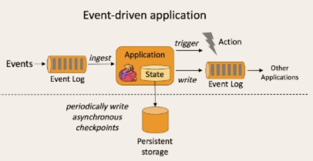
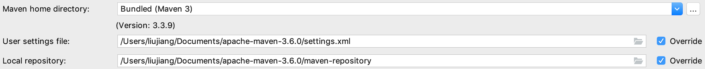
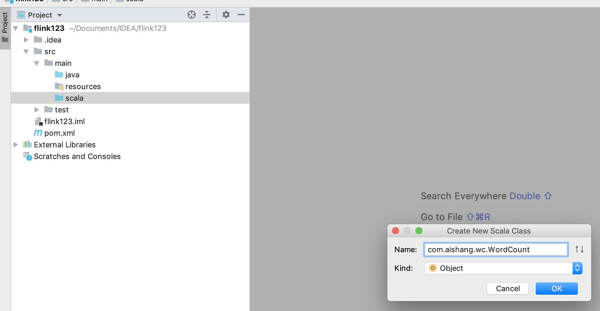
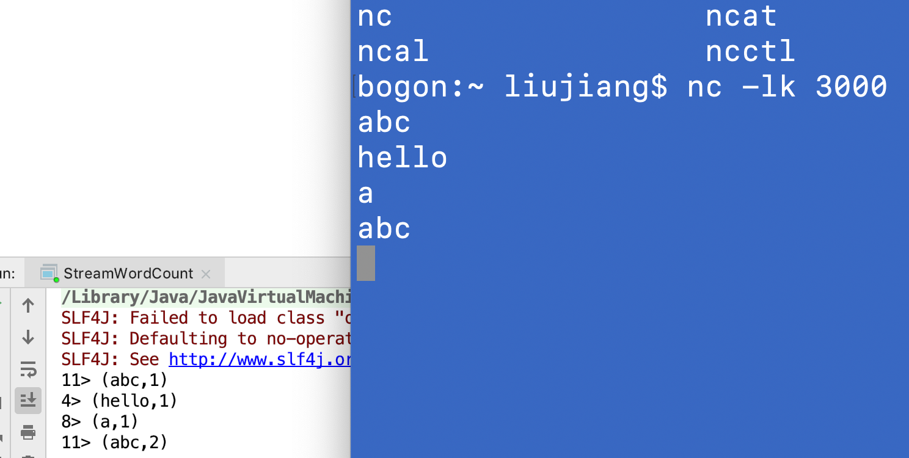
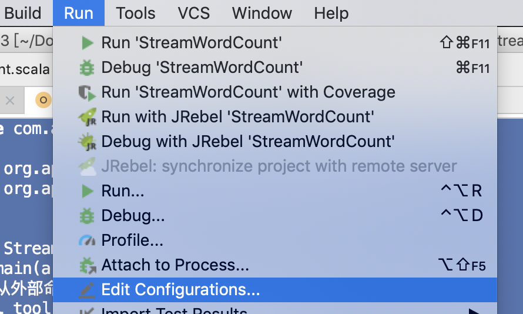
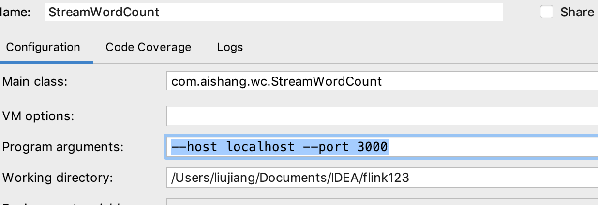

# Flink

# 一、什么是Flink

**Apache Flink**是由[Apache软件基金会](https://baike.baidu.com/item/Apache%E8%BD%AF%E4%BB%B6%E5%9F%BA%E9%87%91%E4%BC%9A/2912769)开发的开源流处理框架，其核心是用Java和Scala编写的分布式流数据流引擎。Flink以数据并行和流水线方式执行任意流数据程序，Flink的流水线运行时系统可以执行批处理和流处理程序。此外，Flink的运行时本身也支持迭代算法的执行

用于对无界和有界数据流进行状态计算


# 二、为什么选择Flink

- 流数据更真实的反映了我们的生活方式
- 传统的数据架构是基于有限数据集的
- 我们的目标
  - 低延迟
  - 高吞吐
  - 结果的准确性和良好的容错性


# 三、特点

### 事件驱动型（Event-driven）

事件驱动型应用是一类具有状态的应用，它从一个或多个事件流提取数据，并根据到来的事件触发计算、状态更新或其他外部动作。比较典型的就是以kafka为代表的消息队列几乎都是事件驱动型应用

与之不同的就是SparkStreaming微批次，如图：


事件驱动型：



### 流与批的世界观

**批处理**的特点是有界、持久、大量，非常适合需要访问全套记录才能完成的计算工作，一般用于离线统计。

**流处理**的特点是无界、实时,  无需针对整个数据集执行操作，而是对通过系统传输的每个数据项执行操作，一般用于实时统计。

 

   在spark的世界观中，一切都是由批次组成的，离线数据是一个大批次，而实时数据是由一个一个无限的小批次组成的。

   而在flink的世界观中，一切都是由流组成的，离线数据是有界限的流，实时数据是一个没有界限的流，这就是所谓的有界流和无界流。

 

**无界数据流**：**无界数据流有一个开始但是没有结束**，它们不会在生成时终止并提供数据，必须连续处理无界流，也就是说必须在获取后立即处理event。对于无界数据流我们无法等待所有数据都到达，因为输入是无界的，并且在任何时间点都不会完成。处理无界数据通常要求以特定顺序（例如事件发生的顺序）获取event，以便能够推断结果完整性。

**有界数据流**：**有界数据流有明确定义的开始和结束**，可以在执行任何计算之前通过获取所有数据来处理有界流，处理有界流不需要有序获取，因为可以始终对有界数据集进行排序，有界流的处理也称为批处理。


​    这种以流为世界观的架构，获得的最大好处就是具有极低的延迟。

###  支持事件时间（EventTime）

目前大多数框架时间窗口计算，都是采用当前系统时间，以时间为单位进行的聚合计算只能反应数据到达计算引擎的时间，而并不是实际业务时间

# 四、快速上手

新建maven项目



pom

```xml
<?xml version="1.0" encoding="UTF-8"?>
<project xmlns="http://maven.apache.org/POM/4.0.0"
         xmlns:xsi="http://www.w3.org/2001/XMLSchema-instance"
         xsi:schemaLocation="http://maven.apache.org/POM/4.0.0 http://maven.apache.org/xsd/maven-4.0.0.xsd">
    <modelVersion>4.0.0</modelVersion>

    <groupId>com.atguigu.flink</groupId>
    <artifactId>flink</artifactId>
    <version>1.0-SNAPSHOT</version>

    <dependencies>
        <dependency>
            <groupId>org.apache.flink</groupId>
            <artifactId>flink-scala_2.11</artifactId>
            <version>1.7.0</version>
        </dependency>

        <!-- https://mvnrepository.com/artifact/org.apache.flink/flink-streaming-scala -->
        <dependency>
            <groupId>org.apache.flink</groupId>
            <artifactId>flink-streaming-scala_2.11</artifactId>
            <version>1.7.0</version>
        </dependency>
    </dependencies>

<build>
    <plugins>
    <!-- 该插件用于将Scala代码编译成class文件 -->
    <plugin>
        <groupId>net.alchim31.maven</groupId>
        <artifactId>scala-maven-plugin</artifactId>
        <version>3.4.6</version>
        <executions>
            <execution>
                <!-- 声明绑定到maven的compile阶段 -->
                <goals>
                    <goal>compile</goal>
                    <goal>testCompile</goal>
                </goals>
            </execution>
        </executions>
    </plugin>

        <plugin>
            <groupId>org.apache.maven.plugins</groupId>
            <artifactId>maven-assembly-plugin</artifactId>
            <version>3.0.0</version>
            <configuration>
                <descriptorRefs>
                    <descriptorRef>jar-with-dependencies</descriptorRef>
                </descriptorRefs>
            </configuration>
            <executions>
                <execution>
                    <id>make-assembly</id>
                    <phase>package</phase>
                    <goals>
                        <goal>single</goal>
                    </goals>
                </execution>
            </executions>
        </plugin>
    </plugins>
</build>

</project>

```



### 批处理的wordcount

在resources下创建一个hello.txt文件，用作批处理数据

```txt
hello world!
hello !
aishang 123
aa
a
aa aa
aa !
ai shang
nihao ni
```

```scala
package com.aishang.wc

//注意导入全部包，隐式转换
import org.apache.flink.api.scala._

object WordCount {
  def main(args: Array[String]): Unit = {
    //构造执行环境
    val env: ExecutionEnvironment = ExecutionEnvironment.getExecutionEnvironment
    //读取文件
    val input = "/Users/liujiang/Documents/IDEA/flink123/src/main/resources/hello.txt"
    val ds: DataSet[String] = env.readTextFile(input)
    //经过groupby进行分组，sum进行聚合
    val aggDs: AggregateDataSet[(String, Int)] = ds.flatMap(_.split(" ")).map((_, 1))
      .groupBy(0) //以第一个元素作为key，进行分组
      .sum(1) //对所有数据的第二个元素求和
    // 打印
    aggDs.print()
  }

}
```

### **流处理** wordcount

```java
package com.aishang.wc

import org.apache.flink.api.java.utils.ParameterTool
import org.apache.flink.streaming.api.scala._


object StreamWordCount {
  def main(args: Array[String]): Unit = {

    //创建流处理环境
    val env: StreamExecutionEnvironment = StreamExecutionEnvironment.getExecutionEnvironment
    //接收socket文本流
    val textDstream: DataStream[String] = env.socketTextStream("localhost", 3000)
    // flatMap和Map需要引用的隐式转换
    import org.apache.flink.api.scala._
    //处理 分组并且sum聚合
    val dStream: DataStream[(String, Int)] = textDstream.flatMap(_.split(" "))
      .filter(_.nonEmpty) //过滤 不能为空  比如多个空格时
      .map((_, 1))
      .keyBy(0)
      .sum(1)
    //打印
    dStream.print()
    //   启动任务执行
    env.execute("自定义执行的名字，比如：wordcount")
  }
}

```

打开终端 执行netcat命令

```sh
nc -lk 3000
```



前面的序号是job的并行任务数，可以自定义（默认电脑的cpu核心数）

```java
package com.aishang.wc

import org.apache.flink.api.java.utils.ParameterTool
import org.apache.flink.streaming.api.scala._


object StreamWordCount {
  def main(args: Array[String]): Unit = {

    //创建流处理环境
    val env: StreamExecutionEnvironment = StreamExecutionEnvironment.getExecutionEnvironment
    //    将 job或运算符的并行度设置为x，即运算符的并行任务数
    env.setParallelism(4)
    //接收socket文本流
    val textDstream: DataStream[String] = env.socketTextStream("localhost", 3000)
    //处理 分组并且sum聚合
    val dStream: DataStream[(String, Int)] = textDstream.flatMap(_.split(" "))
      .map((_, 1))
      .keyBy(0)
      .sum(1)
    //打印
    dStream.print()
    //   启动任务执行
    env.execute("自定义执行的名字，比如：wordcount")
  }
}

```

### 从外部命令中获取参数

```scala
package com.aishang.wc

import org.apache.flink.api.java.utils.ParameterTool
import org.apache.flink.streaming.api.scala._


object StreamWordCount {
  def main(args: Array[String]): Unit = {
    //从外部命令中获取参数
    val tool: ParameterTool = ParameterTool.fromArgs(args)
    val host: String = tool.get("host")
    val port: Int = tool.get("port").toInt
      
      
    val env: StreamExecutionEnvironment = StreamExecutionEnvironment.getExecutionEnvironment
    env.setParallelism(4)
    val textDstream: DataStream[String] = env.socketTextStream(host, port)
    val dStream: DataStream[(String, Int)] = textDstream.flatMap(_.split(" "))
      .map((_, 1))
      .keyBy(0)
      .sum(1)
    dStream.print().setParallelism(1)
      //打印的并行度为1  所以输出是就不显示前面的序号
    env.execute("自定义执行的名字，比如：wordcount")
  }
}

```





# 五、Flink部署

## 1 standalone模式

**修改** flink/conf/flink-conf.yaml 文件

```sh
jobmanager.rpc.address:k1
#默认localhost，启动flink集群时，jobmanager在哪个机器上，设置k1，启动时就在k1上
#如果在k1上安装flink，配置使用localhost也是可以的，启动时就在自己这台机器上(k1)
```


