# 第一天Scala

## 1、介绍

Spark   -    新一代内存级大数据计算框架，是大数据处理的重要框架。

Spark就是使用Scala编写的。因此为了更好的学习Spark, 需要掌握Scala这门语言。

Scala   联邦理工学院洛桑（EPFL ）的Martin Odersky于2001年开始设计Scala

Spark的兴起，带动Scala语言的发展！

创始人马丁·奥德斯基（Martin Odersky）是编译器及编程的狂热爱好者，长时间的编程之后，希望发明一种语言，能够让写程序这样的基础工作变得高效，简单，且令人愉悦。所以当接触到JAVA语言后，对JAVA这门便携式，运行在网络，且存在垃圾回收的语言产生了极大的兴趣，所以决定将函数式编程语言的特点融合到JAVA中，由此发明了两种语言（Pizza & Scala） 


Pizza和Scala极大地推动了Java编程语言的发展。

jdk5.0 的泛型，for循环增强, 自动类型转换等，都是从Pizza 引入的新特性。
jdk8.0 的类型推断，Lambda表达式就是从scala引入的特性。

且现在主流JVM的javac编译器就是马丁·奥德斯基编写出来的。Jdk5.0 Jdk8.0的编译器就是马丁·奥德斯基写的，因此马丁·奥德斯基 一个人的战斗力抵得上一个Java开发团队。


Scala是一门以java虚拟机（JVM）为目标运行环境并将面向对象和函数式编程的最佳特性结合在一起的静态类型编程语言。 

Scala 是一门多范式 (multi-paradigm) 的编程语言，Scala支持面向对象和函数式编程

Scala源代码(.scala)会被编译成Java字节码(.class)，然后运行于JVM之上，并可以调用现有的Java类库，实现两种语言的无缝对接。

Scala 单作为一门语言来看， 非常的简洁高效

Scala 在设计时，马丁·奥德斯基 是参考了Java的设计思想，可以说Scala是源于java，同时马丁·奥德斯基 也加入了自己的思想，将函数式编程语言的特点融合到JAVA中, 因此，对于学习过Java的同学，只要在学习Scala的过程中，搞清楚Scala 和 Java相同点和不同点，就可以快速的掌握Scala这门语言 


## 2、安装

官网传送门 
http://www.scala-lang.org/download/

下载后进入安装包所在目录进行解压操作(scala-2.11.8.zip)

### 配置环境变量

Mac修改 .bash_profile 文件，此文件是mac 当前用户的环境配置文件。

```sh
sudo vi .bash_profile

//添加如下信息
export SCALA_HOME=你Scala的路径/scala
export PATH=$PATH:$SCALA_HOME/bin

重启终端
```

### window配置

Scala需要Java运行时库，安装Scala需要首先安装JVM虚拟机并配置好，推荐安装JDK1.8

- 安装&配置
- 配置JDK的环境变量 JAVA_HOME
- 配置Scala的环境变量SCALA_HOME
- 将Scala安装目录下的bin目录加入到PATH环境变量在PATH变量中添加：%SCALA_HOME%\bin
- 在命令行窗口中输入“scala”命令打开scala解释器(REPL)
- 出现下面的内容表示Scala已经正确的执行

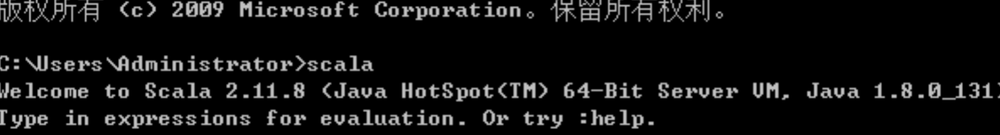

### 检验结果

在终端输入scala 命令，进入scala解释器，然后输入1＋2，查看计算结果。

输入 :q 退出scala解释器。 

## 3、配置IDEA

1. 打开IDEA工具，如图：点击Configure


1. 点击Plugins

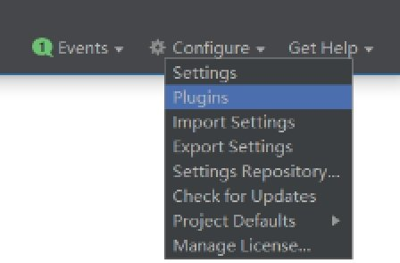 

1. 下载scala包

    

2. [http://plugins.jetbrains.com/plugin/1347-scala/versions](http://plugins.jetbrains.com/plugin/1347-scala/versions)找到对应版本

3. 

    

4. **点击Install** **plugin** **from** **disk**

   

5. **选择scala的plugins**

     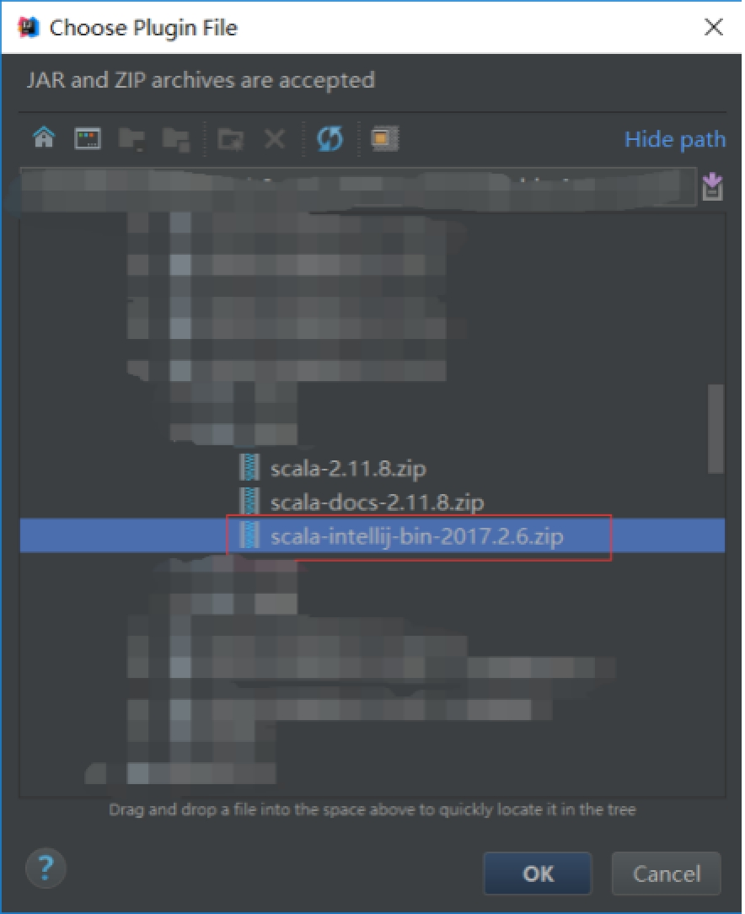

6. **此时会显示一个Scala的条目，在右侧点击Restart** **IntelliJ** **IDEA**

   

7. 重新启动后, Scala的插件安装成功了

8. 创建Maven项目

9. 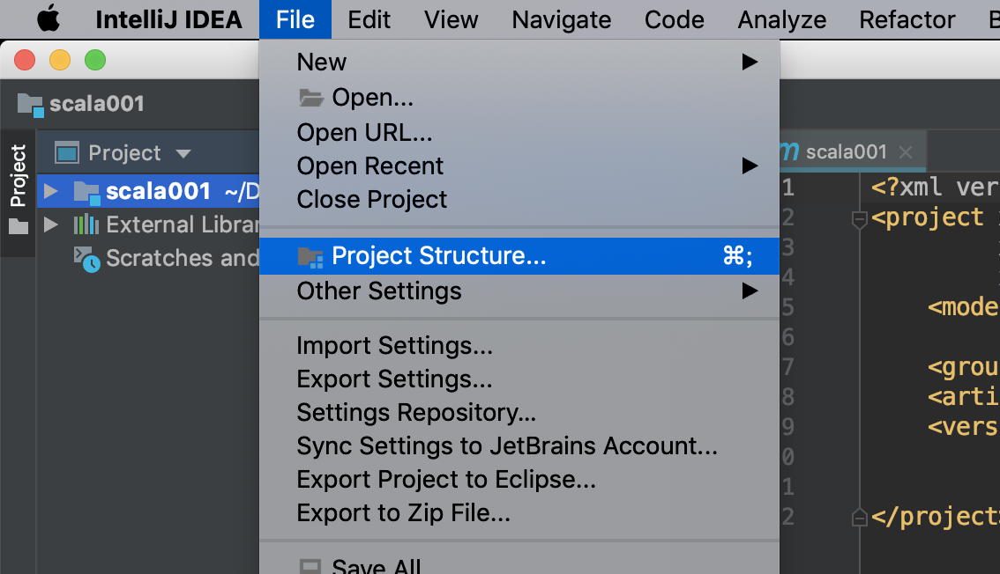

10. 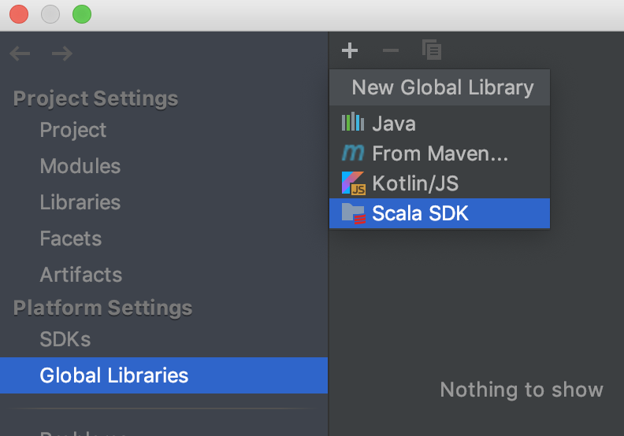

11. 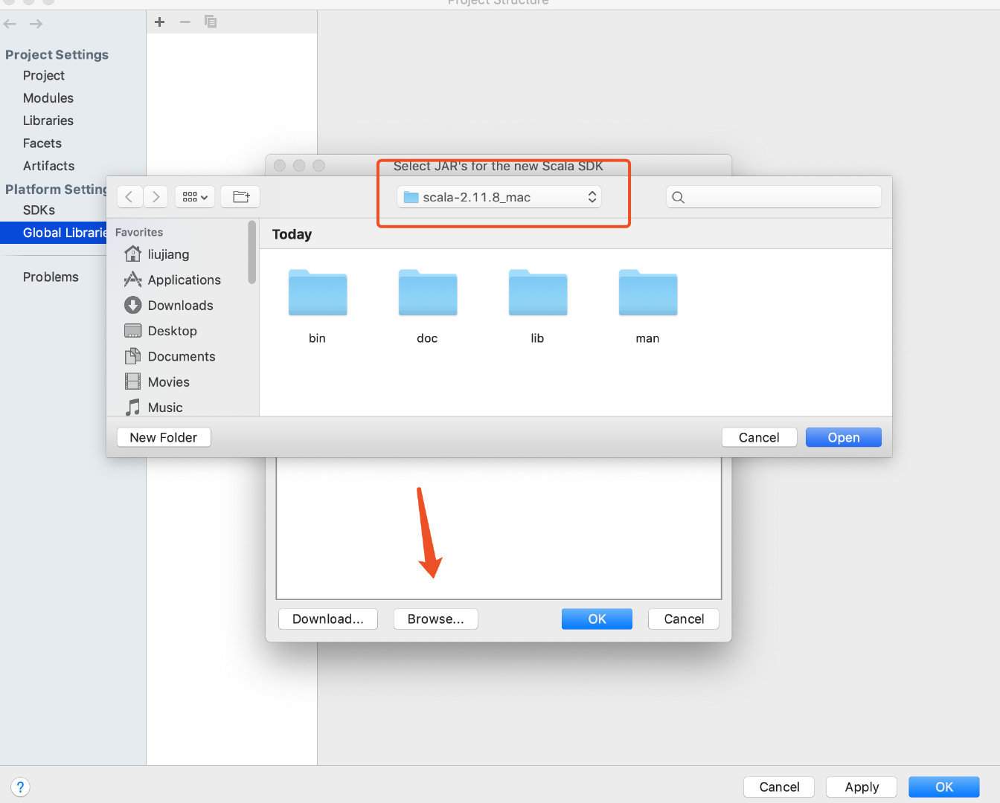

12. 

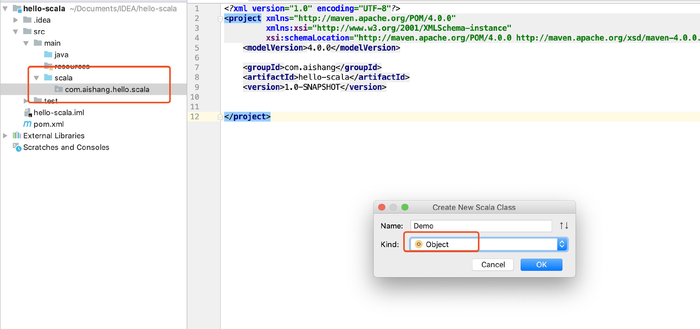

测试

```scala
package com.aishang.day01

/**
  * @program: scala001
  * @description: ${description}
  * @author: liujiang
  * @create: 2020-11-07 19:05
  **/
object Demo {
  def main(args: Array[String]): Unit = {
    printf("aaa")
  }
}

```

## 4、语言输出的三种方式

```scala
val name = "ApacheCN"
val age  = 1
val url  = "www.atguigu.com"

字符串通过+号连接（类似java）
println("name=" + name + " age=" + age + " url=" + url)

printf用法 （类似C语言）字符串通过 % 传值。(格式化输出)
printf("name=%s, age=%d, url=%s \n", name, age, url)

字符串插值：通过$引用(类似PHP）
println(s"name=$name, age=$age, url=$url")
```

## 5、变量&特性

```scala
package com.aishang.hello.scala

/**
  * @program: hello-scala
  * @description: ${description}
  * @author: liujiang
  * @create: 2020-11-07 21:18
  **/
object 变量 {
  def main(args: Array[String]): Unit = {
    var num: Int = 100;
    var score: Double = 92.1;
    var gender: Char = 'N';
    var name: String = "tom";
  }
}
```

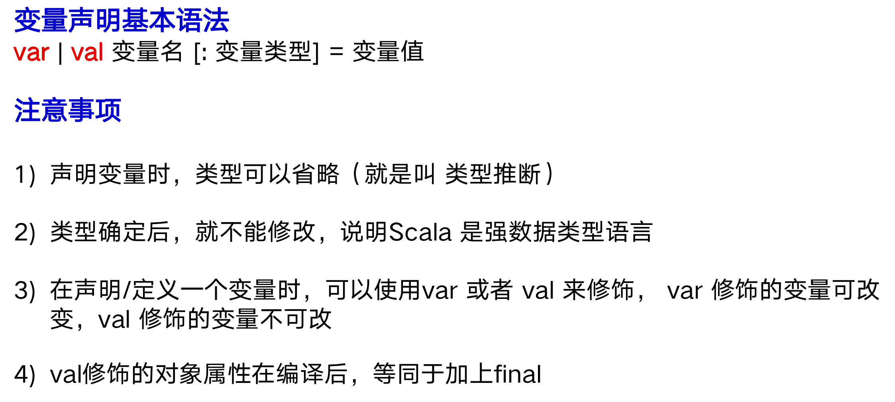

```scala
package com.aishang.hello.scala

object Demo2 {
  def main(args: Array[String]): Unit = {
    var username = "tom"
    username = "jerry"
    val age = 20
//    age = 200  相当于final
    println(username)
  }
}

快捷键 "王五".var 按下回车 自动补全
```

## 6、数据类型

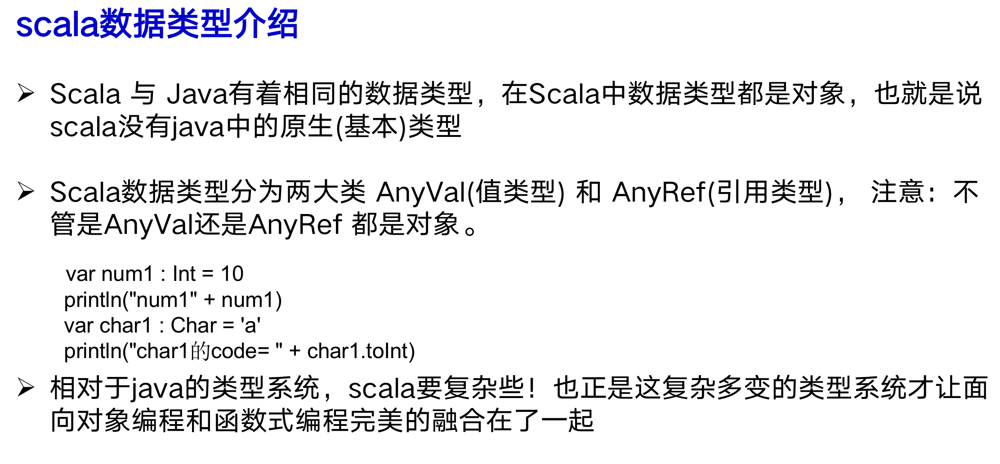

数据类型体系一览图

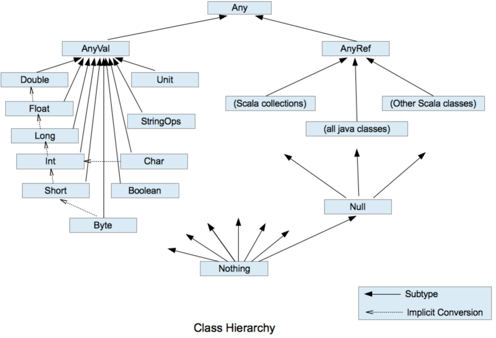

### Unit类型、Null类型和Nothing类型

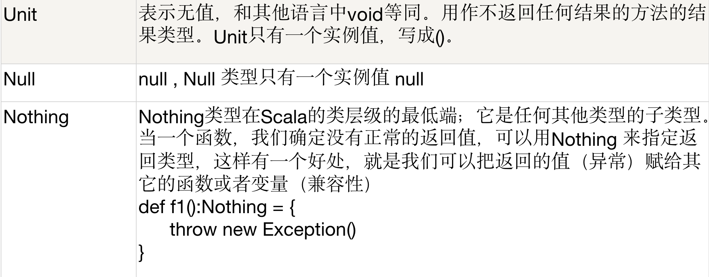

### 强制类型转换

```scala
val n1:Int = 12.9.toInt
print(n1)//12
val s:String = "12.5";
print(s.toDouble)//12.5
```

## 7、运算符

对于除号“/”，它的整数除和小数除是有区别的：整数之间做除法时，只保留整数部分而舍弃小数部分。 例如：var x : Int = 10/3 ,结果是  3

##### 注意：Scala中没有++、--操作符，需要通过+=、-=来实现同样的效果

其他跟java一样

## 8、键盘输入语句

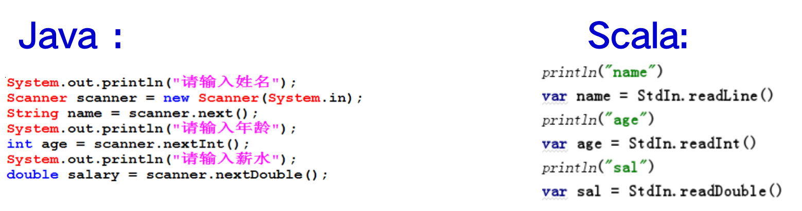

```scala
println("请输入姓名")
val name = StdIn.readLine();
println(name)
```

### 9、分支语句

Scala中任意表达式都是有返回值的，也就意味着if else表达式其实是有返回结果的，具体返回结果的值取决于满足条件的代码体的最后一行内容.其他与java一样

```scala
var sumVal = 60
val result:Any = if (sumVal > 20) {
    "结果大于20"
}
println(result)
```

##### scala中没有三元运算符和switch

## 10、循环

```scala
for (i <- 1 to 3){
    println("hello"+i)
}
i是变量，前后闭合 包含1，2，3
```

```scala
for (i <- 1 until 3){
    println("hello"+i)
}
包左不包右 1，2
```

#### scala中没有break

```scala
Breaks.breakable {
    for (i <- 1 until 3) {
        if (i == 2) {
            Breaks.break() //抛异常
        }
        println("hello"+i)
    }
}
println("循环结束")
```

#### continue

```scala
for (i <- 0 until 10) {
    Breaks.breakable {
        if (i == 3 || i == 6) {
            Breaks.break
        }
        println(i)
    }
}
println("循环结束")
```

#### while和doWhile与java一样

## 11、函数

无参无返回值

```scala
def main(args: Array[String]): Unit = {
    def test(): Unit = {
        println("无参无返回值")
    }
    test()
}
```

没有方法重载

有参无返回值

```scala
def test1(s:String): Unit = {
    println("有参无返回值"+s)
}
test1("tom")
```

有参有返回值

```scala
def test2(s: String): String = {
    return s;
}

val name = test2("lisi")
println(name)

------------------------------------

def test2(s: String): String = {
    s;
}

val name = test2("lisi")
println(name)
如果将函数体的最后一行代码进行返回，那么return可以省略
```

无参有返回值

```scala
def test3(): String = {
    "hello scala"
}
println(test3())
```

#### 如果可以根据函数的最后一行代码推断类型，那么函数的返回值类型可以省略

```scala
def test3()={
    "hello scala"
}

println(test3())
注意没有= 返回的是Unit 打印结果 ()
```

#### 如果函数体中只有一行代码，大括号可以省略

```scala
def test3() = "hello scala"
println(test3())
```

#### 如果函数声明中没有参数列表，小括号可以省略,调用时同样去掉（）  相当于一个变量

```scala
def test3 = "hello scala"
println(test3)
```

## 12、对象

```scala
object Demo {
  def main(args: Array[String]): Unit = {
    var user = new User
    user.name = "lisi"
    println(user.name)
    println(user.login())
  }
}

class User {
  //  _  默认初始化
  var name: String = _
  var age: Int = _

  def login(): Boolean = {
    true
  }
}
```

## 13、集合

scala中集合分为两大类，可变(mutable)和不可变(immutable)

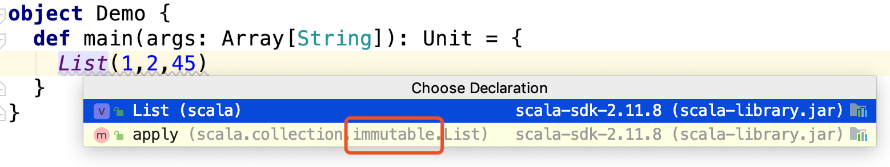

### 数组

```scala
val arr = Array(1,2,3)
val arr1 = Array(4,5,6)
arr = arr1
#不可以，引用不可变
arr1(0) = 10 //可以，引用的内容可变
```

```scala
package com.aishang.hello.scala

object Demo3 {
  def main(args: Array[String]): Unit = {
    //    创建数组的方式
    val arr1 = Array(1, 23, 4)
    arr1.foreach(println(_))
    val arr2 = Array[Int](2, 3, 4, 3, 5, 6)
    arr2.foreach(println(_))
    val arr3 = new Array[Int](10) //长度为10
    arr3(0) = 122
    val length = arr3.length
    println(length)
    arr3.foreach(print(_))

    println("---------------")
    var sum = 0;
    val arr = Array(1, 2,43,54,65,67,67,87,8,534,4,23,2,4,5,4,5)
    for (i <- arr) {
      sum+=i
    }
    println("sum="+sum)
    println(arr.sum)
    println(arr.max)
    println(arr.min)
    arr.sorted//排序
    arr.foreach(print(_))
    println("--------------")
    arr.sorted.reverse//倒序
    for (i <- arr){
      print(i)
    }
  }
}

```

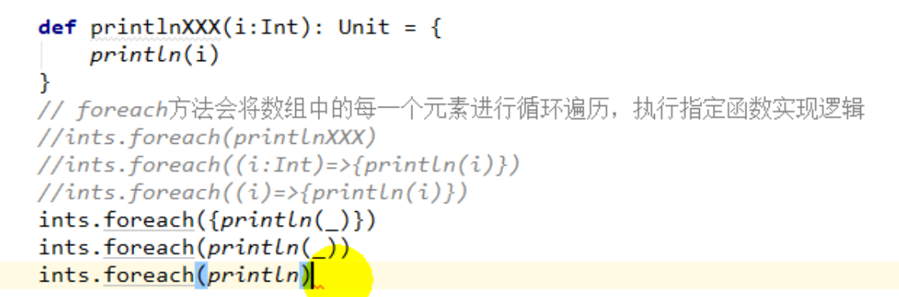

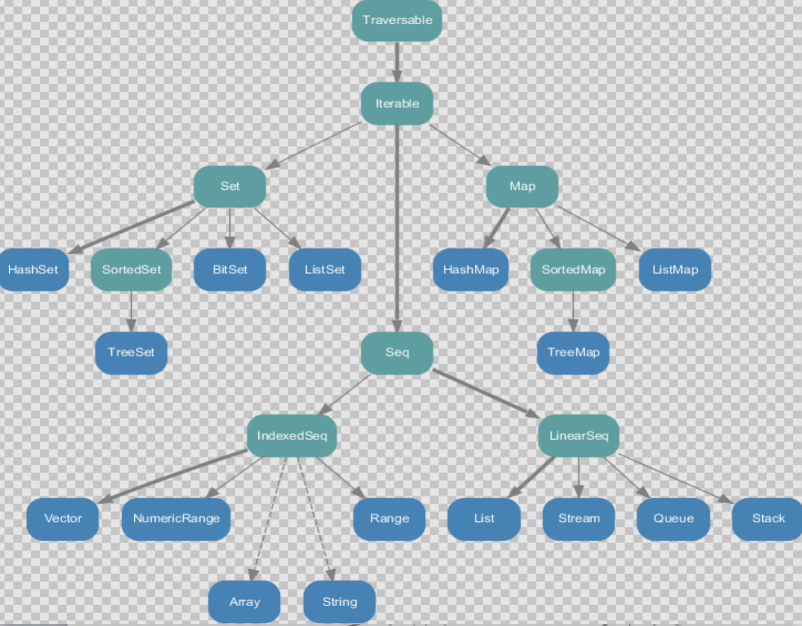

### List（序列Seq）

```scala
package com.aishang.hello.scala

object Demo3 {
  def main(args: Array[String]): Unit = {
    val list = List(1,2,3)
    println(list(0))
    list.foreach(print(_))
    println()
    import scala.collection.mutable.ListBuffer
    var list1 = ListBuffer(1,2,3)
    list1+=4
    list1.append(5)
    list1.foreach(print(_))
    var list2 = ListBuffer(4,5,6)
    var ll = list2:+999//这种追加会产生一个新的list
    ll.foreach(print(_))
    val l = list1 ++ list2
    l.foreach(print(_))

    println()
    println()

    
  }
}

```

### Set

无序不可重复

```scala
val set = Set(1,2,3,4,1)
println(set.mkString(","))
增加数据
println(set + 11)
减少数据
println(set - 3)

for(item <- set){
    println(item)
}
```

### Map

```scala
package com.aishang.hello.scala

object Demo3 {
  def main(args: Array[String]): Unit = {
    val score = Map("lisi"->100,"zhangsan"->78)
    println(score("lisi"))
    //println(score("li"))//报错
    println(score.isEmpty)
    println(score.keys)
    //防止null指针 提供了一个option这个特殊的类 有两个特殊的对象  some  none
    println(score.get("zhangsan").get)
    println(score.getOrElse("li",-1))//如果有这个key 返回值，没有返回-1
    println(score.values)

    /*
    100
    -1
    false
    Set(lisi, zhangsan)
    78
    MapLike(100, 78)
     */


    import scala.collection.mutable.Map
    val s1 = Map("a"->10,"b"->100)
    s1("a")=999
    s1("aaaa")=1//键不存在，添加
    println(s1.values)
    /*
    MapLike(100, 78)
    HashMap(100, 999, 1)
    可变的
     */

    for((k,v)<-s1){
      println("k:"+k+",v:"+v)
    }
    /*
      k:b,v:100
      k:a,v:999
      k:aaaa,v:1
     */
  }
}

```

### 元组

可以将无关的数据当成一个整体来用，例如：

员工ID，邮箱，序号等，用map显然不合适，所以scala提供了元组

```scala
val tuple = ("lisi",11111,"xxxxxx")
println(tuple._1)
println(tuple._2)
println(tuple._3)

最多个数是22
println(Tuple1) //lisi
..
以此类推


for(item <- tuple.productIterator){
    println(item)
}

如果元组中的元素个数为2，那么称之为对偶，类似map中键值对
val tup = (1,"tom")
val tMap = Map((1,"tom"))
tMap.foreach(t=>{println(t)})
tMap.foreach(t=>{println(t._1+"="+t._2)})
```

## 14、集合中常用方法

```scala
package com.aishang.hello.scala

object Demo {
  def main(args: Array[String]): Unit = {
    val list = List(1, 2, 3, 4)
    println("sum=" + list.sum)
    println("max=" + list.max)
    println("min=" + list.min)
    //反转（无排序）
    println(list.reverse)
    //分组(通过指定函数的返回值进行分组)
    val list2 = List(1, 2, 3, 4, 1, 3)
    //x就是集合中每一项，=>x 相当于 {x} 什么也没干，直接返回了
    val intToInts: Map[Int, List[Int]] = list2.groupBy(x => x)
    intToInts.foreach(x => {
      println(x._1 + "=" + x._2)
    })
    //排序
    val ints = list2.sortBy(x => x)
    println(ints.mkString(","))
    // 升序 降序
    val ints2 = list2.sortWith((x, y) => {
      x < y
    })
    println(ints2.mkString(","))
    val ints3 = list2.sortWith((x, y) => {
      x > y
    })
    println(ints3.mkString(","))

    list.map(_ * 10).foreach(println(_))
    println()
    println()
    list.map(e => e * 10).foreach(println(_))
    println()
    println()
    list.map {
      e =>
        println("oo")
        e * 1000
    }.foreach(println(_))

    println()
    println()
    list.map {
      _ * 77
    }.foreach(println(_))

  }
}

```


## 15、样例类

```scala
package com.aishang.hello.scala

object CaseDemo {
  def main(args: Array[String]): Unit = {
//    样例类
    case class Person(name:String,age:Int,sex:String)

    val p1 = Person("tom",18,"男")
    println(p1.name)
  }
}
```

# 第二天Spark

## 产生背景

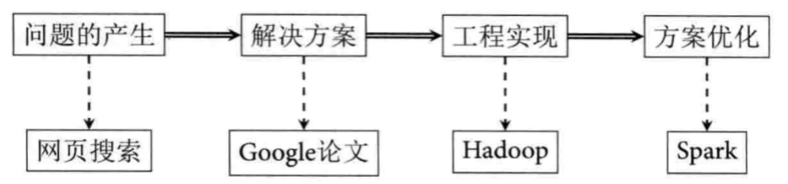

谷歌的三驾马车 hadoop hbase

Spark是一种快速、通用、可扩展的大数据分析引擎，2009年诞生于加州大学伯克利分校AMPLab，2010年开源，2013年6月成为Apache孵化项目，2014年2月成为Apache顶级项目。项目是用Scala进行编写。

目前，Spark生态系统已经发展成为一个包含多个子项目的集合，其中包含SparkSQL、Spark Streaming、GraphX、MLib、SparkR等子项目，Spark是基于内存计算的大数据并行计算框架。除了扩展了广泛使用的 MapReduce 计算模型，而且高效地支持更多计算模式，包括交互式查询和流处理。Spark 适用于各种各样原先需要多种不同的分布式平台的场景，包括批处理、迭代算法、交互式查询、流处理。通过在一个统一的框架下支持这些不同的计算，Spark 使我们可以简单而低耗地把各种处理流程整合在一起。而这样的组合，在实际的数据分析 过程中是很有意义的。不仅如此，Spark 的这种特性还大大减轻了原先需要对各种平台分 别管理的负担。 

大一统的软件栈，各个组件关系密切并且可以相互调用，这种设计有几个好处：1、软件栈中所有的程序库和高级组件 都可以从下层的改进中获益。2、运行整个软件栈的代价变小了。不需要运 行 5 到 10 套独立的软件系统了，一个机构只需要运行一套软件系统即可。系统的部署、维护、测试、支持等大大缩减。3、能够构建出无缝整合不同处理模型的应用。

Spark的内置项目如下：

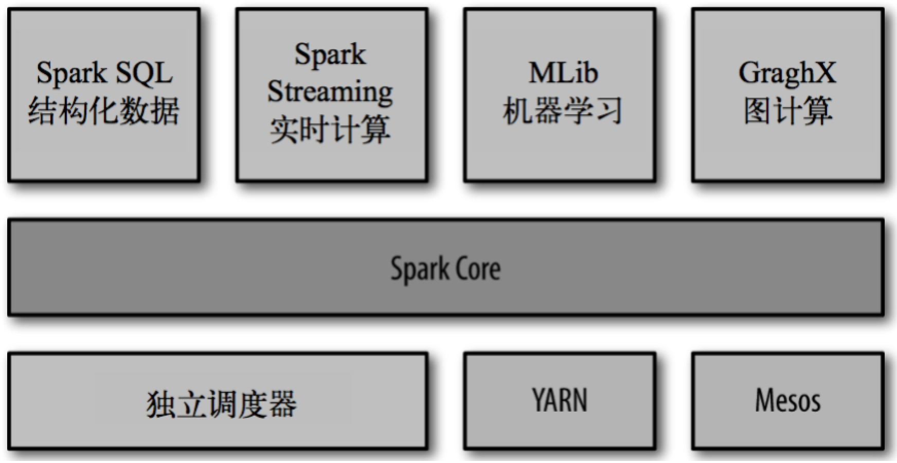 

 

**Spark Core：**实现了 Spark 的基本功能，包含任务调度、内存管理、错误恢复、与存储系统 交互等模块。Spark Core 中还包含了对弹性分布式数据集(resilient distributed dataset，简称RDD)的 API 定义。 

**Spark SQL：**是 Spark 用来操作结构化数据的程序包。通过 Spark SQL，我们可以使用 SQL 或者 Apache Hive 版本的 SQL 方言(HQL)来查询数据。Spark SQL 支持多种数据源，比 如 Hive 表、Parquet 以及 JSON 等。 

**Spark Streaming：**是 Spark 提供的对实时数据进行流式计算的组件。提供了用来操作数据流的 API，并且与 Spark Core 中的 RDD API 高度对应。 

**Spark MLlib：**提供常见的机器学习(ML)功能的程序库。包括分类、回归、聚类、协同过滤等，还提供了模型评估、数据 导入等额外的支持功能。 

**集群管理器：**Spark 设计为可以高效地在一个计算节点到数千个计算节点之间伸缩计 算。为了实现这样的要求，同时获得最大灵活性，Spark 支持在各种集群管理器(cluster manager)上运行，包括 Hadoop YARN、Apache Mesos，以及 Spark 自带的一个简易调度 器，叫作独立调度器。 

 

​    Spark得到了众多大数据公司的支持，这些公司包括Hortonworks、IBM、Intel、Cloudera、MapR、Pivotal、百度、阿里、腾讯、京东、携程、优酷土豆。当前百度的Spark已应用于凤巢、大搜索、直达号、百度大数据等业务；阿里利用GraphX构建了大规模的图计算和图挖掘系统，实现了很多生产系统的推荐算法；腾讯Spark集群达到8000台的规模，是当前已知的世界上最大的Spark集群。

## 集群环境搭建

### 1、搭建集群

创建三台服务器，分别k1、k2、k3

#### 第1台k1（centos7）

网络连接选择nat模式，启动服务器

账号：root

密码：root

查看防火墙

```sh
sudo systemctl status  firewalld
```

关闭防火墙

```sh
sudo systemctl disable firewalld
```

之后重启

```sh
reboot
```

查看ip

```sh
ip addr
```

测试是否能上网

```sh
ping www.baidu.com
```

如果不能，修改ip

```sh
vi /etc/sysconfig/network-scripts/ifcfg-ens33
```

修改->  ONBOOT=yes   改成静态  BOOTPROTO=static 

添加ip,这里的前3位与刚才查看的ip匹配

```sh
IPADDR=192.168.83.101
GATEWAY=192.168.83.2
DNS1=192.168.83.2
```

重启网络

```sh
service network restart
#测试
ping www.baidu.com
```

设置主机名称

```sh
vi /etc/hostname

删除localhost.localdomain
直接写k1
:wq
```

修改hosts之后重启  

```sh
vi /etc/hosts

127.0.0.1   localhost localhost.localdomain localhost4 localhost4.localdomain4
::1         localhost localhost.localdomain localhost6 localhost6.localdomain6
192.168.83.101 k1
192.168.83.102 k2
192.168.83.103 k3

reboot

ping k1
```

#### 第2台k2

重复上述步骤

ip不一样

```sh
IPADDR=192.168.83.102
GATEWAY=192.168.83.2
DNS1=192.168.83.2
```

主机名称不一样

```sh
vi /etc/hostname

k2
```

```sh
vi /etc/hosts

127.0.0.1   localhost localhost.localdomain localhost4 localhost4.localdomain4
::1         localhost localhost.localdomain localhost6 localhost6.localdomain6
192.168.83.101 k1
192.168.83.102 k2
192.168.83.103 k3

reboot

ping k1
```


其他配置一样

#### 第3台k3

重复上述步骤

ip不一样

```sh
IPADDR=192.168.83.103
GATEWAY=192.168.83.2
DNS1=192.168.83.2
```

主机名称不一样

```sh
vi /etc/hostname

k3
```

```sh
vi /etc/hosts

127.0.0.1   localhost localhost.localdomain localhost4 localhost4.localdomain4
::1         localhost localhost.localdomain localhost6 localhost6.localdomain6
192.168.83.101 k1
192.168.83.102 k2
192.168.83.103 k3

reboot

ping k1
```

其他配置一样

#### 测试

三台机器相互ping同即可

### 2、FinalShell

使用finalShell或者其他工具连接，分别连接三台服务器

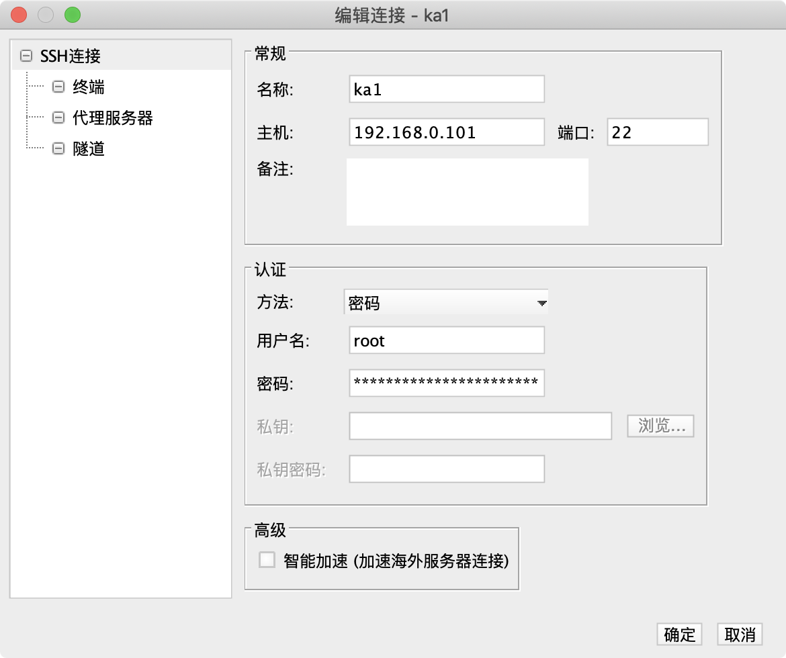

连接后在k1上，进入/opt目录下创建module、software文件夹

```sh
mkdir module software
```

- software用于存放jar包
- module存放解压后的jar包

由于k1的操作和k2、k3是一样的，所以使用分发脚本

### 3、xsync集群分发脚本

安装xsync

yum install rsync -y 每个都需要安装

在/usr/local/bin这个目录下创建 xsync 文件，向里面添加下存放的脚本

```sh
#!/bin/bash
#1 获取输入参数个数，如果没有参数，直接退出
pcount=$#
if((pcount==0)); then
echo no args;
exit;
fi

#2 获取文件名称
p1=$1
fname=`basename $p1`
echo fname=$fname

#3 获取上级目录到绝对路径
pdir=`cd -P $(dirname $p1); pwd`
echo pdir=$pdir

#4 获取当前用户名称
user=`whoami`

#5 循环
for((host=2; host<4; host++)); do
        echo ------------------- k$host --------------
        rsync -rvl $pdir/$fname $user@k$host:$pdir
done
```

修改脚本 xsync 具有可执行权限，使用ll命令查看权限

```sh
chmod 777 xsync
ll
```

使用xsync filename就能将filename分发到集群中的各个节点中。

```sh
cd /opt
xsync module/
```

之后提示输入yes，输入密码

查看k2、k3是否有文件夹,在分发software

```sh
xsync software/
```

发现每次都需要输入密码，很麻烦，配置ssh免登陆

### 4、ssh免登陆

在k1上使用命令

```sh
ssh k2
```

连接k2,需要输入密码，输入后，当前变成k2服务器，退出

```sh
exit
```

配置免密码登陆

在k1上，执行如下命令

```sh
cd ~
cd .ssh/
ssh-keygen -t rsa
直接回车即可
```

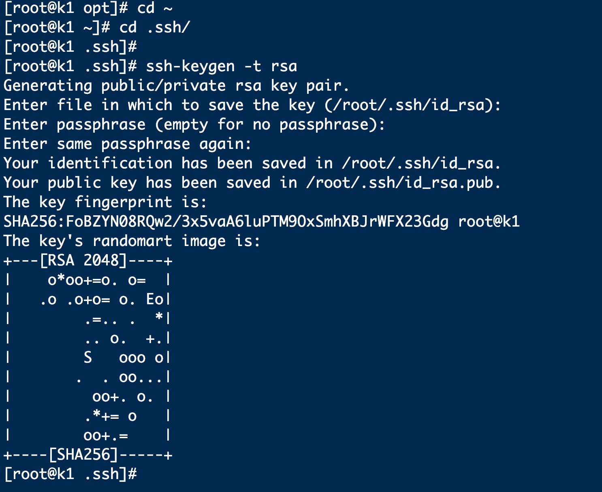

发送到其他服务器,只需要输入一次密码。以后就不需要了

```sh
ssh-copy-id k2
ssh-copy-id k3
```

之后测试

```sh
ssh k2
#登陆成功
exit
```

同理，在k2上操作,步骤一致

```sh
ssh-copy-id k1
ssh-copy-id k3
```

在k3上操作

```sh
ssh-copy-id k1
ssh-copy-id k2
```

**测试分发脚本，是否免密码**

```sh
cd /opt
mkdir aa
ls
xsync aa
#切换到k2查看文件夹
rm -r aa
```

### 5、安装jdk

我们使用kafka，它依赖zookeeper，而zookeeper需要jdk

查看系统版本

```sh
file /bin/ls
```

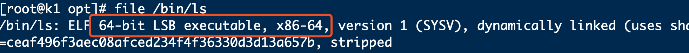

下载对应的1.8安装包（jdk-8u144-linux-x64.tar.gz）

上传到k1的software文件夹

解压文件

```sh
tar -zxvf jdk-8u144-linux-x64.tar.gz

mv jdk1.8.0_144/ ../module/
```

设置环境变量

```sh
vi /etc/profile
#在最后添加(快捷键G) JAVA_HOME （安装的具体目录）
export JAVA_HOME=/opt/module/jdk1.8.0_144
export PATH=$PATH:$JAVA_HOME/bin
```

查看安装目录，切换到jdk文件夹，pwd命令

立即生效

```sh
source /etc/profile
```

查看配置是否成功

```sh
java -version
```

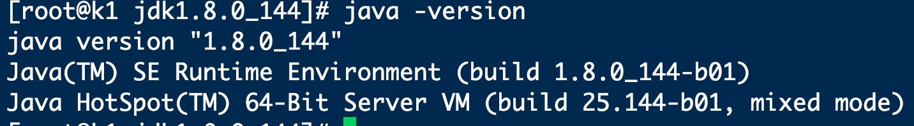

使用分发脚本，分发到其他两台服务器

```sh
cd /opt/module/
xsync jdk1.8.0_144
xsync /etc/profile
```

其他两台服务器执行

```sh
source /etc/profile
java
```

## Local模式

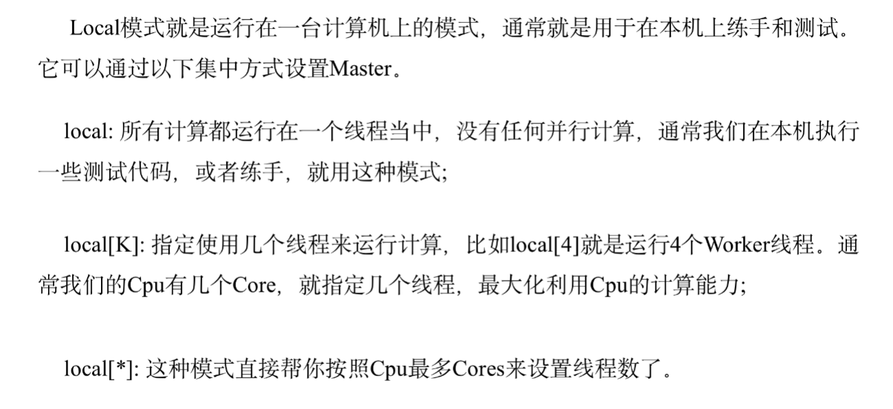

### 安装使用

上传到k1并解压spark安装包(spark-2.1.1-bin-hadoop2.7.tgz)

```sh
cd /opt/software/
#上传
#解压
tar -zxvf spark-2.1.1-bin-hadoop2.7.tgz -C /opt/module/
cd /opt/module/
mv spark-2.1.1-bin-hadoop2.7/ spark
cd spark
```

官方案例(直接粘贴到finalshell)

```sh
bin/spark-submit \
--class org.apache.spark.examples.SparkPi \
--executor-memory 1G \
--total-executor-cores 2 \
./examples/jars/spark-examples_2.11-2.1.1.jar \
100
```

```sh
1）基本语法
bin/spark-submit \
--class <main-class>
--master <master-url> \
--deploy-mode <deploy-mode> \
--conf <key>=<value> \
... # other options
<application-jar> \
[application-arguments]
（2）参数说明：
--master 指定Master的地址，默认为Local
--class: 你的应用的启动类 (如 org.apache.spark.examples.SparkPi)
--deploy-mode: 是否发布你的驱动到worker节点(cluster) 或者作为一个本地客户端 (client) (default: client)*
--conf: 任意的Spark配置属性， 格式key=value. 如果值包含空格，可以加引号“key=value” 
application-jar: 打包好的应用jar,包含依赖. 这个URL在集群中全局可见。 比如hdfs:// 共享存储系统， 如果是 file:// path， 那么所有的节点的path都包含同样的jar
application-arguments: 传给main()方法的参数
--executor-memory 1G 指定每个executor可用内存为1G
--total-executor-cores 2 指定每个executor使用的cup核数为2个
100 迭代计算100次
3）结果展示
该算法是利用蒙特·卡罗算法求PI
```

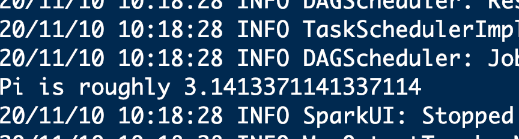

### wordcount

```sh
#开启spark-shell 
[root@k1 spark]# bin/spark-shell 
```

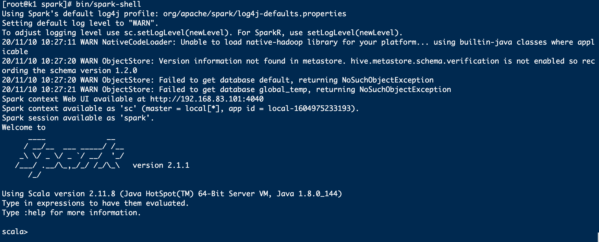

#### 准备文件

```sh
[root@k1 spark]# mkdir input
cd input
vi 1.txt
hello spark
hello aishang
hello scala
hello aishang
```

可以通过 http://192.168.83.101:4040查看ui界面，如果运行任务的话，可以在这查看

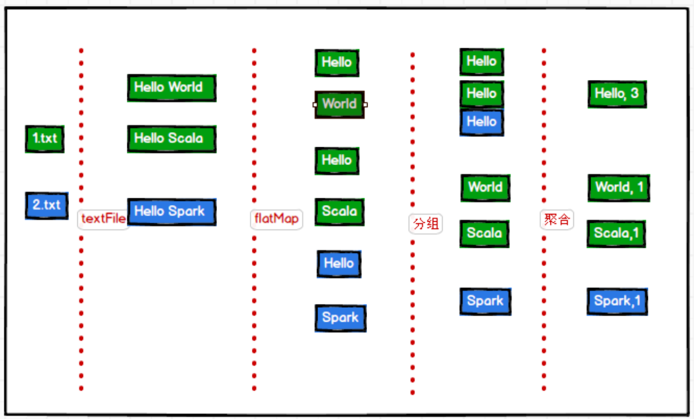

```sh
sc.textFile("input/1.txt").flatMap(_.split(" ")).map((_,1)).reduceByKey(_+_).collect
```

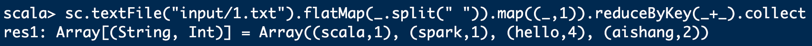

如果直接写input，那么会读取input里的所有文件

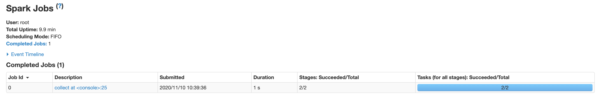

#### 运行流程

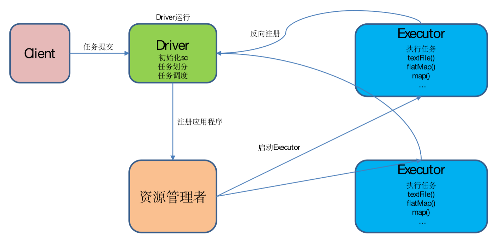

#### 重要角色

##### Driver（驱动器）

Spark的驱动器是执行开发程序中的main方法的进程。它负责开发人员编写的用来创建SparkContext、创建RDD，以及进行RDD的转化操作和行动操作代码的执行。如果你是用spark shell，那么当你启动Spark shell的时候，系统后台自启了一个Spark驱动器程序，就是在Spark shell中预加载的一个叫作 sc的SparkContext对象。如果驱动器程序终止，那么Spark应用也就结束了。主要负责：

1）把用户程序转为作业（JOB）

2）跟踪Executor的运行状况

3）为执行器节点调度任务

4）UI展示应用运行状况

##### Executor（执行器）

Spark Executor是一个工作进程，负责在 Spark 作业中运行任务，任务间相互独立。Spark 应用启动时，Executor节点被同时启动，并且始终伴随着整个 Spark 应用的生命周期而存在。如果有Executor节点发生了故障或崩溃，Spark 应用也可以继续执行，会将出错节点上的任务调度到其他Executor节点上继续运行。主要负责：

1）负责运行组成 Spark 应用的任务，并将结果返回给驱动器进程；

2）通过自身的块管理器（Block Manager）为用户程序中要求缓存的RDD提供内存式存储。RDD是直接缓存在Executor进程内的，因此任务可以在运行时充分利用缓存数据加速运算。

#### 数据流分析

textFile("input")：读取本地文件input文件夹数据；

flatMap(_.split(" "))：压平操作，按照空格分割符将一行数据映射成一个个单词；

map((_,1))：对每一个元素操作，将单词映射为元组；

reduceByKey(_+_)：按照key将值进行聚合，相加；

collect：将数据收集到Driver端展示。

## Standalone模式安装

构建一个由Master+Slave构成的Spark集群，Spark运行在集群中。也就是独立部署。

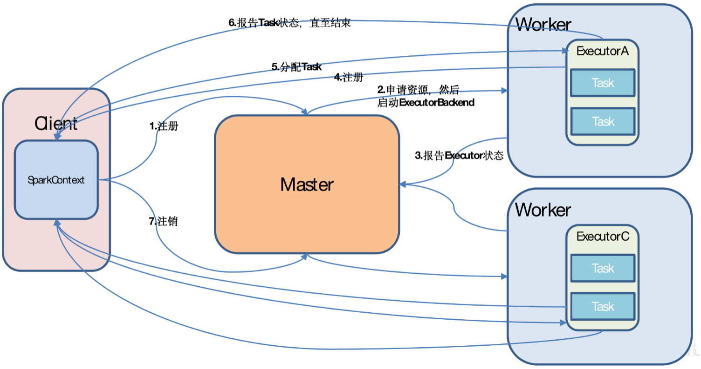

- 上传并解压spark安装包spark-2.1.1-bin-hadoop2.7.tgz到k1  ->**此步已完成**

- 进入spark安装目录下的conf文件夹

- 修改配置文件名称

  ```sh
  mv slaves.template slaves
  
  mv spark-env.sh.template spark-env.sh
  ```

- 修改slave文件，添加work节点：

  ```sh
  vi slaves
  
  k1
  
  k2
  
  k3
  ```

  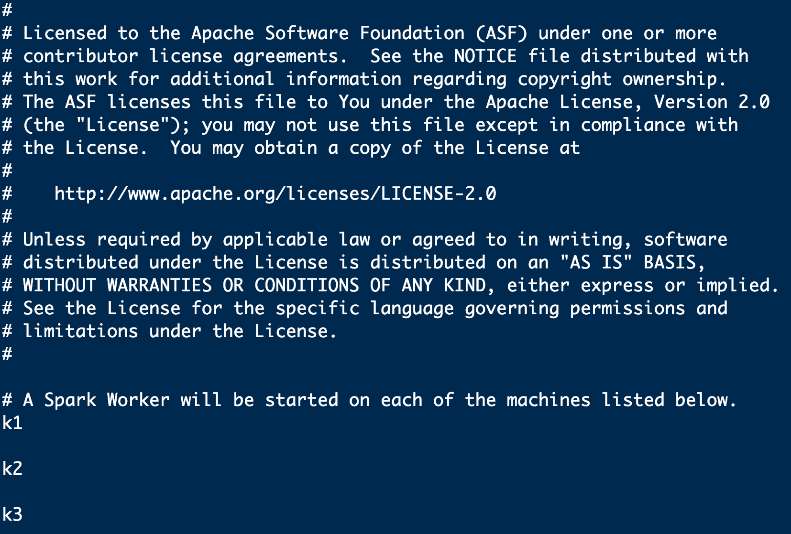

- 修改spark-env.sh文件，添加如下配置： 

  

  ```sh
  vi spark-env.sh
  
  SPARK_MASTER_HOST=k1
  SPARK_MASTER_PORT=7077       #服务端口
  ```

  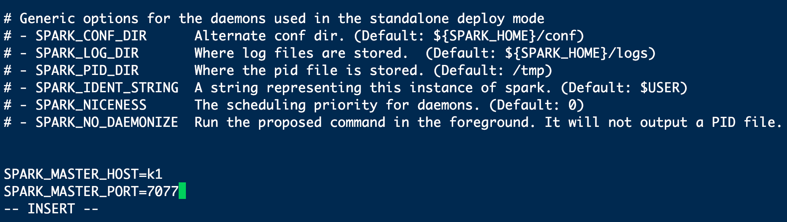

- 分发spark包

  ```sh
  #回到module目录下
  cd /opt/module
  
  xsync spark/
  
  #查看k2,k3
  ```

- 启动

  ```sh
  cd /spark/sbin
  
  start-all.sh
  ```

  - 报错

    ```sh
    failed to launch: nice -n 0 /opt/module/spark/bin/spark-class org.apache.spark.deploy.worker.Worker --webui-port 8081 spark://k1:7077
    k1:   JAVA_HOME is not set
    
    注意：如果遇到 “JAVA_HOME not set” 异常，可以在conf目录下的spark-env.sh 文件中加入如下配置：
    export JAVA_HOME=XXXX
    
    如下
    export JAVA_HOME=/opt/module/jdk1.8
    
    
    查询命令
    linux：
    whereis java
    which java （java执行路径）
    echo $JAVA_HOME
    
    echo $PATH
    /opt/module/jdk1.8.0_144
    #如果不好使在配置下面
    vi /root/.bashrc
    export JAVA_HOME=/opt/module/jdk1.8
    
    #如果出现输入密码，请重新配置ssh
    
    ```

  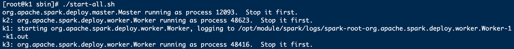

  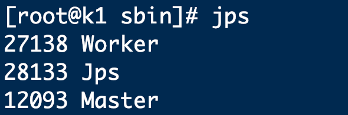


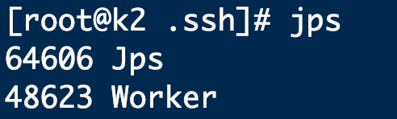

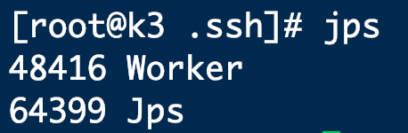

- http://k1:8080/

  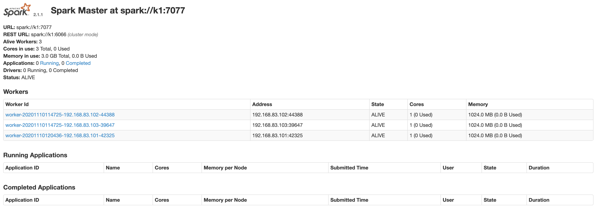

- 提交任务&执行程序

  ```sh
  bin/spark-submit \
  --class org.apache.spark.examples.SparkPi \
  --master spark://k1:7077 \
  --executor-memory 1G \
  --total-executor-cores 2 \
  ./examples/jars/spark-examples_2.11-2.1.1.jar \
  100
  ```

- 启动spark shell

```sh
bin/spark-shell --master spark://k1:7077
```


**注意：**如果启动spark shell时没有指定master地址，但是也可以正常启动spark shell和执行spark shell中的程序，其实是启动了spark的local模式，该模式仅在本机启动一个进程，没有与集群建立联系。

Spark Shell中已经默认将SparkContext类初始化为对象sc。用户代码如果需要用到，则直接应用sc即可      

```sh
scala> sc.textFile("./RELEASE").flatMap(_.split(" ")).map((_,1)).reduceByKey(_+_).collect
```


## 使用IEDA开发工具开发WordCount

创建一个Maven项目WordCount并导入依赖(之前创建过的项目sparkDemo)

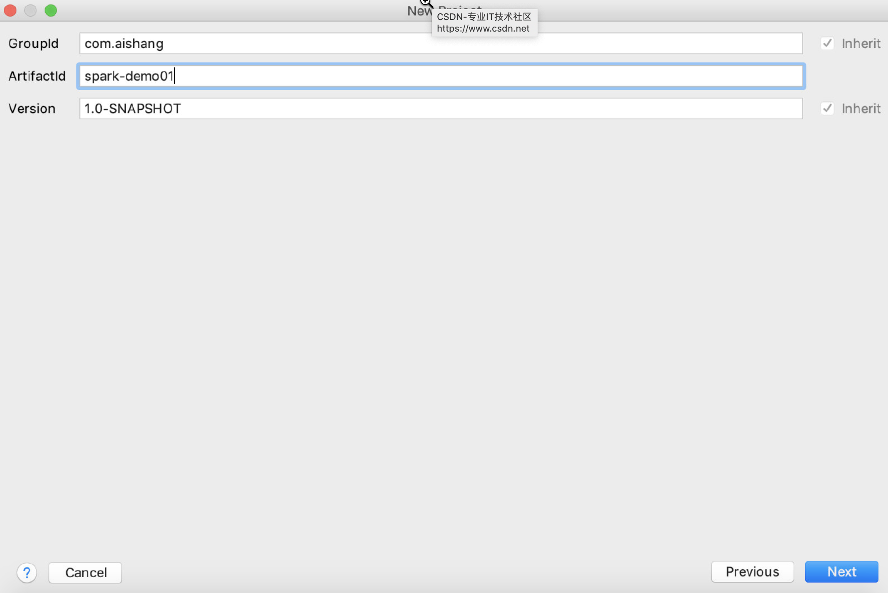

```xml
<dependencies>
    <dependency>
        <groupId>org.apache.spark</groupId>
        <artifactId>spark-core_2.11</artifactId>
        <version>2.1.1</version>
    </dependency>
</dependencies>
<build>
        <finalName>WordCount</finalName>
        <plugins>
<plugin>
                <groupId>net.alchim31.maven</groupId>
<artifactId>scala-maven-plugin</artifactId>
                <version>3.2.2</version>
                <executions>
                    <execution>
                       <goals>
                          <goal>compile</goal>
                          <goal>testCompile</goal>
                       </goals>
                    </execution>
                 </executions>
            </plugin>
            <plugin>
                <groupId>org.apache.maven.plugins</groupId>
                <artifactId>maven-assembly-plugin</artifactId>
                <version>3.0.0</version>
                <configuration>
                    <archive>
                        <manifest>
                          <!--此处可修改，你的主程序类名-->
                            <mainClass>WordCount</mainClass>
                        </manifest>
                    </archive>
                    <descriptorRefs>
                        <descriptorRef>jar-with-dependencies</descriptorRef>
                    </descriptorRefs>
                </configuration>
                <executions>
                    <execution>
                        <id>make-assembly</id>
                        <phase>package</phase>
                        <goals>
                            <goal>single</goal>
                        </goals>
                    </execution>
                </executions>
            </plugin>
        </plugins>
</build>
```

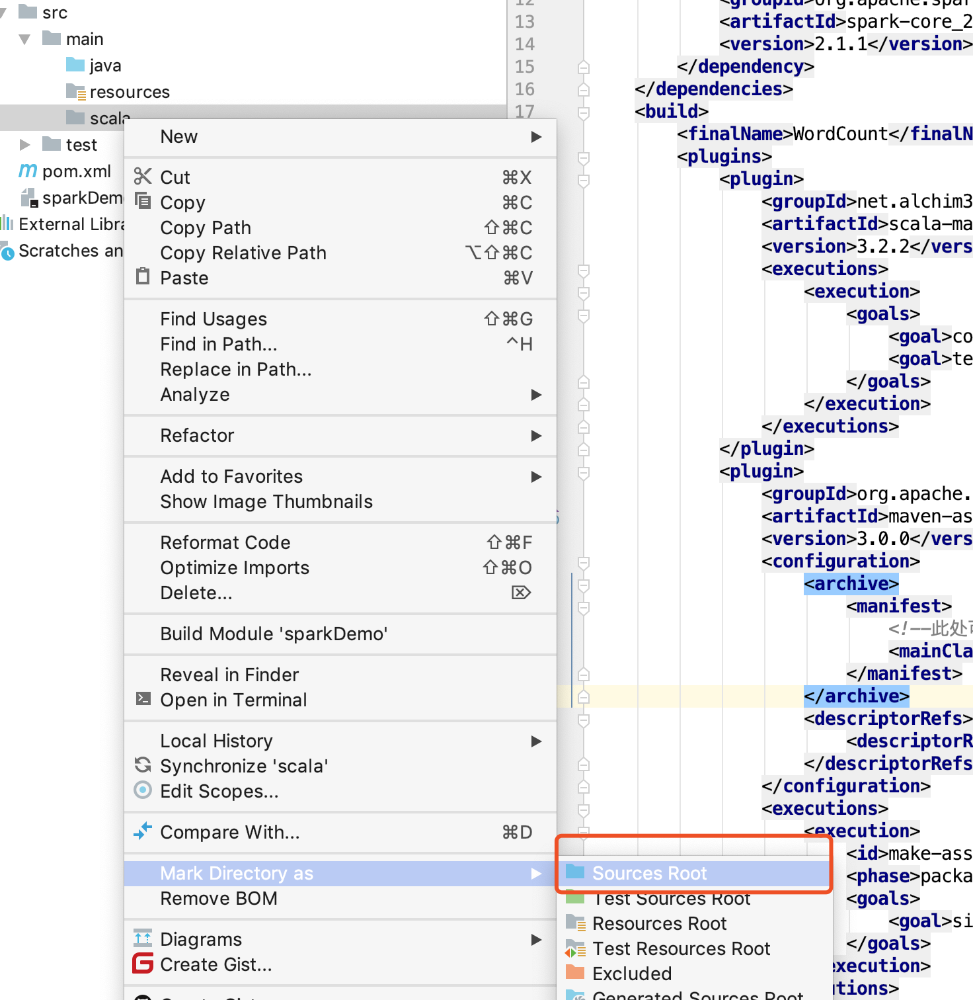

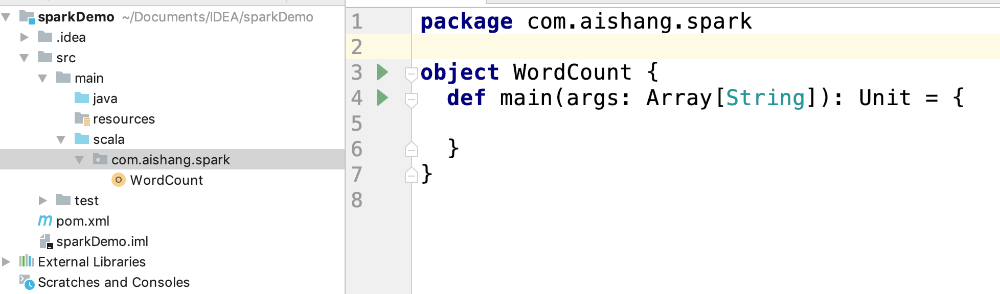

```scala
package com.aishang.spark

import org.apache.spark.{SparkConf, SparkContext}

object WordCount {
  def main(args: Array[String]): Unit = {
    //    创建配置信息
    val conf = new SparkConf().setAppName("wc")
    //    创建sparkcontext
    val sc = new SparkContext(conf)
    //    处理,读取数据
    val lines = sc.textFile("input")
    //    压平
    val words = lines.flatMap(_.split(" "))
    //    map(word,1)
    val k2v = words.map((_, 1))
    //    reduceByKey(word,x)
    val result = k2v.reduceByKey(_ + _).collect()
    result.foreach(println)
    //    关闭连接
    sc.stop()
  }
}

```

- 打包，放到集群上运行

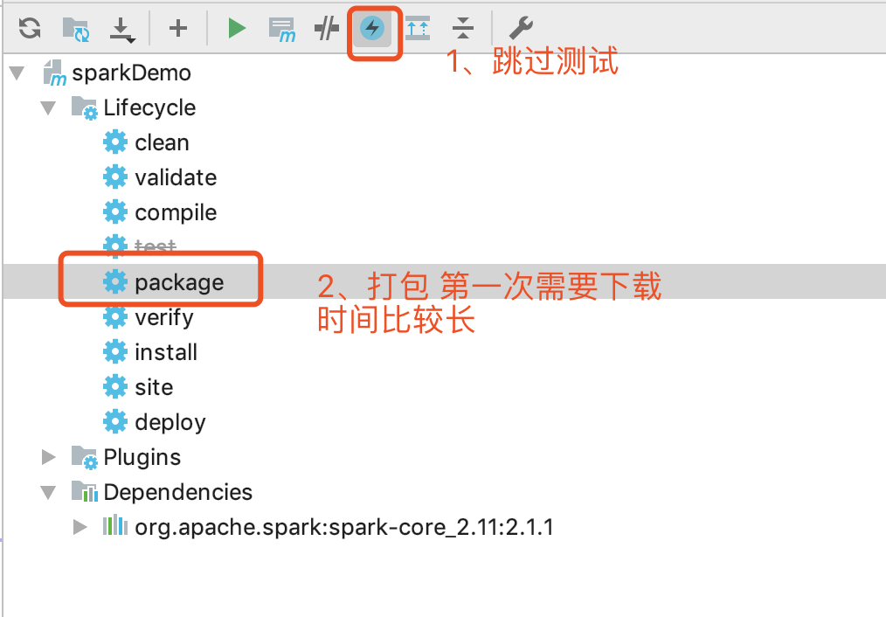

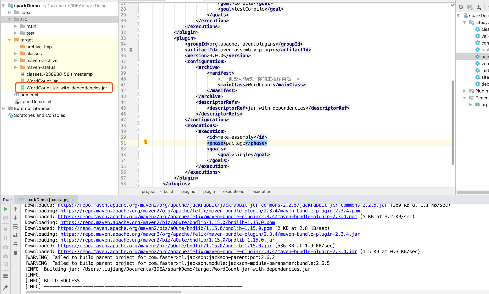

上传到spark文件夹内，执行下面命令

```sh
bin/spark-submit --class com.aishang.spark.WordCount --master spark://k1:7077 WordCount-jar-with-dependencies.jar
```

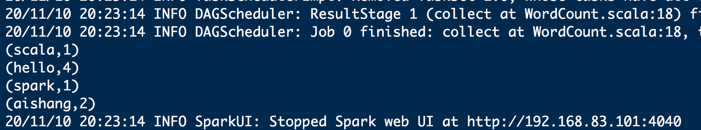

## 本地测试

必须联网否则报错

```scala
package com.aishang

import org.apache.spark.{SparkConf, SparkContext}

object WordCount {
  def main(args: Array[String]): Unit = {
    //    创建配置信息
    val conf = new SparkConf().setAppName("wc").setMaster("local[*]")
    //    创建sparkcontext
    val sc = new SparkContext(conf)
    //    处理,读取数据
    val lines = sc.textFile("/Users/liujiang/Documents/hadoop-test-txt/one/hello.txt")
    //    压平
    val words = lines.flatMap(_.split(" "))
    //    map(word,1)
    val k2v = words.map((_, 1))
    //    reduceByKey(word,x)
    val result = k2v.reduceByKey(_+_)
    result.foreach(println)
    //    关闭连接
    sc.stop()

  }
}


```

- 直接运行程序，本地测试用

#  第三天SparkCore

## 1、RDD概念 弹性分布式数据集

RDD是Spark的基石，是实现Spark数据处理的核心抽象。那么RDD为什么会产生呢？

Hadoop的MapReduce是一种基于数据集的工作模式，面向数据，这种工作模式一般是从存储上加载数据集，然后操作数据集，最后写入物理存储设备。数据更多面临的是一次性处理。

MR的这种方式对数据领域两种常见的操作不是很高效。第一种是迭代式的算法。比如机器学习中ALS、凸优化梯度下降等。这些都需要基于数据集或者数据集的衍生数据反复查询反复操作。MR这种模式不太合适，即使多MR串行处理，性能和时间也是一个问题。数据的共享依赖于磁盘。另外一种是交互式数据挖掘，MR显然不擅长。

MR中的迭代：

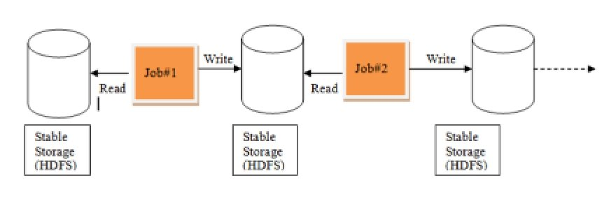 

Spark中的迭代：

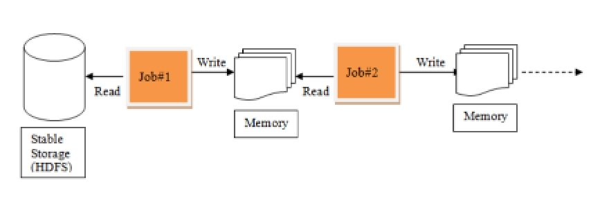 

我们需要一个效率非常快，且能够支持迭代计算和有效数据共享的模型，Spark应运而生。

## 2、什么是RDD

RDD（Resilient Distributed Dataset）叫做分布式数据集，是Spark中最基本的数据抽象。代码中是一个抽象类，它代表一个不可变、可分区、里面的元素可并行计算的集合。

## 3、RDD的属性

- 一组分片（Partition），即数据集的基本组成单位。对于RDD来说，每个分片都会被一个计算任务处理，并决定并行计算的粒度。用户可以在创建RDD时指定RDD的分片个数，如果没有指定，那么就会采用默认值。默认值就是程序所分配到的CPU Core的数目。
- 一个计算每个分区的函数。Spark中RDD的计算是以分片为单位的。
- RDD之间的依赖关系。RDD的每次转换都会生成一个新的RDD，所以RDD之间就会形成类似于流水线一样的前后依赖关系。在部分分区数据丢失时，Spark可以通过这个依赖关系重新计算丢失的分区数据，而不是对RDD的所有分区进行重新计算。
- 一个Partitioner，即RDD的分片函数。当前Spark中实现了两种类型的分片函数，一个是基于哈希的HashPartitioner，另外一个是基于范围的RangePartitioner。只有对于于key-value的RDD，才会有Partitioner，非key-value的RDD的Parititioner的值是None。Partitioner函数不但决定了RDD本身的分片数量，也决定了parent RDD Shuffle输出时的分片数量。
- 一个列表，存储存取每个Partition的优先位置（preferred location）。对于一个HDFS文件来说，这个列表保存的就是每个Partition所在的块的位置。按照“移动数据不如移动计算”的理念，Spark在进行任务调度的时候，会尽可能地将计算任务分配到其所要处理数据块的存储位置。

## 4、RDD特点

RDD表示只读的分区的数据集，对RDD进行改动，只能通过RDD的转换操作，由一个RDD得到一个新的RDD，新的RDD包含了从其他RDD衍生所必需的信息。RDD之间存在依赖，RDD的执行是按照血缘关系延时计算的。如果血缘关系较长，可以通过持久化RDD来切断血缘关系。

## 5、分区

RDD逻辑上是分区的，每个分区的数据是抽象存在的，计算的时候会通过一个compute函数得到每个分区的数据。如果RDD是通过已有的文件系统构建，则compute函数是读取指定文件系统中的数据，如果RDD是通过其他RDD转换而来，则compute函数是执行转换逻辑将其他RDD的数据进行转换。

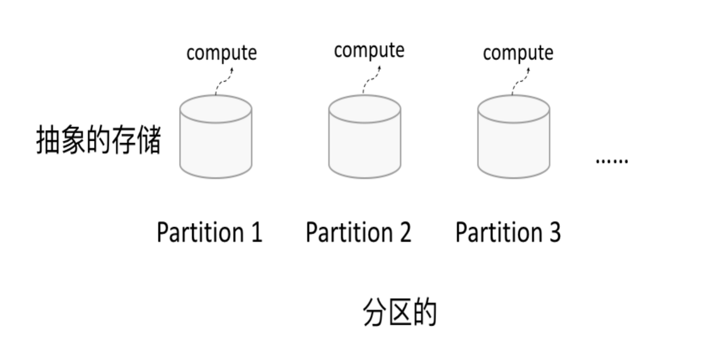

## 6、只读

如下图所示，RDD是只读的，要想改变RDD中的数据，只能在现有的RDD基础上创建新的RDD。

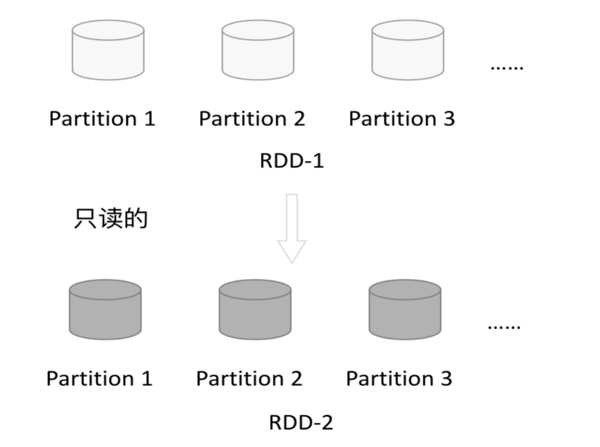 

 由一个RDD转换到另一个RDD，可以通过丰富的操作算子实现，不再像MapReduce那样只能写map和reduce了，如下图所示。

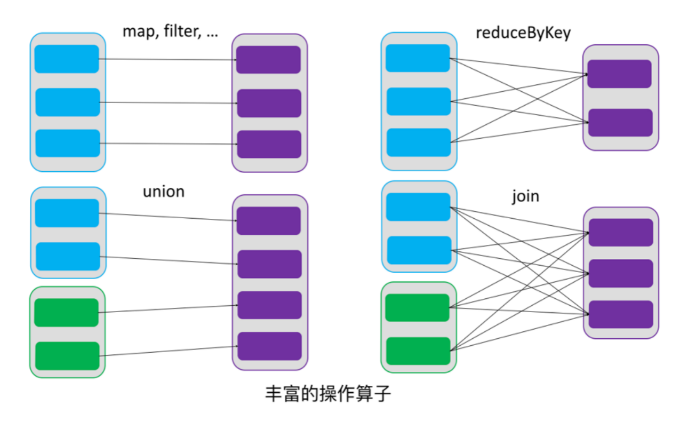

 RDD的操作算子包括两类，一类叫做transformations，它是用来将RDD进行转化，构建RDD的血缘关系；另一类叫做actions，它是用来触发RDD的计算，得到RDD的相关计算结果或者将RDD保存的文件系统中。 

#### 转换算子和行动算子，具体后面详细讲解

## 7、依赖

RDD通过操作算子进行转换，转换得到的新RDD包含了从其他RDD衍生所必需的信息，RDD之间维护着这种血缘关系，也称之为依赖。如下图所示，依赖包括两种，一种是窄依赖，RDD之间分区是一一对应的，另一种是宽依赖，下游RDD的每个分区与上游RDD(也称之为父RDD)的每个分区都有关，是多对多的关系。

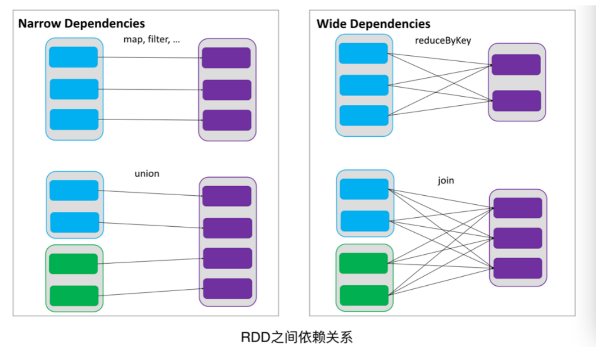 

## 8、**缓存**

如果在应用程序中多次使用同一个RDD，可以将该RDD缓存起来，该RDD只有在第一次计算的时候会根据血缘关系得到分区的数据，在后续其他地方用到该RDD的时候，会直接从缓存处取而不用再根据血缘关系计算，这样就加速后期的重用。如下图所示，RDD-1经过一系列的转换后得到RDD-n并保存到hdfs，RDD-1在这一过程中会有个中间结果，如果将其缓存到内存，那么在随后的RDD-1转换到RDD-m这一过程中，就不会计算其之前的RDD-0了。

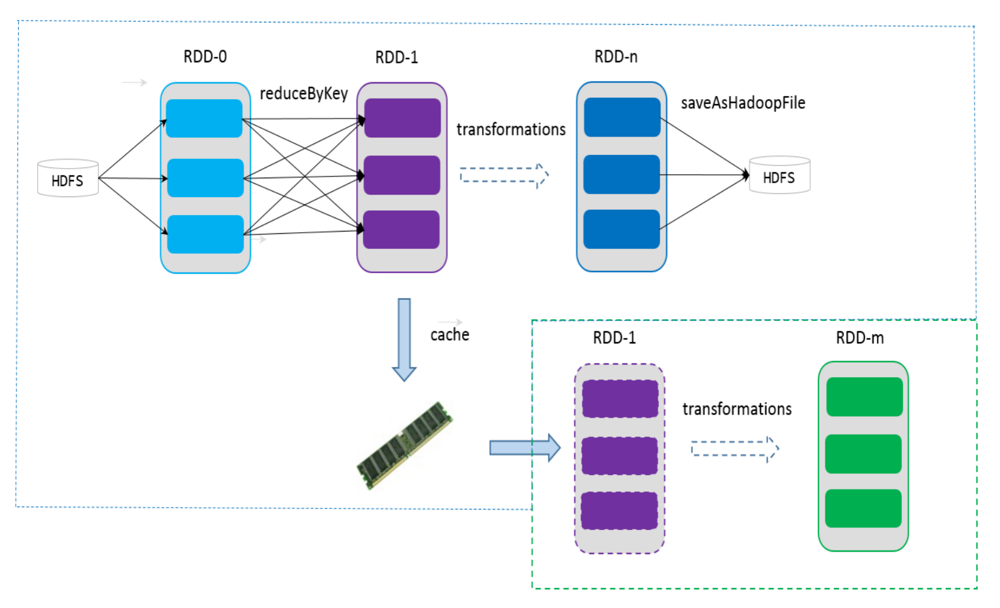 

## 9、CheckPoint

虽然RDD的血缘关系天然地可以实现容错，当RDD的某个分区数据失败或丢失，可以通过血缘关系重建。但是对于长时间迭代型应用来说，随着迭代的进行，RDD之间的血缘关系会越来越长，一旦在后续迭代过程中出错，则需要通过非常长的血缘关系去重建，势必影响性能。为此，RDD支持checkpoint将数据保存到持久化的存储中，这样就可以切断之前的血缘关系，因为checkpoint后的RDD不需要知道它的父RDD了，它可以从checkpoint处拿到数据。

### 给定一个RDD我们至少可以知道如下几点信息：

#### 1、分区数以及分区方式；

#### 2、由父RDD衍生而来的相关依赖信息；

#### 3、计算每个分区的数据，计算步骤为：

##### 	1）如果被缓存，则从缓存中取的分区的数据；

##### 	2）如果被checkpoint，则从checkpoint处恢复数据；

##### 	3）根据血缘关系计算分区的数据。

## 10、RDD编程

在Spark中，RDD被表示为对象，通过对象上的方法调用来对RDD进行转换。经过一系列的transformations定义RDD之后，就可以调用actions触发RDD的计算，action可以是向应用程序返回结果(count, collect等)，或者是向存储系统保存数据(saveAsTextFile等)。在Spark中，只有遇到action，才会执行RDD的计算(即延迟计算)，这样在运行时可以通过管道的方式传输多个转换。

## 11、RDD转换

##### RDD整体上分为Value类型和Key-Value类型

### Value类型

#### map(func)

- 作用：返回一个新的RDD，该RDD由每一个输入元素经过func函数转换后组成
- 需求：创建一个1-10数组的RDD，将所有元素*2形成新的RDD

```sh
val conf = new SparkConf().setMaster("local[*]").setAppName("aa")
val sc = new SparkContext(conf)
val arr = sc.makeRDD(1 to 10)
val rdd = arr.map(x => x * 2)
rdd.collect().foreach(println)
```

#### flatMap(func)

- 作用：类似于map，但是每一个输入元素可以被映射为0或多个输出元素（所以func应该返回一个序列，而不是单一元素）

```sh
val conf = new SparkConf().setMaster("local[*]").setAppName("aa")
val sc = new SparkContext(conf)
val arr = sc.makeRDD(Array(1,2,3,4,5))
val rdd = arr.flatMap(1 to _)
rdd.collect().foreach(println)
#相当于从1到1，从1到2，从1到3
1 12 123 1234 12345
```

#### groupBy(func)

- 作用：分组，按照传入函数的返回值进行分组。将相同的key对应的值放入一个迭代器。
- 需求：创建一个RDD，按照元素模以2的值进行分组。

```scala
val conf = new SparkConf().setMaster("local[*]").setAppName("aa")
val sc = new SparkContext(conf)
val arr = sc.makeRDD(1 to 10)
val rdd = arr.groupBy(_%2)
rdd.collect().foreach(println)
//结果
(0,CompactBuffer(2, 4, 6, 8, 10))
(1,CompactBuffer(1, 3, 5, 7, 9))
```

#### filter(func)

- 作用：过滤。返回一个新的RDD，该RDD由经过func函数计算后返回值为true的输入元素组成。
- 需求：创建一个RDD（由字符串组成），过滤出一个新RDD（包含”xiao”子串）

```scala
val conf = new SparkConf().setMaster("local[*]").setAppName("aa")
val sc = new SparkContext(conf)
val arr = sc.makeRDD(Array("xiaoming","xiaojiang","xiaohe","dazhi"))
val rdd = arr.filter(_.contains("xiao"))
rdd.collect().foreach(println)
//结果
xiaoming
xiaojiang
xiaohe
```

#### sortBy(func,[ascending], [numTasks])

- 作用；使用func先对数据进行处理，按照处理后的数据比较结果排序，默认为正序。
- 需求：创建一个RDD，按照不同的规则进行排序

```scala
//升序
val conf = new SparkConf().setMaster("local[*]").setAppName("aa")
val sc = new SparkContext(conf)
val arr = sc.makeRDD(List(43,1,34,43,1,3))
val rdd = arr.sortBy(x=>x)
rdd.collect().foreach(println)

//降序
val conf = new SparkConf().setMaster("local[*]").setAppName("aa")
val sc = new SparkContext(conf)
val arr = sc.makeRDD(List(43,1,34,43,1,3))
val rdd = arr.sortBy(x=>x,false)
rdd.collect().foreach(println)
```

### Key-Value类型

#### groupByKey

-  作用：groupByKey也是对每个key进行操作，但只生成一个sequence。
-  需求：创建一个pairRDD，将相同key对应值聚合到一个sequence中，并计算相同key对应值的相加结果。

```scala
val conf = new SparkConf().setMaster("local[*]").setAppName("aa")
val sc = new SparkContext(conf)
val arr = sc.makeRDD(Array("one", "two", "two", "three", "three", "three"))
val map = arr.map(x => (x, 1))
val tuples = map.groupByKey()
/*
* (three,CompactBuffer(1, 1, 1))
(two,CompactBuffer(1, 1))
(one,CompactBuffer(1))
* */
val unit = tuples.map(x => (x._1, x._2.sum))
unit.foreach(println)
/**
* (one,1)
* (two,2)
* (three,3)
*/
```

#### reduceByKey(func, [numTasks])

在一个(K,V)的RDD上调用，返回一个(K,V)的RDD，使用指定的reduce函数，将相同key的值聚合到一起，reduce任务的个数可以通过第二个可选的参数来设置

```sh
val conf = new SparkConf().setMaster("local[*]").setAppName("aa")
val sc = new SparkContext(conf)
val arr = sc.makeRDD(List(("female",1),("male",5),("female",5),("male",2)))
val res = arr.reduceByKey((x,y)=>x+y).collect()
res.foreach(println)
```

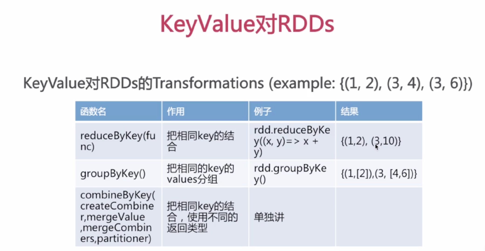

#### sortByKey([ascending], [numTasks])

在一个(K,V)的RDD上调用，K必须实现Ordered接口，返回一个按照key进行排序的(K,V)的RDD

```scala
val conf = new SparkConf().setMaster("local[*]").setAppName("aa")
val sc = new SparkContext(conf)
val arr = sc.makeRDD(Array((3,"aa"),(6,"cc"),(2,"bb"),(1,"dd")))
val res = arr.sortByKey().collect()
res.foreach(println)
println("----------")
var res1 = arr.sortByKey(false).collect()
res1.foreach(println)
```

#### mapValues

针对于(K,V)形式的类型只对V进行操作

```sh
val conf = new SparkConf().setMaster("local[*]").setAppName("aa")
val sc = new SparkContext(conf)
val arr = sc.makeRDD(Array((1,"a"),(1,"d"),(2,"b"),(3,"c")))
val res = arr.mapValues(_+"|||").collect()
res.foreach(println)
```

### 案例

数据结构：时间戳，省份，城市，用户，广告，中间字段使用空格分割

```sh
1516609143867 黑龙江 哈尔滨 tom 华为
1516609143869 黑龙江 哈尔滨 tom apple
1516609143869 黑龙江 哈尔滨 lisi xiaomi
1516609143867 黑龙江 哈尔滨 jerry 华为
1516609143867 黑龙江 哈尔滨 eric apple
1516609143867 黑龙江 哈尔滨 wangwu 华为
1516609143867 黑龙江 哈尔滨 tom xiaomi
1516609143867 黑龙江 哈尔滨 tom oppo
1516609143867 黑龙江 哈尔滨 tom 华为
1516609143860 黑龙江 哈尔滨 tom xiaomi
1516609143867 吉林 长春 tom LG
1516609143869 吉林 长春 tom vivo
1516609143869 吉林 吉林 lisi vivo
1516609143867 吉林 长春 jerry vivo
1516609143867 吉林 长春 eric vivo
1516609143867 吉林 吉林 wangwu 西门子
1516609143867 吉林 长春 tom xiaomi
1516609143867 吉林 长春 tom 西门子
1516609143867 吉林 吉林 tom 华为
1516609143860 吉林 长春 tom xiaomi
1516609143867 辽宁 沈阳 tom 联想
1516609143869 辽宁 沈阳 tom 华为
1516609143869 辽宁 沈阳 lisi Mac
1516609143867 辽宁 大连 jerry 华硕
1516609143867 辽宁 大连 eric Mac
1516609143867 辽宁 大连 wangwu Mac
1516609143867 辽宁 大连 tom Mac
1516609143867 辽宁 大连 tom 联想
1516609143867 辽宁 大连 tom 联想
1516609143867 辽宁 大连 tom 华硕
```

需求：统计出每一个省份广告被点击次数的TOP

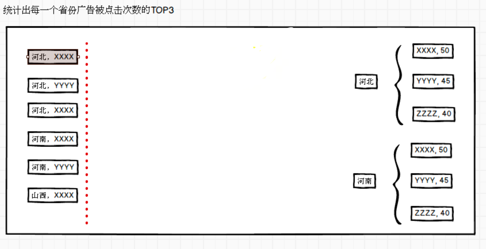

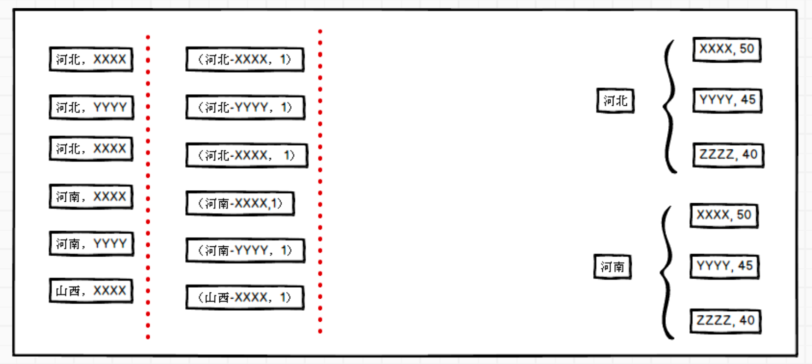

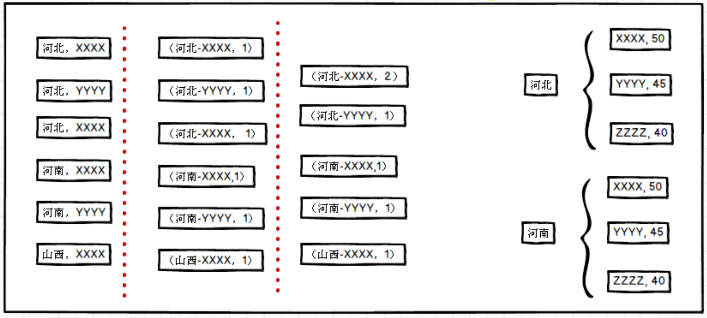

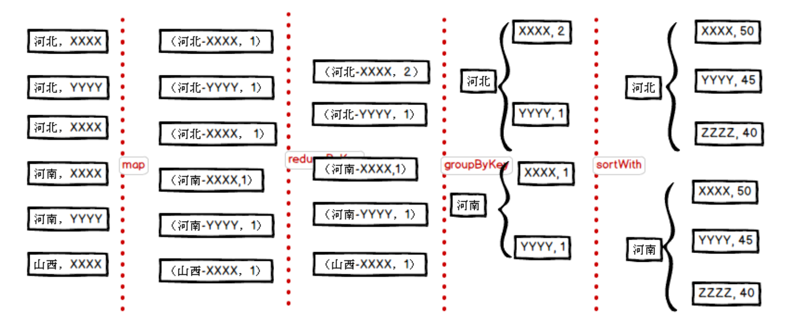

```sh
（1）Scala中sortBy是以方法的形式存在的,并且是作用在Array或List集合排序上,并且这个sortBy默认只能升序,除非实现隐式转换或调用reverse方法才能实现降序。

（2）sortWith可以通过制定规则进行升降序排序。

val mapvalues2: RDD[(String, List[(String, Int)])] =

groupbykey.mapValues(x=>x.toList.sortWith(_._2>_._2).take(3))
```

```scala
package com.aishang.spark

import org.apache.spark.{SparkConf, SparkContext}

object RDD {
  def main(args: Array[String]): Unit = {
    val conf = new SparkConf().setMaster("local[*]").setAppName("aa")
    val sc = new SparkContext(conf)
    val line = sc.textFile("/Users/liujiang/Documents/hadoop-test-txt/rddtop3.log")
    var tup = line.map(x => {
      val strings = x.split(" ");
      ((strings(1), strings(4)), 1)
    })
    //    tup.collect().foreach(println)
    //    ((黑龙江,华为),1)
    val tupToSum = tup.reduceByKey(_ + _)
    //    tupToSum.foreach(println)
    //    ((黑龙江,华为),4)
    //    将省份作为key，广告加点击数为value
    val map = tupToSum.map(x => (x._1._1, (x._1._2, x._2)))
    //    map.foreach(println)
    //    (黑龙江,(华为,4))
    val mapGroup = map.groupByKey()
    //    mapGroup.foreach(println)
    //    (黑龙江,CompactBuffer((apple,2), (oppo,1), (华为,4), (xiaomi,3)))
    //    (辽宁,CompactBuffer((华为,1), (联想,3), (Mac,4), (华硕,2)))
    //    (吉林,CompactBuffer((西门子,2), (LG,1), (xiaomi,2), (vivo,4), (华为,1)))
    //    对同一个省份所有广告的集合进行排序并取前3条，排序规则为广告点击总数
    val result = mapGroup.mapValues(x => {
      x.toList.sortWith((x, y) => x._2 < y._2).take(3)
    })
    result.foreach(println)
    //    (黑龙江,List((华为,4), (xiaomi,3), (apple,2)))
    //    (辽宁,List((Mac,4), (联想,3), (华硕,2)))
    //    (吉林,List((vivo,4), (西门子,2), (xiaomi,2)))
  }

}
```

## 12、Action

行动算子

#### collect()

在驱动程序中，以数组的形式返回数据集的所有元素

```scala
val conf = new SparkConf().setMaster("local[*]").setAppName("aa")
val sc = new SparkContext(conf)
val rdd = sc.makeRDD(1 to 100)
val arr: Array[Int] = rdd.collect()
arr.foreach(println)
```

#### count()

返回RDD的元素个数

#### first()

返回RDD的第一个元素（类似于take(1)）

#### take(n)

返回一个由数据集的前n个元素组成的数组

#### saveAsTextFile(path)

将数据集的元素以textfile的形式保存到HDFS文件系统或者其他支持的文件系统，对于每个元素，Spark将会调用toString方法，将它装换为文件中的文本

#### countByKey()

针对(K,V)类型的RDD，返回一个(K,Int)的map，表示每一个key对应的元素个数。

```sh
scala> val rdd = sc.parallelize(List((1,3),(1,2),(1,4),(2,3),(3,6),(3,8)),3)
rdd: org.apache.spark.rdd.RDD[(Int, Int)] = ParallelCollectionRDD[95] at parallelize at <console>:24

scala> rdd.countByKey()
res63: scala.collection.Map[Int,Long] = Map(3 -> 2, 1 -> 3, 2 -> 1)
```

#### foreach(func)

在数据集的每一个元素上，运行函数func进行更新。

```sh
scala> var rdd = sc.makeRDD(1 to 10,2)
rdd: org.apache.spark.rdd.RDD[Int] = ParallelCollectionRDD[107] at makeRDD at <console>:24

scala> var sum = sc.accumulator(0)
warning: there were two deprecation warnings; re-run with -deprecation for details
sum: org.apache.spark.Accumulator[Int] = 0

scala> rdd.foreach(sum+=_)

scala> sum.value
res68: Int = 55

scala> rdd.collect().foreach(println)
1
2
3
4
5
6
7
8
9
10
```

### 4、累加器

```scala
import org.apache.spark.{SparkConf, SparkContext}

object CountTest {
  def main(args: Array[String]): Unit = {
    val sparkConf = new SparkConf().setAppName("TopN").setMaster("local[*]")
    val sc = new SparkContext(sparkConf)


    val rdd = sc.makeRDD(Array(1, 2, 3))
    var sum = 0
    rdd.foreach(x => {
      sum = sum + 1
      println("sum=" + sum)
      /*
      sum=1
      sum=1
      sum=1
       */
    })
    println(sum)//0
    sc.stop()
  }
}


  val rdd = sc.makeRDD(Array(1, 2, 3))
    val sum = sc.accumulator(0)
    rdd.foreach(x=>sum+=2)
    println(sum)//6
    sc.stop()
```

- 自定义累加器

```scala
import java.util
 
import org.apache.spark.util.AccumulatorV2
 
class LogAccumulator extends AccumulatorV2[String, java.util.Set[String]] {
  private val _logArray: java.util.Set[String] = new java.util.HashSet[String]()
 
  override def isZero: Boolean = {
    _logArray.isEmpty
  }
 
  override def reset(): Unit = {
    _logArray.clear()
  }
 
  override def add(v: String): Unit = {
    _logArray.add(v)
  }
 
  override def merge(other: AccumulatorV2[String, java.util.Set[String]]): Unit = {
    other match {
      case o: LogAccumulator => _logArray.addAll(o.value)
    }
 
  }
 
  override def value: java.util.Set[String] = {
    java.util.Collections.unmodifiableSet(_logArray)
  }
 
  override def copy(): AccumulatorV2[String, util.Set[String]] = {
    val newAcc = new LogAccumulator()
    _logArray.synchronized{
      newAcc._logArray.addAll(_logArray)
    }
    newAcc
  }
}
```


### 5、foldLeft

```scala
val lst = List(20,30,60,90)
    //0为初始值，b表示返回结果对象（迭代值），a表示lst集合中的每个值
    val rs = lst.foldLeft(0)((b,a)=>{
      b+a
    })


运行过程为：b=0+a，即0+20=20
b=20+a，即20+30=50
b=50+a，即50+60=110
b=110+a，即110+90=200
此处的a为循环取出集合中的值
最终结果: rs=200

override def merge(other:AccumulatorV2[String,mutable.HashMap[String,Int]]): Unit = {
    other match {
      case  acc:SessionStatAccumulator=>
        acc.countMap.foldLeft(this.countMap){
            //map是迭代的值，(k,v)是集合里的值
          case (map,(k,v))=>map+=(k->(map.getOrElse(k,0)+v))
        }
    }
  }
```

```scala
import commons.utils.DateUtils

object Demo {
  def main(args: Array[String]): Unit = {
    //合并两个Map集合对象（将两个对应KEY的值累加）
    val m1 = Map(
      "a"->1,
      "b"->2,
      "c"->3
    )
    val m2 = Map(
      "x"->10,
      "a"->20,
      "z"->30
    )
    //Map的折叠函数是依次传入Map的键值对。所以操作函数希望传入的操作数可以是（K,V）形式。。于是用case表达式：(map, (k,v))
    var rdd = m2.foldLeft(m1){
      case (map, (k,v)) => map + ( k -> (v + map.getOrElse(k, 0)) )
    }

    print(rdd)//Map(x -> 10, a -> 21, b -> 2, c -> 3, z -> 30)

  }
}

```


```scala
import org.apache.spark.util.AccumulatorV2

import scala.collection.mutable

class SessionStatAccumulator extends AccumulatorV2[String,mutable.HashMap[String,Int]]{
  val countMap = new mutable.HashMap[String,Int]()
  override def isZero: Boolean = countMap.isEmpty

  override def copy(): AccumulatorV2[String,mutable.HashMap[String,Int]] = {
    val acc = new SessionStatAccumulator

    acc.countMap++=this.countMap  //往map集合里追加map集合
    acc
  }

  override def reset(): Unit = {
    countMap.clear()
  }

  override def add(v: String): Unit = {
    if(!countMap.contains(v)){
      countMap+=(v->0)
    }

    countMap.update(v,countMap(v)+1)
  }

  override def merge(other:AccumulatorV2[String,mutable.HashMap[String,Int]]): Unit = {
    other match {
      case  acc:SessionStatAccumulator=>
        acc.countMap.foldLeft(this.countMap){
          case (map,(k,v))=>map+=(k->(map.getOrElse(k,0)+v))
        }
    }
  }

  override def value: mutable.HashMap[String,Int] = {
    this.countMap
  }
}

```


# 第四天SparkSQL

