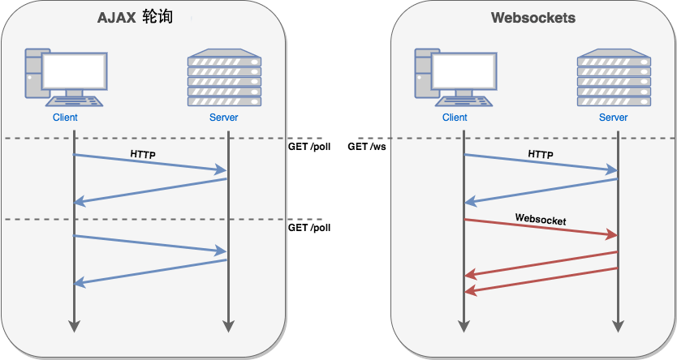

# HTML5 WebSocket

- WebSocket 是 HTML5 开始提供的一种在单个 TCP 连接上进行全双工通讯的协议。

- WebSocket 使得客户端和服务器之间的数据交换变得更加简单，允许服务端主动向客户端推送数据。在 WebSocket API 中，浏览器和服务器只需要完成一次握手，两者之间就直接可以创建持久性的连接，并进行双向数据传输。

- 在 WebSocket API 中，浏览器和服务器只需要做一个握手的动作，然后，浏览器和服务器之间就形成了一条快速通道。两者之间就直接可以数据互相传送。

- 现在，很多网站为了实现推送技术，所用的技术都是 Ajax 轮询。轮询是在特定的的时间间隔（如每1秒），由浏览器对服务器发出HTTP请求，然后由服务器返回最新的数据给客户端的浏览器。这种传统的模式带来很明显的缺点，即浏览器需要不断的向服务器发出请求，然而HTTP请求可能包含较长的头部，其中真正有效的数据可能只是很小的一部分，显然这样会浪费很多的带宽等资源。

- HTML5 定义的 WebSocket 协议，能更好的节省服务器资源和带宽，并且能够更实时地进行通讯。



- 浏览器通过 JavaScript 向服务器发出建立 WebSocket 连接的请求，连接建立以后，客户端和服务器端就可以通过 TCP 连接直接交换数据。

- 当你获取 Web Socket 连接后，你可以通过 **send()** 方法来向服务器发送数据，并通过 **onmessage** 事件来接收服务器返回的数据。

- 以下 API 用于创建 WebSocket 对象。

```js
var Socket = new WebSocket(url, [protocol] );
```

以上代码中的第一个参数 url, 指定连接的 URL。第二个参数 protocol 是可选的，指定了可接受的子协议。

## WebSocket 属性

以下是 WebSocket 对象的属性。假定我们使用了以上代码创建了 Socket 对象：

| 属性                  | 描述                                                         |
| --------------------- | ------------------------------------------------------------ |
| Socket.readyState     | 只读属性 **readyState** 表示连接状态，可以是以下值：0 - 表示连接尚未建立。1 - 表示连接已建立，可以进行通信。2 - 表示连接正在进行关闭。3 - 表示连接已经关闭或者连接不能打开。 |
| Socket.bufferedAmount | 只读属性 **bufferedAmount** 已被 send() 放入正在队列中等待传输，但是还没有发出的 UTF-8 文本字节数。 |

------

## WebSocket 事件

以下是 WebSocket 对象的相关事件。假定我们使用了以上代码创建了 Socket 对象：

| 事件    | 事件处理程序     | 描述                       |
| ------- | ---------------- | -------------------------- |
| open    | Socket.onopen    | 连接建立时触发             |
| message | Socket.onmessage | 客户端接收服务端数据时触发 |
| error   | Socket.onerror   | 通信发生错误时触发         |
| close   | Socket.onclose   | 连接关闭时触发             |

------

## WebSocket 方法

以下是 WebSocket 对象的相关方法。假定我们使用了以上代码创建了 Socket 对象：

| 方法           | 描述             |
| -------------- | ---------------- |
| Socket.send()  | 使用连接发送数据 |
| Socket.close() | 关闭连接         |

------

## WebSocket 实例

WebSocket 协议本质上是一个基于 TCP 的协议。

为了建立一个 WebSocket 连接，客户端浏览器首先要向服务器发起一个 HTTP 请求，这个请求和通常的 HTTP 请求不同，包含了一些附加头信息，其中附加头信息"Upgrade: WebSocket"表明这是一个申请协议升级的 HTTP 请求，服务器端解析这些附加的头信息然后产生应答信息返回给客户端，客户端和服务器端的 WebSocket 连接就建立起来了，双方就可以通过这个连接通道自由的传递信息，并且这个连接会持续存在直到客户端或者服务器端的某一方主动的关闭连接。

### 客户端的 HTML 和 JavaScript

目前大部分浏览器支持 WebSocket() 接口，你可以在以下浏览器中尝试实例： Chrome, Mozilla, Opera 和 Safari。

runoob_websocket.html 文件内容

```
<!DOCTYPE HTML>
<html>
   <head>
   <meta charset="utf-8">
   <title>菜鸟教程(runoob.com)</title>
    
      <script type="text/javascript">
         function WebSocketTest()
         {
            if ("WebSocket" in window)
            {
               alert("您的浏览器支持 WebSocket!");
               
               // 打开一个 web socket
               var ws = new WebSocket("ws://localhost:9998/echo");
                
               ws.onopen = function()
               {
                  // Web Socket 已连接上，使用 send() 方法发送数据
                  ws.send("发送数据");
                  alert("数据发送中...");
               };
                
               ws.onmessage = function (evt) 
               { 
                  var received_msg = evt.data;
                  alert("数据已接收...");
               };
                
               ws.onclose = function()
               { 
                  // 关闭 websocket
                  alert("连接已关闭..."); 
               };
            }
            
            else
            {
               // 浏览器不支持 WebSocket
               alert("您的浏览器不支持 WebSocket!");
            }
         }
      </script>
        
   </head>
   <body>
   
      <div id="sse">
         <a href="javascript:WebSocketTest()">运行 WebSocket</a>
      </div>
      
   </body>
</html>
```

## Springboot-h5websocket

pom

```xml
 <!--h5-websocket-->
        <dependency>
            <groupId>org.springframework.boot</groupId>
            <artifactId>spring-boot-starter-websocket</artifactId>
        </dependency>

    <!--net.sf.json.JSONObject-->
        <dependency>
            <groupId>net.sf.json-lib</groupId>
            <artifactId>json-lib</artifactId>
            <version>2.4</version>
            <classifier>jdk15</classifier>
        </dependency>
```

客户端与[服务器](https://www.baidu.com/s?wd=%E6%9C%8D%E5%8A%A1%E5%99%A8&tn=24004469_oem_dg&rsv_dl=gh_pl_sl_csd)建立WebSocket连接，实际上是创建了一个Socket,这个Socket是共享与客户端和服务器的。两者只要往对应的Socket里操作，就可以实现双方实时通讯了

### 第一种方式：三个java类

- Myhandle

  ```java
  package com.liujiang.shop.controller;
  
  import net.sf.json.JSONObject;
  import org.springframework.stereotype.Service;
  import org.springframework.web.socket.*;
  
  import java.io.IOException;
  import java.util.HashMap;
  import java.util.Map;
  import java.util.Set;
  
  @Service
  public class MyHandler implements WebSocketHandler {
      //在线用户列表
      private static final Map<String, WebSocketSession> users;
  
  
      static {
          users = new HashMap<>();
      }
      //新增socket
      @Override
      public void afterConnectionEstablished(WebSocketSession session) throws Exception {
          System.out.println("成功建立连接");
          String ID = session.getUri().toString().split("ID=")[1];
          System.out.println(ID);
          if (ID != null) {
              users.put(ID, session);
              session.sendMessage(new TextMessage("成功建立socket连接"));
              System.out.println(ID);
              System.out.println(session);
          }
          System.out.println("当前在线人数："+users.size());
      }
  
      //接收socket信息
      @Override
      public void handleMessage(WebSocketSession webSocketSession, WebSocketMessage<?> webSocketMessage) throws Exception {
          try{
              JSONObject jsonobject = JSONObject.fromObject(webSocketMessage.getPayload());
              System.out.println(jsonobject.get("id"));
              System.out.println(jsonobject.get("message")+":来自"+(String)webSocketSession.getAttributes().get("WEBSOCKET_USERID")+"的消息");
              sendMessageToUser(jsonobject.get("id")+"",new TextMessage("服务器收到了，hello!"));
          }catch(Exception e){
              e.printStackTrace();
          }
  
      }
  
      /**
       * 发送信息给指定用户
       * @param clientId
       * @param message
       * @return
       */
      public boolean sendMessageToUser(String clientId, TextMessage message) {
          if (users.get(clientId) == null) return false;
          WebSocketSession session = users.get(clientId);
          System.out.println("sendMessage:" + session);
          if (!session.isOpen()) return false;
          try {
              session.sendMessage(message);
          } catch (IOException e) {
              e.printStackTrace();
              return false;
          }
          return true;
      }
  
      /**
       * 广播信息
       * @param message
       * @return
       */
      public boolean sendMessageToAllUsers(TextMessage message) {
          boolean allSendSuccess = true;
          Set<String> clientIds = users.keySet();
          WebSocketSession session = null;
          for (String clientId : clientIds) {
              try {
                  session = users.get(clientId);
                  if (session.isOpen()) {
                      session.sendMessage(message);
                  }
              } catch (IOException e) {
                  e.printStackTrace();
                  allSendSuccess = false;
              }
          }
  
          return  allSendSuccess;
      }
  
  
      @Override
      public void handleTransportError(WebSocketSession session, Throwable exception) throws Exception {
          if (session.isOpen()) {
              session.close();
          }
          System.out.println("连接出错");
          users.remove(getClientId(session));
      }
  
  
  
      @Override
      public void afterConnectionClosed(WebSocketSession session, CloseStatus status) throws Exception {
          System.out.println("连接已关闭：" + status);
          users.remove(getClientId(session));
      }
  
      @Override
      public boolean supportsPartialMessages() {
          return false;
      }
  
      /**
       * 获取用户标识
       * @param session
       * @return
       */
      private Integer getClientId(WebSocketSession session) {
          try {
              Integer clientId = (Integer) session.getAttributes().get("WEBSOCKET_USERID");
              return clientId;
          } catch (Exception e) {
              return null;
          }
      }
  
  }
  
  ```

  1.实现了WebSocketHandler接口，并实现了关键的几个方法。

  ① afterConnectionEstablished（接口提供的）：建立新的socket连接后回调的方法。主要逻辑是：将成功建立连接的webSocketSssion放到定义好的常量[private static final Map<String, WebSocketSession> users;]中去。这里也截取客户端访问的URL的字符串，拿到标识，以键值对的形式讲每一个webSocketSession存到users里，以记录每个Socket。

  ② handleMessage（接口提供的）：接收客户端发送的Socket。主要逻辑是：获取客户端发送的信息。这里之所以可以获取本次Socket的ID，是因为客户端在第一次进行连接时，拦截器进行拦截后，设置好ID，这样也说明，双方在相互通讯的时候，只是对第一次建立好的socket持续进行操作。

  ③ sendMessageToUser（自己定义的）：发送给指定用户信息。主要逻辑是：根据用户ID从常量users(记录每一个Socket)中，获取Socket,往该Socket里发送消息，只要客户端还在线，就能收到该消息。

  ④sendMessageToAllUsers （自己定义的）：这个广播消息，发送信息给所有socket。主要逻辑是：跟③类型，只不过是遍历整个users获取每一个socket,给每一个socket发送消息即可完广播发送

  ⑤handleTransportError（接口提供的）：连接出错时，回调的方法。主要逻辑是：一旦有连接出错的Socket,就从users里进行移除，有提供该Socket的参数，可直接获取ID，进行移除。这个在客户端没有正常关闭连接时，会进来，所以在开发客户端时，记得关闭连接

  ⑥afterConnectionClosed（接口提供的）：连接关闭时，回调的方法。主要逻辑：一旦客户端/服务器主动关闭连接时，将个socket从users里移除，有提供该Socket的参数，可直接获取ID，进行移除。

- WebSocketH5Config 这是配置文件

  ```java
  package com.liujiang.shop.controller;
  
  
  import org.springframework.context.annotation.Configuration;
  import org.springframework.web.socket.config.annotation.EnableWebSocket;
  import org.springframework.web.socket.config.annotation.WebSocketConfigurer;
  import org.springframework.web.socket.config.annotation.WebSocketHandlerRegistry;
  
  import javax.websocket.*;
  import javax.websocket.server.ServerEndpoint;
  import java.io.IOException;
  import java.util.concurrent.CopyOnWriteArraySet;
  
  
  //实现接口来配置Websocket请求的路径和拦截器。
  @Configuration
  @EnableWebSocket
  public class WebSocketH5Config implements WebSocketConfigurer {
  
      @Override
      public void registerWebSocketHandlers(WebSocketHandlerRegistry registry) {
  
          //handler是webSocket的核心，配置入口
          registry.addHandler(new MyHandler(), "/myHandler/{ID}").setAllowedOrigins("*").addInterceptors(new WebSocketInterceptor());
  
      }
  
  
  }
  
  ```

  1.@Configuration：注解标识该类为Spring的配置类

  2.@EnableWebSocket：开启注解接收和发送消息

  ###### 3.实现WebSocketConfigurer接口，重写registerWebSocketHandlers方法，这是一个核心实现方法，配置websocket入口，允许访问的域、注册Handler、定义拦截器。客户端通过“/myHandler/{ID}”直接访问Handler核心类，进行socket的连接、接收、发送等操作，这里由于还加了个拦截器，所以建立新的socket访问时，都先进来拦截器再进去Handler类，“new WebSocketInterceptor()”是我实现的拦截器，“new MyHandler()”是我实现的一个Handler类。

- WebSocketInterceptor

```java
package com.liujiang.shop.controller;

import org.springframework.http.server.ServerHttpRequest;
import org.springframework.http.server.ServerHttpResponse;
import org.springframework.http.server.ServletServerHttpRequest;
import org.springframework.web.socket.WebSocketHandler;
import org.springframework.web.socket.server.HandshakeInterceptor;

import java.util.Map;

public class WebSocketInterceptor implements HandshakeInterceptor {
     //在握手之前执行该方法, 继续握手返回true, 中断握手返回false. 通过attributes参数设置WebSocketSession的属性

    @Override
    public boolean beforeHandshake(ServerHttpRequest request, ServerHttpResponse serverHttpResponse, WebSocketHandler webSocketHandler, Map<String, Object> attributes) throws Exception {
        if (request instanceof ServletServerHttpRequest) {
            String ID = request.getURI().toString().split("ID=")[1];
            System.out.println("当前session的ID=" + ID);
            //ServletServerHttpRequest serverHttpRequest = (ServletServerHttpRequest) request;
            //HttpSession session = serverHttpRequest.getServletRequest().getSession();
            attributes.put("WEBSOCKET_USERID", ID);
        }
        return true;

    }
//完成握手之后执行该方法
    @Override
    public void afterHandshake(ServerHttpRequest serverHttpRequest, ServerHttpResponse serverHttpResponse, WebSocketHandler webSocketHandler, Exception e) {
        System.out.println("进来webSocket的afterHandshake拦截器！");
    }
}

```

1.实现了HandshakeInterceptor 接口，并实现了beforeHandshake该方法，该方法是在进入Handler核心类之前进行拦截。

这里主要实现的逻辑是：

截取客户端建立webSocket连接时发送的URL地址字符串，并通过对该字符串进行特殊标识截取操作，获取客户端发送的唯一标识（由自己定义的，一般是系统用户ID唯一标识，用以标识该用户），并把它以键值对的形式放到Session里，这样后期可以通过该session获取它对应的用户ID了。【一个session对应着一个webSocketSession】

- html

  ```html
  
  <!DOCTYPE html>
  <html>
  <head>
      <title>socket.html</title>
  
      <meta name="keywords" content="keyword1,keyword2,keyword3">
      <meta name="description" content="this is my page">
      <meta name="content-type" content="text/html" charset="UTF-8">
      <!--<link rel="stylesheet" type="text/css" href="./styles.css">-->
  
  </head>
  
  <body>
  
  Welcome<br/>
  <input id="text" type="text" /><button onclick="send()">Send</button>    <button onclick="closeWebSocket()">Close</button>
  <div id="message">
  </div>
  <!-- 公共JS -->
      <script src="/assets/bower_components/jquery/dist/jquery.min.js"></script>
  
  
  <script type="text/javascript">
      var userID="888";
      var websocket=null;
      $(function() {
  
          //创建WebSocket
          connectWebSocket();
      })
  
      //强制关闭浏览器  调用websocket.close（）,进行正常关闭
      window.onunload = function() {
  
          //关闭连接
          closeWebSocket();
      }
  
      //建立WebSocket连接
      function connectWebSocket(){
  
          console.log("开始...");
  
          //建立webSocket连接
          websocket = new WebSocket("ws://127.0.0.1:8080/myHandler/ID="+userID);
  
          //打开webSokcet连接时，回调该函数
          websocket.onopen = function () {
              console.log("onpen");
          }
  
          //关闭webSocket连接时，回调该函数
          websocket.onclose = function () {
              //关闭连接
              console.log("onclose");
          }
  
          //接收信息
          websocket.onmessage = function (msg) {
              console.log(msg.data);
          }
      }
  
      //发送消息
      function send(){
          var postValue={};
          postValue.id=userID;
          postValue.message=$("#text").val();
          websocket.send(JSON.stringify(postValue));
      }
      //关闭连接
      function closeWebSocket(){
          if(websocket != null) {
              websocket.close();
          }
      }
  
  </script>
  </body>
  </html>
  
  ```

  

页面比较简单，简单解释一下：

1.new WebSocket("ws://127.0.0.1:9091/cloud-sbjm/myHandler/ID="+userID)，与服务器建立webSocket连接，后面的ID="+userID，是动态参数，跟服务器配置Handler的访问地址时对应"/myHandler/{ID}"。

2.H5也提供多个回调函数

onopen：打开webSokcet连接时，回调该函数

onclose：关闭webSocket连接时，回调该函数

onmessage：服务器给该socket发送消息时，回调该函数，获取消息

websocket.send(JSON.stringify(postValue));：给Socket发送消息，服务器获取

websocket.close();客户端主要关闭连接，会触发客户端的onclose方法和服务器的afterConnectionClosed方法

 

 

- 到此服务端的开发也完成了，下面执行一下程序效果图：

一、建立连接

客户端：

访问路径加项目名,这里我的电商不用加项目名

访问路径，先访问项目里的html就可以


### 第二种实现方法

java

```java
package com.aishang.day01;

import java.io.IOException;
import java.util.Set;
import java.util.concurrent.CopyOnWriteArraySet;

import javax.websocket.OnClose;
import javax.websocket.OnError;
import javax.websocket.OnMessage;
import javax.websocket.OnOpen;
import javax.websocket.Session;
import javax.websocket.server.PathParam;
import javax.websocket.server.ServerEndpoint;


@ServerEndpoint(value="/ws/chat/{nickName}")
public class Chat {
    private static final Set<Chat> connections = new CopyOnWriteArraySet<Chat>();
    private String nickName; //接收用户名称
    private Session session; //建立的会话
    
    
    public Chat(){
        
    }
    
    /*
     * 打开连接
     */    
    @OnOpen
    public void onOpen(Session session,@PathParam(value="nickName") String nickName){
        this.session=session;
        this.nickName=nickName;
        connections.add(this);
        System.out.println("新用户连接进入,名字是："+this.nickName);
        String message=String.format("System>%s %s",this.nickName,"hasjoined.");
        Chat.broadCast(message);
        
    }
    /*
     * 关闭连接
     */
    @OnClose
    public void onClose(){
        connections.remove(this);
        String message=String.format("System> %s, %s", this.nickName,
                " has disconnection.");
        Chat.broadCast(message);
    }
    
    /*
     * 接收信息
     */
    @OnMessage
    public void onMessage(String message,@PathParam(value="nickName")String nickName){
        System.out.println("新消息from："+nickName+" : "+message);
        Chat.broadCast(nickName+">"+message);
    }
    /*
     * 错误消息
     */
    @OnError
    public void onError(Throwable throwable){
        System.out.println(throwable.getMessage());
    }
    /*
     * 广播消息
     */
    private static void broadCast(String message){
        for(Chat chat:connections){
            try{
                synchronized (chat) { //线程同步控制并发访问
                    chat.session.getBasicRemote().sendText(message);
                }
            }catch(IOException e){
                connections.remove(chat);
                try{
                    chat.session.close();
                    
                }catch(IOException e1){
                    chat.broadCast(String.format("System> %s %s", chat.nickName,
                            " has bean disconnection."));
                }
            }
        }
    }
}
```

html

```html
<!DOCTYPE html>
<html>
<head>
<meta charset="utf-8"/>
<title>Testing websockets</title>
</head>
<body>
  <div>
      <input type="text" id="yourName"/>
    <button id="start">click to start</button>
  </div>
  <div style="width:100%;">
      <div id="messages" style="border:5px solid red;width:50%;height:300px;margin-top:20px;"></div>
  </div>
  <div style="width:100%;margin-top:20px;">
      <div id="sends" style="float:left;width:50%;height:50px;margin-right:20px;">
          <input type="text"  id="MessageUN" style="width:100%;height:48px;"/>
      </div>
      <button style="float:left;width:10%;height:50px;" id="sendMessage">发送</button>
  </div>
  
  <script type="text/javascript">
  var button=document.getElementById("start");
  button.onclick=function(){
      
      
      
      
      var name=document.getElementById("yourName");
      console.log(name.value);
      var websocketAdd="ws://localhost:8080/1901/ws/chat/"+name.value;
      var webSocket=new WebSocket(websocketAdd); 

      
      function onMessage(event) {
            document.getElementById('messages').innerHTML 
              += '<br />' + event.data;
      }

      function onOpen(event) {
            document.getElementById('messages').innerHTML 
              = 'Connection established';
          //一旦链接开始，尝试发出一条通讯消息
             start();
          alert("消息通道开启，可以发送消息了");
          //确认链接开始，就可以开始消息的发送了
          //首先绑定一个点击事件
          var sendMessage=document.getElementById("sendMessage");
          sendMessage.onclick=function(){
              var message= document.getElementById('MessageUN').value;
              //我们之前会有一个唯一的标识符，就是在click to start之前的标识符
              webSocket.send(message);
              //上边一部完成之后，会自动触发onmessage事件
          }
          
      }
      
      
       function start() {
         webSocket.send(name.value+" : "+'hello');
       }

      function onError(event) {
            alert(event.data);
      }
      
      webSocket.onerror = function(event) {
            onError(event)
      };

      webSocket.onopen = function(event) {
            onOpen(event)
      };

      webSocket.onmessage = function(event) {
            onMessage(event)
      };      
        
  }
  
  </script>
</body>
</html>
```

这种方式，只适于普通的web项目，java文件件放在src下，jsp或html文件放在webapps下

### 第三种方式

客户端

```java
<!DOCTYPE html>
<html lang="en">
<head>
    <meta charset="UTF-8">
    <title>Title</title>
</head>
<body>
<input type="text" id="box">发送
<script>
    var websocket = null;
    if(websocket in window){
        websocket = new websocket("ws://localhost:8080/websocket")
    }else{
        alert("浏览器不支持websocket")
    }
    websocket.onopen(function (event) {
        console.log("建立连接")
    })
    websocket.onclose(function (event) {
        console.log("连接关闭")
    })
    websocket.onmessage(function (event) {
        console.log("收到消息"+event.data)
        //弹出提醒和播放音乐等
    })
    websocket.onerror(function (event) {
        alert("websocket通信发生错误")
    })
//    窗口关闭的时候，关闭websocket
    websocket.onbeforeunload(function (event) {
        websocket.close();
    })
</script>
</body>
</html>
```

服务端：

```java
@SpringBootApplication
@MapperScan("com.liujiang.shop.dao")
//@EnableWebSocket
public class ShopApplication {

    public static void main(String[] args) {
        SpringApplication.run(ShopApplication.class, args);
    }

    @Bean
    public ChatServer chatServer() {
        return new ChatServer();
    }
    @Bean
    public ServerEndpointExporter serverEndpointExporter(){
        return new ServerEndpointExporter();
    }


}
```

```java
package com.liujiang.shop.controller;

import javax.crypto.MacSpi;
import javax.websocket.*;
import javax.websocket.server.PathParam;
import javax.websocket.server.ServerEndpoint;
import java.io.IOException;
import java.util.Set;
import java.util.concurrent.CopyOnWriteArraySet;

@ServerEndpoint(value = "/server")
public class ChatServer {
    //    private static int count = 0;
//
//    @OnOpen
//    public void open() {
//        System.out.println("有客户端进行连接");
//    }
//
//    @OnMessage
//    public void message(String message, Session session) {
//        System.out.println("客户端发送数据 -> " + message);
//        try {
//            session.getBasicRemote().sendText(message);
//        } catch (IOException e) {
//            e.printStackTrace();
//        }
//        count++;
//        if (count == 10) {
//            System.out.println("发送的数据超过了十次，服务器告诉客户端关闭连接");
//            count = 0;
//            try {
//                session.getBasicRemote().sendText(message);
//            } catch (IOException e) {
//                e.printStackTrace();
//            }
//        }
//    }
//
//    @OnClose
//    public void close() {
//        System.out.println("有客户端关闭了连接");
//    }
    private static final CopyOnWriteArraySet<ChatServer> connections = new CopyOnWriteArraySet<ChatServer>();
    private Session session; //建立的会话


    /*
     * 打开连接
     */
    @OnOpen
    public void onOpen(Session session) {
        this.session = session;
        connections.add(this);
        System.out.println("服务器有新的连接，总连接数："+connections.size());
//        String message = String.format("System>%s %s", this.nickName, "hasjoined.");
//        ChatServer.broadCast(message);

    }

    /*
     * 关闭连接
     */
    @OnClose
    public void onClose() {
        connections.remove(this);
//        String message = String.format("System> %s, %s", this.nickName,
//                " has disconnection.");
//        ChatServer.broadCast(message);
        System.out.println("服务器断开的连接，总连接数："+connections.size());
    }

    /*
     * 接收信息
     */
    @OnMessage
    public void onMessage(String message) {
        System.out.println("收到客户端发来的消息"  + message);
//        ChatServer.broadCast(nickName + ">" + message);
    }

    /*
     * 错误消息
     */
    @OnError
    public void onError(Throwable throwable) {
        System.out.println(throwable.getMessage());
    }

    /*
     * 广播消息==发送消息
     */
    public static void broadCast(String message) {
        for (ChatServer chat : connections) {
//            try {
//                synchronized (chat) { //线程同步控制并发访问
//                    chat.session.getBasicRemote().sendText(message);
//                }
//            } catch (IOException e) {
//                connections.remove(chat);
//                try {
//                    chat.session.close();
//
//                } catch (IOException e1) {
//                    chat.broadCast(String.format("System> %s %s", "test",
//                            " has bean disconnection."));
//                }
//            }


            System.out.println("广播消息："+message);
            try {
                chat.session.getBasicRemote().sendText(message);
            } catch (IOException e) {
                e.printStackTrace();
            }
        }
    }
}

```

前台模板

```html
 <%--socket收到消息弹出提示框--%>
                <%--<button type="button" class="btn btn-default" data-toggle="modal" data-target="#modal-default">--%>
                <%--Launch Default Modal--%>
                <%--</button>--%>

               <div class="modal fade" id="myModal">
                    <div class="modal-dialog">
                        <div class="modal-content">
                            <div class="modal-header">
                                <button type="button" class="close" data-dismiss="modal" aria-label="Close">
                                    <span aria-hidden="true">&times;</span></button>
                                <h4 class="modal-title">提醒</h4>
                            </div>
                            <div class="modal-body">
                                <p>您有一条新的订单！&hellip;</p>
                            </div>
                            <div class="modal-footer">
                                <button type="button" class="btn btn-default pull-left" data-dismiss="modal">忽略
                                </button>
                                <button type="button" onclick="location.reload()" class="btn btn-primary">查看新的订单
                                </button>
                            </div>
                        </div>
                        <!-- /.modal-content -->
                    </div>
                <!-- /.modal -->
```

js

```js
<script>
    console.log("websocket");
    var url = "ws://localhost:8080/server";
    var ws = "";

    if ("WebSocket" in window) {
        ws = new WebSocket(url);
    } else if ("MozWebSocket" in window) {
        ws = new MozWebSocket(url);
    }
    ws.onopen = function () {
        console.log("客户端已经打开了websocket连接，可以进行实时通信了");
    };
    ws.onmessage = function (e) {
        console.log("客户端接受到的数据:" + e.data);
        $("#myModal").modal('show');
        // if (e.data == "close") {
        //   //这里要注意onclose的第一个参数必须是1000或者3000—4999
        //   ws.onclose(1000, "服务器通知关闭");
        // } else {
        //   $(".panel-body").append("<p>" + e.data + "</p>");
        // }
    };
    ws.onerror = function (e) {
        console.log("websocket连接错误" + e.error);
        // ws.close(3000, "websocket连接异常导致的关闭");
    };
    ws.onclose = function (e) {
        console.log("websocket关闭连接:" + e.error);
    };
    ws.onbeforeunload = function (e) {
        ws.close();
    };


</script>
```


### vue的websocket

```js
 data() {      
     return {        
         websock: null,
      }
    },
    created() {      
        this.initWebSocket();
    },
    destroyed() {      
        this.websock.close() //离开路由之后断开websocket连接
    },    
    methods: {
      initWebSocket(){ //初始化weosocket
          const wsuri = "ws://127.0.0.1:8080";
          this.websock = new WebSocket(wsuri);
          this.websock.onmessage = this.websocketonmessage;
          this.websock.onopen = this.websocketonopen;
          this.websock.onerror = this.websocketonerror;
          this.websock.onclose = this.websocketclose;
      },
      websocketonopen(){ //连接建立之后执行send方法发送数据
        let actions = {"test":"12345"};
        this.websocketsend(JSON.stringify(actions));
      },
      websocketonerror(){//连接建立失败重连
        this.initWebSocket();
      },
      websocketonmessage(e){ //数据接收
        const redata = JSON.parse(e.data);
      },
      websocketsend(Data){//数据发送
        this.websock.send(Data);
      },
      websocketclose(e){  //关闭
        console.log('断开连接',e);
      },
    },
  }

```

通过事件，改造代码：

```js
<template>
  <div class="cart">


    <!-- 结算区域 -->
    <div class="mui-card">
      <div class="mui-card-content">
        <div class="mui-card-content-inner pay">
          <div class="left">
            <p>总计（不含运费）</p>
            <p>
              已勾选商品
              <span>{{$store.getters.getCartCountAndAmount.count}}</span> 件，总价
              <span>￥{{$store.getters.getCartCountAndAmount.amount}}</span>
            </p>
          </div>
          <mt-button type="danger" @click="send">去结算</mt-button>
        </div>
      </div>
    </div>
  </div>
</template>

<script>
import numberboxCart from "./numberboxCart";
export default {
  data() {
    return {
      carList: [],
      websock: null
    };
  },
  methods: {
    initWebSocket() {
      //初始化weosocket
      const wsuri = "ws://127.0.0.1:8080/server";
      this.websock = new WebSocket(wsuri);
      this.websock.onmessage = this.websocketonmessage;
      this.websock.onopen = this.websocketonopen;
      this.websock.onerror = this.websocketonerror;
      this.websock.onclose = this.websocketclose;
    },
    websocketonopen() {
      console.log("连接服务器成功");
    },
    websocketonerror() {
      //连接建立失败重连
      this.initWebSocket();
    },
    websocketonmessage(e) {
      //数据接收
      const redata = JSON.parse(e.data);
    },
    websocketsend(Data) {
      //数据发送
      this.websock.send(Data);
    },
    websocketclose(e) {
      //关闭
      console.log("断开连接", e);
    },
    send() {
      let actions = { test: "12345" };
      this.websocketsend(JSON.stringify(actions));
    }
  },
  created() {
    this.getCarList();
    this.initWebSocket();
  },
  destroyed() {
    this.websock.close(); //离开路由之后断开websocket连接
  }
};
</script>

```

继续改造成发送数据请求后台的访问路径

```js
send() {
      // let actions = { test: "12345" };
      // this.websocketsend(JSON.stringify(actions));
      this.$http.jsonp('http://localhost:8080/user/order').then(res=>{
          console.log(res.body)
      })
    }
```

测试，回调函数每处理

- #### 流程

- 启动idea的shop

- 启动vue里的server.js

- 启动vue

- 打开http://localhost:8080/jsp/index.jsp

- 购物车结算点击是发送请求，后台接收到消息发送给后端的前端页面，弹出 对话框

### 问题：

- 怎么在弹出框累计请求数量