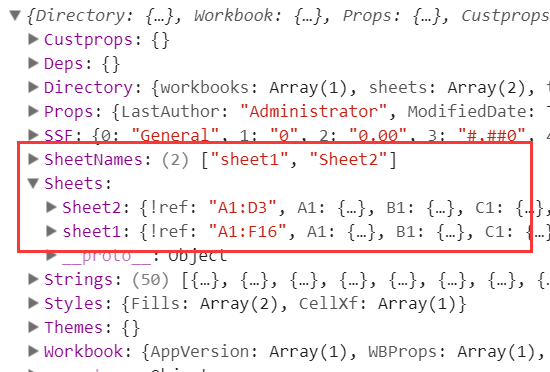
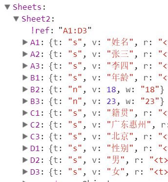
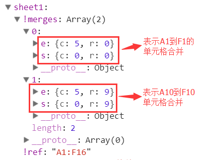
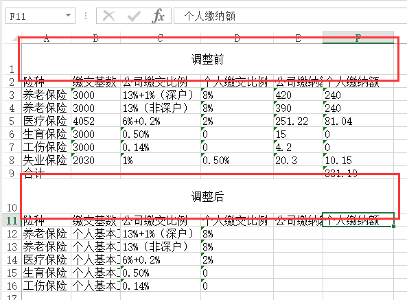
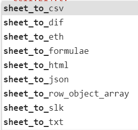
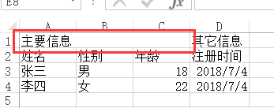

由[SheetJS](https://sheetjs.com/)出品的`js-xlsx`是一款非常方便的只需要纯JS即可读取和导出excel的工具库，功能强大，支持格式众多，支持`xls`、`xlsx`、`ods`(一种OpenOffice专有表格文件格式)等十几种格式。本文全部都是以`xlsx`格式为例。

官方github：<https://github.com/SheetJS/js-xlsx>

`dist`目录下有很多个JS文件，一般情况下用`xlsx.core.min.js`就够了，`xlsx.full.min.js`则是包含了所有功能模块。

```js
https://cdn.bootcss.com/xlsx/0.15.1/xlsx.core.min.js

https://cdn.bootcss.com/xlsx/0.15.1/xlsx.full.min.js
```

读取excel主要是通过`XLSX.read(data, {type: type});`方法来实现，返回一个叫`WorkBook`的对象，type主要取值如下：

- `base64`: 以base64方式读取；
- `binary`: BinaryString格式(byte n is data.charCodeAt(n))
- `string`: UTF8编码的字符串；
- `buffer`: nodejs Buffer；
- `array`: Uint8Array，8位无符号数组；
- `file`: 文件的路径（仅nodejs下支持）；

## 获取workbook对象

### 读取本地文件

```
// 读取本地excel文件
function readWorkbookFromLocalFile(file, callback) {
    var reader = new FileReader();
    reader.onload = function(e) {
        var data = e.target.result;
        var workbook = XLSX.read(data, {type: 'binary'});
        if(callback) callback(workbook);
    };
    reader.readAsBinaryString(file);
}
```

### 读取网络文件

```
// 从网络上读取某个excel文件，url必须同域，否则报错
function readWorkbookFromRemoteFile(url, callback) {
    var xhr = new XMLHttpRequest();
    xhr.open('get', url, true);
    xhr.responseType = 'arraybuffer';
    xhr.onload = function(e) {
        if(xhr.status == 200) {
            var data = new Uint8Array(xhr.response)
            var workbook = XLSX.read(data, {type: 'array'});
            if(callback) callback(workbook);
        }
    };
    xhr.send();
}
```

## 详解 workbook

### Workbook Object

`workbook`里面有什么东西呢，我们打印出来看一下：



可以看到，`SheetNames`里面保存了所有的sheet名字，然后`Sheets`则保存了每个sheet的具体内容（我们称之为`Sheet Object`）。每一个`sheet`是通过类似`A1`这样的键值保存每个单元格的内容，我们称之为单元格对象（`Cell Object`）：



### Sheet Object

每一个`Sheet Object`表示一张表格，只要不是`!`开头的都表示普通`cell`，否则，表示一些特殊含义，具体如下：

- `sheet['!ref']`：表示所有单元格的范围，例如从A1到F8则记录为`A1:F8`；
- `sheet[!merges]`：存放一些单元格合并信息，是一个数组，每个数组由包含`s`和`e`构成的对象组成，`s`表示开始，`e`表示结束，`r`表示行，`c`表示列；
- 等等；

关于单元格合并，看懂下面这张图基本上就没问题了：



结果如下：



### 单元格对象

每一个单元格是一个对象（`Cell Object`），主要有`t`、`v`、`r`、`h`、`w`等字段（详见[这里](https://github.com/SheetJS/js-xlsx#cell-object)）：

- t：表示内容类型，`s`表示string类型，`n`表示number类型，`b`表示boolean类型，`d`表示date类型，等等
- v：表示原始值；
- f：表示公式，如`B2+B3`；
- h：HTML内容
- w：格式化后的内容
- r：富文本内容`rich text`
- 等等

### 读取workbook

普通方法：

```
// 读取 excel文件
function outputWorkbook(workbook) {
    var sheetNames = workbook.SheetNames; // 工作表名称集合
    sheetNames.forEach(name => {
        var worksheet = workbook.Sheets[name]; // 只能通过工作表名称来获取指定工作表
        for(var key in worksheet) {
            // v是读取单元格的原始值
            console.log(key, key[0] === '!' ? worksheet[key] : worksheet[key].v);
        }
    });
}
```

根据`!ref`确定excel的范围，再根据`!merges`确定单元格合并（如果有），最后输出整个table，比较麻烦，幸运的是，插件自身已经写好工具类`XLSX.utils`给我们直接使用，无需我们自己遍历，工具类输出主要包括如下：



有些不常用，常用的主要是：

- `XLSX.utils.sheet_to_csv`：生成CSV格式
- `XLSX.utils.sheet_to_txt`：生成纯文本格式
- `XLSX.utils.sheet_to_html`：生成HTML格式
- `XLSX.utils.sheet_to_json`：输出JSON格式

常用的主要是`sheet_to_csv`或者`sheet_to_html`，转csv的话会忽略格式、单元格合并等信息，所以复杂表格可能不适用。转html的话会保留单元格合并，但是生成的是`<html></html>`代码，而不是`<table></table>`，需要对表格进行一些定制时不太方便，所以具体还是要视情况来采用合适的工具类。

这里写一个采用转csv方式输出结果的简单示例，可点击这里查看[在线DEMO](http://demo.haoji.me/2017/02/08-js-xlsx/)：

```
function readWorkbook(workbook)
{
    var sheetNames = workbook.SheetNames; // 工作表名称集合
    var worksheet = workbook.Sheets[sheetNames[0]]; // 这里我们只读取第一张sheet
    var csv = XLSX.utils.sheet_to_csv(worksheet);
    document.getElementById('result').innerHTML = csv2table(csv);
}

// 将csv转换成简单的表格，会忽略单元格合并，在第一行和第一列追加类似excel的索引
function csv2table(csv)
{
    var html = '<table>';
    var rows = csv.split('\n');
    rows.pop(); // 最后一行没用的
    rows.forEach(function(row, idx) {
        var columns = row.split(',');
        columns.unshift(idx+1); // 添加行索引
        if(idx == 0) { // 添加列索引
            html += '<tr>';
            for(var i=0; i<columns.length; i++) {
                html += '<th>' + (i==0?'':String.fromCharCode(65+i-1)) + '</th>';
            }
            html += '</tr>';
        }
        html += '<tr>';
        columns.forEach(function(column) {
            html += '<td>'+column+'</td>';
        });
        html += '</tr>';
    });
    html += '</table>';
    return html;
}
```

# 导出excel

导出分为2种，一种是基于现有excel修改，一种是全新生成，前者比较简单，我们这里着重讲后者。

## 自己手写代码生成

导出excel文件，主要是如何生成一个`sheet`，我们这里写一个最简单的csv转excel示例：

```
// csv转sheet对象
function csv2sheet(csv) {
    var sheet = {}; // 将要生成的sheet
    csv = csv.split('\n');
    csv.forEach(function(row, i) {
        row = row.split(',');
        if(i == 0) sheet['!ref'] = 'A1:'+String.fromCharCode(65+row.length-1)+(csv.length-1);
        row.forEach(function(col, j) {
            sheet[String.fromCharCode(65+j)+(i+1)] = {v: col};
        });
    });
    return sheet;
}

// 将一个sheet转成最终的excel文件的blob对象，然后利用URL.createObjectURL下载
function sheet2blob(sheet, sheetName) {
    sheetName = sheetName || 'sheet1';
    var workbook = {
        SheetNames: [sheetName],
        Sheets: {}
    };
    workbook.Sheets[sheetName] = sheet;
    // 生成excel的配置项
    var wopts = {
        bookType: 'xlsx', // 要生成的文件类型
        bookSST: false, // 是否生成Shared String Table，官方解释是，如果开启生成速度会下降，但在低版本IOS设备上有更好的兼容性
        type: 'binary'
    };
    var wbout = XLSX.write(workbook, wopts);
    var blob = new Blob([s2ab(wbout)], {type:"application/octet-stream"});
    // 字符串转ArrayBuffer
    function s2ab(s) {
        var buf = new ArrayBuffer(s.length);
        var view = new Uint8Array(buf);
        for (var i=0; i!=s.length; ++i) view[i] = s.charCodeAt(i) & 0xFF;
        return buf;
    }
    return blob;
}
```

拿到上面的blob对象就可以直接下载了，参考我之前在[JS弹出下载对话框](http://blog.haoji.me/js-download.html#JS-dan-chu-xia-zai-dui-hua-kuang)里面封装好的`openDownloadDialog`方法：

```
/**
 * 通用的打开下载对话框方法，没有测试过具体兼容性
 * @param url 下载地址，也可以是一个blob对象，必选
 * @param saveName 保存文件名，可选
 */
function openDownloadDialog(url, saveName)
{
    if(typeof url == 'object' && url instanceof Blob)
    {
        url = URL.createObjectURL(url); // 创建blob地址
    }
    var aLink = document.createElement('a');
    aLink.href = url;
    aLink.download = saveName || ''; // HTML5新增的属性，指定保存文件名，可以不要后缀，注意，file:///模式下不会生效
    var event;
    if(window.MouseEvent) event = new MouseEvent('click');
    else
    {
        event = document.createEvent('MouseEvents');
        event.initMouseEvent('click', true, false, window, 0, 0, 0, 0, 0, false, false, false, false, 0, null);
    }
    aLink.dispatchEvent(event);
}
```

所以，最终下载实现如下：

```
// 传入csv，执行后就会弹出下载框
function exportExcel(csv) {
    var sheet = csv2sheet(csv);
    var blob = sheet2blob(sheet);
    openDownloadDialog(blob, '导出.xlsx')；
}
```

## 利用官方工具类生成

其实上面这些代码都不需要我们手写，官方已经提供好了现成的工具类给我们使用，主要包括：

- `aoa_to_sheet`: 这个工具类最强大也最实用了，将一个二维数组转成sheet，会自动处理number、string、boolean、date等类型数据；
- `table_to_sheet`: 将一个`table dom`直接转成sheet，会自动识别`colspan`和`rowspan`并将其转成对应的单元格合并；
- `json_to_sheet`: 将一个由对象组成的数组转成sheet；

`aoa_to_sheet`示例：

```
var aoa = [
    ['姓名', '性别', '年龄', '注册时间'],
    ['张三', '男', 18, new Date()],
    ['李四', '女', 22, new Date()]
];
var sheet = XLSX.utils.aoa_to_sheet(aoa);
openDownloadDialog(sheet2blob(sheet), '导出.xlsx');
```

`table_to_sheet`就更简单了，直接`XLSX.utils.table_to_sheet($('table')[0])`即可；

## 处理单元格合并

一般来说，前端生成`excel`而不是`csv`最主要目的都是为了解决csv不能实现单元格合并的问题，要不然直接导出csv文件就好了，何必引入几百kb的插件。

假设我们要生成如下格式的excel文件，其中`A1-C1`进行单元格合并：



代码如下：

```
var aoa = [
    ['主要信息', null, null, '其它信息'], // 特别注意合并的地方后面预留2个null
    ['姓名', '性别', '年龄', '注册时间'],
    ['张三', '男', 18, new Date()],
    ['李四', '女', 22, new Date()]
];
var sheet = XLSX.utils.aoa_to_sheet(aoa);
sheet['!merges'] = [
    // 设置A1-C1的单元格合并
    {s: {r: 0, c: 0}, e: {r: 0, c: 2}}
];
openDownloadDialog(sheet2blob(sheet), '单元格合并示例.xlsx');
```

需要注意的地方就是被合并的单元格要用`null`预留出位置，否则后面的内容（本例中是第四列`其它信息`）会被覆盖。

```html
<!DOCTYPE html>
<html lang="en">
<head>
    <meta charset="UTF-8">
    <title>Excel批量处理</title>
    <script src="https://cdn.bootcss.com/jquery/3.2.1/jquery.js"></script>
    <script src="https://cdn.bootcss.com/xlsx/0.11.5/xlsx.core.min.js"></script>
</head>
<body>
<input type="file" id="excel-file">
<textarea id="area"></textarea>
<script>
    //给input标签绑定change事件，一上传选中的.xls文件就会触发该函数
    $('#excel-file').change(function(e) {
        var files = e.target.files;
        var fileReader = new FileReader();
        fileReader.onload = function(ev) {
            try {
                var data = ev.target.result
                var workbook = XLSX.read(data, {
                    type: 'binary'
                }) // 以二进制流方式读取得到整份excel表格对象
                var persons = []; // 存储获取到的数据
            } catch (e) {
                console.log('文件类型不正确');
                return;
            }
            // 表格的表格范围，可用于判断表头是否数量是否正确
            var fromTo = '';
            // 遍历每张表读取
            for (var sheet in workbook.Sheets) {
                if (workbook.Sheets.hasOwnProperty(sheet)) {
                    fromTo = workbook.Sheets[sheet]['!ref'];
                    console.log(fromTo);
                    persons = persons.concat(XLSX.utils.sheet_to_json(workbook.Sheets[sheet]));
                    // break; // 如果只取第一张表，就取消注释这行
                }
            }
            //在控制台打印出来表格中的数据
            console.log(persons);
            $("#area").val(JSON.stringify(persons));
        };
        // 以二进制方式打开文件
        fileReader.readAsBinaryString(files[0]);
    });
</script>
</body>
</html>
```

