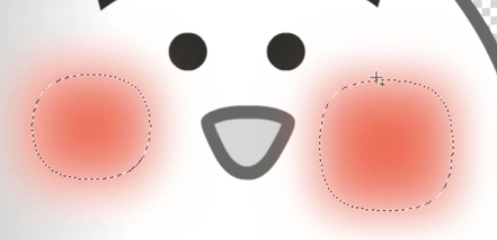

| command+n                                                    | 新建窗口                 |
| ------------------------------------------------------------ | ------------------------ |
| command+o                                                    | 打开文件                 |
|                                                              | 切换显示画面             |
| h或者按住空格键                                              | 抓手工具                 |
| command++                                                    | 放大                     |
| command+-                                                    | 缩小                     |
| 点击图层直接拖放到另一个文件窗口，之后按住shift 松手，保持原位，（文档大小必须相同，不同就居中） | 多文件的图层合并一个文件 |
| option+command+z                                             | 后退                     |
|                                                              |                          |
|                                                              |                          |

图层

| command+j                     | 复制图层 |
| ----------------------------- | -------- |
| alt+鼠标左键+拖拽             | 复制图层 |
| alt+鼠标左键，点击眼睛        | 反选图层 |
| delete                        | 删除图层 |
| 按住option （黑白双箭头）拖拽 | 复制图层 |
| ctrl+shift+j                  | 剪切图层 |
|                               |          |
|                               |          |

移动

| 按住command              | 自动切换到自动选择 |
| ------------------------ | ------------------ |
| 按住command              | 切换到移动工具     |
| 上下左右键移动图层       | 微调               |
| shift+上下左右键移动图层 | 加速微调           |

选区

| command+d       | 取消选区     |
| --------------- | ------------ |
| command+shift+d | 重新选择选区 |
| shift           | 多个选区     |
| option          | 删除选区     |
| shift+option    | 选区交叉     |

羽化：就是选区边缘部分实现过渡式虚化，从而起到渐变的作用，使选区内外达到自然衔接的作用，数值越大虚化越明显

