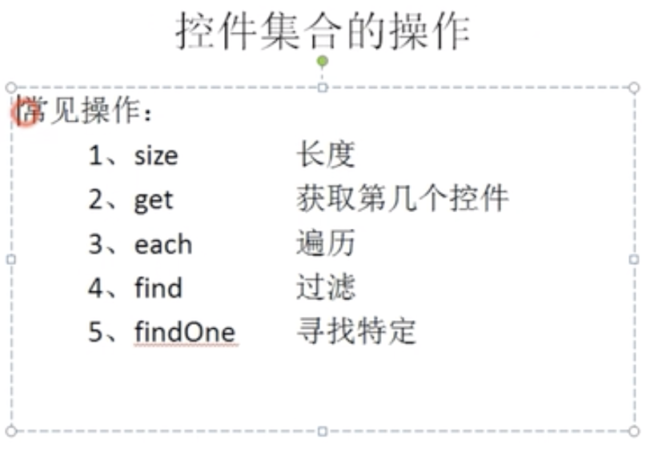

# 手机安装Autojs

# vscode安装autojs插件，不要安装pro版

vscode

- command+shift+p
- start server
- ifconfig  查看本地ip

手机连接

- 连接电脑，输入ip

测试,新建js文件，语言详见autojs  api

```js
launchApp("QQ")
```

fn+f5  运行代码

帮助 切换开发者工具 ，可以看到打印的日志


# 下载Android SDK

### 二、设置下载的代理服务器

1.下载好的sdk解压放根目录文件下
 2.在终端用命令行进入到下载文件的tools目录`cd ~/admin/sdk目录/tools`
 3.终端输入 `./android` 调出SDK Manager的图形界面
 4.Mac的顶部找到Android SDK Manager -> Preferences 或者快捷键`command+，`进入设置页面
 5.http proxy server这里填写： [mirrors.neusoft.edu.cn](http://mirrors.neusoft.edu.cn) （感谢东软搭建国内的镜像服务器，为广大程序员造福无数），端口填写80，然后把Force https:// 前的勾勾上


设置

 6.Mac的顶部找到Tools->Manage Add-on Site


代理网址

 点击new按钮将一下网址添加进去


```ruby
http://mirrors.neusoft.edu.cn/android/repository/addon-6.xml
http://mirrors.neusoft.edu.cn/android/repository/addon.xml
http://mirrors.neusoft.edu.cn/android/repository/extras/intel/addon.xml
http://mirrors.neusoft.edu.cn/android/repository/sys-img/android-tv/sys-img.xml
http://mirrors.neusoft.edu.cn/android/repository/sys-img/android-wear/sys-img.xml
http://mirrors.neusoft.edu.cn/android/repository/sys-img/android/sys-img.xml
http://mirrors.neusoft.edu.cn/android/repository/sys-img/google_apis/sys-img.xml
http://mirrors.neusoft.edu.cn/android/repository/sys-img/x86/addon-x86.xml
http://mirrors.neusoft.edu.cn/android/repository/addons_list-2.xml
http://mirrors.neusoft.edu.cn/android/repository/repository-10.xml
```

7.下图中加圈的项，建议勾上，否则有可能创建不了Android模拟设备


下载设置

### 三、设置安卓环境变量

1.启动终端 输入 `cd ~/`进入home 目录
 2.`
 3.打开编辑： `open .bash_profile`
 4.在文件中输入以下内容

```bash
export ANDROID_HOME=/Users/admin/android-sdk-macosx
export PATH=${PATH}:${ANDROID_HOME}/tools
export PATH=${PATH}:${ANDROID_HOME}/platform-tools
```

> - 注意以上目录请使用自己实际目录

5.执行如下命令立即生效：`source .bash_profile`
 6.验证：终端输入`adb`回车。如果未显示command not found，说明此命令有效，环境变量设置完成。

#### 注意始终保持手机端连接电脑

## 四、把脚本保存到手机

command+shift+p

Save on device


# API

findOne()

```js
var result = desc('评论').findOne()
```

click()

```js
result.click()
```

sleep()

```js
sleep(1000)
```

#### 微信点赞脚本（入门）

不允许点击，先找到该控件，在找到该控件的父控件  x.parent()  在click()

```js'
log('微信评论脚本，1、先打开微信，2、布局分析，3、注意id和desc')
var res = desc('评论').findOne();
res.click()
sleep(1000)
var zan = text('赞').findOne();
// 此时不能点赞，因为clickable为false
// 找的父组件
// zan.click()
var fu = zan.parent()
fu.click()
```

## 常用选择器

id

```js
var id = id('ik').findOne()
找1秒
var id = id('ik').findOne(1000)
```

className

```js
var list = className('ListView').findOne()
```

findOnce()找一次

desc

```js
desc('评论').find() 
找所有，返回数组
```

text

```js
var name = text('tom').findOne()
```

每个选择器都有四个方法

Contains包含

startwith开头

endwith结尾

matches正则

事件


```js
var name = text('陈小龙').findOne();
log(name)
var id= name.id()
log("id->"+id)
```

```js
var name = id('hx').findOne();
var id= name.longClick()
log("id->"+id)
```

滚动控件，可以找到列表就可以了

```js
var list = className('ListView').findOne();
list.scrollDown()


var list = className('ListView').findOne();
var arr = list.children()
log("数组长度："+arr.length)
arr.forEach(element => {
    log(element)
});
```

```js
var output = className('EditText').findOne();
output.setText('hello')
```

```js
var list = className('ListView').findOne();
var arr = list.children()
log("数组长度："+arr.length)
arr.forEach(item => {
    var name = item.findOne(id('e3x'))
    log("名字="+name.text())
});
```

```js
var list = className('ListView').findOne();
var arr = list.children()
log("数组长度："+arr.length)
arr.forEach(item => {
    var pl = item.findOne(desc('评论'))
    pl.click()
});
```



## 抖音点赞脚本


设置手机 开发人员选择 -》指针位置

