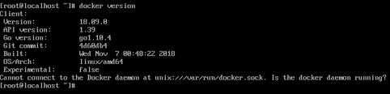

# 一、什么是Docker？

> 想做分布式，微服务必须掌握docker，全平台
>
> java一次编译到处运行，是因为jvm，没安装jvm也运行不了
>
> docker真正实现一次编译到处运行

​	Docker 最初是 dotCloud 公司创始人 Solomon Hykes 在法国期间发起的一个公司内部项目，它是基于 dotCloud 公司多年云服务技术的一次革新，并于 [2013 年 3 月以 Apache 2.0 授权协议开源](https://en.wikipedia.org/wiki/Docker_(software))，主要项目代码在 [GitHub](https://github.com/moby/moby) 上进行维护。Docker 项目后来还加入了 Linux 基金会，并成立推动 [开放容器联盟（OCI）](https://www.opencontainers.org/)。

​	Docker 自开源后受到广泛的关注和讨论，至今其 GitHub 项目已经超过 4 万 6 千个星标和一万多个 fork。甚至由于 Docker 项目的火爆，在 2013 年底，[dotCloud 公司决定改名为 Docker](https://blog.docker.com/2013/10/dotcloud-is-becoming-docker-inc/)。Docker 最初是在 Ubuntu 12.04 上开发实现的；Red Hat 则从 RHEL 6.5 开始对 Docker 进行支持；Google 也在其 PaaS 产品中广泛应用 Docker。

​	Docker 使用 Google 公司推出的 [Go 语言](https://golang.org/) 进行开发实现，基于 Linux 内核的 [cgroup](https://zh.wikipedia.org/wiki/Cgroups)，[namespace](https://en.wikipedia.org/wiki/Linux_namespaces)，以及 [AUFS](https://en.wikipedia.org/wiki/Aufs) 类的 [Union FS](https://en.wikipedia.org/wiki/Union_mount) 等技术，对进程进行封装隔离，属于 [操作系统层面的虚拟化技术](https://en.wikipedia.org/wiki/Operating-system-level_virtualization)。由于隔离的进程独立于宿主和其它的隔离的进程，因此也称其为容器。最初实现是基于 [LXC](https://linuxcontainers.org/lxc/introduction/)，从 0.7 版本以后开始去除 LXC，转而使用自行开发的 [libcontainer](https://github.com/docker/libcontainer)，从 1.11 开始，则进一步演进为使用 [runC](https://github.com/opencontainers/runc)和 [containerd](https://github.com/containerd/containerd)。

​	Docker 在容器的基础上，进行了进一步的封装，从文件系统、网络互联到进程隔离等等，极大的简化了容器的创建和维护。使得 Docker 技术比虚拟机技术更为轻便、快捷。

​	下面的图片比较了 Docker 和传统虚拟化方式的不同之处。传统虚拟机技术是虚拟出一套硬件后，在其上运行一个完整操作系统，在该系统上再运行所需应用进程；而容器内的应用进程直接运行于宿主的内核，容器内没有自己的内核，而且也没有进行硬件虚拟。因此容器要比传统虚拟机更为轻便。


虚拟化技术：基础设施即服务


对于个人来说：


区别：

- VMware 里面装了windows 那么windows就不能再装VMware
- Docker 里面装了windows 也可以继续装VM
- vm在装系统的环节，必须虚拟出来完整的空间，占用的底层硬件资源（不能共享的），在硬件之上安装操作系统
- docker用的是宿主机的内核和资源，所有资源都来自底层的设备，是共享状态
  - 笔记本为例
    - cpu i7 3.0GHz 1CPU4核
    - 内存 16GB
      - vm虚拟机 虚拟一个系统 内存2GB 1CPU2核
        - 16GB-2GB=14GB
      - 在开一个虚拟机
        - 14GB-2GB=12GB
      - 虚拟机为了运行，就独占了这部分资源
      - docker不需要分配任何资源，资源从宿主机来
        - 如果在vm上安装 4GB的app 内存溢出
        - docker 安装App 用4GB，底层共享 16-4
        - 在安装App1 用1GB，占用5GB资源，如果在上面第二个vm中安装App1 用了1GB，那么vm开的2GB就浪费了1GB资源，别人还用不了

# 二、为什么使用docker？

- #### 更高效的利用系统资源

  - 由于容器不需要进行硬件虚拟以及运行完整操作系统等额外开销，Docker 对系统资源的利用率更高。无论是应用执行速度、内存损耗或者文件存储速度，都要比传统虚拟机技术更高效。因此，相比虚拟机技术，一个相同配置的主机，往往可以运行更多数量的应用。

- #### 更快的启动时间

  - 传统的虚拟机技术启动应用服务往往需要数分钟，而 Docker 容器应用，由于直接运行于宿主内核，无需启动完整的操作系统，因此可以做到秒级、甚至毫秒级的启动时间。大大的节约了开发、测试、部署的时间。

- #### 一致的运行环境

  - 开发过程中一个常见的问题是环境一致性问题。由于开发环境、测试环境、生产环境不一致，导致有些 bug 并未在开发过程中被发现。而 Docker 的镜像提供了除内核外完整的运行时环境，确保了应用运行环境一致性，从而不会再出现 *「这段代码在我机器上没问题啊」* 这类问题

- #### 持续交付和部署

  - 对开发和运维（[DevOps](https://zh.wikipedia.org/wiki/DevOps)）人员来说，最希望的就是一次创建或配置，可以在任意地方正常运行。
  - 使用 Docker 可以通过定制应用镜像来实现持续集成、持续交付、部署。开发人员可以通过 `Dockerfile`来进行镜像构建，并结合 [持续集成(Continuous Integration)](https://en.wikipedia.org/wiki/Continuous_integration) 系统进行集成测试，而运维人员则可以直接在生产环境中快速部署该镜像，甚至结合 [持续部署(Continuous Delivery/Deployment)](https://en.wikipedia.org/wiki/Continuous_delivery) 系统进行自动部署。
  - 而且使用 `Dockerfile` 使镜像构建透明化，不仅仅开发团队可以理解应用运行环境，也方便运维团队理解应用运行所需条件，帮助更好的生产环境中部署该镜像。

- #### 更轻松的迁移

  - 由于 Docker 确保了执行环境的一致性，使得应用的迁移更加容易。Docker 可以在很多平台上运行，无论是物理机、虚拟机、公有云、私有云，甚至是笔记本，其运行结果是一致的。因此用户可以很轻易的将在一个平台上运行的应用，迁移到另一个平台上，而不用担心运行环境的变化导致应用无法正常运行的情况。

- #### 更轻松的维护和扩展

  - Docker 使用的分层存储以及镜像的技术，使得应用重复部分的复用更为容易，也使得应用的维护更新更加简单，基于基础镜像进一步扩展镜像也变得非常简单。此外，Docker 团队同各个开源项目团队一起维护了一大批高质量的 [官方镜像](https://store.docker.com/search?q=&source=verified&type=image)，既可以直接在生产环境使用，又可以作为基础进一步定制，大大的降低了应用服务的镜像制作成本。

- #### 对比传统虚拟机总结

| 特性       | 容器               | 虚拟机      |
| ---------- | ------------------ | ----------- |
| 启动       | 秒级               | 分钟级      |
| 硬盘使用   | 一般为 `MB`        | 一般为 `GB` |
| 性能       | 接近原生           | 弱于        |
| 系统支持量 | 单机支持上千个容器 | 一般几十个  |

# 三、Docker基本概念


Docker 包括三个基本概念

- 镜像（`Image`）
- 容器（`Container`）
- 仓库（`Repository`）

理解了这三个概念，就理解了 Docker 的整个生命周期。

## 1、引擎


Docker 引擎是一个包含以下主要组件的客户端服务器应用程序。

- 一种服务器，它是一种称为守护进程并且长时间运行的程序。
  - 需要开机启动，一直运行
- REST API用于指定程序可以用来与守护进程通信的接口，并指示它做什么。
- 一个有命令行界面 (CLI) 工具的客户端。

Docker 引擎组件的流程如下图所示：


## 2、系统架构

Docker 使用客户端-服务器 (C/S) 架构模式，使用远程 API 来管理和创建 Docker 容器。

Docker 容器通过 Docker 镜像来创建。

容器与镜像的关系类似于面向对象编程中的对象与类。

| Docker | 面向对象 |
| ------ | -------- |
| 容器   | 对象     |
| 镜像   | 类       |

如果一个镜像（类）已经装过java

- 现在还想装个tomcat，那么我可以在创建一个镜像，安装tomcat后继承安装过java的镜像
- 如果发布一个我们的电商项目，那么我们可以创建一个镜像，之后继承刚才装过tomcat的镜像
  - 整个环境就都有了（java\tomcat\项目）
- 镜像是个文件，无论放到任何一个计算机上，我new一个容器出来,那么这个容器就包含了电商项目


| 标题            | 说明                                                         |
| :-------------- | :----------------------------------------------------------- |
| 镜像(Images)    | Docker 镜像是用于创建 Docker 容器的模板。                    |
| 容器(Container) | 容器是独立运行的一个或一组应用。                             |
| 客户端(Client)  | Docker 客户端通过命令行或者其他工具使用 Docker API (<https://docs.docker.com/reference/api/docker_remote_api>) 与 Docker 的守护进程通信。 |
| 主机(Host)      | 一个物理或者虚拟的机器用于执行 Docker 守护进程和容器。       |
| 仓库(Registry)  | Docker 仓库用来保存镜像，可以理解为代码控制中的代码仓库。Docker Hub([https://hub.docker.com](https://hub.docker.com/)) 提供了庞大的镜像集合供使用。 |
| Docker Machine  | Docker Machine是一个简化Docker安装的命令行工具，通过一个简单的命令行即可在相应的平台上安装Docker，比如VirtualBox、 Digital Ocean、Microsoft Azure。 |

## 3、镜像


我们都知道，操作系统分为内核和用户空间。对于 Linux 而言，内核启动后，会挂载 `root` 文件系统为其提供用户空间支持。而 Docker 镜像（Image），就相当于是一个 `root` 文件系统。比如官方镜像 `ubuntu:16.04` 就包含了完整的一套 Ubuntu 16.04 最小系统的 `root` 文件系统。

Docker 镜像是一个特殊的文件系统，除了提供容器运行时所需的程序、库、资源、配置等文件外，还包含了一些为运行时准备的一些配置参数（如匿名卷、环境变量、用户等）。镜像不包含任何动态数据，其内容在构建之后也不会被改变。

#### 分层存储

因为镜像包含操作系统完整的 `root` 文件系统，其体积往往是庞大的，因此在 Docker 设计时，就充分利用 [Union FS](https://en.wikipedia.org/wiki/Union_mount) 的技术，将其设计为分层存储的架构。所以严格来说，镜像并非是像一个 ISO 那样的打包文件，镜像只是一个虚拟的概念，其实际体现并非由一个文件组成，而是由一组文件系统组成，或者说，由多层文件系统联合组成。

镜像构建时，会一层层构建，前一层是后一层的基础。每一层构建完就不会再发生改变，后一层上的任何改变只发生在自己这一层。比如，删除前一层文件的操作，实际不是真的删除前一层的文件，而是仅在当前层标记为该文件已删除。在最终容器运行的时候，虽然不会看到这个文件，但是实际上该文件会一直跟随镜像。因此，在构建镜像的时候，需要额外小心，每一层尽量只包含该层需要添加的东西，任何额外的东西应该在该层构建结束前清理掉。

分层存储的特征还使得镜像的复用、定制变的更为容易。甚至可以用之前构建好的镜像作为基础层，然后进一步添加新的层，以定制自己所需的内容，构建新的镜像。

关于镜像构建，将会在后续相关章节中做进一步的讲解。


## 4、容器


​		镜像（`Image`）和容器（`Container`）的关系，就像是面向对象程序设计中的 `类` 和 `实例` 一样，镜像是静态的定义，容器是镜像运行时的实体。容器可以被创建、启动、停止、删除、暂停等。

​	容器的实质是进程，但与直接在宿主执行的进程不同，容器进程运行于属于自己的独立的 [命名空间](https://en.wikipedia.org/wiki/Linux_namespaces)。因此容器可以拥有自己的 `root` 文件系统、自己的网络配置、自己的进程空间，甚至自己的用户 ID 空间。容器内的进程是运行在一个隔离的环境里，使用起来，就好像是在一个独立于宿主的系统下操作一样。这种特性使得容器封装的应用比直接在宿主运行更加安全。也因为这种隔离的特性，很多人初学 Docker 时常常会混淆容器和虚拟机。

​	前面讲过镜像使用的是分层存储，容器也是如此。每一个容器运行时，是以镜像为基础层，在其上创建一个当前容器的存储层，我们可以称这个为容器运行时读写而准备的存储层为**容器存储层**。

​	容器存储层的生存周期和容器一样，容器消亡时，容器存储层也随之消亡。因此，任何保存于容器存储层的信息都会随容器删除而丢失。

​	按照 Docker 最佳实践的要求，容器不应该向其存储层内写入任何数据，容器存储层要保持无状态化。所有的文件写入操作，都应该使用 `数据卷（Volume）`、或者绑定宿主目录，在这些位置的读写会跳过容器存储层，直接对宿主（或网络存储）发生读写，其性能和稳定性更高。

​	数据卷的生存周期独立于容器，容器消亡，数据卷不会消亡。因此，使用数据卷后，容器删除或者重新运行之后，数据却不会丢失。

- 虚拟机的文件存到哪里？虚拟机文件里，会发生重复写的操作，往虚拟机写文件最少写两次
  - 一次帮我打包到虚拟机文件里
  - 一次能我在操作系统里操作这个文件
- 想让虚拟机直接操作我本地磁盘的文件呢？共享
  - 虚拟机做不到
  - docker用数据卷能做到

## 5、仓库

​	镜像构建完成后，可以很容易的在当前宿主机上运行，但是，如果需要在其它服务器上使用这个镜像，我们就需要一个集中的存储、分发镜像的服务，`Docker Registry` 就是这样的服务。

- 我在我的电脑上有一个镜像，我想在别人的电脑上运行，就需要集中化管理的地方，就是服务器，通过访问这个服务器，就可以下载了。

​	一个 **Docker Registry** 中可以包含多个**仓库**（`Repository`）；每个仓库可以包含多个**标签**（`Tag`）；每个标签对应一个镜像。

​	通常，一个仓库会包含同一个软件不同版本的镜像，而标签就常用于对应该软件的各个版本。我们可以通过 `<仓库名>:<标签>` 的格式来指定具体是这个软件哪个版本的镜像。如果不给出标签，将以 `latest` 作为默认标签。

​	    以 [Ubuntu 镜像](https://store.docker.com/images/ubuntu) 为例，`ubuntu` 是仓库的名字，其内包含有不同的版本标签，如，`14.04`, `16.04`。我们可以通过 `ubuntu:14.04`，或者 `ubuntu:16.04` 来具体指定所需哪个版本的镜像。如果忽略了标签，比如 `ubuntu`，那将视为 `ubuntu:latest`。

​	仓库名经常以 *两段式路径* 形式出现，比如 `jwilder/nginx-proxy`，前者往往意味着 Docker Registry 多用户环境下的用户名，后者则往往是对应的软件名。但这并非绝对，取决于所使用的具体 Docker Registry 的软件或服务。

### 公有 Docker Registry

​	Docker Registry 公开服务是开放给用户使用、允许用户管理镜像的 Registry 服务。一般这类公开服务允许用户免费上传、下载公开的镜像，并可能提供收费服务供用户管理私有镜像。

​	最常使用的 Registry 公开服务是官方的 [Docker Hub](https://hub.docker.com/)，这也是默认的 Registry，并拥有大量的高质量的官方镜像。除此以外，还有 [CoreOS](https://coreos.com/) 的 [Quay.io](https://quay.io/repository/)，CoreOS 相关的镜像存储在这里；Google 的 [Google Container Registry](https://cloud.google.com/container-registry/)，[Kubernetes](http://kubernetes.io/) 的镜像使用的就是这个服务。

​	由于某些原因，在国内访问这些服务可能会比较慢。国内的一些云服务商提供了针对 Docker Hub 的镜像服务（`Registry Mirror`），这些镜像服务被称为**加速器**。常见的有 [阿里云加速器](https://cr.console.aliyun.com/#/accelerator)、[DaoCloud 加速器](https://www.daocloud.io/mirror#accelerator-doc) 等。使用加速器会直接从国内的地址下载 Docker Hub 的镜像，比直接从 Docker Hub 下载速度会提高很多。

​	国内也有一些云服务商提供类似于 Docker Hub 的公开服务。比如 [时速云镜像仓库](https://hub.tenxcloud.com/)、[网易云镜像服务](https://c.163.com/hub#/m/library/)、[DaoCloud 镜像市场](https://hub.daocloud.io/)、[阿里云镜像库](https://cr.console.aliyun.com/) 等。

### 私有 Docker Registry

​	除了使用公开服务外，用户还可以在本地搭建私有 Docker Registry。Docker 官方提供了 [Docker Registry](https://store.docker.com/images/registry/) 镜像，可以直接使用做为私有 Registry 服务。

​	开源的 Docker Registry 镜像只提供了 [Docker Registry API](https://docs.docker.com/registry/spec/api/) 的服务端实现，足以支持 `docker` 命令，不影响使用。但不包含图形界面，以及镜像维护、用户管理、访问控制等高级功能。在官方的商业化版本 [Docker Trusted Registry](https://docs.docker.com/datacenter/dtr/2.0/) 中，提供了这些高级功能。

​	除了官方的 Docker Registry 外，还有第三方软件实现了 Docker Registry API，甚至提供了用户界面以及一些高级功能。比如，[VMWare Harbor](https://github.com/vmware/harbor) 和 [Sonatype Nexus](https://www.sonatype.com/docker)。

- 目的：上传我们自己项目的镜像

# 四、安装


Docker 在 1.13 版本之后，从 2017 年的 3 月 1 日开始，版本命名规则变为如下：

| 项目        | 说明         |
| ----------- | ------------ |
| 版本格式    | YY.MM        |
| Stable 版本 | 每个季度发行 |
| Edge 版本   | 每个月发行   |

同时 Docker 划分为 CE 和 EE。CE 即社区版（免费，支持周期三个月），EE 即企业版，强调安全，付费使用。

Docker CE 每月发布一个 Edge 版本 (17.03, 17.04, 17.05...)，每三个月发布一个 Stable 版本 (17.03, 17.06, 17.09...)，Docker EE 和 Stable 版本号保持一致，但每个版本提供一年维护。

官方网站上有各种环境下的 [安装指南](https://docs.docker.com/engine/installation/)，这里主要介绍 Docker CE 在 Linux 、Windows 10 (PC) 和 macOS 上的安装。

## 1、CentOS 安装 Docker

#### 直接使用脚本安装即可

Docker CE 支持 64 位版本 CentOS 7，并且要求内核版本不低于 3.10。 CentOS 7 满足最低内核的要求，但由于内核版本比较低，部分功能（如 overlay2 存储层驱动）无法使用，并且部分功能可能不太稳定。

### 卸载旧版本

旧版本的 Docker 称为 docker 或者 docker-engine，使用以下命令卸载旧版本：

```sh
$ sudo yum remove docker \
                  docker-client \
                  docker-client-latest \
                  docker-common \
                  docker-latest \
                  docker-latest-logrotate \
                  docker-logrotate \
                  docker-selinux \
                  docker-engine-selinux \
                  docker-engine
```

### 使用 yum 安装

执行以下命令安装依赖包：

```sh
$ sudo yum install -y yum-utils \
           device-mapper-persistent-data \
           lvm2
```

鉴于国内网络问题，强烈建议使用国内源，官方源请在注释中查看。

执行下面的命令添加 yum 软件源：

```sh
$ sudo yum-config-manager \
    --add-repo \
    https://mirrors.ustc.edu.cn/docker-ce/linux/centos/docker-ce.repo
#官方源
# $ sudo yum-config-manager \
#     --add-repo \
#     https://download.docker.com/linux/centos/docker-ce.repo   
```

如果需要最新版本的 Docker CE 请使用以下命令：

```sh
$ sudo yum-config-manager --enable docker-ce-edge

```

如果需要测试版本的 Docker CE 请使用以下命令：

```sh
$ sudo yum-config-manager --enable docker-ce-test
```

### 安装 Docker CE

更新 `yum` 软件源缓存，并安装 `docker-ce`

```sh
$ sudo yum makecache fast
$ sudo yum install docker-ce

```

### 使用脚本自动安装(使用这种方式)

在测试或开发环境中 Docker 官方为了简化安装流程，提供了一套便捷的安装脚本，CentOS 系统上可以使用这套脚本安装：先复制第一行代码执行，在执行第二行

```sh
curl -fsSL get.docker.com -o get-docker.sh
sudo sh get-docker.sh --mirror Aliyun
```

执行这个命令后，脚本就会自动的将一切准备工作做好，并且把 Docker CE 的 Edge 版本安装在系统中。

### 启动 Docker CE

```sh
$ sudo systemctl enable docker

$ sudo systemctl start docker

docker version测试出现client 和 server 代表成功
```

### 建立 docker 用户组

默认情况下，`docker` 命令会使用 [Unix socket](https://en.wikipedia.org/wiki/Unix_domain_socket) 与 Docker 引擎通讯。而只有 `root` 用户和 `docker`组的用户才可以访问 Docker 引擎的 Unix socket。出于安全考虑，一般 Linux 系统上不会直接使用 `root` 用户。因此，更好地做法是将需要使用 `docker` 的用户加入 `docker` 用户组。

建立 `docker` 组：

```sh
$ sudo groupadd docker
```

将当前用户加入 `docker` 组：

```sh
$ sudo usermod -aG docker $USER
```

### 测试 Docker 是否安装正确


```sh
$ docker run hello-world

Unable to find image 'hello-world:latest' locally
latest: Pulling from library/hello-world
ca4f61b1923c: Pull complete
Digest: sha256:be0cd392e45be79ffeffa6b05338b98ebb16c87b255f48e297ec7f98e123905c
Status: Downloaded newer image for hello-world:latest

Hello from Docker!
This message shows that your installation appears to be working correctly.

To generate this message, Docker took the following steps:
 1. The Docker client contacted the Docker daemon.
 2. The Docker daemon pulled the "hello-world" image from the Docker Hub.
    (amd64)
 3. The Docker daemon created a new container from that image which runs the
    executable that produces the output you are currently reading.
 4. The Docker daemon streamed that output to the Docker client, which sent it
    to your terminal.

To try something more ambitious, you can run an Ubuntu container with:
 $ docker run -it ubuntu bash

Share images, automate workflows, and more with a free Docker ID:
 https://cloud.docker.com/

For more examples and ideas, visit:
 https://docs.docker.com/engine/userguide/
```

若能正常输出以上信息，则说明安装成功

### 镜像加速

鉴于国内网络问题，后续拉取 Docker 镜像十分缓慢，强烈建议安装 Docker 之后配置 `国内镜像加速`

### 添加内核参数

默认配置下，如果在 CentOS 使用 Docker CE 看到下面的这些警告信息：

```sh
WARNING: bridge-nf-call-iptables is disabled
WARNING: bridge-nf-call-ip6tables is disabled
```

请添加内核配置参数以启用这些功能

```sh
$ sudo tee -a /etc/sysctl.conf <<-EOF
net.bridge.bridge-nf-call-ip6tables = 1
net.bridge.bridge-nf-call-iptables = 1
EOF
```

然后重新加载 `sysctl.conf` 即可

```sh
$ sudo sysctl -p
```

## 2、mac安装 Docker

### 系统要求

[Docker for Mac](https://docs.docker.com/docker-for-mac/) 要求系统最低为 macOS 10.10.3 Yosemite。如果系统不满足需求，可以安装 [Docker Toolbox](https://docs.docker.com/toolbox/overview/)。

### 使用 Homebrew 安装

[Homebrew](http://brew.sh/) 的 [Cask](https://caskroom.github.io/) 已经支持 Docker for Mac，因此可以很方便的使用 Homebrew Cask 来进行安装：

```sh
$ brew cask install docker
```

### 手动下载安装

如果需要手动下载，请点击以下链接下载 [Stable](https://download.docker.com/mac/stable/Docker.dmg) 或 [Edge](https://download.docker.com/mac/edge/Docker.dmg) 版本的 Docker for Mac。

如同 macOS 其它软件一样，安装也非常简单，双击下载的 `.dmg` 文件，然后将那只叫 [Moby](https://blog.docker.com/2013/10/call-me-moby-dock/) 的鲸鱼图标拖拽到 `Application` 文件夹即可（其间需要输入用户密码）。

### 运行

从应用中找到 Docker 图标并点击运行。


运行之后，会在右上角菜单栏看到多了一个鲸鱼图标，这个图标表明了 Docker 的运行状态。


第一次点击图标，可能会看到这个安装成功的界面，点击 "Got it!" 可以关闭这个窗口。


以后每次点击鲸鱼图标会弹出操作菜单。


启动终端后，通过命令可以检查安装后的 Docker 版本。

```sh
$ docker --version
Docker version 17.10.0-ce, build f4ffd25
$ docker-compose --version
docker-compose version 1.17.0-rc1, build a0f95af
$ docker-machine --version
docker-machine version 0.13.0, build 9ba6da9
```

如果 `docker version`、`docker info` 都正常的话，可以尝试运行一个 [Nginx 服务器](https://store.docker.com/images/nginx/)

```sh
$ docker run -d -p 80:80 --name webserver nginx
```

服务运行后，可以访问 [http://localhost](http://localhost/)，如果看到了 "Welcome to nginx!"，就说明 Docker for Mac 安装成功了。


要停止 Nginx 服务器并删除执行下面的命令：

```sh
$ docker stop webserver
$ docker rm webserver
```

### 镜像加速

鉴于国内网络问题，后续拉取 Docker 镜像十分缓慢，强烈建议安装 Docker 之后配置 `国内镜像加速`。


# 五、镜像加速器

国内从 Docker Hub 拉取镜像有时会遇到困难，此时可以配置镜像加速器。Docker 官方和国内很多云服务商都提供了国内加速器服务，例如：

- [Docker 官方提供的中国 registry mirror](https://docs.docker.com/registry/recipes/mirror/#use-case-the-china-registry-mirror)
- [阿里云加速器](https://cr.console.aliyun.com/#/accelerator)
- [DaoCloud 加速器](https://www.daocloud.io/mirror#accelerator-doc)

我们以 Docker 官方加速器为例进行介绍

## Ubuntu 16.04+、Debian 8+、CentOS 7

对于使用 [systemd](https://www.freedesktop.org/wiki/Software/systemd/) 的系统，请在 /etc/docker/daemon.json 中写入如下内容（如果文件不存在请新建该文件）

```sh
{

  "registry-mirrors": [

    "https://registry.docker-cn.com"

  ]

}
```

注意，一定要保证该文件符合 json 规范，否则 Docker 将不能启动。

之后重新启动服务。

```sh
$ sudo systemctl daemon-reload

$ sudo systemctl restart docker
```


## 检查加速器是否生效

配置加速器之后，如果拉取镜像仍然十分缓慢，请手动检查加速器配置是否生效，在命令行执行 `docker info`，如果从结果中看到了如下内容，说明配置成功。

```sh
Registry Mirrors:
 https://registry.docker-cn.com/
```

# 六、安装tomcat流程

1、先克隆一个虚拟机

2、测试curl <http://www.baidu.com>

3、只使用脚本安装

4、docker version测试安装完成，出现client就可以了 



5、为docker配置镜像加速器，下载时提速

6、vi /etc/docker/daemon.json

7、重启服务systemctl restart docker

8、安装汤姆猫 docker pull tomcat

9、docker images查看镜像

10、安装指定版本docker pull tomcat:9-jre8

11、[hub.docker.com](http://hub.docker.com)资源库

12、运行 docker run -p 8080:8080 tomcat 

光标悬停，一直在运行


13、访问192.168.0.105：8080

下载用了点时间，启动秒启动，也没装jdk

14、command+c结束

# 七、获取镜像


在之前的介绍中，我们知道镜像是 Docker 的三大组件之一。

Docker 运行容器前需要本地存在对应的镜像，如果本地不存在该镜像，Docker 会从镜像仓库下载该镜像。

​	之前提到过，[Docker Hub](https://hub.docker.com/explore/) 上有大量的高质量的镜像可以用，这里我们就说一下怎么获取这些镜像。

从 Docker 镜像仓库获取镜像的命令是 `docker pull`。其命令格式为：

```sh
docker pull [选项] [Docker Registry 地址[:端口号]/]仓库名[:标签]
```

具体的选项可以通过 `docker pull --help` 命令看到，这里我们说一下镜像名称的格式。

- Docker 镜像仓库地址：地址的格式一般是 `<域名/IP>[:端口号]`。默认地址是 Docker Hub。
- 仓库名：如之前所说，这里的仓库名是两段式名称，即 `<用户名>/<软件名>`。对于 Docker Hub，如果不给出用户名，则默认为 `library`，也就是官方镜像。

比如：

```sh
$ docker pull ubuntu:16.04
16.04: Pulling from library/ubuntu
bf5d46315322: Pull complete
9f13e0ac480c: Pull complete
e8988b5b3097: Pull complete
40af181810e7: Pull complete
e6f7c7e5c03e: Pull complete
Digest: sha256:147913621d9cdea08853f6ba9116c2e27a3ceffecf3b492983ae97c3d643fbbe
Status: Downloaded newer image for ubuntu:16.04
```

上面的命令中没有给出 Docker 镜像仓库地址，因此将会从 Docker Hub 获取镜像。而镜像名称是 `ubuntu:16.04`，因此将会获取官方镜像 `library/ubuntu` 仓库中标签为 `16.04` 的镜像。

从下载过程中可以看到我们之前提及的分层存储的概念，镜像是由多层存储所构成。下载也是一层层的去下载，并非单一文件。下载过程中给出了每一层的 ID 的前 12 位。并且下载结束后，给出该镜像完整的 `sha256` 的摘要，以确保下载一致性。

在使用上面命令的时候，你可能会发现，你所看到的层 ID 以及 `sha256` 的摘要和这里的不一样。这是因为官方镜像是一直在维护的，有任何新的 bug，或者版本更新，都会进行修复再以原来的标签发布，这样可以确保任何使用这个标签的用户可以获得更安全、更稳定的镜像

## 运行

有了镜像后，我们就能够以这个镜像为基础启动并运行一个容器。以上面的 `ubuntu:16.04` 为例，如果我们打算启动里面的 `bash` 并且进行交互式操作的话，可以执行下面的命令。

```sh
$ docker run -it --rm \
    ubuntu:16.04 \
    bash

root@e7009c6ce357:/# cat /etc/os-release
NAME="Ubuntu"
VERSION="16.04.4 LTS, Trusty Tahr"
ID=ubuntu
ID_LIKE=debian
PRETTY_NAME="Ubuntu 16.04.4 LTS"
VERSION_ID="16.04"
HOME_URL="http://www.ubuntu.com/"
SUPPORT_URL="http://help.ubuntu.com/"
BUG_REPORT_URL="http://bugs.launchpad.net/ubuntu/"
```

**如果加—rm就是调式完就删容器，所以我们这不删**

`docker run` 就是运行容器的命令，我们这里简要的说明一下上面用到的参数。

- `-it`：这是两个参数，一个是 `-i`：交互式操作，一个是 `-t` 终端。我们这里打算进入 `bash` 执行一些命令并查看返回结果，因此我们需要交互式终端。
- `--rm`：这个参数是说容器退出后随之将其删除。默认情况下，为了排障需求，退出的容器并不会立即删除，除非手动 `docker rm`。我们这里只是随便执行个命令，看看结果，不需要排障和保留结果，因此使用 `--rm` 可以避免浪费空间。
- `ubuntu:16.04`：这是指用 `ubuntu:16.04` 镜像为基础来启动容器。
- `bash`：放在镜像名后的是**命令**，这里我们希望有个交互式 Shell，因此用的是 `bash`。

进入容器后，我们可以在 Shell 下操作，执行任何所需的命令。这里，我们执行了 `cat /etc/os-release`，这是 Linux 常用的查看当前系统版本的命令，从返回的结果可以看到容器内是 `Ubuntu 16.04.4 LTS` 系统。

最后我们通过 `exit` 退出了这个容器。


# 八、列出镜像

要想列出已经下载下来的镜像，可以使用 `docker image ls` 命令。

```
$ docker image ls
REPOSITORY           TAG                 IMAGE ID            CREATED             SIZE
redis                latest              5f515359c7f8        5 days ago          183 MB
nginx                latest              05a60462f8ba        5 days ago          181 MB
mongo                3.2                 fe9198c04d62        5 days ago          342 MB
<none>               <none>              00285df0df87        5 days ago          342 MB
ubuntu               16.04               f753707788c5        4 weeks ago         127 MB
ubuntu               latest              f753707788c5        4 weeks ago         127 MB
ubuntu               14.04               1e0c3dd64ccd        4 weeks ago         188 MB
```

列表包含了 `仓库名`、`标签`、`镜像 ID`、`创建时间` 以及 `所占用的空间`。

其中仓库名、标签在之前的基础概念章节已经介绍过了。**镜像 ID** 则是镜像的唯一标识，一个镜像可以对应多个**标签**。因此，在上面的例子中，我们可以看到 `ubuntu:16.04` 和 `ubuntu:latest` 拥有相同的 ID，因为它们对应的是同一个镜像。

### 镜像体积

如果仔细观察，会注意到，这里标识的所占用空间和在 Docker Hub 上看到的镜像大小不同。比如，`ubuntu:16.04` 镜像大小，在这里是 `127 MB`，但是在 [Docker Hub](https://hub.docker.com/r/library/ubuntu/tags/) 显示的却是 `50 MB`。这是因为 Docker Hub 中显示的体积是压缩后的体积。在镜像下载和上传过程中镜像是保持着压缩状态的，因此 Docker Hub 所显示的大小是网络传输中更关心的流量大小。而 `docker image ls` 显示的是镜像下载到本地后，展开的大小，准确说，是展开后的各层所占空间的总和，因为镜像到本地后，查看空间的时候，更关心的是本地磁盘空间占用的大小。

另外一个需要注意的问题是，`docker image ls` 列表中的镜像体积总和并非是所有镜像实际硬盘消耗。由于 Docker 镜像是多层存储结构，并且可以继承、复用，因此不同镜像可能会因为使用相同的基础镜像，从而拥有共同的层。由于 Docker 使用 Union FS，相同的层只需要保存一份即可，因此实际镜像硬盘占用空间很可能要比这个列表镜像大小的总和要小的多。

你可以通过以下命令来便捷的查看镜像、容器、数据卷所占用的空间。

```
$ docker system df

TYPE                TOTAL               ACTIVE              SIZE                RECLAIMABLE
Images              24                  0                   1.992GB             1.992GB (100%)
Containers          1                   0                   62.82MB             62.82MB (100%)
Local Volumes       9                   0                   652.2MB             652.2MB (100%)
Build Cache                                                 0B                  0B
```

### 虚悬镜像

上面的镜像列表中，还可以看到一个特殊的镜像，这个镜像既没有仓库名，也没有标签，均为 `<none>`。：

```
<none>               <none>              00285df0df87        5 days ago          342 MB
```

这个镜像原本是有镜像名和标签的，原来为 `mongo:3.2`，随着官方镜像维护，发布了新版本后，重新 `docker pull mongo:3.2` 时，`mongo:3.2` 这个镜像名被转移到了新下载的镜像身上，而旧的镜像上的这个名称则被取消，从而成为了 `<none>`。除了 `docker pull` 可能导致这种情况，`docker build` 也同样可以导致这种现象。由于新旧镜像同名，旧镜像名称被取消，从而出现仓库名、标签均为 `<none>` 的镜像。这类无标签镜像也被称为 **虚悬镜像(dangling image)** ，可以用下面的命令专门显示这类镜像：

```
$ docker image ls -f dangling=true
REPOSITORY          TAG                 IMAGE ID            CREATED             SIZE
<none>              <none>              00285df0df87        5 days ago          342 MB
```

一般来说，虚悬镜像已经失去了存在的价值，是可以随意删除的，可以用下面的命令删除。

```
$ docker image prune
```

### 中间层镜像

为了加速镜像构建、重复利用资源，Docker 会利用 **中间层镜像**。所以在使用一段时间后，可能会看到一些依赖的中间层镜像。默认的 `docker image ls` 列表中只会显示顶层镜像，如果希望显示包括中间层镜像在内的所有镜像的话，需要加 `-a` 参数。

```
$ docker image ls -a
```

这样会看到很多无标签的镜像，与之前的虚悬镜像不同，这些无标签的镜像很多都是中间层镜像，是其它镜像所依赖的镜像。这些无标签镜像不应该删除，否则会导致上层镜像因为依赖丢失而出错。实际上，这些镜像也没必要删除，因为之前说过，相同的层只会存一遍，而这些镜像是别的镜像的依赖，因此并不会因为它们被列出来而多存了一份，无论如何你也会需要它们。只要删除那些依赖它们的镜像后，这些依赖的中间层镜像也会被连带删除。

### 列出部分镜像

不加任何参数的情况下，`docker image ls` 会列出所有顶级镜像，但是有时候我们只希望列出部分镜像。`docker image ls` 有好几个参数可以帮助做到这个事情。

根据仓库名列出镜像

```
$ docker image ls ubuntu
REPOSITORY          TAG                 IMAGE ID            CREATED             SIZE
ubuntu              16.04               f753707788c5        4 weeks ago         127 MB
ubuntu              latest              f753707788c5        4 weeks ago         127 MB
ubuntu              14.04               1e0c3dd64ccd        4 weeks ago         188 MB
```

列出特定的某个镜像，也就是说指定仓库名和标签

```
$ docker image ls ubuntu:16.04
REPOSITORY          TAG                 IMAGE ID            CREATED             SIZE
ubuntu              16.04               f753707788c5        4 weeks ago         127 MB
```

除此以外，`docker image ls` 还支持强大的过滤器参数 `--filter`，或者简写 `-f`。之前我们已经看到了使用过滤器来列出虚悬镜像的用法，它还有更多的用法。比如，我们希望看到在 `mongo:3.2` 之后建立的镜像，可以用下面的命令：

```
$ docker image ls -f since=mongo:3.2
REPOSITORY          TAG                 IMAGE ID            CREATED             SIZE
redis               latest              5f515359c7f8        5 days ago          183 MB
nginx               latest              05a60462f8ba        5 days ago          181 MB
```

想查看某个位置之前的镜像也可以，只需要把 `since` 换成 `before` 即可。

此外，如果镜像构建时，定义了 `LABEL`，还可以通过 `LABEL` 来过滤。

```
$ docker image ls -f label=com.example.version=0.1
...
```

### 以特定格式显示

默认情况下，`docker image ls` 会输出一个完整的表格，但是我们并非所有时候都会需要这些内容。比如，刚才删除虚悬镜像的时候，我们需要利用 `docker image ls` 把所有的虚悬镜像的 ID 列出来，然后才可以交给 `docker image rm` 命令作为参数来删除指定的这些镜像，这个时候就用到了 `-q` 参数。

```
$ docker image ls -q
5f515359c7f8
05a60462f8ba
fe9198c04d62
00285df0df87
f753707788c5
f753707788c5
1e0c3dd64ccd
```

`--filter` 配合 `-q` 产生出指定范围的 ID 列表，然后送给另一个 `docker` 命令作为参数，从而针对这组实体成批的进行某种操作的做法在 Docker 命令行使用过程中非常常见，不仅仅是镜像，将来我们会在各个命令中看到这类搭配以完成很强大的功能。因此每次在文档看到过滤器后，可以多注意一下它们的用法。

另外一些时候，我们可能只是对表格的结构不满意，希望自己组织列；或者不希望有标题，这样方便其它程序解析结果等，这就用到了 [Go 的模板语法](https://gohugo.io/templates/go-templates/)。

比如，下面的命令会直接列出镜像结果，并且只包含镜像ID和仓库名：

```
$ docker image ls --format "{{.ID}}: {{.Repository}}"
5f515359c7f8: redis
05a60462f8ba: nginx
fe9198c04d62: mongo
00285df0df87: <none>
f753707788c5: ubuntu
f753707788c5: ubuntu
1e0c3dd64ccd: ubuntu
```

或者打算以表格等距显示，并且有标题行，和默认一样，不过自己定义列：

```
$ docker image ls --format "table {{.ID}}\t{{.Repository}}\t{{.Tag}}"
IMAGE ID            REPOSITORY          TAG
5f515359c7f8        redis               latest
05a60462f8ba        nginx               latest
fe9198c04d62        mongo               3.2
00285df0df87        <none>              <none>
f753707788c5        ubuntu              16.04
f753707788c5        ubuntu              latest
1e0c3dd64ccd        ubuntu              14.04
```

# 九、删除本地镜像

如果要删除本地的镜像，可以使用 `docker image rm` 命令，其格式为：

```
$ docker image rm [选项] <镜像1> [<镜像2> ...]
```

### 用 ID、镜像名、摘要删除镜像

其中，`<镜像>` 可以是 `镜像短 ID`、`镜像长 ID`、`镜像名` 或者 `镜像摘要`。

比如我们有这么一些镜像：

```
$ docker image ls
REPOSITORY                  TAG                 IMAGE ID            CREATED             SIZE
centos                      latest              0584b3d2cf6d        3 weeks ago         196.5 MB
redis                       alpine              501ad78535f0        3 weeks ago         21.03 MB
docker                      latest              cf693ec9b5c7        3 weeks ago         105.1 MB
nginx                       latest              e43d811ce2f4        5 weeks ago         181.5 MB
```

我们可以用镜像的完整 ID，也称为 `长 ID`，来删除镜像。使用脚本的时候可能会用长 ID，但是人工输入就太累了，所以更多的时候是用 `短 ID` 来删除镜像。`docker image ls` 默认列出的就已经是短 ID 了，一般取前3个字符以上，只要足够区分于别的镜像就可以了。

比如这里，如果我们要删除 `redis:alpine` 镜像，可以执行：

```
$ docker image rm 501
Untagged: redis:alpine
Untagged: redis@sha256:f1ed3708f538b537eb9c2a7dd50dc90a706f7debd7e1196c9264edeea521a86d
Deleted: sha256:501ad78535f015d88872e13fa87a828425117e3d28075d0c117932b05bf189b7
Deleted: sha256:96167737e29ca8e9d74982ef2a0dda76ed7b430da55e321c071f0dbff8c2899b
Deleted: sha256:32770d1dcf835f192cafd6b9263b7b597a1778a403a109e2cc2ee866f74adf23
Deleted: sha256:127227698ad74a5846ff5153475e03439d96d4b1c7f2a449c7a826ef74a2d2fa
Deleted: sha256:1333ecc582459bac54e1437335c0816bc17634e131ea0cc48daa27d32c75eab3
Deleted: sha256:4fc455b921edf9c4aea207c51ab39b10b06540c8b4825ba57b3feed1668fa7c7
```

我们也可以用`镜像名`，也就是 `<仓库名>:<标签>`，来删除镜像。

```
$ docker image rm centos
Untagged: centos:latest
Untagged: centos@sha256:b2f9d1c0ff5f87a4743104d099a3d561002ac500db1b9bfa02a783a46e0d366c
Deleted: sha256:0584b3d2cf6d235ee310cf14b54667d889887b838d3f3d3033acd70fc3c48b8a
Deleted: sha256:97ca462ad9eeae25941546209454496e1d66749d53dfa2ee32bf1faabd239d38
```

当然，更精确的是使用 `镜像摘要` 删除镜像。

```
$ docker image ls --digests
REPOSITORY                  TAG                 DIGEST                                                                    IMAGE ID            CREATED             SIZE
node                        slim                sha256:b4f0e0bdeb578043c1ea6862f0d40cc4afe32a4a582f3be235a3b164422be228   6e0c4c8e3913        3 weeks ago         214 MB

$ docker image rm node@sha256:b4f0e0bdeb578043c1ea6862f0d40cc4afe32a4a582f3be235a3b164422be228
Untagged: node@sha256:b4f0e0bdeb578043c1ea6862f0d40cc4afe32a4a582f3be235a3b164422be228
```

### Untagged 和 Deleted

如果观察上面这几个命令的运行输出信息的话，你会注意到删除行为分为两类，一类是 `Untagged`，另一类是 `Deleted`。我们之前介绍过，镜像的唯一标识是其 ID 和摘要，而一个镜像可以有多个标签。

因此当我们使用上面命令删除镜像的时候，实际上是在要求删除某个标签的镜像。所以首先需要做的是将满足我们要求的所有镜像标签都取消，这就是我们看到的 `Untagged` 的信息。因为一个镜像可以对应多个标签，因此当我们删除了所指定的标签后，可能还有别的标签指向了这个镜像，如果是这种情况，那么 `Delete`行为就不会发生。所以并非所有的 `docker image rm` 都会产生删除镜像的行为，有可能仅仅是取消了某个标签而已。

当该镜像所有的标签都被取消了，该镜像很可能会失去了存在的意义，因此会触发删除行为。镜像是多层存储结构，因此在删除的时候也是从上层向基础层方向依次进行判断删除。镜像的多层结构让镜像复用变动非常容易，因此很有可能某个其它镜像正依赖于当前镜像的某一层。这种情况，依旧不会触发删除该层的行为。直到没有任何层依赖当前层时，才会真实的删除当前层。这就是为什么，有时候会奇怪，为什么明明没有别的标签指向这个镜像，但是它还是存在的原因，也是为什么有时候会发现所删除的层数和自己 `docker pull` 看到的层数不一样的源。

除了镜像依赖以外，还需要注意的是容器对镜像的依赖。如果有用这个镜像启动的容器存在（即使容器没有运行），那么同样不可以删除这个镜像。之前讲过，容器是以镜像为基础，再加一层容器存储层，组成这样的多层存储结构去运行的。因此该镜像如果被这个容器所依赖的，那么删除必然会导致故障。如果这些容器是不需要的，应该先将它们删除，然后再来删除镜像。

### 用 docker image ls 命令来配合

像其它可以承接多个实体的命令一样，可以使用 `docker image ls -q` 来配合使用 `docker image rm`，这样可以成批的删除希望删除的镜像。我们在“镜像列表”章节介绍过很多过滤镜像列表的方式都可以拿过来使用。

比如，我们需要删除所有仓库名为 `redis` 的镜像：

```
$ docker image rm $(docker image ls -q redis)
```

或者删除所有在 `mongo:3.2` 之前的镜像：

```
$ docker image rm $(docker image ls -q -f before=mongo:3.2)
```

充分利用你的想象力和 Linux 命令行的强大，你可以完成很多非常赞的功能。

### CentOS/RHEL 的用户需要注意的事项

在 Ubuntu/Debian 上有 `UnionFS` 可以使用，如 `aufs` 或者 `overlay2`，而 CentOS 和 RHEL 的内核中没有相关驱动。因此对于这类系统，一般使用 `devicemapper` 驱动利用 LVM 的一些机制来模拟分层存储。这样的做法除了性能比较差外，稳定性一般也不好，而且配置相对复杂。Docker 安装在 CentOS/RHEL 上后，会默认选择 `devicemapper`，但是为了简化配置，其 `devicemapper` 是跑在一个稀疏文件模拟的块设备上，也被称为 `loop-lvm`。这样的选择是因为不需要额外配置就可以运行 Docker，这是自动配置唯一能做到的事情。但是 `loop-lvm` 的做法非常不好，其稳定性、性能更差，无论是日志还是 `docker info` 中都会看到警告信息。官方文档有明确的文章讲解了如何配置块设备给 `devicemapper` 驱动做存储层的做法，这类做法也被称为配置 `direct-lvm`。

除了前面说到的问题外，`devicemapper` + `loop-lvm` 还有一个缺陷，因为它是稀疏文件，所以它会不断增长。用户在使用过程中会注意到 `/var/lib/docker/devicemapper/devicemapper/data` 不断增长，而且无法控制。很多人会希望删除镜像或者可以解决这个问题，结果发现效果并不明显。原因就是这个稀疏文件的空间释放后基本不进行垃圾回收的问题。因此往往会出现即使删除了文件内容，空间却无法回收，随着使用这个稀疏文件一直在不断增长。

所以对于 CentOS/RHEL 的用户来说，在没有办法使用 `UnionFS` 的情况下，一定要配置 `direct-lvm` 给 `devicemapper`，无论是为了性能、稳定性还是空间利用率。

*或许有人注意到了 CentOS 7 中存在被 backports 回来的 overlay 驱动，不过 CentOS 里的这个驱动达不到生产环境使用的稳定程度，所以不推荐使用。*

# 十、使用 Dockerfile 定制镜像

镜像的定制实际上就是定制每一层所添加的配置、文件。如果我们可以把每一层修改、安装、构建、操作的命令都写入一个脚本，用这个脚本来构建、定制镜像，那么之前提及的无法重复的问题、镜像构建透明性的问题、体积的问题就都会解决。这个脚本就是 Dockerfile。

Dockerfile 是一个文本文件，其内包含了一条条的**指令(Instruction)**，每一条指令构建一层，因此每一条指令的内容，就是描述该层应当如何构建。

还以之前定制 `nginx` 镜像为例，这次我们使用 Dockerfile 来定制。

在一个空白目录中，建立一个文本文件，并命名为 `Dockerfile`：

```
$ mkdir mynginx
$ cd mynginx
$ touch Dockerfile
```

其内容为：

```
FROM nginx
RUN echo '<h1>Hello, Docker!</h1>' > /usr/share/nginx/html/index.html
```

这个 Dockerfile 很简单，一共就两行。涉及到了两条指令，`FROM` 和 `RUN`。

### FROM 指定基础镜像

所谓定制镜像，那一定是以一个镜像为基础，在其上进行定制。就像我们之前运行了一个 `nginx` 镜像的容器，再进行修改一样，基础镜像是必须指定的。而 `FROM` 就是指定**基础镜像**，因此一个 `Dockerfile` 中 `FROM` 是必备的指令，并且必须是第一条指令。

在 [Docker Store](https://store.docker.com/) 上有非常多的高质量的官方镜像，有可以直接拿来使用的服务类的镜像，如 [`nginx`](https://store.docker.com/images/nginx/)、[`redis`](https://store.docker.com/images/redis/)、[`mongo`](https://store.docker.com/images/mongo/)、[`mysql`](https://store.docker.com/images/mysql/)、[`httpd`](https://store.docker.com/images/httpd/)、[`php`](https://store.docker.com/images/php/)、[`tomcat`](https://store.docker.com/images/tomcat/) 等；也有一些方便开发、构建、运行各种语言应用的镜像，如 [`node`](https://store.docker.com/images/node)、[`openjdk`](https://store.docker.com/images/openjdk/)、[`python`](https://store.docker.com/images/python/)、[`ruby`](https://store.docker.com/images/ruby/)、[`golang`](https://store.docker.com/images/golang/) 等。可以在其中寻找一个最符合我们最终目标的镜像为基础镜像进行定制。

如果没有找到对应服务的镜像，官方镜像中还提供了一些更为基础的操作系统镜像，如 [`ubuntu`](https://store.docker.com/images/ubuntu/)、[`debian`](https://store.docker.com/images/debian/)、[`centos`](https://store.docker.com/images/centos/)、[`fedora`](https://store.docker.com/images/fedora/)、[`alpine`](https://store.docker.com/images/alpine/) 等，这些操作系统的软件库为我们提供了更广阔的扩展空间。

除了选择现有镜像为基础镜像外，Docker 还存在一个特殊的镜像，名为 `scratch`。这个镜像是虚拟的概念，并不实际存在，它表示一个空白的镜像。

```
FROM scratch
...
```

如果你以 `scratch` 为基础镜像的话，意味着你不以任何镜像为基础，接下来所写的指令将作为镜像第一层开始存在。

不以任何系统为基础，直接将可执行文件复制进镜像的做法并不罕见，比如 [`swarm`](https://hub.docker.com/_/swarm/)、[`coreos/etcd`](https://quay.io/repository/coreos/etcd)。对于 Linux 下静态编译的程序来说，并不需要有操作系统提供运行时支持，所需的一切库都已经在可执行文件里了，因此直接 `FROM scratch` 会让镜像体积更加小巧。使用 [Go 语言](https://golang.org/) 开发的应用很多会使用这种方式来制作镜像，这也是为什么有人认为 Go 是特别适合容器微服务架构的语言的原因之一。

### RUN 执行命令

`RUN` 指令是用来执行命令行命令的。由于命令行的强大能力，`RUN` 指令在定制镜像时是最常用的指令之一。其格式有两种：

- *shell* 格式：`RUN <命令>`，就像直接在命令行中输入的命令一样。刚才写的 Dockerfile 中的 `RUN` 指令就是这种格式。

```
RUN echo '<h1>Hello, Docker!</h1>' > /usr/share/nginx/html/index.html
```

- *exec* 格式：`RUN ["可执行文件", "参数1", "参数2"]`，这更像是函数调用中的格式。

既然 `RUN` 就像 Shell 脚本一样可以执行命令，那么我们是否就可以像 Shell 脚本一样把每个命令对应一个 RUN 呢？比如这样：

```
FROM debian:jessie

RUN apt-get update
RUN apt-get install -y gcc libc6-dev make
RUN wget -O redis.tar.gz "http://download.redis.io/releases/redis-3.2.5.tar.gz"
RUN mkdir -p /usr/src/redis
RUN tar -xzf redis.tar.gz -C /usr/src/redis --strip-components=1
RUN make -C /usr/src/redis
RUN make -C /usr/src/redis install
```

之前说过，Dockerfile 中每一个指令都会建立一层，`RUN` 也不例外。每一个 `RUN` 的行为，就和刚才我们手工建立镜像的过程一样：新建立一层，在其上执行这些命令，执行结束后，`commit` 这一层的修改，构成新的镜像。

而上面的这种写法，创建了 7 层镜像。这是完全没有意义的，而且很多运行时不需要的东西，都被装进了镜像里，比如编译环境、更新的软件包等等。结果就是产生非常臃肿、非常多层的镜像，不仅仅增加了构建部署的时间，也很容易出错。
这是很多初学 Docker 的人常犯的一个错误。

*Union FS 是有最大层数限制的，比如 AUFS，曾经是最大不得超过 42 层，现在是不得超过 127 层。*

上面的 `Dockerfile` 正确的写法应该是这样：

```
FROM debian:jessie

RUN buildDeps='gcc libc6-dev make' \
    && apt-get update \
    && apt-get install -y $buildDeps \
    && wget -O redis.tar.gz "http://download.redis.io/releases/redis-3.2.5.tar.gz" \
    && mkdir -p /usr/src/redis \
    && tar -xzf redis.tar.gz -C /usr/src/redis --strip-components=1 \
    && make -C /usr/src/redis \
    && make -C /usr/src/redis install \
    && rm -rf /var/lib/apt/lists/* \
    && rm redis.tar.gz \
    && rm -r /usr/src/redis \
    && apt-get purge -y --auto-remove $buildDeps
```

首先，之前所有的命令只有一个目的，就是编译、安装 redis 可执行文件。因此没有必要建立很多层，这只是一层的事情。因此，这里没有使用很多个 `RUN` 对一一对应不同的命令，而是仅仅使用一个 `RUN` 指令，并使用 `&&` 将各个所需命令串联起来。将之前的 7 层，简化为了 1 层。在撰写 Dockerfile 的时候，要经常提醒自己，这并不是在写 Shell 脚本，而是在定义每一层该如何构建。

并且，这里为了格式化还进行了换行。Dockerfile 支持 Shell 类的行尾添加 `\` 的命令换行方式，以及行首 `#` 进行注释的格式。良好的格式，比如换行、缩进、注释等，会让维护、排障更为容易，这是一个比较好的习惯。

此外，还可以看到这一组命令的最后添加了清理工作的命令，删除了为了编译构建所需要的软件，清理了所有下载、展开的文件，并且还清理了 `apt` 缓存文件。这是很重要的一步，我们之前说过，镜像是多层存储，每一层的东西并不会在下一层被删除，会一直跟随着镜像。因此镜像构建时，一定要确保每一层只添加真正需要添加的东西，任何无关的东西都应该清理掉。

很多人初学 Docker 制作出了很臃肿的镜像的原因之一，就是忘记了每一层构建的最后一定要清理掉无关文件。

### 构建镜像

好了，让我们再回到之前定制的 nginx 镜像的 Dockerfile 来。现在我们明白了这个 Dockerfile 的内容，那么让我们来构建这个镜像吧。

在 `Dockerfile` 文件所在目录执行：

```
$ docker build -t nginx:v3 .
Sending build context to Docker daemon 2.048 kB
Step 1 : FROM nginx
 ---> e43d811ce2f4
Step 2 : RUN echo '<h1>Hello, Docker!</h1>' > /usr/share/nginx/html/index.html
 ---> Running in 9cdc27646c7b
 ---> 44aa4490ce2c
Removing intermediate container 9cdc27646c7b
Successfully built 44aa4490ce2c
```

从命令的输出结果中，我们可以清晰的看到镜像的构建过程。在 `Step 2` 中，如同我们之前所说的那样，`RUN` 指令启动了一个容器 `9cdc27646c7b`，执行了所要求的命令，并最后提交了这一层 `44aa4490ce2c`，随后删除了所用到的这个容器 `9cdc27646c7b`。

这里我们使用了 `docker build` 命令进行镜像构建。其格式为：

```
docker build [选项] <上下文路径/URL/->
```

在这里我们指定了最终镜像的名称 `-t nginx:v3`，构建成功后，我们可以像之前运行 `nginx:v2` 那样来运行这个镜像，其结果会和 `nginx:v2` 一样。

### 镜像构建上下文（Context）

如果注意，会看到 `docker build` 命令最后有一个 `.`。`.` 表示当前目录，而 `Dockerfile` 就在当前目录，因此不少初学者以为这个路径是在指定 `Dockerfile`所在路径，这么理解其实是不准确的。如果对应上面的命令格式，你可能会发现，这是在指定**上下文路径**。那么什么是上下文呢？

首先我们要理解 `docker build` 的工作原理。Docker 在运行时分为 Docker 引擎（也就是服务端守护进程）和客户端工具。Docker 的引擎提供了一组 REST API，被称为 [Docker Remote API](https://docs.docker.com/engine/reference/api/docker_remote_api/)，而如 `docker` 命令这样的客户端工具，则是通过这组 API 与 Docker 引擎交互，从而完成各种功能。因此，虽然表面上我们好像是在本机执行各种 `docker` 功能，但实际上，一切都是使用的远程调用形式在服务端（Docker 引擎）完成。也因为这种 C/S 设计，让我们操作远程服务器的 Docker 引擎变得轻而易举。

当我们进行镜像构建的时候，并非所有定制都会通过 `RUN` 指令完成，经常会需要将一些本地文件复制进镜像，比如通过 `COPY` 指令、`ADD` 指令等。而 `docker build` 命令构建镜像，其实并非在本地构建，而是在服务端，也就是 Docker 引擎中构建的。那么在这种客户端/服务端的架构中，如何才能让服务端获得本地文件呢？

这就引入了上下文的概念。当构建的时候，用户会指定构建镜像上下文的路径，`docker build` 命令得知这个路径后，会将路径下的所有内容打包，然后上传给 Docker 引擎。这样 Docker 引擎收到这个上下文包后，展开就会获得构建镜像所需的一切文件。

如果在 `Dockerfile` 中这么写：

```
COPY ./package.json /app/
```

这并不是要复制执行 `docker build` 命令所在的目录下的 `package.json`，也不是复制 `Dockerfile` 所在目录下的 `package.json`，而是复制 **上下文（context）** 目录下的 `package.json`。

因此，`COPY` 这类指令中的源文件的路径都是*相对路径*。这也是初学者经常会问的为什么 `COPY ../package.json /app` 或者 `COPY /opt/xxxx /app` 无法工作的原因，因为这些路径已经超出了上下文的范围，Docker 引擎无法获得这些位置的文件。如果真的需要那些文件，应该将它们复制到上下文目录中去。

现在就可以理解刚才的命令 `docker build -t nginx:v3 .` 中的这个 `.`，实际上是在指定上下文的目录，`docker build` 命令会将该目录下的内容打包交给 Docker 引擎以帮助构建镜像。

如果观察 `docker build` 输出，我们其实已经看到了这个发送上下文的过程：

```
$ docker build -t nginx:v3 .
Sending build context to Docker daemon 2.048 kB
...
```

理解构建上下文对于镜像构建是很重要的，避免犯一些不应该的错误。比如有些初学者在发现 `COPY /opt/xxxx /app` 不工作后，于是干脆将 `Dockerfile` 放到了硬盘根目录去构建，结果发现 `docker build` 执行后，在发送一个几十 GB 的东西，极为缓慢而且很容易构建失败。那是因为这种做法是在让 `docker build`打包整个硬盘，这显然是使用错误。

一般来说，应该会将 `Dockerfile` 置于一个空目录下，或者项目根目录下。如果该目录下没有所需文件，那么应该把所需文件复制一份过来。如果目录下有些东西确实不希望构建时传给 Docker 引擎，那么可以用 `.gitignore` 一样的语法写一个 `.dockerignore`，该文件是用于剔除不需要作为上下文传递给 Docker 引擎的。

那么为什么会有人误以为 `.` 是指定 `Dockerfile` 所在目录呢？这是因为在默认情况下，如果不额外指定 `Dockerfile` 的话，会将上下文目录下的名为 `Dockerfile` 的文件作为 Dockerfile。

这只是默认行为，实际上 `Dockerfile` 的文件名并不要求必须为 `Dockerfile`，而且并不要求必须位于上下文目录中，比如可以用 `-f ../Dockerfile.php` 参数指定某个文件作为 `Dockerfile`。

当然，一般大家习惯性的会使用默认的文件名 `Dockerfile`，以及会将其置于镜像构建上下文目录中。

### 其它 `docker build` 的用法

#### 直接用 Git repo 进行构建

或许你已经注意到了，`docker build` 还支持从 URL 构建，比如可以直接从 Git repo 中构建：

```
$ docker build https://github.com/twang2218/gitlab-ce-zh.git#:8.14
docker build https://github.com/twang2218/gitlab-ce-zh.git\#:8.14
Sending build context to Docker daemon 2.048 kB
Step 1 : FROM gitlab/gitlab-ce:8.14.0-ce.0
8.14.0-ce.0: Pulling from gitlab/gitlab-ce
aed15891ba52: Already exists
773ae8583d14: Already exists
...
```

这行命令指定了构建所需的 Git repo，并且指定默认的 `master` 分支，构建目录为 `/8.14/`，然后 Docker 就会自己去 `git clone` 这个项目、切换到指定分支、并进入到指定目录后开始构建。

#### 用给定的 tar 压缩包构建

```
$ docker build http://server/context.tar.gz
```

如果所给出的 URL 不是个 Git repo，而是个 `tar` 压缩包，那么 Docker 引擎会下载这个包，并自动解压缩，以其作为上下文，开始构建。

#### 从标准输入中读取 Dockerfile 进行构建

```
docker build - < Dockerfile
```

或

```
cat Dockerfile | docker build -
```

如果标准输入传入的是文本文件，则将其视为 `Dockerfile`，并开始构建。这种形式由于直接从标准输入中读取 Dockerfile 的内容，它没有上下文，因此不可以像其他方法那样可以将本地文件 `COPY` 进镜像之类的事情。

#### 从标准输入中读取上下文压缩包进行构建

```
$ docker build - < context.tar.gz
```

如果发现标准输入的文件格式是 `gzip`、`bzip2` 以及 `xz` 的话，将会使其为上下文压缩包，直接将其展开，将里面视为上下文，并开始构建。


## 1、测试流程：

- docker pull tomcat

  ```sh
  [root@localhost ~]# docker run -it \
  > tomcat \
  > bash
  root@324a25266774:/usr/local/tomcat# 
  ```

- ll不好使了，查看 ls 或者ls -al

  ```sh
  echo "hello" > text.txt 把hello写入text中
  echo "hello docker" >> index.jsp 把hello docker追加到恩建末尾
  ```

## 2、定制镜像：

- 在usr/local，创建docker目录，软件都放在这

- 进入docker，创建tomcat目录，想创建tomcat镜像

- 创建名为Dockerfile的文件

- 文件内

  ```text
  #FROM命令（java的继承，指定基础镜像）第一句话必须有一个基础镜像
  FROM tomcat
  ```

# 十二、部署项目到容器

之前方式：

- 拷贝项目myshop.zip到tomcat/webapps/ROOT
- 修改访问端口号80

Docker方式：

- 先安装tomcat
- docker pull tomcat
- 运行容器 docker run -p 8080:8080 -d tomcat
- 以交互的方式进入容器，想把项目放到webapp中先查看下
- docker exec -it 容器id bash
- 进入webapps目录下，因为之前的项目都在这个目录下，模拟一个项目
- 在该目录下创建一个项目文件夹，test
- 创建index.html文件  echo "hello docker" > index.html
- 之后访问http://172.16.141.137:8080/test/

安装mysql:

- docker pull mysql:5.7.22 直接拉取mysql是8.0 用不了

  ```sh
  docker run -p 3306:3306 --name mysql \
  -v /usr/local/docker/mysql/conf:/etc/mysql \
  -v /usr/local/docker/mysql/logs:/var/log/mysql \
  -v /usr/local/docker/mysql/data:/var/lib/mysql \
  -e MYSQL_ROOT_PASSWORD=root \
  -d mysql:5.7.22
  ```

# 十三、数据卷

`数据卷` 是一个可供一个或多个容器使用的特殊目录，它绕过 UFS，可以提供很多有用的特性：

- `数据卷` 可以在容器之间共享和重用
- 对 `数据卷` 的修改会立马生效
- 对 `数据卷` 的更新，不会影响镜像
- `数据卷` 默认会一直存在，即使容器被删除

> 注意：`数据卷` 的使用，类似于 Linux 下对目录或文件进行 mount，镜像中的被指定为挂载点的目录中的文件会隐藏掉，能显示看的是挂载的 `数据卷`。

### 选择 -v 还是 -–mount 参数

Docker 新用户应该选择 `--mount` 参数，经验丰富的 Docker 使用者对 `-v` 或者 `--volume` 已经很熟悉了，但是推荐使用 `--mount` 参数。

### 创建一个数据卷

```
$ docker volume create my-vol
```

查看所有的 `数据卷`

```
$ docker volume ls

local               my-vol
```

在主机里使用以下命令可以查看指定 `数据卷` 的信息

```
$ docker volume inspect my-vol
[
    {
        "Driver": "local",
        "Labels": {},
        "Mountpoint": "/var/lib/docker/volumes/my-vol/_data",
        "Name": "my-vol",
        "Options": {},
        "Scope": "local"
    }
]
```

### 启动一个挂载数据卷的容器

在用 `docker run` 命令的时候，使用 `--mount` 标记来将 `数据卷` 挂载到容器里。在一次 `docker run` 中可以挂载多个 `数据卷`。

下面创建一个名为 `web` 的容器，并加载一个 `数据卷` 到容器的 `/webapp` 目录。

```
$ docker run -d -P \
    --name web \
    # -v my-vol:/wepapp \
    --mount source=my-vol,target=/webapp \
    training/webapp \
    python app.py
```

### 查看数据卷的具体信息

在主机里使用以下命令可以查看 `web` 容器的信息

```
$ docker inspect web
```

`数据卷` 信息在 “Mounts” Key 下面

```
"Mounts": [
    {
        "Type": "volume",
        "Name": "my-vol",
        "Source": "/var/lib/docker/volumes/my-vol/_data",
        "Destination": "/app",
        "Driver": "local",
        "Mode": "",
        "RW": true,
        "Propagation": ""
    }
],
```

### 删除数据卷

```
$ docker volume rm my-vol
```

`数据卷` 是被设计用来持久化数据的，它的生命周期独立于容器，Docker 不会在容器被删除后自动删除 `数据卷`，并且也不存在垃圾回收这样的机制来处理没有任何容器引用的 `数据卷`。如果需要在删除容器的同时移除数据卷。可以在删除容器的时候使用 `docker rm -v` 这个命令。

无主的数据卷可能会占据很多空间，要清理请使用以下命令

```
$ docker volume prune
```

# 十四、Docker-Compose

## 1、简介：

Compose` 项目是 Docker 官方的开源项目，负责实现对 Docker 容器集群的快速编排。从功能上看，跟 `OpenStack` 中的 `Heat` 十分类似。

其代码目前在 <https://github.com/docker/compose> 上开源。

`Compose` 定位是 「定义和运行多个 Docker 容器的应用（Defining and running multi-container Docker applications）」，其前身是开源项目 Fig。

通过第一部分中的介绍，我们知道使用一个 `Dockerfile` 模板文件，可以让用户很方便的定义一个单独的应用容器。然而，在日常工作中，经常会碰到需要多个容器相互配合来完成某项任务的情况。例如要实现一个 Web 项目，除了 Web 服务容器本身，往往还需要再加上后端的数据库服务容器，甚至还包括负载均衡容器等。

`Compose` 恰好满足了这样的需求。它允许用户通过一个单独的 `docker-compose.yml` 模板文件（YAML 格式）来定义一组相关联的应用容器为一个项目（project）。

`Compose` 中有两个重要的概念：

- 服务 (`service`)：一个应用的容器，实际上可以包括若干运行相同镜像的容器实例。
- 项目 (`project`)：由一组关联的应用容器组成的一个完整业务单元，在 `docker-compose.yml` 文件中定义。

`Compose` 的默认管理对象是项目，通过子命令对项目中的一组容器进行便捷地生命周期管理。

`Compose` 项目由 Python 编写，实现上调用了 Docker 服务提供的 API 来对容器进行管理。因此，只要所操作的平台支持 Docker API，就可以在其上利用 `Compose` 来进行编排管理。


## 2、安装与卸载

`Compose` 支持 Linux、macOS、Windows 10 三大平台。

`Compose` 可以通过 Python 的包管理工具 `pip` 进行安装，也可以直接下载编译好的二进制文件使用，甚至能够直接在 Docker 容器中运行。

前两种方式是传统方式，适合本地环境下安装使用；最后一种方式则不破坏系统环境，更适合云计算场景。

`Docker for Mac` 、`Docker for Windows` 自带 `docker-compose` 二进制文件，安装 Docker 之后可以直接使用。

```
$ docker-compose --version

docker-compose version 1.17.1, build 6d101fb
```

Linux 系统请使用以下介绍的方法安装。

### 二进制包（使用这种方式）

在 Linux 上的也安装十分简单，从 [官方 GitHub Release](https://github.com/docker/compose/releases) 处直接下载编译好的二进制文件即可。查看版本，之后修改下面的版本

例如，在 Linux 64 位系统上直接下载对应的二进制包。

```
curl -L https://get.daocloud.io/docker/compose/releases/download/1.22.0/docker-compose-`uname -s`-`uname -m` > /usr/local/bin/docker-compose
chmod +x /usr/local/bin/docker-compose
```

注意：

- docker和compose必须同时安装

- 安装完docker，修改加速器

- 安装compose

- 注意权限

- 在 /user/loacl/bin下的docker-compose只有读写权限，没有执行权限

- sudo chmod +x /usr/local/bin/docker-compose

- 测试docker-compose -version

### PIP 安装

*注：* `x86_64` 架构的 Linux 建议按照上边的方法下载二进制包进行安装，如果您计算机的架构是 `ARM` (例如，树莓派)，再使用 `pip` 安装。

这种方式是将 Compose 当作一个 Python 应用来从 pip 源中安装。

执行安装命令：

```
$ sudo pip install -U docker-compose
```

可以看到类似如下输出，说明安装成功。

```
Collecting docker-compose
  Downloading docker-compose-1.17.1.tar.gz (149kB): 149kB downloaded
...
Successfully installed docker-compose cached-property requests texttable websocket-client docker-py dockerpty six enum34 backports.ssl-match-hostname ipaddress
```

### bash 补全命令

```
$ curl -L https://raw.githubusercontent.com/docker/compose/1.8.0/contrib/completion/bash/docker-compose > /etc/bash_completion.d/docker-compose
```

### 容器中执行

Compose 既然是一个 Python 应用，自然也可以直接用容器来执行它。

```
$ curl -L https://github.com/docker/compose/releases/download/1.8.0/run.sh > /usr/local/bin/docker-compose
$ chmod +x /usr/local/bin/docker-compose
```

实际上，查看下载的 `run.sh` 脚本内容，如下

```
set -e

VERSION="1.8.0"
IMAGE="docker/compose:$VERSION"


# Setup options for connecting to docker host
if [ -z "$DOCKER_HOST" ]; then
    DOCKER_HOST="/var/run/docker.sock"
fi
if [ -S "$DOCKER_HOST" ]; then
    DOCKER_ADDR="-v $DOCKER_HOST:$DOCKER_HOST -e DOCKER_HOST"
else
    DOCKER_ADDR="-e DOCKER_HOST -e DOCKER_TLS_VERIFY -e DOCKER_CERT_PATH"
fi


# Setup volume mounts for compose config and context
if [ "$(pwd)" != '/' ]; then
    VOLUMES="-v $(pwd):$(pwd)"
fi
if [ -n "$COMPOSE_FILE" ]; then
    compose_dir=$(dirname $COMPOSE_FILE)
fi
# TODO: also check --file argument
if [ -n "$compose_dir" ]; then
    VOLUMES="$VOLUMES -v $compose_dir:$compose_dir"
fi
if [ -n "$HOME" ]; then
    VOLUMES="$VOLUMES -v $HOME:$HOME -v $HOME:/root" # mount $HOME in /root to share docker.config
fi

# Only allocate tty if we detect one
if [ -t 1 ]; then
    DOCKER_RUN_OPTIONS="-t"
fi
if [ -t 0 ]; then
    DOCKER_RUN_OPTIONS="$DOCKER_RUN_OPTIONS -i"
fi

exec docker run --rm $DOCKER_RUN_OPTIONS $DOCKER_ADDR $COMPOSE_OPTIONS $VOLUMES -w "$(pwd)" $IMAGE "$@"
```

可以看到，它其实是下载了 `docker/compose` 镜像并运行。

### 卸载

如果是二进制包方式安装的，删除二进制文件即可。

```
$ sudo rm /usr/local/bin/docker-compose
```

如果是通过 `pip` 安装的，则执行如下命令即可删除。

```
$ sudo pip uninstall docker-compose
```

# 十五、用compose启动tomcat

- 进入/usr/local/docker目录下

- 创建tomcat文件夹

- 进入，创建docker-compose.yml,安装下面模板：

  ```yml
  version: "3"
  
  services:
    webapp:
      image: examples/web
      ports:
        - "80:80"
      volumes:
        - "/data"
  ```

  改造自己的：

  ```java
  version: "3"
  
  services:
    tomcat:
      restart: always
      image: tomcat
      container_name: tomcat
      ports:
        - 8080:8080
  ```

  至于yml不能有table，只能用空格

- 启动：docker-compose up

- 访问http://172.16.141.140:8080/

- docker-compose的命令必须在有yml的文件夹内执行

- 更换路径dockercompse -f 路径

- 守护态运行docker-compose up -d

# 十六、docker-compose命令

### 命令对象与格式

对于 Compose 来说，大部分命令的对象既可以是项目本身，也可以指定为项目中的服务或者容器。如果没有特别的说明，命令对象将是项目，这意味着项目中所有的服务都会受到命令影响。

执行 `docker-compose [COMMAND] --help` 或者 `docker-compose help [COMMAND]` 可以查看具体某个命令的使用格式。

`docker-compose` 命令的基本的使用格式是

```
docker-compose [-f=<arg>...] [options] [COMMAND] [ARGS...]
```

### 命令选项

- `-f, --file FILE` 指定使用的 Compose 模板文件，默认为 `docker-compose.yml`，可以多次指定。
- `-p, --project-name NAME` 指定项目名称，默认将使用所在目录名称作为项目名。
- `--x-networking` 使用 Docker 的可拔插网络后端特性
- `--x-network-driver DRIVER` 指定网络后端的驱动，默认为 `bridge`
- `--verbose` 输出更多调试信息。
- `-v, --version` 打印版本并退出。

### 命令使用说明

#### `build`

格式为 `docker-compose build [options] [SERVICE...]`。

构建（重新构建）项目中的服务容器。

服务容器一旦构建后，将会带上一个标记名，例如对于 web 项目中的一个 db 容器，可能是 web_db。

可以随时在项目目录下运行 `docker-compose build` 来重新构建服务。

选项包括：

- `--force-rm` 删除构建过程中的临时容器。
- `--no-cache` 构建镜像过程中不使用 cache（这将加长构建过程）。
- `--pull` 始终尝试通过 pull 来获取更新版本的镜像。

#### `config`

验证 Compose 文件格式是否正确，若正确则显示配置，若格式错误显示错误原因。

#### `down`

此命令将会停止 `up` 命令所启动的容器，并移除网络

#### `exec`

进入指定的容器。

#### `help`

获得一个命令的帮助。

#### `images`

列出 Compose 文件中包含的镜像。

#### `kill`

格式为 `docker-compose kill [options] [SERVICE...]`。

通过发送 `SIGKILL` 信号来强制停止服务容器。

支持通过 `-s` 参数来指定发送的信号，例如通过如下指令发送 `SIGINT` 信号。

```
$ docker-compose kill -s SIGINT
```

#### `logs`

格式为 `docker-compose logs [options] [SERVICE...]`。

查看服务容器的输出。默认情况下，docker-compose 将对不同的服务输出使用不同的颜色来区分。可以通过 `--no-color` 来关闭颜色。

该命令在调试问题的时候十分有用。

#### `pause`

格式为 `docker-compose pause [SERVICE...]`。

暂停一个服务容器。

#### `port`

格式为 `docker-compose port [options] SERVICE PRIVATE_PORT`。

打印某个容器端口所映射的公共端口。

选项：

- `--protocol=proto` 指定端口协议，tcp（默认值）或者 udp。
- `--index=index` 如果同一服务存在多个容器，指定命令对象容器的序号（默认为 1）。

#### `ps`

格式为 `docker-compose ps [options] [SERVICE...]`。

列出项目中目前的所有容器。

选项：

- `-q` 只打印容器的 ID 信息。

#### `pull`

格式为 `docker-compose pull [options] [SERVICE...]`。

拉取服务依赖的镜像。

选项：

- `--ignore-pull-failures` 忽略拉取镜像过程中的错误。

#### `push`

推送服务依赖的镜像到 Docker 镜像仓库。

#### `restart`

格式为 `docker-compose restart [options] [SERVICE...]`。

重启项目中的服务。

选项：

- `-t, --timeout TIMEOUT` 指定重启前停止容器的超时（默认为 10 秒）。

#### `rm`

格式为 `docker-compose rm [options] [SERVICE...]`。

删除所有（停止状态的）服务容器。推荐先执行 `docker-compose stop` 命令来停止容器。

选项：

- `-f, --force` 强制直接删除，包括非停止状态的容器。一般尽量不要使用该选项。
- `-v` 删除容器所挂载的数据卷。

#### `run`

格式为 `docker-compose run [options] [-p PORT...] [-e KEY=VAL...] SERVICE [COMMAND] [ARGS...]`。

在指定服务上执行一个命令。

例如：

```
$ docker-compose run ubuntu ping docker.com
```

将会启动一个 ubuntu 服务容器，并执行 `ping docker.com` 命令。

默认情况下，如果存在关联，则所有关联的服务将会自动被启动，除非这些服务已经在运行中。

该命令类似启动容器后运行指定的命令，相关卷、链接等等都将会按照配置自动创建。

两个不同点：

- 给定命令将会覆盖原有的自动运行命令；
- 不会自动创建端口，以避免冲突。

如果不希望自动启动关联的容器，可以使用 `--no-deps` 选项，例如

```
$ docker-compose run --no-deps web python manage.py shell
```

将不会启动 web 容器所关联的其它容器。

选项：

- `-d` 后台运行容器。
- `--name NAME` 为容器指定一个名字。
- `--entrypoint CMD` 覆盖默认的容器启动指令。
- `-e KEY=VAL` 设置环境变量值，可多次使用选项来设置多个环境变量。
- `-u, --user=""` 指定运行容器的用户名或者 uid。
- `--no-deps` 不自动启动关联的服务容器。
- `--rm` 运行命令后自动删除容器，`d` 模式下将忽略。
- `-p, --publish=[]` 映射容器端口到本地主机。
- `--service-ports` 配置服务端口并映射到本地主机。
- `-T` 不分配伪 tty，意味着依赖 tty 的指令将无法运行。

#### `scale`

格式为 `docker-compose scale [options] [SERVICE=NUM...]`。

设置指定服务运行的容器个数。

通过 `service=num` 的参数来设置数量。例如：

```
$ docker-compose scale web=3 db=2
```

将启动 3 个容器运行 web 服务，2 个容器运行 db 服务。

一般的，当指定数目多于该服务当前实际运行容器，将新创建并启动容器；反之，将停止容器。

选项：

- `-t, --timeout TIMEOUT` 停止容器时候的超时（默认为 10 秒）。

#### `start`

格式为 `docker-compose start [SERVICE...]`。

启动已经存在的服务容器。

#### `stop`

格式为 `docker-compose stop [options] [SERVICE...]`。

停止已经处于运行状态的容器，但不删除它。通过 `docker-compose start` 可以再次启动这些容器。

选项：

- `-t, --timeout TIMEOUT` 停止容器时候的超时（默认为 10 秒）。

#### `top`

查看各个服务容器内运行的进程。

#### `unpause`

格式为 `docker-compose unpause [SERVICE...]`。

恢复处于暂停状态中的服务。

#### `up`

格式为 `docker-compose up [options] [SERVICE...]`。

该命令十分强大，它将尝试自动完成包括构建镜像，（重新）创建服务，启动服务，并关联服务相关容器的一系列操作。

链接的服务都将会被自动启动，除非已经处于运行状态。

可以说，大部分时候都可以直接通过该命令来启动一个项目。

默认情况，`docker-compose up` 启动的容器都在前台，控制台将会同时打印所有容器的输出信息，可以很方便进行调试。

当通过 `Ctrl-C` 停止命令时，所有容器将会停止。

如果使用 `docker-compose up -d`，将会在后台启动并运行所有的容器。一般推荐生产环境下使用该选项。

默认情况，如果服务容器已经存在，`docker-compose up` 将会尝试停止容器，然后重新创建（保持使用 `volumes-from` 挂载的卷），以保证新启动的服务匹配 `docker-compose.yml` 文件的最新内容。如果用户不希望容器被停止并重新创建，可以使用 `docker-compose up --no-recreate`。这样将只会启动处于停止状态的容器，而忽略已经运行的服务。如果用户只想重新部署某个服务，可以使用 `docker-compose up --no-deps -d <SERVICE_NAME>` 来重新创建服务并后台停止旧服务，启动新服务，并不会影响到其所依赖的服务。

选项：

- `-d` 在后台运行服务容器。
- `--no-color` 不使用颜色来区分不同的服务的控制台输出。
- `--no-deps` 不启动服务所链接的容器。
- `--force-recreate` 强制重新创建容器，不能与 `--no-recreate` 同时使用。
- `--no-recreate` 如果容器已经存在了，则不重新创建，不能与 `--force-recreate` 同时使用。
- `--no-build` 不自动构建缺失的服务镜像。
- `-t, --timeout TIMEOUT` 停止容器时候的超时（默认为 10 秒）。

#### `version`

格式为 `docker-compose version`。

打印版本信息。

# 十七、docker-compose部署项目

```yml
version: '3'
services:
  web:
    restart: always
    image: tomcat
    container_name: web
    ports:
      - 8080:8080
    volumes:
      - /usr/local/docker/shop/ROOT:/usr/local/tomcat/webapps/ROOT
```

mysql5

```yml
version: '3.1'
services:
  mysql:
    restart: always
    image: mysql:5.7.22
    container_name: mysql
    ports:
      - 3306:3306
    environment:
      TZ: Asia/Shanghai
      MYSQL_ROOT_PASSWORD: 123456
    command:
      --character-set-server=utf8mb4
      --collation-server=utf8mb4_general_ci
      --explicit_defaults_for_timestamp=true
      --lower_case_table_names=1
      --max_allowed_packet=128M
      --sql-mode="STRICT_TRANS_TABLES,NO_AUTO_CREATE_USER,NO_ENGINE_SUBSTITUTION,NO_ZERO_DATE,NO_ZERO_IN_DATE,ERROR_FOR_DIVISION_BY_ZERO"
    volumes:
      - mysql-data:/var/lib/mysql

volumes:
  mysql-data:
```

mysql8

```java
version: '3.1'
services:
  db:
    image: mysql
    restart: always
    environment:
      MYSQL_ROOT_PASSWORD: 123456
    command:
      --default-authentication-plugin=mysql_native_password
      --character-set-server=utf8mb4
      --collation-server=utf8mb4_general_ci
      --explicit_defaults_for_timestamp=true
      --lower_case_table_names=1
    ports:
      - 3306:3306
    volumes:
      - ./data:/var/lib/mysql

  adminer:
    image: adminer
    restart: always
    ports:
      - 8080:8080
```

- 执行docker-compose up -d
- yum install unzip
- unzip shop..
- 加压完在Boot目录下，找到配置文件，修改数据库的配置文件
- 切换到有yml的文件夹
- 重启docker-compose down
- 删除文件夹rm -fr 文件夹名

# 十八、容器中部署项目

- 创建映射80端口的容器

- 安装ngnix

- 安装vim

- 创建静态页面

- 修改nginx配置文件

- 运行ngnix

- 验证访问网站

  ```sh
  docker run -p 80 --name web -it ubuntu /bin/bash
  
  
  apt-get install -y nginx
  
  
  apt-get install -y vim
  
  
  mkdir -p /var/www/html
  
  
  cd /var/www/html
  
  
  vi index.html
  
  <html>
  <head>
  <title>hello</title>
  </head>
  <body>
  <h1>helloNginx</h1>
  </body>
  </html>
  
  
  
  
  
  //查找nginx
  whereis nginx
  
  cd /etc/nigix/sites-enabled
  
  ls
  
  vi default
  
  将root的值 改为 静态网站的位置/var/www/html;
  
  
  根目录 运行
  
  
  nginx
  
  ps -ef 查看进程
  
  ctrl+p+q 是容器在后台一直运行
  
  docker ps
  
  curl http://ip:80
  
  或者使用容器的ip地址访问，用docker inspect查看ip
  
  
  
  ```

  

# 附件：docker命令

| 安装软件                                                     | docker pull tomcat                                       |
| ------------------------------------------------------------ | -------------------------------------------------------- |
| 查看镜像                                                     | docker images                                            |
| 安装指定版本                                                 | docker pull tomcat:9-jre8                                |
| 运行                                                         | docker run -p 8080:8080 tomcat                           |
| 运行镜像                                                     | $ docker run -it --rm \ <br />ubuntu:16.04 \<br/>bash    |
| 查看正在运行的容器                                           | docker ps                                                |
| 查看所有容器                                                 | docker ps -a                                             |
| 删除容器                                                     | docker rm 容器的id（docker rm f94e1a6187ff）             |
| 删除虚悬镜像                                                 | docker image prune                                       |
| 删除本地镜像                                                 | docker image rm centos 或docker rmi centos               |
| 以交互的方式进入容器                                         | docker exec -it 容器id bash                              |
| 以交互的方式创建容器                                         | docker run -it tomcat bash                               |
| 构建镜像                                                     | docker build -t nginx:v3 .                               |
| 停止容器                                                     | docker stop 容器id                                       |
| 后台一直运行容器                                             | docker run -d                                            |
| 以后台形式运行一个项目的容器，访问172.16.141.137:32768       | docker run -d -P training/webapp python app.py           |
| 绑定指定端口(左边的 是宿主机的端口，右边是容器的端口，相互映射) | docker run -d -p 5000:5000 training/webapp python app.py |
| 查找镜像                                                     | docker search tomcat                                     |
| 删除所有未运行的容器                                         | docker container prune                                   |
| 启动                                                         | docker-compose up                                        |
| 删除                                                         | docker-compose down                                      |
| 守护态运行                                                   | docker-compose up -d                                     |
| 查看日志                                                     | docker-compose logs tomcat                               |
| 查看镜像、数据卷占用空间                                     | docker system df                                         |
| 获取容器的更多信息，包括网络、volume，host上的进程id等       | docker inspect 容器id                                    |
| 实现容器之间和外部之间的通信                                 | bridge                                                   |
|                                                              |                                                          |
|                                                              |                                                          |
|                                                              |                                                          |
|                                                              |                                                          |

