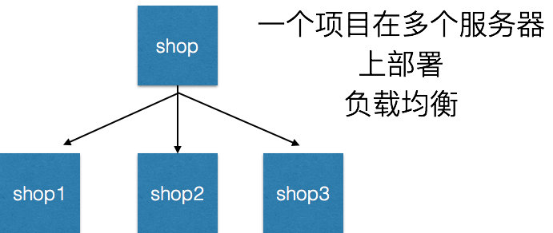
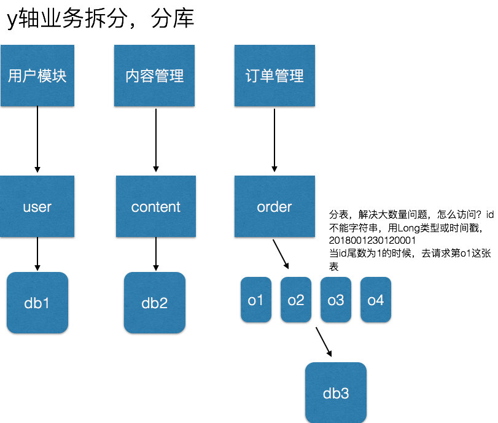

## 一、微服务架构的概念

微服务架构是一种架构概念，旨在通过将功能分解到各个离散的服务中以实现对解决方案的解耦。它的主要作用是将功能分解到离散的各个服务当中，从而降低系统的耦合性，并提供更加灵活的服务支持。

### 1、概念

把一个大型的单个应用程序和服务拆分为数个甚至数十个的支持微服务，它可扩展单个组件而不是整个的应用程序堆栈，从而满足服务等级协议。

### 2、定义

围绕业务领域组件来创建应用，这些应用可独立地进行开发、管理和迭代。在分散的组件中使用云架构和平台式部署、管理和服务功能，使产品交付变得更加简单。

### 3、本质

用一些功能比较明确、业务比较精练的服务去解决更大、更实际的问题。

**PS：** 微服务这个概念是 2012 年出现的，作为加快 Web 和移动应用程序开发进程的一种方法，2014 年开始受到各方的关注，同年为微服务的元年；

## 二、传统架构与微服务架构的区别

### 1、系统架构需要遵循的三个标准

- 提高敏捷性：及时响应业务需求，促进企业发展
- 提升用户体验：提升用户体验，减少用户流失
- 降低成本：降低增加产品、客户或业务方案的成本

### 2、传统的开发模式

先来看看传统的 WEB 开发方式，通过对比比较容易理解什么是 **微服务架构**。和 **微服务** 相对应的，这种方式一般被称为 **单体式开发（Monolithic）**。

既所有的功能打包在一个 WAR 包里，基本没有外部依赖（除了容器），部署在一个 JavaEE 容器（Tomcat，JBoss，WebLogic）里，包含了 DO/DAO，Service，UI 等所有逻辑。

#### 优点

- 开发简单，集中式管理
- 基本不会重复开发
- 功能都在本地，没有分布式的管理和调用消耗

#### 缺点

- 效率低：开发都在同一个项目改代码，相互等待，冲突不断
- 维护难：代码功功能耦合在一起，新人不知道何从下手
- 不灵活：构建时间长，任何小修改都要重构整个项目，耗时
- 稳定性差：一个微小的问题，都可能导致整个应用挂掉
- 扩展性不够：无法满足高并发下的业务需求

### 3、微服务架构

#### 目的

有效的拆分应用，实现敏捷开发和部署

#### 开发和交付中的伸缩立方

**X轴**： 运行多个负载均衡器之后的运行实例
**Y轴：** 将应用进一步分解为微服务（分库）
**Z轴：** 大数据量时，将服务分区（分表）

## 三、微服务的特征

### 官方的定义

- 一系列的独立的服务共同组成系统
- 单独部署，跑在自己的进程中
- 每个服务为独立的业务开发
- 分布式管理
- 非常强调隔离性

### 大概的标准

- 分布式服务组成的系统
- 按照业务，而不是技术来划分组织
- 做有生命的产品而不是项目
- 强服务个体和弱通信（ Smart endpoints and dumb pipes ）
- 自动化运维（ DevOps ）
- 高度容错性
- 快速演化和迭代

## 四、SOA 架构与微服务架构的区别

### SOA 注重重用，微服务注重重写

SOA 的主要目的是为了企业各个系统更加容易地融合在一起。

微服务通常由重写一个模块开始。要把整个巨石型的应用重写是有很大的风险的，也不一定必要。我们向微服务迁移的时候通常从耦合度最低的模块或对扩展性要求最高的模块开始。

把它们一个一个剥离出来用敏捷地重写，可以尝试最新的技术和语言和框架，然后 **单独布署**。它通常不依赖其他服务。微服务中常用的 `API Gateway` 的模式主要目的也不是重用代码。

而是减少客户端和服务间的往来。`API gateway` 模式不等同与 `Facade` 模式，我们可以使用如 `Future` 之类的调用，甚至返回不完整数据。

### SOA 注重水平服务，微服务注重垂直服务

SOA 设计喜欢给服务分层(如 Service Layers 模式)。我们常常见到一个 Entity 服务层的设计，美其名曰 Data Access Layer。这种设计要求所有的服务都通过这个 Entity 服务层。来获取数据。这种设计非常不灵活，比如每次数据层的改动都可能影响到所有业务层的服务。而每个微服务通常有它自己独立的 Data Store。我们在拆分数据库时可以适当的做些去范式化，让它不需要依赖其他服务的数据。

微服务通常是直接面对用户的，每个微服务通常直接为用户提供某个功能。类似的功能可能针对手机有一个服务，针对机顶盒是另外一个服务。在 SOA 设计模式中这种情况通常会用到 `Multi-ChannelEndpoint` 的模式返回一个大而全的结果兼顾到所有的客户端的需求。

### SOA 注重自上而下，微服务注重自下而上

SOA 架构在设计开始时会先定义好服务合同。它喜欢集中管理所有的服务，包括集中管理业务逻辑，数据，流程，Schema 等。它使用 Enterprise Inventory 和 Service Composition 等方法来集中管理服务。SOA 架构通常会预先把每个模块服务接口都定义好。模块系统间的通讯必须遵守这些接口，各服务是针对他们的调用者。

SOA 架构适用于 TO GAF 之类的架构方法论。

微服务则敏捷得多。只要用户用得到，就先把这个服务挖出来。然后针对性的，快速确认业务需求，快速开发迭代。

### 总结

微服务与 SOA 有很多相同之处。两者都属于典型的、包含松耦合分布式组件的系统结构。在围绕着服务的概念创建架构这一方面，微服务提供了一种更清晰、定义更良好的方式。微服务的原则与敏捷软件开发思想是高度一致的，而它与 SOA 原则的演化的目标也是相同的，则减少传统的企业服务总线开发的高复杂性。两者之间最关键的区别在于，微服务专注于以自治的方式产生价值。但是两种架构背后的意图是不同的：SOA 尝试将应用集成，一般采用中央管理模式来确保各应用能够交互运作。微服务尝试部署新功能，快速有效地扩展开发团队。它着重于分散管理、代码再利用与自动化执行。

| 功能     | SOA                  | 微服务                       |
| -------- | -------------------- | ---------------------------- |
| 组件大小 | 大块业务逻辑         | 单独任务或小块业务逻辑       |
| 耦合     | 通常松耦合           | 总是松耦合                   |
| 公司架构 | 任何类型             | 小型、专注于功能交叉的团队   |
| 管理     | 着重中央管理         | 着重分散管理                 |
| 目标     | 确保应用能够交互操作 | 执行新功能，快速拓展开发团队 |

微服务并不是一种新思想的方法。它更像是一种思想的精炼，一种 SOA 的精细化演进，并且更好地利用了先进的技术以解决问题，例如容器与自动化等。所以对于我们去选择服务技术框架时，并不是非黑即白，而是针对 SOA、MSA 两种架构设计同时要考虑到兼容性，对于现有平台情况架构设计，退则守 SOA，进则攻 MSA，阶段性选择适合的。

## 五、微服务的实践

要实际的应用微服务，需要解决以下问题：

- 客户端如何访问这些服务
- 每个服务之间如何通信
- 如此多的服务，如何实现？
- 服务挂了，如何解决？（备份方案，应急处理机制）

### 客户端如何访问这些服务

原来的 Monolithic 方式开发，所有的服务都是本地的，UI 可以直接调用，现在按功能拆分成独立的服务，跑在独立的一般都在独立的虚拟机上的 Java 进程了。客户端 UI 如何访问他？

后台有 N 个服务，前台就需要记住管理 N 个服务，一个服务 **下线**、**更新**、**升级**，前台就要重新部署，这明显不服务我们拆分的理念，特别当前台是移动应用的时候，通常业务变化的节奏更快。

另外，N 个小服务的调用也是一个不小的网络开销。还有一般微服务在系统内部，通常是无状态的，用户登录信息和权限管理最好有一个统一的地方维护管理（OAuth）。

所以，一般在后台 N 个服务和 UI 之间一般会一个代理或者叫 `API Gateway`，他的作用包括：

- 提供统一服务入口，让微服务对前台透明
- 聚合后台的服务，节省流量，提升性能
- 提供安全，过滤，流控等API管理功能

其实这个 `API Gateway` 可以有很多广义的实现办法，可以是一个软硬一体的盒子，也可以是一个简单的 MVC 框架，甚至是一个 `Node.js` 的服务端。他们最重要的作用是为前台（通常是移动应用）提供后台服务的聚合，提供一个统一的服务出口，解除他们之间的耦合，不过 `API Gateway` 也有可能成为 **单点故障** 点或者性能的瓶颈。

### 每个服务之间如何通信

所有的微服务都是独立的 Java 进程跑在独立的虚拟机上，所以服务间的通信就是 IPC（Inter Process Communication），已经有很多成熟的方案。现在基本最通用的有两种方式：

#### 同步调用

- REST（JAX-RS，Spring Boot）
- RPC（Thrift, Dubbo）

同步调用比较简单，一致性强，但是容易出调用问题，性能体验上也会差些，特别是调用层次多的时候。一般 REST 基于 HTTP，更容易实现，更容易被接受，服务端实现技术也更灵活些，各个语言都能支持，同时能跨客户端，对客户端没有特殊的要求，只要封装了 HTTP 的 SDK 就能调用，所以相对使用的广一些。RPC 也有自己的优点，传输协议更高效，安全更可控，特别在一个公司内部，如果有统一个的开发规范和统一的服务框架时，他的开发效率优势更明显些。就看各自的技术积累实际条件，自己的选择了。

#### 异步消息调用

- Kafka
- Notify
- MessageQueue

异步消息的方式在分布式系统中有特别广泛的应用，他既能减低调用服务之间的耦合，又能成为调用之间的缓冲，确保消息积压不会冲垮被调用方，同时能保证调用方的服务体验，继续干自己该干的活，不至于被后台性能拖慢。不过需要付出的代价是一致性的减弱，需要接受数据 **最终一致性**；还有就是后台服务一般要实现 **幂等性**，因为消息送出于性能的考虑一般会有重复（保证消息的被收到且仅收到一次对性能是很大的考验）；最后就是必须引入一个独立的 `Broker`

### 如此多的服务，如何实现？

在微服务架构中，一般每一个服务都是有多个拷贝，来做负载均衡。一个服务随时可能下线，也可能应对临时访问压力增加新的服务节点。服务之间如何相互感知？服务如何管理？

这就是服务发现的问题了。一般有两类做法，也各有优缺点。基本都是通过 Zookeeper 等类似技术做服务注册信息的分布式管理。当服务上线时，服务提供者将自己的服务信息注册到 ZK（或类似框架），并通过心跳维持长链接，实时更新链接信息。服务调用者通过 ZK 寻址，根据可定制算法，找到一个服务，还可以将服务信息缓存在本地以提高性能。当服务下线时，ZK 会发通知给服务客户端。

#### 基于客户端的服务注册与发现

优点是架构简单，扩展灵活，只对服务注册器依赖。缺点是客户端要维护所有调用服务的地址，有技术难度，一般大公司都有成熟的内部框架支持，比如 Dubbo。

#### 基于服务端的服务注册与发现

优点是简单，所有服务对于前台调用方透明，一般在小公司在云服务上部署的应用采用的比较多。

### 服务挂了，如何解决？

前面提到，Monolithic 方式开发一个很大的风险是，把所有鸡蛋放在一个篮子里，一荣俱荣，一损俱损。而分布式最大的特性就是网络是不可靠的。通过微服务拆分能降低这个风险，不过如果没有特别的保障，结局肯定是噩梦。所以当我们的系统是由一系列的服务调用链组成的时候，我们必须确保任一环节出问题都不至于影响整体链路。相应的手段有很多：

- 重试机制
- 限流
- 熔断机制
- 负载均衡
- 降级（本地缓存）

## 六、分布式锁

### 1、什么是分布式锁或者什么是zookeeper?

- 就是服务注册与发现中心，解决了分布式锁的问题，解释单点故障，本来有一个主服务器，下面有两个从服务器，调用主服务器，主服务器去调用从服务器的资源，那么主服务器挂掉了下面两个从服务器还能提供服务，结果因为主服务器挂了，下面两个从服务器用不到了，用不到这就叫单点故障，于是，我们传统的解决方法是两个节点（主服务器），一个主节点，一个备用节点，那么备用节点没事会ping这个主节点，发现主节点没有响应了，备用节点就上线，代替原来的主节点，成为新的主节点，但这有一种可能，主节点是因为网络震荡等，没有及时反馈备用节点，备用节点误以为主节点挂掉了，于是出现了双主问题，一旦出现双主问题，我们的请求就会出现重复多次请求，那么数据就有问题。为了解决这个问题，就引入了一个技术，分布式锁技术，而zookeeper就是为了解决分布式锁的问题。

- 怎么做到的？所有服务启动时都像zookeeper注册，这是他就维护了节点列表，这是zookeeper会选举谁来当主节点，剩下的成为备用节点，变成阻塞状态，当出现刚才网络震荡问题的时候，我们会把主节点直接从zookeeper的列表中删掉，而不是停掉，删掉以后，由备用节点继续有zookeeper选举，选举到谁中，谁就当主节点，而刚才因为网络震荡的主节点会从新注册，成为新的备用节点

如果库存笔记本有2台，这是三个人并发 同时购买1台，理论上不可能，但是，并发的话，在同一时刻只减少1。

- 为了保证一个方法或属性在高并发情况下的同一时间只能被同一个线程执行

- 在单机环境中，java提供了很多并发处理的api

- 由于分布式系统多线程，多进程并且分布在不同机器上，这将是原单机部署情况下的并发控制锁策略失效

- 为了解决这个问题，就需要一种跨jvm的互斥机制来控制共享资源的访问，在这三个jvm中游走

  ##### 这就是分布式锁要解决的问题，zookepper就能做到这个效果

### 2、分布式锁应该具备哪些条件？

- 在分布式系统环境下，一个方法在同一时间只能被一个机器的一个线程执行
- 高可用的获取锁与释放锁
- 高性能的获取锁与释放锁
- 具备可重入性（可理解为重新进入，由多于一个任务并发使用，而不必担心数据错误）
- 具备锁失效机制，防止死锁
- 具备非阻塞锁特性，既没有获取到锁将直接返回获取锁失败

### 3、基于Zookeeper的实现方式

zookeeper完美解决了上述问题

- 他是一个为分布式应用提供一致性服务的开源组件，它内部是一个分层的文件系统目录树结构，规定同一个目录下只能有一个唯一文件名

实现分布式锁的步骤

1. 创建一个目录MyZookeeper
2. 线程A想获取锁就在MyZookeeper目录下创建临时顺序节点
3. 获取MyZookeeper目录下所有的子节点，然后获取比自己小的兄弟节点，如果不存在，则说明当前线程顺序号最小，获得锁
4. 线程B获取所有节点，判断自己不是最小节点，设置监听比自己小的节点
5. 线程A处理完，删除自己的节点，线程B监听到变更事件，判断自己是不是最小的节点，如果是则获得锁

## 七、微服务架构设计模式

### 微服务架构需要考虑的问题

- API Gateway
- 服务间调用
- 服务发现
- 服务容错
- 服务部署
- 数据调用

### 聚合器微服务设计模式

这是一种最常见也最简单的设计模式

聚合器调用多个服务实现应用程序所需的功能。它可以是一个简单的 WEB 页面，将检索到的数据进行处理展示。它也可以是一个更高层次的组合微服务，对检索到的数据增加业务逻辑后进一步发布成一个新的微服务，这符合 **DRY** 原则。另外，每个服务都有自己的缓存和数据库。如果聚合器是一个组合服务，那么它也有自己的缓存和数据库。聚合器可以沿 `X轴` 和 `Z轴` 独立扩展。

### 代理微服务设计模式

这是聚合模式的一个变种，如下图所示

在这种情况下，客户端并不聚合数据，但会根据业务需求的差别调用不同的微服务。代理可以仅仅委派请求，也可以进行数据转换工作。

### 链式微服务设计模式

这种模式在接收到请求后会产生一个经过合并的响应，如下图所示

在这种情况下，`服务A` 接收到请求后会与 `服务B` 进行通信，类似地，`服务B` 会同 `服务C` 进行通信。所有服务都使用同步消息传递。在整个链式调用完成之前，客户端会一直阻塞。因此，服务调用链不宜过长，以免客户端长时间等待。

### 分支微服务设计模式

这种模式是聚合器模式的扩展，允许同时调用两个微服务链，如下图所示

### 数据共享微服务设计模式

自治是微服务的设计原则之一，就是说微服务是全栈式服务。但在重构现有的“单体应用（Monolithic Application）”时，SQL 数据库反规范化可能会导致数据重复和不一致。因此，在单体应用到微服务架构的过渡阶段，可以使用这种设计模式，如下图所示

在这种情况下，部分微服务可能会共享缓存和数据库存储。不过，这只有在两个服务之间存在强耦合关系时才可以。对于基于微服务的新建应用程序而言，这是一种反模式。

### 异步消息传递微服务设计模式

虽然 REST 设计模式非常流行，但它是同步的，会造成阻塞。因此部分基于微服务的架构可能会选择使用消息队列代替 REST 请求/响应，如下图所示

## 八、新架构新起点

对于微服务架构，最重要的是思维上的转变，技术不是问题，思想才是王道（有道无术，术尚可求，有术无道，止于术）

对于做微服务开发的几点建议：

- 应用程序的核心是业务逻辑，按照业务或客户需求组织资源（这是最难的）
- 做有生命的产品，而不是项目
- 全栈化
- 后台服务贯彻 Single Responsibility Principle（单一职责原则）
- VM -> Docker
- DevOps