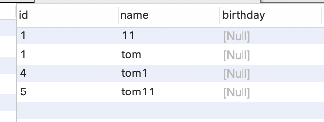

# mysql第一天

## 一、数据库

- database
  - 简写DB

为什么学数据库？

- 软件由什么组成
  - 程序+数据+文档
  - 最终都是要存储数据分析数据
  - 文档-开发文档-测试文档-使用文档等等

我们学的数据库

- mysql-中小型数据库
- sqlserver-中型数据库-微软
- oracle-大型数据库-甲骨文(收费，政府、银行、金融机构、大平台)
- db2-中型数据库-IBM

为什么学mysql？

- 中小型数据库-甲骨文
- 免费、开源
- 主流的，占公司使用比的90%，使用广
- 所有数据库都属于关系型数据库，都支持一种语言，sql语言
- sql叫结构化查询语言

## 二、安装

进入dos窗口

```sh
直接输入mysql，测试安装成功

mysql -u root -p
输入密码

show databases;

use 1901;

show tables;

select * from user

seletc username,userage from user
```

mysql包括什么？

- 若干个数据库
- 每个数据库里有若干个表
- 关系型数据库就表，简单的excl，有行和列
- 列对应的字段，行对应的记录

3、navicat

- 连接数据库
- 建立数据库
- 选择utf-8
- 创建表

  - 表名

  - 字段

  - 类型

    - varchar和char

      - varchar长度可变，经常使用，不能超，可以少，不足长度自动减少
      - char长度不可变，不够用空格补全，但是效率高，不用判断

      ```sh
      适用MySQL 5.0以上版本：
      1.一个汉字占多少长度与编码有关：
      UTF-8：一个汉字＝3个字节
      GBK：一个汉字＝2个字节
      2.在MySQL中 varchar(n)和char(n)表示n个字符，无论汉字和英文，Mysql都能存入n个字符，仅是实际字节长度有所区别
      即 MySQL 并不会对超过长度的字符报错,而是直接截断了。并且 char(2) 和 varchar(2) 都能存储 2个汉字,或者是两个英文字符。
      3. MySQL 的 char(n) 和varchar(n) 可以直接存储 n 个汉字. 而不是 n/3或者 n/2 个，mysql 屏蔽了具体的存储细节，而直接以实际字符的个数来决定char存储的个数。
      ```

    - int、float、double

    - bit对应boolean  是0 1

    - 日期

      - date

        - 日期

      - time

        - 时分秒

      - datetime

        - 日期+时分秒
        - 需要手动录入时间，否则为空

      - timestamp

        - 日期+时分秒

        - 不传入数据，默认选择当前系统时间录入

  - 非空属性

    - 值不能为空 not null
- 主键

  - 不允许重复，默认唯一，非空，代表的是一条记录

  - 一个表中最多只允许有一个主键，但可以是联合主键

    ```sh
    比如这种时候
    商品品牌 商品型号
    诺基亚        920
    三星         NOTE2
    诺基亚        8088
     
    比如这样商品品牌可能有重复，都是诺基亚，但是诺基亚厂商生产的商品型号是不会重复的
    也比如，可能好多品牌都有920这个型号，但是一个品牌只有一个920的型号
    ```

    

  - 可以通过PRIMARY KEY声明
- 默认值

  - 约定这个字段在用户不添加的情况下的默认值
- 唯一约束

  - unique
  - 值是唯一的，可以为空，字段值不能重复
  - 主键只能有一个，唯一可以有多个
  - 主键能自动增长，唯一不能自增
  - 主键能作为另一张表的外键，唯一不能
- 外键约束

  - 一个表中的特殊字段，引用了另外一张表的主键字段
  - 外键字段下的数据必须来自于关联的另外一张表中的主键数据
  - 外键字段的类型和长度必须和关联的主键相同
- 删除有外键约束的数据
- 自动递增
  - 可以选择表中某个字段设置为自动递增字段，又称自动编号字段
  -  必须是整型的字段
  -  必须是主键字段
  -  一张表最多一个自动递增字段
  -  自动递增字段下的数据，在添加记录时，不用指定，可以自动产生编号
  -   要求“id”列记录，从1开始，每条加1，并且是数据库自动增加，而不是手动增加

### 案例

- dos命令创建表

  ```sql
  create database 数据库名称;
  
  show database;查看数据库
  
  use 数据库名称；使用哪个数据库
  
  create table 表名(
  	字段 类型(长度) 约束，
    字段 类型(长度) 约束
    注意，字段类型如果是字符串必须加长度，其他类型可以不加长度，int默认长度11
  );
  
  
  
  create table employee(
  	id int,
    name varchar(20),
    gender varchar(10),
    brithday date,
    entry_date date,
    job varchar(100),
    salary double
  );
  
  show tables;查看表
  
  desc 表名; 查看表的信息
  
  
  create table employee(
  	id int pramary key auto_increment,
    name varchar(20) unique not null,
    gender varchar(10) not null,
    brithday date,
    entry_date date,
    job varchar(100),
    salary double
  );
  
  
  删除表
  drop table employee2
  ```

  
