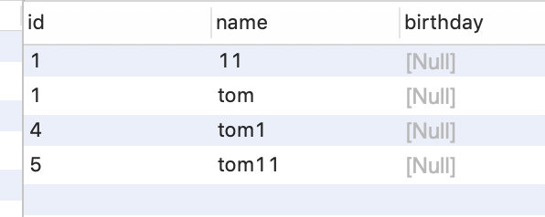

# mysql第三天

针对查询语句继续学习，因为查询语句比较复杂，且优化的可能性最大，面试笔试最容易考

## 一、内置函数

Tb_student表

### 日期函数

- 查询某人的出生日期，只显示年份

  ```sh
  select year(birthday) from tb_student where name = '郑新伟'
  select month(birthday) from tb_student where name = '郑新伟'
  select day(birthday) from tb_student where name = '郑新伟'
  ```

### 数学函数

- floor
- ceil
- round
- abs

### 字符串函数

- length(str)

- concat("a","b")

  ```sh
  select concat(name,'[',code,']') from tb_student
  ```

- trim(" abc ")
  - ltrim()
  - rtrim()
- substring(str,n,m)取子串
  
  - 在str字符串中，从n开始，连续取m个，如果m省略，则从n开始一直取到结尾

### 去重

distinct(字段名)去重，返回的是不重复的字段值

```sql
select DISTINCT(nationality) from tb_student
```


## 二、聚合函数

只返回一条记录

- sum()

- count(*)统计所有

  - count(字段)特殊 不统计null

  ```sql
  select count(*) from person   4
  select count(birthday) from person   0
  ```

  

- max()

- min()

- avg()

## 三、排序和按范围取记录数

#### Order by

- 按年龄从大到小排序

  ```sql
  select * from tb_student order by age;默认升序asc
  
  select * from tb_student order by age desc;
  ```

- 按年龄排序在按日期排序

  ```sql
  select * from tb_student order by age desc,birthday desc
  ```

#### limit

- 只显示前5条记录
- 分页
- 查询汉族的学生按照年龄排序并且只显示前10条

## 四、分组查询

如果在有group by操作中，select后面接的结果集字段只有两种：要么就只有group by后出现的字段，要么就是group by后出现的字段＋聚合函数的组合（常用的五种聚合函数：min()求列中最小数值，max()求列中最大数值，avg()求平均值，sum()求列中字段对应数值的总和，count()求列的总条数）


- 按性别查询年龄的平均值

  ```sql
  select avg(age),age from tb_student group by sex 
  ```

  

- 统计性别为男的各个民族的平均年龄

```sql
select avg(age),nationality from tb_student where sex = '男' GROUP BY nationality order by avg(age) desc limit 2
```

- 查看平均年龄超过26岁的性别为男的民族

```sql
select avg(age),nationality from tb_student where sex = '男' group by nationality HAVING avg(age)>26 
```

where只能用在原始数据的条件上

having用在分组后的数据筛选上


## 练习

- 查询满族学生年龄最小的前十名

  ```sql
  select * from tb_student where nationality='满族' order by age limit 10
  ```

  

- 查询满族学生年龄最大的前10名

  ```sql
  select * from tb_student where nationality='满族' order by age desc limit 10
  ```

  

- 查询民族

  ```sql
  SELECT nationality from tb_student 
  ```

  

- 有多少个民族

  ```sql
  SELECT DISTINCT(nationality) from tb_student
  
  select nationality from tb_student group by nationality
  ```

  

- 查询学生都在哪天出生

  ```sql
  select day(birthday),name from tb_student 
  ```

  

- 查询学生的平均年龄

  ```sql
  select avg(age) from tb_student 
  ```

  

- 查询所有女同学的平均年龄

  ```sql
  select avg(age) from tb_student where sex = '女'
  ```

  

- 查询所有女同学的平均年龄,以及最大年龄，最小年龄

  ```sql
  select avg(age),max(age),min(age) from tb_student where sex = '女'
  ```

  

- 统计男同学有多少名

  ```sql
  select count(*) from tb_student where sex = '男'
  ```

- 统计每个民族的男生人数

  ```sql
  select count(*),nationality from tb_student where sex = '男' GROUP BY nationality
  ```

  

- 统计有多少条记录

  ```sql
  select count(*) from tb_student
  ```

  

- 统计有多少名回族的学生

  ```sql
  select count(*) from tb_student where nationality = '回族'
  ```

  

- 统计人数排名前五的民族中，男性学生的数量

  ```sql
  select count(*),nationality from tb_student where sex = '男' GROUP BY nationality order by count(*) DESC limit 5
  ```

  

- 统计多于30人的民族

  ```sql
  select count(*),nationality from tb_student GROUP BY nationality having count(*)>30
  ```

  