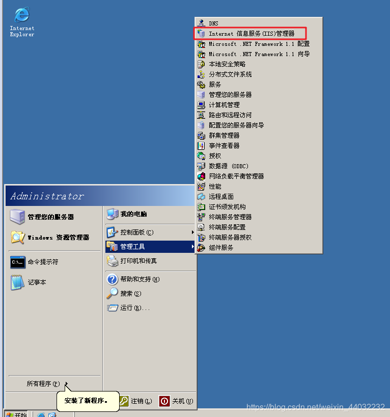
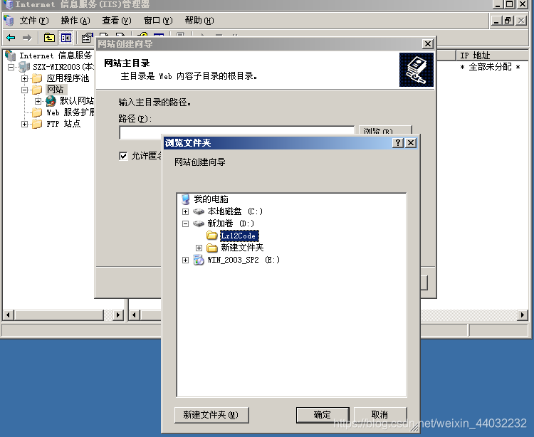

## 1、什么是WEB服务器

- WEB服务器也称为网页服务器或HTTP服务器
- WEB服务器使用的是HTTP(不加密)和HTTPS协议(加密)

HTTP协议端口号：80
HTTPS协议端口号：443

## 2、WEB服务器发布软件

1）微软：IIS（可以发布WEB网站和FTP站点）
2）Liunx：Apache/LAMP/Tomcat/nginx
3）第三方：phpstudy XAMPP

## 3、部署WEB服务器

1）服务器配置静态IP

2）安装WEB服务软件
这里把FTP也装上

3）打开软件

4）检查80端口是否打开

打开浏览器输入IP查看默认站点

默认网站路径

5）编写网页

6）发布网站

选择网站路径并启用匿名访问

动态网页需要勾选运行脚本

移到最上面

xp访问服务器

如果在一个服务器需要发布不同的站点需要指定不同的端口

## 4、DNS解析不同域名站点

利用DNS在同一个服务器上发布不同的站点（IP/端口相同）绑定的域名不同
1）新建两个网页京东和淘宝

2）安装DNS组件并创建两个区域

3）新建主机

4）XP上指定DNS

5）正常情况下同一个服务器上一个端口只提供一个服务

jd在占用80端口，taobao是停止状态

6）添加主机头值

启动站点

7）XP验证

完成相同IP，相同端口，不同域名绑定

