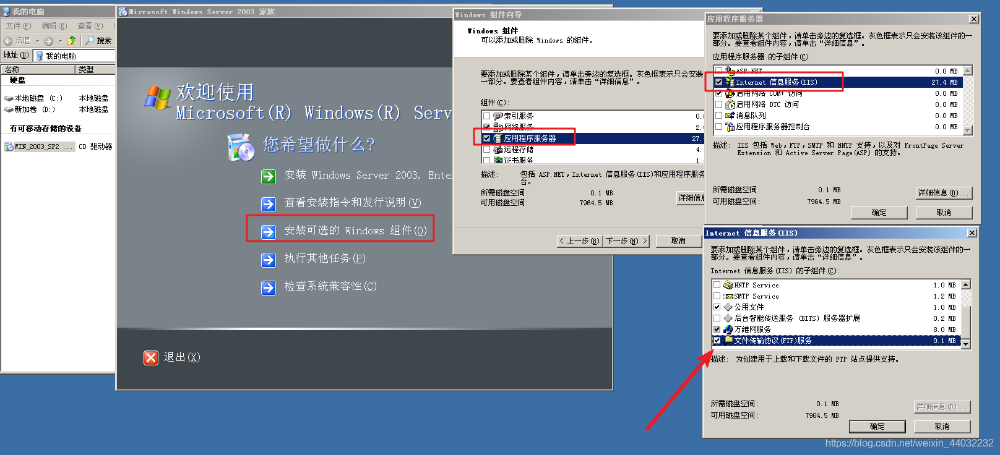
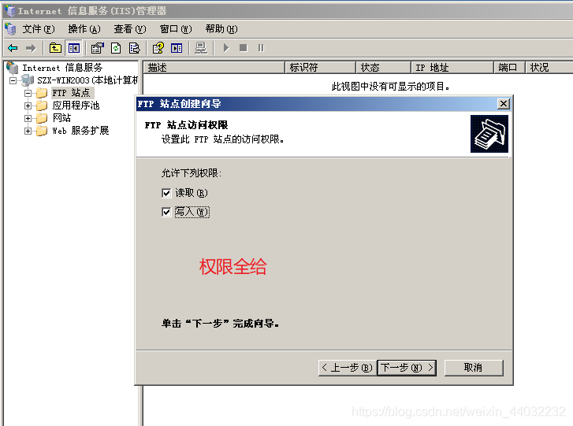
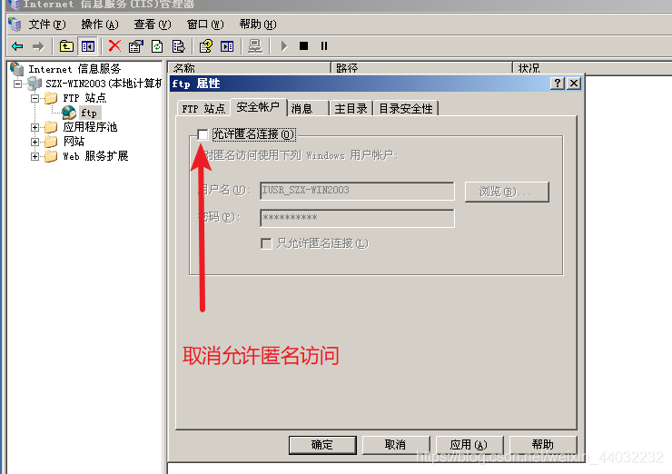
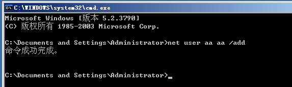

## 1、FTP介绍

FTP（File Transfer Protocol，文件传输协议） 是 TCP/IP 协议组中的协议之一。FTP协议包括两个组成部分，其一为FTP服务器，其二为FTP客户端。其中FTP服务器用来存储文件，用户可以使用FTP客户端通过FTP协议访问位于FTP服务器上的资源。在开发网站的时候，通常利用FTP协议把网页或程序传到Web服务器上。此外，由于FTP传输效率非常高，在网络上传输大的文件时，一般也采用该协议。

## 2、使用端口

默认情况下FTP协议使用TCP端口中的 20和21这两个端口，其中20用于传输数据，21用于传输控制信息。
20端口：数据端口
21端口：控制端口

## 3、FTP工作模式

**主动模式和被动模式是站在服务器角度**

> 服务器主动给客户机发送数据叫主动模式
> 服务器被动接收客户机发送过来的数据叫被动模式

1）主动模式
FTP开放：21端口 + 20端口
客户机在访问FTP服务器时会在本机随机生成两个端口（50000+开始）

2）被动模式
FTP开放：21端口 + 随机端口(作为数据传输端口)

> 服务器如果开启防火墙：采用主动模式连接
> 客户机如果开启防火墙：采用被动模式连接
> 

## 4、部署FTP服务器

1）安装FTP服务器

2）配置静态IP

3）打开FTP服务器

4）查看默认站点路径

注意：当我们安装完FTP服务器后默认服务器已经启动端口已经打开

5）新建FTP站点

至此FTP站点创建完成
6）配置FTP站点
右键 – 属性

7）验证FTP
在服务器上新创建一个用户aa 密码aa

给aa用户分配NTFS文件权限
**用户的最终权限为：FTP权限与NTFS权限交集**
建议FTP权限全部勾选，最终在NTFS设置用户权限

删除除管理员外的其他用户

添加aa用户并分配读取权限

XP上访问2003的FTP服务进行验证

由于我们没有给aa用户其他权限 所以该用户无法创建 无法删除 无法修改。。。

## 5、第三方软件

第三方可以提供FTP服务的软件

官网：[serv-u](https://www.serv-u.com/)