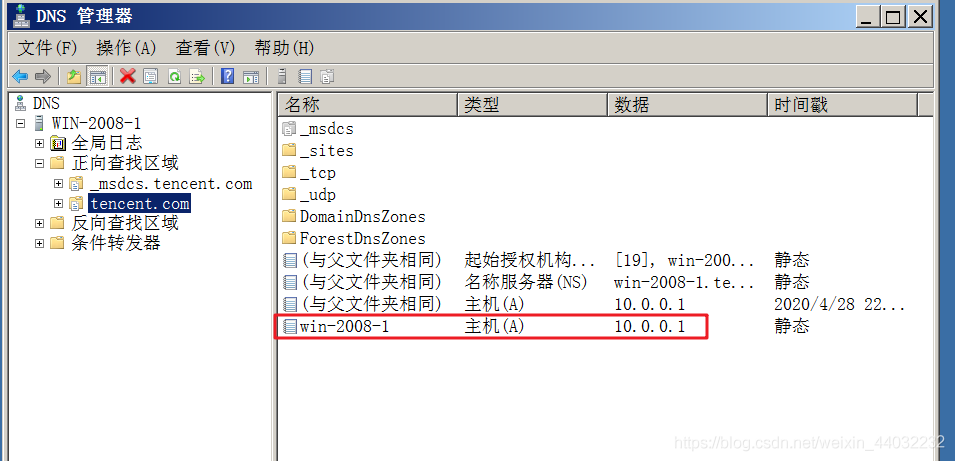
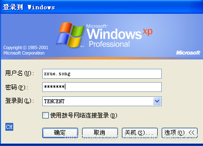

## 一、概述

域（Domain）是计算机网络的一种形式，其中所有用户账户，计算机，打印机和其他安全主体都在位于称为域控制器的一个或多个中央计算机集群上的中央数据库中注册。

域之间相互访问则需要建立信任关系。信任关系是连接在域与域之间的桥梁。当一个域与其他域建立了信任关系后，2个域之间不但可以按需要相互进行管理，还可以跨网分配文件和打印机等设备资源，使不同的域之间实现网络资源的共享与管理，以及相互通信和数据传输。

域既是 Windows 网络操作系统的逻辑组织单元，也是Internet的逻辑组织单元，在 Windows 网络操作系统中，域是安全边界。

域管理员只能管理域的内部，除非其他的域显式地赋予他管理权限，他才能够访问或者管理其他的域，每个域都有自己的安全策略，以及它与其他域的安全信任关系。

## 二、内网环境

1）工作组：默认模式，人人平等，不方便管理
2）域：人人不同等，集中管理，统一管理

## 三、域的特点

集中/统一管理

## 四、域的组成

1）域控制器 DC（Domain Controller）
2）成员机

## 五、域的部署

1）安装域控制器 就生成了域环境
2）安装了活动目录 就生成了域控制器
3）活动目录 AD （Active Directory）

## 六、活动目录

特点：
1）AD
2）集中管理/统一管理

## 七、组织单位（OU）

组织单位(Organizational Unit)简称OU 是可以将用户、组、计算机和其它组织单位放入其中的AD(Active Directory，活动目录)容器，是可以指派组策略设置或委派管理权限的最小作用域或单元。

> 通俗一点说，如果把AD比作一个公司的话，那么每个OU就是一个相对独立的部门。 创建组织单位OU的创建需要在DC(域控制器)中进行

**创建OU**

一般按照公司的组织架构创建OU

如果组织架构有变动**不要删除与用户 移动即可**

## 八、组策略Group Policy Object（GPO）

作用：通过组策略可以修改计算机的各种属性，如开始菜单、桌面背景、网络参数等。
**组策略在域中，是基于OU来下发的**
组策略在域中下发后，用户的应用顺序是：LSDOU

**创建组策略**

创建每个部门的组策略

**配置组策略**

组策略下发顺序：

> 上级ou： 桌面：aa.jpg 运行：删除
> 下级ou： 桌面：未配置 运行：不删除
> 用户最终结果：桌面：aa.jpg 运行：不删除
> 在应用过程中，如果出现冲突，后应用的生效

**注意：当上级强制和下级组织继承同时设置，强制生效；**

## 九、部署安装活动目录

服务器：win2008
调出桌面图标

1）桥接到VMnet2

2）配置静态IP地址

**win2008支持的一些服务**

3）安装活动目录

**开始 – 运行 – dcpromo(安装/卸载)**

检测向导（检测系统适不适合安装域环境）

检测冲突

林功能级别

域功能级别

**安装完成重新启动服务器**

4）验证
登录域账户
**DC的本地管理员升级为域管理员**

DNS自动注册并指向自己的IP地址

## 十、加入域

XP和DC桥接到同一网络
配置IP
配DNS（因我们的DC就是DNS所以配置为DC IP）

右键计算机属性 – 计算机名 – 更改

**计算机重启生效**

登陆时需要用域账户登录

域账户由DC创建

## 十一、DC创建域用户

1）右键 – Users – 新建 – 用户

创建了用户的家目录

**域用户权限：**
建议将域用户加入到普通成员机的本地管理员组中，让其对普通成员机有完全控制权限

> 1、用域用户管理员登录到普通成员机
> 2、将普通域用户加入到本地管理员组

