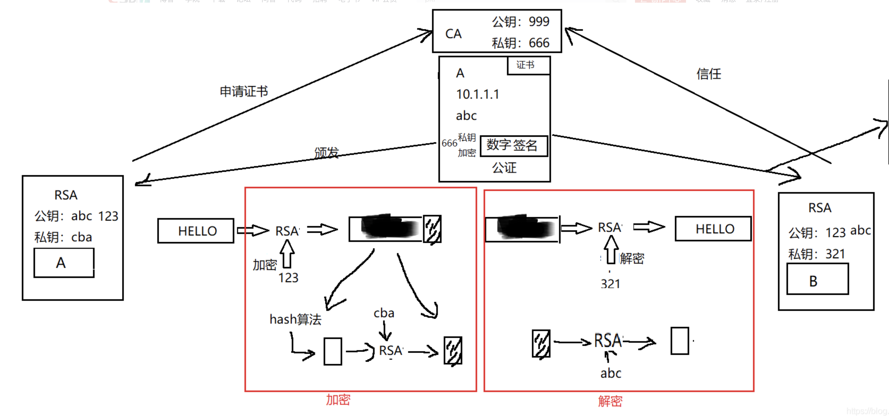

### 1、PKI概述

名称：Public Key Infrastruction 公钥基础设施

作用：通过加密技术和数字签名保证信息的安全

组成：公钥机密技术、数字证书、CA、RA

### 2、信息安全三要素

机密性

完整性

身份验证/操作的不可否认性

### 3、哪些IT领域用到PKI：

1）SSL/HTTPS

2）IPsecVPN

3）部分远程访问VPN

### 4、公钥加密技术

作用：实现对信息加密、数字签名等安全保障

加密算法：

1）对称加密算法

加解密道的密钥一致

DES 3DES AES

2）非对称加密算法

*通信双方各自产生一对公私钥

*双方各自交换公钥

*公钥和私钥互为加解密关系！

*公私钥不可互相逆推！

RSA DH

3）HASH算法：MD5 SHA（不可逆,验证完整性）

HASH值 = 摘要

### 5、数字签名：

用自己的私钥对摘要加密得出的密文就是数字签名

### 6、证书：

证书用于保证公密钥的合法性

证书格式遵循X.509标准

数字证书保护信息：

使用者的公钥值

使用者标识信息（如名称和电子邮件地址）

有效期（证书的有效时间）

颁发者标识信息

颁发者的数字签名

数字证书由权威公正的 第三方机构即CA签发

### PKI实验

实验步骤;

1、配置服务器IP地址10.1.1.2/24

2、安装IIS服务，并建立站点。

在xp客户机上验证访问 [http://www.flower.com](http://www.flower.com/)

3、安装CA组件

4、打开IIS，先生成证书申请文件

5、向CA申请证书：

打开网页：http://10.1.1.2.certsrv 并向CA发送web服务器申请文件

6、CA颁发证书

7、在web服务器上下载并完成安装

8、在web服务器上启用SSL443

9、在客户端上验证

