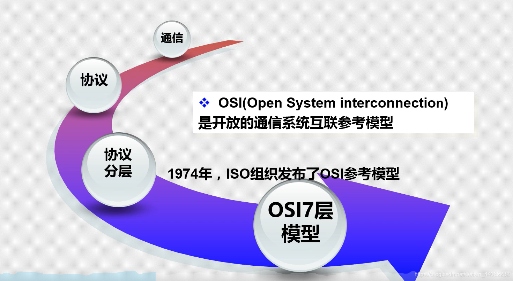

# 一、基础架构

# 二、分层模型

## 1、分层思想

通信需求：定义协议标准
完成每件事需要的协议太多怎么办？

下层为上层提供服务，每一层的工作是独立的，最上层的是小女孩。

将复杂的流程分解为几个功能相对单一的子过程

- 整个流程更加清晰，复杂流程简单化
- 更容易发现问题并针对性的解决问题
  
  
  同层使用相同协议，每一层工作是相互独立的，下层为上层提供服务。

## 2、OSI七层模型

1、osi模型诞生时间

# 三、数据传输过程

TCP/IP 5层协议簇/协议栈

## 1、数据的封装与解封装过程

1）数据封装过程

2）数据解封装过程

## 2、OSI模型对比

## 3、各层的硬件

## 4、各层协议

## 5、各层间通信

# 四、物理层 网线线序

