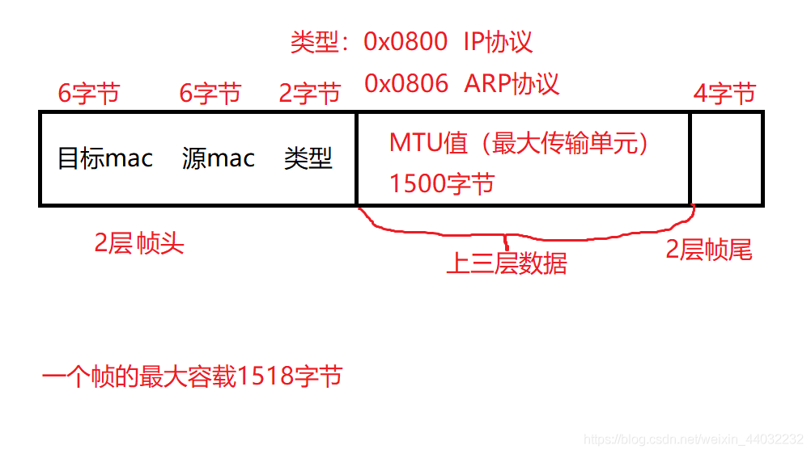
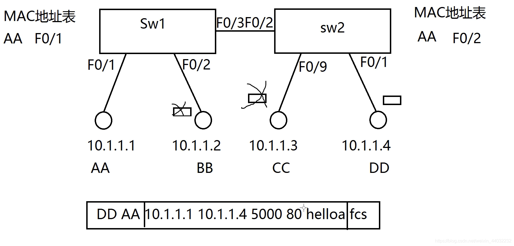
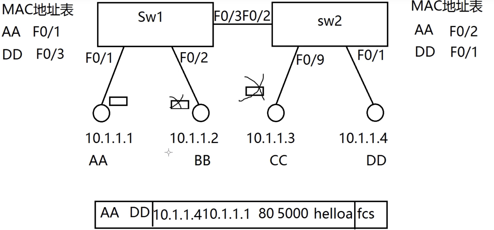
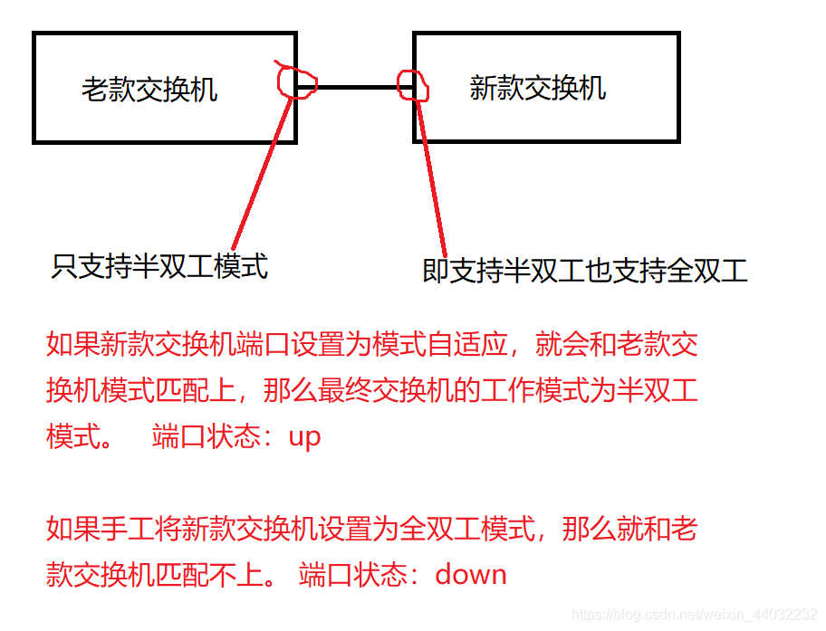
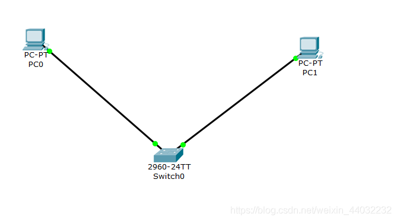
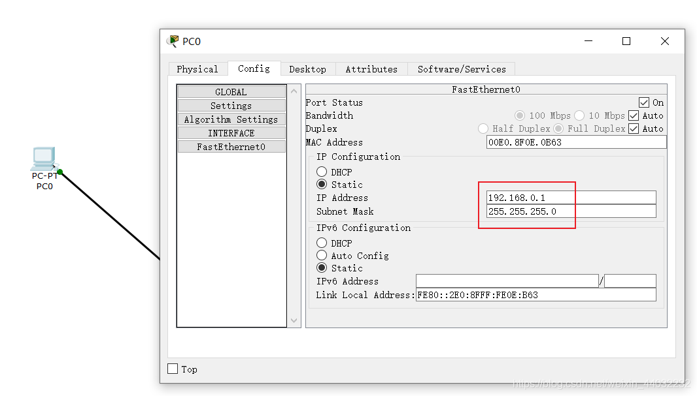
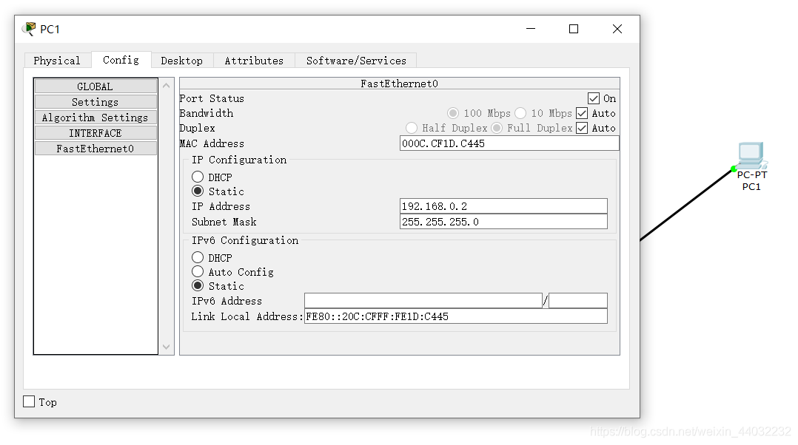
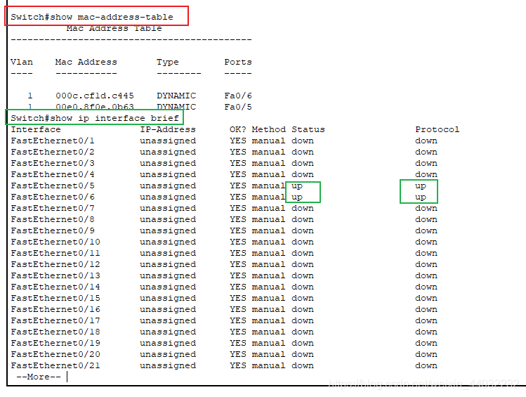

# 数据链路层及交换机工作原理

# 一、数据链路层

## 1、帧结构

1、属于2层
2、传输单元：帧
3、帧结构如下：

帧格式：
802.3 有线
802.11 无线

帧头内容：目标mac 源mac 类型
帧头中的类型作用：识别上层协议，为上层提供服务。
mac地址：也叫物理地址，全求唯一！长度：48位，6字节

> 帧头： 6+6+2 = 12字节
> MTU值：1500字节
> 帧尾： 4字节

# 二、交换机工作原理

工作在数据链路层的设备：交换机/网卡

## 1、工作原理

AA给DD发消息 交换机的工作流程图
第一次发送消息 交换机进行广播

DD给AA发消息
交换机单播


> 交换机收到一个数据帧后：
> 1、首先学习帧中的源MAC地址来形成MAC地址表
> 2、然后检查帧中的目标MAC地址，并匹配MAC地址表，如表中有匹配项，则单播转发，如表中无匹配项，则除接收端口外广播转发。
> 3、MAC地址表的老化时间默认是300秒（可修改）

交换机端口：

```c
E  10Mb
F  100Mb
G  1000Mb
Te 10000Mb

F0/1    0模块号  1接口号

1234567
```

接口速率自适应：1000/100/10M自适应
速率工作模式可以为10，100，1000任何一种状态
端口状态：up down

down的3种可能：

1. 人工down掉
2. 速率不匹配
3. 双工模式不匹配
   双工模式：单工(只能打或只能听) 半双工(一个打一个听，需要等待对方说完才能说) 全双工(打字对骂，无需等待对方说完)
   

# 三、交换机5大基本工作模式及命令

pt软件安装包：

> 链接：https://pan.baidu.com/s/1Tx_v2sSmjjb8CVdwOsgcqQ
> 提取码：h2fi

### 1）用户模式：

可以查看交换机的基本简单配置，且不能做任何修改配置！

```bash
switch> 
1
```

### 2）特权模式：

可以查看所有配置！不能修改配置，但可以做测试，保存，初始化操作！

```bash
switch> enable
switch#
12
```

### 3）全局配置模式：

默认不能查看配置！可以修改配置，且全局生效！

```bash
switch# configure terminal
switch(config)#
12
```

### 4）接口配置模式：

默认不能查看配置！可以修改配置，且对该端口生效！

```bash
switch(config)# interface  f0/2
switch(config-if)#
12
```

### 5）console口/线/控制台模式：

默认不能查看配置！可以修改配置，且对console口生效！

```bash
switch(config)# line  console 0
switch(config-line)#
12
```

### 6）基本命令

```bash
exit  模式退出一级
end   直接退到特权模式
Switch(config)#hostname sw       修改主机名
Switch(config-line)#password 123456  console口配置密码/用户密码
Switch(config-line)#login            登录验证生效       退到用户模式下 在进入需要密码验证
show  running-config             在特权模式下  查看内存中running-config配置文件
show  startup-config             在特权模式下  查看硬盘中startup-config配置文件 验证是否保存
reload                           在特权模式下  重启设备	
Switch(config)#enable secret 5 $1$mERr$H8N8rBqotQBX72BBJWHN1/  在全局配置模式下  配置特权密码   密文
Switch(config)#enable password 000000                          在全局配置模式下  配置特权密码   明文
Switch#erase startup-config      在特权模式下  清除startup-config  恢复出厂设置
Switch#show mac-address-table    在特权模式下  查看mac地址表
Switch#show ip interface brief   在特权模式下  查看接口列表 接口状态
Switch(config)#do show running-config  do的用法 在其他模式下使用特权模式的命令
1234567891011121314
```

> 快捷键
> ctrl+u：快速删除光标所有字符
> ctrl+a：快速定位光标到行首
> ctrl+e：快速定位光标到行尾

在内存中存在一个文件：
第一次开机系统会在内存中自动创建一个干净的running-config。
交换机所有配置都在running-config文件中
**注意：running-config这个文件是在内存中的**

将配置文件保存在交换机的硬盘中，持久化存储！

保存配置：

```bash
enable copy running-config startup-config
或
write（思科）
123
```

> 交换机开机动作
> 1、先去硬盘中查找startup-config是否存在。
> 2、如果不存在，则在内存中创建新的running-config文件。
> 3、如果存在，则复制到内存中并改名为running-config。

# 四、实验

## 1、环境搭建


给两台PC配置ip
PC0

PC1

在模拟器中需要用PC0 ping PC1 ping通在交换机的mac地址表中才会存在


## 2、手工关闭接口

```bash
Switch(config)#interface fastEthernet 0/3
Switch(config-if)#shutdown

%LINK-5-CHANGED: Interface FastEthernet0/3, changed state to administratively down
Switch(config-if)#exit
Switch(config)#exit
Switch#
%SYS-5-CONFIG_I: Configured from console by console

Switch#show ip interface brief 
Interface              IP-Address      OK? Method Status                Protocol 
FastEthernet0/1        unassigned      YES manual down                  down 
FastEthernet0/2        unassigned      YES manual down                  down 
FastEthernet0/3        unassigned      YES manual administratively down down 
FastEthernet0/4        unassigned      YES manual down                  down 
FastEthernet0/5        unassigned      YES manual up                    up 
FastEthernet0/6        unassigned      YES manual up                    up 
FastEthernet0/7        unassigned      YES manual down                  down 
FastEthernet0/8        unassigned      YES manual down                  down 
FastEthernet0/9        unassigned      YES manual down                  down 
FastEthernet0/10       unassigned      YES manual down                  down 
FastEthernet0/11       unassigned      YES manual down                  down 
FastEthernet0/12       unassigned      YES manual down                  down 
FastEthernet0/13       unassigned      YES manual down                  down 
FastEthernet0/14       unassigned      YES manual down                  down 
FastEthernet0/15       unassigned      YES manual down                  down 
FastEthernet0/16       unassigned      YES manual down                  down 
FastEthernet0/17       unassigned      YES manual down                  down 
FastEthernet0/18       unassigned      YES manual down                  down 
FastEthernet0/19       unassigned      YES manual down                  down 
FastEthernet0/20       unassigned      YES manual down                  down 
FastEthernet0/21       unassigned      YES manual down                  down 
 --More-- 
123456789101112131415161718192021222324252627282930313233
```

开启接口

```bash
Switch(config)#interface fastEthernet 0/3
Switch(config-if)#no shutdown
12
```

> Status administratively down 表示人为关闭的 物理状态
> Protocol down 协商状态

## 3、删除配置

1）在哪配置的在哪删！
2）命令前加no空格！
3）原命令中有参数，并且参数具有唯一性，则删除时不需要加参数。
如：

```bash
conf t
hostname sw1

conf t
no hostname
```