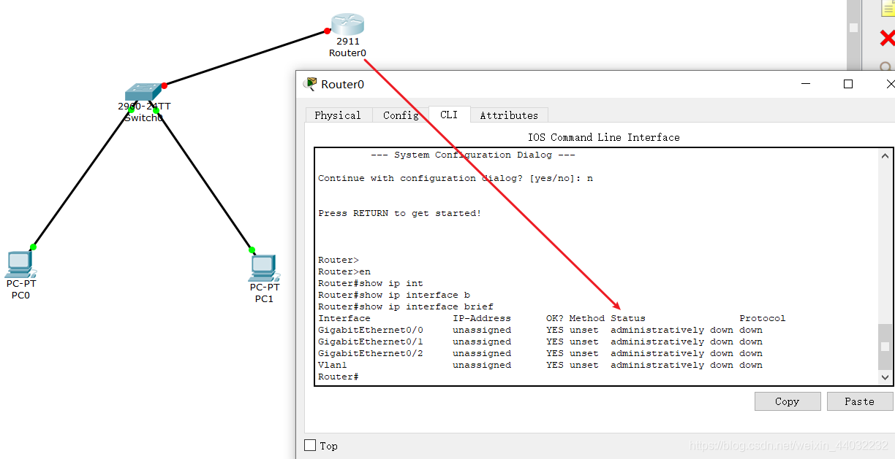
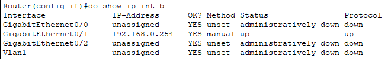
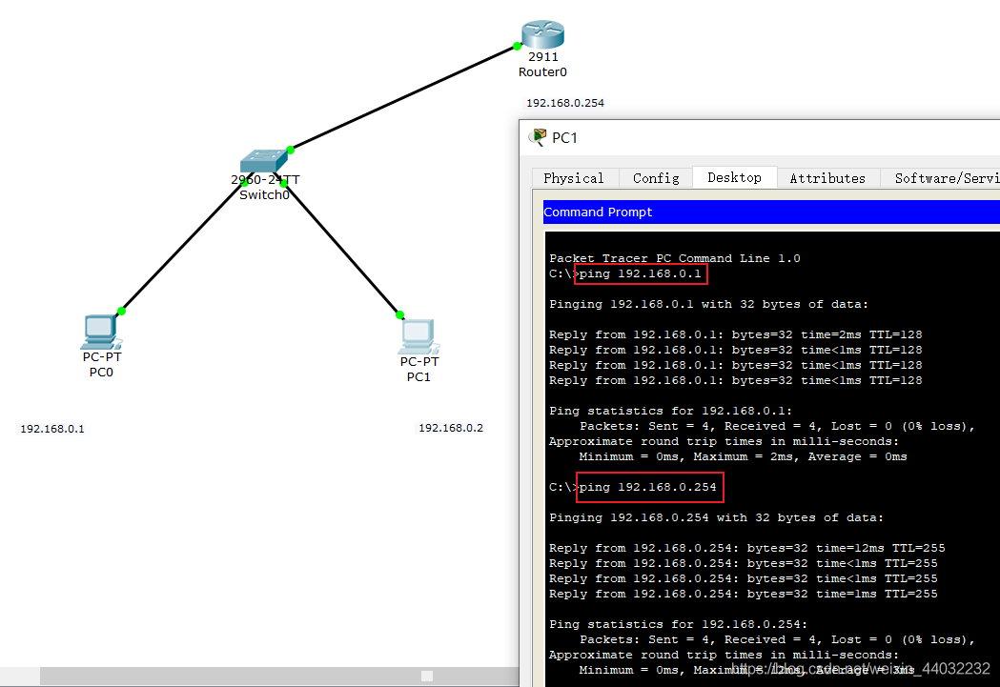
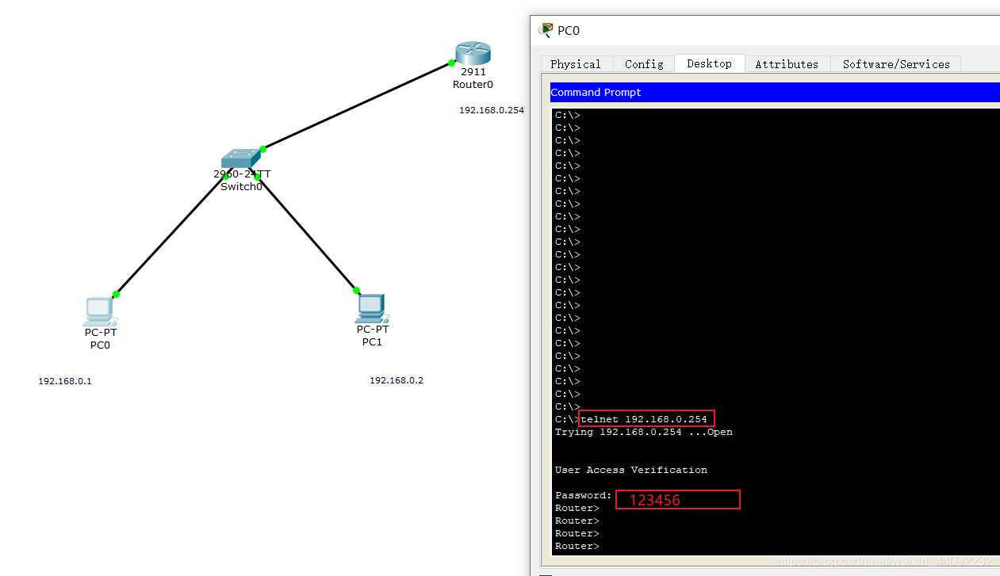
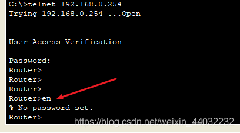
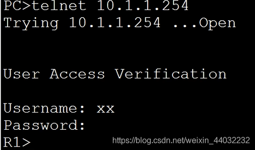

# 远程控制三层设备

## 一、三层设备配置IP

### 1、三层设备接口默认是关闭状态需要手动开启



### 2、给三层设备配置ip地址

```bash
Router(config)#int g0/1             切换到g0接口
Router(config-if)#ip add 192.168.0.254 255.255.255.0    配置ip+子网掩码
Router(config-if)#no shut           手动开启接口
123
```

### 3、查看接口状态



### 4、分别ping另一台PC和网关



## 二、远程控制三层设备(telnet)

### 1、路由器开启telnet服务

```bash
Router(config)#
Router(config)#line vty 0?    可以同时开启多少终端  最大连接数
<0-15>  
Router(config)#line vty 0 4   可以同时有5个人连接这台路由器
Router(config-line)#password 123456    设置telnet密码
Router(config-line)#login     开启验证
Router(config-line)#exit
1234567
```

### 2、远程PC通过telnet服务连接路由器



### 3、当远程控制路由器时必须配置特权密码



### 4、路由器上配置特权密码

```bash
Router(config)#enable password 123
1
```

### 5、远程PC连接时输入特权密码

```bash
Router>en
Password: 123
Router#
123
```

> telnet明文传输，不安全，容易被截获

## 三、远程控制三层设备(SSH)

### 1、查看支持哪些传输方式

```bash
Router(config)#line vty 0 4
Router(config-line)#tran
Router(config-line)#transport in
Router(config-line)#transport input ?
  all     All protocols
  none    No protocols
  ssh     TCP/IP SSH protocol
  telnet  TCP/IP Telnet protocol
12345678
```

### 2、修改主机名并创建域名

用rsa密钥算法生成密钥对 要求必须有主机名和域名（随便起）

```bash
Router(config)#ho r1
r1(config)#ip domain-name aa.bb.com
12
```

### 3、生成密钥对

```bash
r1(config)#crypto key generate rsa
The name for the keys will be: r1.aa.bb.com
Choose the size of the key modulus in the range of 360 to 2048 for your
  General Purpose Keys. Choosing a key modulus greater than 512 may take
  a few minutes.

How many bits in the modulus [512]: 
% Generating 512 bit RSA keys, keys will be non-exportable...[OK]
12345678
```

### 4、PC端远程连接路由器

```bash
C:\>ssh -l r1 192.168.0.254
Open
Password: 123456
r1>enable 
Password: 123
r1#configure terminal 
Enter configuration commands, one per line.  End with CNTL/Z.
r1(config)#
12345678
```

## 四、远程连接账户设置

### 1、创建主机名和域名

```bash
Router(config)#ho r1
r1(config)#ip domain-name aa.bb.com
12
```

### 2、生成密钥对

**ssh时需要此条配置**

```bash
r1(config)#crypto key generate rsa
The name for the keys will be: r1.aa.bb.com
Choose the size of the key modulus in the range of 360 to 2048 for your
  General Purpose Keys. Choosing a key modulus greater than 512 may take
  a few minutes.

How many bits in the modulus [512]: 
% Generating 512 bit RSA keys, keys will be non-exportable...[OK]
12345678
```

### 3、终端设置最大连接数

```bash
r1(config)#line vty 0 4
1
```

### 4、开启服务

```bash
Router(config-line)#transport input ?
  all     All protocols
  none    No protocols
  ssh     TCP/IP SSH protocol
  telnet  TCP/IP Telnet protocol
12345
```

### 5、开启本地身份验证

```bash
r1(config-line)#login local   开启本地数据库身份验证
1
```

### 6、在全局配置模式下设置账户

```bash
r1(config)#username xx password 123456
r1(config)#username oo password 654321
12
```

### 7、远程登陆验证需要输入用户名和密码



**二层接口默认开启**
**三层接口默认管理down（人工关闭）**