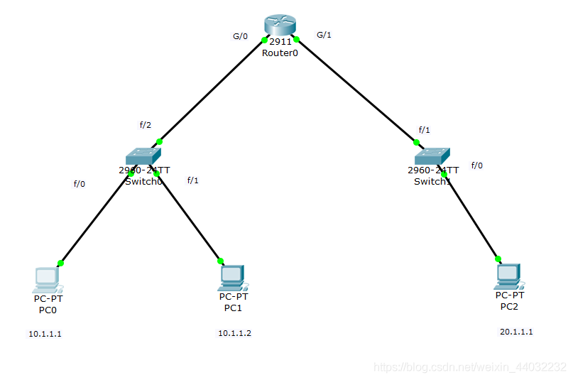
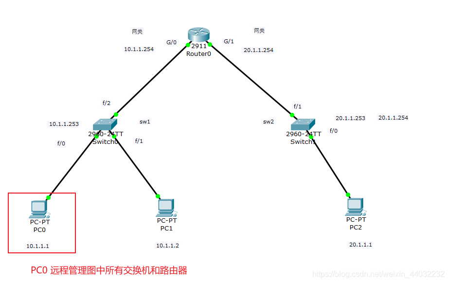
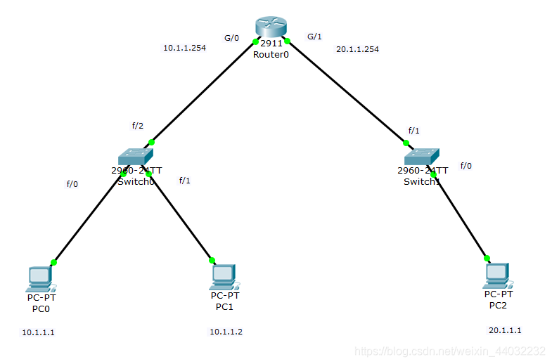

# 一台PC远程管理多台交换机和一台路由器

## 一、基本架构图



## 二、需求



1. PC之间互相ping通，PC和网关能够ping通。
2. PC0可以同时远程管理(telnet/ssh)两台交换机和路由器。

## 三、实现过程

> 交换机接口默认是开启的
> 路由器接口默认是关闭的，需要人工开启

### 1、直通线连接所有设备

连接端口及IP规划如下图所示
PC配置对应的IP及网关IP


### 2、手工开启路由器的连接端口并配置IP

1）查看端口列表

```bash
Router(config)#do show ip int b
Interface              IP-Address      OK? Method Status                Protocol 
GigabitEthernet0/0     unassigned      YES unset  administratively down down 
GigabitEthernet0/1     unassigned      YES unset  administratively down down 
GigabitEthernet0/2     unassigned      YES unset  administratively down down 
Vlan1                  unassigned      YES unset  administratively down down
123456
```

2）根据上图连接的端口情况分别进入g0/g1手工开启

```bash
Router(config)#int g0/0
Router(config-if)#no shut
Router(config-if)#do show ip int b
Router(config-if)#ip add 10.1.1.254 255.255.255.0    配置网关IP
Interface              IP-Address      OK? Method Status                Protocol 
GigabitEthernet0/0     10.1.1.254      YES unset  up                    up 
GigabitEthernet0/1     unassigned      YES unset  administratively down down 
GigabitEthernet0/2     unassigned      YES unset  administratively down down 
Vlan1                  unassigned      YES unset  administratively down down

Router(config-if)#exit
Router(config)#int g0/1
Router(config-if)#no shut
Router(config)#do show ip int b
Router(config-if)#ip add 20.1.1.254 255.255.255.0    配置网关IP
Interface              IP-Address      OK? Method Status                Protocol 
GigabitEthernet0/0     10.1.1.254      YES manual up                    up 
GigabitEthernet0/1     20.1.1.254      YES manual up                    up 
GigabitEthernet0/2     unassigned      YES unset  administratively down down 
Vlan1                  unassigned      YES unset  administratively down down
1234567891011121314151617181920
```

> 以上操作做完所有设备均以连通，可以互PING进行检测

### 3、路由器开启远程服务

1）路由器配置

```bash
Router>en
Router#conf t
Enter configuration commands, one per line.  End with CNTL/Z.
Router(config)#ho r1       设置主机名
r1(config)#ip domain-name aa.bb.com     设置域名  远程连接必须设置域名和主机名
r1(config)#crypto key generate rsa      开启rsa加密认证
r1(config)#line vty 0 4                 开启终端 最大连接数5
r1(config-line)#login local             开启本地身份验证模式
r1(config-line)#transport input all     开启所有远程服务telnet/ssh
r1(config)#username xx password 123456  设置本地账户
r1(config)#enable password 123          特权密码  (远程登陆必须设置)
1234567891011
```

2）PC远程连接测试
**telnet**

```bash
C:\>telnet 10.1.1.254
Trying 10.1.1.254 ...Open

User Access Verification

Username: xx

Password: 
r1>
r1>
r1>exit
1234567891011
```

**ssh**

```bash
C:\>ssh -l xx 10.1.1.254
Open
Password: 

r1>
12345
```

### 4、给交换机中的虚拟接口配置IP

想要跨网段管理交换机，需要给交换机配置网关

1）交换机配置

```bash
Switch>en
Switch#conf t
Switch(config)#hostname sw2
sw2(config)#int vlan 1
sw2(config-if)#ip add 20.1.1.253 255.255.255.0
sw2(config-if)#no shut
sw2(config-if)#do show ip int b
Interface              IP-Address      OK? Method Status                Protocol 
FastEthernet0/1        unassigned      YES manual up                    up 
FastEthernet0/2        unassigned      YES manual up                    up 
FastEthernet0/3        unassigned      YES manual up                    up 
FastEthernet0/4        unassigned      YES manual down                  down 
FastEthernet0/5        unassigned      YES manual down                  down 
FastEthernet0/6        unassigned      YES manual down                  down 
FastEthernet0/7        unassigned      YES manual down                  down 
FastEthernet0/8        unassigned      YES manual down                  down 
FastEthernet0/9        unassigned      YES manual down                  down 
FastEthernet0/10       unassigned      YES manual down                  down 
FastEthernet0/11       unassigned      YES manual down                  down 
FastEthernet0/12       unassigned      YES manual down                  down 
FastEthernet0/13       unassigned      YES manual down                  down 
FastEthernet0/14       unassigned      YES manual down                  down 
FastEthernet0/15       unassigned      YES manual down                  down 
FastEthernet0/16       unassigned      YES manual down                  down 
FastEthernet0/17       unassigned      YES manual down                  down 
FastEthernet0/18       unassigned      YES manual down                  down 
FastEthernet0/19       unassigned      YES manual down                  down 
FastEthernet0/20       unassigned      YES manual down                  down 
FastEthernet0/21       unassigned      YES manual down                  down 
FastEthernet0/22       unassigned      YES manual down                  down 
FastEthernet0/23       unassigned      YES manual down                  down 
FastEthernet0/24       unassigned      YES manual down                  down 
GigabitEthernet0/1     unassigned      YES manual down                  down 
GigabitEthernet0/2     unassigned      YES manual down                  down 
Vlan1                  20.1.1.253      YES manual up                    up

sw2(config)#line vty 0 4
sw2(config-line)#login local
sw2(config-line)#transport input all
sw2(config)#username oo password 123456
sw2(config)#ip default-gateway 20.1.1.254    配置网关
sw2(config)#enable password 123              配置特权密码 (远程登陆必须设置)
123456789101112131415161718192021222324252627282930313233343536373839404142
```

2）PC0测试连接
PC0管理s2交换机

```bash
C:\>telnet 20.1.1.253
Trying 20.1.1.253 ...Open

User Access Verification

Username: yy

Password: 
sw2>
sw2>
12345678910
```

> 这里需要注意：
> 远程连接时必须配置特权密码，不管是几层设备
> sw2(config)#enable password 123

**交换机**

```bash
C:\>telnet 20.1.1.253
Trying 20.1.1.253 ...Open

User Access Verification

Username: yy

Password: 123456 交换机本地账户密码
sw2>en
sw2>enable 
Password: 123    特权密码
sw2#
sw2#
12345678910111213
```

**路由器**

```bash
C:\>telnet 20.1.1.254
Trying 20.1.1.254 ...Open

User Access Verification

Username: xx

Password: 
r1>en
r1>enable 
Password: 
r1#
123456789101112
```


