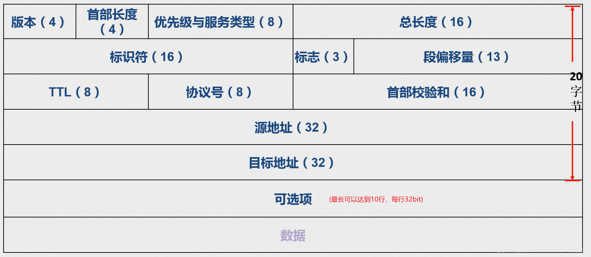

# IP包头分析

## 一、IP数据包格式

除可选项外一共5行，每一行占32位(bit)，IP包头最小长度占20字节，其中可选项的最大长度可占上图的10行，每行32bit，占40字节，也就是说IP包头的长度是可变的：`IP包头的最小长度为20字节，最大长度为60字节`，通常可选项轻易不会被使用到，所以`通常IP包头为20字节`。

## 二、字段详解

1、版本（4）：IP协议的版本，目前的IP协议版本号为4，下一代IP协议版本号为6。

2、首部长度（4）：主要是用来标识有没有启动可选项，IP报头的长度。固定部分的长度（20字节）和可变部分的长度之和。共占4位。最大为1111，即10进制的15，代表IP报头的最大长度可以为15个32bits（4字节），也就是最长可为15*4=60字节，除去固定部分的长度20字节，可变部分的长度最大为40字节。`也就是说如果长度=20代表没有启动可选项，如果20<长度<60代表启动了可选项。`

3、优先级与服务类型（8）：Qos与Tos，前三个bit代表优先级，中间四个bit代表服务类型，最后一个bit没有被启用(保留使用，方便以后扩展开发)

4、总长度（16）：整个报文长度，上三层数据的总长度。`IP包头长度+TCP/UDP包头长度+数据长度`

例子：
假设用户要发送的数据有4000字节。
由下图所示，一个数据帧的MTU值最大为1500字节（这其中还包含IP包头的20字节），那么4000个字节要怎么发送呢？

IP分片技术：

由上图所示完成了在数据大于1500字节时采用分片发送，但是当数据发送到目标端之后怎么才能知道哪个帧是第一条数据呢？如果每条数据帧没有标记先后顺序，在到达目标端之后数据无法重组。

5、段偏移量（13）：`标记每个数据分片的先后顺序。`段偏移量的值永远是0/1480的倍数。
数据发送至目标端，目标端根据IP包头中的段偏移量的值来区分先后顺序，进行数据重组。

6、标识符（16）：唯一的标识主机发送的每一分数据报。通常每发送一个报文，它的值加一。当IP报文长度超过传输网络的MTU（最大传输单元）时必须分片，这个标识字段的值被复制到所有数据分片的标识字段中，使得这些分片在达到最终目的地时可以依照标识字段的内容重新组成原先的数据。`对分片进行分类的`由发送端生成，目标端根据标识符进行数据的重组。

由上图所示，如果只有偏移量的话那么目标端无法确定分片数据来自哪个数据包，无法对分片数据进行重组。

7、标志（3）：R、DF、MF三位。目前只有后两位有效，DF位：为1表示不分片，为0表示分片。MF：为1表示“还有更多分片”，为0表示这是最后一片。`用来标识数据包是否被分片及是否是最后一个分片`

8、生存时间TTL（8）：IP报文所允许通过的路由器的最大数量。每经过一个路由器，TTL减1，当为0时，路由器将该数据报丢弃。TTL 字段是由发送端初始设置一个 8 bit字段.推荐的初始值由分配数字 RFC 指定，当前值为 64。发送 ICMP 回显应答时经常把 TTL 设为最大值 255。可以根据TTL值判断目标是什么主机(Windows/Liunx)，TTL>100为Windows主机，TTL<100为Liunx主机。`防止数据包在网络中永久循环`

访问百度一共经过了14个路由器
`tracert www.baidu.com`

9、协议号（8）：指出IP报文携带的数据使用的是那种协议，以便目标主机的IP层能知道要将数据报上交到哪个进程（不同的协议有专门不同的进程处理）。和端口号类似，此处采用协议号，TCP的协议号为6，UDP的协议号为17。ICMP的协议号为1，IGMP的协议号为2。

10、首部校验和（16）：计算IP头部的校验和，检查IP报头的完整性。

11、源地址（32）：标识IP数据报的源端地址。

12、目标地址（32）：标识IP数据报的目标地址。